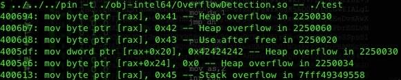

# Dinosn
**https://twitter.com/Dinosn/status/560895536585539585 _at 2015-01-29 20:21:31_**
<blockquote>
Analysis of CVE-2014-4113 (Windows Privilege Escalation Vulnerability) http://t.co/0sb4JiRg3Y
</blockquote>

* http://www.exploit-db.com/download_pdf/35937

<table><tr>
<td>Quotes: <code>0</code></td>
<td>Replies: <code>0</code></td>
<td>Retweets: <code>24</code></td>
<td>Favorites: <code>16</code></td>
</table></tr>

---

# taviso
**https://twitter.com/taviso/status/553323713433575425 _at 2015-01-08 22:53:48_**
<blockquote>
Well that didn't take long ;-) https://t.co/8cLYIK6IKZ =&gt; http://t.co/6Mu2Z2ljmo
</blockquote>

* https://github.com/WhiteHatSecurity/Aviator/blob/master/src/chrome/browser/championconfig/ConnectionControl/ConnectionControlManager.cc#L166
* http://www.google.com/;/Applications/Calculator.app/Contents/MacOS/Calculator;:Error138

<table><tr>
<td>Quotes: <code>0</code></td>
<td>Replies: <code>10</code></td>
<td>Retweets: <code>124</code></td>
<td>Favorites: <code>114</code></td>
</table></tr>

---

# riusksk
**https://twitter.com/riusksk/status/551929841079951361 _at 2015-01-05 02:35:03_**
<blockquote>
PoC Pintools for program analysis，include format_string、overflow、uaf detect 、taint analysis：https://t.co/UIZBKBhc3G http://t.co/hbbkAu379u
</blockquote>

* https://github.com/JonathanSalwan/PinTools

<table><tr>
<td></td>
</table></tr>
<table><tr>
<td>Quotes: <code>0</code></td>
<td>Replies: <code>0</code></td>
<td>Retweets: <code>45</code></td>
<td>Favorites: <code>75</code></td>
</table></tr>

---

