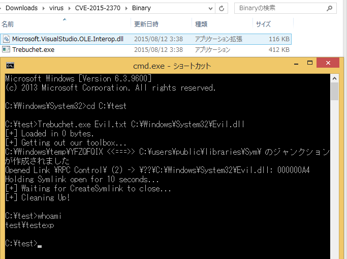

# AndroidTamer
**https://twitter.com/AndroidTamer/status/637139461793562625 _at 2015-08-28 05:47:39_**
<blockquote>
PoC for CVE-2015-1528 : Heap Corruption due to Integer Overflow in Android libcutils - https://t.co/Jx51QHpPpA by @oldfresher via @_jsoo_
</blockquote>

* https://github.com/secmob/PoCForCVE-2015-1528

<table><tr>
<td>Quotes: <code>0</code></td>
<td>Replies: <code>0</code></td>
<td>Retweets: <code>5</code></td>
<td>Favorites: <code>1</code></td>
</tr></table>

---

# oldfresher
**https://twitter.com/oldfresher/status/637075269858127872 _at 2015-08-28 01:32:35_**
<blockquote>
Release PoC for CVE-2015-1528 https://t.co/80ngJwuKVq, Exploiting Heap Corruption due to Integer Overflow in Android libcutils
</blockquote>

* https://goo.gl/87ZsWz

<table><tr>
<td>Quotes: <code>0</code></td>
<td>Replies: <code>0</code></td>
<td>Retweets: <code>45</code></td>
<td>Favorites: <code>69</code></td>
</tr></table>

---

# opexxx
**https://twitter.com/opexxx/status/632918960300818432 _at 2015-08-16 14:16:53_**
<blockquote>
very nice! Tested MS15-076 (CVE-2015-2370) Privilege Escalation on x64 Windows 8.1, poc : http://t.co/B7Qa5RMoGs http://t.co/uFXiBr9q0T…
</blockquote>

* http://bit.ly/1KpqmiQ

<table><tr>
<td></td>
</table></tr>
<table><tr>
<td>Quotes: <code>0</code></td>
<td>Replies: <code>0</code></td>
<td>Retweets: <code>41</code></td>
<td>Favorites: <code>33</code></td>
</tr></table>

---

# ithurricanept
**https://twitter.com/ithurricanept/status/632068001999654912 _at 2015-08-14 05:55:29_**
<blockquote>
very nice! Tested MS15-076 (CVE-2015-2370) Privilege Escalation on x64 Windows 8.1,  poc : https://t.co/VqAV1z6Bew http://t.co/s00fvu8KeX
</blockquote>

* https://www.exploit-db.com/exploits/37768/

<table><tr>
<td></td>
</table></tr>
<table><tr>
<td>Quotes: <code>0</code></td>
<td>Replies: <code>0</code></td>
<td>Retweets: <code>99</code></td>
<td>Favorites: <code>113</code></td>
</tr></table>

---

# Dinosn
**https://twitter.com/Dinosn/status/632041032864145408 _at 2015-08-14 04:08:19_**
<blockquote>
NetRipper - Smart traffic sniffing for penetration testers https://t.co/aKHv6AznoB
</blockquote>

* https://github.com/NytroRST/NetRipper

<table><tr>
<td>Quotes: <code>0</code></td>
<td>Replies: <code>1</code></td>
<td>Retweets: <code>75</code></td>
<td>Favorites: <code>90</code></td>
</tr></table>

---

