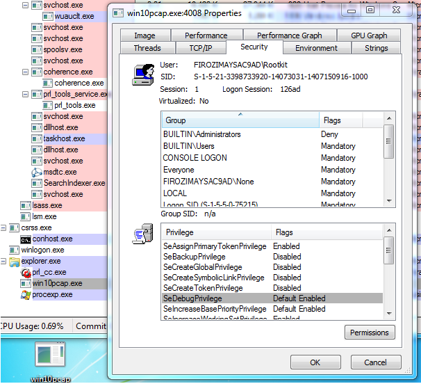

# binitamshah
**https://twitter.com/binitamshah/status/660096057171271680 _at 2015-10-30 14:08:58_**
<blockquote>
Exploiting CVE-2015-1642 Microsoft Office CTaskSymbol Use-After-Free
Vulnerability : https://t.co/2PFgGcnXVe (pdf)
</blockquote>

* https://goo.gl/awKJeX

<table><tr>
<td>Quotes: <code>0</code></td>
<td>Replies: <code>0</code></td>
<td>Retweets: <code>50</code></td>
<td>Favorites: <code>63</code></td>
</tr></table>

---

# kutyacica
**https://twitter.com/kutyacica/status/657629009363226624 _at 2015-10-23 18:45:48_**
<blockquote>
Long Term Exploitation https://t.co/HP1QyDtCMS 4G security gaps based on 3GPP specs. slides discuss IMSI catching, tracking, RCE, DoS, etc.
</blockquote>

* https://github.com/puppykitten/lte

<table><tr>
<td>Quotes: <code>0</code></td>
<td>Replies: <code>1</code></td>
<td>Retweets: <code>83</code></td>
<td>Favorites: <code>121</code></td>
</tr></table>

---

# R00tkitSMM
**https://twitter.com/R00tkitSMM/status/654948676909961216 _at 2015-10-16 09:15:07_**
<blockquote>
Exploit to my 0day in Win10pcap Driver (Local Privilege escalation https://t.co/116jpl37jB ) @Dinosn @Ivanlef0u http://t.co/jkR0WZBzlO
</blockquote>

* https://github.com/Rootkitsmm/Win10Pcap-Exploit

<table><tr>
<td></td>
</table></tr>
<table><tr>
<td>Quotes: <code>0</code></td>
<td>Replies: <code>0</code></td>
<td>Retweets: <code>246</code></td>
<td>Favorites: <code>201</code></td>
</tr></table>

---

