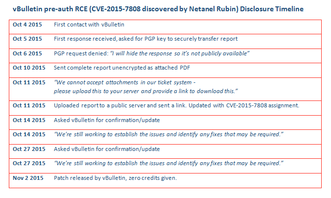

# muntopia
**https://twitter.com/muntopia/status/666917064951463936 _at 2015-11-18 09:53:13_**
<blockquote>
CVE-2015-7254 Added to #Mth3l3m3nt https://t.co/QjoECppX8N … Huawei Directory Traversal Attack cc:@AfricaHackon @devteev @zykyky
</blockquote>

* https://github.com/alienwithin/OWASP-mth3l3m3nt-framework/commit/55e0a9bb38c5d29eaf6034ba9a8c1c0e07c3d2fc

<table><tr>
<td>Quotes: <code>0</code></td>
<td>Replies: <code>0</code></td>
<td>Retweets: <code>3</code></td>
<td>Favorites: <code>1</code></td>
</tr></table>

---

# jifa
**https://twitter.com/jifa/status/662263195348951040 _at 2015-11-05 13:40:24_**
<blockquote>
Disclosure timeline of @vBulletin pre-auth RCE (CVE-2015-7808 by Netanel Rubin). I kid you not. https://t.co/JQQO48a0fH
</blockquote>

<table><tr>
<td></td>
</table></tr>
<table><tr>
<td>Quotes: <code>1</code></td>
<td>Replies: <code>3</code></td>
<td>Retweets: <code>50</code></td>
<td>Favorites: <code>27</code></td>
</tr></table>

---

