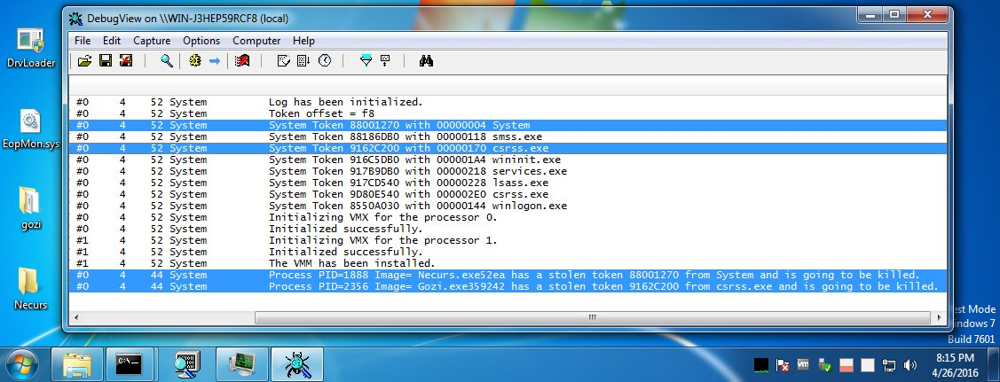

# standa_t
**https://twitter.com/standa_t/status/725166422217859074 _at Wed Apr 27 03:35:22 +0000 2016_**
<blockquote>
EopMon, an elevation of privilege detector based on HyperPlatform vs Necurs (CVE-2015-0057) and Gozi (CVE-2015-2387) https://t.co/x7mNEEAryh
</blockquote>

<table><tr>
<td></td>
</tr></table>
<table><tr>
<td>Quotes: <code>0</code></td>
<td>Replies: <code>4</code></td>
<td>Retweets: <code>22</code></td>
<td>Favorites: <code>35</code></td>
</tr></table>

---

# wpawlikowski
**https://twitter.com/wpawlikowski/status/720539071060295681 _at Thu Apr 14 09:07:56 +0000 2016_**
<blockquote>
Nice writeup of CVE-2015-6086 (Microsoft Internet Explorer 9/10/11) ASLR bypass: https://t.co/2eSWmMywhr #vulndev #exploit #security
</blockquote>

* https://github.com/payatu/CVE-2015-6086/blob/master/OOB_Read_IE10_IE11_ASLR_Bypass.html

<table><tr>
<td>Quotes: <code>0</code></td>
<td>Replies: <code>0</code></td>
<td>Retweets: <code>29</code></td>
<td>Favorites: <code>36</code></td>
</tr></table>

---

