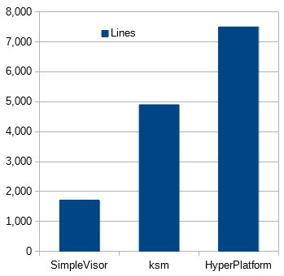

# standa_t
**https://twitter.com/standa_t/status/753472697955254273 _at 2016-07-14 06:14:24_**
<blockquote>
Another great resource for learning VMM for Windows. It's about half a size of HyperPlatform https://t.co/oJEX9j3rZO https://t.co/tQwmpNwvgV
</blockquote>

* https://github.com/asamy/ksm

<table><tr>
<td></td>
</table></tr>
<table><tr>
<td>Quotes: <code>0</code></td>
<td>Replies: <code>0</code></td>
<td>Retweets: <code>18</code></td>
<td>Favorites: <code>40</code></td>
</tr></table>

---

# mdowd
**https://twitter.com/mdowd/status/751218160242597888 _at 2016-07-08 00:55:41_**
<blockquote>
Nice presentation on a Chrome sandbox escape on Android by @oldfresher at mosec2016: https://t.co/7ij3JMIIWu
</blockquote>

* https://github.com/secmob/mosec2016

<table><tr>
<td>Quotes: <code>0</code></td>
<td>Replies: <code>0</code></td>
<td>Retweets: <code>26</code></td>
<td>Favorites: <code>51</code></td>
</tr></table>

---

