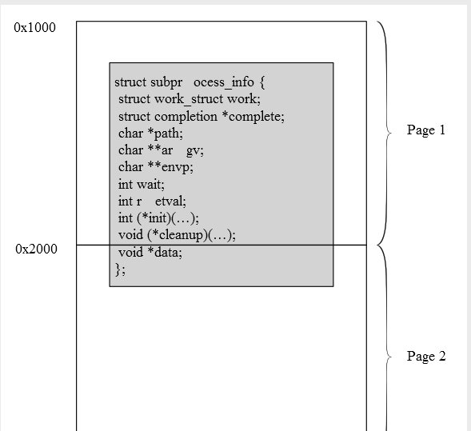

# gsuberland
**https://twitter.com/gsuberland/status/792024494265204738 _at 2016-10-28 15:25:29_**
<blockquote>
I feel like this isn't getting the HOLY SHIT it deserves.

Kernel ASLR bypass on Intel processors. Any OS or VM.

https://t.co/cTKTuLsMpu
</blockquote>

* https://github.com/sslab-gatech/DrK

<table><tr>
<td>Quotes: <code>9</code></td>
<td>Replies: <code>4</code></td>
<td>Retweets: <code>154</code></td>
<td>Favorites: <code>148</code></td>
</tr></table>

---

# _odisseus
**https://twitter.com/_odisseus/status/787979764443348992 _at 2016-10-17 11:33:10_**
<blockquote>
Exploiting #Linux kernel heap using a real #UAF method against CVE-2016-6187 vulnerability. cc: @binitamshah https://t.co/yvmII8B6sz https://t.co/TvXm5IHw2s
</blockquote>

* https://cyseclabs.com/blog/cve-2016-6187-heap-off-by-one-exploit

<table><tr>
<td></td>
</table></tr>
<table><tr>
<td>Quotes: <code>1</code></td>
<td>Replies: <code>1</code></td>
<td>Retweets: <code>90</code></td>
<td>Favorites: <code>99</code></td>
</tr></table>

---

