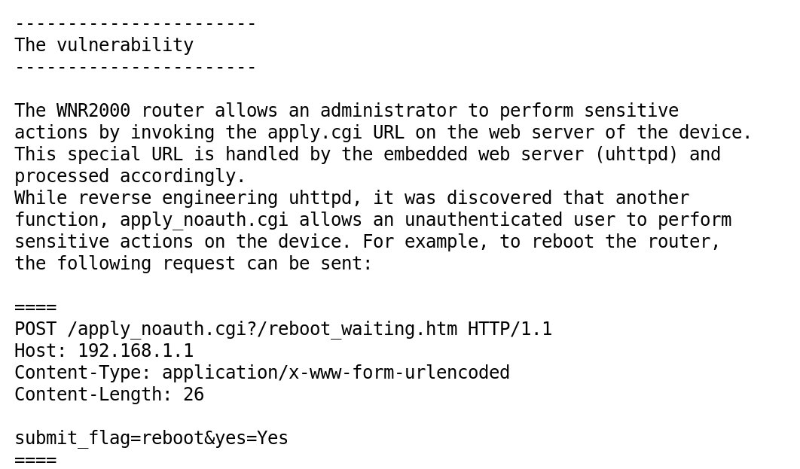
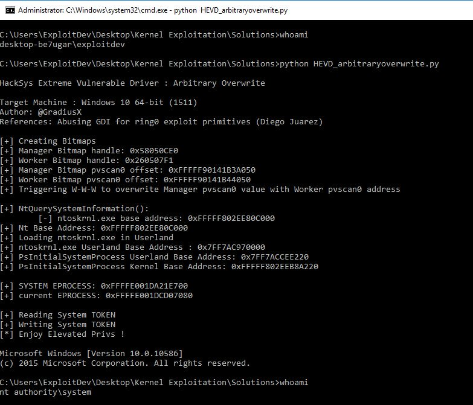

# _odisseus
**https://twitter.com/_odisseus/status/826374351775739904 _at 2017-01-31 10:19:33_**
<blockquote>
RCE and admin credential disclosure in #NETGEAR WNR2000 [0-day]: Full disclosure here. H/T @FabioNatalucci https://t.co/jv7ImpSYyn https://t.co/fwhAjoB3Nb
</blockquote>

* http://seclists.org/fulldisclosure/2017/Jan/97?utm_source=feedburner&utm_medium=twitter&utm_campaign=Feed%3A+seclists%2FFullDisclosure+%28Full+Disclosure%29

<table><tr>
<td></td>
</table></tr>
<table><tr>
<td>Quotes: <code>1</code></td>
<td>Replies: <code>1</code></td>
<td>Retweets: <code>35</code></td>
<td>Favorites: <code>28</code></td>
</tr></table>

---

# binitamshah
**https://twitter.com/binitamshah/status/822415116968820736 _at 2017-01-20 12:06:58_**
<blockquote>
ArbitraryOverwrite exploit for Win10 x64 v1511 w/ SMEP bypass :  https://t.co/F4poJg2HyB cc @GradiusX https://t.co/NWjPb0FVld
</blockquote>

* https://github.com/GradiusX/HEVD-Python-Solutions/blob/master/Win10%20x64%20v1511/HEVD_arbitraryoverwrite.py

<table><tr>
<td></td>
</table></tr>
<table><tr>
<td>Quotes: <code>2</code></td>
<td>Replies: <code>0</code></td>
<td>Retweets: <code>145</code></td>
<td>Favorites: <code>198</code></td>
</tr></table>

---

# GradiusX
**https://twitter.com/GradiusX/status/819704708810108930 _at 2017-01-13 00:36:46_**
<blockquote>
Added ArbitraryOverwrite exploit for Win10 x64 v1511 w/ SMEP bypass

https://t.co/GBPq3mCwJE https://t.co/K0JLQQXccN
</blockquote>

* https://github.com/GradiusX/HEVD-Python-Solutions/blob/master/Win10%20x64%20v1511/HEVD_arbitraryoverwrite.py

<table><tr>
<td></td>
</table></tr>
<table><tr>
<td>Quotes: <code>2</code></td>
<td>Replies: <code>1</code></td>
<td>Retweets: <code>134</code></td>
<td>Favorites: <code>140</code></td>
</tr></table>

---

# elttam
**https://twitter.com/elttam/status/818674414925422594 _at 2017-01-10 04:22:45_**
<blockquote>
https://t.co/mVC5zKs8zg quick write-up / PoC for a firejail TOCTOU sandbox escape vuln we reported back in Nov 2016.
</blockquote>

* https://github.com/elttam/advisories/tree/master/firejail

<table><tr>
<td>Quotes: <code>0</code></td>
<td>Replies: <code>0</code></td>
<td>Retweets: <code>28</code></td>
<td>Favorites: <code>43</code></td>
</tr></table>

---

# fjserna
**https://twitter.com/fjserna/status/817077350206582784 _at 2017-01-05 18:36:35_**
<blockquote>
https://t.co/9AZdeKPUFb targets the stack return addresses for CFG bypass.  var threadCtxPtr = Read64(chakraBase.add(0x735EA8));
</blockquote>

* https://github.com/theori-io/chakra-2016-11/blob/master/exploit/FillFromPrototypes_TypeConfusion.html

<table><tr>
<td>Quotes: <code>0</code></td>
<td>Replies: <code>1</code></td>
<td>Retweets: <code>27</code></td>
<td>Favorites: <code>35</code></td>
</tr></table>

---

