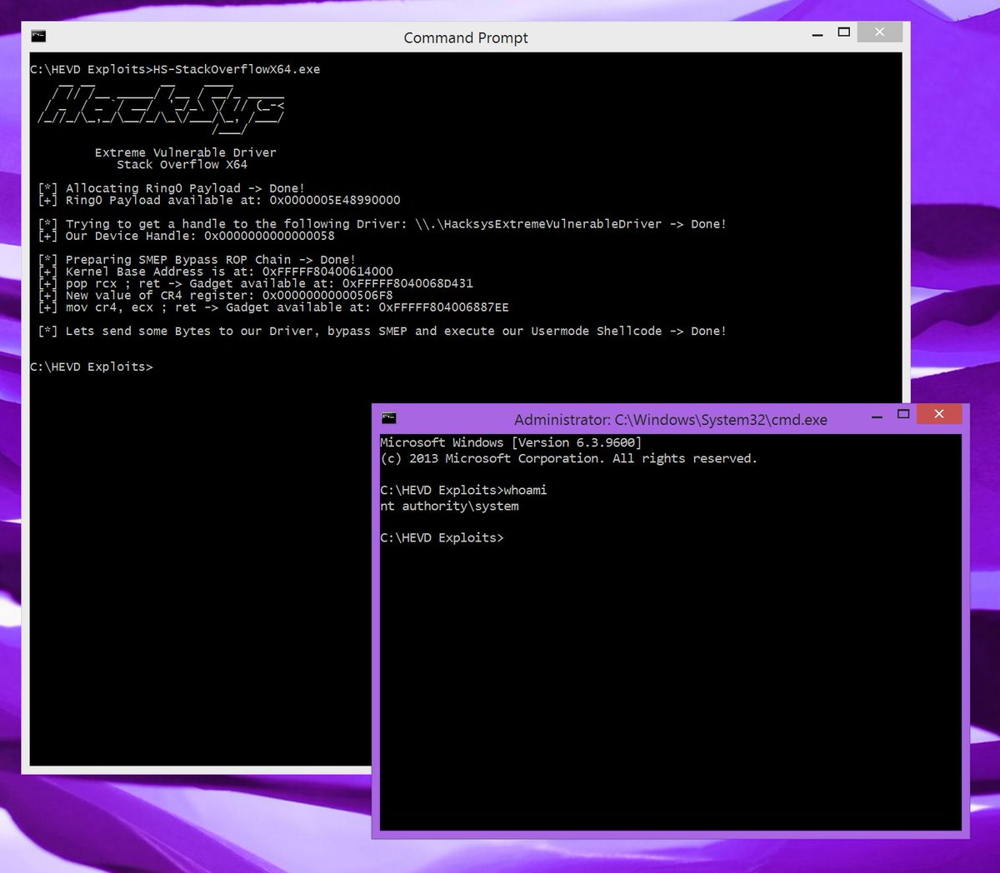

# Cneelis
**https://twitter.com/Cneelis/status/836171849272819712 _at 2017-02-27 11:11:18_**
<blockquote>
x64 version of my HEVD StackOverflow exploit with SMEP Bypass https://t.co/XHAeJrF9W7
Works on Windows 8.1 x64 (ver 6.3.9600) @HackSysTeam https://t.co/a3L64ORKI0
</blockquote>

* https://github.com/Cn33liz/HSEVD-StackOverflowX64/blob/master/HS-StackOverflowX64/HS-StackOverflowX64.c

<table><tr>
<td></td>
</table></tr>
<table><tr>
<td>Quotes: <code>0</code></td>
<td>Replies: <code>3</code></td>
<td>Retweets: <code>102</code></td>
<td>Favorites: <code>123</code></td>
</table></tr>

---

# msuiche
**https://twitter.com/msuiche/status/836072979092107266 _at 2017-02-27 04:38:26_**
<blockquote>
CVE-2017-6074 (local root exploit for the vulnerability in the DCCP) + SMEP/SMAP bypass https://t.co/Yw5LdO7HfY
</blockquote>

* https://github.com/xairy/kernel-exploits/tree/master/CVE-2017-6074

<table><tr>
<td>Quotes: <code>0</code></td>
<td>Replies: <code>0</code></td>
<td>Retweets: <code>21</code></td>
<td>Favorites: <code>21</code></td>
</table></tr>

---

