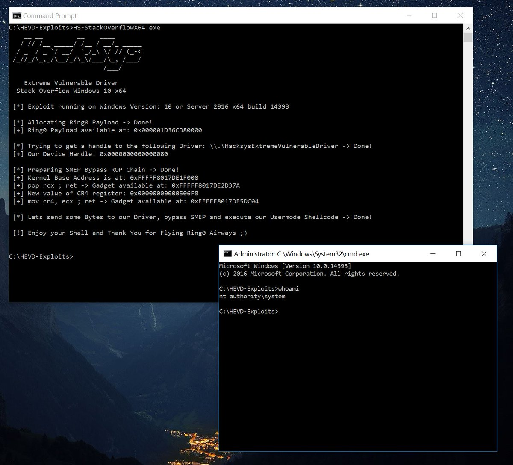
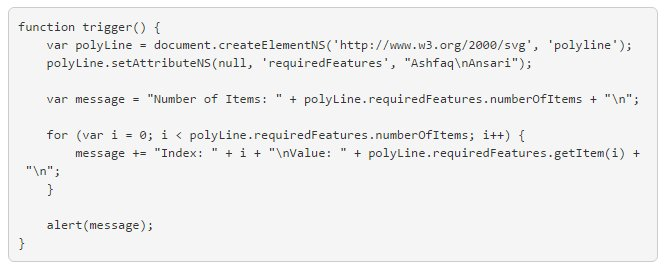

# zenhumany
**https://twitter.com/zenhumany/status/847598026956742656 _at 2017-03-30 23:54:51_**
<blockquote>
my black hat Asia 2017 slides,https://t.co/6fdewMwk1x, and bypass ASLR in Microsoft Edge video. https://t.co/qjhRkIU5K1
</blockquote>

* https://github.com/zenhumany/blackhat_asia_2017
* https://youtu.be/Kwh5N-Ni9Lo

<table><tr>
<td>Quotes: <code>0</code></td>
<td>Replies: <code>0</code></td>
<td>Retweets: <code>71</code></td>
<td>Favorites: <code>92</code></td>
</table></tr>

---

# _hg8_
**https://twitter.com/_hg8_/status/846700240786853889 _at 2017-03-28 12:27:22_**
<blockquote>
Remote code execution on Windows Server 2003 R2 (ScStoragePathFromUrl buffer overflow). CVE-2017-7269 Python PoC : https://t.co/DKbOSCuciJ
</blockquote>

* https://github.com/edwardz246003/IIS_exploit

<table><tr>
<td>Quotes: <code>0</code></td>
<td>Replies: <code>0</code></td>
<td>Retweets: <code>0</code></td>
<td>Favorites: <code>0</code></td>
</table></tr>

---

# TheRegister
**https://twitter.com/TheRegister/status/846400603890757634 _at 2017-03-27 16:36:43_**
<blockquote>
Hope you’re not running Windows Server 2003 R2 facing the internet – remote code execution exploit now public https://t.co/8bpJobvSgj
</blockquote>

* https://github.com/edwardz246003/IIS_exploit

<table><tr>
<td>Quotes: <code>4</code></td>
<td>Replies: <code>2</code></td>
<td>Retweets: <code>37</code></td>
<td>Favorites: <code>19</code></td>
</table></tr>

---

# MsftSecIntel
**https://twitter.com/MsftSecIntel/status/846377562397904899 _at 2017-03-27 15:05:10_**
<blockquote>
In-depth analysis of zero-day exploit for CVE-2017-0005 reveals #Windows10 resilience https://t.co/vwyJgjGZ6d
</blockquote>

* http://ow.ly/w6qj30ahLeP

<table><tr>
<td>Quotes: <code>1</code></td>
<td>Replies: <code>1</code></td>
<td>Retweets: <code>42</code></td>
<td>Favorites: <code>52</code></td>
</table></tr>

---

# Cneelis
**https://twitter.com/Cneelis/status/840161667174547456 _at 2017-03-10 11:25:25_**
<blockquote>
Updated my x64 HEVD StackOverflow exploit with SMEP Bypass. 
https://t.co/XHAeJrF9W7
Now works on Windows 10 x64 v1607 @HackSysTeam https://t.co/HkNMbob4LJ
</blockquote>

* https://github.com/Cn33liz/HSEVD-StackOverflowX64/blob/master/HS-StackOverflowX64/HS-StackOverflowX64.c

<table><tr>
<td></td>
</table></tr>
<table><tr>
<td>Quotes: <code>2</code></td>
<td>Replies: <code>2</code></td>
<td>Retweets: <code>91</code></td>
<td>Favorites: <code>123</code></td>
</table></tr>

---

# _samdb_
**https://twitter.com/_samdb_/status/837085408601194496 _at 2017-03-01 23:41:28_**
<blockquote>
Updated my windows address leak repo with some corrections + SystemBigPoolInformation and HMValidateHandle leaks https://t.co/SEWLEXNsn8
</blockquote>

* https://github.com/sam-b/windows_kernel_address_leaks

<table><tr>
<td>Quotes: <code>0</code></td>
<td>Replies: <code>0</code></td>
<td>Retweets: <code>40</code></td>
<td>Favorites: <code>39</code></td>
</table></tr>

---

# ptracesecurity
**https://twitter.com/ptracesecurity/status/836975623423807488 _at 2017-03-01 16:25:13_**
<blockquote>
From Crash to Exploit: CVE-2015-6086 – Out of Bound Read/ASLR Bypass https://t.co/K6VayYCrX8 #ExploitDev #Vuln #CyberSecurity #InfoSec https://t.co/1MS0BbPYxa
</blockquote>

* http://payatu.com/from-crash-to-exploit/

<table><tr>
<td></td>
</table></tr>
<table><tr>
<td>Quotes: <code>0</code></td>
<td>Replies: <code>0</code></td>
<td>Retweets: <code>32</code></td>
<td>Favorites: <code>37</code></td>
</table></tr>

---

