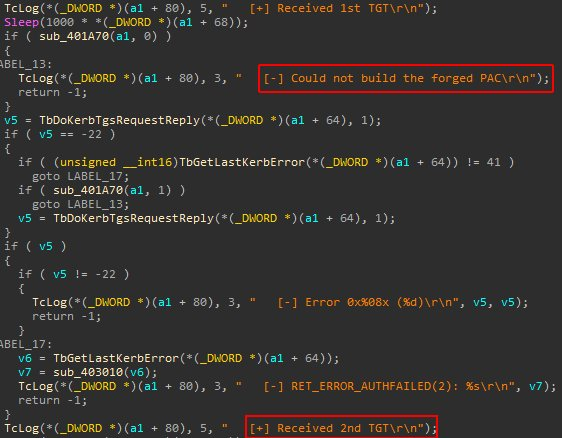
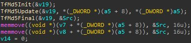
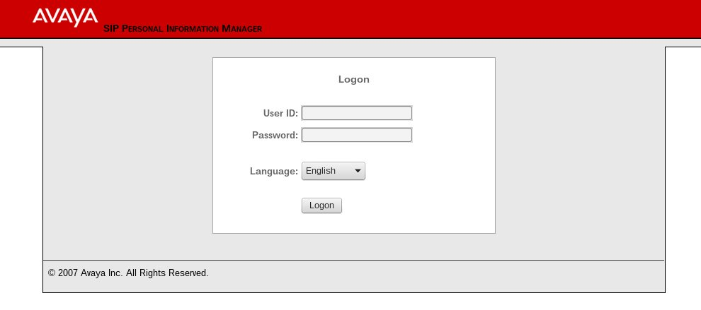

# gentilkiwi
**https://twitter.com/gentilkiwi/status/852928424960241664 _at 2017-04-14 16:55:57_**
<blockquote>
#ShadowBrokers ESKIMOROLL (Eskimoroll-1.1.1.exe) is MS14-068 exploit with MD5 "signature"
https://t.co/WIeLJtxJfT
PE timestamp: 20110311 😱 https://t.co/AWmMtI0SsI
</blockquote>

* https://github.com/misterch0c/shadowbroker/tree/master/windows/exploits

<table><tr>
<td></td>
<td></td>
</table></tr>
<table><tr>
<td>Quotes: <code>9</code></td>
<td>Replies: <code>5</code></td>
<td>Retweets: <code>183</code></td>
<td>Favorites: <code>225</code></td>
</tr></table>

---

# cyb3rops
**https://twitter.com/cyb3rops/status/852621468475305985 _at 2017-04-13 20:36:13_**
<blockquote>
VMware vCenter Unauthenticated RCE using CVE-2017-5638 (Apache Struts 2 RCE) https://t.co/VagBwkiwGh
</blockquote>

* http://blog.gdssecurity.com/labs/2017/4/13/vmware-vcenter-unauthenticated-rce-using-cve-2017-5638-apach.html

<table><tr>
<td>Quotes: <code>2</code></td>
<td>Replies: <code>2</code></td>
<td>Retweets: <code>145</code></td>
<td>Favorites: <code>135</code></td>
</tr></table>

---

# maldevel
**https://twitter.com/maldevel/status/852102880685326337 _at 2017-04-12 10:15:32_**
<blockquote>
CVE-2017-3881 Cisco Catalyst RCE Proof-Of-Concept - 
https://t.co/a7XjzOINpl https://t.co/G3GxMWwePQ
</blockquote>

* https://artkond.com/2017/04/10/cisco-catalyst-remote-code-execution/
* https://github.com/artkond/cisco-rce/

<table><tr>
<td>Quotes: <code>0</code></td>
<td>Replies: <code>0</code></td>
<td>Retweets: <code>38</code></td>
<td>Favorites: <code>37</code></td>
</tr></table>

---

# Dinosn
**https://twitter.com/Dinosn/status/851866599472717824 _at 2017-04-11 18:36:38_**
<blockquote>
[PDF] CVE-2017-0199 (Office RTF RCE) sample analysis, IOCs and mitigation advice  https://t.co/Okf7WHtaop
</blockquote>

* https://github.com/nccgroup/Cyber-Defence/blob/master/Technical%20Notes/Office%20zero-day%20(April%202017)/2017-04%20Office%20OLE2Link%20zero-day%20v0.4.pdf

<table><tr>
<td>Quotes: <code>0</code></td>
<td>Replies: <code>0</code></td>
<td>Retweets: <code>32</code></td>
<td>Favorites: <code>40</code></td>
</tr></table>

---

# reddit_sec_bot
**https://twitter.com/reddit_sec_bot/status/851864937601277957 _at 2017-04-11 18:30:02_**
<blockquote>
[PDF] CVE-2017-0199 (Office RTF RCE) sample analysis, IOCs and mitigation advice https://t.co/WvyabM52gf
</blockquote>

* https://github.com/nccgroup/Cyber-Defence/blob/master/Technical%20Notes/Office%20zero-day%20(April%202017)/2017-04%20Office%20OLE2Link%20zero-day%20v0.4.pdf

<table><tr>
<td>Quotes: <code>0</code></td>
<td>Replies: <code>0</code></td>
<td>Retweets: <code>3</code></td>
<td>Favorites: <code>3</code></td>
</tr></table>

---

# RevBits
**https://twitter.com/RevBits/status/850879984050876416 _at 2017-04-09 01:16:11_**
<blockquote>
Our early analysis: "epichero" is a 0-day exploit (RCE) for Avaya Call Server in NSA leak https://t.co/MB5Fypyo11 #TheShadowBrokers #EQGRP https://t.co/ecJmFdZHT7
</blockquote>

* https://github.com/x0rz/EQGRP/tree/master/Linux/bin/epichero

<table><tr>
<td></td>
</table></tr>
<table><tr>
<td>Quotes: <code>0</code></td>
<td>Replies: <code>1</code></td>
<td>Retweets: <code>33</code></td>
<td>Favorites: <code>35</code></td>
</tr></table>

---

