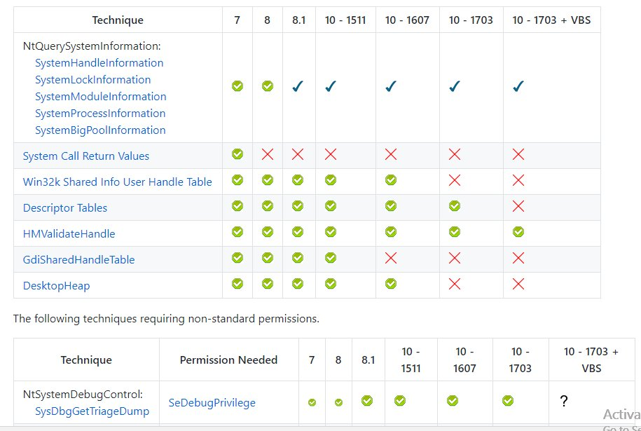
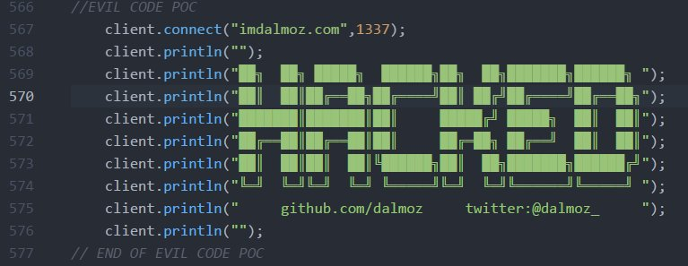

# HaifeiLi
**https://twitter.com/HaifeiLi/status/887426940604268544 _at 2017-07-18 21:40:44_**
<blockquote>
Detailed analysis of the mysterious Windows Search zero-day attack CVE-2017-8543 patched last month. https://t.co/196iaBv0fz, in Chinese.
</blockquote>

* http://mp.weixin.qq.com/s/X2JcKCpCH4exDoxMK5oN5Q

<table><tr>
<td>Quotes: <code>1</code></td>
<td>Replies: <code>3</code></td>
<td>Retweets: <code>52</code></td>
<td>Favorites: <code>82</code></td>
</table></tr>

---

# TheHackersNews
**https://twitter.com/TheHackersNews/status/887276364549705728 _at 2017-07-18 11:42:24_**
<blockquote>
Critical Remote Code Execution (CVE-2017-6753) Vulnerability in #Cisco WebEx Browser Extensions for Chrome &amp; Firefox https://t.co/3CePZWkbk9
</blockquote>

* http://thehackernews.com/2017/07/cisco-webex-vulnerability.html

<table><tr>
<td>Quotes: <code>4</code></td>
<td>Replies: <code>2</code></td>
<td>Retweets: <code>168</code></td>
<td>Favorites: <code>120</code></td>
</table></tr>

---

# hosselot
**https://twitter.com/hosselot/status/886858802598957056 _at 2017-07-17 08:03:10_**
<blockquote>
Mozilla Firefox DEP and ASLR Bypass Using ASM.JS JIT-Spray (CVE-2017-5375 and CVE-2017-5400):
https://t.co/VfRN44aIjk
</blockquote>

* https://rh0dev.github.io/blog/2017/the-return-of-the-jit/

<table><tr>
<td>Quotes: <code>1</code></td>
<td>Replies: <code>0</code></td>
<td>Retweets: <code>53</code></td>
<td>Favorites: <code>64</code></td>
</table></tr>

---

# TheHackersNews
**https://twitter.com/TheHackersNews/status/885899918040195072 _at 2017-07-14 16:32:54_**
<blockquote>
Eternal Synergy Exploit Analysis (Windows SMB Remote Code Execution Vulnerability: CVE-2017-0143) https://t.co/zbSJb4kEgE
</blockquote>

* https://blogs.technet.microsoft.com/srd/2017/07/13/eternal-synergy-exploit-analysis/

<table><tr>
<td>Quotes: <code>1</code></td>
<td>Replies: <code>0</code></td>
<td>Retweets: <code>83</code></td>
<td>Favorites: <code>59</code></td>
</table></tr>

---

# hosselot
**https://twitter.com/hosselot/status/884683648880005120 _at 2017-07-11 07:59:53_**
<blockquote>
Git commit for Pwn2Own Microsoft Edge Chakra ArrayBuffer Use-After-Free vulnerability (CVE-2017-0236):
https://t.co/BHZmGipTWD
</blockquote>

* https://github.com/Microsoft/ChakraCore/pull/2959/commits/1ae7e3ce95515758b4cd7215cb4e48539a0f4031

<table><tr>
<td>Quotes: <code>0</code></td>
<td>Replies: <code>0</code></td>
<td>Retweets: <code>30</code></td>
<td>Favorites: <code>44</code></td>
</table></tr>

---

# _samdb_
**https://twitter.com/_samdb_/status/883268200447827968 _at 2017-07-07 10:15:23_**
<blockquote>
Also slowly been adding to and tidying the windows kernel address leaks repo https://t.co/SEWLEXNsn8 https://t.co/A5iotFEHJQ
</blockquote>

* https://github.com/sam-b/windows_kernel_address_leaks

<table><tr>
<td></td>
</table></tr>
<table><tr>
<td>Quotes: <code>2</code></td>
<td>Replies: <code>1</code></td>
<td>Retweets: <code>54</code></td>
<td>Favorites: <code>87</code></td>
</table></tr>

---

# dalmoz_
**https://twitter.com/dalmoz_/status/881607697724047360 _at 2017-07-02 20:17:09_**
<blockquote>
Uploaded my PoC code on "evil" firmware for the Sonoff Basic, exploitation through MQTT -&gt; RCE by firmware upgrade: https://t.co/8cQIwu0m3b https://t.co/8qzEM0NkeO
</blockquote>

* https://github.com/dalmoz/sonoff-evil

<table><tr>
<td></td>
</table></tr>
<table><tr>
<td>Quotes: <code>0</code></td>
<td>Replies: <code>3</code></td>
<td>Retweets: <code>85</code></td>
<td>Favorites: <code>148</code></td>
</table></tr>

---

