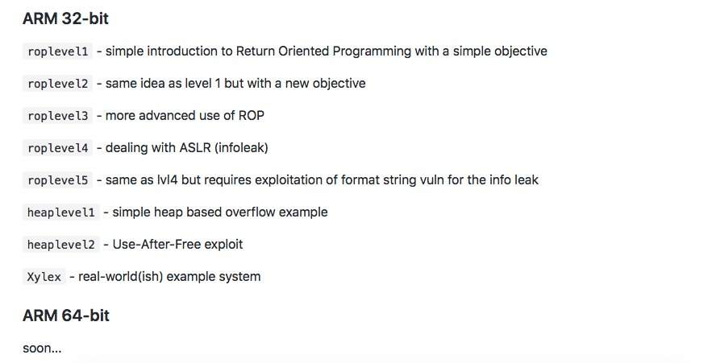
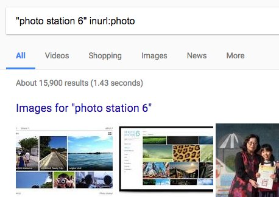

# bellis1000
**https://twitter.com/bellis1000/status/914104325252755456 _at 2017-09-30 12:27:09_**
<blockquote>
The first ARM64 versions of my exploit-me challenges will be available soon on the Github repo https://t.co/2lSckMQzR8 'ROP64_1' will be a 64-bit version of the 32-bit ROPLevel4 (involving exploiting a stack buffer overflow w/ASLR bypass) #infosec #exploitdev https://t.co/SDok7fXrAw
</blockquote>

* https://github.com/Billy-Ellis/Exploit-Challenges/blob/master/README.md

<table><tr>
<td></td>
<td></td>
</table></tr>
<table><tr>
<td>Quotes: <code>0</code></td>
<td>Replies: <code>3</code></td>
<td>Retweets: <code>76</code></td>
<td>Favorites: <code>157</code></td>
</table></tr>

---

# JosephBialek
**https://twitter.com/JosephBialek/status/913470106675560448 _at 2017-09-28 18:26:59_**
<blockquote>
Uploaded my BountyCraft slides, the State of Kernel-Mode RCE Defense: https://t.co/k47c0TppbU
</blockquote>

* https://github.com/Microsoft/MSRC-Security-Research/blob/master/presentations/2017_07_BountyCraft/BountyCraft2017_JosephBialek_State_Of_Kernel_RCE_Mitigations.pdf

<table><tr>
<td>Quotes: <code>4</code></td>
<td>Replies: <code>4</code></td>
<td>Retweets: <code>142</code></td>
<td>Favorites: <code>216</code></td>
</table></tr>

---

# KacperSzurek
**https://twitter.com/KacperSzurek/status/909629760388714496 _at 2017-09-18 04:06:49_**
<blockquote>
#Synology Photo Station 6.7.3 unauthenticated #RCE Chain of 4 bugs #CVE-2017-11151-11155 https://t.co/2GNABXfwyf https://t.co/AhOkxUsg2A
</blockquote>

* https://security.szurek.pl/synology-photo-station-673-3432-remote-code-execution.html

<table><tr>
<td></td>
</table></tr>
<table><tr>
<td>Quotes: <code>1</code></td>
<td>Replies: <code>1</code></td>
<td>Retweets: <code>36</code></td>
<td>Favorites: <code>50</code></td>
</table></tr>

---

# x0rz
**https://twitter.com/x0rz/status/909355342542327809 _at 2017-09-17 09:56:23_**
<blockquote>
Analysis of CVE-2017-5638 (Apache Struts 2 RCE) https://t.co/un4wVq9B1B #equihax #equifax #vulnerability https://t.co/fHTTuGrdRA
</blockquote>

* https://blog.gdssecurity.com/labs/2017/3/27/an-analysis-of-cve-2017-5638.html

<table><tr>
<td></td>
</table></tr>
<table><tr>
<td>Quotes: <code>3</code></td>
<td>Replies: <code>0</code></td>
<td>Retweets: <code>114</code></td>
<td>Favorites: <code>159</code></td>
</table></tr>

---

# Dinosn
**https://twitter.com/Dinosn/status/908767937074515973 _at 2017-09-15 19:02:14_**
<blockquote>
Exploit toolkit for CVE-2017-8759 - Microsoft .NET Framework RCE (Builder + listener + video tutorial) https://t.co/uz05I6NUzv
</blockquote>

* http://seclists.org/fulldisclosure/2017/Sep/33

<table><tr>
<td>Quotes: <code>0</code></td>
<td>Replies: <code>0</code></td>
<td>Retweets: <code>32</code></td>
<td>Favorites: <code>48</code></td>
</table></tr>

---

# nickstadb
**https://twitter.com/nickstadb/status/907673124686229505 _at 2017-09-12 18:31:51_**
<blockquote>
Running ColdFusion? Update now. Critical unauthenticated RCE (as SYSTEM by default) https://t.co/gYkePFxXyl CVE-2017-11283 &amp; CVE-2017-11284
</blockquote>

* https://helpx.adobe.com/security/products/coldfusion/apsb17-30.html

<table><tr>
<td>Quotes: <code>2</code></td>
<td>Replies: <code>5</code></td>
<td>Retweets: <code>64</code></td>
<td>Favorites: <code>84</code></td>
</table></tr>

---

# Dinosn
**https://twitter.com/Dinosn/status/906205737893945348 _at 2017-09-08 17:20:59_**
<blockquote>
CVE-2017-9805: Analysis of Apache Struts RCE Vulnerability in REST Plugin https://t.co/B7cGt2NQU0
</blockquote>

* https://www.imperva.com/blog/2017/09/cve-2017-9805-analysis-of-apache-struts-rce-vulnerability-in-rest-plugin/

<table><tr>
<td>Quotes: <code>0</code></td>
<td>Replies: <code>0</code></td>
<td>Retweets: <code>30</code></td>
<td>Favorites: <code>54</code></td>
</table></tr>

---

# l4wio
**https://twitter.com/l4wio/status/905279567060926464 _at 2017-09-06 04:00:42_**
<blockquote>
Achievement unlocked!
My first UAF on Chrome
CVE-2017-5111
https://t.co/dFWRURLjdv
</blockquote>

* https://chromereleases.googleblog.com/2017/09/stable-channel-update-for-desktop.html?m=1

<table><tr>
<td>Quotes: <code>2</code></td>
<td>Replies: <code>4</code></td>
<td>Retweets: <code>41</code></td>
<td>Favorites: <code>142</code></td>
</table></tr>

---

