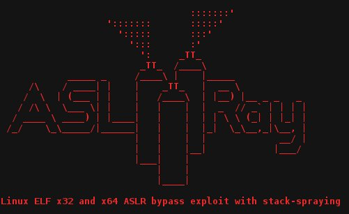

# binitamshah
**https://twitter.com/binitamshah/status/923885722527866880 _at 2017-10-27 12:14:55_**
<blockquote>
ASLRay : Linux ELF x32 and x64 ASLR bypass exploit with stack-spraying : https://t.co/JpPdACopS5 cc @cryptolok
</blockquote>

* https://github.com/cryptolok/ASLRay

<table><tr>
<td>Quotes: <code>1</code></td>
<td>Replies: <code>0</code></td>
<td>Retweets: <code>81</code></td>
<td>Favorites: <code>120</code></td>
</table></tr>

---

# HaifeiLi
**https://twitter.com/HaifeiLi/status/923607702588100608 _at 2017-10-26 17:50:10_**
<blockquote>
It's finally out.. Quick analysis on the latest Office #0day CVE-2017-11826. https://t.co/OqtuEbYxQx.
</blockquote>

* https://securingtomorrow.mcafee.com/mcafee-labs/analyzing-microsoft-office-zero-day-exploit-cve-2017-11826-memory-corruption-vulnerability

<table><tr>
<td>Quotes: <code>0</code></td>
<td>Replies: <code>1</code></td>
<td>Retweets: <code>25</code></td>
<td>Favorites: <code>38</code></td>
</table></tr>

---

# PhysicalDrive0
**https://twitter.com/PhysicalDrive0/status/923568124213022721 _at 2017-10-26 15:12:54_**
<blockquote>
Analyzing Microsoft Office Zero-Day Exploit CVE-2017-11826: Memory Corruption Vulnerability https://t.co/f5N4W7NvJy
</blockquote>

* https://securingtomorrow.mcafee.com/mcafee-labs/analyzing-microsoft-office-zero-day-exploit-cve-2017-11826-memory-corruption-vulnerability/

<table><tr>
<td>Quotes: <code>1</code></td>
<td>Replies: <code>0</code></td>
<td>Retweets: <code>49</code></td>
<td>Favorites: <code>45</code></td>
</table></tr>

---

# nickstadb
**https://twitter.com/nickstadb/status/922118171573800960 _at 2017-10-22 15:11:18_**
<blockquote>
Analysis of CVE-2017-12628 - Apache James Deserialization LPE/potential RCE https://t.co/Sfv2U25UBm
</blockquote>

* https://nickbloor.co.uk/2017/10/22/analysis-of-cve-2017-12628/

<table><tr>
<td>Quotes: <code>3</code></td>
<td>Replies: <code>2</code></td>
<td>Retweets: <code>68</code></td>
<td>Favorites: <code>98</code></td>
</table></tr>

---

# cryptolok
**https://twitter.com/cryptolok/status/919241053219229697 _at 2017-10-14 16:38:40_**
<blockquote>
#Linux #Hacking #0day exploit to bypass ASLR #infosec #CyberSecurity 
https://t.co/I1GyqK2FWt https://t.co/ryF7lEFwoQ
</blockquote>

* https://github.com/cryptolok/ASLRay

<table><tr>
<td></td>
</table></tr>
<table><tr>
<td>Quotes: <code>7</code></td>
<td>Replies: <code>8</code></td>
<td>Retweets: <code>207</code></td>
<td>Favorites: <code>241</code></td>
</table></tr>

---

# hosselot
**https://twitter.com/hosselot/status/914754961170460672 _at 2017-10-02 07:32:32_**
<blockquote>
Google Chrome sandbox escape due to use of invalid PP_Instance (CVE-2017-5092) by Yuan Deng:
https://t.co/4dGrjktiEL
</blockquote>

* https://bugs.chromium.org/p/chromium/issues/detail?id=733549

<table><tr>
<td>Quotes: <code>0</code></td>
<td>Replies: <code>0</code></td>
<td>Retweets: <code>49</code></td>
<td>Favorites: <code>66</code></td>
</table></tr>

---

