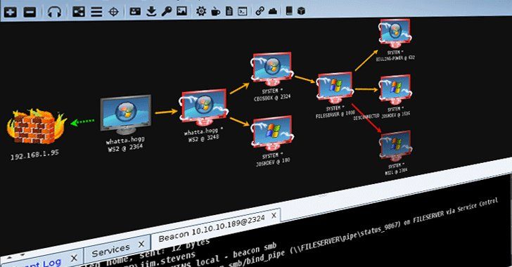
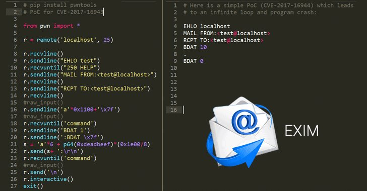
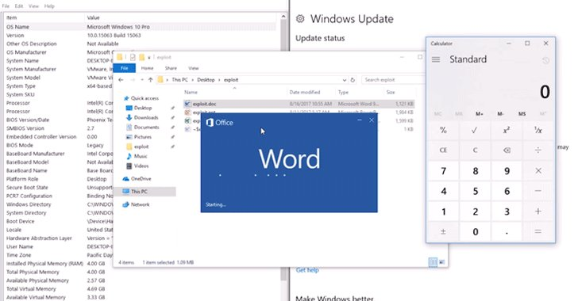

# unix_root
**https://twitter.com/unix_root/status/935937694621978628 _at 2017-11-29 18:25:09_**
<blockquote>
Hackers Exploit Recently Disclosed Microsoft Office RCE Vulnerability (CVE-2017-11882) to Install Cobalt Backdoor On Computers.

https://t.co/l8ZE3OfRZK

Make sure you have the latest MS Office update installed. https://t.co/XexazLBM5F
</blockquote>

* https://thehackernews.com/2017/11/cobalt-strike-malware.html

<table><tr>
<td></td>
</table></tr>
<table><tr>
<td>Quotes: <code>2</code></td>
<td>Replies: <code>0</code></td>
<td>Retweets: <code>34</code></td>
<td>Favorites: <code>46</code></td>
</tr></table>

---

# TheHackersNews
**https://twitter.com/TheHackersNews/status/935814102886227968 _at 2017-11-29 10:14:03_**
<blockquote>
Hackers Exploit Recently Disclosed Microsoft Office RCE Vulnerability (CVE-2017-11882) to Install Cobalt Backdoor On Computers.

https://t.co/ZtE0RwXJ7p

Make sure you have the latest MS Office update installed. https://t.co/ZOz8MVoQw9
</blockquote>

* https://thehackernews.com/2017/11/cobalt-strike-malware.html

<table><tr>
<td></td>
</table></tr>
<table><tr>
<td>Quotes: <code>7</code></td>
<td>Replies: <code>4</code></td>
<td>Retweets: <code>211</code></td>
<td>Favorites: <code>180</code></td>
</tr></table>

---

# _odisseus
**https://twitter.com/_odisseus/status/935168817239592960 _at 2017-11-27 15:29:55_**
<blockquote>
About CVE-2017-16943 and CVE-2017-16944, RCE and DoS in #Exim Mail Server: according to @shodanhq there are more than 400K vulnerable servers with ESMTP CHUNKING extension enabled.
Happy hunting.  ¯\_(ツ)_/¯ https://t.co/aKjENM7J44
</blockquote>

<table><tr>
<td></td>
</table></tr>
<table><tr>
<td>Quotes: <code>3</code></td>
<td>Replies: <code>0</code></td>
<td>Retweets: <code>26</code></td>
<td>Favorites: <code>38</code></td>
</tr></table>

---

# TheHackersNews
**https://twitter.com/TheHackersNews/status/935086979028541440 _at 2017-11-27 10:04:43_**
<blockquote>
Critical Vulnerabilities Found in 'Exim' Mail Transfer Agent (MTA) Application:

■ Remote Code Execution (CVE-2017-16943) — PoC Released
■ Denial Of Service (CVE-2017-16944)  — PoC Released

Patch Update — Exim version 4.90 RC2

https://t.co/Cv6FVvRJIL https://t.co/5Ary4wLtCQ
</blockquote>

* https://thehackernews.com/2017/11/exim-internet-mailer-flaws.html

<table><tr>
<td></td>
</table></tr>
<table><tr>
<td>Quotes: <code>4</code></td>
<td>Replies: <code>4</code></td>
<td>Retweets: <code>208</code></td>
<td>Favorites: <code>143</code></td>
</tr></table>

---

# x0rz
**https://twitter.com/x0rz/status/932982763569012737 _at 2017-11-21 14:43:19_**
<blockquote>
CVE-2017-11853: Windows Kernel stack memory disclosure in win32k!xxxSendMenuSelect (bypass kernel ASLR) https://t.co/xn44FEjxYN #windows #vulnerability
</blockquote>

* https://bugs.chromium.org/p/project-zero/issues/detail?id=1362

<table><tr>
<td>Quotes: <code>1</code></td>
<td>Replies: <code>0</code></td>
<td>Retweets: <code>16</code></td>
<td>Favorites: <code>31</code></td>
</tr></table>

---

# xer0dayz
**https://twitter.com/xer0dayz/status/930830262505684997 _at 2017-11-15 16:10:03_**
<blockquote>
Published 3 new exploits: https://t.co/voBzJFNflI

Vulnserver.exe GMON SEH Overflow Exploit
FreeFloat FTP Server HOST Buffer Overflow (ASLR Bypass)
CoolPlayer+ Portable 2.19.6 Stack Overflow (ASLR Bypass)

#netsec #hackers
</blockquote>

* https://github.com/1N3/Exploits

<table><tr>
<td>Quotes: <code>0</code></td>
<td>Replies: <code>0</code></td>
<td>Retweets: <code>27</code></td>
<td>Favorites: <code>32</code></td>
</tr></table>

---

# TheHackersNews
**https://twitter.com/TheHackersNews/status/930739383094988801 _at 2017-11-15 10:08:55_**
<blockquote>
17-Year-Old Microsoft Office RCE Vulnerability (CVE-2017-11882) Allows Hackers to Install Malware On Windows PCs Without User Interaction

https://t.co/AUA99KSVs9 https://t.co/IEcsoKpgPd
</blockquote>

* https://thehackernews.com/2017/11/microsoft-office-rce-exploit.html

<table><tr>
<td></td>
</table></tr>
<table><tr>
<td>Quotes: <code>16</code></td>
<td>Replies: <code>7</code></td>
<td>Retweets: <code>446</code></td>
<td>Favorites: <code>365</code></td>
</tr></table>

---

# GossiTheDog
**https://twitter.com/GossiTheDog/status/930732664981684224 _at 2017-11-15 09:42:14_**
<blockquote>
There’s a big difference between Microsoft’s statements about CVE-2017-11882 (Office exploit) vs the reporters. The reporters claim they have an exploit, Microsoft say no exploit. MS only say Important, reporters say no prompt RCE.
</blockquote>

<table><tr>
<td>Quotes: <code>1</code></td>
<td>Replies: <code>4</code></td>
<td>Retweets: <code>20</code></td>
<td>Favorites: <code>52</code></td>
</tr></table>

---

# evdokimovds
**https://twitter.com/evdokimovds/status/930570227330568192 _at 2017-11-14 22:56:46_**
<blockquote>
RCE (CVE-2017-11882):
⚠️all the MS Office versions
⚠️all the MS Windows versions
⚠️x86/x86_64
⚠️does not require any interaction with a user
⚠️does not interrupt a user’s work with MS Office
❗️with stable exploitation ;) https://t.co/fWeggTRLoJ
</blockquote>

* https://twitter.com/_embedi_/status/930498911676108801

<table><tr>
<td>Quotes: <code>26</code></td>
<td>Replies: <code>2</code></td>
<td>Retweets: <code>445</code></td>
<td>Favorites: <code>500</code></td>
</tr></table>

---

# x0rz
**https://twitter.com/x0rz/status/930425235358314496 _at 2017-11-14 13:20:37_**
<blockquote>
Chrome &lt; 62 uxss exploit (CVE-2017-5124) https://t.co/OyOnzEQau4 #Chrome #0day #vulnerability
</blockquote>

* https://github.com/Bo0oM/CVE-2017-5124

<table><tr>
<td>Quotes: <code>1</code></td>
<td>Replies: <code>1</code></td>
<td>Retweets: <code>44</code></td>
<td>Favorites: <code>81</code></td>
</tr></table>

---

# HackwithGithub
**https://twitter.com/HackwithGithub/status/928962950148304896 _at 2017-11-10 12:30:01_**
<blockquote>
kernelpop -
#Kernel privilege escalation enumeration and #exploitation #framework 
https://t.co/N6n5E43CZN
</blockquote>

* https://github.com/spencerdodd/kernelpop

<table><tr>
<td>Quotes: <code>0</code></td>
<td>Replies: <code>1</code></td>
<td>Retweets: <code>11</code></td>
<td>Favorites: <code>32</code></td>
</tr></table>

---

