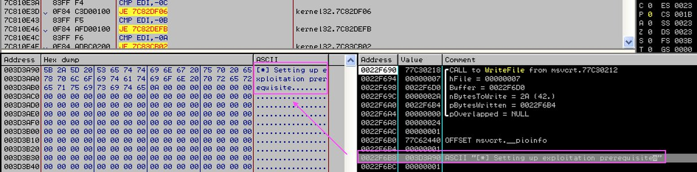
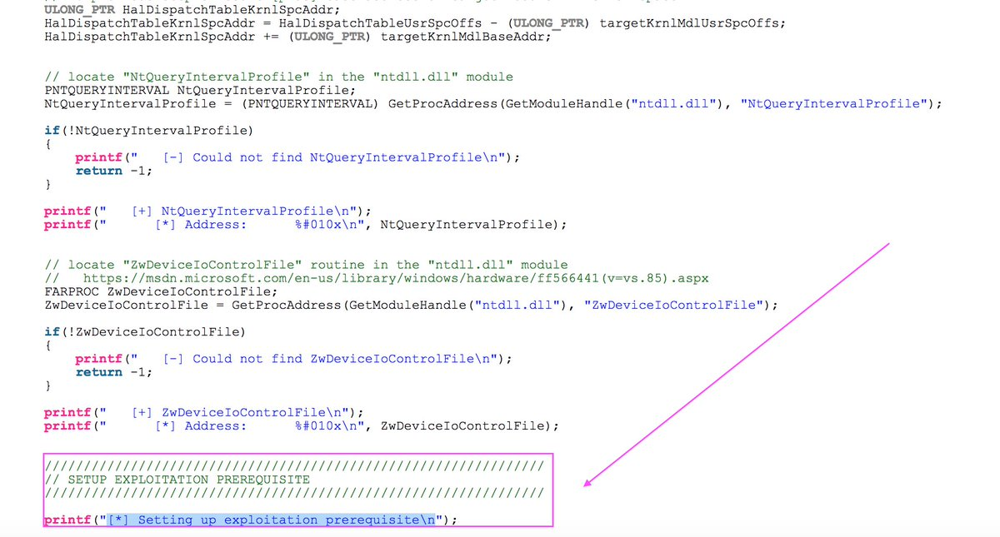
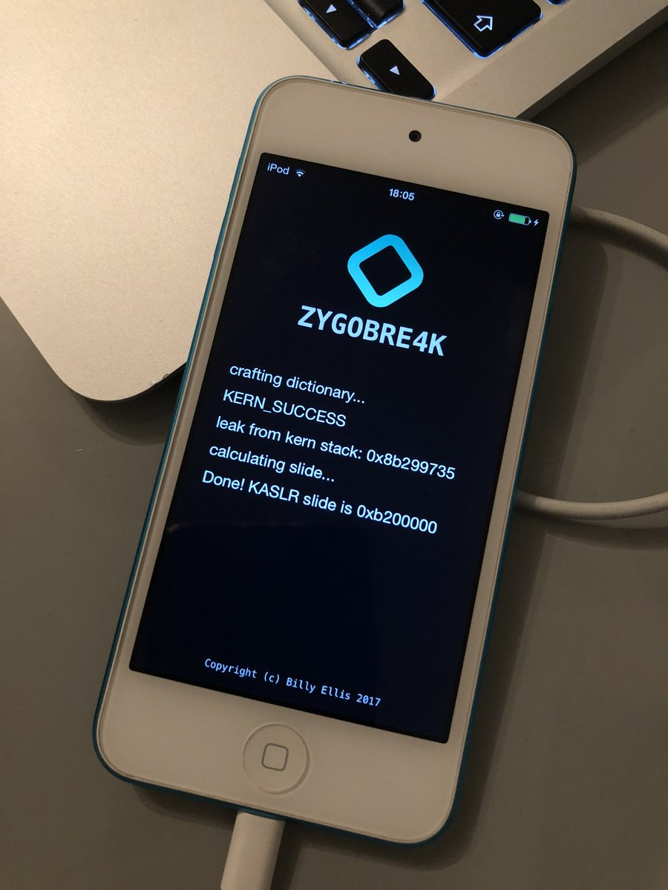

# VK_Intel
**https://twitter.com/VK_Intel/status/946839485601509376 _at 2017-12-29 20:24:59_**
<blockquote>
@anyrun_app @James_inthe_box @JAMESWT_MHT @dvk01uk @malwrhunterteam @MalwareHunterBR @0x7fff9 @securitydoggo Nice find @anyrun_app 👍. This #Miner abuses afd.sys driver vuln (CVE-2011-1249) aka "Ancillary Function Driver Elevation of Privilege Vulnerability" 
-&gt;  "Microsoft Windows (x86) - 'afd.sys' Local Privilege Escalation (MS11-046)"
Copied POC source: https://t.co/EAmo5JncyF https://t.co/He2l4PN5Ku
</blockquote>

* https://www.exploit-db.com/exploits/40564/

<table><tr>
<td></td>
<td></td>
</table></tr>
<table><tr>
<td>Quotes: <code>0</code></td>
<td>Replies: <code>0</code></td>
<td>Retweets: <code>9</code></td>
<td>Favorites: <code>29</code></td>
</tr></table>

---

# bellis1000
**https://twitter.com/bellis1000/status/945683217880842242 _at 2017-12-26 15:50:23_**
<blockquote>
The videos will assume you already have a basic knowledge of programming, assembly language and exploitation. Part 1 will cover CVE-2016-4655 - the kernel information leak vulnerability. Part 2 will cover CVE-2016-4656 - the kernel UAF
</blockquote>

<table><tr>
<td>Quotes: <code>0</code></td>
<td>Replies: <code>1</code></td>
<td>Retweets: <code>9</code></td>
<td>Favorites: <code>39</code></td>
</tr></table>

---

# bellis1000
**https://twitter.com/bellis1000/status/944268776261988352 _at 2017-12-22 18:09:54_**
<blockquote>
Progress! Successfully exploited CVE-2016-4655 to leak data from the kernel stack &amp; calculate the KASLR slide :) time to look at the CVE-2016-4656 UAF next https://t.co/qGwkdBW6AD
</blockquote>

<table><tr>
<td></td>
</table></tr>
<table><tr>
<td>Quotes: <code>2</code></td>
<td>Replies: <code>10</code></td>
<td>Retweets: <code>44</code></td>
<td>Favorites: <code>274</code></td>
</tr></table>

---

# Intrinsec
**https://twitter.com/Intrinsec/status/944207098853904384 _at 2017-12-22 14:04:49_**
<blockquote>
Vulnerability disclosure: #CVE-2017-7344
Get SYSTEM privileges from the Windows logon screen by abusing the @Fortinet VPN client: #FortiClient (privilege escalation #privesc)
➡️https://t.co/hsHeLWfx5u (#exploit steps included 💣)
</blockquote>

* https://securite.intrinsec.com/2017/12/22/cve-2017-7344-fortinet-forticlient-windows-privilege-escalation-at-logon/

<table><tr>
<td>Quotes: <code>1</code></td>
<td>Replies: <code>1</code></td>
<td>Retweets: <code>104</code></td>
<td>Favorites: <code>82</code></td>
</tr></table>

---

# maldevel
**https://twitter.com/maldevel/status/940460914272333824 _at 2017-12-12 05:58:49_**
<blockquote>
Linux ELF x32 and x64 ASLR bypass exploit with stack-spraying - https://t.co/e5WSGvIC3d
</blockquote>

* https://github.com/cryptolok/ASLRay

<table><tr>
<td>Quotes: <code>2</code></td>
<td>Replies: <code>0</code></td>
<td>Retweets: <code>122</code></td>
<td>Favorites: <code>181</code></td>
</tr></table>

---

# mehqq_
**https://twitter.com/mehqq_/status/940239020017123334 _at 2017-12-11 15:17:05_**
<blockquote>
We found RCE and DoS vulnerabilities (CVE-2017-16943, CVE-2017-16944) in the most popular mail server Exim last month. The advisory and technical details are now released!

https://t.co/4krIAb6mzE
</blockquote>

* https://devco.re/blog/2017/12/11/Exim-RCE-advisory-CVE-2017-16943-en/

<table><tr>
<td>Quotes: <code>5</code></td>
<td>Replies: <code>0</code></td>
<td>Retweets: <code>175</code></td>
<td>Favorites: <code>198</code></td>
</tr></table>

---

# TheHackersNews
**https://twitter.com/TheHackersNews/status/939024972248256512 _at 2017-12-08 06:52:54_**
<blockquote>
Microsoft Issues Emergency Windows Security Update For A Critical RCE Vulnerability (CVE-2017-11937) In Its Malware Protection Engine—Patch Now.

https://t.co/x5BjpPOJEA

Flaw Allows Attackers to Take Full Control of Your PC Remotely. https://t.co/cDvgFWIe2r
</blockquote>

* https://thehackernews.com/2017/12/windows-update-malware-protection.html

<table><tr>
<td></td>
</table></tr>
<table><tr>
<td>Quotes: <code>17</code></td>
<td>Replies: <code>3</code></td>
<td>Retweets: <code>353</code></td>
<td>Favorites: <code>202</code></td>
</tr></table>

---

