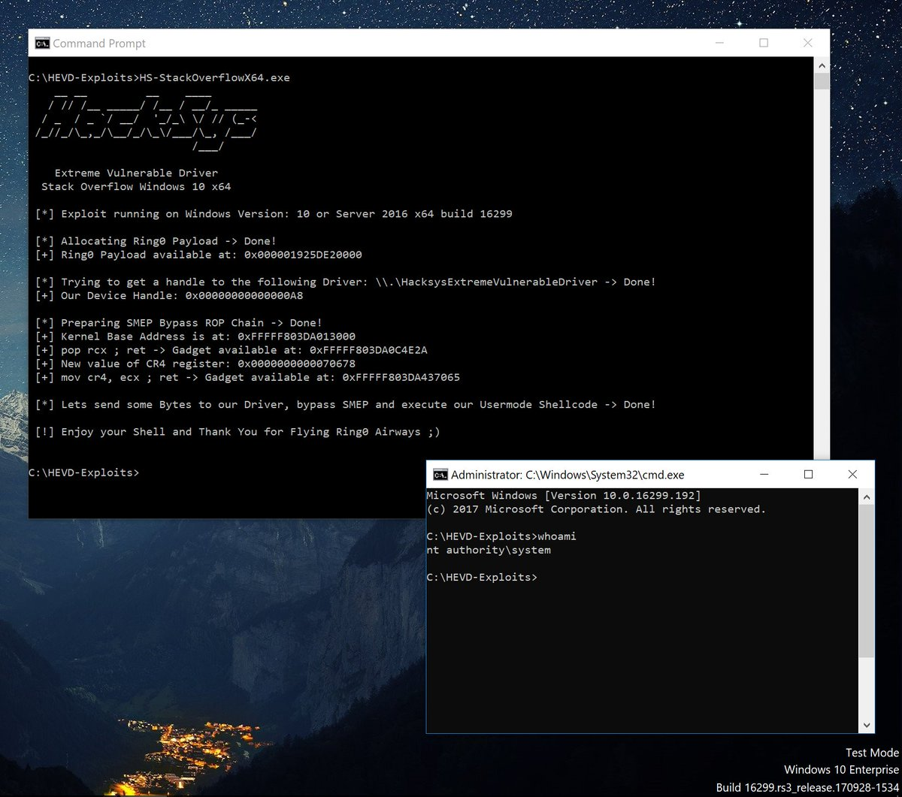

# TheHackersNews
**https://twitter.com/TheHackersNews/status/958065422942724096 _at 2018-01-29 19:52:51_**
<blockquote>
Remote code execution (RCE) and Denial of service (DoS) vulnerability (CVE-2018-0101) discovered in the SSL VPN functionality of Cisco Adaptive Security Appliance. 

https://t.co/ZFTV93cLqM https://t.co/fo7kdGmZNb
</blockquote>

* https://tools.cisco.com/security/center/content/CiscoSecurityAdvisory/cisco-sa-20180129-asa1

<table><tr>
<td></td>
</table></tr>
<table><tr>
<td>Quotes: <code>8</code></td>
<td>Replies: <code>4</code></td>
<td>Retweets: <code>178</code></td>
<td>Favorites: <code>137</code></td>
</tr></table>

---

# hosselot
**https://twitter.com/hosselot/status/957868744994443264 _at 2018-01-29 06:51:19_**
<blockquote>
Google Chrome V8 Use-After-Free Vulnerability + Exploit by Zhao Qixun (CVE-2017-15399):
https://t.co/gynSV1v7D0
</blockquote>

* https://bugs.chromium.org/p/chromium/issues/detail?id=776677

<table><tr>
<td>Quotes: <code>1</code></td>
<td>Replies: <code>0</code></td>
<td>Retweets: <code>97</code></td>
<td>Favorites: <code>116</code></td>
</tr></table>

---

# TheHackersNews
**https://twitter.com/TheHackersNews/status/953974245792477186 _at 2018-01-18 12:55:58_**
<blockquote>
Hackers found exploiting following Microsoft Office flaws to install Zyklon botnet malware on targeted computers:

→ MS Office RCE Vulnerability (CVE-2017-11882)
→ .NET Framework RCE Vulnerability (CVE-2017-8759)
→ Dynamic Data Exchange (DDE Exploit)

https://t.co/XGEsOT7zjg
</blockquote>

* https://thehackernews.com/2018/01/microsoft-office-malware.html

<table><tr>
<td>Quotes: <code>2</code></td>
<td>Replies: <code>1</code></td>
<td>Retweets: <code>59</code></td>
<td>Favorites: <code>54</code></td>
</tr></table>

---

# Cneelis
**https://twitter.com/Cneelis/status/953718930966708224 _at 2018-01-17 20:01:27_**
<blockquote>
Updated my StackOverflow exploit for the @HackSysTeam Extreme Vulnerable Kernel Driver to work on the latest version of Windows 10 (v1709).

* Updated shellcode and SMEP bypass values to reflect changes in _EPROCESS kernel structure and cr4 CPU register.

https://t.co/mJvYKMKdhD https://t.co/EkicjaBi5O
</blockquote>

* https://github.com/Cn33liz/HSEVD-StackOverflowX64

<table><tr>
<td></td>
</table></tr>
<table><tr>
<td>Quotes: <code>1</code></td>
<td>Replies: <code>3</code></td>
<td>Retweets: <code>100</code></td>
<td>Favorites: <code>170</code></td>
</tr></table>

---

# nuria_imeq
**https://twitter.com/nuria_imeq/status/950860665719312384 _at 2018-01-09 22:43:43_**
<blockquote>
CVE-2017-0243 PoC #exploit
Description:
Microsoft Office allows a remote code execution vulnerability due to the way that it handles objects in memory, aka "Microsoft Office Remote Code Execution Vulnerability".
https://t.co/D87FLMNZRW
</blockquote>

* https://github.com/rxwx/CVE-2017-8570

<table><tr>
<td>Quotes: <code>0</code></td>
<td>Replies: <code>1</code></td>
<td>Retweets: <code>34</code></td>
<td>Favorites: <code>42</code></td>
</tr></table>

---

