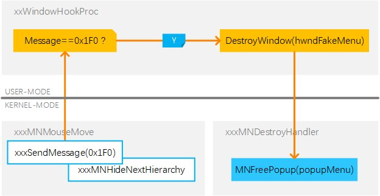
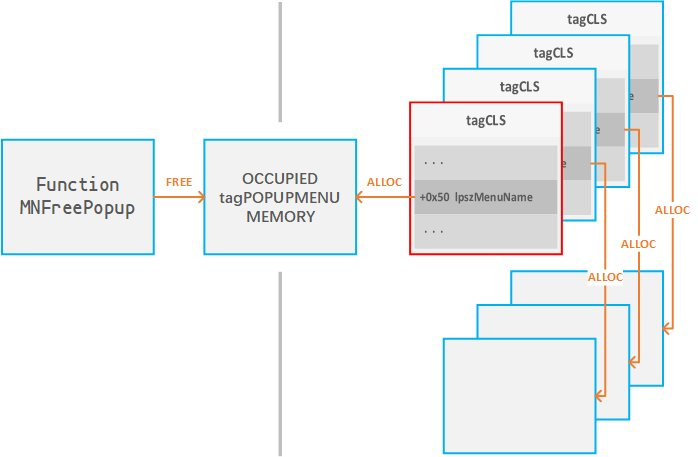
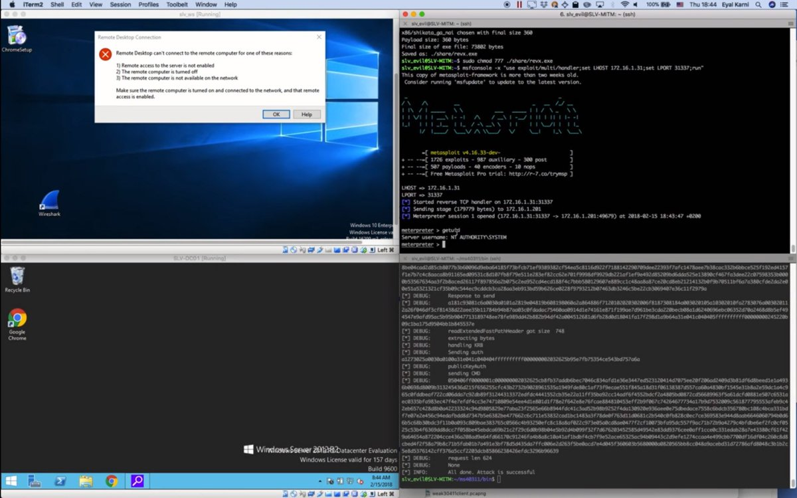

# TheHackersNews
**https://twitter.com/TheHackersNews/status/989923796252585984 _at Fri Apr 27 17:46:39 +0000 2018_**
<blockquote>
DoS to DeAnonymization —  @PaulosYibelo find a flaw (CVE-2018-10308) in SaferVPN's chrome extension that leaks users' real IP address.

If a site tries to resolve non-existent domains continually, SaferVPN extension kills itself, leaving user uncovered.

https://t.co/SUhQ2LKkip
</blockquote>

* http://www.paulosyibelo.com/2018/04/safervpn-cve-2018-10308-from-dos-to-ip.html

<table><tr>
<td>Quotes: <code>1</code></td>
<td>Replies: <code>1</code></td>
<td>Retweets: <code>40</code></td>
<td>Favorites: <code>50</code></td>
</tr></table>

---

# Leeqwind
**https://twitter.com/Leeqwind/status/988011700812107776 _at Sun Apr 22 11:08:40 +0000 2018_**
<blockquote>
CVE-2015-2546 use-after-free analysis and exploitation: [zh]https://t.co/hAbgxzxlc5 [en]https://t.co/6CLw4r08RP - similar to and different from CVE-2017-0263 https://t.co/mXI1965rGR
</blockquote>

* https://xiaodaozhi.com/exploit/122.html
* https://xiaodaozhi.com/exploit/132.html

<table><tr>
<td></td>
<td></td>
</tr></table>
<table><tr>
<td>Quotes: <code>0</code></td>
<td>Replies: <code>0</code></td>
<td>Retweets: <code>30</code></td>
<td>Favorites: <code>49</code></td>
</tr></table>

---

# TheHackersNews
**https://twitter.com/TheHackersNews/status/985952133206900736 _at Mon Apr 16 18:44:41 +0000 2018_**
<blockquote>
Proof-of-Concept (PoC) exploit for Windows CredSSP remote code execution vulnerability (CVE-2018-0886) is now available

Exploit Code — https://t.co/OC2wQlqA1T

Details — https://t.co/5fxl1C1v50

CredSSP RDP flaw affects all versions of Windows. https://t.co/EXPAvQw4Kl
</blockquote>

* https://github.com/preempt/credssp
* https://thehackernews.com/2018/03/credssp-rdp-exploit.html

<table><tr>
<td></td>
</tr></table>
<table><tr>
<td>Quotes: <code>13</code></td>
<td>Replies: <code>4</code></td>
<td>Retweets: <code>377</code></td>
<td>Favorites: <code>403</code></td>
</tr></table>

---

# TheHackersNews
**https://twitter.com/TheHackersNews/status/983826111078559744 _at Tue Apr 10 21:56:38 +0000 2018_**
<blockquote>
Microsoft also released a patch for another critical RCE flaw (CVE-2018-1004), which exists in Windows VBScript Engine &amp; affects all versions of Windows.

"An attacker could host a specially crafted website that is designed to exploit the vulnerability through IE," MS explains
</blockquote>

<table><tr>
<td>Quotes: <code>3</code></td>
<td>Replies: <code>5</code></td>
<td>Retweets: <code>48</code></td>
<td>Favorites: <code>69</code></td>
</tr></table>

---

# CyberWarship
**https://twitter.com/CyberWarship/status/982890682904989696 _at Sun Apr 08 07:59:34 +0000 2018_**
<blockquote>
CVE-2018-0752 - Exploit

Microsoft Windows - NtImpersonateAnonymousToken LPAC to Non-LPAC Privilege Escalation

#infosec #pentest #exploit 
https://t.co/yGn0mCRtLq https://t.co/W5w7KRAZtL
</blockquote>

* https://www.exploit-db.com/exploits/43516/

<table><tr>
<td></td>
</tr></table>
<table><tr>
<td>Quotes: <code>3</code></td>
<td>Replies: <code>0</code></td>
<td>Retweets: <code>63</code></td>
<td>Favorites: <code>127</code></td>
</tr></table>

---

# Yalujb
**https://twitter.com/Yalujb/status/982881935683829762 _at Sun Apr 08 07:24:49 +0000 2018_**
<blockquote>
Google Project Zero publishes WebKit bug (CVE-2018-4121) along with write-up and PoC. It achieves sandbox escape in iOS 11.2.6. #security #update
</blockquote>

<table><tr>
<td>Quotes: <code>2</code></td>
<td>Replies: <code>6</code></td>
<td>Retweets: <code>18</code></td>
<td>Favorites: <code>83</code></td>
</tr></table>

---

# x9090
**https://twitter.com/x9090/status/980944786696822784 _at Mon Apr 02 23:07:16 +0000 2018_**
<blockquote>
My differential analysis to find out the root cause of Word UAF vulnerability CVE-2018-0797. #AlleyCat and #Lighthouse plugins users might want to check this out as there are some improvements for these tools https://t.co/tYqvsLzJeD
</blockquote>

* https://www.fortinet.com/blog/threat-research/a-root-cause-analysis-of-cve-2018-0797---rich-text-format-styles.html

<table><tr>
<td>Quotes: <code>0</code></td>
<td>Replies: <code>0</code></td>
<td>Retweets: <code>65</code></td>
<td>Favorites: <code>94</code></td>
</tr></table>

---

