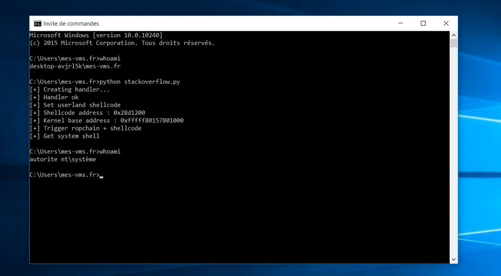
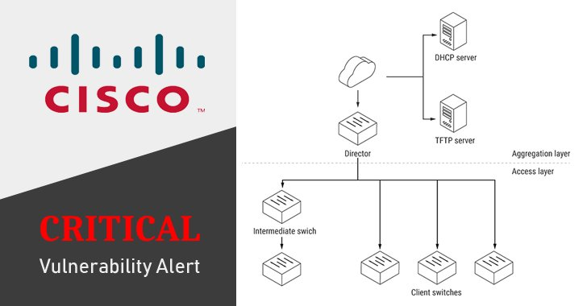

# TheHackersNews
**https://twitter.com/TheHackersNews/status/989923796252585984 _at 2018-04-27 17:46:39_**
<blockquote>
DoS to DeAnonymization —  @PaulosYibelo find a flaw (CVE-2018-10308) in SaferVPN's chrome extension that leaks users' real IP address.

If a site tries to resolve non-existent domains continually, SaferVPN extension kills itself, leaving user uncovered.

https://t.co/SUhQ2LKkip
</blockquote>

* http://www.paulosyibelo.com/2018/04/safervpn-cve-2018-10308-from-dos-to-ip.html

<table><tr>
<td>Quotes: <code>1</code></td>
<td>Replies: <code>1</code></td>
<td>Retweets: <code>40</code></td>
<td>Favorites: <code>50</code></td>
</tr></table>

---

# Leeqwind
**https://twitter.com/Leeqwind/status/988011700812107776 _at 2018-04-22 11:08:40_**
<blockquote>
CVE-2015-2546 use-after-free analysis and exploitation: [zh]https://t.co/hAbgxzxlc5 [en]https://t.co/6CLw4r08RP - similar to and different from CVE-2017-0263 https://t.co/mXI1965rGR
</blockquote>

* https://xiaodaozhi.com/exploit/122.html
* https://xiaodaozhi.com/exploit/132.html

<table><tr>
<td></td>
<td></td>
</table></tr>
<table><tr>
<td>Quotes: <code>0</code></td>
<td>Replies: <code>0</code></td>
<td>Retweets: <code>30</code></td>
<td>Favorites: <code>47</code></td>
</tr></table>

---

# wugeej
**https://twitter.com/wugeej/status/987140822846984192 _at 2018-04-20 01:28:07_**
<blockquote>
[CVE-2017-0263] Microsoft Window Manager (Windows 7 x86) - Menu Management Component UAF Privilege Elevation POC
https://t.co/jt1HWXs9BG
</blockquote>

* https://www.exploit-db.com/exploits/44478/

<table><tr>
<td>Quotes: <code>0</code></td>
<td>Replies: <code>0</code></td>
<td>Retweets: <code>0</code></td>
<td>Favorites: <code>0</code></td>
</tr></table>

---

# RamonaHoogeveen
**https://twitter.com/RamonaHoogeveen/status/986354172659486720 _at 2018-04-17 21:22:14_**
<blockquote>
Proof-of-Concept (PoC) exploit for Windows CredSSP remote code execution vulnerability (CVE-2018-0886) is now available     
Exploit Code — https://t.co/2vhiO9V9mq

Details — https://t.co/4AiPjor3hW

CredSSP RDP flaw affects all versions of Windows. https://t.co/fdW5GUypsJ
</blockquote>

* https://github.com/preempt/credssp
* https://thehackernews.com/2018/03/credssp-rdp-exploit.html

<table><tr>
<td></td>
</table></tr>
<table><tr>
<td>Quotes: <code>0</code></td>
<td>Replies: <code>0</code></td>
<td>Retweets: <code>3</code></td>
<td>Favorites: <code>6</code></td>
</tr></table>

---

# firefart
**https://twitter.com/firefart/status/985975939644448780 _at 2018-04-16 20:19:17_**
<blockquote>
as everyone is posting #drupalgeddon2 exploits for Drupal 8.x here is a working unauthenticated RCE POC for Drupal 7.x:
https://t.co/mF8jplgm9x
</blockquote>

* https://github.com/FireFart/CVE-2018-7600

<table><tr>
<td>Quotes: <code>5</code></td>
<td>Replies: <code>5</code></td>
<td>Retweets: <code>97</code></td>
<td>Favorites: <code>164</code></td>
</tr></table>

---

# AusRealNews
**https://twitter.com/AusRealNews/status/985952894733176832 _at 2018-04-16 18:47:42_**
<blockquote>
RT TheHackersNews "Proof-of-Concept (PoC) exploit for Windows CredSSP remote code execution vulnerability (CVE-2018-0886) is now available

Exploit Code — https://t.co/JDulvXgCW5

Details — https://t.co/7ECx6PE1S2

CredSSP RDP flaw affects all versions of Windows. …
</blockquote>

* https://github.com/preempt/credssp
* https://thehackernews.com/2018/03/credssp-rdp-exploit.html

<table><tr>
<td>Quotes: <code>0</code></td>
<td>Replies: <code>0</code></td>
<td>Retweets: <code>0</code></td>
<td>Favorites: <code>0</code></td>
</tr></table>

---

# rksmedias
**https://twitter.com/rksmedias/status/985952727745384448 _at 2018-04-16 18:47:03_**
<blockquote>
Proof-of-Concept (PoC) exploit for Windows CredSSP remote code execution vulnerability (CVE-2018-0886) is now available

Exploit Code — https://t.co/0bRFxSQjD1

Details — https://t.co/5KlEiyib5o

CredSSP RDP flaw affects all versions of Windows. https://t.co/ZnvICnwbRd
</blockquote>

* https://github.com/preempt/credssp
* https://thehackernews.com/2018/03/credssp-rdp-exploit.html

<table><tr>
<td></td>
</table></tr>
<table><tr>
<td>Quotes: <code>0</code></td>
<td>Replies: <code>0</code></td>
<td>Retweets: <code>0</code></td>
<td>Favorites: <code>0</code></td>
</tr></table>

---

# TheHackersNews
**https://twitter.com/TheHackersNews/status/985952133206900736 _at 2018-04-16 18:44:41_**
<blockquote>
Proof-of-Concept (PoC) exploit for Windows CredSSP remote code execution vulnerability (CVE-2018-0886) is now available

Exploit Code — https://t.co/OC2wQlqA1T

Details — https://t.co/5fxl1C1v50

CredSSP RDP flaw affects all versions of Windows. https://t.co/EXPAvQw4Kl
</blockquote>

* https://github.com/preempt/credssp
* https://thehackernews.com/2018/03/credssp-rdp-exploit.html

<table><tr>
<td></td>
</table></tr>
<table><tr>
<td>Quotes: <code>13</code></td>
<td>Replies: <code>4</code></td>
<td>Retweets: <code>372</code></td>
<td>Favorites: <code>399</code></td>
</tr></table>

---

# Geluchat
**https://twitter.com/Geluchat/status/985816357429301253 _at 2018-04-16 09:45:09_**
<blockquote>
Currently playing with HEVD driver from @HackSysTeam ♥
Here is my first attempt with SMEP bypass on Windows 10 (just a simple ropchain) : https://t.co/x1rpvbEz03 https://t.co/YV3jAQoVlt
</blockquote>

* https://gist.github.com/Geluchat/40083c02b7ec97959881e18cf3e814c3

<table><tr>
<td></td>
</table></tr>
<table><tr>
<td>Quotes: <code>1</code></td>
<td>Replies: <code>4</code></td>
<td>Retweets: <code>30</code></td>
<td>Favorites: <code>82</code></td>
</tr></table>

---

# x0rz
**https://twitter.com/x0rz/status/985442288116658177 _at 2018-04-15 08:58:44_**
<blockquote>
New tool to perform static analysis on Python web applications (SQLi, XSS, RCE, ...) https://t.co/dMy5hwFwag #python #audit #pentest #vulnerability
</blockquote>

* https://github.com/python-security/pyt

<table><tr>
<td>Quotes: <code>1</code></td>
<td>Replies: <code>1</code></td>
<td>Retweets: <code>142</code></td>
<td>Favorites: <code>297</code></td>
</tr></table>

---

# BrandonPrry
**https://twitter.com/BrandonPrry/status/984606339233210368 _at 2018-04-13 01:36:59_**
<blockquote>
Uploaded a Metasploit module to the VolatileMinds store exploiting the recent unauthenticated Drupal RCE (SA-CORE-2018-002 / CVE-2018-7600). 

https://t.co/QhnysXERlp
</blockquote>

* https://store.volatileminds.net/Home/ViewProduct?id=589c39be-a5e0-4acf-aeb7-a8c10019d88d&name=Drupal%20Core%20Unauthenticated%20Remote%20Code%20Execution

<table><tr>
<td>Quotes: <code>2</code></td>
<td>Replies: <code>2</code></td>
<td>Retweets: <code>18</code></td>
<td>Favorites: <code>32</code></td>
</tr></table>

---

# TheHackersNews
**https://twitter.com/TheHackersNews/status/983826111078559744 _at 2018-04-10 21:56:38_**
<blockquote>
Microsoft also released a patch for another critical RCE flaw (CVE-2018-1004), which exists in Windows VBScript Engine &amp; affects all versions of Windows.

"An attacker could host a specially crafted website that is designed to exploit the vulnerability through IE," MS explains
</blockquote>

<table><tr>
<td>Quotes: <code>3</code></td>
<td>Replies: <code>5</code></td>
<td>Retweets: <code>48</code></td>
<td>Favorites: <code>69</code></td>
</tr></table>

---

# TheHackersNews
**https://twitter.com/TheHackersNews/status/983357479437422595 _at 2018-04-09 14:54:27_**
<blockquote>
Critical Remote Code Execution (CVE-2018-9843) Vulnerability Discovered in #CyberArk Password Vault Web Access

PoC Exploit Released — https://t.co/wWgZj8GjYy

Enterprises Using CyberArk's Privileged Account Security Solution are Highly Recommended to Upgrade Software Immediately https://t.co/0suv76LHb2
</blockquote>

* https://thehackernews.com/2018/04/enterprise-password-vault.html

<table><tr>
<td></td>
</table></tr>
<table><tr>
<td>Quotes: <code>8</code></td>
<td>Replies: <code>1</code></td>
<td>Retweets: <code>153</code></td>
<td>Favorites: <code>120</code></td>
</tr></table>

---

# CyberWarship
**https://twitter.com/CyberWarship/status/982890682904989696 _at 2018-04-08 07:59:34_**
<blockquote>
CVE-2018-0752 - Exploit

Microsoft Windows - NtImpersonateAnonymousToken LPAC to Non-LPAC Privilege Escalation

#infosec #pentest #exploit 
https://t.co/yGn0mCRtLq https://t.co/W5w7KRAZtL
</blockquote>

* https://www.exploit-db.com/exploits/43516/

<table><tr>
<td></td>
</table></tr>
<table><tr>
<td>Quotes: <code>3</code></td>
<td>Replies: <code>0</code></td>
<td>Retweets: <code>63</code></td>
<td>Favorites: <code>125</code></td>
</tr></table>

---

# Yalujb
**https://twitter.com/Yalujb/status/982881935683829762 _at 2018-04-08 07:24:49_**
<blockquote>
Google Project Zero publishes WebKit bug (CVE-2018-4121) along with write-up and PoC. It achieves sandbox escape in iOS 11.2.6. #security #update
</blockquote>

<table><tr>
<td>Quotes: <code>2</code></td>
<td>Replies: <code>6</code></td>
<td>Retweets: <code>18</code></td>
<td>Favorites: <code>82</code></td>
</tr></table>

---

# TheHackersNews
**https://twitter.com/TheHackersNews/status/982167289398099968 _at 2018-04-06 08:05:04_**
<blockquote>
Three Vulnerabilities Discovered in Spring Development Framework — Upgrade Immediately to Protect Your Applications

https://t.co/ytHgTw59LU

Critical — RCE Attack (CVE-2018-1270)
High — Directory Traversal Attack (CVE-2018-1271)
Low — Multipart Content Pollution (CVE-2018-1272) https://t.co/3UQj3iD3qO
</blockquote>

* https://thehackernews.com/2018/04/spring-framework-hacking.html

<table><tr>
<td></td>
</table></tr>
<table><tr>
<td>Quotes: <code>7</code></td>
<td>Replies: <code>1</code></td>
<td>Retweets: <code>149</code></td>
<td>Favorites: <code>129</code></td>
</tr></table>

---

# TheHackersNews
**https://twitter.com/TheHackersNews/status/981548143182565376 _at 2018-04-04 15:04:48_**
<blockquote>
Security researchers have disclosed details &amp; PoC for a critical remote code execution vulnerability (CVE-2018-0171) in the "Cisco Smart Install" feature of Cisco IOS &amp; Cisco IOS XE Software

https://t.co/F1QRbMrTWf

Flaw leaves thousands of network devices vulnerable to hacking https://t.co/rtKZSbtnW8
</blockquote>

* https://thehackernews.com/2018/04/cisco-switches-hacking.html

<table><tr>
<td></td>
</table></tr>
<table><tr>
<td>Quotes: <code>3</code></td>
<td>Replies: <code>3</code></td>
<td>Retweets: <code>132</code></td>
<td>Favorites: <code>98</code></td>
</tr></table>

---

# x9090
**https://twitter.com/x9090/status/980944786696822784 _at 2018-04-02 23:07:16_**
<blockquote>
My differential analysis to find out the root cause of Word UAF vulnerability CVE-2018-0797. #AlleyCat and #Lighthouse plugins users might want to check this out as there are some improvements for these tools https://t.co/tYqvsLzJeD
</blockquote>

* https://www.fortinet.com/blog/threat-research/a-root-cause-analysis-of-cve-2018-0797---rich-text-format-styles.html

<table><tr>
<td>Quotes: <code>0</code></td>
<td>Replies: <code>0</code></td>
<td>Retweets: <code>63</code></td>
<td>Favorites: <code>93</code></td>
</tr></table>

---

