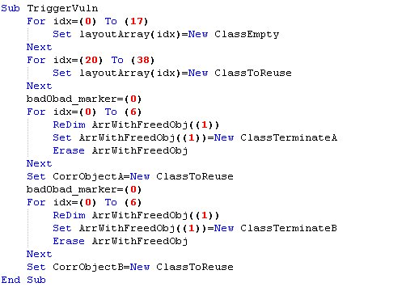

# hosselot
**https://twitter.com/hosselot/status/1001074883537891328 _at Mon May 28 12:17:05 +0000 2018_**
<blockquote>
Very good reads + exploit for Microsoft Windows PML4 Privilege Escalation Vulnerability (CVE-2018-1038) by Ulf Frisk:
https://t.co/CgqEmCCl2K
https://t.co/6KwYP124fM
https://t.co/54NSnwelsE
</blockquote>

* http://blog.frizk.net/2018/03/total-meltdown.html
* https://blog.xpnsec.com/total-meltdown-cve-2018-1038/
* https://www.exploit-db.com/exploits/44581/

<table><tr>
<td>Quotes: <code>2</code></td>
<td>Replies: <code>0</code></td>
<td>Retweets: <code>152</code></td>
<td>Favorites: <code>203</code></td>
</tr></table>

---

# hosselot
**https://twitter.com/hosselot/status/996679610405408774 _at Wed May 16 09:11:51 +0000 2018_**
<blockquote>
Vulnerability Details / Exploitation of Recent (Zero-day) WIN32K SetImeInfoEx NULL Pointer Dereference Vulnerability (CVE-2018-8120) by Leeqwind:
https://t.co/Stm8TX3pOq
</blockquote>

* https://xiaodaozhi.com/exploit/156.html

<table><tr>
<td>Quotes: <code>1</code></td>
<td>Replies: <code>0</code></td>
<td>Retweets: <code>45</code></td>
<td>Favorites: <code>65</code></td>
</tr></table>

---

# dimitribest
**https://twitter.com/dimitribest/status/994282296223174671 _at Wed May 09 18:25:46 +0000 2018_**
<blockquote>
The King is dead. Long live the King! - Root cause analysis of the latest Internet Explorer zero day – CVE-2018-8174

 https://t.co/8SItwd60xC 
#IE #0day https://t.co/nz56jjb4aK
</blockquote>

* https://securelist.com/root-cause-analysis-of-cve-2018-8174/85486/

<table><tr>
<td></td>
</tr></table>
<table><tr>
<td>Quotes: <code>3</code></td>
<td>Replies: <code>0</code></td>
<td>Retweets: <code>77</code></td>
<td>Favorites: <code>117</code></td>
</tr></table>

---

# 360CoreSec
**https://twitter.com/360CoreSec/status/994166078585491456 _at Wed May 09 10:43:58 +0000 2018_**
<blockquote>
Analysis of CVE-2018-8174 VBScript 0day and APT actor related to Office targeted attack... https://t.co/OltmxiYBIP
</blockquote>

* http://blogs.360.cn/blog/cve-2018-8174-en/

<table><tr>
<td>Quotes: <code>17</code></td>
<td>Replies: <code>3</code></td>
<td>Retweets: <code>197</code></td>
<td>Favorites: <code>282</code></td>
</tr></table>

---

# buffaloverflow
**https://twitter.com/buffaloverflow/status/994118847048437760 _at Wed May 09 07:36:17 +0000 2018_**
<blockquote>
Hash for this sample was:
https://t.co/1RVOzKtTBF

CVE-2018-8174 IE #0day. Great analysis here:
https://t.co/vlIifdznRl https://t.co/WKTd7Iz7TA
</blockquote>

* https://www.virustotal.com/#/file/10ceb5916cd90e75f8789881af40287c655831c5086ae1575b327556b63cdb24/
* https://securelist.com/root-cause-analysis-of-cve-2018-8174/85486/
* https://twitter.com/buffaloverflow/status/989798880295444480

<table><tr>
<td>Quotes: <code>0</code></td>
<td>Replies: <code>2</code></td>
<td>Retweets: <code>61</code></td>
<td>Favorites: <code>91</code></td>
</tr></table>

---

