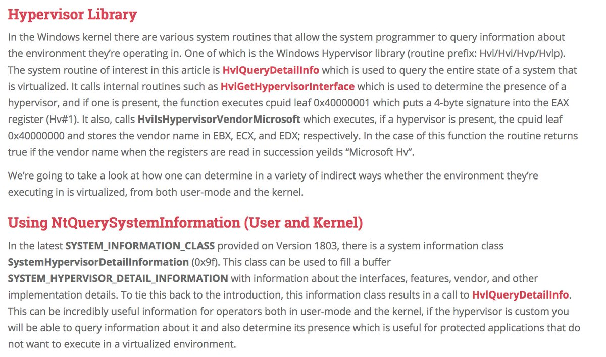
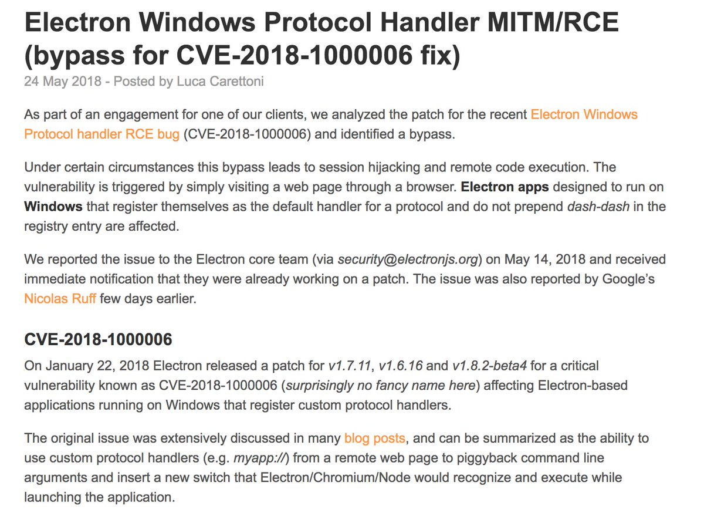
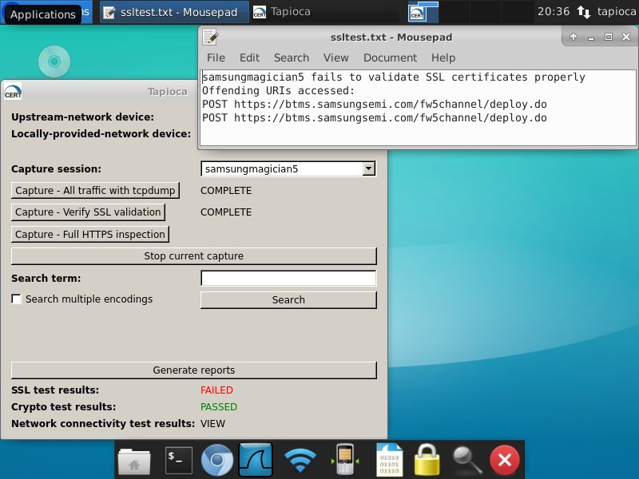
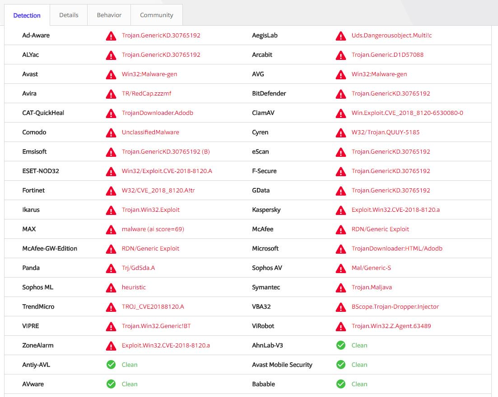
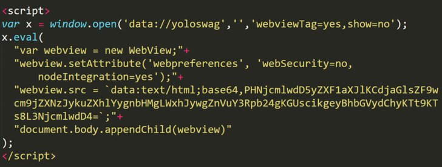
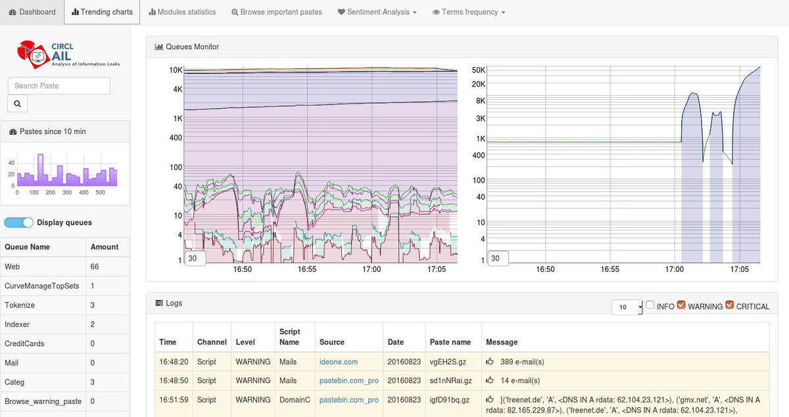

# hosselot
**https://twitter.com/hosselot/status/1001074883537891328 _at 2018-05-28 12:17:05_**
<blockquote>
Very good reads + exploit for Microsoft Windows PML4 Privilege Escalation Vulnerability (CVE-2018-1038) by Ulf Frisk:
https://t.co/CgqEmCCl2K
https://t.co/6KwYP124fM
https://t.co/54NSnwelsE
</blockquote>

* http://blog.frizk.net/2018/03/total-meltdown.html
* https://blog.xpnsec.com/total-meltdown-cve-2018-1038/
* https://www.exploit-db.com/exploits/44581/

<table><tr>
<td>Quotes: <code>2</code></td>
<td>Replies: <code>0</code></td>
<td>Retweets: <code>150</code></td>
<td>Favorites: <code>204</code></td>
</tr></table>

---

# daniel_bilar
**https://twitter.com/daniel_bilar/status/999809441674522625 _at 2018-05-25 00:28:41_**
<blockquote>
Cybersecurity roundup May 24 by @agelastic https://t.co/XqBDXot30A
Detect Hypervisor on Win 10 x64 1803 by @daax_r https://t.co/lH1VShUKop

CERT Tapioca 2.0 for MitM analysis https://t.co/pHL6ZpmOTm

Electron MITM/RCE (bypass for CVE-2018-1000006 fix) https://t.co/mP6UfCemJv https://t.co/9FThr3FDa3
</blockquote>

* http://nuzzel.com/agelastic/2018/05/25?utm_campaign=newsletter_subscription&utm_medium=email&utm_source=nuzzel
* http://revers.engineering/detecting-hypervisor-presence-on-windows-10/
* https://github.com/CERTCC/tapioca
* https://blog.doyensec.com/2018/05/24/electron-win-protocol-handler-bug-bypass.html

<table><tr>
<td></td>
<td></td>
<td></td>
</table></tr>
<table><tr>
<td>Quotes: <code>0</code></td>
<td>Replies: <code>0</code></td>
<td>Retweets: <code>1</code></td>
<td>Favorites: <code>3</code></td>
</tr></table>

---

# xer0dayz
**https://twitter.com/xer0dayz/status/998652047615451138 _at 2018-05-21 19:49:36_**
<blockquote>
Windows-RCE-exploits - Exploits and PoC's for RCE on Windows https://t.co/fxFnWiX1UE
</blockquote>

* https://github.com/smgorelik/Windows-RCE-exploits

<table><tr>
<td>Quotes: <code>0</code></td>
<td>Replies: <code>0</code></td>
<td>Retweets: <code>32</code></td>
<td>Favorites: <code>63</code></td>
</tr></table>

---

# x0rz
**https://twitter.com/x0rz/status/997747169867296769 _at 2018-05-19 07:53:57_**
<blockquote>
Dell SupportAssist driver vuln to SYSTEM local privilege escalation https://t.co/RE2aMEWLjc + PoC https://t.co/W450wZavyu #vulnerability #windows #dell #privesc
</blockquote>

* https://hatriot.github.io/blog/2018/05/17/dell-supportassist-local-privilege-escalation/
* https://github.com/hatRiot/bugs/blob/master/dell-support-assist/dell-sa-lpe.cpp

<table><tr>
<td>Quotes: <code>5</code></td>
<td>Replies: <code>4</code></td>
<td>Retweets: <code>148</code></td>
<td>Favorites: <code>240</code></td>
</tr></table>

---

# hosselot
**https://twitter.com/hosselot/status/996679610405408774 _at 2018-05-16 09:11:51_**
<blockquote>
Vulnerability Details / Exploitation of Recent (Zero-day) WIN32K SetImeInfoEx NULL Pointer Dereference Vulnerability (CVE-2018-8120) by Leeqwind:
https://t.co/Stm8TX3pOq
</blockquote>

* https://xiaodaozhi.com/exploit/156.html

<table><tr>
<td>Quotes: <code>1</code></td>
<td>Replies: <code>0</code></td>
<td>Retweets: <code>43</code></td>
<td>Favorites: <code>64</code></td>
</tr></table>

---

# wugeej
**https://twitter.com/wugeej/status/996203810233053184 _at 2018-05-15 01:41:11_**
<blockquote>
[POC] [CVE-2017-11885] Microsoft Windows 2003 SP2 - 'RRAS' SMB Remote Code Execution
https://t.co/pxNjWomKx1
</blockquote>

* https://www.exploit-db.com/exploits/44616/

<table><tr>
<td>Quotes: <code>0</code></td>
<td>Replies: <code>0</code></td>
<td>Retweets: <code>0</code></td>
<td>Favorites: <code>0</code></td>
</tr></table>

---

# PhysicalDrive0
**https://twitter.com/PhysicalDrive0/status/996070003815452672 _at 2018-05-14 16:49:29_**
<blockquote>
Looks like CVE-CVE-2018-8120 Windows Kernel 'Win32k.sys' Local Privilege Escalation Vulnerability 
https://t.co/hzcG5DeHRk https://t.co/6pZQsG9cc7
</blockquote>

* https://www.virustotal.com/#/file/6cfbebe9c562d9cdfc540ce45d09c8a00d227421349b12847c421ba6f71f4284/detection

<table><tr>
<td></td>
</table></tr>
<table><tr>
<td>Quotes: <code>0</code></td>
<td>Replies: <code>2</code></td>
<td>Retweets: <code>33</code></td>
<td>Favorites: <code>70</code></td>
</tr></table>

---

# TheHackersNews
**https://twitter.com/TheHackersNews/status/995968175203172353 _at 2018-05-14 10:04:51_**
<blockquote>
Critical flaw (CVE-2018-1000136) discovered in #Electron framework could expose application server to Remote Code Execution (RCE) attacks—PoC exploit released.

https://t.co/shCNrgXJ6E

Developers should ensure their Electron-based apps are updated and patched. https://t.co/cgqiSGHPa8
</blockquote>

* https://thehackernews.com/2018/05/electron-node-integration.html

<table><tr>
<td></td>
</table></tr>
<table><tr>
<td>Quotes: <code>11</code></td>
<td>Replies: <code>1</code></td>
<td>Retweets: <code>153</code></td>
<td>Favorites: <code>179</code></td>
</tr></table>

---

# wugeej
**https://twitter.com/wugeej/status/995842696651554816 _at 2018-05-14 01:46:15_**
<blockquote>
[POC] [CVE-2017-11885] Microsoft Windows 2003 SP2 - 'RRAS' SMB Remote Code Execution
https://t.co/pxNjWomKx1
</blockquote>

* https://www.exploit-db.com/exploits/44616/

<table><tr>
<td>Quotes: <code>0</code></td>
<td>Replies: <code>0</code></td>
<td>Retweets: <code>2</code></td>
<td>Favorites: <code>1</code></td>
</tr></table>

---

# bcrypt
**https://twitter.com/bcrypt/status/995057480680931328 _at 2018-05-11 21:46:05_**
<blockquote>
a lot of @electronjs devs have the attitude that their app doesn't need sandboxing or keeping up-to-date with Chromium bc "it doesn't execute untrusted code". the problem is that falls apart as soon as you get XSS. https://t.co/6V6tkl8GRA

(at least Signal has sandboxing)
</blockquote>

* https://github.com/signalapp/Signal-Desktop/issues/1635

<table><tr>
<td>Quotes: <code>2</code></td>
<td>Replies: <code>4</code></td>
<td>Retweets: <code>56</code></td>
<td>Favorites: <code>138</code></td>
</tr></table>

---

# circl_lu
**https://twitter.com/circl_lu/status/994950739373051904 _at 2018-05-11 14:41:56_**
<blockquote>
AIL framework - Analysis Information Leak framework version 1.0 released https://t.co/q58mxzhQcY with improved detection and extraction of Base64 encoded data, BTC address detection, API keys/X.509 certificate and many bug fixes (and moved to Python 3). https://t.co/mfCTRrpoXu
</blockquote>

* https://github.com/CIRCL/AIL-framework/releases/tag/v1.0

<table><tr>
<td></td>
</table></tr>
<table><tr>
<td>Quotes: <code>2</code></td>
<td>Replies: <code>0</code></td>
<td>Retweets: <code>27</code></td>
<td>Favorites: <code>40</code></td>
</tr></table>

---

# dimitribest
**https://twitter.com/dimitribest/status/994282296223174671 _at 2018-05-09 18:25:46_**
<blockquote>
The King is dead. Long live the King! - Root cause analysis of the latest Internet Explorer zero day – CVE-2018-8174

 https://t.co/8SItwd60xC 
#IE #0day https://t.co/nz56jjb4aK
</blockquote>

* https://securelist.com/root-cause-analysis-of-cve-2018-8174/85486/

<table><tr>
<td></td>
</table></tr>
<table><tr>
<td>Quotes: <code>3</code></td>
<td>Replies: <code>0</code></td>
<td>Retweets: <code>76</code></td>
<td>Favorites: <code>116</code></td>
</tr></table>

---

# 360CoreSec
**https://twitter.com/360CoreSec/status/994166078585491456 _at 2018-05-09 10:43:58_**
<blockquote>
Analysis of CVE-2018-8174 VBScript 0day and APT actor related to Office targeted attack... https://t.co/OltmxiYBIP
</blockquote>

* http://blogs.360.cn/blog/cve-2018-8174-en/

<table><tr>
<td>Quotes: <code>17</code></td>
<td>Replies: <code>3</code></td>
<td>Retweets: <code>196</code></td>
<td>Favorites: <code>281</code></td>
</tr></table>

---

# Piosky1
**https://twitter.com/Piosky1/status/994147059002478594 _at 2018-05-09 09:28:23_**
<blockquote>
And... published :D
We finally obtained the CVE for an unauthenticated RCE in WildFly with my teammate @kmkz_security:
https://t.co/lrAAUdekvF
https://t.co/auhqjOi0lA

For all the details, check the advisory note on @kmkz_security's github:
https://t.co/MBfNqNV1R1
</blockquote>

* https://cve.mitre.org/cgi-bin/cvename.cgi?name=CVE-2018-10682
* https://cve.mitre.org/cgi-bin/cvename.cgi?name=CVE-2018-10683
* https://github.com/kmkz/exploit/blob/master/CVE-2018-10682-CVE-2018-10683.txt

<table><tr>
<td>Quotes: <code>1</code></td>
<td>Replies: <code>0</code></td>
<td>Retweets: <code>24</code></td>
<td>Favorites: <code>33</code></td>
</tr></table>

---

# buffaloverflow
**https://twitter.com/buffaloverflow/status/994118847048437760 _at 2018-05-09 07:36:17_**
<blockquote>
Hash for this sample was:
https://t.co/1RVOzKtTBF

CVE-2018-8174 IE #0day. Great analysis here:
https://t.co/vlIifdznRl https://t.co/WKTd7Iz7TA
</blockquote>

* https://www.virustotal.com/#/file/10ceb5916cd90e75f8789881af40287c655831c5086ae1575b327556b63cdb24/
* https://securelist.com/root-cause-analysis-of-cve-2018-8174/85486/
* https://twitter.com/buffaloverflow/status/989798880295444480

<table><tr>
<td>Quotes: <code>0</code></td>
<td>Replies: <code>2</code></td>
<td>Retweets: <code>60</code></td>
<td>Favorites: <code>88</code></td>
</tr></table>

---

# Dinosn
**https://twitter.com/Dinosn/status/992246006791077888 _at 2018-05-04 03:34:17_**
<blockquote>
Windows Kernel Exploitation Tutorial Part 8: Use After Free https://t.co/np706FpYHo
</blockquote>

* https://www.exploit-db.com/docs/44578.pdf?rss

<table><tr>
<td>Quotes: <code>0</code></td>
<td>Replies: <code>2</code></td>
<td>Retweets: <code>18</code></td>
<td>Favorites: <code>36</code></td>
</tr></table>

---

