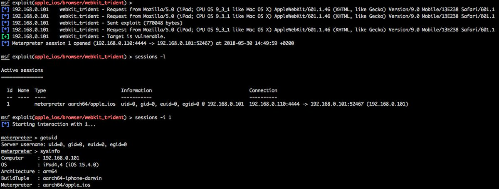

# hosselot
**https://twitter.com/hosselot/status/1012638938014605312 _at Fri Jun 29 10:08:31 +0000 2018_**
<blockquote>
Poc/Details of Microsoft Edge Chakra Engine JIT Use-after-free Vulnerability by fortinet (CVE-2018-0946):
https://t.co/orvqaCjk0l
</blockquote>

* https://www.fortinet.com/blog/threat-research/an-analysis-of-the-use-after-free-bug-in-microsoft-edge-chakra-engine.html

<table><tr>
<td>Quotes: <code>0</code></td>
<td>Replies: <code>0</code></td>
<td>Retweets: <code>17</code></td>
<td>Favorites: <code>45</code></td>
</tr></table>

---

# Dinosn
**https://twitter.com/Dinosn/status/1007865584875397120 _at Sat Jun 16 06:00:55 +0000 2018_**
<blockquote>
Microsoft COM for Windows Remote Code Execution Vulnerability (CVE-2018-0824) Analysis and PoC
https://t.co/ndbJ5pIalp
</blockquote>

* https://codewhitesec.blogspot.com/2018/06/cve-2018-0624.html

<table><tr>
<td>Quotes: <code>0</code></td>
<td>Replies: <code>0</code></td>
<td>Retweets: <code>53</code></td>
<td>Favorites: <code>63</code></td>
</tr></table>

---

# matthias_kaiser
**https://twitter.com/matthias_kaiser/status/1007614242231586816 _at Fri Jun 15 13:22:10 +0000 2018_**
<blockquote>
For the COM lovers -  My analysis of CVE-2018-0624 with POC :-) https://t.co/kfPqpm9T6O
</blockquote>

* https://twitter.com/codewhitesec/status/1007614010504765440

<table><tr>
<td>Quotes: <code>4</code></td>
<td>Replies: <code>4</code></td>
<td>Retweets: <code>84</code></td>
<td>Favorites: <code>145</code></td>
</tr></table>

---

# 360CoreSec
**https://twitter.com/360CoreSec/status/1004703755806257152 _at Thu Jun 07 12:36:56 +0000 2018_**
<blockquote>
CVE-2018-5002 – Analysis of the Second Wave of Flash Zero-day Exploit in 2018... https://t.co/gwuLu68o68
</blockquote>

* http://blogs.360.cn/blog/cve-2018-5002-en/

<table><tr>
<td>Quotes: <code>7</code></td>
<td>Replies: <code>2</code></td>
<td>Retweets: <code>107</code></td>
<td>Favorites: <code>135</code></td>
</tr></table>

---

# ddouhine
**https://twitter.com/ddouhine/status/1003211078623551488 _at Sun Jun 03 09:45:34 +0000 2018_**
<blockquote>
UAF exploit in WebKit's JavaScriptCore library (CVE-2016-4657) landed in @metasploit !! First #iOS exploit in #metasploit since 2012 and one of the vuln used by the #Pegasus spyware. Awesome project by @timwr backed up by @qwertyoruiopz @s1guza @thimstar works #PhoenixNonce https://t.co/0d63HeXVex
</blockquote>

<table><tr>
<td></td>
</tr></table>
<table><tr>
<td>Quotes: <code>4</code></td>
<td>Replies: <code>4</code></td>
<td>Retweets: <code>150</code></td>
<td>Favorites: <code>287</code></td>
</tr></table>

---

