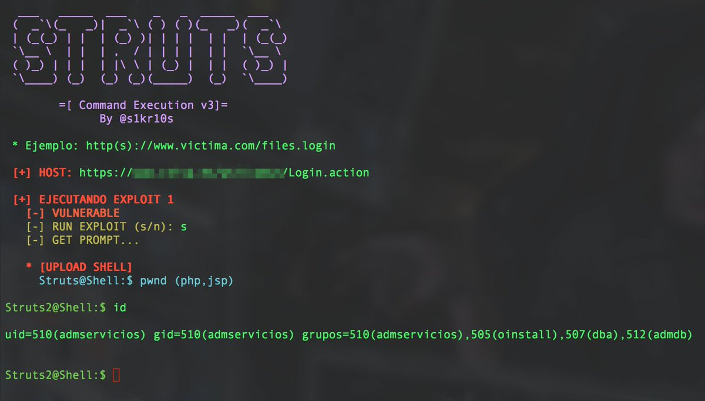
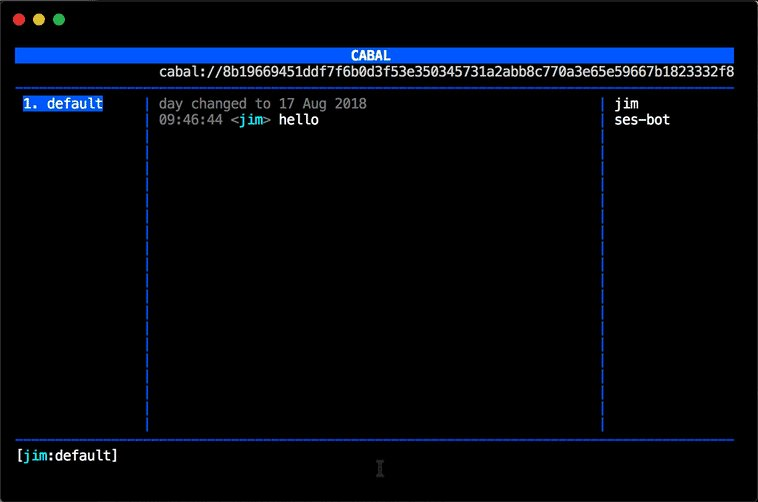

# ale_sp_brazil
**https://twitter.com/ale_sp_brazil/status/1035301242271096832 _at 2018-08-30 23:00:25_**
<blockquote>
(good slides): 

The Advanced Exploitation of 64-bit Edge Browser Use-After-Free Vulnerability on Windows 10:

https://t.co/Sk5epLIvOd

#exploitation #windows10 #vulnerability
</blockquote>

* https://github.com/mrowensnobody/presentation/blob/master/The%20Advanced%20Exploitation%20of%2064-bit%20Edge%20Browser%20Use-After-Free%20Vulnerability%20on%20Windows%2010.pdf

<table><tr>
<td>Quotes: <code>0</code></td>
<td>Replies: <code>0</code></td>
<td>Retweets: <code>89</code></td>
<td>Favorites: <code>135</code></td>
</table></tr>

---

# TheHackersNews
**https://twitter.com/TheHackersNews/status/1035056193989947392 _at 2018-08-30 06:46:41_**
<blockquote>
Hacker releases a simple tool that automatically finds vulnerable Apache Struts servers using Shodan API and performs mass exploitation via recently disclosed RCE (CVE-2018-11776) exploit

https://t.co/0Bd3aGLuZe via @037 https://t.co/SadelFQ1Zh
</blockquote>

* https://github.com/649/Apache-Struts-Shodan-Exploit

<table><tr>
<td></td>
</table></tr>
<table><tr>
<td>Quotes: <code>16</code></td>
<td>Replies: <code>3</code></td>
<td>Retweets: <code>396</code></td>
<td>Favorites: <code>515</code></td>
</table></tr>

---

# wugeej
**https://twitter.com/wugeej/status/1034996280370450432 _at 2018-08-30 02:48:37_**
<blockquote>
[PoC] [CVE-2018-8353] Microsoft Windows - JScript RegExp.lastIndex Use-After-Free
https://t.co/BTxV3TwraC
</blockquote>

* https://www.exploit-db.com/exploits/45279/

<table><tr>
<td>Quotes: <code>0</code></td>
<td>Replies: <code>0</code></td>
<td>Retweets: <code>0</code></td>
<td>Favorites: <code>0</code></td>
</table></tr>

---

# 0xdea
**https://twitter.com/0xdea/status/1034319786744995841 _at 2018-08-28 06:00:28_**
<blockquote>
Microsoft Windows task scheduler contains a local privilege escalation vulnerability in the ALPC interface

Advisory:
https://t.co/vcoUhH0POW

Exploit:
https://t.co/iHVe8yHom3
</blockquote>

* https://www.kb.cert.org/vuls/id/906424
* https://github.com/SandboxEscaper/randomrepo/blob/master/PoC-LPE.rar

<table><tr>
<td>Quotes: <code>1</code></td>
<td>Replies: <code>0</code></td>
<td>Retweets: <code>92</code></td>
<td>Favorites: <code>133</code></td>
</table></tr>

---

# TheHackersNews
**https://twitter.com/TheHackersNews/status/1034121687288164352 _at 2018-08-27 16:53:17_**
<blockquote>
A hacker has released an automated exploitation tool for 3 #ApacheStruts vulnerabilities, including the latest RCE flaw

https://t.co/WK1U78N9Hz

✔ CVE-2013-2251
✔ CVE-2017-5638
✔ CVE-2018-11776 https://t.co/fkc4aFMhOs
</blockquote>

* https://github.com/s1kr10s/Apache-Struts-v3

<table><tr>
<td></td>
</table></tr>
<table><tr>
<td>Quotes: <code>7</code></td>
<td>Replies: <code>7</code></td>
<td>Retweets: <code>362</code></td>
<td>Favorites: <code>508</code></td>
</table></tr>

---

# hosselot
**https://twitter.com/hosselot/status/1033953024664920065 _at 2018-08-27 05:43:05_**
<blockquote>
[Sandbox Escape] Google Chrome IndexedDBConnection Use-after-free Vulnerability (CVE-2018-6127):
https://t.co/ktHXyilwlN
</blockquote>

* https://bugs.chromium.org/p/chromium/issues/detail?id=842990

<table><tr>
<td>Quotes: <code>0</code></td>
<td>Replies: <code>0</code></td>
<td>Retweets: <code>19</code></td>
<td>Favorites: <code>40</code></td>
</table></tr>

---

# piedpiper1616
**https://twitter.com/piedpiper1616/status/1032030181219753984 _at 2018-08-21 22:22:24_**
<blockquote>
GitHub - atredispartners/CVE-2018-0952-SystemCollector: PoC for Privilege Escalation in Windows 10 Diagnostics Hub Standard Collector Service https://t.co/D0YnbxXiRm
</blockquote>

* https://github.com/atredispartners/CVE-2018-0952-SystemCollector/

<table><tr>
<td>Quotes: <code>0</code></td>
<td>Replies: <code>0</code></td>
<td>Retweets: <code>0</code></td>
<td>Favorites: <code>3</code></td>
</table></tr>

---

# jimpick
**https://twitter.com/jimpick/status/1030562746448769024 _at 2018-08-17 21:11:20_**
<blockquote>
I was inspired by @lotharrr's talk about Secure Ecmascript at #DWebSummit, and I made a chat bot server for cabal so I could try it out.

Any user can upload javascript for a bot and it will run. It's running live on the public cabal chat right now!

https://t.co/KzCrKfNreG https://t.co/guE4PM9jrc
</blockquote>

* https://github.com/jimpick/cabal-ses-bot

<table><tr>
<td></td>
</table></tr>
<table><tr>
<td>Quotes: <code>3</code></td>
<td>Replies: <code>2</code></td>
<td>Retweets: <code>10</code></td>
<td>Favorites: <code>45</code></td>
</table></tr>

---

# HackSysTeam
**https://twitter.com/HackSysTeam/status/1029753346813509632 _at 2018-08-15 15:35:04_**
<blockquote>
Microsoft patched one of our JScript bug which could lead to RCE and LPE on Windows as CVE-2018-8389
https://t.co/00wmlxmZsy
</blockquote>

* https://portal.msrc.microsoft.com/en-US/security-guidance/advisory/CVE-2018-8389

<table><tr>
<td>Quotes: <code>1</code></td>
<td>Replies: <code>4</code></td>
<td>Retweets: <code>26</code></td>
<td>Favorites: <code>54</code></td>
</table></tr>

---

