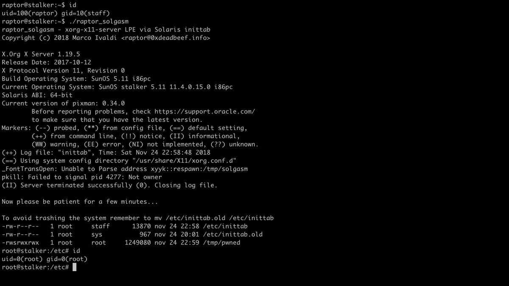
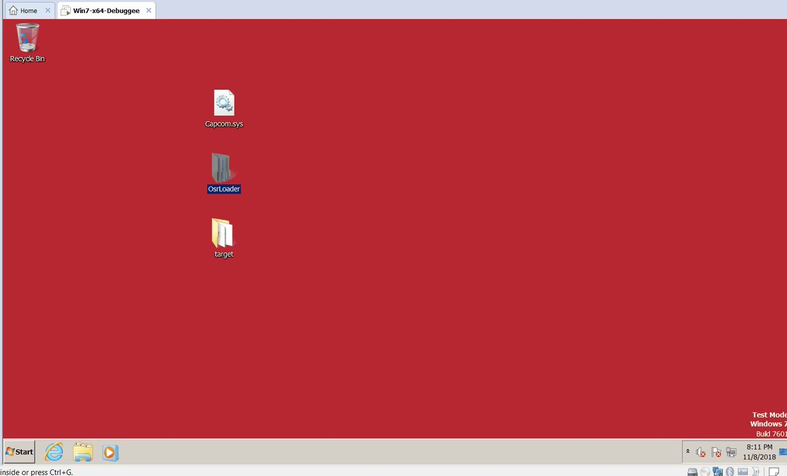
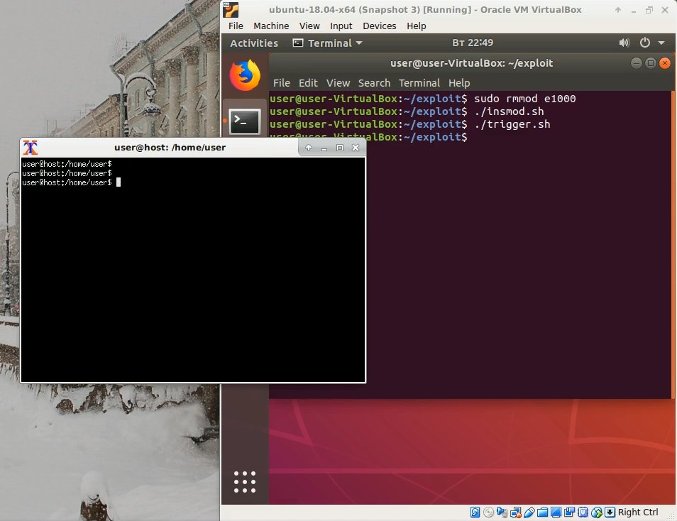
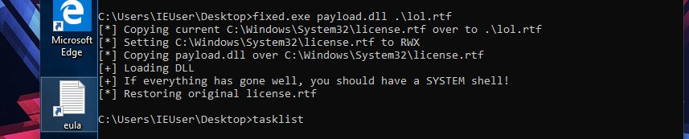

# realBrightiup
**https://twitter.com/realBrightiup/status/1067635421683675136 _at 2018-11-28 04:24:54_**
<blockquote>
Just release the PoC of CVE-2018-4415 and will talk more about CoreAnimation. 
https://t.co/i0uBHCM2wW
</blockquote>

* https://brightiup.me/QuartzCore/FunctionIntOverFlow.c

<table><tr>
<td>Quotes: <code>7</code></td>
<td>Replies: <code>7</code></td>
<td>Retweets: <code>60</code></td>
<td>Favorites: <code>145</code></td>
</tr></table>

---

# 0xdea
**https://twitter.com/0xdea/status/1066639453375119360 _at 2018-11-25 10:27:17_**
<blockquote>
I was investigating another 0day, when I noticed that Solaris 11 is also affected by the recent Xorg local privilege escalation vulnerability (CVE-2018-14665).

Here’s my fresh exploit:
https://t.co/k8yCF1jr3e

Please read comments carefully before running it. https://t.co/qakLdhls3c
</blockquote>

* https://github.com/0xdea/exploits/blob/master/solaris/raptor_solgasm

<table><tr>
<td></td>
</table></tr>
<table><tr>
<td>Quotes: <code>2</code></td>
<td>Replies: <code>4</code></td>
<td>Retweets: <code>135</code></td>
<td>Favorites: <code>226</code></td>
</tr></table>

---

# ddouhine
**https://twitter.com/ddouhine/status/1061316095443955713 _at 2018-11-10 17:54:10_**
<blockquote>
Upcoming macOS Safari exploit + LPE from Pwn2Own 2018 in #Metasploit ! Impressive exploit chain (which uses 3 different bugs to go from JS code running inside Safari to kernel-mode code execution) by @5aelo and metasploit integration by @timwr of course. https://t.co/9LNVxg3WfS https://t.co/i0Iv45if7J
</blockquote>

* https://github.com/rapid7/metasploit-framework/pull/10944

<table><tr>
<td></td>
</table></tr>
<table><tr>
<td>Quotes: <code>3</code></td>
<td>Replies: <code>0</code></td>
<td>Retweets: <code>101</code></td>
<td>Favorites: <code>184</code></td>
</tr></table>

---

# ihack4falafel
**https://twitter.com/ihack4falafel/status/1060710922115842048 _at 2018-11-09 01:49:25_**
<blockquote>
Inspired by @TheColonial "Hackingz Ze Komputerz" stream, here's my attempt at 'Capcom.sys` LPE exploit. @HackSysTeam HEVD is next on my list! https://t.co/1PAiqN6mpk https://t.co/LdhNp8vNUn
</blockquote>

* https://github.com/ihack4falafel/OSEE/tree/master/Kernel%20Exploitation/Capcom

<table><tr>
<td></td>
</table></tr>
<table><tr>
<td>Quotes: <code>1</code></td>
<td>Replies: <code>1</code></td>
<td>Retweets: <code>11</code></td>
<td>Favorites: <code>36</code></td>
</tr></table>

---

# hosselot
**https://twitter.com/hosselot/status/1060419986202746880 _at 2018-11-08 06:33:21_**
<blockquote>
Google Chrome on iOS Iframe Sandbox Escape Vulnerability (CVE-2018-17472):
https://t.co/93o1jPPS9m
</blockquote>

* https://bugs.chromium.org/p/chromium/issues/detail?id=822518

<table><tr>
<td>Quotes: <code>0</code></td>
<td>Replies: <code>1</code></td>
<td>Retweets: <code>28</code></td>
<td>Favorites: <code>55</code></td>
</tr></table>

---

# R0_CREW
**https://twitter.com/R0_CREW/status/1060095160024006657 _at 2018-11-07 09:02:36_**
<blockquote>
Full disclosure: Guest-to-Host escape from VirtualBox (0day)

EN: https://t.co/mbmP1F0BJj
RU: https://t.co/CbBoU7VNBQ

#VirtualBox #0day https://t.co/SqgAFKCiXP
</blockquote>

* https://github.com/MorteNoir1/virtualbox_e1000_0day
* https://habr.com/post/429004/

<table><tr>
<td></td>
</table></tr>
<table><tr>
<td>Quotes: <code>8</code></td>
<td>Replies: <code>1</code></td>
<td>Retweets: <code>334</code></td>
<td>Favorites: <code>419</code></td>
</tr></table>

---

# matteyeux
**https://twitter.com/matteyeux/status/1059173399468105729 _at 2018-11-04 19:59:51_**
<blockquote>
CVE-2018-4280: Mach port replacement vulnerability in launchd on macOS 10.13.5 leading to local privilege escalation and SIP bypass.
https://t.co/m4ifrnAlHe
</blockquote>

* https://github.com/bazad/launchd-portrep

<table><tr>
<td>Quotes: <code>3</code></td>
<td>Replies: <code>6</code></td>
<td>Retweets: <code>60</code></td>
<td>Favorites: <code>117</code></td>
</tr></table>

---

# ilove2pwn_
**https://twitter.com/ilove2pwn_/status/1058437968346705921 _at 2018-11-02 19:17:31_**
<blockquote>
Spool locked on Windows 10 or Server 2016 versions? No problem, Diagnostics Hub for the win! Combined some of Forshaw's Code &amp; SandBox Escaper's to create a reliable privilege escalation method. ALPC Diaghub &lt;3 (notepad example) https://t.co/VGhQ4CY1Tq Happy Hacking! https://t.co/3Vttzass8Y
</blockquote>

* https://github.com/realoriginal/alpc-diaghub

<table><tr>
<td></td>
<td></td>
</table></tr>
<table><tr>
<td>Quotes: <code>1</code></td>
<td>Replies: <code>1</code></td>
<td>Retweets: <code>42</code></td>
<td>Favorites: <code>71</code></td>
</tr></table>

---

# _Icewall
**https://twitter.com/_Icewall/status/1058019779209056262 _at 2018-11-01 15:35:47_**
<blockquote>
Promised, full exploitation  process of : TALOS-2018-0636 (CVE-2018-3971) -HitmanPro.Alert hmpalert Privilege Escalation Vulnerability https://t.co/sAlTcjUM7s . A.k.a how to use 0day in anti-0day product bypassing its LPE protection to gain SYSTEM.
</blockquote>

* https://blog.talosintelligence.com/2018/11/TALOS-2018-0636.html

<table><tr>
<td>Quotes: <code>4</code></td>
<td>Replies: <code>2</code></td>
<td>Retweets: <code>169</code></td>
<td>Favorites: <code>213</code></td>
</tr></table>

---

