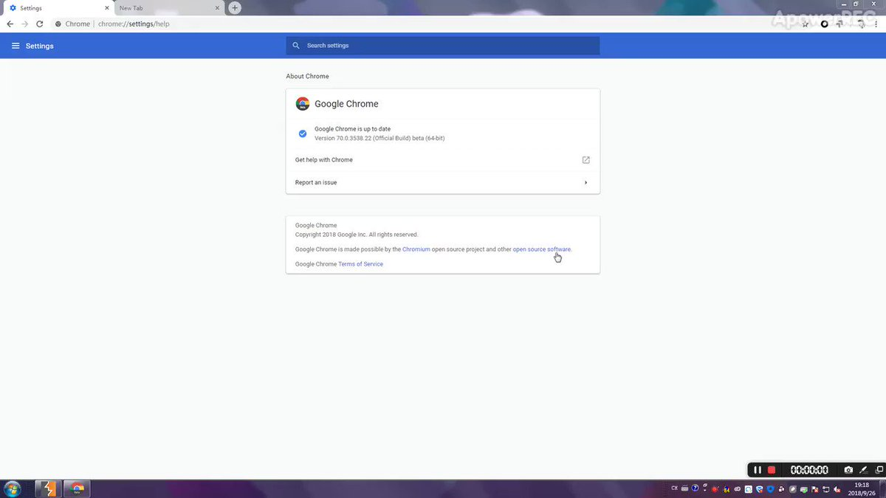
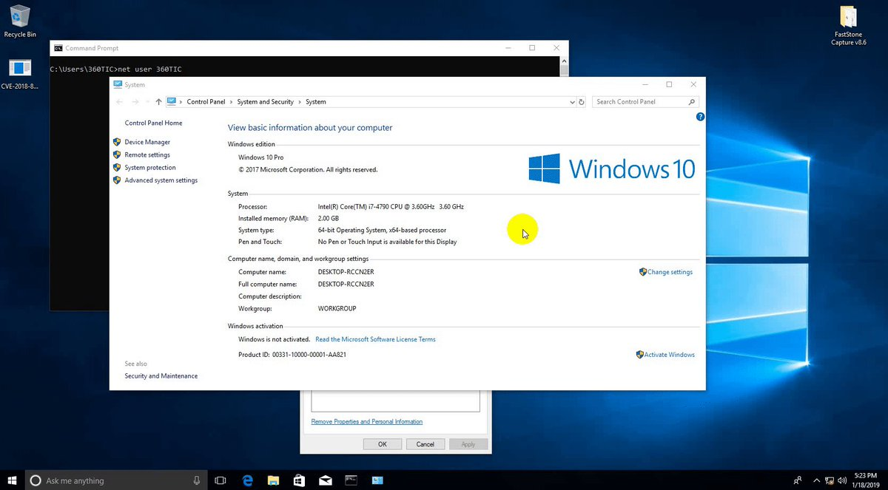

# AmarSaar
**https://twitter.com/AmarSaar/status/1090914852275740672 _at 2019-01-31 10:09:03_**
<blockquote>
Since we love spread knowledge - beside the UAF discussed here (CVE-2018-0965), in the same function (vpcivsp!VirtualBusChannelProcessPacket) there was an info disclosure: uninitialized local structure on the stack sent to the guest via VirtualBusPacketComplete (CVE-2018-0964)
</blockquote>

<table><tr>
<td>Quotes: <code>0</code></td>
<td>Replies: <code>0</code></td>
<td>Retweets: <code>4</code></td>
<td>Favorites: <code>56</code></td>
</tr></table>

---

# wugeej
**https://twitter.com/wugeej/status/1090028823280644096 _at 2019-01-28 23:28:17_**
<blockquote>
[PoC] [CVE-2018-18354] Chrome remote code execution attack chain

Ignore Sandbox , Ignore Applock , Ignore download restriction 
combined 3 bugs into logical vulnerability attack chain

https://t.co/IUWnx1mgZM https://t.co/M72aT42a5J
</blockquote>

* https://bugs.chromium.org/p/chromium/issues/detail?id=889459

<table><tr>
<td></td>
</table></tr>
<table><tr>
<td>Quotes: <code>4</code></td>
<td>Replies: <code>2</code></td>
<td>Retweets: <code>107</code></td>
<td>Favorites: <code>176</code></td>
</tr></table>

---

# anthraxx42
**https://twitter.com/anthraxx42/status/1088208619835936768 _at 2019-01-23 22:55:27_**
<blockquote>
CVE-2017-5123: Linux kernel privilege escalation -  Exploiting with full protections. SMEP, SMAP, and the Chrome Sandbox:
https://t.co/e9PdINNX3g
</blockquote>

* https://salls.github.io/Linux-Kernel-CVE-2017-5123/

<table><tr>
<td>Quotes: <code>3</code></td>
<td>Replies: <code>0</code></td>
<td>Retweets: <code>94</code></td>
<td>Favorites: <code>177</code></td>
</tr></table>

---

# TheHackersNews
**https://twitter.com/TheHackersNews/status/1087750945272926208 _at 2019-01-22 16:36:49_**
<blockquote>
NEW → Critical RCE flaw (CVE-2019-3462) found in #Linux apt/apt-get, which could allow remote MiTM hackers to trick systems into installing altered or malicious packages as #root

https://t.co/MZJwXC1c6Z

Exploitation of such flaw could have been mitigated if APT was using HTTPS https://t.co/8v7qSmUgjb
</blockquote>

* https://thehackernews.com/2019/01/linux-apt-http-hacking.html

<table><tr>
<td></td>
</table></tr>
<table><tr>
<td>Quotes: <code>36</code></td>
<td>Replies: <code>7</code></td>
<td>Retweets: <code>341</code></td>
<td>Favorites: <code>387</code></td>
</tr></table>

---

# RedDrip7
**https://twitter.com/RedDrip7/status/1086592120025042944 _at 2019-01-19 11:52:03_**
<blockquote>
#CVE-2018-8453 deep analysis, from Use After Free to arbitrary memory read/write by 360 Threat Intelligence Center, a follow up of vulnerability being used by #FruityArmor group targeting the Middle East.
https://t.co/0noINJnh3c

the video：https://t.co/YoZ3dXjh5W https://t.co/FAmHT5G2yj
</blockquote>

* https://ti.360.net/blog/articles/cve-2018-8453-win32k-elevation-of-privilege-vulnerability-targeting-the-middle-east-en/
* https://video.twimg.com/tweet_video/DxRRn7yV4AAKpFk.mp4

<table><tr>
<td></td>
</table></tr>
<table><tr>
<td>Quotes: <code>2</code></td>
<td>Replies: <code>1</code></td>
<td>Retweets: <code>86</code></td>
<td>Favorites: <code>160</code></td>
</tr></table>

---

# JailbreakReal
**https://twitter.com/JailbreakReal/status/1083464528010964992 _at 2019-01-10 20:44:07_**
<blockquote>
CVE-2018-4420 by @_simo36
POC of iOS kernel UAF
this is fixed on iOS 12.1.
https://t.co/VAJxFtfCYW
#rJailbreakNews #iOS12
</blockquote>

* https://github.com/0x36/CVE-pocs/blob/master/CVE-2018-4420-atm-uaf.c

<table><tr>
<td>Quotes: <code>0</code></td>
<td>Replies: <code>4</code></td>
<td>Retweets: <code>12</code></td>
<td>Favorites: <code>78</code></td>
</tr></table>

---

# _simo36
**https://twitter.com/_simo36/status/1083463346395979783 _at 2019-01-10 20:39:26_**
<blockquote>
a POC of an iOS kernel UAF  I found last year, CVE-2018-4420 fixed in 12.1, this requires host_priv port to be triggered. more bugs soon 
https://t.co/3zY4nXTsbF
</blockquote>

* https://github.com/0x36/CVE-pocs/blob/master/CVE-2018-4420-atm-uaf.c

<table><tr>
<td>Quotes: <code>5</code></td>
<td>Replies: <code>7</code></td>
<td>Retweets: <code>144</code></td>
<td>Favorites: <code>360</code></td>
</tr></table>

---

# Mimecast
**https://twitter.com/Mimecast/status/1082718864088150017 _at 2019-01-08 19:21:07_**
<blockquote>
Understand the security implications of the latest patched #MSOffice product memory leak vulnerability. https://t.co/zKXictP32S   #patchtuesday CVE-2019-0560 https://t.co/MhenJBltde
</blockquote>

* https://mim.ec/2SIDzQ1

<table><tr>
<td></td>
</table></tr>
<table><tr>
<td>Quotes: <code>3</code></td>
<td>Replies: <code>0</code></td>
<td>Retweets: <code>51</code></td>
<td>Favorites: <code>18</code></td>
</tr></table>

---

# n0x08
**https://twitter.com/n0x08/status/1082712033974349824 _at 2019-01-08 18:53:59_**
<blockquote>
Happy 1st Patch Tuesday of 2019! This is the largest January update I've seen in the 3ish years I've worked in MSRC and all the usual suspects are represented plus some Hyper-V fixes and this months highest CVSS score: CVE-2019-0547 which is a.....
</blockquote>

<table><tr>
<td>Quotes: <code>1</code></td>
<td>Replies: <code>3</code></td>
<td>Retweets: <code>26</code></td>
<td>Favorites: <code>66</code></td>
</tr></table>

---

# GuidoVranken
**https://twitter.com/GuidoVranken/status/1082642178755751938 _at 2019-01-08 14:16:24_**
<blockquote>
Full disclosure -- ZeroMQ libzmq remote code execution exploit

https://t.co/xaXlEGa51S
</blockquote>

* https://github.com/zeromq/libzmq/issues/3351

<table><tr>
<td>Quotes: <code>3</code></td>
<td>Replies: <code>1</code></td>
<td>Retweets: <code>101</code></td>
<td>Favorites: <code>163</code></td>
</tr></table>

---

# github
**https://twitter.com/github/status/1082387150954512384 _at 2019-01-07 21:23:01_**
<blockquote>
Use private repositories with three of your closest collaborators *for free* 🙌
https://t.co/rSJrtvsXfS https://t.co/oRVpNP1c3r
</blockquote>

* https://github.com/pricing

<table><tr>
<td></td>
</table></tr>
<table><tr>
<td>Quotes: <code>384</code></td>
<td>Replies: <code>74</code></td>
<td>Retweets: <code>1576</code></td>
<td>Favorites: <code>3856</code></td>
</tr></table>

---

# hosselot
**https://twitter.com/hosselot/status/1081109879031513088 _at 2019-01-04 08:47:35_**
<blockquote>
Exploit/writeup for Google Chrome V8 Remote Code Execution Vulnerability by Samuel Gross (CVE-2018-17463):
https://t.co/9gm0qPK4Z3
</blockquote>

* https://bugs.chromium.org/p/chromium/issues/detail?id=888923

<table><tr>
<td>Quotes: <code>1</code></td>
<td>Replies: <code>0</code></td>
<td>Retweets: <code>66</code></td>
<td>Favorites: <code>140</code></td>
</tr></table>

---

# bchavez
**https://twitter.com/bchavez/status/1080989375335256064 _at 2019-01-04 00:48:45_**
<blockquote>
We tracked down a massive memory leak in ASPNET 2.2's new routing code: https://t.co/0FdKrDxWZD

I kinda enjoy tracking down memory leaks; elusive bugs are fun to discover especially in Microsoft's code ;) #dotnet #AspNetCore
</blockquote>

* https://github.com/aspnet/AspNetCore/issues/6102

<table><tr>
<td>Quotes: <code>0</code></td>
<td>Replies: <code>2</code></td>
<td>Retweets: <code>14</code></td>
<td>Favorites: <code>34</code></td>
</tr></table>

---

# soaj1664ashar
**https://twitter.com/soaj1664ashar/status/1080877419723194370 _at 2019-01-03 17:23:53_**
<blockquote>
XML External Entity #XXE resources: 

https://t.co/JswNPw9JAq +

https://t.co/8T1eQxmJcN +

https://t.co/fStz523EWf +

https://t.co/PhOekbMubl +

https://t.co/io5zTSsSp7 +

https://t.co/7E64HStrDJ +

https://t.co/9Vni7NrPzW +

https://t.co/DZ0zBMcOCS +

https://t.co/CdJ6p6QPF5
</blockquote>

* https://web-in-security.blogspot.com/2016/03/xxe-cheat-sheet.html
* https://github.com/enjoiz/XXEinjector
* https://github.com/staaldraad/xxeserv
* https://github.com/BuffaloWill/oxml_xxe
* https://github.com/GDSSecurity/xxe-recursive-download
* https://github.com/swisskyrepo/PayloadsAllTheThings/tree/master/XXE%20injection
* https://isc.sans.edu/diary/Blindly+confirming+XXE/19257
* https://vsecurity.com//download/papers/XMLDTDEntityAttacks.pdf
* https://www.slideshare.net/ssuserf09cba/xxe-how-to-become-a-jedi

<table><tr>
<td>Quotes: <code>8</code></td>
<td>Replies: <code>3</code></td>
<td>Retweets: <code>318</code></td>
<td>Favorites: <code>583</code></td>
</tr></table>

---

