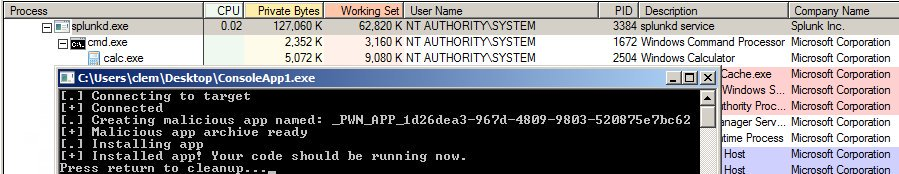
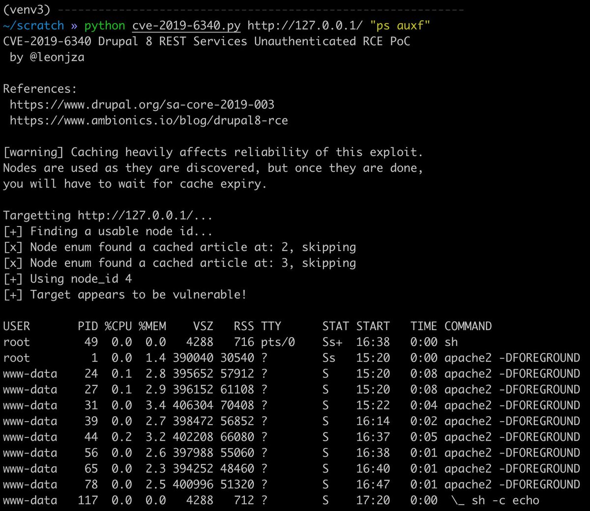
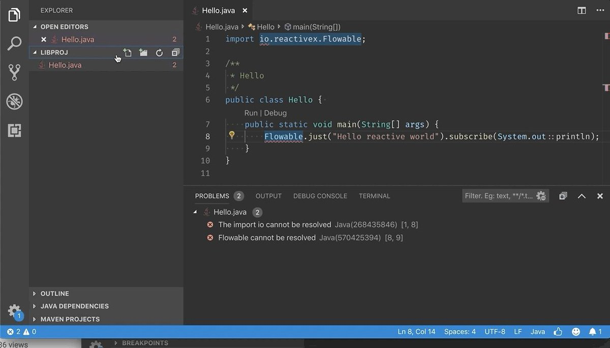

# wugeej
**https://twitter.com/wugeej/status/1100557747483856896 _at 2019-02-27 00:46:29_**
<blockquote>
[PoC] Jenkins RCE Proof-of-Concept: SECURITY-1266 / CVE-2019-1003000 (Script Security), CVE-2019-1003001 (Pipeline: Groovy), CVE-2019-1003002 (Pipeline: Declarative) 

https://t.co/6O8FddvJ4W
</blockquote>

* https://github.com/adamyordan/cve-2019-1003000-jenkins-rce-poc

<table><tr>
<td>Quotes: <code>0</code></td>
<td>Replies: <code>1</code></td>
<td>Retweets: <code>6</code></td>
<td>Favorites: <code>6</code></td>
</table></tr>

---

# wugeej
**https://twitter.com/wugeej/status/1100557746066272257 _at 2019-02-27 00:46:28_**
<blockquote>
[PoC] Jenkins RCE PoC. From unauthenticated user to remote code execution - it's a hacker's dream! (Chaining CVE-2019-1003000, CVE-2018-1999002, and more)

https://t.co/5VaYi00nbS
</blockquote>

* https://github.com/petercunha/Jenkins-PreAuth-RCE-PoC

<table><tr>
<td>Quotes: <code>0</code></td>
<td>Replies: <code>1</code></td>
<td>Retweets: <code>0</code></td>
<td>Favorites: <code>2</code></td>
</table></tr>

---

# cnotin
**https://twitter.com/cnotin/status/1100019285290815488 _at 2019-02-25 13:06:49_**
<blockquote>
Do you want to #exploit misconfigured #Splunk Universal Forwarders (HTTPS/8089)? 💣

I offer you two tools for Remote Code Execution #RCE and Local Privilege Escalation #LPE. Python and C# 😎

📄 https://t.co/0SL1duDYyv
👨‍💻  https://t.co/YnPETBdjkj https://t.co/cpWA7rQrg3
</blockquote>

* https://clement.notin.org/blog/2019/02/25/Splunk-Universal-Forwarder-Hijacking-2-SplunkWhisperer2/
* https://github.com/cnotin/SplunkWhisperer2

<table><tr>
<td></td>
</table></tr>
<table><tr>
<td>Quotes: <code>7</code></td>
<td>Replies: <code>5</code></td>
<td>Retweets: <code>352</code></td>
<td>Favorites: <code>613</code></td>
</table></tr>

---

# leonjza
**https://twitter.com/leonjza/status/1099723330746232832 _at 2019-02-24 17:30:48_**
<blockquote>
PoC for CVE-2019-6340, the #drupal 8 REST unauthenticated RCE based on https://t.co/5loZJxaiKs. Caching heavily messes with this one it seems, so the PoC tries to find usable nodes that are not cached. Tested with the drupal:8.6.9 docker container.

https://t.co/8eNJ2hYjfu https://t.co/WFJJO6kTLm
</blockquote>

* https://www.ambionics.io/blog/drupal8-rce
* https://gist.github.com/leonjza/d0ab053be9b06fa020b66f00358e3d88

<table><tr>
<td></td>
</table></tr>
<table><tr>
<td>Quotes: <code>0</code></td>
<td>Replies: <code>1</code></td>
<td>Retweets: <code>51</code></td>
<td>Favorites: <code>104</code></td>
</table></tr>

---

# VSCodeJava
**https://twitter.com/VSCodeJava/status/1098686688166141953 _at 2019-02-21 20:51:33_**
<blockquote>
vscode-java 0.39.0 is out! On the menu today: fixed a file handle/memory leak on Windows, using vscode's default file encoding (UTF-8) to better render sources, automatic discovery of jars under lib/, for standalone java files. See   https://t.co/mBO8wf5nW9
Best release eveeer! https://t.co/7LlQ0kBFEC
</blockquote>

* https://github.com/redhat-developer/vscode-java/blob/master/CHANGELOG.md#0390-february-21st-2019

<table><tr>
<td></td>
</table></tr>
<table><tr>
<td>Quotes: <code>4</code></td>
<td>Replies: <code>2</code></td>
<td>Retweets: <code>30</code></td>
<td>Favorites: <code>55</code></td>
</table></tr>

---

# XssPayloads
**https://twitter.com/XssPayloads/status/1098135934665719808 _at 2019-02-20 08:23:03_**
<blockquote>
Microsoft Edge RCE PoC (CVE-2018-8495). Nice payload by @kmkz_security 
https://t.co/JBz1wmms6W

Initial  writeup: https://t.co/Jd5BrMN2zv
</blockquote>

* http://bit.ly/2XdzMNm
* http://bit.ly/2EkFPIs

<table><tr>
<td>Quotes: <code>2</code></td>
<td>Replies: <code>3</code></td>
<td>Retweets: <code>134</code></td>
<td>Favorites: <code>249</code></td>
</table></tr>

---

# _fel1x
**https://twitter.com/_fel1x/status/1096460676678201344 _at 2019-02-15 17:26:11_**
<blockquote>
CVE-2019-7221 is a pretty nice guest-triggerable use-after-free in KVM (https://t.co/NhHXDsbWVV) and CVE-2019-7222 is an info leak to help with exploitation (https://t.co/tLV45JUKSv).
</blockquote>

* https://bugs.chromium.org/p/project-zero/issues/detail?id=1760
* https://bugs.chromium.org/p/project-zero/issues/detail?id=1759

<table><tr>
<td>Quotes: <code>3</code></td>
<td>Replies: <code>3</code></td>
<td>Retweets: <code>166</code></td>
<td>Favorites: <code>285</code></td>
</table></tr>

---

# CyberWarship
**https://twitter.com/CyberWarship/status/1096356055787978752 _at 2019-02-15 10:30:27_**
<blockquote>
Ultra awesome Talk (RCE in chrome) by @_niklasb at @offensive_con very thank you!

PoC
https://t.co/z39pYbMk8A

#offensivecon19 #infosec #pentest #exploitDev https://t.co/yMRIM1yFJl
</blockquote>

* https://github.com/niklasb/hack2win-chrome

<table><tr>
<td></td>
</table></tr>
<table><tr>
<td>Quotes: <code>1</code></td>
<td>Replies: <code>0</code></td>
<td>Retweets: <code>49</code></td>
<td>Favorites: <code>121</code></td>
</table></tr>

---

# wugeej
**https://twitter.com/wugeej/status/1095474306291658753 _at 2019-02-13 00:06:42_**
<blockquote>
[PoC] Jenkins 2.150.2 - Remote Command Execution Exploit
https://t.co/ASgVkWvGCq

[PoC] [CVE-2018-19524] Skyworth GPON HomeGateways and Optical Network Terminals - Stack Overflow Exploit
https://t.co/Q9Q15hkxJk
</blockquote>

* https://www.exploit-db.com/exploits/46352
* https://0day.today/exploit/32164

<table><tr>
<td>Quotes: <code>0</code></td>
<td>Replies: <code>1</code></td>
<td>Retweets: <code>4</code></td>
<td>Favorites: <code>5</code></td>
</table></tr>

---

# wugeej
**https://twitter.com/wugeej/status/1095474307621302272 _at 2019-02-13 00:06:42_**
<blockquote>
[PoC] [CVE-2019-1999] Android - binder Use-After-Free of VMA via race Between reclaim and munmap Exploit
https://t.co/GFjkhgNGsA
Proof of Concept:
https://t.co/hBkqZW1eqt
</blockquote>

* https://0day.today/exploit/32167
* https://github.com/offensive-security/exploitdb-bin-sploits/raw/master/bin-sploits/46357.zip

<table><tr>
<td>Quotes: <code>0</code></td>
<td>Replies: <code>1</code></td>
<td>Retweets: <code>0</code></td>
<td>Favorites: <code>1</code></td>
</table></tr>

---

# wugeej
**https://twitter.com/wugeej/status/1095474309017915392 _at 2019-02-13 00:06:42_**
<blockquote>
[PoC] [CVE-2019-2000] Android - binder Use-After-Free via fdget() Optimization Exploit
https://t.co/m7z3sqQMrX

Proof of Concept:
https://t.co/po4nt1lOPl
</blockquote>

* https://0day.today/exploit/32168
* https://github.com/offensive-security/exploitdb-bin-sploits/raw/master/bin-sploits/46356.zip

<table><tr>
<td>Quotes: <code>0</code></td>
<td>Replies: <code>0</code></td>
<td>Retweets: <code>0</code></td>
<td>Favorites: <code>1</code></td>
</table></tr>

---

# lavados
**https://twitter.com/lavados/status/1095189185827405829 _at 2019-02-12 05:13:44_**
<blockquote>
Finally, our SGX Malware paper is on #arXiv (https://t.co/IjwUCFRNy9) and the PoC on #Github (https://t.co/P6ppbX5A5s) for everyone to try.
Not side channels in SGX but this time we can hide real malware in SGX.
</blockquote>

* https://arxiv.org/abs/1902.03256
* https://github.com/sgxrop/sgxrop

<table><tr>
<td>Quotes: <code>15</code></td>
<td>Replies: <code>9</code></td>
<td>Retweets: <code>238</code></td>
<td>Favorites: <code>398</code></td>
</table></tr>

---

# campuscodi
**https://twitter.com/campuscodi/status/1094212733871030272 _at 2019-02-09 12:33:39_**
<blockquote>
Google reveals details about CVE-2018-18354, a remote code execution in Chrome, patched in December (Chrome 71)

https://t.co/4pLAMCuZDs https://t.co/GINXF8wInO
</blockquote>

* https://bugs.chromium.org/p/chromium/issues/detail?id=889459

<table><tr>
<td></td>
</table></tr>
<table><tr>
<td>Quotes: <code>0</code></td>
<td>Replies: <code>0</code></td>
<td>Retweets: <code>23</code></td>
<td>Favorites: <code>42</code></td>
</table></tr>

---

# steventseeley
**https://twitter.com/steventseeley/status/1091329594026852352 _at 2019-02-01 13:37:05_**
<blockquote>
Heres my writeup for the discovery and exploitation of CVE-2018-19418 with the CVE-2018-19447 analysis thrown in!

ActiveX Exploitation in 2019 :: Instantiation is not Scripting https://t.co/NQBRdKKaSS
</blockquote>

* https://srcincite.io/blog/2019/02/01/activex-exploitation-in-2018-instantiation-is-not-scripting.html

<table><tr>
<td>Quotes: <code>4</code></td>
<td>Replies: <code>6</code></td>
<td>Retweets: <code>215</code></td>
<td>Favorites: <code>394</code></td>
</table></tr>

---

