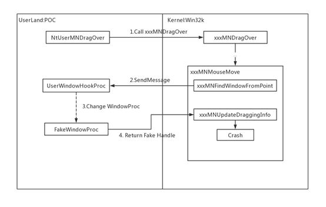
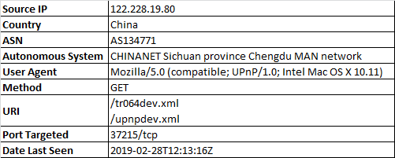

# Dinosn
**https://twitter.com/Dinosn/status/1111173414688116736 _at 2019-03-28 07:49:21_**
<blockquote>
RCE on Apache Solr using deserialization of untrusted data via jmx.serviceUrl
https://t.co/eNCLkPUg8u
</blockquote>

* https://github.com/mpgn/CVE-2019-0192/

<table><tr>
<td>Quotes: <code>0</code></td>
<td>Replies: <code>0</code></td>
<td>Retweets: <code>61</code></td>
<td>Favorites: <code>124</code></td>
</table></tr>

---

# kunalp94
**https://twitter.com/kunalp94/status/1110187870185127937 _at 2019-03-25 14:33:09_**
<blockquote>
Really enjoyed this video about "CVE-2018-10994, Steal messages from Signal using RCE". From explanation to exploitation.
Check out his channel  :)

https://t.co/Z74TN9Tw3L
</blockquote>

* https://www.youtube.com/watch?v=mGe95jhQONc

<table><tr>
<td>Quotes: <code>0</code></td>
<td>Replies: <code>0</code></td>
<td>Retweets: <code>13</code></td>
<td>Favorites: <code>39</code></td>
</table></tr>

---

# wugeej
**https://twitter.com/wugeej/status/1109979902046945280 _at 2019-03-25 00:46:45_**
<blockquote>
[PoC] CVE-2019-0604: Microsoft SharePoint RCE 

https://t.co/vcGwXD2exx
</blockquote>

* https://github.com/k1n9/CVE-2019-0604/?fbclid=IwAR295OULlw76Qkw2Qc1BgT4eAbV7fB3C0fmK2EhuZ4_iqh7yHMKzZ1lfr4s

<table><tr>
<td>Quotes: <code>0</code></td>
<td>Replies: <code>6</code></td>
<td>Retweets: <code>85</code></td>
<td>Favorites: <code>183</code></td>
</table></tr>

---

# _sinn3r
**https://twitter.com/_sinn3r/status/1109141908729880577 _at 2019-03-22 17:16:52_**
<blockquote>
CVE-2019-5786 Google Chrome FileReader use-after-free exploit: https://t.co/Lmt21ZMyzz
</blockquote>

* https://github.com/exodusintel/CVE-2019-5786

<table><tr>
<td>Quotes: <code>2</code></td>
<td>Replies: <code>1</code></td>
<td>Retweets: <code>46</code></td>
<td>Favorites: <code>81</code></td>
</table></tr>

---

# _r_netsec
**https://twitter.com/_r_netsec/status/1109078380232597504 _at 2019-03-22 13:04:26_**
<blockquote>
CVE-2019-0604: Details of a Microsoft SharePoint RCE Vulnerability https://t.co/LVNDwmuMSr
</blockquote>

* https://www.thezdi.com/blog/2019/3/13/cve-2019-0604-details-of-a-microsoft-sharepoint-rce-vulnerability

<table><tr>
<td>Quotes: <code>0</code></td>
<td>Replies: <code>0</code></td>
<td>Retweets: <code>40</code></td>
<td>Favorites: <code>88</code></td>
</table></tr>

---

# perito_inf
**https://twitter.com/perito_inf/status/1108758787870154753 _at 2019-03-21 15:54:29_**
<blockquote>
CVE-2019-5786 - Chrome 72.0.3626.119 stable FileReader UaF exploit for Windows 7 x86

Analysis of a Chrome Zero Day: CVE-2019-5786

https://t.co/7VKVkOEiWD

PoC:
https://t.co/SkZ1OKJOJr
</blockquote>

* https://securingtomorrow.mcafee.com/other-blogs/mcafee-labs/analysis-of-a-chrome-zero-day-cve-2019-5786/
* https://github.com/exodusintel/CVE-2019-5786

<table><tr>
<td>Quotes: <code>0</code></td>
<td>Replies: <code>0</code></td>
<td>Retweets: <code>7</code></td>
<td>Favorites: <code>9</code></td>
</table></tr>

---

# scriptjunkie1
**https://twitter.com/scriptjunkie1/status/1108553355541049345 _at 2019-03-21 02:18:10_**
<blockquote>
Exodus Intel CVE-2019-5786 Chrome 72.0.3626.119 stable FileReader UaF exploit for Windows 7 x86.
https://t.co/oQTuky95zx
</blockquote>

* https://github.com/exodusintel/CVE-2019-5786

<table><tr>
<td>Quotes: <code>0</code></td>
<td>Replies: <code>0</code></td>
<td>Retweets: <code>34</code></td>
<td>Favorites: <code>71</code></td>
</table></tr>

---

# RanchoIce
**https://twitter.com/RanchoIce/status/1107925785866723328 _at 2019-03-19 08:44:26_**
<blockquote>
Analysis of CVE-2019-5786 Chrome FileReader Use-After-Free
https://t.co/gfc27CTMpB
</blockquote>

* https://weibo.com/ttarticle/p/show?id=2309404351596157885398

<table><tr>
<td>Quotes: <code>0</code></td>
<td>Replies: <code>0</code></td>
<td>Retweets: <code>18</code></td>
<td>Favorites: <code>41</code></td>
</table></tr>

---

# x0rz
**https://twitter.com/x0rz/status/1107627861408649219 _at 2019-03-18 13:00:35_**
<blockquote>
Windows Kernel Privilege Escalation Vulnerability (CVE-2019-0808) root cause analysis https://t.co/tz8WuCNl1D #vulnerability #windows https://t.co/dEAEtdN5a0
</blockquote>

* http://blogs.360.cn/post/RootCause_CVE-2019-0808_EN.html

<table><tr>
<td></td>
</table></tr>
<table><tr>
<td>Quotes: <code>0</code></td>
<td>Replies: <code>0</code></td>
<td>Retweets: <code>51</code></td>
<td>Favorites: <code>110</code></td>
</table></tr>

---

# iBSparkes
**https://twitter.com/iBSparkes/status/1106978958837460992 _at 2019-03-16 18:02:05_**
<blockquote>
@FCE365 If you are curious about how a real jailbreak is done, check out the source code of yalu102. That thing really is impressive. https://t.co/FUnoAZm1mA
</blockquote>

* https://github.com/kpwn/yalu102

<table><tr>
<td>Quotes: <code>2</code></td>
<td>Replies: <code>8</code></td>
<td>Retweets: <code>21</code></td>
<td>Favorites: <code>170</code></td>
</table></tr>

---

# Dinosn
**https://twitter.com/Dinosn/status/1106217578551218176 _at 2019-03-14 15:36:37_**
<blockquote>
Generic Windows 7,8,10 SMEP, KASLR &amp; DEP Bypass Using the Page Table's Self-reference Entry
https://t.co/Xg67tHzupZ
</blockquote>

* https://github.com/scalys7/Privilege-Escalation-Framework/blob/master/Privilege%20Escalation%20Framework/Virtual%20Tables%20Self%20Reference%20Exploiter.cpp

<table><tr>
<td>Quotes: <code>0</code></td>
<td>Replies: <code>0</code></td>
<td>Retweets: <code>32</code></td>
<td>Favorites: <code>63</code></td>
</table></tr>

---

# 360CoreSec
**https://twitter.com/360CoreSec/status/1106115047787393025 _at 2019-03-14 08:49:12_**
<blockquote>
Microsoft fixed a Windows 0day (CVE-2019-0808) in Patch Tuesday. Our team constructed the POC and reproduced the vulnerability triggering process. Click here to read more: https://t.co/aE6l1nPwnw
</blockquote>

* http://blogs.360.cn/post/RootCause_CVE-2019-0808_EN.html

<table><tr>
<td>Quotes: <code>0</code></td>
<td>Replies: <code>0</code></td>
<td>Retweets: <code>188</code></td>
<td>Favorites: <code>308</code></td>
</table></tr>

---

# Edu_Braun_0day
**https://twitter.com/Edu_Braun_0day/status/1106048620678311942 _at 2019-03-14 04:25:15_**
<blockquote>
MSHTML Engine RCE - CVE-2019-0541: Running arbitrary code on any Windows version since at least XP up to latest 10 and Server 2019 made SURPRISINGLY easy. Video: https://t.co/V1jQ0TJ7C7  and PoC: https://t.co/KRLmCHXYpN
</blockquote>

* https://youtu.be/OdEwBY7rXMw
* https://www.exploit-db.com/exploits/46536

<table><tr>
<td>Quotes: <code>6</code></td>
<td>Replies: <code>3</code></td>
<td>Retweets: <code>184</code></td>
<td>Favorites: <code>303</code></td>
</table></tr>

---

# piedpiper1616
**https://twitter.com/piedpiper1616/status/1104831560744751104 _at 2019-03-10 19:49:05_**
<blockquote>
GitHub - mpgn/CVE-2019-0192: RCE on Apache Solr using deserialization of untrusted data via jmx.serviceUrl https://t.co/y0wUfQknsU
</blockquote>

* https://github.com/mpgn/CVE-2019-0192/

<table><tr>
<td>Quotes: <code>2</code></td>
<td>Replies: <code>0</code></td>
<td>Retweets: <code>113</code></td>
<td>Favorites: <code>216</code></td>
</table></tr>

---

# OPOSEC
**https://twitter.com/OPOSEC/status/1103928346650374144 _at 2019-03-08 08:00:02_**
<blockquote>
Android Media framework UaF PoC (CVE-2018-9539). https://t.co/WSHflIpdtG #Hack #248 (2018)
</blockquote>

* https://github.com/tamirzb/CVE-2018-9539/

<table><tr>
<td>Quotes: <code>0</code></td>
<td>Replies: <code>0</code></td>
<td>Retweets: <code>1</code></td>
<td>Favorites: <code>3</code></td>
</table></tr>

---

# TheHackersNews
**https://twitter.com/TheHackersNews/status/1103233119434489857 _at 2019-03-06 09:57:27_**
<blockquote>
⚠️ Important — Update your #Google Chrome immediately to patch a new high-severity 0-day RCE #vulnerability (CVE-2019-5786) that hackers are actively exploiting in the wild

https://t.co/vrorvFYuU8

Patched Chrome version 72.0.3626.121 has been released for Windows, macOS, Linux https://t.co/IoW8ZjQgZZ
</blockquote>

* https://thehackernews.com/2019/03/update-google-chrome-hack.html

<table><tr>
<td></td>
</table></tr>
<table><tr>
<td>Quotes: <code>65</code></td>
<td>Replies: <code>13</code></td>
<td>Retweets: <code>629</code></td>
<td>Favorites: <code>494</code></td>
</table></tr>

---

# cBekrar
**https://twitter.com/cBekrar/status/1103138159133569024 _at 2019-03-06 03:40:07_**
<blockquote>
Google discovered a Chrome RCE #0day in the wild (CVE-2019-5786). Reportedly, a full chain with a sandbox escape: https://t.co/Nxfrvr5wIh 

In 2019, I expect epic 0days to be found in the wild: Android, iOS, Windows, Office, virtualization, and more. Stay safe and enjoy the show.
</blockquote>

* https://chromereleases.googleblog.com/2019/03/stable-channel-update-for-desktop.html

<table><tr>
<td>Quotes: <code>7</code></td>
<td>Replies: <code>7</code></td>
<td>Retweets: <code>161</code></td>
<td>Favorites: <code>234</code></td>
</table></tr>

---

# bad_packets
**https://twitter.com/bad_packets/status/1101336832204128256 _at 2019-03-01 04:22:17_**
<blockquote>
Incoming scans from 🇨🇳 looking for Huawei routers. Likely looking to exploit CVE-2017-17215 which allows RCE. 
Proof of concept: https://t.co/2UMuc8aqH2 https://t.co/dPgh0DoRx2
</blockquote>

* https://www.exploit-db.com/exploits/43414

<table><tr>
<td></td>
</table></tr>
<table><tr>
<td>Quotes: <code>2</code></td>
<td>Replies: <code>0</code></td>
<td>Retweets: <code>11</code></td>
<td>Favorites: <code>15</code></td>
</table></tr>

---

