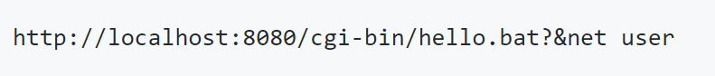

# thezdi
**https://twitter.com/thezdi/status/1121431383870771200 _at 2019-04-25 15:10:51_**
<blockquote>
CVE-2019-0726/ZDI-19-272: @HexKitchen details a vuln in the #Windows DHCP Client reported by Trend's own Saran Neti. Bug could lead to RCE. Blog provides root cause analysis &amp; steps to reproduce. https://t.co/NlFISGNqZt
</blockquote>

* http://bit.ly/2UTCs56

<table><tr>
<td>Quotes: <code>1</code></td>
<td>Replies: <code>0</code></td>
<td>Retweets: <code>85</code></td>
<td>Favorites: <code>138</code></td>
</table></tr>

---

# craiu
**https://twitter.com/craiu/status/1118756989503406082 _at 2019-04-18 06:03:46_**
<blockquote>
We found another 0day used in the wild, CVE-2019-0859. This one seems to have been developed by the prolific 0day maker and seller known as “Volodya”. Volodya sells 0days to both criminals and APTs https://t.co/1WBvETJTF2
</blockquote>

* https://securelist.com/new-win32k-zero-day-cve-2019-0859/90435/

<table><tr>
<td>Quotes: <code>7</code></td>
<td>Replies: <code>5</code></td>
<td>Retweets: <code>342</code></td>
<td>Favorites: <code>541</code></td>
</table></tr>

---

# ptracesecurity
**https://twitter.com/ptracesecurity/status/1118375367281205253 _at 2019-04-17 04:47:20_**
<blockquote>
CVE-2019-0232: Apache Tomcat Remote Code Execution on Windows https://t.co/auveCG8m3D #Windows #ApacheTomcat #Vulnerability #Exploit #Pentesting #Infosec https://t.co/EqFdhBAKga
</blockquote>

* https://github.com/pyn3rd/CVE-2019-0232/

<table><tr>
<td></td>
</table></tr>
<table><tr>
<td>Quotes: <code>1</code></td>
<td>Replies: <code>0</code></td>
<td>Retweets: <code>25</code></td>
<td>Favorites: <code>47</code></td>
</table></tr>

---

# Jackson_T
**https://twitter.com/Jackson_T/status/1117767541999357952 _at 2019-04-15 12:32:03_**
<blockquote>
CVE-2019-9730: Local privilege elevation in Synaptics Sound Device Driver package. Multiple OEMs affected. Exploit and write-up here: https://t.co/swozSC1Ka7. https://t.co/R6NmPG370G
</blockquote>

* http://jackson-t.ca/synaptics-cxutilsvc-lpe.html

<table><tr>
<td></td>
</table></tr>
<table><tr>
<td>Quotes: <code>7</code></td>
<td>Replies: <code>9</code></td>
<td>Retweets: <code>362</code></td>
<td>Favorites: <code>710</code></td>
</table></tr>

---

# CyberWarship
**https://twitter.com/CyberWarship/status/1117727023424782338 _at 2019-04-15 09:51:03_**
<blockquote>
CVE-2019-0541 - Exploit  

MSHTML Engine RCE on any Windows version since at least XP up to 10 &amp;&amp; Server 2019 

#infosec #pentest #exploit 
https://t.co/B7gGcGl1y7
</blockquote>

* https://www.exploit-db.com/exploits/46536

<table><tr>
<td>Quotes: <code>2</code></td>
<td>Replies: <code>1</code></td>
<td>Retweets: <code>180</code></td>
<td>Favorites: <code>319</code></td>
</table></tr>

---

# securisec
**https://twitter.com/securisec/status/1116980875449778176 _at 2019-04-13 08:26:07_**
<blockquote>
"RT RT CodeColorist: Got someone asking for the PoC of CVE-2018-8142, the LPE for Microsoft Autoupdate Helper 3.18(180410) (affects MS Office 2016 and SkypeForBusiness for macOS, writeup: https://t.co/jreWCUS2i9), and here you are: https://t.co/52PhdWQnEk"
</blockquote>

* https://medium.com/0xcc/cve-2018-8412-ms-office-2016-for-mac-privilege-escalation-via-a-legacy-package-7fccdbf71d9b
* https://github.com/ChiChou/CVE-2018-8142-poc

<table><tr>
<td>Quotes: <code>0</code></td>
<td>Replies: <code>0</code></td>
<td>Retweets: <code>1</code></td>
<td>Favorites: <code>0</code></td>
</table></tr>

---

# CodeColorist
**https://twitter.com/CodeColorist/status/1116933653903237123 _at 2019-04-13 05:18:29_**
<blockquote>
Got someone asking for the PoC of CVE-2018-8142, the LPE for Microsoft Autoupdate Helper 3.18(180410) (affects MS Office 2016 and SkypeForBusiness for macOS, writeup: https://t.co/wnCtrURWmd), and here you are: https://t.co/Xo7HKq2WW4
</blockquote>

* https://medium.com/0xcc/cve-2018-8412-ms-office-2016-for-mac-privilege-escalation-via-a-legacy-package-7fccdbf71d9b
* https://github.com/ChiChou/CVE-2018-8142-poc

<table><tr>
<td>Quotes: <code>0</code></td>
<td>Replies: <code>1</code></td>
<td>Retweets: <code>47</code></td>
<td>Favorites: <code>88</code></td>
</table></tr>

---

# HaifeiLi
**https://twitter.com/HaifeiLi/status/1115674789513846784 _at 2019-04-09 17:56:12_**
<blockquote>
Computers are weird.. sometimes you just need some "clicking" skills to find a bug.

There's no specific PoC for Flash UAF CVE-2019-7096, only a gif. https://t.co/TkIuNMgzhU
</blockquote>

<table><tr>
<td></td>
</table></tr>
<table><tr>
<td>Quotes: <code>0</code></td>
<td>Replies: <code>2</code></td>
<td>Retweets: <code>8</code></td>
<td>Favorites: <code>42</code></td>
</table></tr>

---

# 80vul
**https://twitter.com/80vul/status/1115520324588658688 _at 2019-04-09 07:42:25_**
<blockquote>
&lt;Confluence Unauthorized RCE (CVE-2019-3396) Vulnerability Analysis&gt; by Badcode of KnownSec 404 Team https://t.co/uKC9uv6tLq (Chinese) and demo https://t.co/81p1nFeq8B  On April 4th, we released a vulnerability warning and related detection POC.  https://t.co/rLx2A0JFDL
</blockquote>

* https://paper.seebug.org/884/
* https://www.youtube.com/watch?v=orT8o_g2a6c
* https://twitter.com/80vul/status/1113738265599696897

<table><tr>
<td>Quotes: <code>3</code></td>
<td>Replies: <code>3</code></td>
<td>Retweets: <code>65</code></td>
<td>Favorites: <code>123</code></td>
</table></tr>

---

# kmkz_security
**https://twitter.com/kmkz_security/status/1115133917223432193 _at 2019-04-08 06:06:58_**
<blockquote>
Pwn2Own 2018: Safari RCE, sandbox escape + LPE to kernel for #macOS 10.13.3 full #exploit chain details -  by @5aelo https://t.co/FWwQbHiVPe
</blockquote>

* https://github.com/saelo/pwn2own2018

<table><tr>
<td>Quotes: <code>1</code></td>
<td>Replies: <code>0</code></td>
<td>Retweets: <code>107</code></td>
<td>Favorites: <code>230</code></td>
</table></tr>

---

# binitamshah
**https://twitter.com/binitamshah/status/1114844724979011584 _at 2019-04-07 10:57:49_**
<blockquote>
Vulncode-DB :  a database for vulnerabilities and their corresponding source code if available by Google : https://t.co/lcQg3P725V

Repo : https://t.co/FQefvgSekv
</blockquote>

* https://www.vulncode-db.com/
* https://github.com/google/vulncode-db

<table><tr>
<td>Quotes: <code>2</code></td>
<td>Replies: <code>1</code></td>
<td>Retweets: <code>172</code></td>
<td>Favorites: <code>327</code></td>
</table></tr>

---

# _simo36
**https://twitter.com/_simo36/status/1113766626401320960 _at 2019-04-04 11:33:51_**
<blockquote>
powerd exploit : Sandbox escape to root for Apple iOS &lt; 12.2 on A11 devices
https://t.co/rfxH9bmsGN
</blockquote>

* https://github.com/0x36/powend

<table><tr>
<td>Quotes: <code>12</code></td>
<td>Replies: <code>19</code></td>
<td>Retweets: <code>216</code></td>
<td>Favorites: <code>636</code></td>
</table></tr>

---

# 80vul
**https://twitter.com/80vul/status/1113738265599696897 _at 2019-04-04 09:41:09_**
<blockquote>
Confluence Widget Connector Path Traversal (CVE-2019-3396) with Pocsuite3 https://t.co/WkKHSqAFCz POC for Vulnerability verify : https://t.co/9gmlwWnapP
</blockquote>

* https://youtu.be/TzS5wEoHMgM
* https://github.com/knownsec/pocsuite3/blob/master/pocsuite3/pocs/20190404_WEB_Confluence_path_traversal.py

<table><tr>
<td>Quotes: <code>1</code></td>
<td>Replies: <code>0</code></td>
<td>Retweets: <code>14</code></td>
<td>Favorites: <code>30</code></td>
</table></tr>

---

