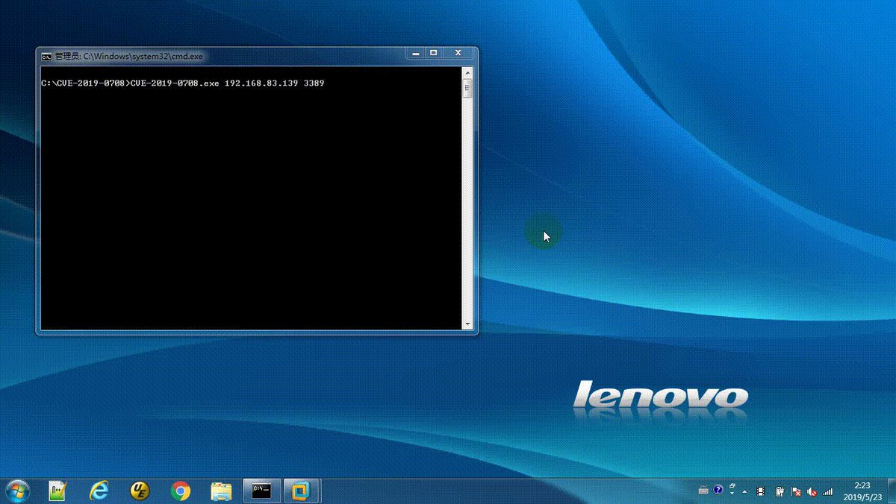
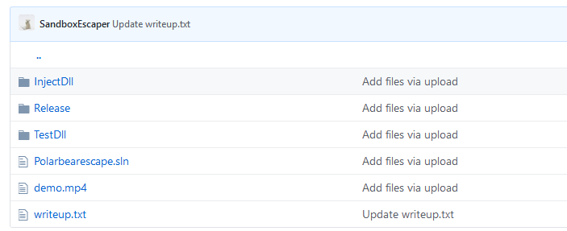
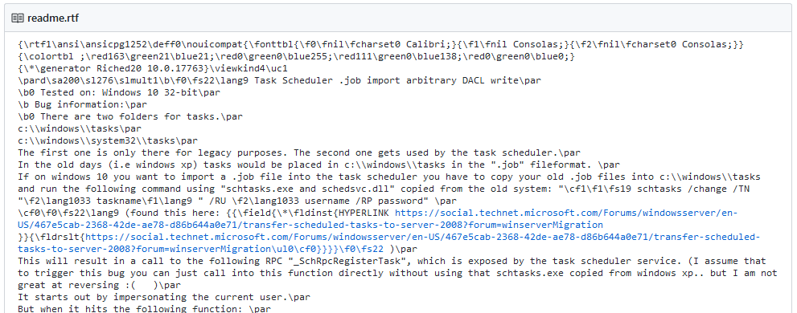
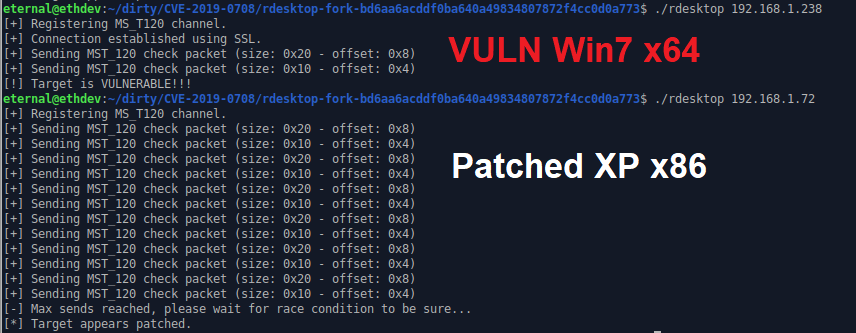
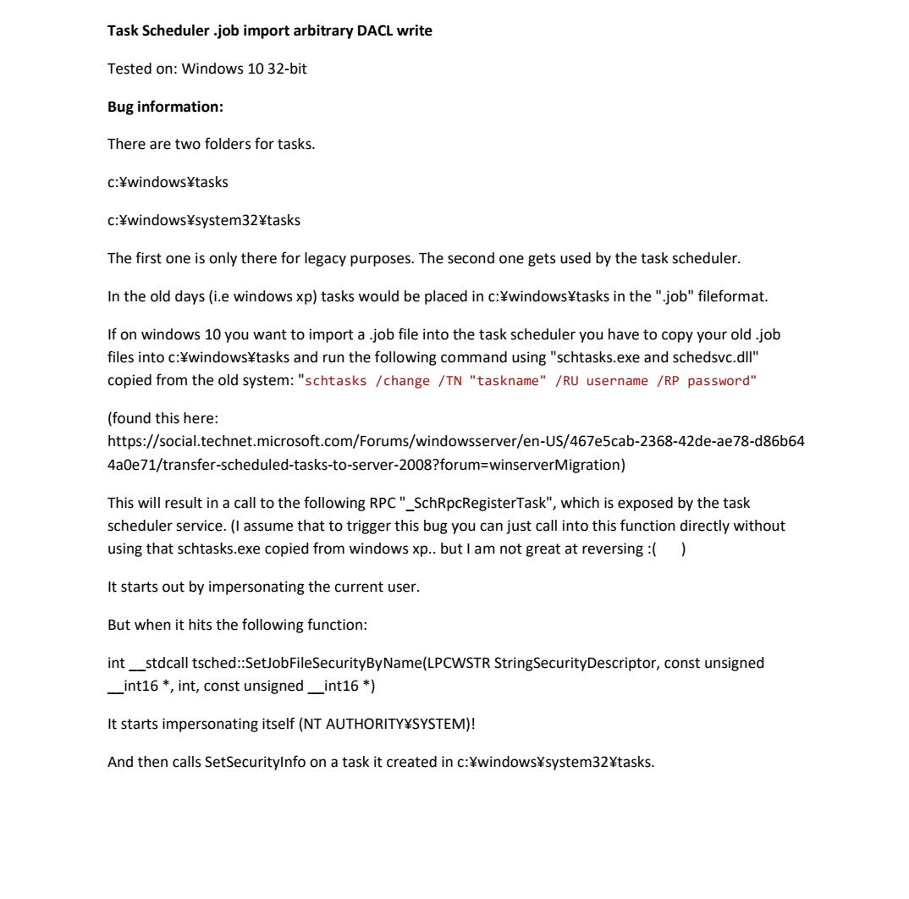
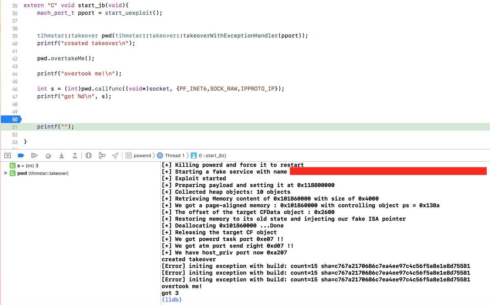
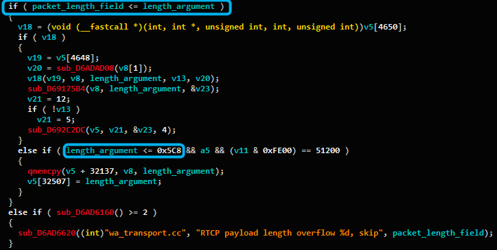
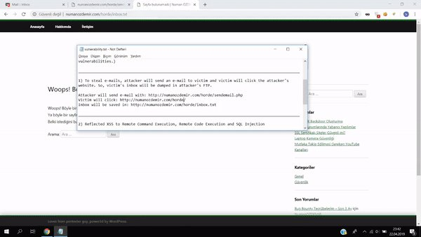
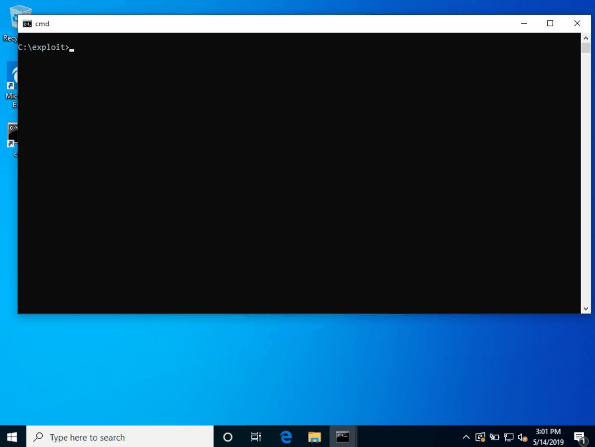
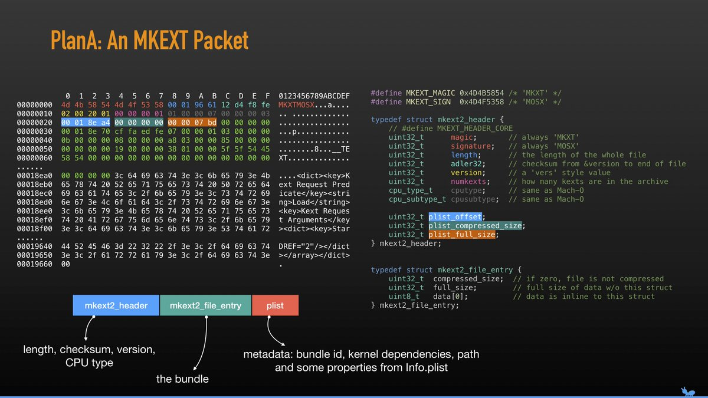

# MalwareTechBlog
**https://twitter.com/MalwareTechBlog/status/1134242750059098112 _at 2019-05-30 23:38:39_**
<blockquote>
How to turn CVE-2019-0708 DoS into RCE according to Twitter.
1) Trigger vulnerability with DoS PoC
2) Send payload over TLS
3) System magically runs payload https://t.co/23wGHmjrFW
</blockquote>

<table><tr>
<td></td>
</table></tr>
<table><tr>
<td>Quotes: <code>3</code></td>
<td>Replies: <code>8</code></td>
<td>Retweets: <code>29</code></td>
<td>Favorites: <code>163</code></td>
</tr></table>

---

# alisaesage
**https://twitter.com/alisaesage/status/1133706179274690567 _at 2019-05-29 12:06:31_**
<blockquote>
I am following the RDP 0day saga. I saw lots of PR, teasing pics and videos that imply nothing with respect to knowledge, and a few low quality publications

Thus far this is the only analysis of CVE-2019-0708 that I can recommed to my followers: https://t.co/d54Doln9Mz #BlueKeep
</blockquote>

* https://www.zerodayinitiative.com/blog/2019/5/27/cve-2019-0708-a-comprehensive-analysis-of-a-remote-desktop-services-vulnerability

<table><tr>
<td>Quotes: <code>1</code></td>
<td>Replies: <code>3</code></td>
<td>Retweets: <code>70</code></td>
<td>Favorites: <code>184</code></td>
</tr></table>

---

# Dinosn
**https://twitter.com/Dinosn/status/1133431713969909762 _at 2019-05-28 17:55:53_**
<blockquote>
Pwn2Own 2019: Microsoft Edge Sandbox Escape (CVE-2019-0938). Part 2 https://t.co/qgzg6YdB51
</blockquote>

* https://blog.exodusintel.com/2019/05/27/pwn2own-2019-microsoft-edge-sandbox-escape-cve-2019-0938-part-2/

<table><tr>
<td>Quotes: <code>1</code></td>
<td>Replies: <code>0</code></td>
<td>Retweets: <code>22</code></td>
<td>Favorites: <code>48</code></td>
</tr></table>

---

# thezdi
**https://twitter.com/thezdi/status/1133373429208502277 _at 2019-05-28 14:04:17_**
<blockquote>
In a new guest blog, the folks from Trend Micro Research provide an in-depth analysis of CVE-2019-0708, the recent Remote Desktop Services bug. https://t.co/OaJK6O21cE
</blockquote>

* http://bit.ly/2KeGYF3

<table><tr>
<td>Quotes: <code>13</code></td>
<td>Replies: <code>0</code></td>
<td>Retweets: <code>233</code></td>
<td>Favorites: <code>351</code></td>
</tr></table>

---

# haki31337
**https://twitter.com/haki31337/status/1131836256529408000 _at 2019-05-24 08:16:06_**
<blockquote>
Win32k Elevation of Privilege Poc CVE-2019-0803
https://t.co/FTVlmCoKr9
#exploit #lpe #windows
</blockquote>

* https://github.com/ExpLife0011/CVE-2019-0803

<table><tr>
<td>Quotes: <code>0</code></td>
<td>Replies: <code>0</code></td>
<td>Retweets: <code>0</code></td>
<td>Favorites: <code>1</code></td>
</tr></table>

---

# ThierryFranzett
**https://twitter.com/ThierryFranzett/status/1131563625762701313 _at 2019-05-23 14:12:46_**
<blockquote>
2 more LPE dropped by Polar Bear on the GitHub repo: a CVE-2019-0841 bypass and a (hard-to-win) race condition on Windows Installer (https://t.co/2MmAQ5VGO8)
</blockquote>

* https://github.com/SandboxEscaper/polarbearrepo

<table><tr>
<td>Quotes: <code>0</code></td>
<td>Replies: <code>0</code></td>
<td>Retweets: <code>0</code></td>
<td>Favorites: <code>1</code></td>
</tr></table>

---

# galdeleon
**https://twitter.com/galdeleon/status/1131519636665708544 _at 2019-05-23 11:17:58_**
<blockquote>
SandboxEscaper released the exploit for CVE-2019-0863 (https://t.co/KZgdpeWBFr), also discovered by me :)
The race is quite difficult to win but possible, and it provides a primitive to overwrite the DACL of an arbitrary file.
</blockquote>

* https://github.com/SandboxEscaper/polarbearrepo

<table><tr>
<td>Quotes: <code>4</code></td>
<td>Replies: <code>3</code></td>
<td>Retweets: <code>5</code></td>
<td>Favorites: <code>23</code></td>
</tr></table>

---

# RedDrip7
**https://twitter.com/RedDrip7/status/1131357390333390848 _at 2019-05-23 00:33:16_**
<blockquote>
Do patch the critical ‘#wormable‘ RCE vulnerability #CVE-2019-0708 ASAP. We are able to trigger #BSoD stably on all affected 32-bit and 64-bit systems, including Windows Server 2008, etc. We notice lots of #RDP services are unpatched. At least, it could cause massive #DoS by now. https://t.co/JjAThuV2em
</blockquote>

<table><tr>
<td></td>
</table></tr>
<table><tr>
<td>Quotes: <code>3</code></td>
<td>Replies: <code>2</code></td>
<td>Retweets: <code>24</code></td>
<td>Favorites: <code>32</code></td>
</tr></table>

---

# campuscodi
**https://twitter.com/campuscodi/status/1131289442747125767 _at 2019-05-22 20:03:16_**
<blockquote>
Forgot to add the links for the two new 0-days. There you go:

WER: https://t.co/MjUWei8mr5

IE11: https://t.co/xJQiTkU0S6 https://t.co/GGcIIYXekI
</blockquote>

* https://github.com/SandboxEscaper/polarbearrepo/tree/master/angrypolarbearbug2
* https://github.com/SandboxEscaper/polarbearrepo/tree/master/sandboxescape

<table><tr>
<td></td>
</table></tr>
<table><tr>
<td>Quotes: <code>1</code></td>
<td>Replies: <code>2</code></td>
<td>Retweets: <code>15</code></td>
<td>Favorites: <code>37</code></td>
</tr></table>

---

# cnotin
**https://twitter.com/cnotin/status/1131236056836317184 _at 2019-05-22 16:31:07_**
<blockquote>
Finally something serious for CVE-2019-0708 (RDP RCE): a scanner (not an exploit) PoC which is legit!
Test it in non-production first ("shouldn't cause denial-of-service, but there is never a 100% guarantee").
Metasploit scanner in progress too...

Thanks to @zerosum0x0 &amp; @JaGoTu
</blockquote>

<table><tr>
<td>Quotes: <code>0</code></td>
<td>Replies: <code>1</code></td>
<td>Retweets: <code>19</code></td>
<td>Favorites: <code>55</code></td>
</tr></table>

---

# campuscodi
**https://twitter.com/campuscodi/status/1131008055158689795 _at 2019-05-22 01:25:08_**
<blockquote>
PoC/demo/exploit is here: https://t.co/aImgIDKQ4F

Released by SandboxEscaper, who previously released four other Windows LPE zero-days last year https://t.co/zVc0vpVIe1
</blockquote>

* https://github.com/SandboxEscaper/polarbearrepo/tree/master/bearlpe

<table><tr>
<td></td>
</table></tr>
<table><tr>
<td>Quotes: <code>0</code></td>
<td>Replies: <code>1</code></td>
<td>Retweets: <code>21</code></td>
<td>Favorites: <code>41</code></td>
</tr></table>

---

# zerosum0x0
**https://twitter.com/zerosum0x0/status/1130998809201299456 _at 2019-05-22 00:48:23_**
<blockquote>
Unauthenticated CVE-2019-0708 (RDP RCE) scanner PoC from @JaGoTu and I. Can be automated to check your systems or pad your pentest report this week. @Metasploit port in progress. Submit fixes not tixes.

https://t.co/hjsPQdmI2w https://t.co/eOrNm3TRHe
</blockquote>

* https://github.com/zerosum0x0/CVE-2019-0708

<table><tr>
<td></td>
</table></tr>
<table><tr>
<td>Quotes: <code>29</code></td>
<td>Replies: <code>15</code></td>
<td>Retweets: <code>617</code></td>
<td>Favorites: <code>1022</code></td>
</tr></table>

---

# cry__pto
**https://twitter.com/cry__pto/status/1130981224745455618 _at 2019-05-21 23:38:31_**
<blockquote>
UNIX/LINUX CHEAT SHEET
https://t.co/qDeSBrMS7b
Linux Post Exploitation Command List
https://t.co/du0B8sqh96
Linux Kernel CVE-2018-1068 Local Privilege Escalation Vulnerability
https://t.co/KIV5EA3pnm
#hacking  #itsecurity #infosec #pentesting
</blockquote>

* http://cheatsheetworld.com/programming/unix-linux-cheat-sheet
* https://github.com/mubix/post-exploitation
* https://www.securityfocus.com/bid/103459

<table><tr>
<td>Quotes: <code>0</code></td>
<td>Replies: <code>0</code></td>
<td>Retweets: <code>2</code></td>
<td>Favorites: <code>3</code></td>
</tr></table>

---

# luc4m
**https://twitter.com/luc4m/status/1130949681981403137 _at 2019-05-21 21:33:10_**
<blockquote>
SandboxEscaper Is dropping some #0day .. #lpe exploit
@prsecurity_ @0xffff0800 @MisterCh0c

https://t.co/3ymDuqlmPg https://t.co/Ew387PBqQ0
</blockquote>

* https://github.com/SandboxEscaper/polarbearrepo

<table><tr>
<td></td>
</table></tr>
<table><tr>
<td>Quotes: <code>1</code></td>
<td>Replies: <code>3</code></td>
<td>Retweets: <code>20</code></td>
<td>Favorites: <code>32</code></td>
</tr></table>

---

# FuzzySec
**https://twitter.com/FuzzySec/status/1130943417436049408 _at 2019-05-21 21:08:17_**
<blockquote>
Soon everyone will find out anyway so you should be aware that SandboxEscaper has dropped another 0day -&gt; https://t.co/ekEb8C5H9s
I'm pretty tired of this =&gt; Not earning 💰 on 0day and putting people at unnecessary risk. It's really kind of lame in my book 👎
</blockquote>

* https://github.com/SandboxEscaper/polarbearrepo

<table><tr>
<td>Quotes: <code>11</code></td>
<td>Replies: <code>21</code></td>
<td>Retweets: <code>289</code></td>
<td>Favorites: <code>526</code></td>
</tr></table>

---

# tihmstar
**https://twitter.com/tihmstar/status/1130798410611732480 _at 2019-05-21 11:32:04_**
<blockquote>
Just pushed an update to libtakeover!
https://t.co/KcGLbtxM0p

With a small modification of the powend sandbox escape exploit you can now call arbitrary functions as well as read/write/alloc memory in powerd using libtakeover :D

here is your socket @NedWilliamson ;) https://t.co/rhf0NOqwV0
</blockquote>

* https://github.com/tihmstar/libtakeover

<table><tr>
<td></td>
</table></tr>
<table><tr>
<td>Quotes: <code>0</code></td>
<td>Replies: <code>7</code></td>
<td>Retweets: <code>19</code></td>
<td>Favorites: <code>116</code></td>
</tr></table>

---

# KoAkinci
**https://twitter.com/KoAkinci/status/1130516048971747328 _at 2019-05-20 16:50:04_**
<blockquote>
CVE-2019-3568: WhatsApp 0 day vulnerability analysis
Link : https://t.co/jPfe4tJJ9j
#WhatsApp #0day #Vulnerabilty https://t.co/j3BdaO1FhA
</blockquote>

* https://translate.google.com/translate?hl=&sl=zh-CN&tl=tr&u=https%3A%2F%2Fpaper.tuisec.win%2Fdetail%2F758132befa191f8&sandbox=1

<table><tr>
<td></td>
</table></tr>
<table><tr>
<td>Quotes: <code>0</code></td>
<td>Replies: <code>0</code></td>
<td>Retweets: <code>9</code></td>
<td>Favorites: <code>35</code></td>
</tr></table>

---

# wugeej
**https://twitter.com/wugeej/status/1130268214913462272 _at 2019-05-20 00:25:16_**
<blockquote>
[PoC] Horde Webmail - XSS + CSRF to SQLi, RCE, Stealing Emails &lt;= v5.2.22

CVE-2019-12094
CVE-2019-12095

https://t.co/Gp4FgGvJKa https://t.co/bTNPZL21xs
</blockquote>

* https://cxsecurity.com/issue/WLB-2019050199

<table><tr>
<td></td>
</table></tr>
<table><tr>
<td>Quotes: <code>1</code></td>
<td>Replies: <code>1</code></td>
<td>Retweets: <code>25</code></td>
<td>Favorites: <code>37</code></td>
</tr></table>

---

# XI_Research
**https://twitter.com/XI_Research/status/1129436429648629761 _at 2019-05-17 17:20:03_**
<blockquote>
.@tekwizz123 of our Nday team exploits the recently patched CVE-2019-0808 win32k bug to escape the chrome sandbox
https://t.co/lB1uaGkAIL
</blockquote>

* https://blog.exodusintel.com/2019/05/17/windows-within-windows/

<table><tr>
<td>Quotes: <code>3</code></td>
<td>Replies: <code>2</code></td>
<td>Retweets: <code>110</code></td>
<td>Favorites: <code>177</code></td>
</tr></table>

---

# seebug_team
**https://twitter.com/seebug_team/status/1129397470843113472 _at 2019-05-17 14:45:14_**
<blockquote>
The detailed analysis of WordPress 5.0 RCE(CVE-2019-6977) which is formed by means of Post Meta Variable Overwriting, Path Traversal, and Local File Inclusion. Learn more on Seebug Paper: https://t.co/PwxiERObGD https://t.co/CVyfIZkpCr
</blockquote>

* https://paper.seebug.org/926/
* https://medium.com/@knownsec404team/the-detailed-analysis-of-wordpress-5-0-rce-a171ed719681

<table><tr>
<td>Quotes: <code>1</code></td>
<td>Replies: <code>1</code></td>
<td>Retweets: <code>44</code></td>
<td>Favorites: <code>64</code></td>
</tr></table>

---

# perito_inf
**https://twitter.com/perito_inf/status/1129294066515173377 _at 2019-05-17 07:54:21_**
<blockquote>
CVE-2019-0708(aka BlueKeep) PoC demo image. Cc @syrius_bughunt

Microsoft RDP(Remote Desktop Protocol) RCE Calc.exe pwned!
- Windows 7, Windows Server 2K3, Windows Server 2K8 

#RCE #RDP #BlueKeep, #KB4493472 #CVE20190708 

https://t.co/9tlQuLIKO7
</blockquote>

* https://github.com/syriusbughunt/CVE-2019-0708/

<table><tr>
<td>Quotes: <code>0</code></td>
<td>Replies: <code>0</code></td>
<td>Retweets: <code>7</code></td>
<td>Favorites: <code>12</code></td>
</tr></table>

---

# pablogonzalezpe
**https://twitter.com/pablogonzalezpe/status/1129137195401515017 _at 2019-05-16 21:31:00_**
<blockquote>
Chrome 72.0.3626.119 FileReader UaF exploit for Windows 7 x86 by Clement Lecigne, István Kurucsai, and timwr, which exploits CVE-2019-5786 @metasploit https://t.co/hKuXFEtDzl
</blockquote>

* https://github.com/rapid7/metasploit-framework/pull/11816

<table><tr>
<td>Quotes: <code>0</code></td>
<td>Replies: <code>0</code></td>
<td>Retweets: <code>4</code></td>
<td>Favorites: <code>3</code></td>
</tr></table>

---

# buffaloverflow
**https://twitter.com/buffaloverflow/status/1128662377111617538 _at 2019-05-15 14:04:14_**
<blockquote>
Here is the advisory for CVE-2019-11114, a Local Privilege Escalation vulnerability I found in Intel DSA. If you have an Intel based machine, double check if it's installed and update if required 👍

https://t.co/Hgrci4roDC https://t.co/Xi5vmS0UP3
</blockquote>

* https://www.nccgroup.trust/uk/our-research/technical-advisory-intel-driver-support-and-assistance-local-privilege-escalation/

<table><tr>
<td></td>
</table></tr>
<table><tr>
<td>Quotes: <code>4</code></td>
<td>Replies: <code>1</code></td>
<td>Retweets: <code>114</code></td>
<td>Favorites: <code>204</code></td>
</tr></table>

---

# buffaloverflow
**https://twitter.com/buffaloverflow/status/1128431375680454657 _at 2019-05-14 22:46:19_**
<blockquote>
Today Intel released a fix for a bug I found in DSA (CVE-2019-11114). Tomorrow we will release an advisory demonstrating the LPE exploit 👍

https://t.co/LBGwV55Mme
</blockquote>

* https://www.intel.com/content/www/us/en/security-center/advisory/intel-sa-00252.html

<table><tr>
<td>Quotes: <code>1</code></td>
<td>Replies: <code>1</code></td>
<td>Retweets: <code>21</code></td>
<td>Favorites: <code>43</code></td>
</tr></table>

---

# dangoodin001
**https://twitter.com/dangoodin001/status/1128406264956932096 _at 2019-05-14 21:06:32_**
<blockquote>
Hoping to head off another catastrophic worm, Microsoft took the unusual step of patching Win 2003 and XP against CVE-2019-0708. The RCE bug is easy to exploit and requires no user interaction. 3 million endpoints are directly exposed. Also affects Win 7, Server 2008 and 2008.
</blockquote>

<table><tr>
<td>Quotes: <code>2</code></td>
<td>Replies: <code>3</code></td>
<td>Retweets: <code>63</code></td>
<td>Favorites: <code>78</code></td>
</tr></table>

---

# CodeColorist
**https://twitter.com/CodeColorist/status/1127858719650340864 _at 2019-05-13 08:50:48_**
<blockquote>
Just uploaded the exploit for my #HITB2019Ams talk, kernel privilege escalation on macOS High Sierra without memory corruption: https://t.co/aqTG923Bu9 slides: https://t.co/j5uPIpKOwH https://t.co/gO6O6KHebz
</blockquote>

* https://github.com/ChiChou/sploits/tree/master/ModJack
* https://conference.hitb.org/hitbsecconf2019ams/materials/D2T2%20-%20ModJack%20-%20Hijacking%20the%20MacOS%20Kernel%20-%20Zhi%20Zhou.pdf

<table><tr>
<td></td>
</table></tr>
<table><tr>
<td>Quotes: <code>2</code></td>
<td>Replies: <code>3</code></td>
<td>Retweets: <code>131</code></td>
<td>Favorites: <code>291</code></td>
</tr></table>

---

# securisec
**https://twitter.com/securisec/status/1127416656257536000 _at 2019-05-12 03:34:11_**
<blockquote>
"RT RT perito_inf: CVE-2019-0604: Microsoft SharePoint RCE Vulnerability 

Exploit PoC:
https://t.co/2UKLz8vOyr

Backdoor related to Sharepoint intrusions.
https://t.co/1zfMVQwltM"
</blockquote>

* https://github.com/linhlhq/CVE-2019-0604
* https://pastebin.com/bUFPhucz

<table><tr>
<td>Quotes: <code>0</code></td>
<td>Replies: <code>0</code></td>
<td>Retweets: <code>0</code></td>
<td>Favorites: <code>0</code></td>
</tr></table>

---

# kmkz_security
**https://twitter.com/kmkz_security/status/1127312140673658881 _at 2019-05-11 20:38:53_**
<blockquote>
CyberArk Enterprise Password Vault – XML External Entity (XXE) Injection #cve-2019-7442
Original advisory:
https://t.co/yz3XQGU0US
Cve details:
https://t.co/IxmjVcmLaT
</blockquote>

* https://www.octority.com/2019/05/07/cyberark-enterprise-password-vault-xml-external-entity-xxe-injection/
* http://cve.mitre.org/cgi-bin/cvename.cgi?name=CVE-2019-7442

<table><tr>
<td>Quotes: <code>2</code></td>
<td>Replies: <code>0</code></td>
<td>Retweets: <code>72</code></td>
<td>Favorites: <code>98</code></td>
</tr></table>

---

# perito_inf
**https://twitter.com/perito_inf/status/1127263131183583232 _at 2019-05-11 17:24:08_**
<blockquote>
CVE-2019-0604: Microsoft SharePoint RCE Vulnerability 

Exploit PoC:
https://t.co/8mobjeDJTd

Backdoor related to Sharepoint intrusions.
https://t.co/iu3d6C27IX
</blockquote>

* https://github.com/linhlhq/CVE-2019-0604
* https://pastebin.com/bUFPhucz

<table><tr>
<td>Quotes: <code>0</code></td>
<td>Replies: <code>0</code></td>
<td>Retweets: <code>16</code></td>
<td>Favorites: <code>16</code></td>
</tr></table>

---

# hosselot
**https://twitter.com/hosselot/status/1125280426162053121 _at 2019-05-06 06:05:34_**
<blockquote>
Nice writeup+(0x41414141) PoC for Mozilla Firefox HTML5 Stream Parsing Use-after-free Vulnerability (CVE-2018-18500) by Yaniv Frank from @SophosLabs:
https://t.co/NgPzvUBWA7
</blockquote>

* https://news.sophos.com/en-us/2019/04/18/protected-cve-2018-18500-heap-write-after-free-in-firefox-analysis-and-exploitation/

<table><tr>
<td>Quotes: <code>1</code></td>
<td>Replies: <code>0</code></td>
<td>Retweets: <code>43</code></td>
<td>Favorites: <code>110</code></td>
</tr></table>

---

# OPOSEC
**https://twitter.com/OPOSEC/status/1124992139354615808 _at 2019-05-05 11:00:02_**
<blockquote>
Google Chrome pdfium shading drawing integer overflow to RCE (CVE-2018-6120). https://t.co/xcdsVZlLOc (+) #Security #231 (2018)
</blockquote>

* http://bit.ly/2O5x7k2

<table><tr>
<td>Quotes: <code>0</code></td>
<td>Replies: <code>0</code></td>
<td>Retweets: <code>35</code></td>
<td>Favorites: <code>79</code></td>
</tr></table>

---

# piedpiper1616
**https://twitter.com/piedpiper1616/status/1124408537642180608 _at 2019-05-03 20:21:00_**
<blockquote>
GitHub - gscamelo/CVE-2018-20580: A proof of concept for ReadyAPI 2.5.0/2.6.0 Remote Code Execution Vulnerability. https://t.co/2BAkN7aRWu
</blockquote>

* https://github.com/gscamelo/CVE-2018-20580/

<table><tr>
<td>Quotes: <code>0</code></td>
<td>Replies: <code>0</code></td>
<td>Retweets: <code>18</code></td>
<td>Favorites: <code>35</code></td>
</tr></table>

---

# Gr1nchDC
**https://twitter.com/Gr1nchDC/status/1124069208558657536 _at 2019-05-02 21:52:38_**
<blockquote>
Dell SupportAssist RCE Proof of Concept -- "This is the proof of concept source code for CVE-2019-3719, a vulnerability in most of all Dell machines that allowed for remote code execution." -- https://t.co/KwZp2hZnD6
</blockquote>

* https://github.com/D4stiny/Dell-Support-Assist-RCE-PoC

<table><tr>
<td>Quotes: <code>0</code></td>
<td>Replies: <code>0</code></td>
<td>Retweets: <code>1</code></td>
<td>Favorites: <code>2</code></td>
</tr></table>

---

# piedpiper1616
**https://twitter.com/piedpiper1616/status/1124068201401393153 _at 2019-05-02 21:48:38_**
<blockquote>
GitHub - VoidSec/CVE-2019-5624: A proof of concept for Metasploit's CVE-2019-5624 vulnerability (Rubyzip insecure ZIP handling RCE) https://t.co/NUxMtuFeoy
</blockquote>

* https://github.com/VoidSec/CVE-2019-5624/

<table><tr>
<td>Quotes: <code>0</code></td>
<td>Replies: <code>0</code></td>
<td>Retweets: <code>10</code></td>
<td>Favorites: <code>23</code></td>
</tr></table>

---

# passthehashed
**https://twitter.com/passthehashed/status/1123691197699117058 _at 2019-05-01 20:50:33_**
<blockquote>
CVE-2018-0952: Privilege Escalation Vulnerability in Windows Standard Collector Service

PoC: https://t.co/9qLBe3OCps

Writeup: https://t.co/2Za2HY2V4q

#eop #exploit #windows #vulnerability
</blockquote>

* https://github.com/atredispartners/CVE-2018-0952-SystemCollector/blob/master/README.md
* https://www.atredis.com/blog/cve-2018-0952-privilege-escalation-vulnerability-in-windows-standard-collector-service

<table><tr>
<td>Quotes: <code>0</code></td>
<td>Replies: <code>0</code></td>
<td>Retweets: <code>2</code></td>
<td>Favorites: <code>0</code></td>
</tr></table>

---

