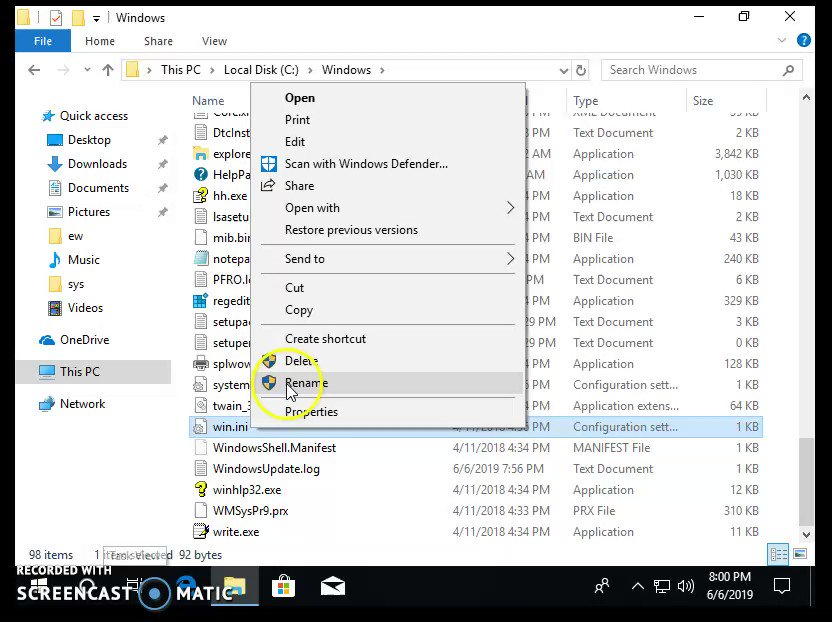

# mohammadaskar2
**https://twitter.com/mohammadaskar2/status/1145356517232795649 _at 2019-06-30 15:40:48_**
<blockquote>
Just wrote an article about how I found another Remote Command Execution 0day (CVE-2019-13024), this time in Centreon Infrastructure monitoring software.

I performed a static code analysis in order to find the bug and then wrote the exploit using python.

https://t.co/ElYKvEZ43I
</blockquote>

* https://shells.systems/centreon-v19-04-remote-code-execution-cve-2019-13024/

<table><tr>
<td>Quotes: <code>2</code></td>
<td>Replies: <code>8</code></td>
<td>Retweets: <code>114</code></td>
<td>Favorites: <code>306</code></td>
</table></tr>

---

# wugeej
**https://twitter.com/wugeej/status/1142604873562611718 _at 2019-06-23 01:26:45_**
<blockquote>
GitHub - sophoslabs/CVE-2019-0888: PoC for CVE-2019-0888 - Use-After-Free in Windows ActiveX Data Objects (ADO) https://t.co/o22CcRKQ11
</blockquote>

* https://github.com/sophoslabs/CVE-2019-0888/

<table><tr>
<td>Quotes: <code>1</code></td>
<td>Replies: <code>0</code></td>
<td>Retweets: <code>44</code></td>
<td>Favorites: <code>89</code></td>
</table></tr>

---

# TheHackersNews
**https://twitter.com/TheHackersNews/status/1142479720505679872 _at 2019-06-22 17:09:26_**
<blockquote>
Here's a PoC video for RCE vulnerability (CVE-2019-1105) in the "Outlook for Android," shared with THN by @Kumargaurav776, who also reported this flaw responsibly to the Microsoft. https://t.co/6ioKw3D4E2
</blockquote>

<table><tr>
<td></td>
</table></tr>
<table><tr>
<td>Quotes: <code>10</code></td>
<td>Replies: <code>5</code></td>
<td>Retweets: <code>71</code></td>
<td>Favorites: <code>115</code></td>
</table></tr>

---

# piedpiper1616
**https://twitter.com/piedpiper1616/status/1142289831499710464 _at 2019-06-22 04:34:53_**
<blockquote>
GitHub - sophoslabs/CVE-2019-0888: PoC for CVE-2019-0888 - Use-After-Free in Windows ActiveX Data Objects (ADO) https://t.co/3y7NKGms60
</blockquote>

* https://github.com/sophoslabs/CVE-2019-0888/

<table><tr>
<td>Quotes: <code>1</code></td>
<td>Replies: <code>0</code></td>
<td>Retweets: <code>52</code></td>
<td>Favorites: <code>106</code></td>
</table></tr>

---

# bordplate
**https://twitter.com/bordplate/status/1142033076572315651 _at 2019-06-21 11:34:38_**
<blockquote>
Just posted a blog post about how I was able to exploit CrashPlan for privilege escalation on Windows (and macOS/Linux).
This is CVE-2019-11552.

https://t.co/jB00XwicYV
</blockquote>

* https://bordplate.no/blog/en/post/crashplan-privilege-escalation/

<table><tr>
<td>Quotes: <code>0</code></td>
<td>Replies: <code>3</code></td>
<td>Retweets: <code>33</code></td>
<td>Favorites: <code>84</code></td>
</table></tr>

---

# wugeej
**https://twitter.com/wugeej/status/1141525561954562048 _at 2019-06-20 01:57:57_**
<blockquote>
[PoC] CVE-2019-8603 (macOS vulnerability): Safari sandbox escape using an out-of-bounds read vulnerability

https://t.co/bqD4GosiBt
</blockquote>

* https://mp.weixin.qq.com/s/fC18oinvoOv-H989pw06tw

<table><tr>
<td>Quotes: <code>1</code></td>
<td>Replies: <code>0</code></td>
<td>Retweets: <code>25</code></td>
<td>Favorites: <code>73</code></td>
</table></tr>

---

# zer0pwn
**https://twitter.com/zer0pwn/status/1141488997182709760 _at 2019-06-19 23:32:39_**
<blockquote>
CVE-2019-12828 Origin RCE analysis and proof of concept. https://t.co/O96NK8BmOZ #security #bounty #bugbounty #redteam #rce #qt  #bugbountytips
</blockquote>

* https://zeropwn.github.io/2019-05-22-fun-with-uri-handlers/

<table><tr>
<td>Quotes: <code>1</code></td>
<td>Replies: <code>5</code></td>
<td>Retweets: <code>87</code></td>
<td>Favorites: <code>215</code></td>
</table></tr>

---

# wugeej
**https://twitter.com/wugeej/status/1139338670379397120 _at 2019-06-14 01:08:01_**
<blockquote>
[PoC] 2010~2018 MS Office 0-day/1-day exploit-case-study
#OpenXMLTag
#RTF
#ActiveX
#UAF
#TIFF
#EPS
#Moniker

CVE-2010-3333
CVE-2014-1761
CVE-2016-7193
CVE-2015-1641
CVE-2017-11826
CVE-2012-0158
CVE-2012-1856
CVE-2015-1642
CVE-2014-6352
CVE-2015-0097

https://t.co/MHJ5xtGSKZ
</blockquote>

* https://www.anquanke.com/post/id/180067#h3-11

<table><tr>
<td>Quotes: <code>2</code></td>
<td>Replies: <code>3</code></td>
<td>Retweets: <code>74</code></td>
<td>Favorites: <code>175</code></td>
</table></tr>

---

# _zc00l
**https://twitter.com/_zc00l/status/1138562430626385921 _at 2019-06-11 21:43:31_**
<blockquote>
Now that it's no longer a 0day, check my post about "Coding a reliable CVE-2019-0841 bypass" to craft a LPE exploit that works for all versions of Microsoft Edge in Windows 10.
https://t.co/1VeFQ7W9Vm
</blockquote>

* https://0x00-0x00.github.io/research/2019/05/30/Coding-a-reliable-CVE-2019-0841-Bypass.html

<table><tr>
<td>Quotes: <code>1</code></td>
<td>Replies: <code>2</code></td>
<td>Retweets: <code>103</code></td>
<td>Favorites: <code>203</code></td>
</table></tr>

---

# thezdi
**https://twitter.com/thezdi/status/1138505269737115654 _at 2019-06-11 17:56:23_**
<blockquote>
ZDI researcher @HexKitchen takes a detailed look at CVE-2019-1069 - an LPE via the Windows task scheduler. His analysis shows an attacker can escalate even without knowing a password. https://t.co/zMILRrxYzZ
</blockquote>

* http://bit.ly/2KdcXWT

<table><tr>
<td>Quotes: <code>4</code></td>
<td>Replies: <code>1</code></td>
<td>Retweets: <code>89</code></td>
<td>Favorites: <code>140</code></td>
</table></tr>

---

# peterkruse
**https://twitter.com/peterkruse/status/1136995130609721344 _at 2019-06-07 13:55:38_**
<blockquote>
SandBoxEscaper has published a second bypass for CVE-2019-0841 so yet another 0day for latest Windows versions, https://t.co/gHErpgBPLg
</blockquote>

* https://github.com/SandboxEscaper/polarbearrepo/tree/master/ByeBear

<table><tr>
<td>Quotes: <code>1</code></td>
<td>Replies: <code>1</code></td>
<td>Retweets: <code>12</code></td>
<td>Favorites: <code>15</code></td>
</table></tr>

---

# TheHackersNews
**https://twitter.com/TheHackersNews/status/1136949163587821568 _at 2019-06-07 10:52:58_**
<blockquote>
Hacker going by the name of #SandboxEscaper today discloses a second zero-day exploit that apparently bypasses #Microsoft's patch for a Windows EoP vulnerability (CVE-2019-0841)

https://t.co/DdO0bztrO5

—by @security_wang https://t.co/LNDzqajDOc
</blockquote>

* https://thehackernews.com/2019/06/windows-eop-exploit.html

<table><tr>
<td></td>
</table></tr>
<table><tr>
<td>Quotes: <code>21</code></td>
<td>Replies: <code>8</code></td>
<td>Retweets: <code>381</code></td>
<td>Favorites: <code>486</code></td>
</table></tr>

---

# pozdnychev
**https://twitter.com/pozdnychev/status/1136329928922804225 _at 2019-06-05 17:52:21_**
<blockquote>
Qualys Security Advisory Team: "The return of the WIZard" (CVE-2019-10149). Instant LPE in Exim (4.87 to 4.91). Seven days to trigger a RCE. No memory corruption or ROP involved. Bypass NX/ASLR/SSP/PIE/full RELRO/etc. Architecture independent. More at https://t.co/xKwwe1ehKN
</blockquote>

* https://www.openwall.com/lists/oss-security/2019/06/05/4

<table><tr>
<td>Quotes: <code>3</code></td>
<td>Replies: <code>2</code></td>
<td>Retweets: <code>39</code></td>
<td>Favorites: <code>53</code></td>
</table></tr>

---

# ryHanson
**https://twitter.com/ryHanson/status/1135685906965262336 _at 2019-06-03 23:13:14_**
<blockquote>
I've got reliable RCE on Windows 7 / Server 2008 and I have very little experience with kernel exploitation... Now I understand why MSRC considers CVE-2019-0708 so dangerous. https://t.co/ChGYTgyetV
</blockquote>

<table><tr>
<td></td>
</table></tr>
<table><tr>
<td>Quotes: <code>18</code></td>
<td>Replies: <code>16</code></td>
<td>Retweets: <code>398</code></td>
<td>Favorites: <code>1114</code></td>
</table></tr>

---

# Alra3ees
**https://twitter.com/Alra3ees/status/1135223685890138114 _at 2019-06-02 16:36:32_**
<blockquote>
Awesome-Hacking-Resources:-.

Learning the Skills
YouTube Channels
Companies
Conferences
NEWS
Sharpening Your Skills
Reverse Engineering, Buffer Overflow and Exploit Development
Privilege Escalation
Network Scanning / Reconnaissance
Malware Analysis
More.. https://t.co/GQ3E30w8EA
</blockquote>

* https://github.com/vitalysim/Awesome-Hacking-Resources

<table><tr>
<td>Quotes: <code>0</code></td>
<td>Replies: <code>2</code></td>
<td>Retweets: <code>207</code></td>
<td>Favorites: <code>576</code></td>
</table></tr>

---

