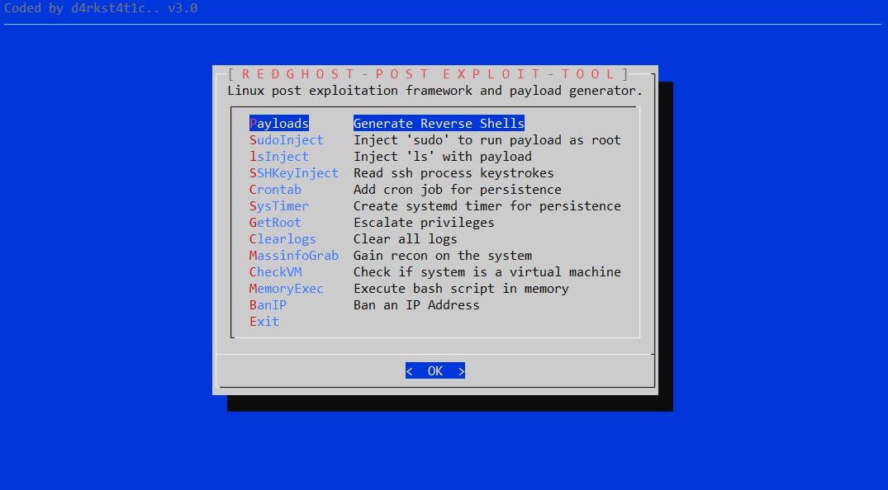
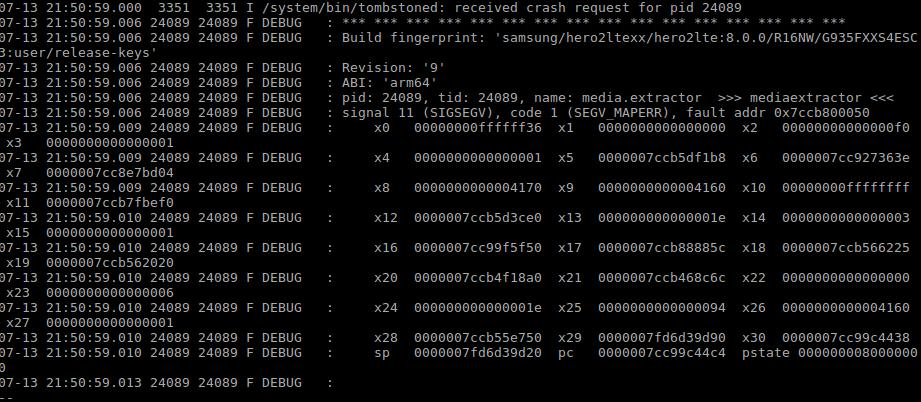
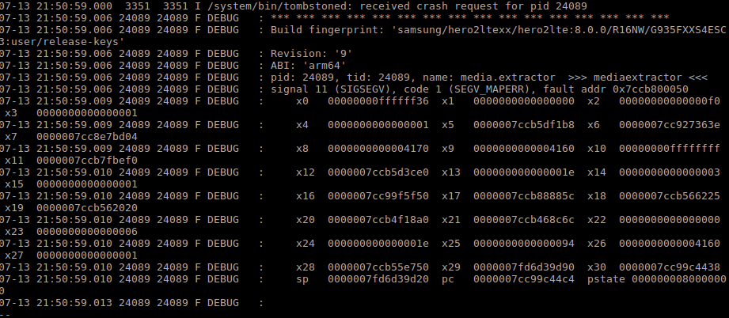
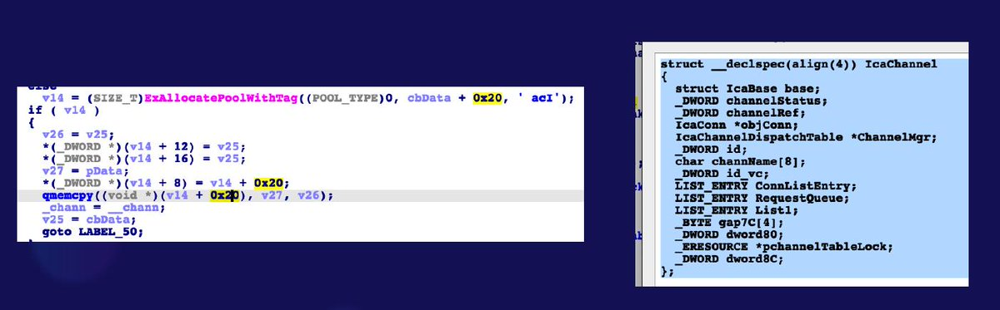
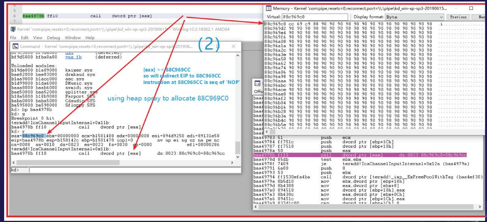
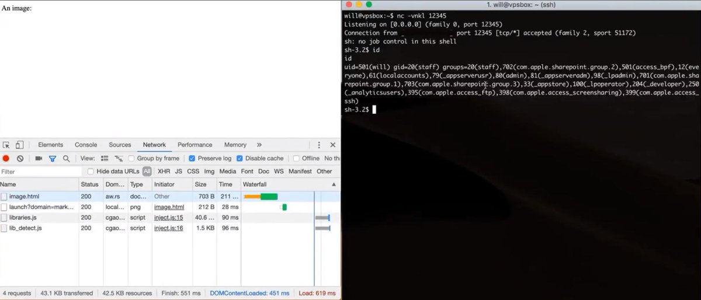

# XF2R1
**https://twitter.com/XF2R1/status/1156713777657610240 _at 2019-07-31 23:50:29_**
<blockquote>
@0penw0rld @zerosum0x0 @metasploit Here a slide deck explaining how to turn the crash PoC into RCE.

https://t.co/cqHkj2YLeg
</blockquote>

* https://github.com/blackorbird/APT_REPORT/blob/master/exploit_report/%23bluekeep%20RDP%20from%20patch%20to%20remote%20code%20execution.pdf

<table><tr>
<td>Quotes: <code>0</code></td>
<td>Replies: <code>0</code></td>
<td>Retweets: <code>28</code></td>
<td>Favorites: <code>61</code></td>
</tr></table>

---

# wugeej
**https://twitter.com/wugeej/status/1156348320282890240 _at 2019-07-30 23:38:18_**
<blockquote>
[PoC Library] Windows RCE Exploits

(2) JS exploit
- CVE-2015-2419 (tested on non updated IE 11

(3) Flash Exploits
- CVE-2018-15982 (Flash ActiveX 31.0.0.153)
- CVE-2018-4878 (Flash ActiveX 28.0.0.137)
- CVE-2015-5112 (Flash ActiveX 18.0.0.194)

https://t.co/iJOOCpNIOF
</blockquote>

* https://github.com/smgorelik/Windows-RCE-exploits

<table><tr>
<td>Quotes: <code>0</code></td>
<td>Replies: <code>2</code></td>
<td>Retweets: <code>2</code></td>
<td>Favorites: <code>2</code></td>
</tr></table>

---

# wugeej
**https://twitter.com/wugeej/status/1156348321536983040 _at 2019-07-30 23:38:18_**
<blockquote>
[PoC Library] Windows RCE Exploits

(4) Office &amp; Acrobat
- CVE-2017-11882 (non updated office 2013 and number of others.)
- CVE-2013-2729 (Acrobat 11.0.0.1 and below)
- CVE-2018-4990 (Acrobat Reader DC (17.00920044, 18.01120038))

https://t.co/iJOOCpNIOF
</blockquote>

* https://github.com/smgorelik/Windows-RCE-exploits

<table><tr>
<td>Quotes: <code>0</code></td>
<td>Replies: <code>1</code></td>
<td>Retweets: <code>6</code></td>
<td>Favorites: <code>9</code></td>
</tr></table>

---

# wugeej
**https://twitter.com/wugeej/status/1156348322875002880 _at 2019-07-30 23:38:18_**
<blockquote>
[PoC Library] Windows RCE Exploits

(5) Acrobat
- CVE-2018-4990 (works on Acrobat Reader DC (17.00920044, 18.01120038))
- CVE-2013-2729 (tested on Acrobat 11.0.0.1 and below)

https://t.co/iJOOCpNIOF
</blockquote>

* https://github.com/smgorelik/Windows-RCE-exploits

<table><tr>
<td>Quotes: <code>0</code></td>
<td>Replies: <code>0</code></td>
<td>Retweets: <code>4</code></td>
<td>Favorites: <code>4</code></td>
</tr></table>

---

# wugeej
**https://twitter.com/wugeej/status/1156348318819090433 _at 2019-07-30 23:38:17_**
<blockquote>
[PoC Library] Windows RCE Exploits

(1) Web VBScript
- CVE-2018-8174 (tested on non updated Internet Explorer 11 Windows 7 64/32)
- CVE-2019-0752 (tested on non updated Internet Explorer 11 Windows 7-10 (a bit slow on win10))

https://t.co/iJOOCpNIOF
</blockquote>

* https://github.com/smgorelik/Windows-RCE-exploits

<table><tr>
<td>Quotes: <code>2</code></td>
<td>Replies: <code>2</code></td>
<td>Retweets: <code>77</code></td>
<td>Favorites: <code>137</code></td>
</tr></table>

---

# wugeej
**https://twitter.com/wugeej/status/1156033821906628616 _at 2019-07-30 02:48:35_**
<blockquote>
[Tool] RedGhost v3.0 - Linux Post Exploitation Framework Written In Bash Designed To Assist Red Teams In Persistence, Reconnaissance, Privilege Escalation And Leaving No Trace
https://t.co/6LtOZdkTpf https://t.co/DyGBG1Gjdw
</blockquote>

* https://github.com/d4rk007/RedGhost

<table><tr>
<td></td>
</table></tr>
<table><tr>
<td>Quotes: <code>3</code></td>
<td>Replies: <code>1</code></td>
<td>Retweets: <code>107</code></td>
<td>Favorites: <code>238</code></td>
</tr></table>

---

# hanno
**https://twitter.com/hanno/status/1155089172018978816 _at 2019-07-27 12:14:53_**
<blockquote>
If you run PHP-FPM on a public network interface this is almost trivially vulnerable to remote code execution https://t.co/AbWwSRo78m poc: https://t.co/daRJHYcxoI
</blockquote>

* https://www.openwall.com/lists/oss-security/2019/07/27/1
* https://github.com/hannob/fpmvuln/blob/master/fpmrce

<table><tr>
<td>Quotes: <code>3</code></td>
<td>Replies: <code>3</code></td>
<td>Retweets: <code>29</code></td>
<td>Favorites: <code>74</code></td>
</tr></table>

---

# seebug_team
**https://twitter.com/seebug_team/status/1154232127417982976 _at 2019-07-25 03:29:18_**
<blockquote>
This paper analyzes the Spring MVC Directory Traversal Vulnerability (CVE-2018-1271). Learn more on Seebug Paper: https://t.co/x43TS3LIsY and Medium: https://t.co/3ZW7WAay8h
</blockquote>

* https://paper.seebug.org/991/
* https://medium.com/@knownsec404team/analysis-of-spring-mvc-directory-traversal-vulnerability-cve-2018-1271-b291bdb6be0d

<table><tr>
<td>Quotes: <code>1</code></td>
<td>Replies: <code>1</code></td>
<td>Retweets: <code>62</code></td>
<td>Favorites: <code>142</code></td>
</tr></table>

---

# wugeej
**https://twitter.com/wugeej/status/1154169847971897344 _at 2019-07-24 23:21:49_**
<blockquote>
[PoC] CVE-2019-2107 the decoder/codec runs under mediacodec user and with properly "crafted" video RCE. 

Proof of concept is in hevc-crash-poc.mp4, other videos are for non android players.

https://t.co/1QFjDn8B7N https://t.co/3S52Q7BlF7
</blockquote>

* https://github.com/marcinguy/CVE-2019-2107?fbclid=IwAR0xpL2fuMCpVFqscYmaMupzQve8GidUaZ6cfZ0tSYdK23euSY-ts7i_mjk

<table><tr>
<td></td>
</table></tr>
<table><tr>
<td>Quotes: <code>0</code></td>
<td>Replies: <code>0</code></td>
<td>Retweets: <code>4</code></td>
<td>Favorites: <code>5</code></td>
</tr></table>

---

# seebug_team
**https://twitter.com/seebug_team/status/1153864873769668608 _at 2019-07-24 03:09:58_**
<blockquote>
The Analysis of CVE-2019-11229 -- From Git Config to RCE is out now. Read more on Seebug Paper: https://t.co/2fWuk3c27R or https://t.co/n393uQAtV0.
</blockquote>

* https://paper.seebug.org/990/
* https://medium.com/@knownsec404team/analysis-of-cve-2019-11229-from-git-config-to-rce-32c217727baa

<table><tr>
<td>Quotes: <code>1</code></td>
<td>Replies: <code>0</code></td>
<td>Retweets: <code>71</code></td>
<td>Favorites: <code>140</code></td>
</tr></table>

---

# LukasStefanko
**https://twitter.com/LukasStefanko/status/1153662482256486405 _at 2019-07-23 13:45:44_**
<blockquote>
Looks like someone successfully created PoC for Android CVE-2019-2107 RCE

PoC: You can own the mobile by watching a video with payload. Should works on Android 7.0, 7.1.1, 7.1.2, 8.0, 8.1, 9.
https://t.co/efc1ZCy6fZ https://t.co/UNvUTGEIHe
</blockquote>

* https://github.com/marcinguy/CVE-2019-2107

<table><tr>
<td></td>
</table></tr>
<table><tr>
<td>Quotes: <code>16</code></td>
<td>Replies: <code>9</code></td>
<td>Retweets: <code>466</code></td>
<td>Favorites: <code>812</code></td>
</tr></table>

---

# blackorbird
**https://twitter.com/blackorbird/status/1153196644227174405 _at 2019-07-22 06:54:39_**
<blockquote>
#bluekeep #cve20190708 #exploit
RDP from patch to remote code execution.pdf
from tecent keenlab

UAF -&gt; heap spray -&gt; get EIP
https://t.co/I0fhgyD7Xn https://t.co/ZKeWrCQ04z
</blockquote>

* https://github.com/blackorbird/APT_REPORT/blob/master/exploit_report/%23bluekeep%20RDP%20from%20patch%20to%20remote%20code%20execution.pdf

<table><tr>
<td></td>
<td></td>
</table></tr>
<table><tr>
<td>Quotes: <code>1</code></td>
<td>Replies: <code>4</code></td>
<td>Retweets: <code>105</code></td>
<td>Favorites: <code>224</code></td>
</tr></table>

---

# _r_netsec
**https://twitter.com/_r_netsec/status/1152370814278176768 _at 2019-07-20 00:13:06_**
<blockquote>
InfinityHook: Hook system calls, context switches, page faults and more. Rootkits still exist... even on the latest builds of Windows 10. All without having to bypass PatchGuard or HVCI. https://t.co/3uuyezQRC1
</blockquote>

* https://github.com/everdox/InfinityHook

<table><tr>
<td>Quotes: <code>0</code></td>
<td>Replies: <code>0</code></td>
<td>Retweets: <code>16</code></td>
<td>Favorites: <code>51</code></td>
</tr></table>

---

# hacker_
**https://twitter.com/hacker_/status/1150516924490637314 _at 2019-07-14 21:26:25_**
<blockquote>
New blog post: Analysis of an Atlassian Crowd RCE - CVE-2019-11580 

https://t.co/v7yXkhFtOQ
</blockquote>

* https://www.corben.io/atlassian-crowd-rce/

<table><tr>
<td>Quotes: <code>5</code></td>
<td>Replies: <code>8</code></td>
<td>Retweets: <code>219</code></td>
<td>Favorites: <code>446</code></td>
</tr></table>

---

# TheHackersNews
**https://twitter.com/TheHackersNews/status/1150000014854217728 _at 2019-07-13 11:12:24_**
<blockquote>
📢 PoC Confirmed : CVE-2019-13567

Besides the video privacy bug disclosed earlier this week, insecure local web-server installed by #Zoom software also left Mac computers vulnerable to a critical Remote Code Execution (RCE) flaw

Read ➤ https://t.co/G3Hh5jzI9a

—by @unix_root https://t.co/QRhMh3tCyz
</blockquote>

* https://thehackernews.com/2019/07/zoom-video-conferencing-hacking.html

<table><tr>
<td></td>
</table></tr>
<table><tr>
<td>Quotes: <code>8</code></td>
<td>Replies: <code>3</code></td>
<td>Retweets: <code>140</code></td>
<td>Favorites: <code>171</code></td>
</tr></table>

---

# AmarSaar
**https://twitter.com/AmarSaar/status/1148709616869621760 _at 2019-07-09 21:44:49_**
<blockquote>
Shoutout to the awesome Cfir Cohen for CVE-2019-0966! Thanks for letting us know about this Hyper-V DoS vulnerability (memory leak) in vpcivsp, accessible from non-root partition. It was a pleasure working with you, thanks for reaching out buddy! https://t.co/mXZ27a7Cxk
</blockquote>

* https://portal.msrc.microsoft.com/en-us/security-guidance/advisory/CVE-2019-0966

<table><tr>
<td>Quotes: <code>0</code></td>
<td>Replies: <code>1</code></td>
<td>Retweets: <code>3</code></td>
<td>Favorites: <code>43</code></td>
</tr></table>

---

# SophosLabs
**https://twitter.com/SophosLabs/status/1148609081965514752 _at 2019-07-09 15:05:19_**
<blockquote>
CVE-2019-0888: Use-After-Free in Windows ActiveX Data Objects (ADO) 

It's been over a month since the patch was released, so we've published the following explanation of the bug, and how to exploit it to achieve an ASLR bypass and Read/Write primitive: https://t.co/LHeKeXR0fl https://t.co/fanX9ClNR7
</blockquote>

* https://news.sophos.com/en-us/2019/07/09/cve-2019-0888-use-after-free-in-windows-activex-data-objects-ado/?cmp=30727

<table><tr>
<td></td>
</table></tr>
<table><tr>
<td>Quotes: <code>3</code></td>
<td>Replies: <code>0</code></td>
<td>Retweets: <code>35</code></td>
<td>Favorites: <code>39</code></td>
</tr></table>

---

# galdeleon
**https://twitter.com/galdeleon/status/1146031192195686400 _at 2019-07-02 12:21:43_**
<blockquote>
Just released my post about CVE-2019-0863 Win LPE which I discovered and was also spotted ITW https://t.co/HPt65Uxn9a #sandboxescaper #vulnerability #exploitation
</blockquote>

* https://unit42.paloaltonetworks.com/tale-of-a-windows-error-reporting-zero-day-cve-2019-0863/

<table><tr>
<td>Quotes: <code>3</code></td>
<td>Replies: <code>0</code></td>
<td>Retweets: <code>37</code></td>
<td>Favorites: <code>55</code></td>
</tr></table>

---

