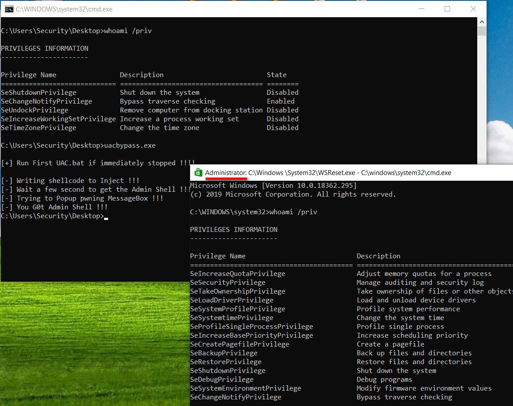
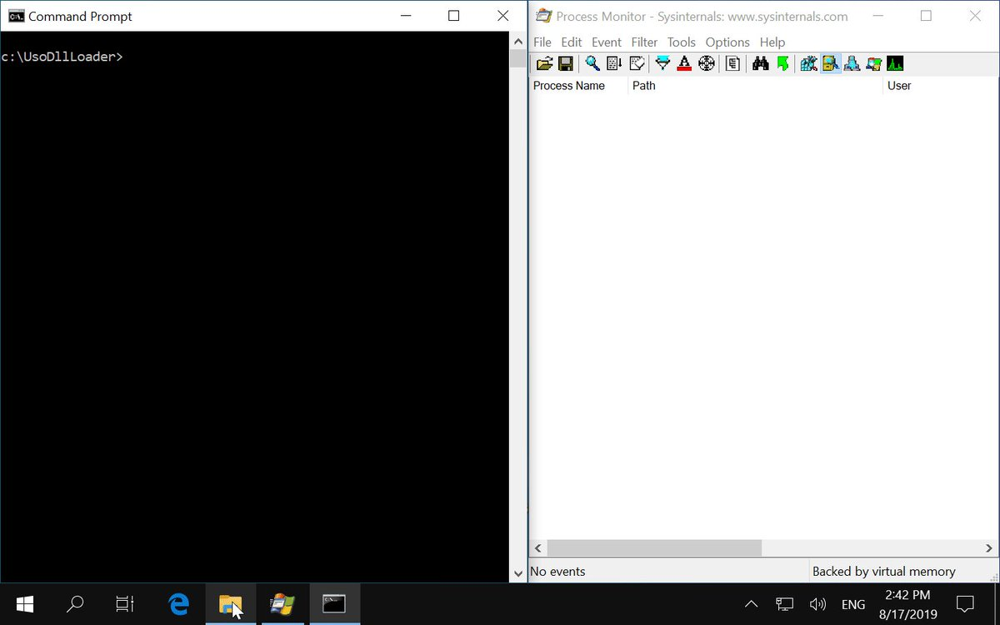
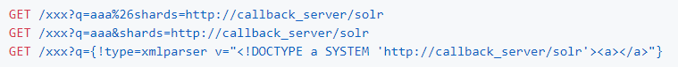
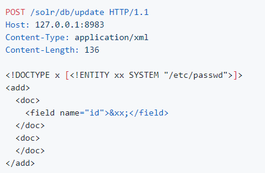
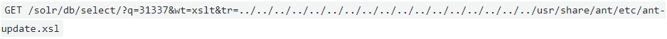
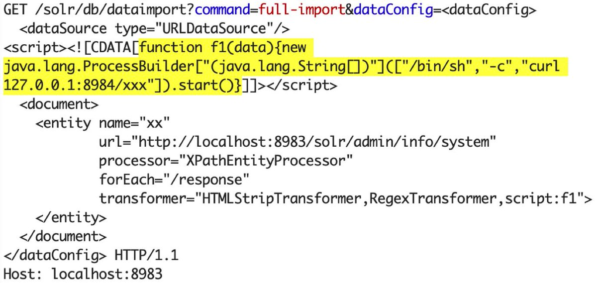
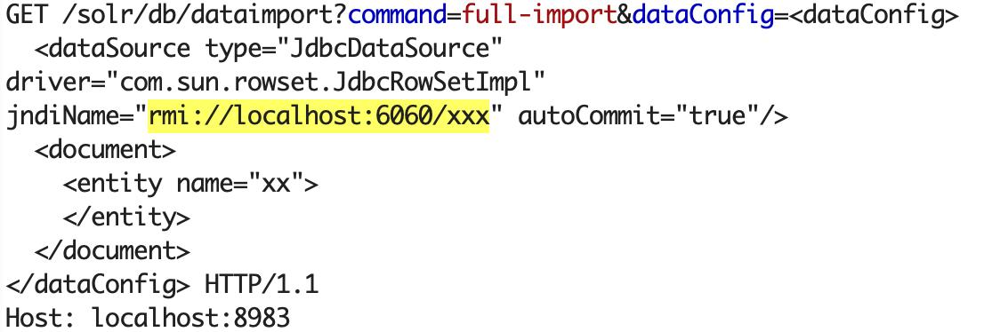

# ZecOps
**https://twitter.com/ZecOps/status/1167517173918486528 _at 2019-08-30 19:19:20_**
<blockquote>
We previously analyzed the (at the time) 0day used in the attacks Google Threat Analysis group revealed today. You can read the technical analysis of CVE-2019-7286 here https://t.co/qxB0epH7Uq and https://t.co/2WvxQcAlD1
</blockquote>

* https://blog.zecops.com/vulnerabilities/analysis-and-reproduction-of-cve-2019-7286/
* https://blog.zecops.com/vulnerabilities/exploit-of-cve-2019-7286/

<table><tr>
<td>Quotes: <code>0</code></td>
<td>Replies: <code>0</code></td>
<td>Retweets: <code>30</code></td>
<td>Favorites: <code>59</code></td>
</table></tr>

---

# dump_stack
**https://twitter.com/dump_stack/status/1167512045031481344 _at 2019-08-30 18:58:57_**
<blockquote>
lpe is a collection of verified Linux kernel exploits.

Exploit testing is fully automated. Feel free to make a pull request with a new exploit to see it by yourself 😉 

The end goal is to collect all public exploits that actually work. 

https://t.co/wdjryM05LF
</blockquote>

* https://github.com/jollheef/lpe

<table><tr>
<td>Quotes: <code>2</code></td>
<td>Replies: <code>0</code></td>
<td>Retweets: <code>174</code></td>
<td>Favorites: <code>385</code></td>
</table></tr>

---

# bad_packets
**https://twitter.com/bad_packets/status/1166851346143707142 _at 2019-08-28 23:13:34_**
<blockquote>
Further exploitation of CVE-2019-11510 can lead to remote code execution (RCE) on the clients connecting to a compromised Pulse Secure VPN server.

This technique could be used to spread ransomware and any other type of malware on sensitive networks.
https://t.co/lXcedIyQSB
</blockquote>

* https://badpackets.net/over-14500-pulse-secure-vpn-endpoints-vulnerable-to-cve-2019-11510/

<table><tr>
<td>Quotes: <code>3</code></td>
<td>Replies: <code>0</code></td>
<td>Retweets: <code>27</code></td>
<td>Favorites: <code>39</code></td>
</table></tr>

---

# 0xm1rch
**https://twitter.com/0xm1rch/status/1165666703440842753 _at 2019-08-25 16:46:13_**
<blockquote>
CVE-2018-1792 – IBM MQ Privilege Escalation: Fun with RUNPATH

write-up: https://t.co/psRssu0zjL

PoC: https://t.co/UMtbpvr8nY
</blockquote>

* https://blog.mirch.io/2019/08/25/cve-2018-1792-ibm-mq-privilege-escalation-fun-with-runpath/
* https://github.com/mirchr/security-research/blob/master/vulnerabilities/IBM/CVE-2018-1792.sh

<table><tr>
<td>Quotes: <code>0</code></td>
<td>Replies: <code>0</code></td>
<td>Retweets: <code>3</code></td>
<td>Favorites: <code>8</code></td>
</table></tr>

---

# 404death
**https://twitter.com/404death/status/1164578223096619010 _at 2019-08-22 16:40:59_**
<blockquote>
I found windows 10 LPE (UAC Bypass) in Windows Store (WSReset.exe)

https://t.co/pRvrLiEgBs

https://t.co/PXF2R5JtJM https://t.co/cSDetDs4Gz
</blockquote>

* https://heynowyouseeme.blogspot.com/2019/08/windows-10-lpe-uac-bypass-in-windows.html
* https://github.com/sailay1996/UAC_bypass_windows_store

<table><tr>
<td></td>
</table></tr>
<table><tr>
<td>Quotes: <code>1</code></td>
<td>Replies: <code>6</code></td>
<td>Retweets: <code>133</code></td>
<td>Favorites: <code>257</code></td>
</table></tr>

---

# buherator
**https://twitter.com/buherator/status/1164077257658380289 _at 2019-08-21 07:30:20_**
<blockquote>
My Kaspersky LPE exploit is now on GitHub: https://t.co/x0Oc83P5j8 (self-defense bypass not included)

Demo: https://t.co/SQB4j1IwCF
</blockquote>

* https://github.com/v-p-b/kaspy_toolz/blob/master/virsli.py
* https://vimeo.com/343213886

<table><tr>
<td>Quotes: <code>2</code></td>
<td>Replies: <code>2</code></td>
<td>Retweets: <code>127</code></td>
<td>Favorites: <code>241</code></td>
</table></tr>

---

# itm4n
**https://twitter.com/itm4n/status/1163873661947928576 _at 2019-08-20 18:01:19_**
<blockquote>
Here is a potential alternative to @tiraniddo 's DiagHub DLL loading technique. 

👉 https://t.co/ykIguMzukb

Arbitrary file write -&gt; Code execution as System 👌 https://t.co/OKqaZpt8zA
</blockquote>

* https://github.com/itm4n/UsoDllLoader

<table><tr>
<td></td>
</table></tr>
<table><tr>
<td>Quotes: <code>5</code></td>
<td>Replies: <code>3</code></td>
<td>Retweets: <code>187</code></td>
<td>Favorites: <code>382</code></td>
</table></tr>

---

# _CPResearch_
**https://twitter.com/_CPResearch_/status/1163798254145982466 _at 2019-08-20 13:01:40_**
<blockquote>
[CPR-Zero] CVE-2019-1159 (Windows 10 Kernel): Use-After-Free in the GetDCEx function in win32kfull.sys.
https://t.co/kg8deEXLnk
</blockquote>

* https://cpr-zero.checkpoint.com/vulns/cprid-2132/

<table><tr>
<td>Quotes: <code>2</code></td>
<td>Replies: <code>0</code></td>
<td>Retweets: <code>118</code></td>
<td>Favorites: <code>229</code></td>
</table></tr>

---

# _hg8_
**https://twitter.com/_hg8_/status/1162694712177954819 _at 2019-08-17 11:56:35_**
<blockquote>
"Webmin 0day remote code execution"

Tl;Dr: Lack of input validation in the reset password function  allows RCE (CVE-2019-15107). Over 13 0000 vulnerable on Shodan. 

PoC: 
/password_reset.cgi 
user=root&amp;pam&amp;expired&amp;old=wrong | id

https://t.co/kYKfq8v6Bb
</blockquote>

* https://pentest.com.tr/exploits/DEFCON-Webmin-1920-Unauthenticated-Remote-Command-Execution.html

<table><tr>
<td>Quotes: <code>9</code></td>
<td>Replies: <code>9</code></td>
<td>Retweets: <code>459</code></td>
<td>Favorites: <code>886</code></td>
</table></tr>

---

# wugeej
**https://twitter.com/wugeej/status/1161152152145780736 _at 2019-08-13 05:47:00_**
<blockquote>
[PoC] Apache Solr Injection Research

[CVE-2017-3163] Arbitrary file read via path traversal attack in ReplicationHandler

Black box detection

https://t.co/QoiefXrv6S https://t.co/cICe5Wzl6u
</blockquote>

* https://github.com/artsploit/solr-injection?fbclid=IwAR3MqN6aiabA9_WvS3CZTIVQ_jPKqz22-58eWwbF62CHZZLXUcG1CdJ8rpo

<table><tr>
<td></td>
</table></tr>
<table><tr>
<td>Quotes: <code>0</code></td>
<td>Replies: <code>0</code></td>
<td>Retweets: <code>4</code></td>
<td>Favorites: <code>3</code></td>
</table></tr>

---

# wugeej
**https://twitter.com/wugeej/status/1161152145523011584 _at 2019-08-13 05:46:59_**
<blockquote>
[PoC] Apache Solr Injection Research

[CVE-2012-6612, CVE-2013-6407, CVE-2013-6408] XXE in the Update Handler
[CVE-2013-6397] Remote Code execution via XSLT response writer and path traversal

https://t.co/QoiefXrv6S https://t.co/OZ2DpvkXJT
</blockquote>

* https://github.com/artsploit/solr-injection?fbclid=IwAR3MqN6aiabA9_WvS3CZTIVQ_jPKqz22-58eWwbF62CHZZLXUcG1CdJ8rpo

<table><tr>
<td></td>
<td></td>
</table></tr>
<table><tr>
<td>Quotes: <code>0</code></td>
<td>Replies: <code>1</code></td>
<td>Retweets: <code>0</code></td>
<td>Favorites: <code>5</code></td>
</table></tr>

---

# wugeej
**https://twitter.com/wugeej/status/1161152138036166656 _at 2019-08-13 05:46:57_**
<blockquote>
[PoC] Apache Solr Injection Research
[CVE-2017-12629] Remote Code Execution via RunExecutableListener
[CVE-2019-0192] Deserialization of untrusted data via jmx.serviceUrl
[CVE-2019-0193] Remote Code Execution via dataImportHandler

https://t.co/QoiefXrv6S https://t.co/hYO7Vmex3w
</blockquote>

* https://github.com/artsploit/solr-injection?fbclid=IwAR3MqN6aiabA9_WvS3CZTIVQ_jPKqz22-58eWwbF62CHZZLXUcG1CdJ8rpo

<table><tr>
<td></td>
<td></td>
</table></tr>
<table><tr>
<td>Quotes: <code>1</code></td>
<td>Replies: <code>1</code></td>
<td>Retweets: <code>10</code></td>
<td>Favorites: <code>22</code></td>
</table></tr>

---

# zer0pwn
**https://twitter.com/zer0pwn/status/1161022192638935040 _at 2019-08-12 21:10:36_**
<blockquote>
The Year of Linux on the Desktop (CVE-2019-14744). 
Featuring a command injection bug in KDE 4 and 5.

https://t.co/ddCoXUcau4

#security #bugbounty #bugbountytips #redteam #0day #exploit #security #kde #zerodotlol #zerolol #analysis #poc
</blockquote>

* https://zero.lol/2019-08-11-the-year-of-linux-on-the-desktop/

<table><tr>
<td>Quotes: <code>5</code></td>
<td>Replies: <code>0</code></td>
<td>Retweets: <code>23</code></td>
<td>Favorites: <code>43</code></td>
</table></tr>

---

# seebug_team
**https://twitter.com/seebug_team/status/1160854035097968640 _at 2019-08-12 10:02:24_**
<blockquote>
Analysis of Apache Solr DataImportHandler Remote Code Execution Vulnerability (CVE-2019-0193) is out now.  Learn more on Seebug Paper: https://t.co/0eNWDwceeF and Medium: https://t.co/wycw3zQpgz
</blockquote>

* https://paper.seebug.org/1010/
* https://medium.com/@knownsec404team/analysis-of-apache-solr-dataimporthandler-remote-code-execution-vulnerability-cve-2019-0193-2ce32e68d868

<table><tr>
<td>Quotes: <code>1</code></td>
<td>Replies: <code>0</code></td>
<td>Retweets: <code>26</code></td>
<td>Favorites: <code>40</code></td>
</table></tr>

---

# dora2ios
**https://twitter.com/dora2ios/status/1159616119084204032 _at 2019-08-09 00:03:22_**
<blockquote>
Release sock_port_2 + iOS 10 Jailbreak Reloader

This app is a re-jailbreak of KPP bypass method for iOS 10.0-10.2.1
Jailbreak succeeds in about 4 sec, and you can return to the jb environment in about 10 sec.
The success rate is about 95% for iPhone 5s.

https://t.co/fk9ssDYcoe
</blockquote>

* https://github.com/dora2-iOS/test_deb/releases/tag/1.0

<table><tr>
<td>Quotes: <code>0</code></td>
<td>Replies: <code>5</code></td>
<td>Retweets: <code>38</code></td>
<td>Favorites: <code>161</code></td>
</table></tr>

---

# enigma0x3
**https://twitter.com/enigma0x3/status/1159103239729471488 _at 2019-08-07 14:05:22_**
<blockquote>
Here is a 0day in Steam. This bug has been publicly disclosed (https://t.co/yQxqJUi9P3), so I'm opening up my PoC. No blog post since @PsiDragon covered it nicely. 
https://t.co/it7wAZbnF2
</blockquote>

* https://amonitoring.ru/article/steamclient-0day/
* https://gist.github.com/enigma0x3/03f065be011c5980b96855e2741bf302

<table><tr>
<td>Quotes: <code>14</code></td>
<td>Replies: <code>12</code></td>
<td>Retweets: <code>253</code></td>
<td>Favorites: <code>470</code></td>
</table></tr>

---

# OPOSEC
**https://twitter.com/OPOSEC/status/1158633814660440064 _at 2019-08-06 07:00:02_**
<blockquote>
Chrome 72.0.3626.119 stable FileReader UaF for Windows 7 x86 (CVE-2019-5786). https://t.co/9D1fVvUth2 #Hack #269 (2019)
</blockquote>

* https://github.com/exodusintel/CVE-2019-5786/

<table><tr>
<td>Quotes: <code>0</code></td>
<td>Replies: <code>0</code></td>
<td>Retweets: <code>0</code></td>
<td>Favorites: <code>1</code></td>
</table></tr>

---

