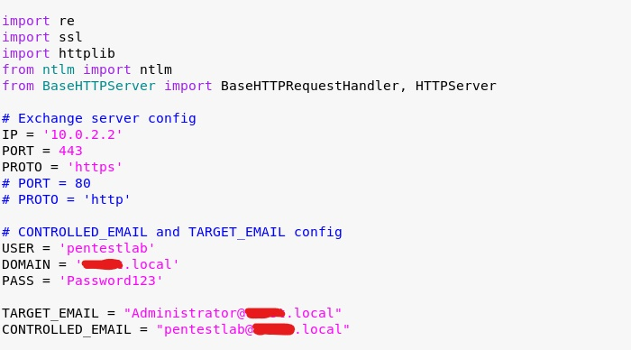
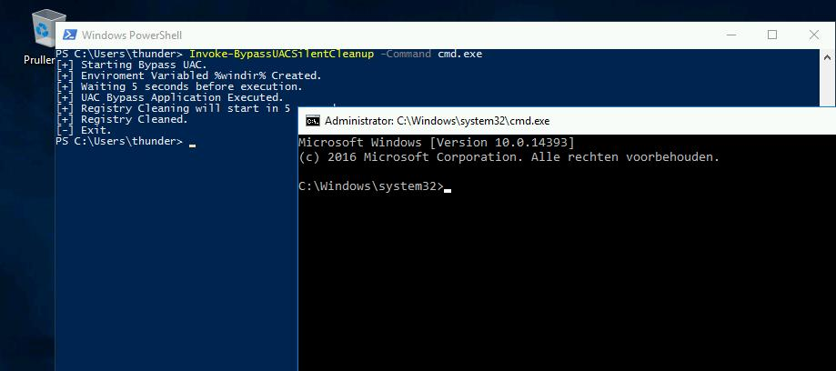

# GreyNoiseIO
**https://twitter.com/GreyNoiseIO/status/1176898873622781954 _at 2019-09-25 16:38:51_**
<blockquote>
GreyNoise is observing opportunistic exploitation of the recent vBulletin 5.x remote code execution vulnerability (CVE-2019-16759), starting three hours ago from several hundred devices around the Internet. Tags available now. 

tags:"vBulletin 5.x RCE"

https://t.co/tBMaCdimRI https://t.co/3JLNNxA0qG
</blockquote>

* https://viz.greynoise.io/query/?gnql=tags%3A%22vBulletin%205.x%20RCE%22

<table><tr>
<td></td>
</table></tr>
<table><tr>
<td>Quotes: <code>1</code></td>
<td>Replies: <code>2</code></td>
<td>Retweets: <code>51</code></td>
<td>Favorites: <code>90</code></td>
</table></tr>

---

# wugeej
**https://twitter.com/wugeej/status/1176758274151964672 _at 2019-09-25 07:20:10_**
<blockquote>
[PoC] Microsoft Exchange – Privilege Escalation

https://t.co/tzuMX4ObTq

- Delegate Access
https://t.co/wVGpW9mlDl script adding a forwarding rule is assigning permissions to the account to access any mailbox in the domain including domain administrator. https://t.co/wer6Jvej0H
</blockquote>

* https://pentestlab.blog/2019/09/16/microsoft-exchange-privilege-escalation/
* https://github.com/thezdi/PoC/tree/master/CVE-2018-8581

<table><tr>
<td></td>
</table></tr>
<table><tr>
<td>Quotes: <code>0</code></td>
<td>Replies: <code>2</code></td>
<td>Retweets: <code>14</code></td>
<td>Favorites: <code>31</code></td>
</table></tr>

---

# jamesbercegay
**https://twitter.com/jamesbercegay/status/1176735731567476736 _at 2019-09-25 05:50:35_**
<blockquote>
Here is a quick technical analysis I did of the #vbulletin #0day 

TL;DR: Doesn't seem to be a backdoor. Just horrible programming logic.

https://t.co/vMzr2SFTxA
</blockquote>

* https://gist.github.com/jamesbercegay/a8f169059c6184e76b12d98d887542b3

<table><tr>
<td>Quotes: <code>1</code></td>
<td>Replies: <code>4</code></td>
<td>Retweets: <code>28</code></td>
<td>Favorites: <code>58</code></td>
</table></tr>

---

# kmkz_security
**https://twitter.com/kmkz_security/status/1176729443722833920 _at 2019-09-25 05:25:36_**
<blockquote>
IE9/IE11 Vulnerability advanced exploitation: PoC+slides on how to bypass ASLR+DEP to exploit IE9-IE11 successfully
https://t.co/l9F8jmfQXU
</blockquote>

* https://github.com/k33nteam/IE9-IE11-Vulnerability-Advanced-Exploitation

<table><tr>
<td>Quotes: <code>0</code></td>
<td>Replies: <code>1</code></td>
<td>Retweets: <code>177</code></td>
<td>Favorites: <code>315</code></td>
</table></tr>

---

# TheHackersNews
**https://twitter.com/TheHackersNews/status/1176403685879902210 _at 2019-09-24 07:51:09_**
<blockquote>
It's not a Patch Tuesday, but #Microsoft is rolling out emergency out-of-band security patches for two new vulnerabilities:

➡️ CVE-2019-1367 — a critical IE zero-day under active attack.
➡️ CVE-2019-1255 — DoS flaw in Microsoft Defender.

Read details: https://t.co/oLonGzrR1O https://t.co/uxthA4IOaM
</blockquote>

* https://thehackernews.com/2019/09/windows-update-zero-day.html

<table><tr>
<td></td>
</table></tr>
<table><tr>
<td>Quotes: <code>10</code></td>
<td>Replies: <code>4</code></td>
<td>Retweets: <code>223</code></td>
<td>Favorites: <code>216</code></td>
</table></tr>

---

# phraaaaaaa
**https://twitter.com/phraaaaaaa/status/1176189878385729536 _at 2019-09-23 17:41:34_**
<blockquote>
Just added a PowerShell version of @tiraniddo's UAC Bypass SilentCleanup to @DonkeysTeam redteam repo:
https://t.co/OCPdlprDtc

Based on:
- https://t.co/vbnVo4KKN4
- https://t.co/2YZB0TBV3V https://t.co/eNab9Jl7ny
</blockquote>

* https://github.com/d0nkeys/redteam/blob/master/code-execution/Invoke-Bypass.ps1#L81
* https://github.com/juliourena/plaintext/blob/master/CSharp%20Tools/UAC%20Bypass/uac_bypass_silentcleanup.cs
* https://tyranidslair.blogspot.com/2017/05/exploiting-environment-variables-in.html

<table><tr>
<td></td>
</table></tr>
<table><tr>
<td>Quotes: <code>1</code></td>
<td>Replies: <code>1</code></td>
<td>Retweets: <code>82</code></td>
<td>Favorites: <code>164</code></td>
</table></tr>

---

# msftsecresponse
**https://twitter.com/msftsecresponse/status/1176181336131784705 _at 2019-09-23 17:07:37_**
<blockquote>
Out of band security vulnerability fixes CVE-2019-1367 and CVE-2019-1255 have been released today. For more information please see https://t.co/QMUM53m8so and https://t.co/vy3d0wXWng .
</blockquote>

* https://portal.msrc.microsoft.com/en-US/security-guidance/advisory/CVE-2019-1367
* https://portal.msrc.microsoft.com/en-US/security-guidance/advisory/CVE-2019-1255

<table><tr>
<td>Quotes: <code>24</code></td>
<td>Replies: <code>12</code></td>
<td>Retweets: <code>133</code></td>
<td>Favorites: <code>131</code></td>
</table></tr>

---

# Dinosn
**https://twitter.com/Dinosn/status/1176013649774874624 _at 2019-09-23 06:01:18_**
<blockquote>
CVE-2019-1082 Windows Local Privileges Escalation. Little Writeup How i found lpe vulnerability. https://t.co/Gtd82bRqKR
</blockquote>

* https://www.reddit.com/r/netsec/comments/d80o63/cve20191082_windows_local_privileges_escalation/

<table><tr>
<td>Quotes: <code>2</code></td>
<td>Replies: <code>1</code></td>
<td>Retweets: <code>129</code></td>
<td>Favorites: <code>274</code></td>
</table></tr>

---

# TheHackersNews
**https://twitter.com/TheHackersNews/status/1174252554651426823 _at 2019-09-18 09:23:20_**
<blockquote>
Warning — Researcher drops PoC for a new #phpMyAdmin zero-day flaw (CVE-2019-12922) publicly that affects all versions of the popular, widely-used database management #software.

Details: https://t.co/XGJpDCbuW0

#infosec #webdev

—via @security_wang https://t.co/GWmQceJUrI
</blockquote>

* https://thehackernews.com/2019/09/phpmyadmin-csrf-exploit.html

<table><tr>
<td></td>
</table></tr>
<table><tr>
<td>Quotes: <code>19</code></td>
<td>Replies: <code>4</code></td>
<td>Retweets: <code>231</code></td>
<td>Favorites: <code>234</code></td>
</table></tr>

---

# terjanq
**https://twitter.com/terjanq/status/1173391698216570881 _at 2019-09-16 00:22:36_**
<blockquote>
I haven't published any writeups in a while. Here is my latest #writeup to an awesome #buyify challenge from #csaw19 #ctf that has just ended a few hours ago. The author of the task is @itszn13.

You should definitely check this out! 

https://t.co/uAWk6hsyoI

#bugbountytip
</blockquote>

* https://github.com/terjanq/Flag-Capture/tree/master/CSAW%20CTF%20Qualification%20Round%202019/buyify#buyify-web-500-15-solves-by-terjanq

<table><tr>
<td>Quotes: <code>1</code></td>
<td>Replies: <code>1</code></td>
<td>Retweets: <code>20</code></td>
<td>Favorites: <code>80</code></td>
</table></tr>

---

# autumn_good_35
**https://twitter.com/autumn_good_35/status/1173210257075531776 _at 2019-09-15 12:21:37_**
<blockquote>
『The driver in Micro-Star MSI Afterburner 4.6.2.15658 (aka RTCore64.sys and RTCore32.sys) allows any authenticated user to read and write to arbitrary memory, I/O ports, and MSRs.』

Local privilege escalation PoC exploit for CVE-2019-16098
https://t.co/naFvoKeUEF
</blockquote>

* https://github.com/Barakat/CVE-2019-16098

<table><tr>
<td>Quotes: <code>0</code></td>
<td>Replies: <code>1</code></td>
<td>Retweets: <code>0</code></td>
<td>Favorites: <code>0</code></td>
</table></tr>

---

# securisec
**https://twitter.com/securisec/status/1172681184062640128 _at 2019-09-14 01:19:16_**
<blockquote>
"RT RT Voulnet: LPE vulnerability (with working exploit) in MSI Afterburners Driver RTCore64, giving nt system authority access.

Discovery and exploit by the amazing barakatsoror.

Note: the offsets are hardcoded for Win10 1903, for other versions p… https://t.co/CQ9QquTFlx"
</blockquote>

* https://github.com/Barakat/CVE-2019-16098

<table><tr>
<td>Quotes: <code>1</code></td>
<td>Replies: <code>1</code></td>
<td>Retweets: <code>43</code></td>
<td>Favorites: <code>50</code></td>
</table></tr>

---

# Alra3ees
**https://twitter.com/Alra3ees/status/1172644207862996993 _at 2019-09-13 22:52:20_**
<blockquote>
Windows-RCE-exploits: The exploit samples database is a repository for **RCE** (remote code execution) exploits and Proof-of-Concepts for **WINDOWS**, the samples are uploaded for education purposes for red and blue teams. https://t.co/urJ6xHeE3c
</blockquote>

* https://github.com/smgorelik/Windows-RCE-exploits

<table><tr>
<td>Quotes: <code>1</code></td>
<td>Replies: <code>3</code></td>
<td>Retweets: <code>160</code></td>
<td>Favorites: <code>345</code></td>
</table></tr>

---

# xxByte
**https://twitter.com/xxByte/status/1172418715717009409 _at 2019-09-13 07:56:18_**
<blockquote>
phpMyAdmin 4.9.0.1 CSRF vuln to delete any server(s) - CVE-2019-12922

Poc:
&lt;p&gt;Deleting Server 1&lt;/p&gt;
&lt;img src=“
http://server/phpmyadmin/setup/index.php?page=servers&amp;mode=remove&amp;id=1″
style=“display:none;” /&gt;

Happy hacking 
#0day
</blockquote>

<table><tr>
<td>Quotes: <code>19</code></td>
<td>Replies: <code>17</code></td>
<td>Retweets: <code>336</code></td>
<td>Favorites: <code>713</code></td>
</table></tr>

---

# piedpiper1616
**https://twitter.com/piedpiper1616/status/1172327741741387776 _at 2019-09-13 01:54:49_**
<blockquote>
GitHub - GeneralEG/CVE-2019-15858: Unauthenticated RCE at Woody Ad Snippets / CVE-2019-15858 (PoC) https://t.co/v1rKtaG7B5
</blockquote>

* https://github.com/GeneralEG/CVE-2019-15858/

<table><tr>
<td>Quotes: <code>1</code></td>
<td>Replies: <code>0</code></td>
<td>Retweets: <code>10</code></td>
<td>Favorites: <code>36</code></td>
</table></tr>

---

# GeneralEG64
**https://twitter.com/GeneralEG64/status/1172278229333413888 _at 2019-09-12 22:38:04_**
<blockquote>
I just released an Exploit for CVE-2019-15858!

Unauthenticated RCE at Woody Ad Snippets
"WordPress Plugin with 90k Active Installation"

You can find the usage and the demonstration here:
https://t.co/SOGgS6cXsB

#BugBounty
#GeneralEG https://t.co/OrFy4P2qhl
</blockquote>

* https://github.com/GeneralEG/CVE-2019-15858

<table><tr>
<td></td>
</table></tr>
<table><tr>
<td>Quotes: <code>2</code></td>
<td>Replies: <code>2</code></td>
<td>Retweets: <code>81</code></td>
<td>Favorites: <code>179</code></td>
</table></tr>

---

# Dinosn
**https://twitter.com/Dinosn/status/1172224144068546560 _at 2019-09-12 19:03:09_**
<blockquote>
From BinDiff to Zero-Day: A Proof of Concept Exploiting CVE-2019-1208 in Internet Explorer https://t.co/45VjymtB0H
</blockquote>

* https://blog.trendmicro.com/trendlabs-security-intelligence/from-bindiff-to-zero-day-a-proof-of-concept-exploiting-cve-2019-1208-in-internet-explorer/

<table><tr>
<td>Quotes: <code>1</code></td>
<td>Replies: <code>0</code></td>
<td>Retweets: <code>59</code></td>
<td>Favorites: <code>148</code></td>
</table></tr>

---

# axcheron
**https://twitter.com/axcheron/status/1172221599866589185 _at 2019-09-12 18:53:02_**
<blockquote>
From BinDiff to Zero-Day: A Proof of Concept Exploiting CVE-2019-1208 in Internet Explorer https://t.co/nOBAOE7mrx #UAF #IE #exploit
</blockquote>

* https://blog.trendmicro.com/trendlabs-security-intelligence/from-bindiff-to-zero-day-a-proof-of-concept-exploiting-cve-2019-1208-in-internet-explorer/

<table><tr>
<td>Quotes: <code>1</code></td>
<td>Replies: <code>0</code></td>
<td>Retweets: <code>25</code></td>
<td>Favorites: <code>58</code></td>
</table></tr>

---

# OPOSEC
**https://twitter.com/OPOSEC/status/1172102564277575680 _at 2019-09-12 11:00:02_**
<blockquote>
Firefox Use-After-Free PoC (CVE-2018-18500). https://t.co/yz3via1TTc #Hack #270 (2019)
</blockquote>

* https://github.com/sophoslabs/CVE-2018-18500/

<table><tr>
<td>Quotes: <code>1</code></td>
<td>Replies: <code>0</code></td>
<td>Retweets: <code>13</code></td>
<td>Favorites: <code>22</code></td>
</table></tr>

---

# rogue_kdc
**https://twitter.com/rogue_kdc/status/1171706305368723457 _at 2019-09-11 08:45:27_**
<blockquote>
@_RastaMouse and I found a privilege escalation/DoS bug in Windows AppX Deployment Server (CVE-2019-1253)
Both of us found it independently while researching CVE-2019-0841
Use it responsibly!
https://t.co/Ts899ikpDi
</blockquote>

* https://github.com/rogue-kdc/CVE-2019-1253

<table><tr>
<td>Quotes: <code>2</code></td>
<td>Replies: <code>3</code></td>
<td>Retweets: <code>57</code></td>
<td>Favorites: <code>87</code></td>
</table></tr>

---

# piedpiper1616
**https://twitter.com/piedpiper1616/status/1171242948584861696 _at 2019-09-10 02:04:14_**
<blockquote>
GitHub - exodusintel/Chrome-Issue-992914-Sealed-Frozen-Element-Kind-Type-Confusion-RCE-Exploit: September Chrome 1day by István Kurucsai https://t.co/9loQ9Q1cZ9
</blockquote>

* https://github.com/exodusintel/Chrome-Issue-992914-Sealed-Frozen-Element-Kind-Type-Confusion-RCE-Exploit/

<table><tr>
<td>Quotes: <code>0</code></td>
<td>Replies: <code>1</code></td>
<td>Retweets: <code>11</code></td>
<td>Favorites: <code>46</code></td>
</table></tr>

---

# kmkz_security
**https://twitter.com/kmkz_security/status/1169547426249826305 _at 2019-09-05 09:46:50_**
<blockquote>
3 vulns #exploit chain used in #PenTest 45 days ago -&gt; #ACL bypass+SQLi+RCE via file upload :S CVE-2019-14252/14253/14254 - No magic 0days here: https://t.co/NajroEqOSU #Pentesting #CVE #disclosure cc @Publisure @jeefers
</blockquote>

* https://github.com/kmkz/exploit/blob/master/PUBLISURE-EXPLOIT-CHAIN-ADVISORY.txt

<table><tr>
<td>Quotes: <code>2</code></td>
<td>Replies: <code>3</code></td>
<td>Retweets: <code>48</code></td>
<td>Favorites: <code>117</code></td>
</table></tr>

---

