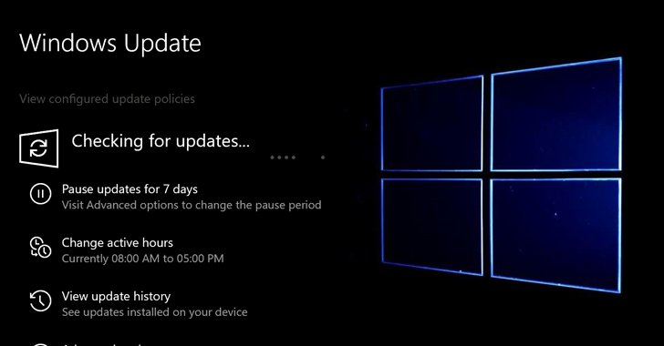

# GreyNoiseIO
**https://twitter.com/GreyNoiseIO/status/1176898873622781954 _at Wed Sep 25 16:38:51 +0000 2019_**
<blockquote>
GreyNoise is observing opportunistic exploitation of the recent vBulletin 5.x remote code execution vulnerability (CVE-2019-16759), starting three hours ago from several hundred devices around the Internet. Tags available now. 

tags:"vBulletin 5.x RCE"

https://t.co/tBMaCdimRI https://t.co/3JLNNxA0qG
</blockquote>

* https://viz.greynoise.io/query/?gnql=tags%3A%22vBulletin%205.x%20RCE%22

<table><tr>
<td></td>
</tr></table>
<table><tr>
<td>Quotes: <code>1</code></td>
<td>Replies: <code>2</code></td>
<td>Retweets: <code>51</code></td>
<td>Favorites: <code>90</code></td>
</tr></table>

---

# TheHackersNews
**https://twitter.com/TheHackersNews/status/1176403685879902210 _at Tue Sep 24 07:51:09 +0000 2019_**
<blockquote>
It's not a Patch Tuesday, but #Microsoft is rolling out emergency out-of-band security patches for two new vulnerabilities:

➡️ CVE-2019-1367 — a critical IE zero-day under active attack.
➡️ CVE-2019-1255 — DoS flaw in Microsoft Defender.

Read details: https://t.co/oLonGzrR1O https://t.co/uxthA4IOaM
</blockquote>

* https://thehackernews.com/2019/09/windows-update-zero-day.html

<table><tr>
<td></td>
</tr></table>
<table><tr>
<td>Quotes: <code>10</code></td>
<td>Replies: <code>4</code></td>
<td>Retweets: <code>224</code></td>
<td>Favorites: <code>217</code></td>
</tr></table>

---

# msftsecresponse
**https://twitter.com/msftsecresponse/status/1176181336131784705 _at Mon Sep 23 17:07:37 +0000 2019_**
<blockquote>
Out of band security vulnerability fixes CVE-2019-1367 and CVE-2019-1255 have been released today. For more information please see https://t.co/QMUM53m8so and https://t.co/vy3d0wXWng .
</blockquote>

* https://portal.msrc.microsoft.com/en-US/security-guidance/advisory/CVE-2019-1367
* https://portal.msrc.microsoft.com/en-US/security-guidance/advisory/CVE-2019-1255

<table><tr>
<td>Quotes: <code>24</code></td>
<td>Replies: <code>12</code></td>
<td>Retweets: <code>133</code></td>
<td>Favorites: <code>129</code></td>
</tr></table>

---

# Dinosn
**https://twitter.com/Dinosn/status/1176013649774874624 _at Mon Sep 23 06:01:18 +0000 2019_**
<blockquote>
CVE-2019-1082 Windows Local Privileges Escalation. Little Writeup How i found lpe vulnerability. https://t.co/Gtd82bRqKR
</blockquote>

* https://www.reddit.com/r/netsec/comments/d80o63/cve20191082_windows_local_privileges_escalation/

<table><tr>
<td>Quotes: <code>2</code></td>
<td>Replies: <code>1</code></td>
<td>Retweets: <code>130</code></td>
<td>Favorites: <code>273</code></td>
</tr></table>

---

# TheHackersNews
**https://twitter.com/TheHackersNews/status/1174252554651426823 _at Wed Sep 18 09:23:20 +0000 2019_**
<blockquote>
Warning — Researcher drops PoC for a new #phpMyAdmin zero-day flaw (CVE-2019-12922) publicly that affects all versions of the popular, widely-used database management #software.

Details: https://t.co/XGJpDCbuW0

#infosec #webdev

—via @security_wang https://t.co/GWmQceJUrI
</blockquote>

* https://thehackernews.com/2019/09/phpmyadmin-csrf-exploit.html

<table><tr>
<td></td>
</tr></table>
<table><tr>
<td>Quotes: <code>19</code></td>
<td>Replies: <code>4</code></td>
<td>Retweets: <code>231</code></td>
<td>Favorites: <code>234</code></td>
</tr></table>

---

# xxByte
**https://twitter.com/xxByte/status/1172418715717009409 _at Fri Sep 13 07:56:18 +0000 2019_**
<blockquote>
phpMyAdmin 4.9.0.1 CSRF vuln to delete any server(s) - CVE-2019-12922

Poc:
&lt;p&gt;Deleting Server 1&lt;/p&gt;
&lt;img src=“
http://server/phpmyadmin/setup/index.php?page=servers&amp;mode=remove&amp;id=1″
style=“display:none;” /&gt;

Happy hacking 
#0day
</blockquote>

<table><tr>
<td>Quotes: <code>19</code></td>
<td>Replies: <code>17</code></td>
<td>Retweets: <code>336</code></td>
<td>Favorites: <code>716</code></td>
</tr></table>

---

# Dinosn
**https://twitter.com/Dinosn/status/1172224144068546560 _at Thu Sep 12 19:03:09 +0000 2019_**
<blockquote>
From BinDiff to Zero-Day: A Proof of Concept Exploiting CVE-2019-1208 in Internet Explorer https://t.co/45VjymtB0H
</blockquote>

* https://blog.trendmicro.com/trendlabs-security-intelligence/from-bindiff-to-zero-day-a-proof-of-concept-exploiting-cve-2019-1208-in-internet-explorer/

<table><tr>
<td>Quotes: <code>1</code></td>
<td>Replies: <code>0</code></td>
<td>Retweets: <code>59</code></td>
<td>Favorites: <code>147</code></td>
</tr></table>

---

# axcheron
**https://twitter.com/axcheron/status/1172221599866589185 _at Thu Sep 12 18:53:02 +0000 2019_**
<blockquote>
From BinDiff to Zero-Day: A Proof of Concept Exploiting CVE-2019-1208 in Internet Explorer https://t.co/nOBAOE7mrx #UAF #IE #exploit
</blockquote>

* https://blog.trendmicro.com/trendlabs-security-intelligence/from-bindiff-to-zero-day-a-proof-of-concept-exploiting-cve-2019-1208-in-internet-explorer/

<table><tr>
<td>Quotes: <code>1</code></td>
<td>Replies: <code>0</code></td>
<td>Retweets: <code>25</code></td>
<td>Favorites: <code>58</code></td>
</tr></table>

---

# rogue_kdc
**https://twitter.com/rogue_kdc/status/1171706305368723457 _at Wed Sep 11 08:45:27 +0000 2019_**
<blockquote>
@_RastaMouse and I found a privilege escalation/DoS bug in Windows AppX Deployment Server (CVE-2019-1253)
Both of us found it independently while researching CVE-2019-0841
Use it responsibly!
https://t.co/Ts899ikpDi
</blockquote>

* https://github.com/rogue-kdc/CVE-2019-1253

<table><tr>
<td>Quotes: <code>2</code></td>
<td>Replies: <code>3</code></td>
<td>Retweets: <code>57</code></td>
<td>Favorites: <code>87</code></td>
</tr></table>

---

# kmkz_security
**https://twitter.com/kmkz_security/status/1169547426249826305 _at Thu Sep 05 09:46:50 +0000 2019_**
<blockquote>
3 vulns #exploit chain used in #PenTest 45 days ago -&gt; #ACL bypass+SQLi+RCE via file upload :S CVE-2019-14252/14253/14254 - No magic 0days here: https://t.co/NajroEqOSU #Pentesting #CVE #disclosure cc @Publisure @jeefers
</blockquote>

* https://github.com/kmkz/exploit/blob/master/PUBLISURE-EXPLOIT-CHAIN-ADVISORY.txt

<table><tr>
<td>Quotes: <code>2</code></td>
<td>Replies: <code>3</code></td>
<td>Retweets: <code>48</code></td>
<td>Favorites: <code>117</code></td>
</tr></table>

---

