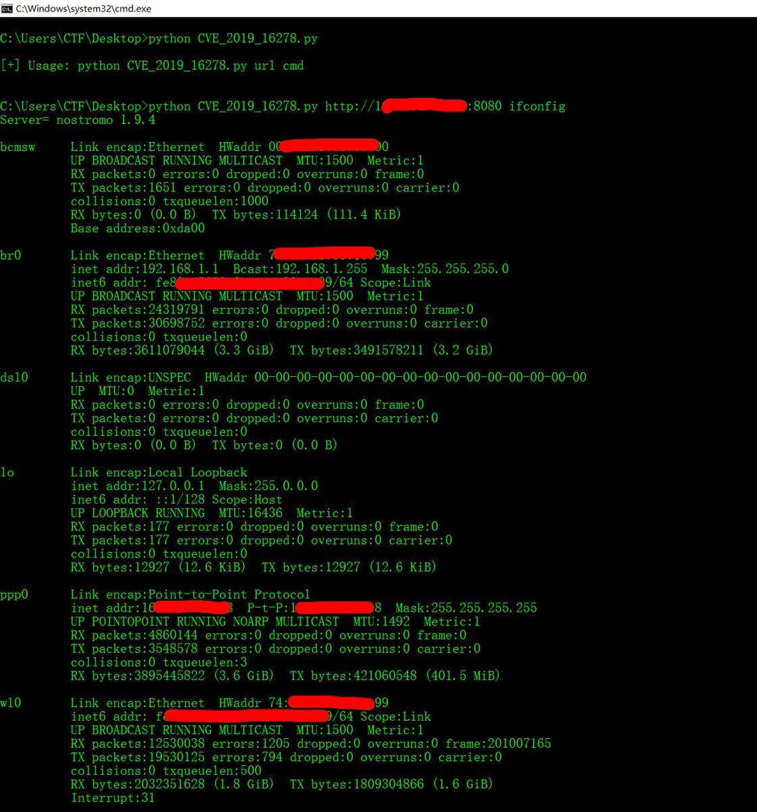
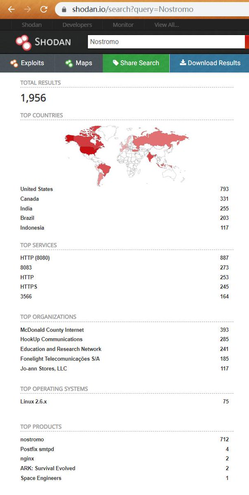
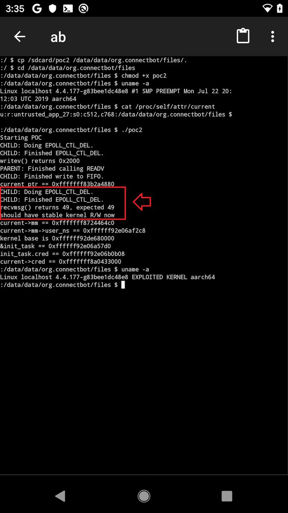

# Dinosn
**https://twitter.com/Dinosn/status/1185132930148061185 _at Fri Oct 18 09:58:03 +0000 2019_**
<blockquote>
Researcher released PoC exploit code for CVE-2019-2215 Android zero-day flaw https://t.co/JXTe1kmaxd
</blockquote>

* https://securityaffairs.co/wordpress/92633/hacking/cve-2019-2215-zero-day-exploit.html

<table><tr>
<td>Quotes: <code>2</code></td>
<td>Replies: <code>0</code></td>
<td>Retweets: <code>41</code></td>
<td>Favorites: <code>90</code></td>
</tr></table>

---

# TheHackersNews
**https://twitter.com/TheHackersNews/status/1184834125821145095 _at Thu Oct 17 14:10:43 +0000 2019_**
<blockquote>
qu1ckr00t (CVE-2019-2215)

Researcher releases proof-of-concept for a recent #Android kernel arbitrary read/write zero-day vulnerability that was being actively exploited in the wild.

https://t.co/yBf9n7fXzO

Demo: https://t.co/Ih2biu7Dbf
</blockquote>

* https://github.com/grant-h/qu1ckr00t
* https://twitter.com/Digital_Cold/status/1182045384505466885

<table><tr>
<td>Quotes: <code>3</code></td>
<td>Replies: <code>1</code></td>
<td>Retweets: <code>79</code></td>
<td>Favorites: <code>121</code></td>
</tr></table>

---

# HeinrichsH
**https://twitter.com/HeinrichsH/status/1184358671733743616 _at Wed Oct 16 06:41:26 +0000 2019_**
<blockquote>
A few hours ago, two bugs in Palo Alto Networks GlobalProtect Agent allowing LPE on Win/Linux/macOS were fixed (CVE-2019-17435, CVE-2019-17436). Curious? Grab one of the last @t2_fi tickets 🎫 and learn more 😊🤙🏻 #t2infosec
</blockquote>

<table><tr>
<td>Quotes: <code>0</code></td>
<td>Replies: <code>0</code></td>
<td>Retweets: <code>21</code></td>
<td>Favorites: <code>33</code></td>
</tr></table>

---

# jas502n
**https://twitter.com/jas502n/status/1183947634974740480 _at Tue Oct 15 03:28:07 +0000 2019_**
<blockquote>
#0day CVE-2019-16278 RCE
Nostromo httpd is prone to 2 cricital 
vulnerabilities for versions &lt;= 1.9.6 

first one is an RCE through directory transversal
second one is a DoS (CVE-2019-16279) https://t.co/Q1nvRze8aN
</blockquote>

<table><tr>
<td></td>
<td></td>
</tr></table>
<table><tr>
<td>Quotes: <code>2</code></td>
<td>Replies: <code>5</code></td>
<td>Retweets: <code>60</code></td>
<td>Favorites: <code>96</code></td>
</tr></table>

---

# Digital_Cold
**https://twitter.com/Digital_Cold/status/1182045384505466885 _at Wed Oct 09 21:29:15 +0000 2019_**
<blockquote>
Rooting a Pixel 2 with Magisk from an untrusted app using CVE-2019-2215, no OEM unlock needed https://t.co/yGovBluQj5
</blockquote>

<table><tr>
<td></td>
</tr></table>
<table><tr>
<td>Quotes: <code>25</code></td>
<td>Replies: <code>30</code></td>
<td>Retweets: <code>262</code></td>
<td>Favorites: <code>928</code></td>
</tr></table>

---

# campuscodi
**https://twitter.com/campuscodi/status/1181431525356654593 _at Tue Oct 08 04:50:00 +0000 2019_**
<blockquote>
Zero-day published for old Joomla CMS versions

-PoC available
-trivial to exploit
-impacts 3.x to 3.4.6
-PHP object injection leading to RCE
-no CVE yet
-similar to CVE-2015-8562, but not PHP environment-tethered

https://t.co/0TDyNcocUP https://t.co/Xsx3euViez
</blockquote>

* https://www.zdnet.com/article/zero-day-published-for-old-joomla-cms-versions/

<table><tr>
<td></td>
</tr></table>
<table><tr>
<td>Quotes: <code>2</code></td>
<td>Replies: <code>1</code></td>
<td>Retweets: <code>74</code></td>
<td>Favorites: <code>109</code></td>
</tr></table>

---

# wugeej
**https://twitter.com/wugeej/status/1180993519327924225 _at Sun Oct 06 23:49:31 +0000 2019_**
<blockquote>
[CVE-2019-2215] critical unpatched zero-day vulnerability affecting the Android mobile operating system.

Escalate privileges to gain root access to a vulnerable device. 

[poc.c] https://t.co/rFquk1LWpO

[uaf_test.c] https://t.co/JGmCVuj1WX

https://t.co/R3o8hNkGGf https://t.co/t0pU2cYJoQ
</blockquote>

* https://00e9e64bac2d53fe420f7c6b0702b847a830a4e8470c46969c-apidata.googleusercontent.com/download/storage/v1/b/monorail-prod.appspot.com/o/26%2Fattachments%2Fc700ee47-ea4d-4825-a67e-ef785f011ccc?qk=AD5uMEtxm7d4E18RhqRQraMLOl6oh_gmsMI2O5PvXo5mHk4VNxAb77erVac8c3KSyRtugVEZuT8gvTJvWnVrAwU14gJ_fcnexxSUBUiVLMVmDNW_MnlnB4U_dZxElWsclib1R5YCLvQtdcssIIv6AKVi4RxNrSZ6cbdcJel7i9UxgyBRzgRgf_exdo9n8_iSR_njMMtajKo6pN7oe3O6KtWyXM3jqNc9XlPMjNNb94nosp6SURCOaY8HkT7cmsJ8PdIPZImQXKJ-WsX-UYVwrPxaViVZTjQN7UEFO7fL-n1ly7klkgPL6ilVpB5zTK1xOwwmQxhqZLuHPYeEbk4ldtC6ouY90R0qAlSnxBumFAk1v6kX5GopBtlXoRKwjDscsDk7kK3Q0W_qps3glU-8qfDytU8ZHBXfm6lBkCVwJZGlY23WjH5zA7C_EWCWF8ZQEJNskGn87_CdjhWitnEeKwiPAItijSmfHXPdHbCYjjYG4n58cJ5pOFxfBPIDQ8-S2d0KGgJ6fJoHeuRYl0Ut6rqNMsSKehIe1jeEl0TZUJC_BjqPUFnNwzRvz-TazvQV21KEBqO-rJ4LORuTMHPBJ62GrsNdXd2HJabaapbDnCrcI1fwXWFR-4EUssiM-Qxz-u6ioakyPeJ1HpojKlHB_5snPrWz1YlZG9nOiQ6Ecom4pgD0sClXn57PDeJWfU8A25cIrXIul3161Ui_nu1Z_cd3Qwv6f9zs5z13DJ7hNi6DqvI6ws9sqNKLusHtMORD26DHsAUOGyBtg1p76Kn-1madffBb_CY_hKEvjKjLHGkrng_OyKCx_kx1it2ce83mYuEB4R1SifoHu-lo1u8-0Wfo1LCku6xzzEYctQo1jzDZ2Mc_Et583tY
* https://bugs.chromium.org/p/project-zero/issues/attachmentText?aid=414030
* https://bugs.chromium.org/p/project-zero/issues/detail?id=1942

<table><tr>
<td></td>
<td></td>
</tr></table>
<table><tr>
<td>Quotes: <code>1</code></td>
<td>Replies: <code>0</code></td>
<td>Retweets: <code>33</code></td>
<td>Favorites: <code>74</code></td>
</tr></table>

---

