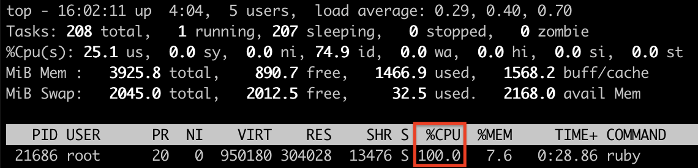
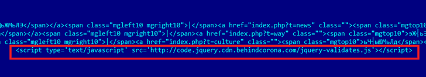

# Pitoon_T
**https://twitter.com/Pitoon_T/status/1210741607403704322 _at 2019-12-28 01:57:48_**
<blockquote>
CVE-2019-13272 :  A linux kernel Local Root Privilege Escalation vulnerability with PTRACE_TRACEME

https://t.co/kRgZ73wYpP
</blockquote>

* https://github.com/jiayy/android_vuln_poc-exp/tree/master/EXP-CVE-2019-13272-aarch64

<table><tr>
<td>Quotes: <code>0</code></td>
<td>Replies: <code>0</code></td>
<td>Retweets: <code>1</code></td>
<td>Favorites: <code>2</code></td>
</tr></table>

---

# ddouhine
**https://twitter.com/ddouhine/status/1210588750008463360 _at 2019-12-27 15:50:24_**
<blockquote>
Blue teamers you can target #metasploit with this exploit... #metasploit dropped yesterday ;)
No RCE but a DoS: red teamers will lost their sessions, don't get new ones and will have to restart MSF.
CVE-2019-5645
https://t.co/zH8D4GCTYU https://t.co/zmG1jmYsaF
</blockquote>

* https://github.com/rapid7/metasploit-framework/pull/12433

<table><tr>
<td></td>
<td></td>
</table></tr>
<table><tr>
<td>Quotes: <code>30</code></td>
<td>Replies: <code>13</code></td>
<td>Retweets: <code>264</code></td>
<td>Favorites: <code>645</code></td>
</tr></table>

---

# cry__pto
**https://twitter.com/cry__pto/status/1210122011428737025 _at 2019-12-26 08:55:45_**
<blockquote>
Jenkins RCE Proof-of-Concept: SECURITY-1266 / CVE-2019-1003000 (Script Security),CVE-2019-1003001 (Pipeline: Groovy),CVE-2019-1003002 (Pipeline: Declarative)
https://t.co/IPoLU0SoyC
#Hacking #pentest #redteam #infosec #bugbountytips
</blockquote>

* https://github.com/adamyordan/cve-2019-1003000-jenkins-rce-poc

<table><tr>
<td>Quotes: <code>1</code></td>
<td>Replies: <code>0</code></td>
<td>Retweets: <code>9</code></td>
<td>Favorites: <code>19</code></td>
</tr></table>

---

# kumagami331
**https://twitter.com/kumagami331/status/1210114878469357568 _at 2019-12-26 08:27:24_**
<blockquote>
CVE-2019-10758 mongo-express RCE PoC
Authenticated remote attacker can execute arbitrary code. 
https://t.co/kapRHmIHSJ
</blockquote>

* https://github.com/masahiro331/CVE-2019-10758

<table><tr>
<td>Quotes: <code>0</code></td>
<td>Replies: <code>1</code></td>
<td>Retweets: <code>0</code></td>
<td>Favorites: <code>3</code></td>
</tr></table>

---

# standa_t
**https://twitter.com/standa_t/status/1208426206233874436 _at 2019-12-21 16:37:13_**
<blockquote>
RT @n4r1B: We just updated the executive callback repo with a research on the callback used by PatchGuard @0xcpu https://t.co/QW4QvMxT8j
</blockquote>

* https://github.com/0xcpu/ExecutiveCallbackObjects/tree/master/542875F90F9B47F497B64BA219CACF69

<table><tr>
<td>Quotes: <code>0</code></td>
<td>Replies: <code>0</code></td>
<td>Retweets: <code>47</code></td>
<td>Favorites: <code>0</code></td>
</tr></table>

---

# buherator
**https://twitter.com/buherator/status/1208188314777477120 _at 2019-12-21 00:51:55_**
<blockquote>
Wrote an exploit based on @kyREcon's Symantec LPE writeup:

https://t.co/PdMpZni8Z4
(still half-drunk, so no warranty...) https://t.co/ic26ArYsH6
</blockquote>

* https://github.com/v-p-b/cve-2019-12750/

<table><tr>
<td></td>
</table></tr>
<table><tr>
<td>Quotes: <code>3</code></td>
<td>Replies: <code>3</code></td>
<td>Retweets: <code>71</code></td>
<td>Favorites: <code>137</code></td>
</tr></table>

---

# n4r1B
**https://twitter.com/n4r1B/status/1208091642114248707 _at 2019-12-20 18:27:47_**
<blockquote>
We just updated the executive callback repo with a research on the callback used by PatchGuard @0xcpu https://t.co/QW4QvMxT8j
</blockquote>

* https://github.com/0xcpu/ExecutiveCallbackObjects/tree/master/542875F90F9B47F497B64BA219CACF69

<table><tr>
<td>Quotes: <code>3</code></td>
<td>Replies: <code>2</code></td>
<td>Retweets: <code>47</code></td>
<td>Favorites: <code>104</code></td>
</tr></table>

---

# noperator
**https://twitter.com/noperator/status/1205534110212673548 _at 2019-12-13 17:05:04_**
<blockquote>
Just published a PoC exploit for CVE-2019-18935 (https://t.co/TtW4GKVm0n), RCE via insecure deserialization affecting Telerik UI. See full write-up below. Thanks to @mwulftange for discovering this issue, and @bao7uo for collaborating on exploit dev.
</blockquote>

* https://github.com/noperator/CVE-2019-18935

<table><tr>
<td>Quotes: <code>5</code></td>
<td>Replies: <code>0</code></td>
<td>Retweets: <code>103</code></td>
<td>Favorites: <code>222</code></td>
</tr></table>

---

# bishopfox
**https://twitter.com/bishopfox/status/1205516977793589250 _at 2019-12-13 15:56:59_**
<blockquote>
The CVE-2019-18935 is a severe insecure deserialization vulnerability affecting #Telerik UI. Understand its impact + learn to safely patch your software in this post from @noperator: https://t.co/x6nstX1Ieg (With thanks to @mwulftange + @bao7uo) https://t.co/qHc5XoKywA
</blockquote>

* https://hubs.ly/H0mf7L-0

<table><tr>
<td></td>
</table></tr>
<table><tr>
<td>Quotes: <code>6</code></td>
<td>Replies: <code>1</code></td>
<td>Retweets: <code>68</code></td>
<td>Favorites: <code>147</code></td>
</tr></table>

---

# IanColdwater
**https://twitter.com/IanColdwater/status/1205167269124423681 _at 2019-12-12 16:47:22_**
<blockquote>
2 new CVEs for Istio with 9.0 CVSS scores:

CVE-2019-18801
CVE-2019-18802

Heap overflow and improper input validation in Envoy

https://t.co/tGv4fXXW2j
</blockquote>

* https://istio.io/news/security/istio-security-2019-007/

<table><tr>
<td>Quotes: <code>1</code></td>
<td>Replies: <code>1</code></td>
<td>Retweets: <code>15</code></td>
<td>Favorites: <code>44</code></td>
</tr></table>

---

# Nettitude_Labs
**https://twitter.com/Nettitude_Labs/status/1205155380751486976 _at 2019-12-12 16:00:08_**
<blockquote>
Learn how to exploit Symantec Endpoint Protection on all versions of Windows (CVE-2019-12750). Part 2 of this series by @kyREcon delves into a more advanced method of exploitation! https://t.co/1LBcHOkQT7
</blockquote>

* https://labs.nettitude.com/blog/cve-2019-12750-symantec-endpoint-protection-local-privilege-escalation-part-2/

<table><tr>
<td>Quotes: <code>5</code></td>
<td>Replies: <code>1</code></td>
<td>Retweets: <code>141</code></td>
<td>Favorites: <code>259</code></td>
</tr></table>

---

# TheHackersNews
**https://twitter.com/TheHackersNews/status/1205021980241453056 _at 2019-12-12 07:10:02_**
<blockquote>
👏 Patched in less than 3 hours...
 
A new local privilege escalation vulnerability (CVE-2019-19726) discovered in #OpenBSD 6.5/6.6 that could allow local users or malicious software to gain full root privileges on targeted systems.

Details and PoC: https://t.co/Lc1NTtTG3G
</blockquote>

* https://www.qualys.com/2019/12/11/cve-2019-19726/local-privilege-escalation-openbsd-dynamic-loader.txt

<table><tr>
<td>Quotes: <code>3</code></td>
<td>Replies: <code>1</code></td>
<td>Retweets: <code>67</code></td>
<td>Favorites: <code>109</code></td>
</tr></table>

---

# OPOSEC
**https://twitter.com/OPOSEC/status/1204672174830825473 _at 2019-12-11 08:00:02_**
<blockquote>
PreAuth RCE on Palo Alto GlobalProtect Part II (CVE-2019-1579). https://t.co/W2ILBPYz5Y (+) PoC: https://t.co/c7NoOYuCYi #Security #293 (2019)
</blockquote>

* http://bit.ly/2lXfyJy
* https://github.com/securifera/CVE-2019-1579

<table><tr>
<td>Quotes: <code>1</code></td>
<td>Replies: <code>0</code></td>
<td>Retweets: <code>26</code></td>
<td>Favorites: <code>32</code></td>
</tr></table>

---

# TheHackersNews
**https://twitter.com/TheHackersNews/status/1204649907388203008 _at 2019-12-11 06:31:33_**
<blockquote>
Used in #OperationWizardOpium cyberattack, the newly patched Windows 0-day privilege escalation vulnerability (CVE-2019-1458) was exploited in combination with a Chrome browser flaw to take remote control over vulnerable computers, as spotted by Kaspersky researchers. https://t.co/PzJHLIpwUB
</blockquote>

<table><tr>
<td></td>
</table></tr>
<table><tr>
<td>Quotes: <code>2</code></td>
<td>Replies: <code>2</code></td>
<td>Retweets: <code>85</code></td>
<td>Favorites: <code>110</code></td>
</tr></table>

---

# blackorbird
**https://twitter.com/blackorbird/status/1204585220529258496 _at 2019-12-11 02:14:31_**
<blockquote>
#APT #Darkhotel #0day #WizardOpium
Chrome RCE to windows Privilege Escalation

First
Chrome 0-day exploit CVE-2019-13720 used in Operation WizardOpium
https://t.co/WmUj2BkieG
Then
Windows 0-day exploit CVE-2019-1458 used in Operation WizardOpium(Windows 7)
https://t.co/Gqkmmn9Ujc https://t.co/VUwL14hPNf
</blockquote>

* https://securelist.com/chrome-0-day-exploit-cve-2019-13720-used-in-operation-wizardopium/94866/
* https://securelist.com/windows-0-day-exploit-cve-2019-1458-used-in-operation-wizardopium/95432/

<table><tr>
<td></td>
</table></tr>
<table><tr>
<td>Quotes: <code>4</code></td>
<td>Replies: <code>1</code></td>
<td>Retweets: <code>108</code></td>
<td>Favorites: <code>164</code></td>
</tr></table>

---

# JLLeitschuh
**https://twitter.com/JLLeitschuh/status/1204106820115222529 _at 2019-12-09 18:33:31_**
<blockquote>
CVE-2019-10769: Public disclosure of a vuln in Safer-Eval JS

It's a sandbox bypass allowing for #XSS and #RCE

According to GitHub Dependency Insights, this library is used by 36.6k projects and there will be no fix provided.

Proof of Concept:
https://t.co/iY8cidByKZ
</blockquote>

* https://gist.github.com/JLLeitschuh/609bb2efaff22ed84fe182cf574c023a

<table><tr>
<td>Quotes: <code>1</code></td>
<td>Replies: <code>1</code></td>
<td>Retweets: <code>10</code></td>
<td>Favorites: <code>27</code></td>
</tr></table>

---

# netbiosX
**https://twitter.com/netbiosX/status/1203728250897420289 _at 2019-12-08 17:29:13_**
<blockquote>
#UAC Bypass In The Wild https://t.co/nX8s0AddEM
</blockquote>

* https://github.com/sailay1996/UAC_Bypass_In_The_Wild

<table><tr>
<td>Quotes: <code>0</code></td>
<td>Replies: <code>0</code></td>
<td>Retweets: <code>17</code></td>
<td>Favorites: <code>60</code></td>
</tr></table>

---

# 404death
**https://twitter.com/404death/status/1203641639362674688 _at 2019-12-08 11:45:04_**
<blockquote>
you can UAC bypass all executable files which are autoelevate true base on my first article.

UAC Bypass All the things  POCs: 
https://t.co/ZMjLCbI08h

sample: 
Bluetooth uninstall device task (UAC Bypass to administrator) https://t.co/TawDPFRvLc
</blockquote>

* https://github.com/sailay1996/UAC_Bypass_In_The_Wild

<table><tr>
<td></td>
</table></tr>
<table><tr>
<td>Quotes: <code>9</code></td>
<td>Replies: <code>4</code></td>
<td>Retweets: <code>412</code></td>
<td>Favorites: <code>790</code></td>
</tr></table>

---

# trouble1_raunak
**https://twitter.com/trouble1_raunak/status/1203381108894662656 _at 2019-12-07 18:29:48_**
<blockquote>
I have issued my lab on #github 
I will be demonstrating the attacks throughout my talk at 
@NullMumbai
["Vulnerabilities": 'blind stored XSS', 'CSRF', 'Unrestricted File upload']
https://t.co/LMUSpYR646

@Jhaddix @avkashk @kp625544 @null0x00 @chiragsavla94 @m0nkeyshell https://t.co/qlygom6Mi9
</blockquote>

* https://github.com/TROUBLE-1/shoping_site/

<table><tr>
<td></td>
<td></td>
<td></td>
<td></td>
</table></tr>
<table><tr>
<td>Quotes: <code>0</code></td>
<td>Replies: <code>1</code></td>
<td>Retweets: <code>24</code></td>
<td>Favorites: <code>32</code></td>
</tr></table>

---

# 0vercl0k
**https://twitter.com/0vercl0k/status/1202955509738934272 _at 2019-12-06 14:18:38_**
<blockquote>
Here is an exploit chain I wrote for Firefox that gets RCE via CVE-2019-9810 and escape the sandbox with CVE-2019-11708/CVE-2019-9810. Once compromised, it drops a payload and injects privileged JS code in already/newly created tabs. https://t.co/ZmUxjBBhpC https://t.co/LeAOCgqpMG
</blockquote>

* https://github.com/0vercl0k/CVE-2019-11708

<table><tr>
<td></td>
</table></tr>
<table><tr>
<td>Quotes: <code>8</code></td>
<td>Replies: <code>8</code></td>
<td>Retweets: <code>470</code></td>
<td>Favorites: <code>1020</code></td>
</tr></table>

---

# TheHackersNews
**https://twitter.com/TheHackersNews/status/1202553842870571008 _at 2019-12-05 11:42:33_**
<blockquote>
New 👇

A critical remote Authentication Bypass (smtpd, ldapd, and radiusd) and 3 other Local Privilege Escalation flaws disclosed in #OpenBSD operating system.

Details and PoC — https://t.co/ZowHZY6O1e
 
➡️ CVE-2019-19521
➡️ CVE-2019-19520
➡️ CVE-2019-19522
➡️ CVE-2019-19519 https://t.co/S2y3fvRqbP
</blockquote>

* https://thehackernews.com/2019/12/openbsd-authentication-vulnerability.html

<table><tr>
<td></td>
</table></tr>
<table><tr>
<td>Quotes: <code>3</code></td>
<td>Replies: <code>2</code></td>
<td>Retweets: <code>186</code></td>
<td>Favorites: <code>192</code></td>
</tr></table>

---

# wugeej
**https://twitter.com/wugeej/status/1201329906820378624 _at 2019-12-02 02:39:04_**
<blockquote>
[PoC List] Zero-Day Usage By Country

10. CVE-2014-4114
https://t.co/91mckksspf
https://t.co/ytfEUd8R1m

11. CVE-2015-0071
https://t.co/j7rd8KOb4C

12. CVE-2015-1701
https://t.co/oXGkYilZ74

13. CVE-2015-2424
https://t.co/vHagQestQy

14. CVE-2015-2502
https://t.co/zryBIkBOmY
</blockquote>

* https://github.com/DarkenCode/PoC/tree/master/CVE-2014-4114
* https://www.zscaler.com/blogs/research/analysis-sandworm-cve-2014-4114-0-day
* https://blog.trendmicro.com/trendlabs-security-intelligence/bypassing-aslr-with-cve-2015-0071-an-out-of-bounds-read-vulnerability/
* https://github.com/hfiref0x/CVE-2015-1701
* https://www.trustwave.com/en-us/resources/blogs/spiderlabs-blog/tsar-team-microsoft-office-zero-day-cve-2015-2424/
* https://otx.alienvault.com/pulse/55d4be3b67db8c37b0a34f75

<table><tr>
<td>Quotes: <code>1</code></td>
<td>Replies: <code>0</code></td>
<td>Retweets: <code>11</code></td>
<td>Favorites: <code>9</code></td>
</tr></table>

---

# wugeej
**https://twitter.com/wugeej/status/1201329902764511232 _at 2019-12-02 02:39:03_**
<blockquote>
[PoC List] Zero-Day Usage By Country

#Fireeye

1. CVE-2012-4681
https://t.co/q8RzawOJXg

2. CVE-2012-4792
https://t.co/IdAkgMf45l

3. CVE-2013-0422
https://t.co/Nbn034eY0K
https://t.co/0F4LnSBCO5

4. CVE-2013-3893
https://t.co/DTp47A5O59

5. CVE-2013-3918
https://t.co/F9nketGNVJ https://t.co/Ijk48e7vzT
</blockquote>

* https://www.exploit-db.com/exploits/20865
* https://github.com/rapid7/metasploit-framework/blob/master/modules/exploits/windows/browser/ie_cbutton_uaf.rb
* https://github.com/rapid7/metasploit-framework/tree/master/external/source/exploits/cve-2013-0422
* https://www.exploit-db.com/exploits/24045
* https://msrc-blog.microsoft.com/2013/09/17/cve-2013-3893-fix-it-workaround-available/
* https://www.exploit-db.com/exploits/29857

<table><tr>
<td></td>
</table></tr>
<table><tr>
<td>Quotes: <code>3</code></td>
<td>Replies: <code>5</code></td>
<td>Retweets: <code>173</code></td>
<td>Favorites: <code>305</code></td>
</tr></table>

---

# wugeej
**https://twitter.com/wugeej/status/1201329905482399744 _at 2019-12-02 02:39:03_**
<blockquote>
[PoC List] Zero-Day Usage By Country

6. CVE-2014-0322
https://t.co/Y6ovnYK3P1
https://t.co/iNf5gGZprS

7. CVE-2014-0502
https://t.co/ZXlbhZaB62
https://t.co/2eqesZEEFp

8. CVE-2014-1776
https://t.co/0WzpT4HS6K

9. CVE-2014-4113
https://t.co/ra9c0a2977
</blockquote>

* https://www.exploit-db.com/exploits/32851
* https://www.exploit-db.com/exploits/32904
* https://volatility-labs.blogspot.com/2014/04/building-decoder-for-cve-2014-0502.html
* https://www.alienvault.com/blogs/labs-research/analysis-of-an-attack-exploiting-the-adobe-zero-day-cve-2014-0502
* https://github.com/r41p41/snippets/blob/master/CVE-2014-1776-control-crash.html
* https://github.com/nsxz/Exploit-CVE-2014-4113

<table><tr>
<td>Quotes: <code>1</code></td>
<td>Replies: <code>1</code></td>
<td>Retweets: <code>12</code></td>
<td>Favorites: <code>11</code></td>
</tr></table>

---

