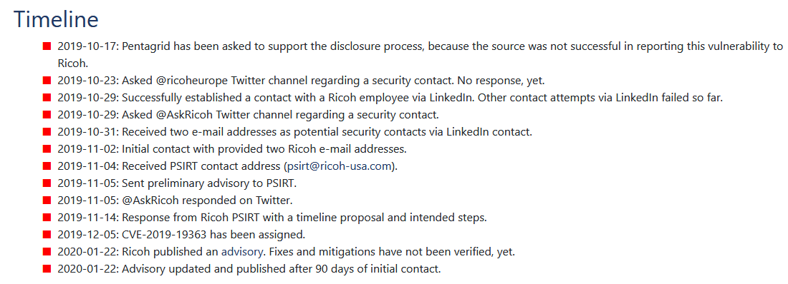
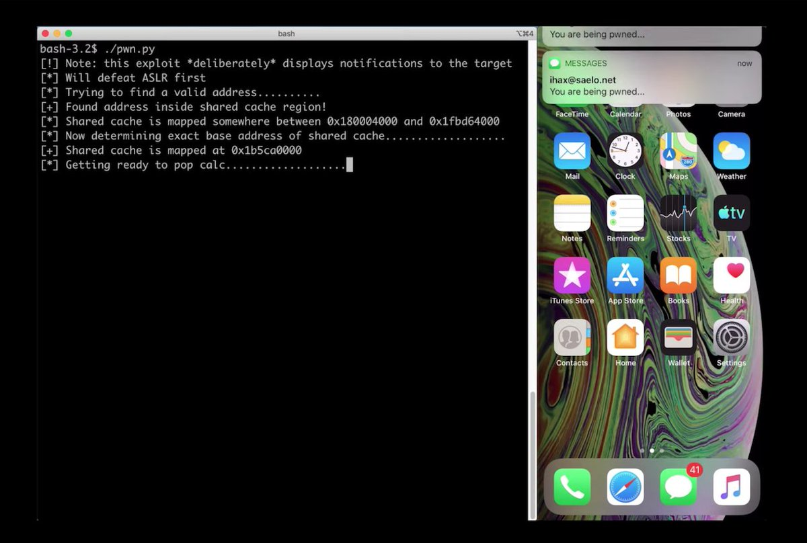
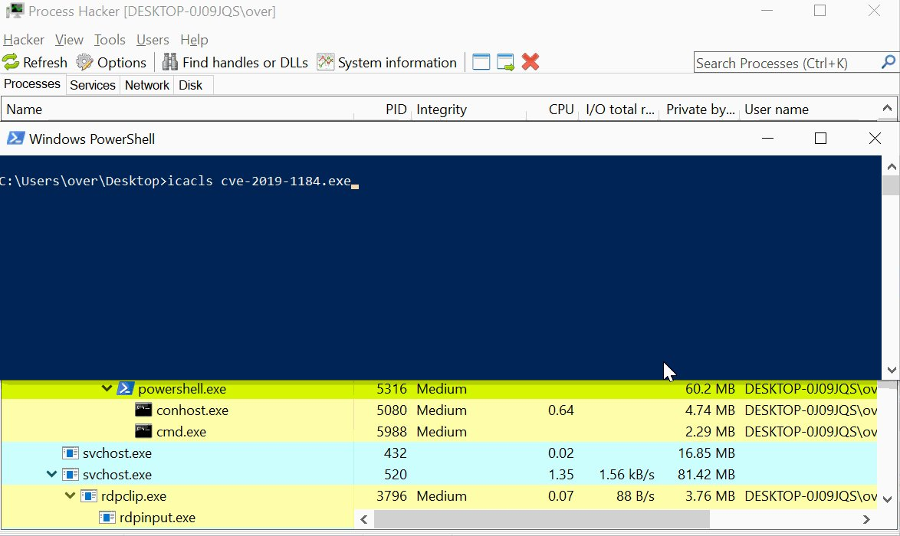

# wugeej
**https://twitter.com/wugeej/status/1222786139636944897 _at Thu Jan 30 07:38:28 +0000 2020_**
<blockquote>
CVE-2020-0674: Internet Explorer Remote Code Execution Vulnerability Exploited in the Wild

Zero-day remote code execution vulnerability

Triggers
0. JScript
1. used in #argument
2. #recursion
...

Proof of Concept Demo Video https://t.co/K3PRkb753s
</blockquote>

<table><tr>
<td></td>
</tr></table>
<table><tr>
<td>Quotes: <code>6</code></td>
<td>Replies: <code>8</code></td>
<td>Retweets: <code>144</code></td>
<td>Favorites: <code>297</code></td>
</tr></table>

---

# window
**https://twitter.com/window/status/1222345450629423104 _at Wed Jan 29 02:27:20 +0000 2020_**
<blockquote>
“To overcome these limitations, we drew inspiration from the Morris worm... which exploited the DEBUG vulnerability in Sendmail by executing the body of a mail as a
shell script”

oss-security - LPE and RCE in OpenSMTPD (CVE-2020-7247)
 https://t.co/cQLRvg7h8P
</blockquote>

* https://www.openwall.com/lists/oss-security/2020/01/28/3

<table><tr>
<td>Quotes: <code>9</code></td>
<td>Replies: <code>6</code></td>
<td>Retweets: <code>47</code></td>
<td>Favorites: <code>94</code></td>
</tr></table>

---

# RiftWhiteHat
**https://twitter.com/RiftWhiteHat/status/1222302147515162625 _at Tue Jan 28 23:35:15 +0000 2020_**
<blockquote>
Here's my PoC for CVE-2020-7980, a script to gain RCE (root level) to some Satellite controllers.

https://t.co/LBH3u9Jzix
</blockquote>

* https://github.com/Xh4H/Satellian-CVE-2020-7980

<table><tr>
<td>Quotes: <code>1</code></td>
<td>Replies: <code>1</code></td>
<td>Retweets: <code>50</code></td>
<td>Favorites: <code>162</code></td>
</tr></table>

---

# pozdnychev
**https://twitter.com/pozdnychev/status/1222297493339361281 _at Tue Jan 28 23:16:46 +0000 2020_**
<blockquote>
Qualys Security Advisory:  LPE and RCE (CVE-2020-7247) in OpenSMTPD, OpenBSD's mail server.  Erroneous logic in smtp_mailaddr() which validates user and domain. More details and PoC at: https://t.co/jjTJaqYgUO

PS:  "Did you ever play tic-tac-toe?"
</blockquote>

* https://www.openwall.com/lists/oss-security/2020/01/28/3

<table><tr>
<td>Quotes: <code>5</code></td>
<td>Replies: <code>1</code></td>
<td>Retweets: <code>101</code></td>
<td>Favorites: <code>166</code></td>
</tr></table>

---

# layle_ctf
**https://twitter.com/layle_ctf/status/1221514332049113095 _at Sun Jan 26 19:24:46 +0000 2020_**
<blockquote>
Ladies and gentlemen, I present you a working Remote Code Execution (RCE) exploit for the Remote Desktop Gateway (CVE-2020-0609 &amp; CVE-2020-0610). Accidentally followed a few rabbit holes but got it to work! Time to write a blog post ;)

Don't forget to patch! https://t.co/FekupjS6qG
</blockquote>

<table><tr>
<td></td>
</tr></table>
<table><tr>
<td>Quotes: <code>51</code></td>
<td>Replies: <code>50</code></td>
<td>Retweets: <code>1079</code></td>
<td>Favorites: <code>3105</code></td>
</tr></table>

---

# campuscodi
**https://twitter.com/campuscodi/status/1220944637138882562 _at Sat Jan 25 05:41:00 +0000 2020_**
<blockquote>
Local Privilege Escalation in many Ricoh Printer Drivers for Windows (CVE-2019-19363)

PoC exploit included

https://t.co/WWRZ2dVPoq https://t.co/y2rmHxeFIe
</blockquote>

* https://www.pentagrid.ch/en/blog/local-privilege-escalation-in-ricoh-printer-drivers-for-windows-cve-2019-19363/

<table><tr>
<td></td>
</tr></table>
<table><tr>
<td>Quotes: <code>0</code></td>
<td>Replies: <code>0</code></td>
<td>Retweets: <code>19</code></td>
<td>Favorites: <code>31</code></td>
</tr></table>

---

# layle_ctf
**https://twitter.com/layle_ctf/status/1220798026530414593 _at Fri Jan 24 19:58:25 +0000 2020_**
<blockquote>
It's time to drop my DoS PoC for CVE-2020-0609 &amp; CVE-2020-0610! Gonna make the scanner soon and then hopefully create a full RCE if possible :) Thanks to @ollypwn for the assistance!
https://t.co/MpDPLrmTZP
</blockquote>

* https://github.com/ioncodes/BlueGate

<table><tr>
<td>Quotes: <code>1</code></td>
<td>Replies: <code>1</code></td>
<td>Retweets: <code>33</code></td>
<td>Favorites: <code>83</code></td>
</tr></table>

---

# binitamshah
**https://twitter.com/binitamshah/status/1220630795825451008 _at Fri Jan 24 08:53:54 +0000 2020_**
<blockquote>
Local Privilege Escalation in many Ricoh Printer Drivers for Windows (CVE-2019-19363) + Exploit : https://t.co/G2zJDcaJ00 cc @pentagridsec
</blockquote>

* https://www.pentagrid.ch/en/blog/local-privilege-escalation-in-ricoh-printer-drivers-for-windows-cve-2019-19363/

<table><tr>
<td>Quotes: <code>1</code></td>
<td>Replies: <code>0</code></td>
<td>Retweets: <code>20</code></td>
<td>Favorites: <code>44</code></td>
</tr></table>

---

# Dinosn
**https://twitter.com/Dinosn/status/1220604304370872332 _at Fri Jan 24 07:08:38 +0000 2020_**
<blockquote>
PoC (DoS) for CVE-2020-0609 &amp; CVE-2020-0610 - RD Gateway RCE
https://t.co/O2a1AtcwSg
</blockquote>

* https://github.com/ollypwn/BlueGate

<table><tr>
<td>Quotes: <code>1</code></td>
<td>Replies: <code>0</code></td>
<td>Retweets: <code>32</code></td>
<td>Favorites: <code>50</code></td>
</tr></table>

---

# LukasStefanko
**https://twitter.com/LukasStefanko/status/1220255786087190528 _at Thu Jan 23 08:03:45 +0000 2020_**
<blockquote>
Forensic analysis of Jeff Bezos hacked #iPhoneX

iPhone was exploited via #WhatsApp vulnerability that probably triggered RCE.
Similar exploit was fixed in October 2019- CVE-2019-11932(double-free vulnerability) but instead of video it was triggered by GIF
https://t.co/WE9BLPeBly https://t.co/51IKnKiA9Q
</blockquote>

* https://www.documentcloud.org/documents/6668313-FTI-Report-into-Jeff-Bezos-Phone-Hack.html

<table><tr>
<td></td>
</tr></table>
<table><tr>
<td>Quotes: <code>2</code></td>
<td>Replies: <code>4</code></td>
<td>Retweets: <code>46</code></td>
<td>Favorites: <code>72</code></td>
</tr></table>

---

# Mateusz_Jozef
**https://twitter.com/Mateusz_Jozef/status/1218990646108860417 _at Sun Jan 19 20:16:32 +0000 2020_**
<blockquote>
CVE-2020-0674: Microsoft Internet Explorer 0day - Scripting Engine Memory Corruption Vulnerability being exploited in the wild https://t.co/lK5gTFxb8R
</blockquote>

* https://www.reddit.com/r/netsec/comments/equ1s6/cve20200674_microsoft_internet_explorer_0day/

<table><tr>
<td>Quotes: <code>1</code></td>
<td>Replies: <code>0</code></td>
<td>Retweets: <code>36</code></td>
<td>Favorites: <code>53</code></td>
</tr></table>

---

# AttackDetection
**https://twitter.com/AttackDetection/status/1218577379515387907 _at Sat Jan 18 16:54:22 +0000 2020_**
<blockquote>
Scared by latest CVE-2020-0601 certificate spoofing vulnerability? We did a #suricata detection rule for you. It covers all known exploitations of TLS certificates and executable signing. Find it here: https://t.co/0J5HvEE6Vl
#ChainOfFools #CurveBall
</blockquote>

* https://github.com/ptresearch/AttackDetection/blob/master/CVE-2020-0601/cve-2020-0601.rules

<table><tr>
<td>Quotes: <code>4</code></td>
<td>Replies: <code>0</code></td>
<td>Retweets: <code>33</code></td>
<td>Favorites: <code>59</code></td>
</tr></table>

---

# blackorbird
**https://twitter.com/blackorbird/status/1218529058218106880 _at Sat Jan 18 13:42:21 +0000 2020_**
<blockquote>
#darkhotel  #0day #exploit
CVE-2020-0674 
Microsoft Guidance on Scripting Engine Memory Corruption Vulnerability
A remote code execution vulnerability exists in the way that the scripting engine handles objects in memory in Internet Explorer. 
https://t.co/1mbqh1IMDz
</blockquote>

* https://portal.msrc.microsoft.com/en-us/security-guidance/advisory/ADV200001

<table><tr>
<td>Quotes: <code>2</code></td>
<td>Replies: <code>0</code></td>
<td>Retweets: <code>34</code></td>
<td>Favorites: <code>67</code></td>
</tr></table>

---

# jorgeorchilles
**https://twitter.com/jorgeorchilles/status/1218376627815616512 _at Sat Jan 18 03:36:39 +0000 2020_**
<blockquote>
New Internet Explorer 0day and advisory out. Exploited in wild. No patch from Microsoft. Mitigation is to not use IE. CVE-2020-0674

https://t.co/Tk8XHBBLnq
</blockquote>

* https://portal.msrc.microsoft.com/en-us/security-guidance/advisory/ADV200001

<table><tr>
<td>Quotes: <code>6</code></td>
<td>Replies: <code>3</code></td>
<td>Retweets: <code>95</code></td>
<td>Favorites: <code>86</code></td>
</tr></table>

---

# MalwareTechBlog
**https://twitter.com/MalwareTechBlog/status/1218324513999319042 _at Sat Jan 18 00:09:34 +0000 2020_**
<blockquote>
My analysis of Remote Desktop Gateway RCE bugs CVE-2020-0609 &amp; CVE-2020-0610 is up.
</blockquote>

<table><tr>
<td>Quotes: <code>3</code></td>
<td>Replies: <code>9</code></td>
<td>Retweets: <code>159</code></td>
<td>Favorites: <code>442</code></td>
</tr></table>

---

# kryptoslogic
**https://twitter.com/kryptoslogic/status/1218323686761037824 _at Sat Jan 18 00:06:16 +0000 2020_**
<blockquote>
RDP to RCE: When Fragmentation Goes Wrong

AKA: What we know about CVE-2020-0609 and CVE-2020-0610.

https://t.co/NW2mKOf5Hw
</blockquote>

* https://www.kryptoslogic.com/blog/2020/01/rdp-to-rce-when-fragmentation-goes-wrong/

<table><tr>
<td>Quotes: <code>7</code></td>
<td>Replies: <code>4</code></td>
<td>Retweets: <code>284</code></td>
<td>Favorites: <code>570</code></td>
</tr></table>

---

# pentest_swissky
**https://twitter.com/pentest_swissky/status/1217703969344184320 _at Thu Jan 16 07:03:44 +0000 2020_**
<blockquote>
CVE-2020-0601 - PoC
https://t.co/dRgVE61szf
</blockquote>

* https://github.com/ollypwn/cve-2020-0601

<table><tr>
<td>Quotes: <code>7</code></td>
<td>Replies: <code>1</code></td>
<td>Retweets: <code>98</code></td>
<td>Favorites: <code>221</code></td>
</tr></table>

---

# AnomalRoil
**https://twitter.com/AnomalRoil/status/1217607562511691778 _at Thu Jan 16 00:40:39 +0000 2020_**
<blockquote>
Okay, we have confirmed @KudelskiSec  with my colleague @Pelissier_S  that CVE-2020-0601 (Windows CryptoAPI Spoofing Vulnerability), aka "Chain of Fools", allows for MITM attacks and some certificate spoofing. We have a working POC and a blog post will come soonish :)
</blockquote>

<table><tr>
<td>Quotes: <code>1</code></td>
<td>Replies: <code>2</code></td>
<td>Retweets: <code>18</code></td>
<td>Favorites: <code>50</code></td>
</tr></table>

---

# 0xdea
**https://twitter.com/0xdea/status/1217415111603826689 _at Wed Jan 15 11:55:55 +0000 2020_**
<blockquote>
CVE-2020-2696 – Local privilege escalation via CDE dtsession

Writeup:
https://t.co/8VF2GQb3OF

Advisory:
https://t.co/wn5bdrw6wG

Exploit:
https://t.co/19JbJ1yOYL
</blockquote>

* https://techblog.mediaservice.net/2020/01/local-privilege-escalation-via-cde-dtsession/
* https://github.com/0xdea/advisories/blob/master/2020-02-cde-dtsession.txt
* https://github.com/0xdea/exploits/blob/master/solaris/raptor_dtsession_ipa.c

<table><tr>
<td>Quotes: <code>2</code></td>
<td>Replies: <code>1</code></td>
<td>Retweets: <code>41</code></td>
<td>Favorites: <code>102</code></td>
</tr></table>

---

# wdormann
**https://twitter.com/wdormann/status/1217147955280519169 _at Tue Jan 14 18:14:20 +0000 2020_**
<blockquote>
Now that it's all public:
1) CVE-2020-0601 - Windows doesn't properly validate X.509 certificate chains. https://t.co/gaUWl7J15W
2) CVE-2020-0609, CVE-2020-0610 - Windows Remote Desktop Gateway (not to be confused with RDP proper) unauthenticated RCE.
https://t.co/nGHTcCeUWV
</blockquote>

* https://www.kb.cert.org/vuls/id/849224/
* https://www.kb.cert.org/vuls/id/491944/

<table><tr>
<td>Quotes: <code>14</code></td>
<td>Replies: <code>7</code></td>
<td>Retweets: <code>166</code></td>
<td>Favorites: <code>175</code></td>
</tr></table>

---

# bad_packets
**https://twitter.com/bad_packets/status/1216635462011351040 _at Mon Jan 13 08:17:52 +0000 2020_**
<blockquote>
Servers vulnerable to CVE-2019-19781 by country:
🇺🇸 United States: 9,880
🇩🇪 Germany: 2,510
🇬🇧 United Kingdom: 2,028
🇨🇭 Switzerland: 1,094
🇦🇺 Australia: 1,076
🇳🇱 Netherlands: 713
🇨🇦 Canada: 682
🇫🇷 France: 591
🇮🇹 Italy: 568
🇳🇴 Norway: 446
All others: 5,533
https://t.co/tm7udJUzH1
</blockquote>

* https://docs.google.com/spreadsheets/d/1sJ8-cVyG4vFYq6-MGdapM1eAhUkoXIKlsmuzKdfD9Ys/edit?usp=sharing

<table><tr>
<td>Quotes: <code>36</code></td>
<td>Replies: <code>3</code></td>
<td>Retweets: <code>149</code></td>
<td>Favorites: <code>177</code></td>
</tr></table>

---

# bad_packets
**https://twitter.com/bad_packets/status/1215786199383597056 _at Sat Jan 11 00:03:12 +0000 2020_**
<blockquote>
Remote code execution proof-of-concept for Citrix ADC/Gateway vulnerability CVE-2019-19781 has been posted on GitHub: https://t.co/YsDS0EI4M1

Affected organizations are advised to apply the mitigation provided by Citrix ASAP as no patch exists yet. https://t.co/c9f22TfP2K
</blockquote>

* https://github.com/projectzeroindia/CVE-2019-19781
* https://support.citrix.com/article/CTX267679

<table><tr>
<td>Quotes: <code>3</code></td>
<td>Replies: <code>1</code></td>
<td>Retweets: <code>34</code></td>
<td>Favorites: <code>45</code></td>
</tr></table>

---

# mpgn_x64
**https://twitter.com/mpgn_x64/status/1215650357310820353 _at Fri Jan 10 15:03:25 +0000 2020_**
<blockquote>
CVE-2019-19781 in three steps :

1⃣ No account needed
2⃣ Unrestricted File Upload
3⃣ Template Injection through Template Toolkit 

Result into a Remote Code Execution without authentication ❗️

🛂 Follow Citrix Mitigation to avoid exploitation https://t.co/tYge6LymSl
</blockquote>

* https://support.citrix.com/article/CTX267679

<table><tr>
<td>Quotes: <code>3</code></td>
<td>Replies: <code>3</code></td>
<td>Retweets: <code>55</code></td>
<td>Favorites: <code>89</code></td>
</tr></table>

---

# mobilesecurity_
**https://twitter.com/mobilesecurity_/status/1215362064543375360 _at Thu Jan 09 19:57:51 +0000 2020_**
<blockquote>
Remote iPhone Exploitation 📱🔥
Part 1: Poking Memory via iMessage and CVE-2019-8641
https://t.co/GP6p9EHiZ1
Part 2: a Remote ASLR Bypass
https://t.co/VvJHLgqIIc
Part 3: Gaining Code Execution
https://t.co/WejOZvI6rP
#MobileSecurity #iOSsecurity by @5aelo and @ProjectZeroBugs https://t.co/VxdXHuDxb1
</blockquote>

* https://googleprojectzero.blogspot.com/2020/01/remote-iphone-exploitation-part-1.html
* https://googleprojectzero.blogspot.com/2020/01/remote-iphone-exploitation-part-2.html
* https://googleprojectzero.blogspot.com/2020/01/remote-iphone-exploitation-part-3.html

<table><tr>
<td></td>
</tr></table>
<table><tr>
<td>Quotes: <code>3</code></td>
<td>Replies: <code>2</code></td>
<td>Retweets: <code>199</code></td>
<td>Favorites: <code>390</code></td>
</tr></table>

---

# bluefrostsec
**https://twitter.com/bluefrostsec/status/1214571356785917953 _at Tue Jan 07 15:35:51 +0000 2020_**
<blockquote>
Full analysis and exploit for Windows kernel ws2ifsl use-after-free (CVE-2019-1215) by our researcher @flxflndy https://t.co/w2IvTGNSPd
</blockquote>

* https://labs.bluefrostsecurity.de/blog/2020/01/07/cve-2019-1215-analysis-of-a-use-after-free-in-ws2ifsl/

<table><tr>
<td>Quotes: <code>9</code></td>
<td>Replies: <code>1</code></td>
<td>Retweets: <code>187</code></td>
<td>Favorites: <code>323</code></td>
</tr></table>

---

# 0vercl0k
**https://twitter.com/0vercl0k/status/1213157383884570624 _at Fri Jan 03 17:57:14 +0000 2020_**
<blockquote>
Here is an exploit for LPE CVE-2019-1184 in case anybody else is interested in this cool bug: https://t.co/PmAFAj1HV0 https://t.co/Osr4Rk2V8z
</blockquote>

* https://github.com/0vercl0k/stuffz/blob/master/CVE-2019-1184/CVE-2019-1184.cc

<table><tr>
<td></td>
</tr></table>
<table><tr>
<td>Quotes: <code>5</code></td>
<td>Replies: <code>3</code></td>
<td>Retweets: <code>229</code></td>
<td>Favorites: <code>444</code></td>
</tr></table>

---

# chybeta
**https://twitter.com/chybeta/status/1212730812325449728 _at Thu Jan 02 13:42:11 +0000 2020_**
<blockquote>
CVE-2019-10758 post-auth Remote Code Execution in mongo-express &lt; 0.54.0 via endpoints that uses the `toBSON` method

however there are lots of no-auth mongo-express ...

shodan: https://t.co/9J4qhXL1Im

poc: https://t.co/mtChbxVDrw https://t.co/zp7EK2cmu3
</blockquote>

* https://www.shodan.io/search?query=Mongo+Express
* https://github.com/masahiro331/CVE-2019-10758

<table><tr>
<td></td>
</tr></table>
<table><tr>
<td>Quotes: <code>4</code></td>
<td>Replies: <code>2</code></td>
<td>Retweets: <code>191</code></td>
<td>Favorites: <code>374</code></td>
</tr></table>

---

# wjllz1
**https://twitter.com/wjllz1/status/1212693029234106379 _at Thu Jan 02 11:12:03 +0000 2020_**
<blockquote>
Public the exploit code for cve-2019-8038 and cve-2019-8039. Two UAF bug in Adobe reader DC. It could pop a calc after disable ASLR.  More details will be described after my final exam....  https://t.co/vyrxOhEEt8
</blockquote>

* https://github.com/redogwu/pdf/tree/master/adobe

<table><tr>
<td>Quotes: <code>4</code></td>
<td>Replies: <code>4</code></td>
<td>Retweets: <code>153</code></td>
<td>Favorites: <code>292</code></td>
</tr></table>

---

