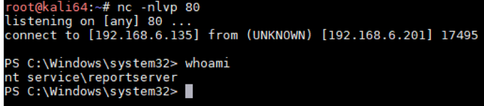
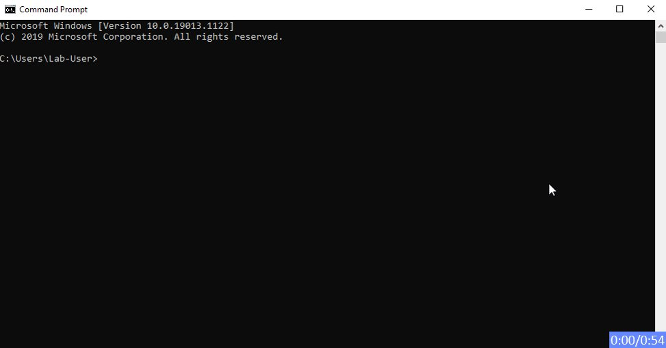
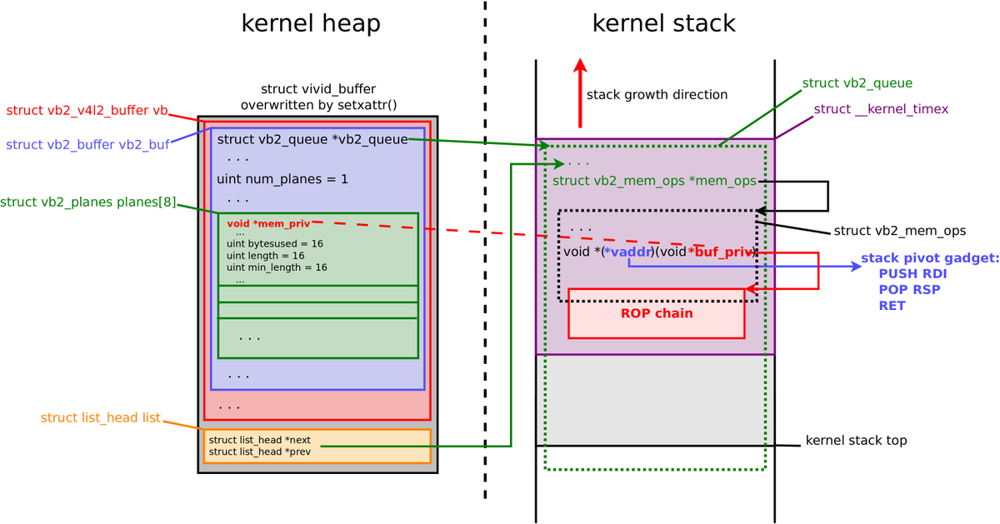

# NVISO_Labs
**https://twitter.com/NVISO_Labs/status/1232997983655993346 _at Thu Feb 27 11:56:41 +0000 2020_**
<blockquote>
This morning, PoC code to abuse CVE-2020-0688 (Microsoft Exchange Validation Key Remote Code Execution Vulnerability) was released. In case you haven't done so, it's time to patch, patch, patch! https://t.co/DvqHexydpq

Our sigma rule to detect this: https://t.co/fXalEL0F6Z
</blockquote>

* https://portal.msrc.microsoft.com/en-US/security-guidance/advisory/CVE-2020-0688
* https://github.com/NVISO-BE/sigma-public/blob/web_exchange_cve_2020_0688_exploit/rules/web/web_exchange_cve_2020_0688_exploit.yml

<table><tr>
<td>Quotes: <code>6</code></td>
<td>Replies: <code>2</code></td>
<td>Retweets: <code>139</code></td>
<td>Favorites: <code>225</code></td>
</tr></table>

---

# GossiTheDog
**https://twitter.com/GossiTheDog/status/1232430811439403014 _at Tue Feb 25 22:22:57 +0000 2020_**
<blockquote>
That was quick, since 2 hours ago seeing likely mass scanning for CVE-2020-0688 (Microsoft Exchange 2007+ RCE vulnerability). https://t.co/Kp3zOi5AOA
</blockquote>

<table><tr>
<td></td>
</tr></table>
<table><tr>
<td>Quotes: <code>2</code></td>
<td>Replies: <code>2</code></td>
<td>Retweets: <code>17</code></td>
<td>Favorites: <code>45</code></td>
</tr></table>

---

# anttitikkanen
**https://twitter.com/anttitikkanen/status/1232070933063577600 _at Mon Feb 24 22:32:55 +0000 2020_**
<blockquote>
Latest Chrome update patches CVE-2020-6418, 0day found in the wild by @_clem1 : https://t.co/H2j5PXO8gV https://t.co/K2GoOJCPgf
</blockquote>

* https://chromereleases.googleblog.com/2020/02/stable-channel-update-for-desktop_24.html?m=1

<table><tr>
<td></td>
</tr></table>
<table><tr>
<td>Quotes: <code>6</code></td>
<td>Replies: <code>6</code></td>
<td>Retweets: <code>75</code></td>
<td>Favorites: <code>155</code></td>
</tr></table>

---

# _argp
**https://twitter.com/_argp/status/1230018688725716993 _at Wed Feb 19 06:38:02 +0000 2020_**
<blockquote>
'The bug was "fixed" by Apple in 2012 as CVE-2012-3727 but fixed the bug in the wrong function (dns4 one) so this is still an 0day at the moment.'

;)

https://t.co/f0eHDQDoDr
</blockquote>

* https://github.com/JakeBlair420/Spice

<table><tr>
<td>Quotes: <code>3</code></td>
<td>Replies: <code>2</code></td>
<td>Retweets: <code>80</code></td>
<td>Favorites: <code>259</code></td>
</tr></table>

---

# campuscodi
**https://twitter.com/campuscodi/status/1229818692789309442 _at Tue Feb 18 17:23:19 +0000 2020_**
<blockquote>
PoC published for CVE-2020-0618, which is an RCE in Microsoft's SQL Server Reporting Services (SSRS)

https://t.co/t6bmycdUjX https://t.co/n16cHivDMe
</blockquote>

* https://www.mdsec.co.uk/2020/02/cve-2020-0618-rce-in-sql-server-reporting-services-ssrs/

<table><tr>
<td></td>
</tr></table>
<table><tr>
<td>Quotes: <code>7</code></td>
<td>Replies: <code>4</code></td>
<td>Retweets: <code>142</code></td>
<td>Favorites: <code>292</code></td>
</tr></table>

---

# wugeej
**https://twitter.com/wugeej/status/1229671907219296256 _at Tue Feb 18 07:40:03 +0000 2020_**
<blockquote>
[PoC] CVE-2020-0618 Microsoft SQL Server Reporting Services RCE Vulnerability

POST /ReportServer/pages/ReportViewer.aspx HTTP/1.1
Host: target
...
...
NavigationCorrector$PageState=NeedsCorrection&amp;NavigationCorrector$ViewState=[PayloadHere]&amp;__VIEWSTATE=

https://t.co/zDu2m9gJnh https://t.co/FeCBMcnaPv
</blockquote>

* https://github.com/euphrat1ca/CVE-2020-0618

<table><tr>
<td></td>
</tr></table>
<table><tr>
<td>Quotes: <code>8</code></td>
<td>Replies: <code>4</code></td>
<td>Retweets: <code>179</code></td>
<td>Favorites: <code>335</code></td>
</tr></table>

---

# campuscodi
**https://twitter.com/campuscodi/status/1229039979608674304 _at Sun Feb 16 13:49:00 +0000 2020_**
<blockquote>
PoC + write-up on CVE-2020-0668, a privilege escalation vulnerability in Windows Service Tracing

Bug was patched this week

https://t.co/nJRsNUBwmP https://t.co/z6y6f3P5PI
</blockquote>

* https://itm4n.github.io/cve-2020-0668-windows-service-tracing-eop/

<table><tr>
<td></td>
</tr></table>
<table><tr>
<td>Quotes: <code>2</code></td>
<td>Replies: <code>0</code></td>
<td>Retweets: <code>68</code></td>
<td>Favorites: <code>155</code></td>
</tr></table>

---

# a13xp0p0v
**https://twitter.com/a13xp0p0v/status/1228684638123626498 _at Sat Feb 15 14:17:00 +0000 2020_**
<blockquote>
My write-up covering @offensive_con talk!

CVE-2019-18683: Exploiting a Linux kernel vulnerability in the V4L2 subsystem
https://t.co/rXTaqzoAAZ

@offensive_con slides: https://t.co/oKyNC3dTER

PoC exploit demo video: https://t.co/tIaurXLAOF

Enjoy! https://t.co/W1ZkceXOr4
</blockquote>

* https://a13xp0p0v.github.io/2020/02/15/CVE-2019-18683.html
* https://a13xp0p0v.github.io/img/CVE-2019-18683.pdf
* https://www.youtube.com/watch?v=mb4YHyLy0Zc

<table><tr>
<td></td>
<td></td>
</tr></table>
<table><tr>
<td>Quotes: <code>4</code></td>
<td>Replies: <code>2</code></td>
<td>Retweets: <code>229</code></td>
<td>Favorites: <code>474</code></td>
</tr></table>

---

# irsdl
**https://twitter.com/irsdl/status/1227320193745068032 _at Tue Feb 11 19:55:11 +0000 2020_**
<blockquote>
CVE-2020-0618: Microsoft SQL Server Reporting Services Remote Code Execution Vulnerability - if you use SSRS patch now not even tomorrow! It is a simple unauth rce!
</blockquote>

<table><tr>
<td>Quotes: <code>3</code></td>
<td>Replies: <code>8</code></td>
<td>Retweets: <code>64</code></td>
<td>Favorites: <code>186</code></td>
</tr></table>

---

# _Icewall
**https://twitter.com/_Icewall/status/1227307797798432775 _at Tue Feb 11 19:05:55 +0000 2020_**
<blockquote>
My two freshly patched MS vulns : 
CVE-2020-0759 - Microsoft Office Excel Ordinal43 code execution vulnerability

https://t.co/0XH6Ec5Mlw

CVE-2020-0738 - Microsoft Media Foundation IMFASFSplitter::Initialize Code Execution Vuln.

https://t.co/Vr78b7OyAX
</blockquote>

* https://talosintelligence.com/vulnerability_reports/TALOS-2019-0968
* https://talosintelligence.com/vulnerability_reports/TALOS-2019-0946

<table><tr>
<td>Quotes: <code>0</code></td>
<td>Replies: <code>4</code></td>
<td>Retweets: <code>76</code></td>
<td>Favorites: <code>169</code></td>
</tr></table>

---

# RealTryHackMe
**https://twitter.com/RealTryHackMe/status/1226821142385741829 _at Mon Feb 10 10:52:08 +0000 2020_**
<blockquote>
Understand a recent Linux local privilege escalation vulnerability (CVE-2019-14287) and exploit it yourself with your own FREE deployable vulnerable machine!

https://t.co/jacpdF2hyf

#linux #infosecurity #hacking #learn #handson https://t.co/mHct6sSNqX
</blockquote>

* https://tryhackme.com/room/sudovulnsbypass

<table><tr>
<td></td>
</tr></table>
<table><tr>
<td>Quotes: <code>1</code></td>
<td>Replies: <code>0</code></td>
<td>Retweets: <code>21</code></td>
<td>Favorites: <code>44</code></td>
</tr></table>

---

# _odisseus
**https://twitter.com/_odisseus/status/1225322575561216000 _at Thu Feb 06 07:37:22 +0000 2020_**
<blockquote>
Cisco Discovery Protocol (CDP) enabled devices are vulnerable to Denial-of-Service (DoS) and Remote Code Execution (RCE) 👏👏👏

CVE-2020-3110
CVE-2020-3111
CVE-2020-3118
CVE-2020-3119
CVE-2020-3120

Note: https://t.co/1PUb2gT1KE

Hacking Video: https://t.co/NMqbjoWU2y https://t.co/vxHxa6jlMH
</blockquote>

* https://kb.cert.org/vuls/id/261385/
* https://www.youtube.com/watch?v=nYtDJlzU-ao&feature=youtu.be

<table><tr>
<td></td>
</tr></table>
<table><tr>
<td>Quotes: <code>2</code></td>
<td>Replies: <code>1</code></td>
<td>Retweets: <code>32</code></td>
<td>Favorites: <code>33</code></td>
</tr></table>

---

# wugeej
**https://twitter.com/wugeej/status/1225293346093977600 _at Thu Feb 06 05:41:13 +0000 2020_**
<blockquote>
CVE-2019-1388 Microsoft Windows UAC Privilege Escalation

Exploit Tool : HHUPD.exe (https://t.co/24FhvqEmux)

Ref : https://t.co/p5Aa7vFvn8 https://t.co/cYAyqxSj9k
</blockquote>

* https://github.com/sv3nbeast/CVE-2019-1388
* https://github.com/Lz1y/imggo

<table><tr>
<td></td>
</tr></table>
<table><tr>
<td>Quotes: <code>1</code></td>
<td>Replies: <code>3</code></td>
<td>Retweets: <code>66</code></td>
<td>Favorites: <code>189</code></td>
</tr></table>

---

# _ringzer0
**https://twitter.com/_ringzer0/status/1224325925606699010 _at Mon Feb 03 13:37:02 +0000 2020_**
<blockquote>
Full writeup and exploit of Windows kernel ws2ifsl use-after-free (CVE-2019-1215) via @bluefrostsec and @flxflndy

https://t.co/bC2O3rmNaV https://t.co/XvilzbqrOp
</blockquote>

* https://labs.bluefrostsecurity.de/blog/2020/01/07/cve-2019-1215-analysis-of-a-use-after-free-in-ws2ifsl/

<table><tr>
<td></td>
</tr></table>
<table><tr>
<td>Quotes: <code>1</code></td>
<td>Replies: <code>1</code></td>
<td>Retweets: <code>62</code></td>
<td>Favorites: <code>122</code></td>
</tr></table>

---

