# _r_netsec
**https://twitter.com/_r_netsec/status/1245130787134947328 _at 2020-03-31 23:28:07_**
<blockquote>
Exploiting SMBGhost (CVE-2020-0796) for a Local Privilege Escalation: Writeup + POC https://t.co/KZ5GGdSP0s
</blockquote>

* https://blog.zecops.com/vulnerabilities/exploiting-smbghost-cve-2020-0796-for-a-local-privilege-escalation-writeup-and-poc/

<table><tr>
<td>Quotes: <code>2</code></td>
<td>Replies: <code>0</code></td>
<td>Retweets: <code>39</code></td>
<td>Favorites: <code>70</code></td>
</tr></table>

---

# ZecOps
**https://twitter.com/ZecOps/status/1245113954906468352 _at 2020-03-31 22:21:14_**
<blockquote>
Exploiting #SMBGhost (CVE-2020-0796) for a Local Privilege Escalation: Writeup + POC via @ZecOps Research Blog https://t.co/49fTuHwqPC
</blockquote>

* https://blog.zecops.com/vulnerabilities/exploiting-smbghost-cve-2020-0796-for-a-local-privilege-escalation-writeup-and-poc/

<table><tr>
<td>Quotes: <code>4</code></td>
<td>Replies: <code>2</code></td>
<td>Retweets: <code>96</code></td>
<td>Favorites: <code>167</code></td>
</tr></table>

---

# Din3zh
**https://twitter.com/Din3zh/status/1245087844282089473 _at 2020-03-31 20:37:29_**
<blockquote>
Exploiting CVE-2020-0041 -Escaping the Chrome Sandbox + privilege escalation using Binder exploit - https://t.co/n9w1oWcO05 and https://t.co/gEFpZ9G2Q3
</blockquote>

* https://labs.bluefrostsecurity.de/blog/2020/03/31/cve-2020-0041-part-1-sandbox-escape/
* https://github.com/bluefrostsecurity/CVE-2020-0041/

<table><tr>
<td>Quotes: <code>1</code></td>
<td>Replies: <code>0</code></td>
<td>Retweets: <code>1</code></td>
<td>Favorites: <code>3</code></td>
</tr></table>

---

# bluefrostsec
**https://twitter.com/bluefrostsec/status/1245050305038954498 _at 2020-03-31 18:08:19_**
<blockquote>
Want to know how to escape the Chrome sandbox exploiting Android's Binder with CVE-2020-0041? Check out our latest post by @esanfelix and @jgrusko 
https://t.co/RRf0cbyruk
</blockquote>

* https://labs.bluefrostsecurity.de/blog/2020/03/31/cve-2020-0041-part-1-sandbox-escape/

<table><tr>
<td>Quotes: <code>1</code></td>
<td>Replies: <code>0</code></td>
<td>Retweets: <code>108</code></td>
<td>Favorites: <code>175</code></td>
</tr></table>

---

# basto_digital
**https://twitter.com/basto_digital/status/1244944774534172672 _at 2020-03-31 11:08:58_**
<blockquote>
PoCs for CVE-2020-0796 (#SMBGhost) have been publicly disclosed allowing local privilege escalation via an SMBv3 #exploit.

GitHub:
https://t.co/QeKWLxqM4f
https://t.co/r83NZXKkJK

This should be fun.

#Windows10 https://t.co/dLtg0LWOfq
</blockquote>

* https://github.com/ZecOps/CVE-2020-0796-POC
* https://github.com/danigargu/CVE-2020-0796

<table><tr>
<td>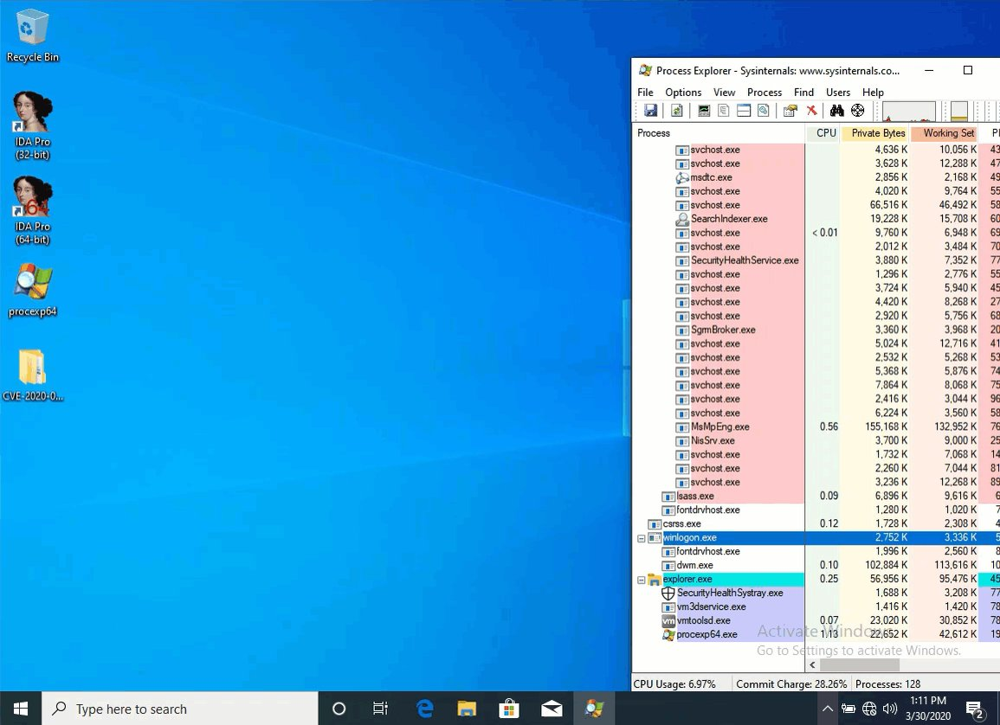</td>
</table></tr>
<table><tr>
<td>Quotes: <code>0</code></td>
<td>Replies: <code>0</code></td>
<td>Retweets: <code>1</code></td>
<td>Favorites: <code>5</code></td>
</tr></table>

---

# hjy79425575
**https://twitter.com/hjy79425575/status/1244934280674865152 _at 2020-03-31 10:27:16_**
<blockquote>
I just read CVE-2020-0796 SMB vulnerability LPE exploit and here is my quick analysis.
https://t.co/xvEip0RYD6 https://t.co/9F3NQNRVXU
</blockquote>

* https://github.com/danigargu/CVE-2020-0796

<table><tr>
<td>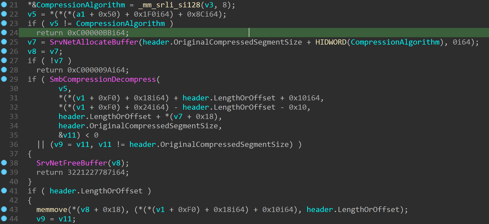</td>
<td></td>
</table></tr>
<table><tr>
<td>Quotes: <code>1</code></td>
<td>Replies: <code>1</code></td>
<td>Retweets: <code>84</code></td>
<td>Favorites: <code>209</code></td>
</tr></table>

---

# cybersecurityZZ
**https://twitter.com/cybersecurityZZ/status/1244848779523735552 _at 2020-03-31 04:47:31_**
<blockquote>
Top story: GitHub - ZecOps/CVE-2020-0796-LPE-POC: CVE-2020-0796 Local Privilege Escalation POC https://t.co/A3Q2j7KG6s, see more https://t.co/Er2nkJzdg0
</blockquote>

* https://github.com/ZecOps/CVE-2020-0796-LPE-POC
* http://tweetedtimes.com/v/8853?s=tnp

<table><tr>
<td>Quotes: <code>0</code></td>
<td>Replies: <code>0</code></td>
<td>Retweets: <code>0</code></td>
<td>Favorites: <code>0</code></td>
</tr></table>

---

# Pentest101MX
**https://twitter.com/Pentest101MX/status/1244832981367369729 _at 2020-03-31 03:44:45_**
<blockquote>
#ITSecurity #ITSec GitHub - danigargu/CVE-2020-0796: CVE-2020-0796 - Windows SMBv3 LPE exploit #SMBGhost https://t.co/PPcdzMoloc, see more https://t.co/rTq0w5CNKm
</blockquote>

* https://github.com/danigargu/CVE-2020-0796
* http://tweetedtimes.com/Pentest101MX?s=tnp

<table><tr>
<td>Quotes: <code>0</code></td>
<td>Replies: <code>0</code></td>
<td>Retweets: <code>4</code></td>
<td>Favorites: <code>0</code></td>
</tr></table>

---

# Doyensec
**https://twitter.com/Doyensec/status/1244704931938009094 _at 2020-03-30 19:15:55_**
<blockquote>
Next.js @zeithq has released a patch for a path traversal vulnerability (CVE-2020-5284) we discovered. Attackers could craft requests to access files in the dist directory (.next), leading to the disclosure of source code and secrets. https://t.co/gdN9K0MgWf #nextjs #reactjs https://t.co/8M7lFYGSHR
</blockquote>

* https://github.com/zeit/next.js/releases/tag/v9.3.2

<table><tr>
<td></td>
</table></tr>
<table><tr>
<td>Quotes: <code>1</code></td>
<td>Replies: <code>0</code></td>
<td>Retweets: <code>5</code></td>
<td>Favorites: <code>27</code></td>
</tr></table>

---

# JohnTroony
**https://twitter.com/JohnTroony/status/1244647552726765569 _at 2020-03-30 15:27:55_**
<blockquote>
A local privilege escalation exploit for the recent SMB v3 Compression vulnerability (CVE-2020-0796) is public at https://t.co/r1xkFGnbDr
</blockquote>

* https://github.com/danigargu/CVE-2020-0796

<table><tr>
<td>Quotes: <code>0</code></td>
<td>Replies: <code>0</code></td>
<td>Retweets: <code>0</code></td>
<td>Favorites: <code>2</code></td>
</tr></table>

---

# AusRealNews
**https://twitter.com/AusRealNews/status/1244645590773960710 _at 2020-03-30 15:20:07_**
<blockquote>
RT TheHackersNews "PoC exploits have been released for achieving local privilege escalation on #Windows10 leveraging recently discovered wormable SMBv3 RCE flaw.

CVE-2020-0796
#SMBGhost

PoCs:
https://t.co/afs7KNwVjB
https://t.co/8fAvUGiYIj

Patch / News:
…
</blockquote>

* https://github.com/danigargu/CVE-2020-0796
* https://github.com/ZecOps/CVE-2020-0796-POC

<table><tr>
<td>Quotes: <code>0</code></td>
<td>Replies: <code>0</code></td>
<td>Retweets: <code>0</code></td>
<td>Favorites: <code>0</code></td>
</tr></table>

---

# UnctusM
**https://twitter.com/UnctusM/status/1244637602864652289 _at 2020-03-30 14:48:23_**
<blockquote>
GitHub - danigargu/CVE-2020-0796: CVE-2020-0796 - Windows SMBv3 LPE exploit #SMBGhost https://t.co/qiPxhDE5dC
</blockquote>

* https://github.com/danigargu/CVE-2020-0796

<table><tr>
<td>Quotes: <code>0</code></td>
<td>Replies: <code>0</code></td>
<td>Retweets: <code>0</code></td>
<td>Favorites: <code>0</code></td>
</tr></table>

---

# jtuyen
**https://twitter.com/jtuyen/status/1244634394339442688 _at 2020-03-30 14:35:38_**
<blockquote>
PoC LPE using SMBv3 ghost bug (CVE-2020-0796) https://t.co/EMeBYMxgqr
</blockquote>

* https://github.com/danigargu/CVE-2020-0796

<table><tr>
<td>Quotes: <code>0</code></td>
<td>Replies: <code>0</code></td>
<td>Retweets: <code>0</code></td>
<td>Favorites: <code>0</code></td>
</tr></table>

---

# TheHackersNews
**https://twitter.com/TheHackersNews/status/1244633317304971266 _at 2020-03-30 14:31:21_**
<blockquote>
PoC exploits have been released for achieving local privilege escalation on #Windows10 leveraging recently discovered wormable SMBv3 RCE flaw.

CVE-2020-0796
#SMBGhost

PoCs:
https://t.co/6UcXlUGZ40
https://t.co/7VjHnuST2S

Patch / News:
https://t.co/LNwM4dSZ0G https://t.co/hz4V8ESPMv
</blockquote>

* https://github.com/danigargu/CVE-2020-0796
* https://github.com/ZecOps/CVE-2020-0796-POC
* https://thehackernews.com/2020/03/patch-wormable-smb-vulnerability.html

<table><tr>
<td></td>
</table></tr>
<table><tr>
<td>Quotes: <code>7</code></td>
<td>Replies: <code>2</code></td>
<td>Retweets: <code>196</code></td>
<td>Favorites: <code>313</code></td>
</tr></table>

---

# _r_netsec
**https://twitter.com/_r_netsec/status/1244617401519329281 _at 2020-03-30 13:28:07_**
<blockquote>
Released a public exploit (Local Privilege Escalation) for SMBv3 bug (CVE-2020-0796) https://t.co/EiAUS3cqGl
</blockquote>

* https://github.com/danigargu/CVE-2020-0796

<table><tr>
<td>Quotes: <code>2</code></td>
<td>Replies: <code>0</code></td>
<td>Retweets: <code>70</code></td>
<td>Favorites: <code>145</code></td>
</tr></table>

---

# VP_helena
**https://twitter.com/VP_helena/status/1244616516886089728 _at 2020-03-30 13:24:36_**
<blockquote>
Windows SMBv3 LPE Exploit (CVE-2020-0796)
https://t.co/e39rlXq7oi
</blockquote>

* https://github.com/danigargu/CVE-2020-0796

<table><tr>
<td>Quotes: <code>0</code></td>
<td>Replies: <code>0</code></td>
<td>Retweets: <code>0</code></td>
<td>Favorites: <code>0</code></td>
</tr></table>

---

# danigargu
**https://twitter.com/danigargu/status/1244608389289848832 _at 2020-03-30 12:52:18_**
<blockquote>
During this quarantine I've been researching with my colleague Manu (@dialluvioso_) the latest SMBv3 bug (CVE-2020-0796), we've achieved a local privilege escalation.
We're releasing the exploit code at https://t.co/lKsy4dBkpp https://t.co/YJuQk7YiUU
</blockquote>

* https://github.com/danigargu/CVE-2020-0796

<table><tr>
<td>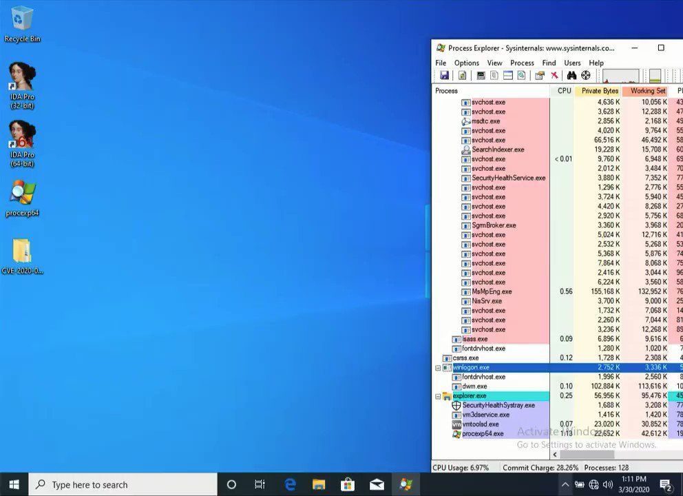</td>
</table></tr>
<table><tr>
<td>Quotes: <code>13</code></td>
<td>Replies: <code>23</code></td>
<td>Retweets: <code>576</code></td>
<td>Favorites: <code>1042</code></td>
</tr></table>

---

# tbbhunter
**https://twitter.com/tbbhunter/status/1244590214984740864 _at 2020-03-30 11:40:05_**
<blockquote>
POC for Unauthenticated Remote code execution via JSONWS (LPS-97029/CVE-2020-7961) in Liferay 7.2.0 CE GA1 https://t.co/yjRvklKUbG #bugbounty #bugbountytip #tbbhunter
</blockquote>

* https://github.com/mzer0one/CVE-2020-7961-POC

<table><tr>
<td>Quotes: <code>0</code></td>
<td>Replies: <code>0</code></td>
<td>Retweets: <code>2</code></td>
<td>Favorites: <code>1</code></td>
</tr></table>

---

# binitamshah
**https://twitter.com/binitamshah/status/1244555520993705985 _at 2020-03-30 09:22:13_**
<blockquote>
Pi-hole Remote Code Execution – Detailed write-up about the vulnerability and exploitation proof of concept (CVE-2020-8816) : https://t.co/9U4re27S46  cc @Nate_Kappa https://t.co/Xsi6NSIdk8
</blockquote>

* https://natedotred.wordpress.com/2020/03/28/cve-2020-8816-pi-hole-remote-code-execution/

<table><tr>
<td>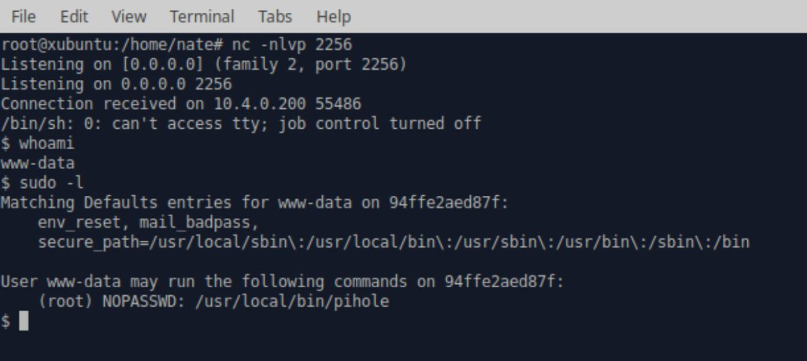</td>
</table></tr>
<table><tr>
<td>Quotes: <code>3</code></td>
<td>Replies: <code>4</code></td>
<td>Retweets: <code>105</code></td>
<td>Favorites: <code>146</code></td>
</tr></table>

---

# ZecOps
**https://twitter.com/ZecOps/status/1244336079022374912 _at 2020-03-29 18:50:14_**
<blockquote>
Did you know that #SMBGhost / CVE-2020-0796 can be used for a Local Privilege Escalation?
We'll post the details + POC in the next few days #PatchNow #ComingSoon
and in the meantime: https://t.co/78gmQU78Ae https://t.co/WHDmaXo1Ar
</blockquote>

* https://blog.zecops.com/vulnerabilities/vulnerability-reproduction-cve-2020-0796-poc/

<table><tr>
<td></td>
</table></tr>
<table><tr>
<td>Quotes: <code>7</code></td>
<td>Replies: <code>5</code></td>
<td>Retweets: <code>336</code></td>
<td>Favorites: <code>690</code></td>
</tr></table>

---

# Anastasis_King
**https://twitter.com/Anastasis_King/status/1244207749082341376 _at 2020-03-29 10:20:18_**
<blockquote>
CVE-2020-9768 : AppleJPEGDriverUserClient mach port use-after-free/type-confusion via race condition 

A PoC for has been published CVE-2020-9768 (arbitrary code execution with system privileges flaw in iPhone/iPad)

https://t.co/qf1wb5wZqV
</blockquote>

* https://gist.github.com/0x36/3c9e77058eac7069616b72f0088d8b6d

<table><tr>
<td>Quotes: <code>0</code></td>
<td>Replies: <code>0</code></td>
<td>Retweets: <code>1</code></td>
<td>Favorites: <code>0</code></td>
</tr></table>

---

# noraj_rawsec
**https://twitter.com/noraj_rawsec/status/1243987995742670849 _at 2020-03-28 19:47:05_**
<blockquote>
I made a better exploit for "Umbraco CMS 7.12.4 - (Authenticated) Remote Code Execution" using arguments and with stdout display.
https://t.co/bwJIRYPyAU
</blockquote>

* https://github.com/noraj/Umbraco-RCE

<table><tr>
<td>Quotes: <code>0</code></td>
<td>Replies: <code>3</code></td>
<td>Retweets: <code>31</code></td>
<td>Favorites: <code>62</code></td>
</tr></table>

---

# _r_netsec
**https://twitter.com/_r_netsec/status/1243911501955530753 _at 2020-03-28 14:43:07_**
<blockquote>
CVE-2020-8816 – Pi-hole Remote Code Execution – Detailed write-up about the vulnerability and exploitation proof of concept https://t.co/lk502TmAad
</blockquote>

* https://natedotred.wordpress.com/2020/03/28/cve-2020-8816-pi-hole-remote-code-execution/

<table><tr>
<td>Quotes: <code>7</code></td>
<td>Replies: <code>5</code></td>
<td>Retweets: <code>118</code></td>
<td>Favorites: <code>210</code></td>
</tr></table>

---

# 80vul
**https://twitter.com/80vul/status/1243819653471715330 _at 2020-03-28 08:38:09_**
<blockquote>
Unauthenticated RCE in Draytek Vigor 2960, 3900 and 300B VigorSwitch (CVE-2020-8515) https://t.co/ewyFai0phZ or https://t.co/dnMwRnh6xi and  attack in the wild report
https://t.co/H408Fku8t0  https://t.co/MbND7hqt6k #ZoomEye Dork https://t.co/a96W50LHPC
</blockquote>

* https://seebug.org/vuldb/ssvid-98146
* https://sku11army.blogspot.com/2020/01/draytek-unauthenticated-rce-in-draytek.html
* https://blog.netlab.360.com/two-zero-days-are-targeting-draytek-broadband-cpe-devices-en/
* https://zoomeye.org/searchResult?q=%22vigor%202960%22%20%20%22vigor%203900%22%20%22vigor%20300B%22%20%22VigorSwitch%22

<table><tr>
<td>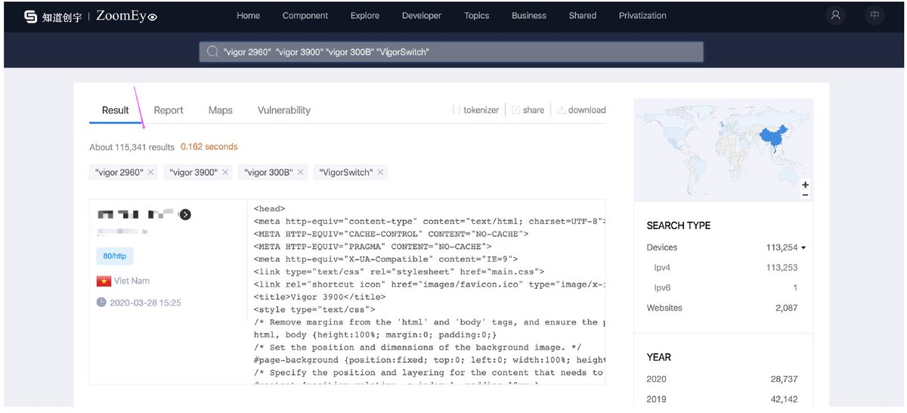</td>
<td>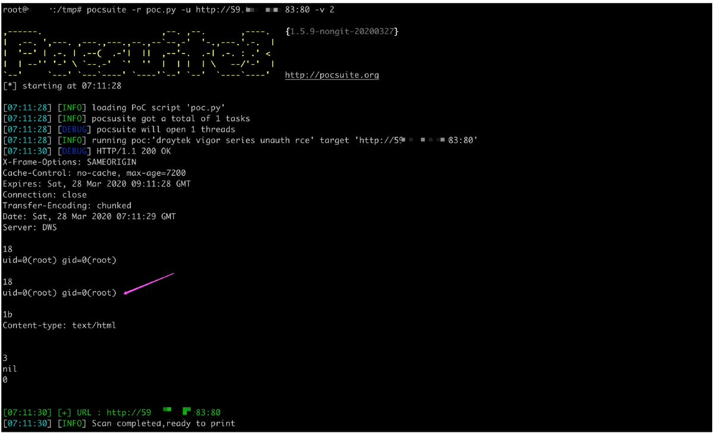</td>
</table></tr>
<table><tr>
<td>Quotes: <code>7</code></td>
<td>Replies: <code>2</code></td>
<td>Retweets: <code>49</code></td>
<td>Favorites: <code>89</code></td>
</tr></table>

---

# thezdi
**https://twitter.com/thezdi/status/1243194544017072128 _at 2020-03-26 15:14:11_**
<blockquote>
The Trend Micro Research Team takes a detailed look at CVE-2020-0729 - an RCE bug in #Windows through LNK files. Read the thorough analysis at https://t.co/y7SPhoPQvM
</blockquote>

* https://bit.ly/3bsf4PZ

<table><tr>
<td>Quotes: <code>5</code></td>
<td>Replies: <code>1</code></td>
<td>Retweets: <code>139</code></td>
<td>Favorites: <code>241</code></td>
</tr></table>

---

# ihack4falafel
**https://twitter.com/ihack4falafel/status/1242835791287590913 _at 2020-03-25 15:28:38_**
<blockquote>
[Blog] Docker Desktop Local Privilege Escalation (CVE-2020-10665) https://t.co/rJqn6f0b6E cc @decoder_it @FuzzySec @tiraniddo
</blockquote>

* https://tinyurl.com/vdzyr7t

<table><tr>
<td>Quotes: <code>3</code></td>
<td>Replies: <code>3</code></td>
<td>Retweets: <code>94</code></td>
<td>Favorites: <code>147</code></td>
</tr></table>

---

# Securelist
**https://twitter.com/Securelist/status/1241348929150730240 _at 2020-03-21 13:00:22_**
<blockquote>
The #Windows #0day exploit, CVE-2019-1458 was used in Operation #WizardOpium attack.

Learn more here ⇒ https://t.co/9WwUOSnp1F https://t.co/veveecXPUB
</blockquote>

* http://kas.pr/hs4a

<table><tr>
<td>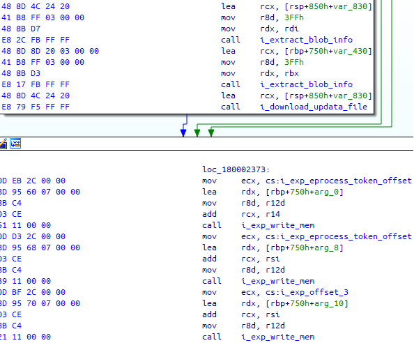</td>
</table></tr>
<table><tr>
<td>Quotes: <code>1</code></td>
<td>Replies: <code>0</code></td>
<td>Retweets: <code>25</code></td>
<td>Favorites: <code>58</code></td>
</tr></table>

---

# buffaloverflow
**https://twitter.com/buffaloverflow/status/1241072602946383873 _at 2020-03-20 18:42:21_**
<blockquote>
Had fun today writing a .NET exploit for @itm4n 's CVE-2020-0787 BITS LPE and UsoLoader technique.

Check out his blog posts and research if you haven't already. They are all brilliant 👏🙏

https://t.co/Of7DLLWZMl
https://t.co/PRJOpXMNWV https://t.co/J2GhIT8xy3
</blockquote>

* https://itm4n.github.io/cve-2020-0787-windows-bits-eop/
* https://itm4n.github.io/usodllloader-part2/

<table><tr>
<td>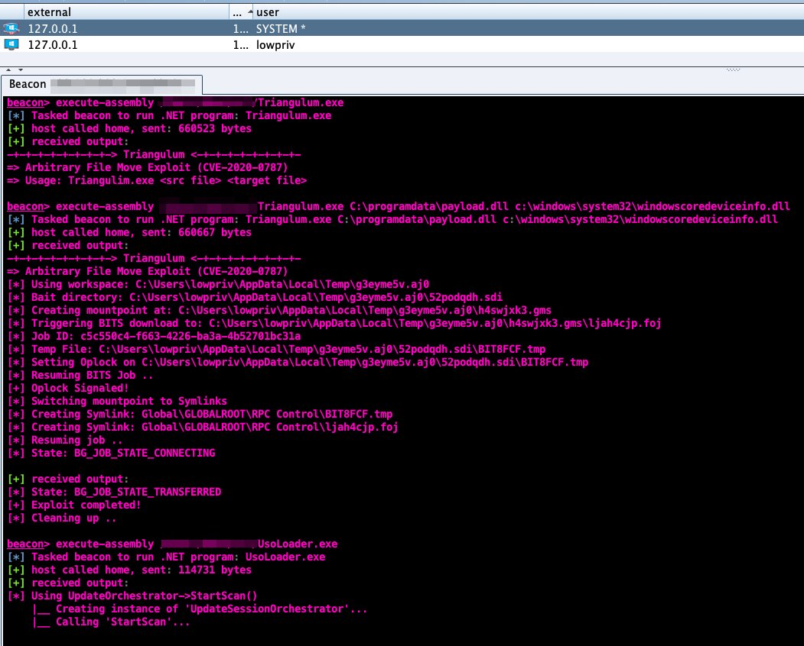</td>
</table></tr>
<table><tr>
<td>Quotes: <code>3</code></td>
<td>Replies: <code>3</code></td>
<td>Retweets: <code>84</code></td>
<td>Favorites: <code>191</code></td>
</tr></table>

---

# TheHackersNews
**https://twitter.com/TheHackersNews/status/1240335971230420992 _at 2020-03-18 17:55:14_**
<blockquote>
Tor 0.4.3.3-alpha released with security fixes!

CVE-2020-10593
high-severity denial-of-service issue

This flaw could let attackers cause Tor instances to consume a huge amount of CPU, disrupting operations for several minutes.

CVE-2020-10592
remotely triggered memory leak bug https://t.co/4tAA9WD6zL
</blockquote>

<table><tr>
<td></td>
</table></tr>
<table><tr>
<td>Quotes: <code>2</code></td>
<td>Replies: <code>1</code></td>
<td>Retweets: <code>87</code></td>
<td>Favorites: <code>133</code></td>
</tr></table>

---

# _hg8_
**https://twitter.com/_hg8_/status/1239498425810501633 _at 2020-03-16 10:27:08_**
<blockquote>
"CVE-2020-0796 Pre-Auth POC"

Tl;Dr: Only DoS by BSOD so far. No RCE proof-of-concept out yet.

https://t.co/zGiZHjOGEw https://t.co/OkeuJpg2Br
</blockquote>

* https://github.com/ZecOps/CVE-2020-0796-POC

<table><tr>
<td>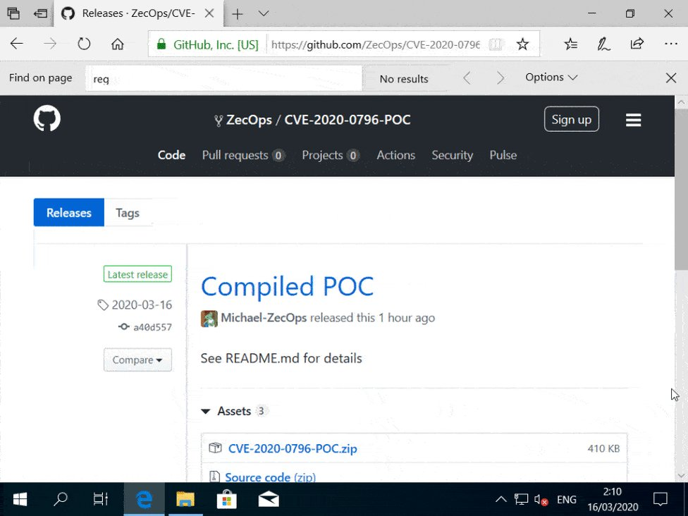</td>
</table></tr>
<table><tr>
<td>Quotes: <code>0</code></td>
<td>Replies: <code>0</code></td>
<td>Retweets: <code>3</code></td>
<td>Favorites: <code>7</code></td>
</tr></table>

---

# blackorbird
**https://twitter.com/blackorbird/status/1238282567675043841 _at 2020-03-13 01:55:44_**
<blockquote>
#SMBGhost Technical analysis of Microsoft SMBv3 client / server remote code execution vulnerability (CVE-2020-0796)
report:
https://t.co/TQi9siQGhH
translate:
https://t.co/g2eRVSuV74
ref:
https://t.co/hD93owRitk
</blockquote>

* http://blogs.360.cn/post/CVE-2020-0796.html
* https://translate.google.com/translate?hl=&sl=zh-CN&tl=en&u=http%3A%2F%2Fblogs.360.cn%2Fpost%2FCVE-2020-0796.html
* https://docs.microsoft.com/en-us/openspecs/windows_protocols/ms-smb2/1d435f21-9a21-4f4c-828e-624a176cf2a0

<table><tr>
<td>Quotes: <code>2</code></td>
<td>Replies: <code>1</code></td>
<td>Retweets: <code>21</code></td>
<td>Favorites: <code>32</code></td>
</tr></table>

---

# USCERT_gov
**https://twitter.com/USCERT_gov/status/1238165538226012161 _at 2020-03-12 18:10:42_**
<blockquote>
Microsoft has released patches to address CVE-2020-0796, a RCE vulnerability in SMBv3. Patch ASAP! Read more at https://t.co/QWZlvwvIFf. #Cyber #Cybersecurity #InfoSec
</blockquote>

* https://go.usa.gov/xdF83

<table><tr>
<td>Quotes: <code>9</code></td>
<td>Replies: <code>2</code></td>
<td>Retweets: <code>132</code></td>
<td>Favorites: <code>129</code></td>
</tr></table>

---

# pctripsesp
**https://twitter.com/pctripsesp/status/1238163773560623108 _at 2020-03-12 18:03:42_**
<blockquote>
CVE-2020-0796: "Wormable" Remote Code Execution Vulnerability in Microsoft Server Message Block SMBv3.

POC:
https://t.co/Zobxv891eX

Scan for vuln, and workaround:
https://t.co/mUjkGUetbg

Microsoft info:
https://t.co/XpbLejlQ8I

#Coronablue #SMBGhost
</blockquote>

* https://synacktiv.com/posts/exploit/im-smbghost-daba-dee-daba-da.html
* https://github.com/cve-2020-0796/cve-2020-0796
* https://portal.msrc.microsoft.com/en-US/security-guidance/advisory/CVE-2020-0796

<table><tr>
<td>Quotes: <code>0</code></td>
<td>Replies: <code>0</code></td>
<td>Retweets: <code>3</code></td>
<td>Favorites: <code>10</code></td>
</tr></table>

---

# UK_Daniel_Card
**https://twitter.com/UK_Daniel_Card/status/1238152468414029825 _at 2020-03-12 17:18:46_**
<blockquote>
Microsoft has released an out of band security update for the SMB v3 RCE Vulenrability (CVE-2020-0796): KB4551762 

This vulnerability can be used in a simmilar way to MSBLASTER/WANNACRY so it's really important you update your sys…https://t.co/Y9wlR8PtYm https://t.co/EajF3TeIw9
</blockquote>

* https://lnkd.in/d3s-CEH
* https://lnkd.in/dKKJWWU

<table><tr>
<td>Quotes: <code>3</code></td>
<td>Replies: <code>1</code></td>
<td>Retweets: <code>19</code></td>
<td>Favorites: <code>33</code></td>
</tr></table>

---

# BleepinComputer
**https://twitter.com/BleepinComputer/status/1238128405910097921 _at 2020-03-12 15:43:09_**
<blockquote>
BREAKING: Microsoft releases the out-of-band KB4551762 Windows 10 security update to patch the CVE-2020-0796 SMBv3 RCE vulnerability
https://t.co/M1A1RKezX4
</blockquote>

* https://www.bleepingcomputer.com/news/security/microsoft-releases-kb4551762-security-update-for-smbv3-vulnerability/

<table><tr>
<td>Quotes: <code>11</code></td>
<td>Replies: <code>3</code></td>
<td>Retweets: <code>129</code></td>
<td>Favorites: <code>166</code></td>
</tr></table>

---

# Synacktiv
**https://twitter.com/Synacktiv/status/1238126780734754816 _at 2020-03-12 15:36:42_**
<blockquote>
Since MSRC just published a fix for CVE-2020-0796, here's @_lucas_georges_ quick and dirty root cause analysis on it: https://t.co/V2RQReCkrS #sambadijaneiro
</blockquote>

* https://www.synacktiv.com/posts/exploit/im-smbghost-daba-dee-daba-da.html

<table><tr>
<td>Quotes: <code>17</code></td>
<td>Replies: <code>7</code></td>
<td>Retweets: <code>262</code></td>
<td>Favorites: <code>409</code></td>
</tr></table>

---

# harr0ey
**https://twitter.com/harr0ey/status/1237908063832748032 _at 2020-03-12 01:07:36_**
<blockquote>
[A new bug in Windows7]
Privilege escalation (UAC bypass) in "INFdefaultinstall". This bug allows you to execute your arbitrary commands under elevated access using the method of execution for "Runonce.exe" inside an INF file.
The Powershell script:
https://t.co/n6c2WNHn2b https://t.co/l3sg8cT9XU
</blockquote>

* https://gist.github.com/homjxi0e/b5dc30890e41900c925bfdcbbe369e81

<table><tr>
<td>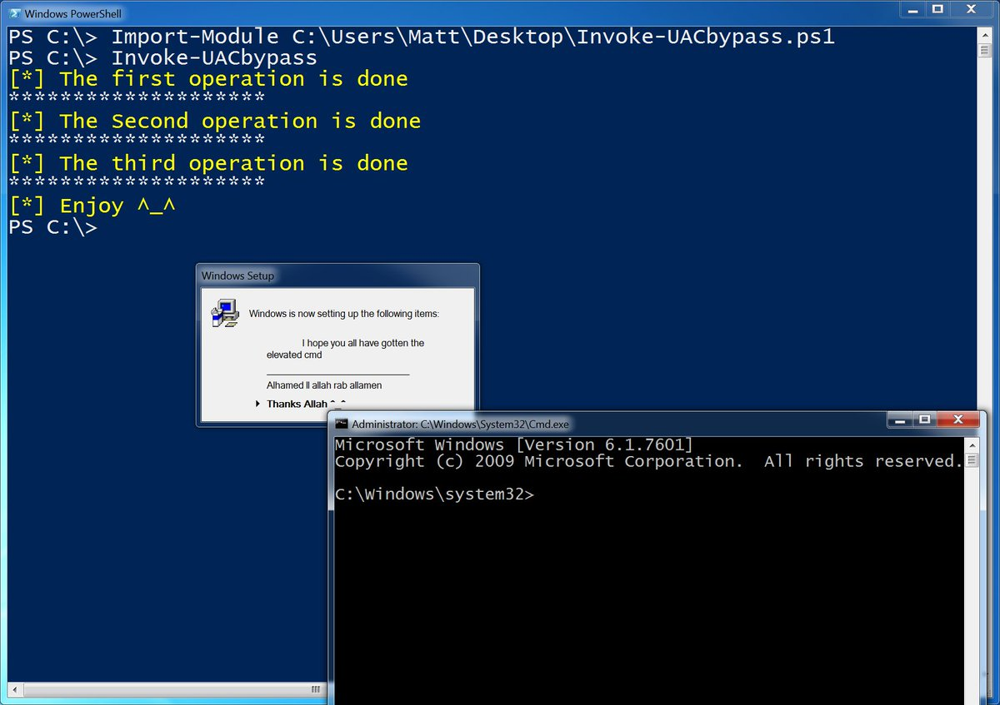</td>
</table></tr>
<table><tr>
<td>Quotes: <code>2</code></td>
<td>Replies: <code>5</code></td>
<td>Retweets: <code>117</code></td>
<td>Favorites: <code>296</code></td>
</tr></table>

---

# UID_
**https://twitter.com/UID_/status/1237459414317137920 _at 2020-03-10 19:24:49_**
<blockquote>
Seems like Cisco's Talos accidentily published details about CVE-2020-0796. A RCE exploit in SMBv3. This type of exploit is comparable to EternalBlue. The impact of such an exploit is what we experienced during WannaCry and NotPetya. https://t.co/jh7HKRDWDr
</blockquote>

<table><tr>
<td>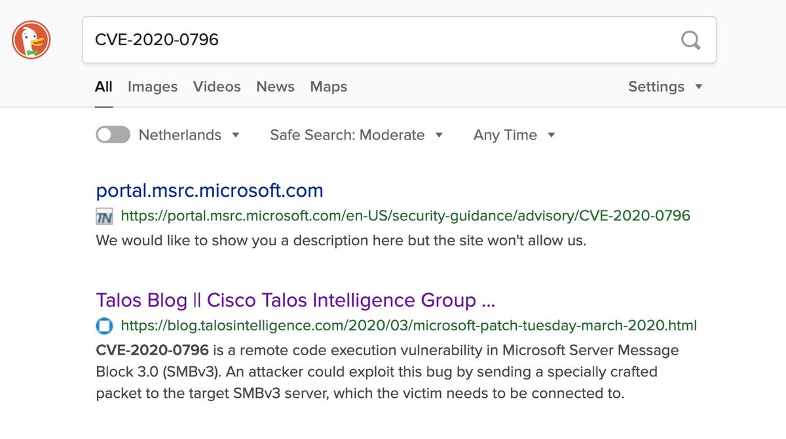</td>
</table></tr>
<table><tr>
<td>Quotes: <code>4</code></td>
<td>Replies: <code>2</code></td>
<td>Retweets: <code>45</code></td>
<td>Favorites: <code>52</code></td>
</tr></table>

---

# USCERT_gov
**https://twitter.com/USCERT_gov/status/1237441415174553600 _at 2020-03-10 18:13:18_**
<blockquote>
Unpatched Microsoft Exchange Servers continue to be vulnerable to an #RCE vulnerability (CVE-2020-0688). Don’t let an attacker take control of your server. Patch now! https://t.co/CzH1GKxpRy #Cyber #Cybersecurity #InfoSec @NSAGov
</blockquote>

* https://go.usa.gov/xdHRC

<table><tr>
<td>Quotes: <code>4</code></td>
<td>Replies: <code>1</code></td>
<td>Retweets: <code>108</code></td>
<td>Favorites: <code>94</code></td>
</tr></table>

---

# Easi123
**https://twitter.com/Easi123/status/1237435605975543808 _at 2020-03-10 17:50:13_**
<blockquote>
CVE-2020-0796 is a remote code execution vulnerability in Microsoft Server Message Block 3.0 (SMBv3).  Users are encouraged to disable SMBv3 compression and block TCP port 445 on firewalls and client computers.
</blockquote>

<table><tr>
<td>Quotes: <code>15</code></td>
<td>Replies: <code>9</code></td>
<td>Retweets: <code>158</code></td>
<td>Favorites: <code>281</code></td>
</tr></table>

---

# dnlongen
**https://twitter.com/dnlongen/status/1237433447309852674 _at 2020-03-10 17:41:38_**
<blockquote>
Give your Windows sysadmins a virtual hug. Looks like they may be busy for a while... Potentially wormable RCE in SMBv3 CVE-2020-0796 (which incidentally, I cannot find any MSFT disclosure for yet). Let's see what WannaCry and NotPetya taught us... https://t.co/gqhJx5h2zV https://t.co/cGlCH6QVN7
</blockquote>

* https://blog.talosintelligence.com/2020/03/microsoft-patch-tuesday-march-2020.html

<table><tr>
<td></td>
</table></tr>
<table><tr>
<td>Quotes: <code>13</code></td>
<td>Replies: <code>8</code></td>
<td>Retweets: <code>132</code></td>
<td>Favorites: <code>171</code></td>
</tr></table>

---

# standa_t
**https://twitter.com/standa_t/status/1237370620435988480 _at 2020-03-10 13:31:59_**
<blockquote>
If you are interested in developing hypervisors as UEFI modules, MiniVisor is for you: https://t.co/WPW6JwdM7G

Also @brucedang and I are offering a 5-day class on the development of hypervisor, including UEFI version, in October. See details at https://t.co/bHnxAjux2m
</blockquote>

* https://github.com/tandasat/MiniVisorPkg
* https://gracefulbits.regfox.com/hypervisor-development-for-security-analysis

<table><tr>
<td>Quotes: <code>3</code></td>
<td>Replies: <code>3</code></td>
<td>Retweets: <code>98</code></td>
<td>Favorites: <code>270</code></td>
</tr></table>

---

# sysgoblin
**https://twitter.com/sysgoblin/status/1237054973579583489 _at 2020-03-09 16:37:43_**
<blockquote>
⚠ Active exploitation of CVE-2020-10189 being seen from  66.42.98.220:12345

RCE drops .bat and .dll to spin up malicious service. DLL to watch out for: storesyncsvc.dll

If anyone obtains a copy of the .dll please hit me up.

cc @malwrhunterteam
</blockquote>

<table><tr>
<td>Quotes: <code>9</code></td>
<td>Replies: <code>9</code></td>
<td>Retweets: <code>126</code></td>
<td>Favorites: <code>236</code></td>
</tr></table>

---

# wugeej
**https://twitter.com/wugeej/status/1236908027053137920 _at 2020-03-09 06:53:48_**
<blockquote>
CVE-2020-2555: Weblogic com.tangosol.util.extractor.ReflectionExtractor RCE

[PoC] https://t.co/7eGOXsXyYY

[Demo Video] Demonstrating CVE-2020-2555: Remote Code Execution in Oracle's WebLogic Server https://t.co/uJ6gQuHpUX
</blockquote>

* https://github.com/wsfengfan/CVE-2020-2555

<table><tr>
<td></td>
</table></tr>
<table><tr>
<td>Quotes: <code>1</code></td>
<td>Replies: <code>0</code></td>
<td>Retweets: <code>17</code></td>
<td>Favorites: <code>36</code></td>
</tr></table>

---

# NSAGov
**https://twitter.com/NSAGov/status/1236099750610563074 _at 2020-03-07 01:22:00_**
<blockquote>
A remote code execution #vulnerability (CVE-2020-0688) exists in Microsoft Exchange Server. If unpatched, an attacker with email credentials can execute commands on your server. 

Mitigation Guidance available at: https://t.co/MMlBo8BsB0
</blockquote>

* https://portal.msrc.microsoft.com/en-US/security-guidance/advisory/CVE-2020-0688

<table><tr>
<td>Quotes: <code>43</code></td>
<td>Replies: <code>37</code></td>
<td>Retweets: <code>366</code></td>
<td>Favorites: <code>516</code></td>
</tr></table>

---

# chybeta
**https://twitter.com/chybeta/status/1235926542397521927 _at 2020-03-06 13:53:44_**
<blockquote>
CVE-2020-5405: Directory Traversal with spring-cloud-config-server.  A malicious user, or attacker, can send a request using a specially crafted URL that can lead a directory traversal attack.

Advisory: https://t.co/kmDGjaDkD9 https://t.co/gVauD9p6em
</blockquote>

* https://pivotal.io/security/cve-2020-5405

<table><tr>
<td>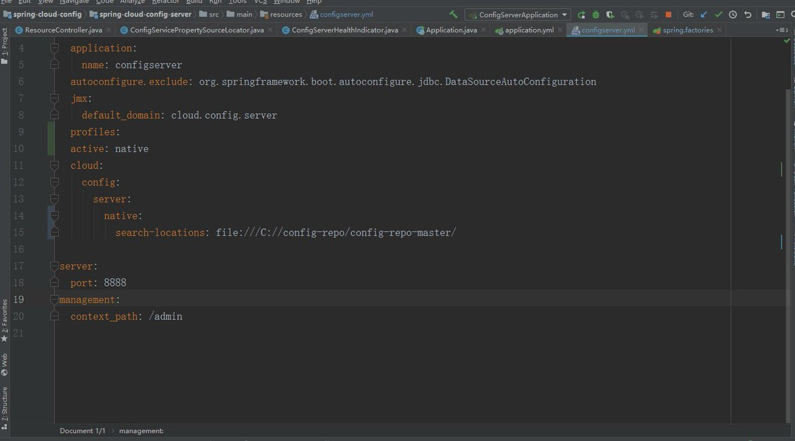</td>
</table></tr>
<table><tr>
<td>Quotes: <code>2</code></td>
<td>Replies: <code>0</code></td>
<td>Retweets: <code>38</code></td>
<td>Favorites: <code>122</code></td>
</tr></table>

---

# ddouhine
**https://twitter.com/ddouhine/status/1235597524838334464 _at 2020-03-05 16:06:20_**
<blockquote>
Woooh that was quick ! 0day + 1week = MSF exploit

Google Chrome 80 JSCreate side-effect type confusion exploit (CVE-2020-6418) in #Metasploit !

Vulnerability found by @_clem1 
Exploit by @_2can and @sherl0ck__
Module by @timwr

Patch released last week

https://t.co/EOFM2n4MWM https://t.co/PAF8Syz9YV
</blockquote>

* https://github.com/rapid7/metasploit-framework/pull/13008

<table><tr>
<td>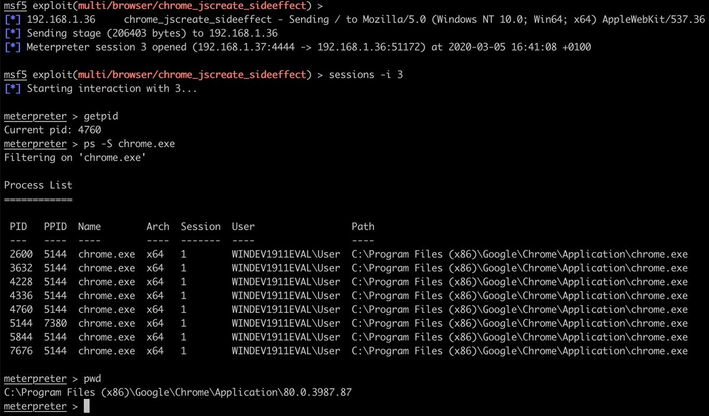</td>
</table></tr>
<table><tr>
<td>Quotes: <code>0</code></td>
<td>Replies: <code>0</code></td>
<td>Retweets: <code>5</code></td>
<td>Favorites: <code>7</code></td>
</tr></table>

---

# Anastasis_King
**https://twitter.com/Anastasis_King/status/1234811404802236416 _at 2020-03-03 12:02:35_**
<blockquote>
CVE-2020-0688:-- #Remote #Code #Execution on #Microsoft Exchange #Server #PoC

Usage:-
python https://t.co/ToRsvPOoXU -s https://ip/owa/ -u user -p pass -c "ping https://t.co/LkXAdGCHGq"

#Download #Link:-

https://t.co/DvPxeiR3nX
</blockquote>

* http://cve-2020-0688.py
* http://test.ph4nxq.dnslog.cn
* https://github.com/Ridter/cve-2020-0688

<table><tr>
<td>Quotes: <code>0</code></td>
<td>Replies: <code>0</code></td>
<td>Retweets: <code>0</code></td>
<td>Favorites: <code>0</code></td>
</tr></table>

---

# james0x40
**https://twitter.com/james0x40/status/1234478389651759104 _at 2020-03-02 13:59:18_**
<blockquote>
My cve-2020-6418 #Chrome remote code execution #exploit demo video. #0day #development https://t.co/OhSVfXkVXo
</blockquote>

<table><tr>
<td>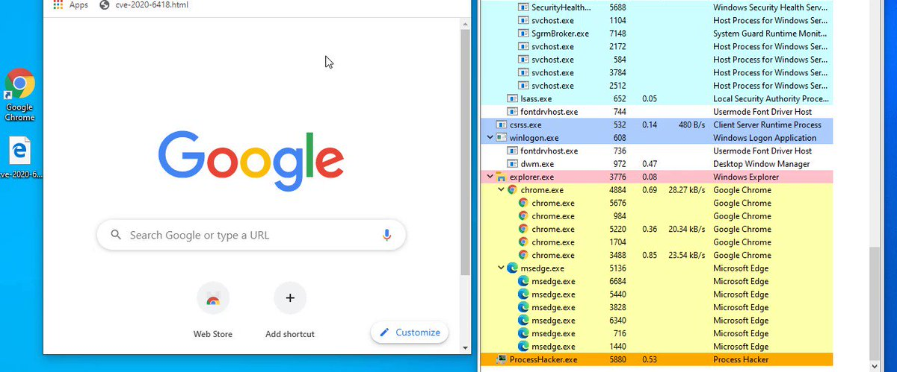</td>
</table></tr>
<table><tr>
<td>Quotes: <code>6</code></td>
<td>Replies: <code>15</code></td>
<td>Retweets: <code>242</code></td>
<td>Favorites: <code>694</code></td>
</tr></table>

---

# JAX_MASTERS
**https://twitter.com/JAX_MASTERS/status/1234191634390233089 _at 2020-03-01 18:59:50_**
<blockquote>
Full Disclosure: LPE and RCE in OpenSMTPD's default install (CVE-2020-8794) https://t.co/TCtX7wHlWY
</blockquote>

* https://seclists.org/fulldisclosure/2020/Feb/32

<table><tr>
<td>Quotes: <code>0</code></td>
<td>Replies: <code>0</code></td>
<td>Retweets: <code>0</code></td>
<td>Favorites: <code>0</code></td>
</tr></table>

---

