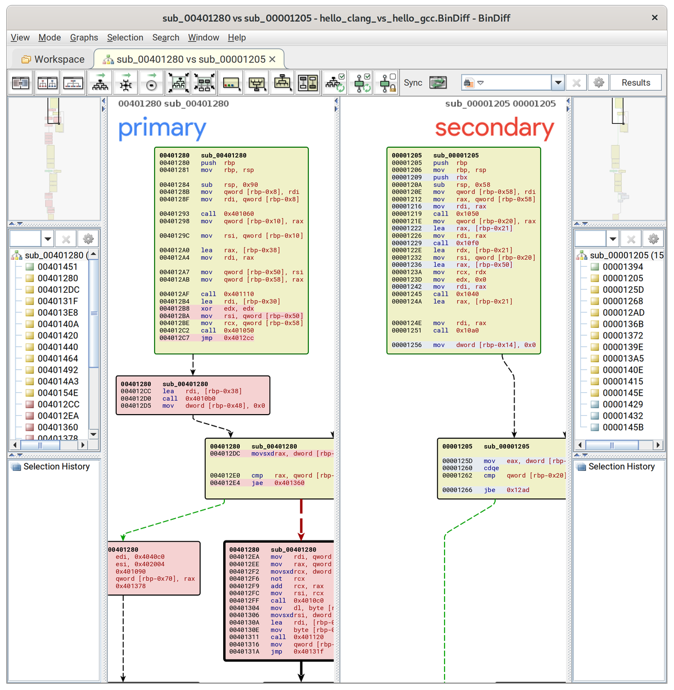
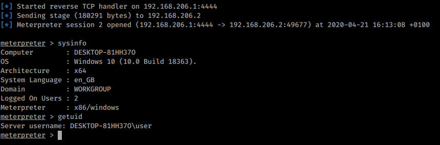
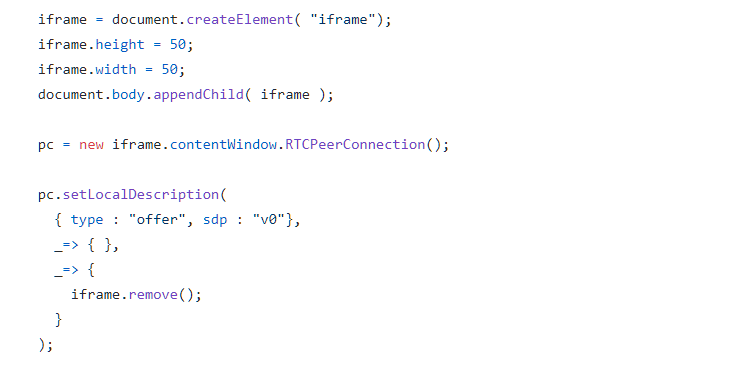
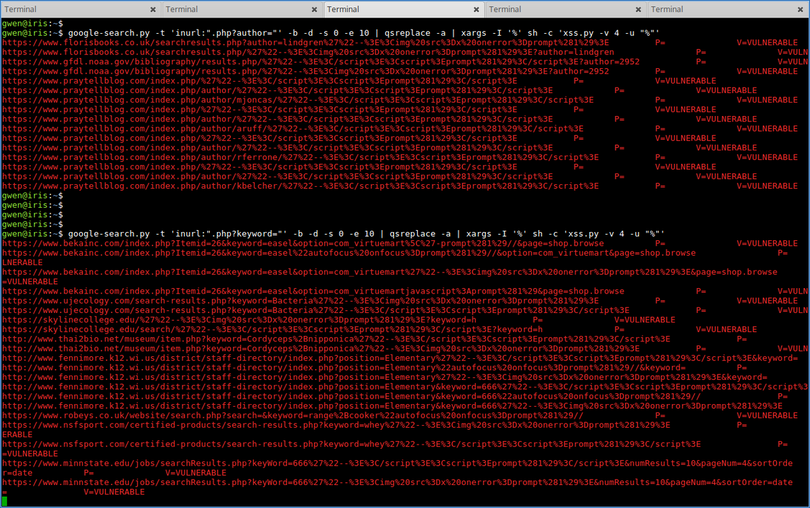
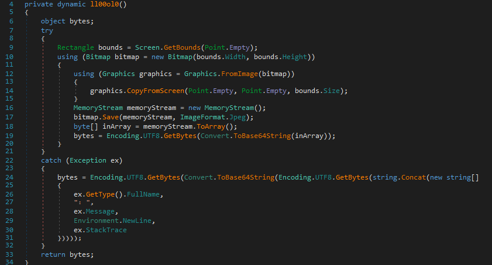
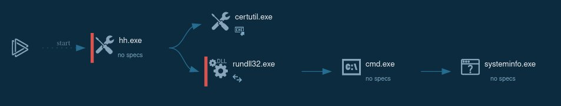
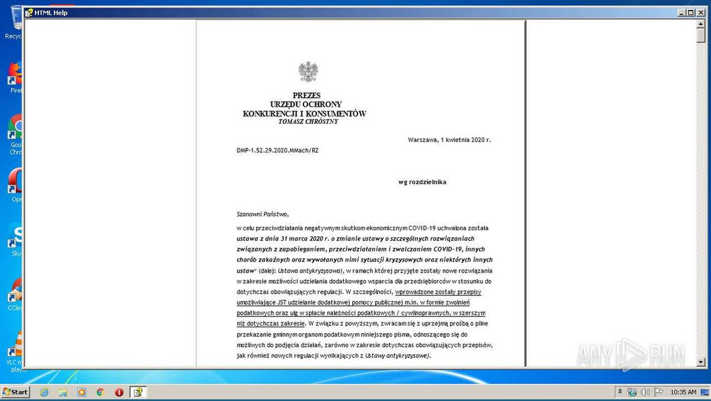
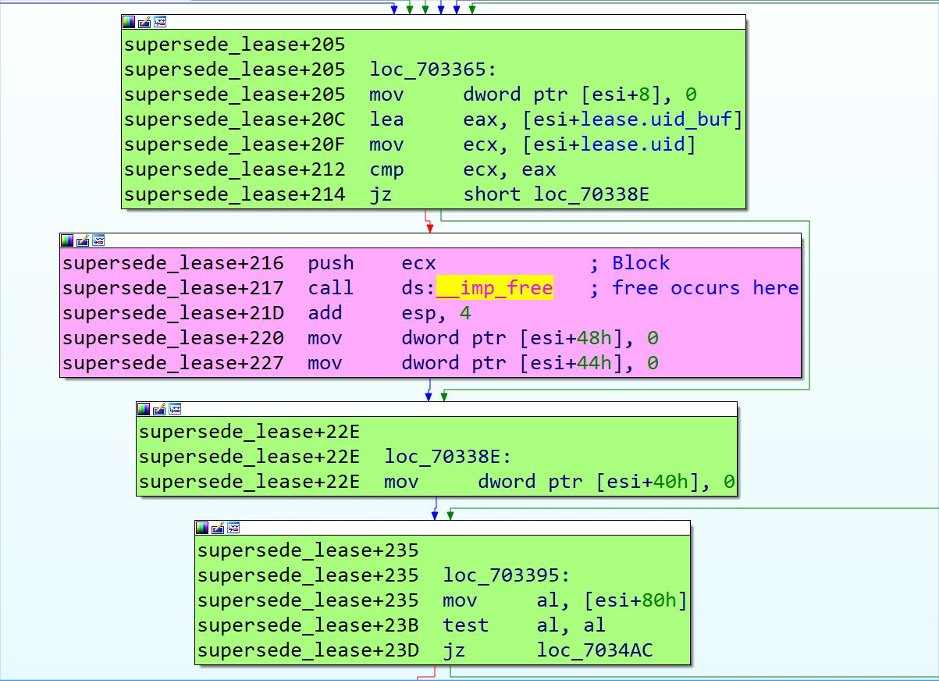
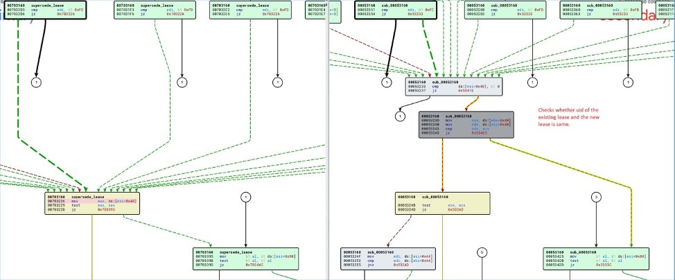
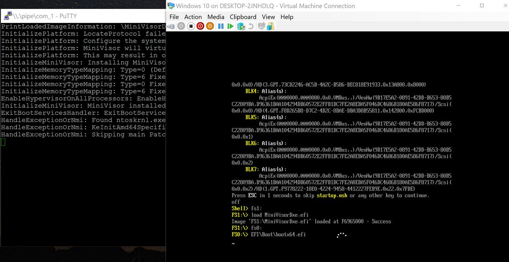

# thezdi
**https://twitter.com/thezdi/status/1255528051816796161 _at 2020-04-29 16:03:08_**
<blockquote>
Detailing CVE-2020-0932 - a now patched RCE bug in #Microsoft #SharePoint reported to us by an anonymous researcher. The blog lays out how code exec is possible using TypeConverters and provides video demonstration and PoC. Read the post at https://t.co/cnAAUDh9ow
</blockquote>

* https://bit.ly/3cVGRt1

<table><tr>
<td>Quotes: <code>5</code></td>
<td>Replies: <code>1</code></td>
<td>Retweets: <code>138</code></td>
<td>Favorites: <code>240</code></td>
</tr></table>

---

# TheHackersNews
**https://twitter.com/TheHackersNews/status/1255267400691392512 _at 2020-04-28 22:47:24_**
<blockquote>
Google's today rolling out the latest Chrome version 81.0.4044.129 to Windows, Mac, and #Linux users that patches two high-severity vulnerabilities.

✅ CVE-2020-6462: Use after free in task scheduling

✅ CVE-2020-6461: Use after free in storage.

https://t.co/ywrKISoTke
</blockquote>

* https://chromereleases.googleblog.com/2020/04/stable-channel-update-for-desktop_27.html

<table><tr>
<td>Quotes: <code>11</code></td>
<td>Replies: <code>2</code></td>
<td>Retweets: <code>150</code></td>
<td>Favorites: <code>222</code></td>
</tr></table>

---

# GHSecurityLab
**https://twitter.com/GHSecurityLab/status/1255149777718784000 _at 2020-04-28 15:00:01_**
<blockquote>
It’s amazing what you can find for free in the garbage sometimes! Read @mmolgtm’s research into how Chrome’s garbage collector can be used to trigger UAF

https://t.co/AUxhXxxmvl
</blockquote>

* http://securitylab.github.com/research/garbage-collection-uaf-chrome_gc

<table><tr>
<td>Quotes: <code>1</code></td>
<td>Replies: <code>0</code></td>
<td>Retweets: <code>26</code></td>
<td>Favorites: <code>75</code></td>
</tr></table>

---

# AdmVonSchneider
**https://twitter.com/AdmVonSchneider/status/1254571681911386112 _at 2020-04-27 00:42:52_**
<blockquote>
Hello @BinjaDevs, @vector35.

https://t.co/VFgNL20nM7

#BinDiff https://t.co/fVWrAHn9uR
</blockquote>

* https://github.com/cblichmann/binexport/releases/tag/v11-20200427-binja-mvp

<table><tr>
<td></td>
</table></tr>
<table><tr>
<td>Quotes: <code>3</code></td>
<td>Replies: <code>1</code></td>
<td>Retweets: <code>53</code></td>
<td>Favorites: <code>133</code></td>
</tr></table>

---

# standa_t
**https://twitter.com/standa_t/status/1254556942493790208 _at 2020-04-26 23:44:18_**
<blockquote>
Wrote a DXE runtime driver to monitor/block UEFI access. I felt it was little boring to implement it C so made the Rust version as well
https://t.co/lF8jETRabx
</blockquote>

* https://github.com/tandasat/UefiVarMonitor

<table><tr>
<td>Quotes: <code>2</code></td>
<td>Replies: <code>3</code></td>
<td>Retweets: <code>68</code></td>
<td>Favorites: <code>221</code></td>
</tr></table>

---

# h0mbre_
**https://twitter.com/h0mbre_/status/1254108024018481152 _at 2020-04-25 18:00:27_**
<blockquote>
Exploit Proof-of-Concept for CVE-2020-12138, Privilege Escalation in ATI Technologies Inc. driver 'atillk64.sys'. Thanks to all those cited for helping me along the way. 

https://t.co/OGqwdUs5ZS
</blockquote>

* https://h0mbre.github.io/atillk64_exploit/#

<table><tr>
<td>Quotes: <code>5</code></td>
<td>Replies: <code>10</code></td>
<td>Retweets: <code>304</code></td>
<td>Favorites: <code>621</code></td>
</tr></table>

---

# piedpiper1616
**https://twitter.com/piedpiper1616/status/1253106517240233984 _at 2020-04-22 23:40:49_**
<blockquote>
GitHub - james0x40/CVE-2020-0624: win32k use-after-free poc - https://t.co/kcE1y7MnRX
</blockquote>

* https://github.com/james0x40/CVE-2020-0624/

<table><tr>
<td>Quotes: <code>1</code></td>
<td>Replies: <code>0</code></td>
<td>Retweets: <code>5</code></td>
<td>Favorites: <code>16</code></td>
</tr></table>

---

# Void_Sec
**https://twitter.com/Void_Sec/status/1252976485863960576 _at 2020-04-22 15:04:08_**
<blockquote>
DeviceViewer v.3.10.12.0 - 'Username' Field (SEH) Stack Buffer Overlow. Metasploit module developed under Windows 10 Pro x64 v.1909 with DEP &amp; ASLR Bypass.

https://t.co/qd7W8mRheh - CVE-2019-11563 

#exploit #seh #overflow #metasploit https://t.co/p7k7UgmRfC
</blockquote>

* https://github.com/VoidSec/Exploit-Development/blob/master/modules/exploits/windows/fileformat/device_viewer.rb

<table><tr>
<td></td>
</table></tr>
<table><tr>
<td>Quotes: <code>0</code></td>
<td>Replies: <code>1</code></td>
<td>Retweets: <code>3</code></td>
<td>Favorites: <code>9</code></td>
</tr></table>

---

# Madrobot_
**https://twitter.com/Madrobot_/status/1252821730508193799 _at 2020-04-22 04:49:11_**
<blockquote>
CVE-2020-7961: Liferay Portal Unauthenticated RCE

Google dork:- inurl:/api/jsonws
Shodan:- Powered+By+Liferay
publicwww:-https://t.co/BbDIOOZcil
POC:- https://t.co/MNkZELcoKy
#bugbounty #BugBountyTips #cve #Preauth #rce #liferay
</blockquote>

* https://publicwww.com/websites/Powered+By+Liferay/
* https://github.com/mzer0one/CVE-2020-7961-POC

<table><tr>
<td>Quotes: <code>1</code></td>
<td>Replies: <code>1</code></td>
<td>Retweets: <code>85</code></td>
<td>Favorites: <code>124</code></td>
</tr></table>

---

# yorickkoster
**https://twitter.com/yorickkoster/status/1252531467974062080 _at 2020-04-21 09:35:47_**
<blockquote>
Local privilege escalation in QRadar due to https://t.co/Ip0BWQRWJW insecure file permissions (CVE-2020-4270). This issue can be chained with other vulnerabilities to compromise the QRadar system as root.

PoC: https://t.co/A7DJ1Aduu0
Advisory: https://t.co/82h0dhfT3X
</blockquote>

* http://run-result-reader.sh
* https://gist.github.com/ykoster/877f7f8dfc0cb7d7fc697c09ffa51845
* https://www.securify.nl/nl/advisory/SFY20200405/local-privilege-escalation-in-qradar-due-to-run-result-reader_sh-insecure-file-permissions.html

<table><tr>
<td>Quotes: <code>0</code></td>
<td>Replies: <code>0</code></td>
<td>Retweets: <code>3</code></td>
<td>Favorites: <code>4</code></td>
</tr></table>

---

# pedrib1337
**https://twitter.com/pedrib1337/status/1252522196037038081 _at 2020-04-21 08:58:56_**
<blockquote>
I am disclosing four 0day for IBM Data Risk Manager, an ENTERPRISE SECURITY APPLIANCE
@IBMSecurity refused to accept @certcc's disclosure and told them to fleck off! 🤣
Advisory and exploits here, have fun: https://t.co/60a7XRZt4C
</blockquote>

* https://github.com/pedrib/PoC/blob/master/advisories/IBM/ibm_drm/ibm_drm_rce.md

<table><tr>
<td>Quotes: <code>33</code></td>
<td>Replies: <code>18</code></td>
<td>Retweets: <code>429</code></td>
<td>Favorites: <code>773</code></td>
</tr></table>

---

# _fel1x
**https://twitter.com/_fel1x/status/1252502296661016576 _at 2020-04-21 07:39:52_**
<blockquote>
My writeup for the haproxy http2 bug (CVE-2020-11100) is now public: https://t.co/rWgz4bfnCZ.  Includes a PoC exploit to demonstrate RCE against Ubuntu 19.10.
</blockquote>

* https://bugs.chromium.org/p/project-zero/issues/detail?id=2023

<table><tr>
<td>Quotes: <code>5</code></td>
<td>Replies: <code>3</code></td>
<td>Retweets: <code>260</code></td>
<td>Favorites: <code>634</code></td>
</tr></table>

---

# james0x40
**https://twitter.com/james0x40/status/1252219604421705728 _at 2020-04-20 12:56:33_**
<blockquote>
Recently, I've found several bugs in #Chrome Blink&gt;WebRTC component including critical use-after-free #vulnerability.

Proof-of-concept codes were uploaded.
The #exploitation of OnSignalingChange use-after-free vulnerability is so challenging.
https://t.co/qk8a1RTmcu
</blockquote>

* https://github.com/james0x40/chrome-webrtc-pocs

<table><tr>
<td>Quotes: <code>0</code></td>
<td>Replies: <code>1</code></td>
<td>Retweets: <code>23</code></td>
<td>Favorites: <code>60</code></td>
</tr></table>

---

# yorickkoster
**https://twitter.com/yorickkoster/status/1252186614752849920 _at 2020-04-20 10:45:28_**
<blockquote>
Details for the path traversal vulnerability I discovered in the Cisco AnyConnect Secure Mobility Client for Windows are now public (CVE-2020-3153). This issue can be used to gain SYSTEM privileges:

https://t.co/JIzD7iZLx1
https://t.co/4wiatAbth0
</blockquote>

* https://ssd-disclosure.com/ssd-advisory-cisco-anyconnect-privilege-elevation-through-path-traversal/
* https://www.securify.nl/advisory/SFY20200419/cisco-anyconnect-elevation-of-privileges-due-to-insecure-handling-of-path-names.html

<table><tr>
<td>Quotes: <code>2</code></td>
<td>Replies: <code>2</code></td>
<td>Retweets: <code>70</code></td>
<td>Favorites: <code>113</code></td>
</tr></table>

---

# _CPResearch_
**https://twitter.com/_CPResearch_/status/1252174102133116928 _at 2020-04-20 09:55:44_**
<blockquote>
[CPR-Zero] CVE-2020-0791 (Windows 10 Kernel): Out-Of-Bounds Read\Write in the StrechBlt function in win32kfull.sys
https://t.co/PGg9X2bNHE
</blockquote>

* https://cpr-zero.checkpoint.com/vulns/cprid-2147/

<table><tr>
<td>Quotes: <code>2</code></td>
<td>Replies: <code>0</code></td>
<td>Retweets: <code>69</code></td>
<td>Favorites: <code>135</code></td>
</tr></table>

---

# carmelatroncoso
**https://twitter.com/carmelatroncoso/status/1251932364135161857 _at 2020-04-19 17:55:10_**
<blockquote>
Yesterday 
@PeppPt
 published their Data Protection and Security Architecture (Germany implementation): https://t.co/9xJUg65sOI
Here is a security/privacy analysis by the #DP3T team: https://t.co/S3rC08h7Vv
We hope that this analysis serves to inform the ongoing discussion
</blockquote>

* https://github.com/pepp-pt/pepp-pt-documentation/blob/master/10-data-protection/PEPP-PT-data-protection-information-security-architecture-Germany.pdf
* https://github.com/DP-3T/documents/blob/master/Security%20analysis/PEPP-PT_%20Data%20Protection%20Architechture%20-%20Security%20and%20privacy%20analysis.pdf

<table><tr>
<td>Quotes: <code>12</code></td>
<td>Replies: <code>7</code></td>
<td>Retweets: <code>123</code></td>
<td>Favorites: <code>217</code></td>
</tr></table>

---

# Anastasis_King
**https://twitter.com/Anastasis_King/status/1251151436873752579 _at 2020-04-17 14:12:02_**
<blockquote>
CVE-2020-13694 : A Chrome WebRTC use-after-free vulnerability PoC
Cc @james0x40

https://t.co/HtdjG7WpPM
</blockquote>

* https://github.com/james0x40/chrome-webrtc-pocs/blob/master/cve-2019-13694.html

<table><tr>
<td>Quotes: <code>0</code></td>
<td>Replies: <code>0</code></td>
<td>Retweets: <code>0</code></td>
<td>Favorites: <code>0</code></td>
</tr></table>

---

# Externalist
**https://twitter.com/Externalist/status/1251118382419570689 _at 2020-04-17 12:00:41_**
<blockquote>
My OffensiveCon talk is online!

This year I did a talk about Safari RCE and SBX bugs at OffensiveCon. You can check it out at https://t.co/ZbJHdO7bSy

Also, here are the slides :
https://t.co/Q7lvvvphO9

Thanks again @offensive_con for amazing opportunity!! 😄
</blockquote>

* https://www.youtube.com/watch?v=fTNzylTMYks
* https://github.com/externalist/presentations/tree/master/2019%20OffensiveCon

<table><tr>
<td>Quotes: <code>0</code></td>
<td>Replies: <code>4</code></td>
<td>Retweets: <code>84</code></td>
<td>Favorites: <code>216</code></td>
</tr></table>

---

# cyber_advising
**https://twitter.com/cyber_advising/status/1251105916843429888 _at 2020-04-17 11:11:09_**
<blockquote>
CVE-2020-13694 : A Chrome WebRTC use-after-free vulnerability PoC

https://t.co/5tZtQuuJEq https://t.co/hjmVLyTkdj
</blockquote>

* https://github.com/james0x40/chrome-webrtc-pocs/blob/master/cve-2019-13694.html

<table><tr>
<td></td>
</table></tr>
<table><tr>
<td>Quotes: <code>0</code></td>
<td>Replies: <code>1</code></td>
<td>Retweets: <code>2</code></td>
<td>Favorites: <code>2</code></td>
</tr></table>

---

# gwendallecoguic
**https://twitter.com/gwendallecoguic/status/1251083283833765888 _at 2020-04-17 09:41:13_**
<blockquote>
Chasing in the wild has never been so easy #xss

https://t.co/TySuP2Bdq1
https://t.co/y6DORI5b3x
https://t.co/1hO8T5lx6t

Btw does anyone know a way to speed up #phantomjs ? #javascript https://t.co/w5uMJmIEtJ
</blockquote>

* https://github.com/gwen001/pentest-tools/blob/master/google-search.py
* https://github.com/tomnomnom/qsreplace
* https://github.com/gwen001/pentest-tools/blob/master/xss.py

<table><tr>
<td></td>
</table></tr>
<table><tr>
<td>Quotes: <code>0</code></td>
<td>Replies: <code>9</code></td>
<td>Retweets: <code>197</code></td>
<td>Favorites: <code>466</code></td>
</tr></table>

---

# GHSecurityLab
**https://twitter.com/GHSecurityLab/status/1250838868536025090 _at 2020-04-16 17:30:00_**
<blockquote>
GHSL-2020-037: Use after free in Chrome webaudio - CVE-2020-6428 https://t.co/pYcJ55DXEH
</blockquote>

* https://securitylab.github.com/advisories/GHSL-2020-037-chrome

<table><tr>
<td>Quotes: <code>1</code></td>
<td>Replies: <code>0</code></td>
<td>Retweets: <code>15</code></td>
<td>Favorites: <code>31</code></td>
</tr></table>

---

# james0x40
**https://twitter.com/james0x40/status/1250777364105232385 _at 2020-04-16 13:25:36_**
<blockquote>
A WebRTC use-after-free vulnerability PoC code is uploaded.
CVE-2019-13694
https://t.co/nISlSQ5n91
</blockquote>

* https://github.com/james0x40/chrome-webrtc-pocs/blob/master/cve-2019-13694.html

<table><tr>
<td>Quotes: <code>2</code></td>
<td>Replies: <code>0</code></td>
<td>Retweets: <code>62</code></td>
<td>Favorites: <code>154</code></td>
</tr></table>

---

# wugeej
**https://twitter.com/wugeej/status/1250599176427024384 _at 2020-04-16 01:37:33_**
<blockquote>
Proof of Concept

RCE Exploit PoC for CVE-2020-3952''' + '''\r\n\r\n''' + '''USAGE: python https://t.co/OIXLoNeSvW -h 10.16.1.24

https://t.co/LlmpKdGPeX
</blockquote>

* http://CVE-2020-3952-POC.py
* https://github.com/curtbraz/CVE-2020-3952/blob/master/CVE-2020-3952-POC.py

<table><tr>
<td>Quotes: <code>0</code></td>
<td>Replies: <code>0</code></td>
<td>Retweets: <code>4</code></td>
<td>Favorites: <code>3</code></td>
</tr></table>

---

# hosselot
**https://twitter.com/hosselot/status/1250121074425167873 _at 2020-04-14 17:57:44_**
<blockquote>
Killed 7 vulnerabilities in tonight Microsoft patch Tuesday:

Jet Database Engine:
CVE-2020-0953: RCE
CVE-2020-0959: RCE
CVE-2020-0960: RCE
CVE-2020-0988: RCE
CVE-2020-0992: RCE
CVE-2020-0994: RCE

Windows:
CVE-2020-0821: information disclosure
</blockquote>

<table><tr>
<td>Quotes: <code>1</code></td>
<td>Replies: <code>0</code></td>
<td>Retweets: <code>4</code></td>
<td>Favorites: <code>35</code></td>
</tr></table>

---

# threatintelctr
**https://twitter.com/threatintelctr/status/1250086744340471810 _at 2020-04-14 15:41:19_**
<blockquote>
🚨 NEW: CVE-2019-1010206 🚨 OSS Http Request (Apache Cordova Plugin) 6 is affected by: Missing SSL certificate validation. The impact is: certificate spoofing. The component is: use this library when https communicatio... (click for more) Severity: MEDIUM https://t.co/EJhjmRYpAv
</blockquote>

* https://github.com/kevinsawicki/http-request/blob/master/lib/src/main/java/com/github/kevinsawicki/http/HttpRequest.java

<table><tr>
<td>Quotes: <code>0</code></td>
<td>Replies: <code>0</code></td>
<td>Retweets: <code>0</code></td>
<td>Favorites: <code>0</code></td>
</tr></table>

---

# wugeej
**https://twitter.com/wugeej/status/1249947315625848832 _at 2020-04-14 06:27:17_**
<blockquote>
Unauthenticated Remote code execution via JSONWS CVE-2020-7961

The default login/password for the docker: test@liferay.com:test.

$ curl -s http://172.17.0.2:8080/api/jsonws/announcementsflag/get-flag -u test@liferay.com:test -d entryId=1 -d value=2 | jq

https://t.co/peFs51C6jg
</blockquote>

* https://www.synacktiv.com/posts/pentest/how-to-exploit-liferay-cve-2020-7961-quick-journey-to-poc.html

<table><tr>
<td>Quotes: <code>1</code></td>
<td>Replies: <code>0</code></td>
<td>Retweets: <code>24</code></td>
<td>Favorites: <code>41</code></td>
</tr></table>

---

# metasploit
**https://twitter.com/metasploit/status/1248658249043378179 _at 2020-04-10 17:05:00_**
<blockquote>
#Metasploit wrap-up c/o @pearce_barry: Meterpreter bug fixes and five new modules, including an LPE exploit for SMBghost (CVE-2020-0796) and a BloodHound post module that gathers info and stores it as a BloodHound-consumable ZIP file in Framework loot. https://t.co/0LnGh8Jkkf
</blockquote>

* https://blog.rapid7.com/2020/04/10/metasploit-wrap-up-59/

<table><tr>
<td>Quotes: <code>1</code></td>
<td>Replies: <code>0</code></td>
<td>Retweets: <code>31</code></td>
<td>Favorites: <code>62</code></td>
</tr></table>

---

# Milad_Pc
**https://twitter.com/Milad_Pc/status/1247938403238383616 _at 2020-04-08 17:24:35_**
<blockquote>
SMBGhost Local Privilege Escalation POC - CVE-2020-0796
#cve #cybersecurity #smbghost #PenTest #infosec
https://t.co/jHu0qAHM3g
</blockquote>

* https://github.com/ZecOps/CVE-2020-0796-LPE-POC

<table><tr>
<td>Quotes: <code>0</code></td>
<td>Replies: <code>0</code></td>
<td>Retweets: <code>3</code></td>
<td>Favorites: <code>2</code></td>
</tr></table>

---

# eternalsakura13
**https://twitter.com/eternalsakura13/status/1247643720503062529 _at 2020-04-07 21:53:37_**
<blockquote>
https://t.co/TSl14LmZbP

Always alpha : )
My third chrome security high, unfortunately I have never fully implemented the exploit.

Can someone tell me how to write the RCE exploit for my bug CVE-2019-5831, I really want to know
https://t.co/uZE5jpsm9H https://t.co/JYT9SPuBtG
</blockquote>

* https://chromereleases.googleblog.com/2020/04/stable-channel-update-for-desktop_7.html
* https://bugs.chromium.org/p/chromium/issues/detail?id=950328

<table><tr>
<td></td>
<td></td>
</table></tr>
<table><tr>
<td>Quotes: <code>0</code></td>
<td>Replies: <code>5</code></td>
<td>Retweets: <code>9</code></td>
<td>Favorites: <code>98</code></td>
</tr></table>

---

# w3ndige
**https://twitter.com/w3ndige/status/1247547923845578755 _at 2020-04-07 15:32:58_**
<blockquote>
2020-04-07 CHM uses CVE-2019-0541 to drop .NET RAT targeting Poland 🇵🇱

CHM: 485c4b9a688dcecb56084f0402f35cac
DLL: d2b81c4f5d075daa681f823cc9a5e4c0
C2: microsoft-hohm[.]space|145.239.23[.]7

cc: @malwrhunterteam @James_inthe_box @JAMESWT_MHT @VK_Intel 

https://t.co/Bt5MEcsf4p https://t.co/eK9CAgPxHp
</blockquote>

* https://app.any.run/tasks/d30d1c49-05e8-4767-ade8-66a3204f8821

<table><tr>
<td></td>
<td></td>
<td></td>
</table></tr>
<table><tr>
<td>Quotes: <code>3</code></td>
<td>Replies: <code>4</code></td>
<td>Retweets: <code>32</code></td>
<td>Favorites: <code>74</code></td>
</tr></table>

---

# ptracesecurity
**https://twitter.com/ptracesecurity/status/1247064710463225856 _at 2020-04-06 07:32:50_**
<blockquote>
CVE-2020-3947: Use after free vulnerability in the VMware workstation DHCP component  https://t.co/n23a6LvXTe  #Vmware #Vulnerability #CyberSecurity #Infosec https://t.co/3zXc49BNqA
</blockquote>

* https://www.zerodayinitiative.com/blog/2020/4/1/cve-2020-3947-use-after-free-vulnerability-in-the-vmware-workstation-dhcp-component

<table><tr>
<td></td>
<td></td>
<td></td>
<td></td>
</table></tr>
<table><tr>
<td>Quotes: <code>2</code></td>
<td>Replies: <code>0</code></td>
<td>Retweets: <code>29</code></td>
<td>Favorites: <code>35</code></td>
</tr></table>

---

# _trou_
**https://twitter.com/_trou_/status/1246482199148482560 _at 2020-04-04 16:58:09_**
<blockquote>
I've now exploited ASUS AsIO2.sys LPE. Blog: https://t.co/IgHVHsYcTb. Exploit: https://t.co/lEd67tAvbw based on @rwfpl MSI exploit. Enjoy !
</blockquote>

* https://syscall.eu/blog/2020/04/04/asus_gio_exploit/
* https://github.com/trou/asus-asio2-lpe-exploit

<table><tr>
<td>Quotes: <code>1</code></td>
<td>Replies: <code>1</code></td>
<td>Retweets: <code>73</code></td>
<td>Favorites: <code>147</code></td>
</tr></table>

---

# standa_t
**https://twitter.com/standa_t/status/1246480268527108096 _at 2020-04-04 16:50:29_**
<blockquote>
You can write and test your type-1 hypervisor on Hyper-V. I wrote up step-by-step instructions for this with MiniVisor.
https://t.co/PVvnnsWVRu

Big thanks to @Intel80x86 for sharing tricks about Hyper-V compatibility! https://t.co/e9TE9P6PeK
</blockquote>

* https://github.com/tandasat/MiniVisorPkg/blob/master/Docs/Testing_UEFI_on_Hyper-V.md

<table><tr>
<td></td>
</table></tr>
<table><tr>
<td>Quotes: <code>1</code></td>
<td>Replies: <code>2</code></td>
<td>Retweets: <code>108</code></td>
<td>Favorites: <code>293</code></td>
</tr></table>

---

# Dinosn
**https://twitter.com/Dinosn/status/1245763179273228299 _at 2020-04-02 17:21:01_**
<blockquote>
Exploiting SMBGhost (CVE-2020-0796) for a Local Privilege Escalation: Writeup + POC
https://t.co/7YpXoJ2HNH
</blockquote>

* https://blog.zecops.com/vulnerabilities/exploiting-smbghost-cve-2020-0796-for-a-local-privilege-escalation-writeup-and-poc/

<table><tr>
<td>Quotes: <code>1</code></td>
<td>Replies: <code>0</code></td>
<td>Retweets: <code>24</code></td>
<td>Favorites: <code>48</code></td>
</tr></table>

---

# B01Group
**https://twitter.com/B01Group/status/1245608244967428096 _at 2020-04-02 07:05:22_**
<blockquote>
TheHackersNews: PoC exploits have been released for achieving local privilege escalation on #Windows10 leveraging recently discovered wormable SMBv3 RCE flaw.

CVE-2020-0796
#SMBGhost

PoCs:
https://t.co/0xjjHWgD9d
https://t.co/ia72BefGRQ

Patch / News:
…
</blockquote>

* https://github.com/danigargu/CVE-2020-0796
* https://github.com/ZecOps/CVE-2020-0796-POC

<table><tr>
<td>Quotes: <code>0</code></td>
<td>Replies: <code>0</code></td>
<td>Retweets: <code>0</code></td>
<td>Favorites: <code>0</code></td>
</tr></table>

---

# HonkHase
**https://twitter.com/HonkHase/status/1245361148603572224 _at 2020-04-01 14:43:30_**
<blockquote>
#Windows SMBv3 #LPE #Exploit for CVE-2020-0796 available!

Look at the video and understand the risk please...

https://t.co/eHTZTdZ6jv
</blockquote>

* https://github.com/danigargu/CVE-2020-0796

<table><tr>
<td>Quotes: <code>0</code></td>
<td>Replies: <code>1</code></td>
<td>Retweets: <code>1</code></td>
<td>Favorites: <code>3</code></td>
</tr></table>

---

# andersonc0d3
**https://twitter.com/andersonc0d3/status/1245357072520294400 _at 2020-04-01 14:27:18_**
<blockquote>
(Pwn2Own) Linux Kernel eBPF Improper Input Validation Privilege Escalation Vulnerability

https://t.co/sG1qn2AOHM

CVE-2020-8835: Linux kernel bpf incorrect verifier vulnerability

https://t.co/95gZ8ny5jF
</blockquote>

* https://www.zerodayinitiative.com/advisories/ZDI-20-350/
* https://www.openwall.com/lists/oss-security/2020/03/30/3

<table><tr>
<td>Quotes: <code>0</code></td>
<td>Replies: <code>0</code></td>
<td>Retweets: <code>34</code></td>
<td>Favorites: <code>53</code></td>
</tr></table>

---

# 404death
**https://twitter.com/404death/status/1245211859117936641 _at 2020-04-01 04:50:16_**
<blockquote>
Windows 10 LPE via Dll Search Loading 

https://t.co/3JgHLcPTYv

#magnifier0day
</blockquote>

* https://github.com/sailay1996/magnifier0day

<table><tr>
<td>Quotes: <code>1</code></td>
<td>Replies: <code>3</code></td>
<td>Retweets: <code>33</code></td>
<td>Favorites: <code>98</code></td>
</tr></table>

---

