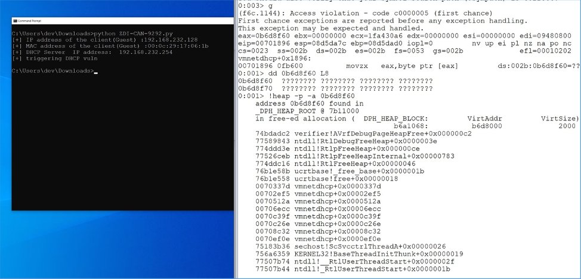

# thezdi
**https://twitter.com/thezdi/status/1255528051816796161 _at Wed Apr 29 16:03:08 +0000 2020_**
<blockquote>
Detailing CVE-2020-0932 - a now patched RCE bug in #Microsoft #SharePoint reported to us by an anonymous researcher. The blog lays out how code exec is possible using TypeConverters and provides video demonstration and PoC. Read the post at https://t.co/cnAAUDh9ow
</blockquote>

* https://bit.ly/3cVGRt1

<table><tr>
<td>Quotes: <code>5</code></td>
<td>Replies: <code>1</code></td>
<td>Retweets: <code>138</code></td>
<td>Favorites: <code>240</code></td>
</tr></table>

---

# TheHackersNews
**https://twitter.com/TheHackersNews/status/1255267400691392512 _at Tue Apr 28 22:47:24 +0000 2020_**
<blockquote>
Google's today rolling out the latest Chrome version 81.0.4044.129 to Windows, Mac, and #Linux users that patches two high-severity vulnerabilities.

✅ CVE-2020-6462: Use after free in task scheduling

✅ CVE-2020-6461: Use after free in storage.

https://t.co/ywrKISoTke
</blockquote>

* https://chromereleases.googleblog.com/2020/04/stable-channel-update-for-desktop_27.html

<table><tr>
<td>Quotes: <code>11</code></td>
<td>Replies: <code>2</code></td>
<td>Retweets: <code>159</code></td>
<td>Favorites: <code>227</code></td>
</tr></table>

---

# h0mbre_
**https://twitter.com/h0mbre_/status/1254108024018481152 _at Sat Apr 25 18:00:27 +0000 2020_**
<blockquote>
Exploit Proof-of-Concept for CVE-2020-12138, Privilege Escalation in ATI Technologies Inc. driver 'atillk64.sys'. Thanks to all those cited for helping me along the way. 

https://t.co/OGqwdUs5ZS
</blockquote>

* https://h0mbre.github.io/atillk64_exploit/#

<table><tr>
<td>Quotes: <code>5</code></td>
<td>Replies: <code>10</code></td>
<td>Retweets: <code>311</code></td>
<td>Favorites: <code>627</code></td>
</tr></table>

---

# Madrobot_
**https://twitter.com/Madrobot_/status/1252821730508193799 _at Wed Apr 22 04:49:11 +0000 2020_**
<blockquote>
CVE-2020-7961: Liferay Portal Unauthenticated RCE

Google dork:- inurl:/api/jsonws
Shodan:- Powered+By+Liferay
publicwww:-https://t.co/BbDIOOZcil
POC:- https://t.co/MNkZELcoKy
#bugbounty #BugBountyTips #cve #Preauth #rce #liferay
</blockquote>

* https://publicwww.com/websites/Powered+By+Liferay/
* https://github.com/mzer0one/CVE-2020-7961-POC

<table><tr>
<td>Quotes: <code>1</code></td>
<td>Replies: <code>1</code></td>
<td>Retweets: <code>79</code></td>
<td>Favorites: <code>120</code></td>
</tr></table>

---

# _fel1x
**https://twitter.com/_fel1x/status/1252502296661016576 _at Tue Apr 21 07:39:52 +0000 2020_**
<blockquote>
My writeup for the haproxy http2 bug (CVE-2020-11100) is now public: https://t.co/rWgz4bfnCZ.  Includes a PoC exploit to demonstrate RCE against Ubuntu 19.10.
</blockquote>

* https://bugs.chromium.org/p/project-zero/issues/detail?id=2023

<table><tr>
<td>Quotes: <code>5</code></td>
<td>Replies: <code>3</code></td>
<td>Retweets: <code>264</code></td>
<td>Favorites: <code>641</code></td>
</tr></table>

---

# yorickkoster
**https://twitter.com/yorickkoster/status/1252186614752849920 _at Mon Apr 20 10:45:28 +0000 2020_**
<blockquote>
Details for the path traversal vulnerability I discovered in the Cisco AnyConnect Secure Mobility Client for Windows are now public (CVE-2020-3153). This issue can be used to gain SYSTEM privileges:

https://t.co/JIzD7iZLx1
https://t.co/4wiatAbth0
</blockquote>

* https://ssd-disclosure.com/ssd-advisory-cisco-anyconnect-privilege-elevation-through-path-traversal/
* https://www.securify.nl/advisory/SFY20200419/cisco-anyconnect-elevation-of-privileges-due-to-insecure-handling-of-path-names.html

<table><tr>
<td>Quotes: <code>2</code></td>
<td>Replies: <code>2</code></td>
<td>Retweets: <code>71</code></td>
<td>Favorites: <code>115</code></td>
</tr></table>

---

# _CPResearch_
**https://twitter.com/_CPResearch_/status/1252174102133116928 _at Mon Apr 20 09:55:44 +0000 2020_**
<blockquote>
[CPR-Zero] CVE-2020-0791 (Windows 10 Kernel): Out-Of-Bounds Read\Write in the StrechBlt function in win32kfull.sys
https://t.co/PGg9X2bNHE
</blockquote>

* https://cpr-zero.checkpoint.com/vulns/cprid-2147/

<table><tr>
<td>Quotes: <code>2</code></td>
<td>Replies: <code>0</code></td>
<td>Retweets: <code>69</code></td>
<td>Favorites: <code>135</code></td>
</tr></table>

---

# GHSecurityLab
**https://twitter.com/GHSecurityLab/status/1250838868536025090 _at Thu Apr 16 17:30:00 +0000 2020_**
<blockquote>
GHSL-2020-037: Use after free in Chrome webaudio - CVE-2020-6428 https://t.co/pYcJ55DXEH
</blockquote>

* https://securitylab.github.com/advisories/GHSL-2020-037-chrome

<table><tr>
<td>Quotes: <code>1</code></td>
<td>Replies: <code>0</code></td>
<td>Retweets: <code>15</code></td>
<td>Favorites: <code>31</code></td>
</tr></table>

---

# james0x40
**https://twitter.com/james0x40/status/1250777364105232385 _at Thu Apr 16 13:25:36 +0000 2020_**
<blockquote>
A WebRTC use-after-free vulnerability PoC code is uploaded.
CVE-2019-13694
https://t.co/nISlSQ5n91
</blockquote>

* https://github.com/james0x40/chrome-webrtc-pocs/blob/master/cve-2019-13694.html

<table><tr>
<td>Quotes: <code>2</code></td>
<td>Replies: <code>0</code></td>
<td>Retweets: <code>62</code></td>
<td>Favorites: <code>156</code></td>
</tr></table>

---

# hosselot
**https://twitter.com/hosselot/status/1250121074425167873 _at Tue Apr 14 17:57:44 +0000 2020_**
<blockquote>
Killed 7 vulnerabilities in tonight Microsoft patch Tuesday:

Jet Database Engine:
CVE-2020-0953: RCE
CVE-2020-0959: RCE
CVE-2020-0960: RCE
CVE-2020-0988: RCE
CVE-2020-0992: RCE
CVE-2020-0994: RCE

Windows:
CVE-2020-0821: information disclosure
</blockquote>

<table><tr>
<td>Quotes: <code>1</code></td>
<td>Replies: <code>0</code></td>
<td>Retweets: <code>4</code></td>
<td>Favorites: <code>35</code></td>
</tr></table>

---

# wugeej
**https://twitter.com/wugeej/status/1249947315625848832 _at Tue Apr 14 06:27:17 +0000 2020_**
<blockquote>
Unauthenticated Remote code execution via JSONWS CVE-2020-7961

The default login/password for the docker: test@liferay.com:test.

$ curl -s http://172.17.0.2:8080/api/jsonws/announcementsflag/get-flag -u test@liferay.com:test -d entryId=1 -d value=2 | jq

https://t.co/peFs51C6jg
</blockquote>

* https://www.synacktiv.com/posts/pentest/how-to-exploit-liferay-cve-2020-7961-quick-journey-to-poc.html

<table><tr>
<td>Quotes: <code>1</code></td>
<td>Replies: <code>0</code></td>
<td>Retweets: <code>24</code></td>
<td>Favorites: <code>41</code></td>
</tr></table>

---

# metasploit
**https://twitter.com/metasploit/status/1248658249043378179 _at Fri Apr 10 17:05:00 +0000 2020_**
<blockquote>
#Metasploit wrap-up c/o @pearce_barry: Meterpreter bug fixes and five new modules, including an LPE exploit for SMBghost (CVE-2020-0796) and a BloodHound post module that gathers info and stores it as a BloodHound-consumable ZIP file in Framework loot. https://t.co/0LnGh8Jkkf
</blockquote>

* https://blog.rapid7.com/2020/04/10/metasploit-wrap-up-59/

<table><tr>
<td>Quotes: <code>1</code></td>
<td>Replies: <code>0</code></td>
<td>Retweets: <code>31</code></td>
<td>Favorites: <code>62</code></td>
</tr></table>

---

# eternalsakura13
**https://twitter.com/eternalsakura13/status/1247643720503062529 _at Tue Apr 07 21:53:37 +0000 2020_**
<blockquote>
https://t.co/TSl14LmZbP

Always alpha : )
My third chrome security high, unfortunately I have never fully implemented the exploit.

Can someone tell me how to write the RCE exploit for my bug CVE-2019-5831, I really want to know
https://t.co/uZE5jpsm9H https://t.co/JYT9SPuBtG
</blockquote>

* https://chromereleases.googleblog.com/2020/04/stable-channel-update-for-desktop_7.html
* https://bugs.chromium.org/p/chromium/issues/detail?id=950328

<table><tr>
<td></td>
<td></td>
</tr></table>
<table><tr>
<td>Quotes: <code>0</code></td>
<td>Replies: <code>5</code></td>
<td>Retweets: <code>8</code></td>
<td>Favorites: <code>98</code></td>
</tr></table>

---

# ptracesecurity
**https://twitter.com/ptracesecurity/status/1247064710463225856 _at Mon Apr 06 07:32:50 +0000 2020_**
<blockquote>
CVE-2020-3947: Use after free vulnerability in the VMware workstation DHCP component  https://t.co/n23a6LvXTe  #Vmware #Vulnerability #CyberSecurity #Infosec https://t.co/3zXc49BNqA
</blockquote>

* https://www.zerodayinitiative.com/blog/2020/4/1/cve-2020-3947-use-after-free-vulnerability-in-the-vmware-workstation-dhcp-component

<table><tr>
<td></td>
<td></td>
<td></td>
<td></td>
</tr></table>
<table><tr>
<td>Quotes: <code>2</code></td>
<td>Replies: <code>0</code></td>
<td>Retweets: <code>29</code></td>
<td>Favorites: <code>35</code></td>
</tr></table>

---

# Dinosn
**https://twitter.com/Dinosn/status/1245763179273228299 _at Thu Apr 02 17:21:01 +0000 2020_**
<blockquote>
Exploiting SMBGhost (CVE-2020-0796) for a Local Privilege Escalation: Writeup + POC
https://t.co/7YpXoJ2HNH
</blockquote>

* https://blog.zecops.com/vulnerabilities/exploiting-smbghost-cve-2020-0796-for-a-local-privilege-escalation-writeup-and-poc/

<table><tr>
<td>Quotes: <code>1</code></td>
<td>Replies: <code>0</code></td>
<td>Retweets: <code>24</code></td>
<td>Favorites: <code>48</code></td>
</tr></table>

---

# andersonc0d3
**https://twitter.com/andersonc0d3/status/1245357072520294400 _at Wed Apr 01 14:27:18 +0000 2020_**
<blockquote>
(Pwn2Own) Linux Kernel eBPF Improper Input Validation Privilege Escalation Vulnerability

https://t.co/sG1qn2AOHM

CVE-2020-8835: Linux kernel bpf incorrect verifier vulnerability

https://t.co/95gZ8ny5jF
</blockquote>

* https://www.zerodayinitiative.com/advisories/ZDI-20-350/
* https://www.openwall.com/lists/oss-security/2020/03/30/3

<table><tr>
<td>Quotes: <code>0</code></td>
<td>Replies: <code>0</code></td>
<td>Retweets: <code>35</code></td>
<td>Favorites: <code>52</code></td>
</tr></table>

---

# _r_netsec
**https://twitter.com/_r_netsec/status/1245130787134947328 _at Tue Mar 31 23:28:07 +0000 2020_**
<blockquote>
Exploiting SMBGhost (CVE-2020-0796) for a Local Privilege Escalation: Writeup + POC https://t.co/KZ5GGdSP0s
</blockquote>

* https://blog.zecops.com/vulnerabilities/exploiting-smbghost-cve-2020-0796-for-a-local-privilege-escalation-writeup-and-poc/

<table><tr>
<td>Quotes: <code>2</code></td>
<td>Replies: <code>0</code></td>
<td>Retweets: <code>40</code></td>
<td>Favorites: <code>71</code></td>
</tr></table>

---

# ZecOps
**https://twitter.com/ZecOps/status/1245113954906468352 _at Tue Mar 31 22:21:14 +0000 2020_**
<blockquote>
Exploiting #SMBGhost (CVE-2020-0796) for a Local Privilege Escalation: Writeup + POC via @ZecOps Research Blog https://t.co/49fTuHwqPC
</blockquote>

* https://blog.zecops.com/vulnerabilities/exploiting-smbghost-cve-2020-0796-for-a-local-privilege-escalation-writeup-and-poc/

<table><tr>
<td>Quotes: <code>4</code></td>
<td>Replies: <code>2</code></td>
<td>Retweets: <code>97</code></td>
<td>Favorites: <code>168</code></td>
</tr></table>

---

