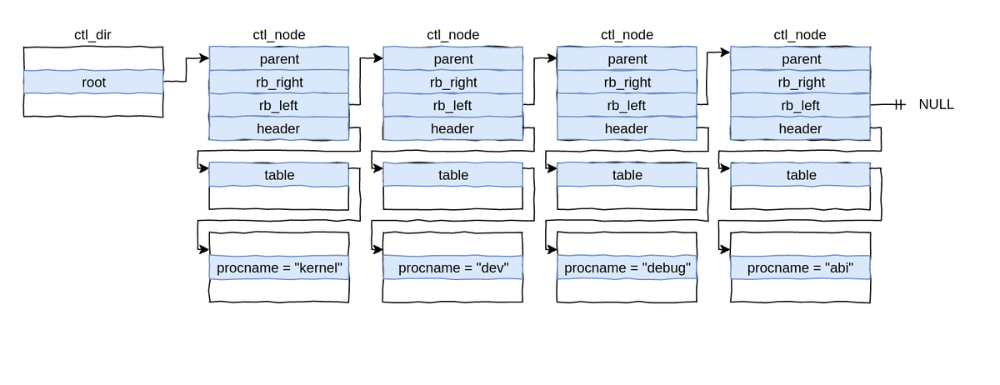
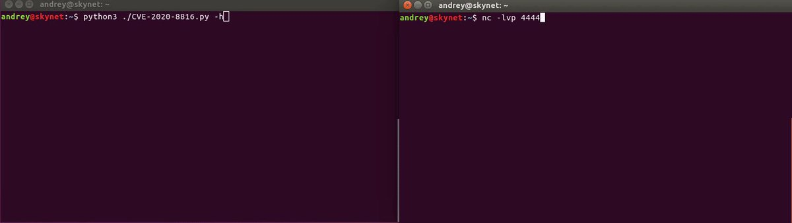

# _ringzer0
**https://twitter.com/_ringzer0/status/1266347819482390530 _at Fri May 29 12:37:02 +0000 2020_**
<blockquote>
Discover how @bluefrostsec exploits #Android Binder to escape the Google #Chrome sandbox, attack the kernel, and obtain root privileges on a Pixel 3 device using CVE-2020-0041. https://t.co/9xtJJFBC3d

Detailed writeup by @esanfelix and @jgrusko with video demo and POC on Github! https://t.co/KwUnhUmy9k
</blockquote>

* https://bit.ly/CVE-2020-0041

<table><tr>
<td></td>
</tr></table>
<table><tr>
<td>Quotes: <code>0</code></td>
<td>Replies: <code>0</code></td>
<td>Retweets: <code>26</code></td>
<td>Favorites: <code>61</code></td>
</tr></table>

---

# theevilbit
**https://twitter.com/theevilbit/status/1266246713150328832 _at Fri May 29 05:55:16 +0000 2020_**
<blockquote>
The 3rd part of my XPC series is up. This time I cover the Microsoft Auto Update LPE vulnerability (CVE-2020-0984) I found last year and was fixed recently. Great example for why proper client verification is extremely important.
https://t.co/6HZKbarrra
</blockquote>

* https://theevilbit.github.io/posts/secure_coding_privilegedhelpertools_part3/

<table><tr>
<td>Quotes: <code>1</code></td>
<td>Replies: <code>0</code></td>
<td>Retweets: <code>43</code></td>
<td>Favorites: <code>84</code></td>
</tr></table>

---

# USCERT_gov
**https://twitter.com/USCERT_gov/status/1266101773435129856 _at Thu May 28 20:19:20 +0000 2020_**
<blockquote>
.@NSAGov has released a cybersecurity advisory on Russian Sandworm APT actors exploiting CVE-2019-10149, a remote code execution vulnerability in Exim. Read more at https://t.co/d77VHReUx7. #Cyber #Cybersecurity #InfoSec
</blockquote>

* https://go.usa.gov/xwgXH

<table><tr>
<td>Quotes: <code>4</code></td>
<td>Replies: <code>3</code></td>
<td>Retweets: <code>119</code></td>
<td>Favorites: <code>161</code></td>
</tr></table>

---

# campuscodi
**https://twitter.com/campuscodi/status/1265991271182741505 _at Thu May 28 13:00:14 +0000 2020_**
<blockquote>
Kaspersky publishes a report on CVE-2019-13720, the Chrome zero-day that was unearthed/patched in October 2019.

Per Kaspersky, the zero-day was used by Operation WizardOpium APT in a classic watering-hole attack on a North Korea-related news site

https://t.co/pItDW2Fh0j
</blockquote>

* https://securelist.com/the-zero-day-exploits-of-operation-wizardopium/97086/

<table><tr>
<td>Quotes: <code>1</code></td>
<td>Replies: <code>1</code></td>
<td>Retweets: <code>23</code></td>
<td>Favorites: <code>45</code></td>
</tr></table>

---

# piedpiper1616
**https://twitter.com/piedpiper1616/status/1265082511245230080 _at Tue May 26 00:49:09 +0000 2020_**
<blockquote>
GitHub - amartinsec/CVE-2020-12800: POC Script for CVE-2020-12800: RCE through Unrestricted File Type Upload - https://t.co/6RIG8P48i3
</blockquote>

* https://github.com/amartinsec/CVE-2020-12800/

<table><tr>
<td>Quotes: <code>1</code></td>
<td>Replies: <code>0</code></td>
<td>Retweets: <code>12</code></td>
<td>Favorites: <code>44</code></td>
</tr></table>

---

# Th3Gundy
**https://twitter.com/Th3Gundy/status/1264596414002270208 _at Sun May 24 16:37:34 +0000 2020_**
<blockquote>
QNAP pre-auth root RCE Exploit (CVE-2019-7192 - CVE-2019-7195)  
https://t.co/lhmRDoa5M4

#QNAP #vulnerability #Exploit #BugBounty https://t.co/YtC1RL1W2x
</blockquote>

* https://github.com/th3gundy/CVE-2019-7192_QNAP_Exploit

<table><tr>
<td></td>
</tr></table>
<table><tr>
<td>Quotes: <code>4</code></td>
<td>Replies: <code>2</code></td>
<td>Retweets: <code>99</code></td>
<td>Favorites: <code>204</code></td>
</tr></table>

---

# wugeej
**https://twitter.com/wugeej/status/1263731877606682624 _at Fri May 22 07:22:13 +0000 2020_**
<blockquote>
CVE-2020-9484: Apache Tomcat Remote Code Execution Vulnerability

[Exploit Condition]

1. Server is configured to use the PersistenceManager with a FileStore
2. The PersistenceManager is configured with sessionAttributeValueClassNameFilter="null"

https://t.co/UbHWoqN2s4
</blockquote>

* https://meterpreter.org/cve-2020-9484-apache-tomcat-remote-code-execution-vulnerability-alert/

<table><tr>
<td>Quotes: <code>1</code></td>
<td>Replies: <code>1</code></td>
<td>Retweets: <code>44</code></td>
<td>Favorites: <code>101</code></td>
</tr></table>

---

# thezdi
**https://twitter.com/thezdi/status/1263515835144048640 _at Thu May 21 17:03:44 +0000 2020_**
<blockquote>
In his first blog for us, @_wmliang_ covers CVE-2020-8871 - a privilege escalation bug in #Parallels Desktop originally submitted by @renorobertr. Read the bug details and patch analysis at https://t.co/oNkaYN1ELI
</blockquote>

* https://bit.ly/2yjHQEy

<table><tr>
<td>Quotes: <code>2</code></td>
<td>Replies: <code>1</code></td>
<td>Retweets: <code>42</code></td>
<td>Favorites: <code>96</code></td>
</tr></table>

---

# AntoineGoichot
**https://twitter.com/AntoineGoichot/status/1262829570836836354 _at Tue May 19 19:36:46 +0000 2020_**
<blockquote>
I have released my exploit for CVE-2020-3153 - Cisco AnyConnect privilege escalation through path traversal https://t.co/1xSxJUjhuJ

My notes on this vuln: https://t.co/reO88J9Bny

Kudos to @yorickkoster for the advisory &amp; for the -ipc help!
Thank you @maxime_tz for the diagrams!
</blockquote>

* https://github.com/goichot/CVE-2020-3153
* https://github.com/goichot/CVE-2020-3153/blob/master/details.md

<table><tr>
<td>Quotes: <code>7</code></td>
<td>Replies: <code>2</code></td>
<td>Retweets: <code>118</code></td>
<td>Favorites: <code>228</code></td>
</tr></table>

---

# netbiosX
**https://twitter.com/netbiosX/status/1261310127090675713 _at Fri May 15 14:59:02 +0000 2020_**
<blockquote>
PrintDemon - A PowerShell Empire launcher PoC using PrintDemon and Faxhell. The module has the Faxhell dll already embedded which leverages CVE-2020-1048 for privilege escalation. https://t.co/Bt695rvJA3
</blockquote>

* https://github.com/BC-SECURITY/Invoke-PrintDemon

<table><tr>
<td>Quotes: <code>2</code></td>
<td>Replies: <code>1</code></td>
<td>Retweets: <code>45</code></td>
<td>Favorites: <code>112</code></td>
</tr></table>

---

# EyalItkin
**https://twitter.com/EyalItkin/status/1260875003177861120 _at Thu May 14 10:10:01 +0000 2020_**
<blockquote>
CVE-2019-0887: Path-Traversal -&gt; RCE in mstsc.exe. Patched with PathCchCanonicalize.

CVE-2020-0655: We replaced '\' with '/', that's it. Patched with a workaround.

As Microsoft didn't patch PathCanonicalize, you need to manually fix your own programs!
https://t.co/kmpK9Ihi3Z
</blockquote>

* https://research.checkpoint.com/2020/reverse-rdp-the-path-not-taken/

<table><tr>
<td>Quotes: <code>5</code></td>
<td>Replies: <code>1</code></td>
<td>Retweets: <code>77</code></td>
<td>Favorites: <code>167</code></td>
</tr></table>

---

# _CPResearch_
**https://twitter.com/_CPResearch_/status/1260861318082564099 _at Thu May 14 09:15:38 +0000 2020_**
<blockquote>
[CPR-Zero] CVE-2020-1143 (Windows 10 Kernel): Use-After-Free in the NtUserGetDCEx function in win32kfull.sys
https://t.co/GkRF3Nk3wN
</blockquote>

* https://cpr-zero.checkpoint.com/vulns/cprid-2152/

<table><tr>
<td>Quotes: <code>1</code></td>
<td>Replies: <code>0</code></td>
<td>Retweets: <code>22</code></td>
<td>Favorites: <code>56</code></td>
</tr></table>

---

# aionescu
**https://twitter.com/aionescu/status/1260466215299973121 _at Wed May 13 07:05:38 +0000 2020_**
<blockquote>
Attackers can exploit CVE-2020-1048 with a single PowerShell command:

Add-PrinterPort -Name c:\windows\system32\ualapi.dll

On an unpatched system, this will install a persistent backdoor, that won't go away *even after you patch*.

See https://t.co/9yMSWNM8VG for more details.
</blockquote>

* https://windows-internals.com/printdemon-cve-2020-1048/

<table><tr>
<td>Quotes: <code>55</code></td>
<td>Replies: <code>32</code></td>
<td>Retweets: <code>1240</code></td>
<td>Favorites: <code>2292</code></td>
</tr></table>

---

# wugeej
**https://twitter.com/wugeej/status/1259674133249458176 _at Mon May 11 02:38:11 +0000 2020_**
<blockquote>
[PoC] A Python script to exploit CVE-2020-8816, a remote code execution vulnerability on the Pi-hole

The exploit requires the path for the www-data user to be /opt/pihole:/usr/local/sbin:/usr/local/bin:/usr/sbin:/usr/bin:/sbin:/bin.

https://t.co/tBbL7yFbmb https://t.co/vk5vCBgBZS
</blockquote>

* https://github.com/AndreyRainchik/CVE-2020-8816

<table><tr>
<td></td>
</tr></table>
<table><tr>
<td>Quotes: <code>1</code></td>
<td>Replies: <code>0</code></td>
<td>Retweets: <code>19</code></td>
<td>Favorites: <code>34</code></td>
</tr></table>

---

# maxpl0it
**https://twitter.com/maxpl0it/status/1258517934718062594 _at Thu May 07 22:03:52 +0000 2020_**
<blockquote>
Here's my exploit for CVE-2020-0674 (Internet Explorer UAF)

Bonus: EMET 5.52 (the final EMET version) doesn't appear to detect this (on Windows x64 it seems)

https://t.co/IxCfpjGBqv
</blockquote>

* https://github.com/maxpl0it/CVE-2020-0674-Exploit

<table><tr>
<td>Quotes: <code>10</code></td>
<td>Replies: <code>5</code></td>
<td>Retweets: <code>214</code></td>
<td>Favorites: <code>467</code></td>
</tr></table>

---

# TheHackersNews
**https://twitter.com/TheHackersNews/status/1257250156652584962 _at Mon May 04 10:06:10 +0000 2020_**
<blockquote>
WARNING — Just within a day after public disclosure of SaltStack RCE #vulnerability (CVE-2020-11651), hackers have started exploiting unpatched servers.

✅ LineageOS [hacked]
✅ Ghost CMS [hacked]
✅ DigiCert [hacked]

Read more: https://t.co/SY54kVTMsK

#infosec
#cybersecurity https://t.co/x9238WFWvS
</blockquote>

* https://thehackernews.com/2020/05/saltstack-rce-exploit.html

<table><tr>
<td></td>
</tr></table>
<table><tr>
<td>Quotes: <code>25</code></td>
<td>Replies: <code>3</code></td>
<td>Retweets: <code>257</code></td>
<td>Favorites: <code>316</code></td>
</tr></table>

---

# 44CON
**https://twitter.com/44CON/status/1257198909127942149 _at Mon May 04 06:42:32 +0000 2020_**
<blockquote>
(From https://t.co/OT552U6KvT): Released a public exploit (Local Privilege Escalation) for SMBv3 bug (CVE-2020-0796) https://t.co/r84NvKVrdc
</blockquote>

* http://github.com
* http://dlvr.it/RVyNv2

<table><tr>
<td>Quotes: <code>1</code></td>
<td>Replies: <code>0</code></td>
<td>Retweets: <code>50</code></td>
<td>Favorites: <code>106</code></td>
</tr></table>

---

# campuscodi
**https://twitter.com/campuscodi/status/1256190520696725507 _at Fri May 01 11:55:33 +0000 2020_**
<blockquote>
Oracle has published a security alert last night warning of attacks against a recently patched WebLogic security bug

- The bug is CVE-2020-2883, a no-auth RCE in WebLogic
- CVSSv3 of 9.8/10
- Bug is patched, but PoC code has been published online

https://t.co/AdyCFcstDx https://t.co/OsOmTh3RoK
</blockquote>

* https://www.zdnet.com/article/oracle-warns-of-attacks-against-recently-patched-weblogic-security-bug/

<table><tr>
<td></td>
</tr></table>
<table><tr>
<td>Quotes: <code>4</code></td>
<td>Replies: <code>2</code></td>
<td>Retweets: <code>56</code></td>
<td>Favorites: <code>57</code></td>
</tr></table>

---

