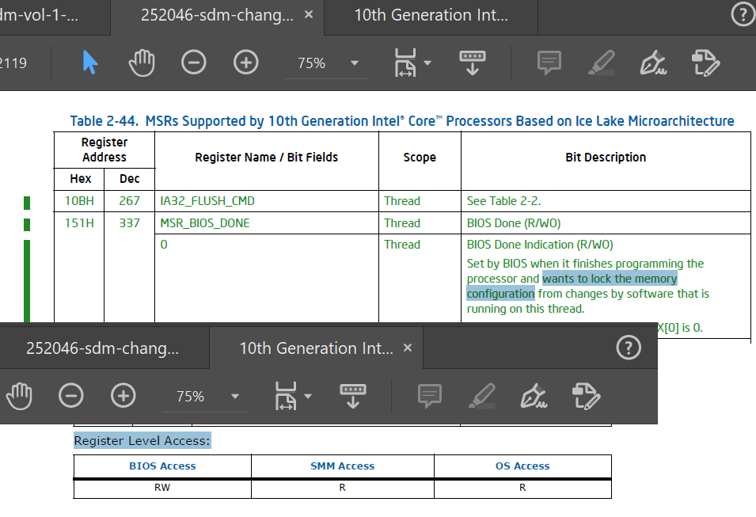
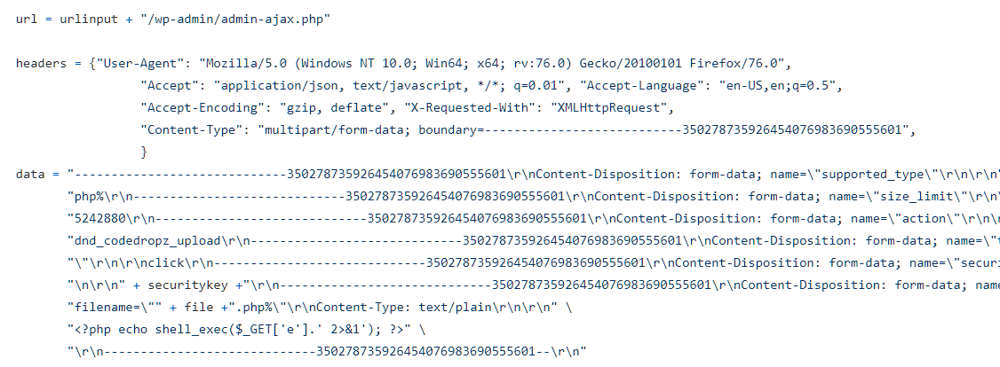
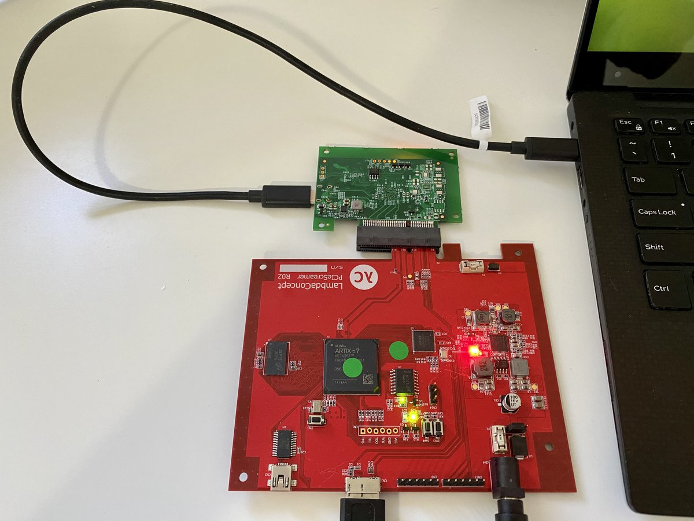

# _ringzer0
**https://twitter.com/_ringzer0/status/1266347819482390530 _at 2020-05-29 12:37:02_**
<blockquote>
Discover how @bluefrostsec exploits #Android Binder to escape the Google #Chrome sandbox, attack the kernel, and obtain root privileges on a Pixel 3 device using CVE-2020-0041. https://t.co/9xtJJFBC3d

Detailed writeup by @esanfelix and @jgrusko with video demo and POC on Github! https://t.co/KwUnhUmy9k
</blockquote>

* https://bit.ly/CVE-2020-0041

<table><tr>
<td></td>
</table></tr>
<table><tr>
<td>Quotes: <code>0</code></td>
<td>Replies: <code>0</code></td>
<td>Retweets: <code>25</code></td>
<td>Favorites: <code>59</code></td>
</tr></table>

---

# theevilbit
**https://twitter.com/theevilbit/status/1266246713150328832 _at 2020-05-29 05:55:16_**
<blockquote>
The 3rd part of my XPC series is up. This time I cover the Microsoft Auto Update LPE vulnerability (CVE-2020-0984) I found last year and was fixed recently. Great example for why proper client verification is extremely important.
https://t.co/6HZKbarrra
</blockquote>

* https://theevilbit.github.io/posts/secure_coding_privilegedhelpertools_part3/

<table><tr>
<td>Quotes: <code>1</code></td>
<td>Replies: <code>0</code></td>
<td>Retweets: <code>43</code></td>
<td>Favorites: <code>82</code></td>
</tr></table>

---

# standa_t
**https://twitter.com/standa_t/status/1266231645541068801 _at 2020-05-29 04:55:24_**
<blockquote>
Intel SDM added the Ice Lake specific MSRs. Ice Lake introduced the concept of the access level to lock the configuration registers as the 2nd line of defense. Once the DONE bit is set, they are automatically RO. @CHIPSEC detects it if the bit is not set  https://t.co/fFoB1y7Dnw https://t.co/vo0yBgY2mE
</blockquote>

* https://github.com/chipsec/chipsec/commit/35a614cbfcc5677667ee4c0a7b5396f155868d5e

<table><tr>
<td></td>
</table></tr>
<table><tr>
<td>Quotes: <code>1</code></td>
<td>Replies: <code>1</code></td>
<td>Retweets: <code>18</code></td>
<td>Favorites: <code>45</code></td>
</tr></table>

---

# USCERT_gov
**https://twitter.com/USCERT_gov/status/1266101773435129856 _at 2020-05-28 20:19:20_**
<blockquote>
.@NSAGov has released a cybersecurity advisory on Russian Sandworm APT actors exploiting CVE-2019-10149, a remote code execution vulnerability in Exim. Read more at https://t.co/d77VHReUx7. #Cyber #Cybersecurity #InfoSec
</blockquote>

* https://go.usa.gov/xwgXH

<table><tr>
<td>Quotes: <code>4</code></td>
<td>Replies: <code>3</code></td>
<td>Retweets: <code>119</code></td>
<td>Favorites: <code>161</code></td>
</tr></table>

---

# campuscodi
**https://twitter.com/campuscodi/status/1265991271182741505 _at 2020-05-28 13:00:14_**
<blockquote>
Kaspersky publishes a report on CVE-2019-13720, the Chrome zero-day that was unearthed/patched in October 2019.

Per Kaspersky, the zero-day was used by Operation WizardOpium APT in a classic watering-hole attack on a North Korea-related news site

https://t.co/pItDW2Fh0j
</blockquote>

* https://securelist.com/the-zero-day-exploits-of-operation-wizardopium/97086/

<table><tr>
<td>Quotes: <code>1</code></td>
<td>Replies: <code>1</code></td>
<td>Retweets: <code>23</code></td>
<td>Favorites: <code>45</code></td>
</tr></table>

---

# cyber_advising
**https://twitter.com/cyber_advising/status/1265933759012114432 _at 2020-05-28 09:11:42_**
<blockquote>
CVE-2020-11492:
Proof-of-Concept (PoC) for Docker Desktop for Windows privilege escalation vulnerability. This vulnerability was patched in Docker version 2.3.0.2 on May 11th, 2020.

https://t.co/Dlw8OcIycj https://t.co/DXUMRdPcUt
</blockquote>

* https://github.com/joshfinley/CVE-2020-11492/tree/master/CVE-2020-11492

<table><tr>
<td></td>
</table></tr>
<table><tr>
<td>Quotes: <code>0</code></td>
<td>Replies: <code>0</code></td>
<td>Retweets: <code>2</code></td>
<td>Favorites: <code>5</code></td>
</tr></table>

---

# cyber_advising
**https://twitter.com/cyber_advising/status/1265362491258929153 _at 2020-05-26 19:21:41_**
<blockquote>
CVE-2020-12800: WordPress Plugin "Drag and Drop Multiple File Upload - Contact Form 7" 1.3.3.2 - Unauthenticated Remote Code Execution

POC
https://t.co/31qt7kPxi1 https://t.co/cIFxmnxY0B
</blockquote>

* https://github.com/amartinsec/CVE-2020-12800/blob/master/exploit.py

<table><tr>
<td></td>
</table></tr>
<table><tr>
<td>Quotes: <code>0</code></td>
<td>Replies: <code>0</code></td>
<td>Retweets: <code>2</code></td>
<td>Favorites: <code>9</code></td>
</tr></table>

---

# piedpiper1616
**https://twitter.com/piedpiper1616/status/1265082511245230080 _at 2020-05-26 00:49:09_**
<blockquote>
GitHub - amartinsec/CVE-2020-12800: POC Script for CVE-2020-12800: RCE through Unrestricted File Type Upload - https://t.co/6RIG8P48i3
</blockquote>

* https://github.com/amartinsec/CVE-2020-12800/

<table><tr>
<td>Quotes: <code>1</code></td>
<td>Replies: <code>0</code></td>
<td>Retweets: <code>13</code></td>
<td>Favorites: <code>43</code></td>
</tr></table>

---

# Sec_GroundZero
**https://twitter.com/Sec_GroundZero/status/1264630743373885440 _at 2020-05-24 18:53:59_**
<blockquote>
Been playing with @Oddvarmoe CMSTP (T1191) UAC bypass and made a self contained script to run a  beacon. Couldn't find a way to load it via the INF file so a file is dropped on disk. PowerShell script still needs polishing. https://t.co/t9pFm8BBDO
</blockquote>

* https://github.com/secgroundzero/T1191--CMSTP

<table><tr>
<td>Quotes: <code>0</code></td>
<td>Replies: <code>1</code></td>
<td>Retweets: <code>26</code></td>
<td>Favorites: <code>54</code></td>
</tr></table>

---

# Th3Gundy
**https://twitter.com/Th3Gundy/status/1264596414002270208 _at 2020-05-24 16:37:34_**
<blockquote>
QNAP pre-auth root RCE Exploit (CVE-2019-7192 - CVE-2019-7195)  
https://t.co/lhmRDoa5M4

#QNAP #vulnerability #Exploit #BugBounty https://t.co/YtC1RL1W2x
</blockquote>

* https://github.com/th3gundy/CVE-2019-7192_QNAP_Exploit

<table><tr>
<td></td>
</table></tr>
<table><tr>
<td>Quotes: <code>4</code></td>
<td>Replies: <code>2</code></td>
<td>Retweets: <code>100</code></td>
<td>Favorites: <code>203</code></td>
</tr></table>

---

# wugeej
**https://twitter.com/wugeej/status/1263731877606682624 _at 2020-05-22 07:22:13_**
<blockquote>
CVE-2020-9484: Apache Tomcat Remote Code Execution Vulnerability

[Exploit Condition]

1. Server is configured to use the PersistenceManager with a FileStore
2. The PersistenceManager is configured with sessionAttributeValueClassNameFilter="null"

https://t.co/UbHWoqN2s4
</blockquote>

* https://meterpreter.org/cve-2020-9484-apache-tomcat-remote-code-execution-vulnerability-alert/

<table><tr>
<td>Quotes: <code>1</code></td>
<td>Replies: <code>1</code></td>
<td>Retweets: <code>44</code></td>
<td>Favorites: <code>100</code></td>
</tr></table>

---

# thezdi
**https://twitter.com/thezdi/status/1263515835144048640 _at 2020-05-21 17:03:44_**
<blockquote>
In his first blog for us, @_wmliang_ covers CVE-2020-8871 - a privilege escalation bug in #Parallels Desktop originally submitted by @renorobertr. Read the bug details and patch analysis at https://t.co/oNkaYN1ELI
</blockquote>

* https://bit.ly/2yjHQEy

<table><tr>
<td>Quotes: <code>2</code></td>
<td>Replies: <code>1</code></td>
<td>Retweets: <code>42</code></td>
<td>Favorites: <code>96</code></td>
</tr></table>

---

# kumagami331
**https://twitter.com/kumagami331/status/1262973482507177984 _at 2020-05-20 05:08:37_**
<blockquote>
［CVE-2020-8165］ Ruby on Rails MemCacheStore and RedisCacheStore context dependency RCE
PoC: https://t.co/2mPQNEgZyq
</blockquote>

* https://github.com/masahiro331/CVE-2020-8165

<table><tr>
<td>Quotes: <code>0</code></td>
<td>Replies: <code>0</code></td>
<td>Retweets: <code>2</code></td>
<td>Favorites: <code>4</code></td>
</tr></table>

---

# AntoineGoichot
**https://twitter.com/AntoineGoichot/status/1262829570836836354 _at 2020-05-19 19:36:46_**
<blockquote>
I have released my exploit for CVE-2020-3153 - Cisco AnyConnect privilege escalation through path traversal https://t.co/1xSxJUjhuJ

My notes on this vuln: https://t.co/reO88J9Bny

Kudos to @yorickkoster for the advisory &amp; for the -ipc help!
Thank you @maxime_tz for the diagrams!
</blockquote>

* https://github.com/goichot/CVE-2020-3153
* https://github.com/goichot/CVE-2020-3153/blob/master/details.md

<table><tr>
<td>Quotes: <code>7</code></td>
<td>Replies: <code>2</code></td>
<td>Retweets: <code>117</code></td>
<td>Favorites: <code>225</code></td>
</tr></table>

---

# standa_t
**https://twitter.com/standa_t/status/1262375705691684865 _at 2020-05-18 13:33:16_**
<blockquote>
If you are curious about how DMA remapping (VT-d) can be configured to protect memory from DMA, here is a short introduction to it with sample code.
https://t.co/dSUeSkuiua

Code: https://t.co/dH1ZLqj2Ws https://t.co/URjPfmAg2R
</blockquote>

* https://standa-note.blogspot.com/2020/05/introductory-study-of-iommu-vt-d-and.html
* https://github.com/tandasat/HelloIommuPkg

<table><tr>
<td></td>
</table></tr>
<table><tr>
<td>Quotes: <code>1</code></td>
<td>Replies: <code>3</code></td>
<td>Retweets: <code>94</code></td>
<td>Favorites: <code>244</code></td>
</tr></table>

---

# netbiosX
**https://twitter.com/netbiosX/status/1261310127090675713 _at 2020-05-15 14:59:02_**
<blockquote>
PrintDemon - A PowerShell Empire launcher PoC using PrintDemon and Faxhell. The module has the Faxhell dll already embedded which leverages CVE-2020-1048 for privilege escalation. https://t.co/Bt695rvJA3
</blockquote>

* https://github.com/BC-SECURITY/Invoke-PrintDemon

<table><tr>
<td>Quotes: <code>2</code></td>
<td>Replies: <code>1</code></td>
<td>Retweets: <code>46</code></td>
<td>Favorites: <code>110</code></td>
</tr></table>

---

# _mohemiv
**https://twitter.com/_mohemiv/status/1261110348897288192 _at 2020-05-15 01:45:12_**
<blockquote>
PoC for RCE in MS Exchange: https://t.co/xalbJ8XlX1 https://t.co/EnBvGpHDIo
</blockquote>

* https://github.com/SecureAuthCorp/impacket/pull/857

<table><tr>
<td></td>
</table></tr>
<table><tr>
<td>Quotes: <code>3</code></td>
<td>Replies: <code>2</code></td>
<td>Retweets: <code>166</code></td>
<td>Favorites: <code>384</code></td>
</tr></table>

---

# EyalItkin
**https://twitter.com/EyalItkin/status/1260875003177861120 _at 2020-05-14 10:10:01_**
<blockquote>
CVE-2019-0887: Path-Traversal -&gt; RCE in mstsc.exe. Patched with PathCchCanonicalize.

CVE-2020-0655: We replaced '\' with '/', that's it. Patched with a workaround.

As Microsoft didn't patch PathCanonicalize, you need to manually fix your own programs!
https://t.co/kmpK9Ihi3Z
</blockquote>

* https://research.checkpoint.com/2020/reverse-rdp-the-path-not-taken/

<table><tr>
<td>Quotes: <code>5</code></td>
<td>Replies: <code>1</code></td>
<td>Retweets: <code>77</code></td>
<td>Favorites: <code>167</code></td>
</tr></table>

---

# _CPResearch_
**https://twitter.com/_CPResearch_/status/1260861318082564099 _at 2020-05-14 09:15:38_**
<blockquote>
[CPR-Zero] CVE-2020-1143 (Windows 10 Kernel): Use-After-Free in the NtUserGetDCEx function in win32kfull.sys
https://t.co/GkRF3Nk3wN
</blockquote>

* https://cpr-zero.checkpoint.com/vulns/cprid-2152/

<table><tr>
<td>Quotes: <code>1</code></td>
<td>Replies: <code>0</code></td>
<td>Retweets: <code>22</code></td>
<td>Favorites: <code>55</code></td>
</tr></table>

---

# gweeperx
**https://twitter.com/gweeperx/status/1260511047808671745 _at 2020-05-13 10:03:47_**
<blockquote>
Exploit code and Write-up for Symantec Endpoint Protection (SEP) 14.2 RU2 Elevation of Privileges (CVE-2020-5837) 

https://t.co/Y3AFuqXl1E

#Symantec #0day #exploit #vulnerability #EoP #RedyOpsLabs #cybersecurity #infosec #bugbounty #redteam #SEP #SEPM
</blockquote>

* https://labs.redyops.com/index.php/2020/04/27/symantec-endpoint-protection-sep-14-2-eop-via-arbitrary-write/

<table><tr>
<td>Quotes: <code>6</code></td>
<td>Replies: <code>3</code></td>
<td>Retweets: <code>192</code></td>
<td>Favorites: <code>387</code></td>
</tr></table>

---

# aionescu
**https://twitter.com/aionescu/status/1260466215299973121 _at 2020-05-13 07:05:38_**
<blockquote>
Attackers can exploit CVE-2020-1048 with a single PowerShell command:

Add-PrinterPort -Name c:\windows\system32\ualapi.dll

On an unpatched system, this will install a persistent backdoor, that won't go away *even after you patch*.

See https://t.co/9yMSWNM8VG for more details.
</blockquote>

* https://windows-internals.com/printdemon-cve-2020-1048/

<table><tr>
<td>Quotes: <code>55</code></td>
<td>Replies: <code>32</code></td>
<td>Retweets: <code>1235</code></td>
<td>Favorites: <code>2273</code></td>
</tr></table>

---

# netbiosX
**https://twitter.com/netbiosX/status/1259963564787404805 _at 2020-05-11 21:48:17_**
<blockquote>
RoguePotato - Another Windows Local Privilege Escalation from Service Account to System https://t.co/WD5YQDX2Zp
</blockquote>

* https://github.com/antonioCoco/RoguePotato

<table><tr>
<td>Quotes: <code>0</code></td>
<td>Replies: <code>0</code></td>
<td>Retweets: <code>38</code></td>
<td>Favorites: <code>90</code></td>
</tr></table>

---

# wugeej
**https://twitter.com/wugeej/status/1259674133249458176 _at 2020-05-11 02:38:11_**
<blockquote>
[PoC] A Python script to exploit CVE-2020-8816, a remote code execution vulnerability on the Pi-hole

The exploit requires the path for the www-data user to be /opt/pihole:/usr/local/sbin:/usr/local/bin:/usr/sbin:/usr/bin:/sbin:/bin.

https://t.co/tBbL7yFbmb https://t.co/vk5vCBgBZS
</blockquote>

* https://github.com/AndreyRainchik/CVE-2020-8816

<table><tr>
<td></td>
</table></tr>
<table><tr>
<td>Quotes: <code>1</code></td>
<td>Replies: <code>0</code></td>
<td>Retweets: <code>19</code></td>
<td>Favorites: <code>34</code></td>
</tr></table>

---

# Madrobot_
**https://twitter.com/Madrobot_/status/1259226657241436160 _at 2020-05-09 21:00:05_**
<blockquote>
Here I'm adding all WordPress plugin and theme known and unknown POC's on my repository
 
https://t.co/m5vXnGFmxq

#wordpress #exploits #poc #rce #bugbounty #bugbountytips #bugbountytip #hackerone #bugcrowd
</blockquote>

* https://github.com/Mad-robot/wordpress-exploits

<table><tr>
<td>Quotes: <code>2</code></td>
<td>Replies: <code>1</code></td>
<td>Retweets: <code>64</code></td>
<td>Favorites: <code>112</code></td>
</tr></table>

---

# faryadR
**https://twitter.com/faryadR/status/1258817889857081344 _at 2020-05-08 17:55:47_**
<blockquote>
CVE-2020-0674

CVE-2020-0674 is a use-after-free vulnerability in the legacy jscript engine. It can be triggered in Internet Explorer. The exploit here is written by maxpl0it but the vulnerability itself was discovered by Qihoo 360

@maxpl0it
 https://t.co/gzjeZBkKSZ
</blockquote>

* https://github.com/maxpl0it/CVE-2020-0674-Exploit

<table><tr>
<td>Quotes: <code>0</code></td>
<td>Replies: <code>0</code></td>
<td>Retweets: <code>0</code></td>
<td>Favorites: <code>1</code></td>
</tr></table>

---

# maxpl0it
**https://twitter.com/maxpl0it/status/1258517934718062594 _at 2020-05-07 22:03:52_**
<blockquote>
Here's my exploit for CVE-2020-0674 (Internet Explorer UAF)

Bonus: EMET 5.52 (the final EMET version) doesn't appear to detect this (on Windows x64 it seems)

https://t.co/IxCfpjGBqv
</blockquote>

* https://github.com/maxpl0it/CVE-2020-0674-Exploit

<table><tr>
<td>Quotes: <code>10</code></td>
<td>Replies: <code>5</code></td>
<td>Retweets: <code>207</code></td>
<td>Favorites: <code>470</code></td>
</tr></table>

---

# DirectoryRanger
**https://twitter.com/DirectoryRanger/status/1257977876613341188 _at 2020-05-06 10:17:52_**
<blockquote>
Privesc - Windows batch script that finds misconfiguration issues which can lead to privilege escalation.

https://t.co/kMDKueHCTX
</blockquote>

* https://github.com/enjoiz/Privesc

<table><tr>
<td>Quotes: <code>2</code></td>
<td>Replies: <code>0</code></td>
<td>Retweets: <code>53</code></td>
<td>Favorites: <code>190</code></td>
</tr></table>

---

# TheHackersNews
**https://twitter.com/TheHackersNews/status/1257250156652584962 _at 2020-05-04 10:06:10_**
<blockquote>
WARNING — Just within a day after public disclosure of SaltStack RCE #vulnerability (CVE-2020-11651), hackers have started exploiting unpatched servers.

✅ LineageOS [hacked]
✅ Ghost CMS [hacked]
✅ DigiCert [hacked]

Read more: https://t.co/SY54kVTMsK

#infosec
#cybersecurity https://t.co/x9238WFWvS
</blockquote>

* https://thehackernews.com/2020/05/saltstack-rce-exploit.html

<table><tr>
<td></td>
</table></tr>
<table><tr>
<td>Quotes: <code>25</code></td>
<td>Replies: <code>3</code></td>
<td>Retweets: <code>247</code></td>
<td>Favorites: <code>312</code></td>
</tr></table>

---

# 44CON
**https://twitter.com/44CON/status/1257198909127942149 _at 2020-05-04 06:42:32_**
<blockquote>
(From https://t.co/OT552U6KvT): Released a public exploit (Local Privilege Escalation) for SMBv3 bug (CVE-2020-0796) https://t.co/r84NvKVrdc
</blockquote>

* http://github.com
* http://dlvr.it/RVyNv2

<table><tr>
<td>Quotes: <code>1</code></td>
<td>Replies: <code>0</code></td>
<td>Retweets: <code>49</code></td>
<td>Favorites: <code>104</code></td>
</tr></table>

---

# standa_t
**https://twitter.com/standa_t/status/1256596291993436160 _at 2020-05-02 14:47:57_**
<blockquote>
Good stuff. Pushed an example implementation of NMI handling during VMX root-mode for type-1. 
https://t.co/thFwMofm6F 
The previous commit includes a test program I used when I wrote it. Should be useful.
</blockquote>

* https://github.com/tandasat/MiniVisorPkg/commit/0dac000aa6a3abd2af0f7b7d139c1811cb001b24

<table><tr>
<td>Quotes: <code>0</code></td>
<td>Replies: <code>1</code></td>
<td>Retweets: <code>7</code></td>
<td>Favorites: <code>43</code></td>
</tr></table>

---

# Intel80x86
**https://twitter.com/Intel80x86/status/1256569805504753666 _at 2020-05-02 13:02:42_**
<blockquote>
Yesterday, I saw an interesting post in the UC forum and it turns out to be a perfect bypass for most of the hypervisors that virtualize already running systems including my hypervisor &amp; possibly other HVs so it worth a tweet.
https://t.co/b7Dh4dgGr6

PoC:
https://t.co/UTClKAc677
</blockquote>

* https://www.unknowncheats.me/forum/c-and-c-/390593-vm-escape-via-nmi.html#post2772568
* https://github.com/SinaKarvandi/Misc/tree/master/HypervisorBypassWithNMI

<table><tr>
<td>Quotes: <code>1</code></td>
<td>Replies: <code>4</code></td>
<td>Retweets: <code>79</code></td>
<td>Favorites: <code>242</code></td>
</tr></table>

---

# campuscodi
**https://twitter.com/campuscodi/status/1256190520696725507 _at 2020-05-01 11:55:33_**
<blockquote>
Oracle has published a security alert last night warning of attacks against a recently patched WebLogic security bug

- The bug is CVE-2020-2883, a no-auth RCE in WebLogic
- CVSSv3 of 9.8/10
- Bug is patched, but PoC code has been published online

https://t.co/AdyCFcstDx https://t.co/OsOmTh3RoK
</blockquote>

* https://www.zdnet.com/article/oracle-warns-of-attacks-against-recently-patched-weblogic-security-bug/

<table><tr>
<td></td>
</table></tr>
<table><tr>
<td>Quotes: <code>4</code></td>
<td>Replies: <code>2</code></td>
<td>Retweets: <code>56</code></td>
<td>Favorites: <code>57</code></td>
</tr></table>

---

