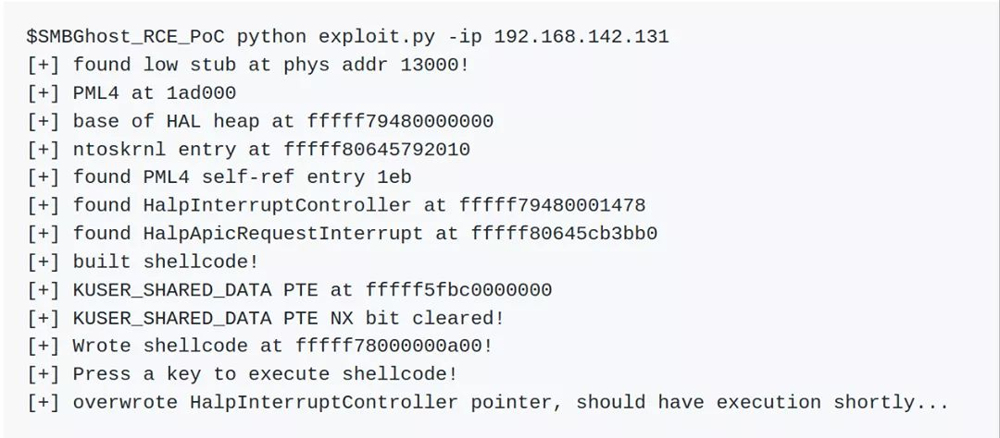
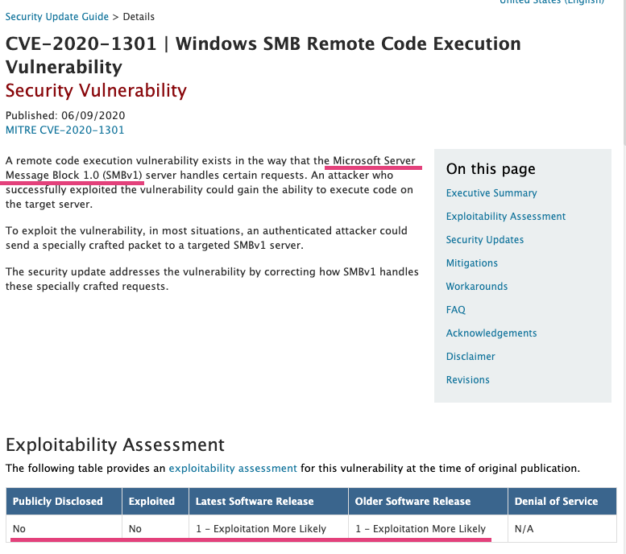

# matrosov
**https://twitter.com/matrosov/status/1278115699777392640 _at 2020-06-30 23:58:23_**
<blockquote>
#efiXplorer v1.0 [REcon Editon] released! We try to make UEFI RE easier, current version of IDA plugin supports:

- EFI Protocols and Boot/Runtime Services identification
- EFI GUID's recogniton

Stay tuned more features coming!
https://t.co/siZ88grDgI

@yeggorv @p41ll @isciurus
</blockquote>

* https://github.com/binarly-io/efiXplorer/releases/tag/v1.0

<table><tr>
<td>Quotes: <code>5</code></td>
<td>Replies: <code>2</code></td>
<td>Retweets: <code>114</code></td>
<td>Favorites: <code>257</code></td>
</table></tr>

---

# campuscodi
**https://twitter.com/campuscodi/status/1278041873224019968 _at 2020-06-30 19:05:02_**
<blockquote>
Write-up on the new ZombieVPN vulnerability: https://t.co/AKhSxwjNyA

Bug impacts a VPN SDK used by several antivirus companies (Bitdefender, Kaspersky, McAfee)

PoC: https://t.co/oR5Izijc5M
Demo: https://t.co/WBrZFWjha1 https://t.co/V6W8oRjv4O
</blockquote>

* https://0xsha.io/posts/zombievpn-breaking-that-internet-security
* https://github.com/0xsha/ZombieVPN
* https://www.youtube.com/watch?v=UmXgNjFZ3hc&feature=youtu.be

<table><tr>
<td></td>
</table></tr>
<table><tr>
<td>Quotes: <code>0</code></td>
<td>Replies: <code>1</code></td>
<td>Retweets: <code>24</code></td>
<td>Favorites: <code>63</code></td>
</table></tr>

---

# pwn_expoit
**https://twitter.com/pwn_expoit/status/1277861624963952641 _at 2020-06-30 07:08:47_**
<blockquote>
i forgot about my bug :D i reported android sbx in April. i will soon post writeup about Exploitation using it. https://t.co/YH4STKbHQw
[$20000][1073015] High CVE-2020-6465: Use after free in reader mode. Reported by Woojin Oh(@pwn_expoit) of STEALIEN on 2020-04-21
</blockquote>

* https://chromereleases.googleblog.com/2020/05/stable-channel-update-for-desktop_19.html

<table><tr>
<td>Quotes: <code>0</code></td>
<td>Replies: <code>3</code></td>
<td>Retweets: <code>21</code></td>
<td>Favorites: <code>128</code></td>
</table></tr>

---

# misaelban
**https://twitter.com/misaelban/status/1277592819897688065 _at 2020-06-29 13:20:39_**
<blockquote>
#metasploit module for #Vulnerability #CVE-2020-8515 Unauthenticated RCE in #Draytek  #Vigor 2960, 3900 &amp; 300 #hacking &amp; #Pentesting https://t.co/d4mnNwCcq1 @metasploit @rapid7 #CyberSecurity #infosec
</blockquote>

* https://github.com/skullarmy/web-exploits/blob/master/cve-2020-8515/draytek_unauth_code_exec.rb

<table><tr>
<td>Quotes: <code>0</code></td>
<td>Replies: <code>0</code></td>
<td>Retweets: <code>2</code></td>
<td>Favorites: <code>0</code></td>
</table></tr>

---

# ptrYudai
**https://twitter.com/ptrYudai/status/1277449435186790401 _at 2020-06-29 03:50:53_**
<blockquote>
供養
https://t.co/yNnFZTdsR8
</blockquote>

* https://gist.github.com/ptr-yudai/de039d45ea9b1befd5279fe24ec50183

<table><tr>
<td>Quotes: <code>1</code></td>
<td>Replies: <code>0</code></td>
<td>Retweets: <code>13</code></td>
<td>Favorites: <code>54</code></td>
</table></tr>

---

# 33y0re
**https://twitter.com/33y0re/status/1277433535406710784 _at 2020-06-29 02:47:43_**
<blockquote>
Absolute blasphemy that I had been writing kernel exploits in Python. Although the code isn't "pretty", I rewrote my HEVD exploits for SMEP bypass via PTE overwrite and kCFG bypass via abusing IATs in C and started @dhn_'s CVE. SO much more power with C!
https://t.co/PeGKPk0zfv https://t.co/YFggBAei2M
</blockquote>

* https://github.com/connormcgarr/Kernel-Exploits/blob/master/README.md

<table><tr>
<td></td>
</table></tr>
<table><tr>
<td>Quotes: <code>1</code></td>
<td>Replies: <code>3</code></td>
<td>Retweets: <code>76</code></td>
<td>Favorites: <code>262</code></td>
</table></tr>

---

# ptracesecurity
**https://twitter.com/ptracesecurity/status/1276927201645125639 _at 2020-06-27 17:15:43_**
<blockquote>
CVE-2020-10665 Docker Desktop Local Privilege Escalation  https://t.co/x2tFjum5dB  #Pentesting #Windows #ReverseShell #CyberSecurity #Infosec https://t.co/xRGneYxkC2
</blockquote>

* https://github.com/spaceraccoon/CVE-2020-10665

<table><tr>
<td></td>
</table></tr>
<table><tr>
<td>Quotes: <code>1</code></td>
<td>Replies: <code>0</code></td>
<td>Retweets: <code>25</code></td>
<td>Favorites: <code>33</code></td>
</table></tr>

---

# piedpiper1616
**https://twitter.com/piedpiper1616/status/1276712486280982529 _at 2020-06-27 03:02:31_**
<blockquote>
GitHub - V1n1v131r4/Wing-FTP-Server-6.3.8---Remote-Code-Execution: This PoC explain how to exploit Wing FTP Server 6.3.8 to get Remote Code Execution - https://t.co/qYKumNVDje
</blockquote>

* https://github.com/V1n1v131r4/Wing-FTP-Server-6.3.8---Remote-Code-Execution

<table><tr>
<td>Quotes: <code>0</code></td>
<td>Replies: <code>0</code></td>
<td>Retweets: <code>27</code></td>
<td>Favorites: <code>39</code></td>
</table></tr>

---

# Alra3ees
**https://twitter.com/Alra3ees/status/1276620412949012481 _at 2020-06-26 20:56:39_**
<blockquote>
XSS-Session-Hijacking-Simulator: Exploiting stored XSS vulnerability to hijack sessions https://t.co/rPub42A501
</blockquote>

* https://github.com/mohafiz/XSS-Session-Hijacking-Simulator

<table><tr>
<td>Quotes: <code>0</code></td>
<td>Replies: <code>0</code></td>
<td>Retweets: <code>24</code></td>
<td>Favorites: <code>70</code></td>
</table></tr>

---

# i_bo0om
**https://twitter.com/i_bo0om/status/1276503780687777792 _at 2020-06-26 13:13:12_**
<blockquote>
Apache Tomcat RCE by deserialization (CVE-2020-9484) 

https://t.co/jvURLAvdVQ
</blockquote>

* https://www.redtimmy.com/java-hacking/apache-tomcat-rce-by-deserialization-cve-2020-9484-write-up-and-exploit/

<table><tr>
<td>Quotes: <code>1</code></td>
<td>Replies: <code>1</code></td>
<td>Retweets: <code>43</code></td>
<td>Favorites: <code>100</code></td>
</table></tr>

---

# movaxbx2
**https://twitter.com/movaxbx2/status/1276461577395335170 _at 2020-06-26 10:25:30_**
<blockquote>
Microsoft Windows LNK Remote Code Execution Vulnerability – CVE-2020-1299 https://t.co/QQ6OtWE04U
</blockquote>

* https://movaxbx.ru/2020/06/26/microsoft-windows-lnk-remote-code-execution-vulnerability-cve-2020-1299/

<table><tr>
<td>Quotes: <code>7</code></td>
<td>Replies: <code>8</code></td>
<td>Retweets: <code>244</code></td>
<td>Favorites: <code>426</code></td>
</table></tr>

---

# sw33tLie
**https://twitter.com/sw33tLie/status/1276267096633225217 _at 2020-06-25 21:32:42_**
<blockquote>
Also, if you find /jolokia you may be able to achieve a RCE as well https://t.co/iQjozuvnFe
</blockquote>

* https://github.com/ba0zi/Spring-Boot-Actuator-Exploit

<table><tr>
<td>Quotes: <code>1</code></td>
<td>Replies: <code>1</code></td>
<td>Retweets: <code>12</code></td>
<td>Favorites: <code>42</code></td>
</table></tr>

---

# pedrib1337
**https://twitter.com/pedrib1337/status/1276156029210951681 _at 2020-06-25 14:11:21_**
<blockquote>
Here's the exploit and write-up of another Pwn2Own Tokyo 2019 win with @RabbitPro: Netgear R6700 upnpd RCE!
https://t.co/DT202rJjzO

Missing those good times in Tokyo!

Video: https://t.co/AfFvPUsKQl
</blockquote>

* https://github.com/pedrib/PoC/blob/master/advisories/Pwn2Own/Tokyo_2019/tokyo_drift/tokyo_drift.md
* https://github.com/pedrib/PoC/blob/master/advisories/Pwn2Own/Tokyo_2019/tokyo_drift/tokyo_drift.mp4

<table><tr>
<td>Quotes: <code>1</code></td>
<td>Replies: <code>6</code></td>
<td>Retweets: <code>39</code></td>
<td>Favorites: <code>139</code></td>
</table></tr>

---

# gannimo
**https://twitter.com/gannimo/status/1276141712277110784 _at 2020-06-25 13:14:28_**
<blockquote>
Quick permission comparison for different Android apps. #SwissCovid only asks for permissions related to digital contact tracing, nothing more. Full source code: https://t.co/I7xmiPOB3n https://t.co/wvGRVmiRTP
</blockquote>

* https://github.com/DP-3T/dp3t-app-android-ch

<table><tr>
<td></td>
</table></tr>
<table><tr>
<td>Quotes: <code>50</code></td>
<td>Replies: <code>22</code></td>
<td>Retweets: <code>412</code></td>
<td>Favorites: <code>762</code></td>
</table></tr>

---

# spaceraccoonsec
**https://twitter.com/spaceraccoonsec/status/1276123691156254720 _at 2020-06-25 12:02:51_**
<blockquote>
Wrote the first public exploit of CVE-2020-10665 Docker Desktop Local Privilege Escalation! It was challenging picking up C++ as well as multiple exploit stages (hard link spraying, DLL overwrite, printer API call) but learned a lot :) https://t.co/zMcO3keyfc https://t.co/nqSUTbQT5k
</blockquote>

* https://github.com/spaceraccoon/CVE-2020-10665

<table><tr>
<td></td>
</table></tr>
<table><tr>
<td>Quotes: <code>1</code></td>
<td>Replies: <code>7</code></td>
<td>Retweets: <code>174</code></td>
<td>Favorites: <code>582</code></td>
</table></tr>

---

# EyalItkin
**https://twitter.com/EyalItkin/status/1275835583198347265 _at 2020-06-24 16:58:01_**
<blockquote>
In his latest blog, @oct0xor confirms our attribution of Magniber's LPE exploit (probably CVE-2018-8641) to Volodya.

This is just 1 of 11(!) LPE exploits by this actor that we've analyzed. More details in the upcoming VB2020 talk by @megabeets_ and I.

https://t.co/Cs8o0WDn9J
</blockquote>

* https://securelist.com/magnitude-exploit-kit-evolution/97436/

<table><tr>
<td>Quotes: <code>0</code></td>
<td>Replies: <code>0</code></td>
<td>Retweets: <code>6</code></td>
<td>Favorites: <code>31</code></td>
</table></tr>

---

# standa_t
**https://twitter.com/standa_t/status/1275810331445493760 _at 2020-06-24 15:17:41_**
<blockquote>
It was all fun and game until I discover my AMD HV was unstable on a device without a serial port. I ended up with debugging it through DMA with PCILeech (thx @UlfFrisk for the project)

But, can anyone suggest what else I could do if DMA is not an option?
https://t.co/n8L23ySkW8 https://t.co/4FgzhiZwqW
</blockquote>

* https://github.com/tandasat/HelloAmdHvPkg/issues/1

<table><tr>
<td></td>
</table></tr>
<table><tr>
<td>Quotes: <code>0</code></td>
<td>Replies: <code>6</code></td>
<td>Retweets: <code>7</code></td>
<td>Favorites: <code>63</code></td>
</table></tr>

---

# QuoSecGmbH
**https://twitter.com/QuoSecGmbH/status/1275711712440786946 _at 2020-06-24 08:45:48_**
<blockquote>
We have a new update for grap, our a tool to match binaries at the assembly code level, matching control flow graphs.

- python3
- embedded pattern editor for the #IDAPro plugin
- easier pattern generation for whole functions

https://t.co/eIDT7KscVh https://t.co/ng64b1uGMV
</blockquote>

* https://github.com/QuoSecGmbH/grap

<table><tr>
<td></td>
</table></tr>
<table><tr>
<td>Quotes: <code>4</code></td>
<td>Replies: <code>0</code></td>
<td>Retweets: <code>45</code></td>
<td>Favorites: <code>102</code></td>
</table></tr>

---

# binitamshah
**https://twitter.com/binitamshah/status/1275091511852404736 _at 2020-06-22 15:41:21_**
<blockquote>
SecretFinder : A python script for find sensitive data (apikeys, accesstoken,jwt,..) and search anything on javascript files : https://t.co/nA3MNZpJ3x credits @m4ll0k2 https://t.co/HyZP1R3sDi
</blockquote>

* https://github.com/m4ll0k/SecretFinder

<table><tr>
<td></td>
</table></tr>
<table><tr>
<td>Quotes: <code>1</code></td>
<td>Replies: <code>1</code></td>
<td>Retweets: <code>85</code></td>
<td>Favorites: <code>177</code></td>
</table></tr>

---

# binitamshah
**https://twitter.com/binitamshah/status/1275089336266928128 _at 2020-06-22 15:32:42_**
<blockquote>
hmmcookies : Grab cookies from Firefox, Chrome, Opera using a shortcut file (bypass UAC) : https://t.co/nxuL1uMJ1u credits @linux_choice https://t.co/92nv3GRZot
</blockquote>

* https://github.com/thelinuxchoice/hmmcookies

<table><tr>
<td></td>
</table></tr>
<table><tr>
<td>Quotes: <code>0</code></td>
<td>Replies: <code>3</code></td>
<td>Retweets: <code>55</code></td>
<td>Favorites: <code>126</code></td>
</table></tr>

---

# binitamshah
**https://twitter.com/binitamshah/status/1275088770719641600 _at 2020-06-22 15:30:27_**
<blockquote>
OSS-Fuzz : Continuous fuzzing of open source software : https://t.co/gr8qYoTSdn https://t.co/gaBIhN6KTN
</blockquote>

* https://github.com/google/oss-fuzz

<table><tr>
<td></td>
</table></tr>
<table><tr>
<td>Quotes: <code>0</code></td>
<td>Replies: <code>0</code></td>
<td>Retweets: <code>32</code></td>
<td>Favorites: <code>100</code></td>
</table></tr>

---

# binitamshah
**https://twitter.com/binitamshah/status/1275081920934748160 _at 2020-06-22 15:03:14_**
<blockquote>
Introducing Axiom - The Dynamic Pwnstation Orchestrator for Red Team &amp; Bug Bounty : https://t.co/WwOTZFZ26p

axiom : A dynamic infrastructure toolkit for red teamers and bug bounty hunters! : https://t.co/fgqFydPM3W  credits @pry0cc https://t.co/EDeS9MKx6w
</blockquote>

* https://0x00sec.org/t/introducing-axiom-the-dynamic-pwnstation-orchestrator-for-red-team-bug-bounty/21824
* https://github.com/pry0cc/axiom

<table><tr>
<td></td>
</table></tr>
<table><tr>
<td>Quotes: <code>0</code></td>
<td>Replies: <code>2</code></td>
<td>Retweets: <code>41</code></td>
<td>Favorites: <code>105</code></td>
</table></tr>

---

# binitamshah
**https://twitter.com/binitamshah/status/1275079360538537991 _at 2020-06-22 14:53:04_**
<blockquote>
Memory Hunting with Volatility (mindmap) : https://t.co/vrJRFebcFa credits @christophetd

Windows Event Logs : https://t.co/A3jp5gX7Ux https://t.co/fgJsxkiD5g
</blockquote>

* https://github.com/christophetd/hunting-mindmaps/blob/master/pdf/memory-hunting.pdf
* https://github.com/christophetd/hunting-mindmaps/blob/master/pdf/windows-basic-event-logs.pdf

<table><tr>
<td></td>
</table></tr>
<table><tr>
<td>Quotes: <code>3</code></td>
<td>Replies: <code>1</code></td>
<td>Retweets: <code>72</code></td>
<td>Favorites: <code>221</code></td>
</table></tr>

---

# binitamshah
**https://twitter.com/binitamshah/status/1275072158222348290 _at 2020-06-22 14:24:26_**
<blockquote>
Frida Boot - A binary instrumentation workshop, with Frida, for beginners! : https://t.co/ByaMIYsBhC
 
Slides : https://t.co/CR8rc7zEwq 

Video : https://t.co/ktkfDApBRj  credits : @leonjza
</blockquote>

* https://github.com/leonjza/frida-boot
* https://github.com/leonjza/frida-boot/blob/master/slides/frida-boot%20%F0%9F%91%A2.pdf
* https://www.youtube.com/watch?v=CLpW1tZCblo

<table><tr>
<td>Quotes: <code>0</code></td>
<td>Replies: <code>1</code></td>
<td>Retweets: <code>27</code></td>
<td>Favorites: <code>78</code></td>
</table></tr>

---

# binitamshah
**https://twitter.com/binitamshah/status/1275070318973816836 _at 2020-06-22 14:17:08_**
<blockquote>
The Bug Hunter's Methodology (v4 Recon Edition): https://t.co/728N8KYIm3  credits @Jhaddix
</blockquote>

* https://drive.google.com/file/d/1aG_qqRvNW-s5_8vvPk5rJiMSMeNL2uY9/view

<table><tr>
<td>Quotes: <code>0</code></td>
<td>Replies: <code>0</code></td>
<td>Retweets: <code>60</code></td>
<td>Favorites: <code>153</code></td>
</table></tr>

---

# CyberWarship
**https://twitter.com/CyberWarship/status/1274235147861331968 _at 2020-06-20 06:58:28_**
<blockquote>
A Click from the Backyard | Analysis of CVE-2020-9332, a Vulnerable USB Redirection Software -&gt; UAC Bypass 😎

- great research by @SentinelOne thanks for sharing 

Post &amp; PoC
https://t.co/9YURglq5ae

#infosec #pentest #exploitDev
</blockquote>

* https://labs.sentinelone.com/click-from-the-backyard-cve-2020-9332/

<table><tr>
<td>Quotes: <code>1</code></td>
<td>Replies: <code>0</code></td>
<td>Retweets: <code>28</code></td>
<td>Favorites: <code>38</code></td>
</table></tr>

---

# _sh286
**https://twitter.com/_sh286/status/1274087591030059009 _at 2020-06-19 21:12:07_**
<blockquote>
CVE-2020-8163 - Remote code execution of user-provided local names in Rails &lt; 5.0.1 (PoC)

https://t.co/xqjWULUqaC
</blockquote>

* https://github.com/sh286/CVE-2020-8163

<table><tr>
<td>Quotes: <code>0</code></td>
<td>Replies: <code>1</code></td>
<td>Retweets: <code>5</code></td>
<td>Favorites: <code>16</code></td>
</table></tr>

---

# ptracesecurity
**https://twitter.com/ptracesecurity/status/1273555774111993856 _at 2020-06-18 09:58:52_**
<blockquote>
LPE for CVE-2020-1054 targeting Windows 7 x64  https://t.co/Bf7A4bUDSG  #Pentesting #Windows7 #CyberSecurity #Infosec https://t.co/Oox3FtsiYu
</blockquote>

* https://github.com/0xeb-bp/cve-2020-1054

<table><tr>
<td></td>
</table></tr>
<table><tr>
<td>Quotes: <code>2</code></td>
<td>Replies: <code>0</code></td>
<td>Retweets: <code>16</code></td>
<td>Favorites: <code>27</code></td>
</table></tr>

---

# K3vinLuSec
**https://twitter.com/K3vinLuSec/status/1273413397371969536 _at 2020-06-18 00:33:07_**
<blockquote>
Pwn BlueFrag: CVE-2020-0022 RCE Exploit For Android 8.0-9.0, many thanks to https://t.co/oqKLq9X265. Debugging all details step by step with GDB is so much fun.
</blockquote>

* https://insinuator.net/2020/04/cve-2020-0022-an-android-8-0-9-0-bluetooth-zero-click-rce-bluefrag/

<table><tr>
<td>Quotes: <code>3</code></td>
<td>Replies: <code>1</code></td>
<td>Retweets: <code>126</code></td>
<td>Favorites: <code>268</code></td>
</table></tr>

---

# thezdi
**https://twitter.com/thezdi/status/1273275586216157185 _at 2020-06-17 15:25:30_**
<blockquote>
A deep look at CVE-2020-1181: RCE in #SharePoint through Web Parts. An anonymous researcher sent this to us and #Microsoft patched it last week. Includes step-by-step PoC. https://t.co/YmVUFmMG1y
</blockquote>

* https://bit.ly/37CAHwp

<table><tr>
<td>Quotes: <code>6</code></td>
<td>Replies: <code>4</code></td>
<td>Retweets: <code>112</code></td>
<td>Favorites: <code>237</code></td>
</table></tr>

---

# gweeperx
**https://twitter.com/gweeperx/status/1273187803707432961 _at 2020-06-17 09:36:41_**
<blockquote>
Exploit code and write-up for Windows Denial of Service Vulnerability (CVE-2020-1283)

Don't ask me about MS' description :-)

https://t.co/yw7ctlAGVy
-------
#bug #Microsoft #Windows #0day #exploit #vulnerability #DOS #BSoD #RedyOpsLabs #redteam #pentest #infosec #CVE #bugbounty
</blockquote>

* https://labs.redyops.com/index.php/2020/04/27/dos-via-arbitrary-folder-creation/

<table><tr>
<td>Quotes: <code>2</code></td>
<td>Replies: <code>1</code></td>
<td>Retweets: <code>26</code></td>
<td>Favorites: <code>38</code></td>
</table></tr>

---

# wugeej
**https://twitter.com/wugeej/status/1273061064800743426 _at 2020-06-17 01:13:04_**
<blockquote>
[PoC] CVE-2020-1054 LPE for Windows 7x64

Install Rust if you need it https://t.co/h2GshGTqdF

Compile the code:

cargo build --release

Copy the .exe from target/release/ to target and execute.

https://t.co/ukGHYDvY3k https://t.co/RIflWNsna5
</blockquote>

* https://www.rust-lang.org/learn/get-started
* https://github.com/0xeb-bp/cve-2020-1054

<table><tr>
<td></td>
</table></tr>
<table><tr>
<td>Quotes: <code>0</code></td>
<td>Replies: <code>0</code></td>
<td>Retweets: <code>7</code></td>
<td>Favorites: <code>3</code></td>
</table></tr>

---

# wugeej
**https://twitter.com/wugeej/status/1273055311637516288 _at 2020-06-17 00:50:13_**
<blockquote>
CVE-2020-1281 Micropatch is Available for MS Windows OLE Remote Code Execution Vulnerability (CVE-2020-1281)

[Proof Of Concept]
https://t.co/5NtP9c0LAS https://t.co/9PFkuiLq6a
</blockquote>

* https://github.com/guhe120/Windows-EoP/tree/master/CVE-2020-1281

<table><tr>
<td></td>
</table></tr>
<table><tr>
<td>Quotes: <code>0</code></td>
<td>Replies: <code>0</code></td>
<td>Retweets: <code>6</code></td>
<td>Favorites: <code>9</code></td>
</table></tr>

---

# TheHackersNews
**https://twitter.com/TheHackersNews/status/1272955972651114497 _at 2020-06-16 18:15:28_**
<blockquote>
Researchers release details for a new TOCTOU Privilege Escalation (CVE-2020-13162) vulnerability affecting Pulse Secure Client for Windows (versions &lt;9.1.6)

Details: https://t.co/voRLZbj2bw

#infosec #cybersecurity https://t.co/hCvMIUPJFl
</blockquote>

* https://www.redtimmy.com/privilege-escalation/pulse-secure-client-for-windows-9-1-6-toctou-privilege-escalation-cve-2020-13162/

<table><tr>
<td></td>
</table></tr>
<table><tr>
<td>Quotes: <code>6</code></td>
<td>Replies: <code>2</code></td>
<td>Retweets: <code>45</code></td>
<td>Favorites: <code>92</code></td>
</table></tr>

---

# jeffball55
**https://twitter.com/jeffball55/status/1272671709569724417 _at 2020-06-15 23:25:55_**
<blockquote>
We just published a blog and accompanying exploit for a Netgear pre-auth RCE vulnerability in 79 devices and 758 firmware images that existed since 2007. Don't you just love 1996 a style exploit dev, no pesky stack cookies/PIE.

https://t.co/FmmmtWWlkM

https://t.co/vRNDGx0m0m
</blockquote>

* https://blog.grimm-co.com/2020/06/soho-device-exploitation.html?m=1
* https://github.com/grimm-co/NotQuite0DayFriday/tree/master/2020.06.15-netgear

<table><tr>
<td>Quotes: <code>3</code></td>
<td>Replies: <code>5</code></td>
<td>Retweets: <code>157</code></td>
<td>Favorites: <code>369</code></td>
</table></tr>

---

# binitamshah
**https://twitter.com/binitamshah/status/1272557144223518721 _at 2020-06-15 15:50:40_**
<blockquote>
BYOB : Build Your Own Botnet : https://t.co/YO8SPFCiTh

Details : https://t.co/mmlClj30M4 https://t.co/aikhap8TXK
</blockquote>

* https://github.com/malwaredllc/byob
* https://perception-point.io/resources/research/byob-build-your-own-botnet-in-action/

<table><tr>
<td></td>
<td></td>
<td></td>
</table></tr>
<table><tr>
<td>Quotes: <code>6</code></td>
<td>Replies: <code>1</code></td>
<td>Retweets: <code>188</code></td>
<td>Favorites: <code>444</code></td>
</table></tr>

---

# _Icewall
**https://twitter.com/_Icewall/status/1272464789311311872 _at 2020-06-15 09:43:41_**
<blockquote>
Two of my MS Office reported vulns patched in June:

CVE-2020-1225 - Microsoft Office Excel HTML and XML Table UAF
https://t.co/pb9k89p3Q3

CVE-2020-1226 Microsoft Office Excel PivotField UAF 
https://t.co/4zRFDstNHM
</blockquote>

* https://talosintelligence.com/vulnerability_reports/TALOS-2020-1045
* https://talosintelligence.com/vulnerability_reports/TALOS-2020-1027

<table><tr>
<td>Quotes: <code>2</code></td>
<td>Replies: <code>1</code></td>
<td>Retweets: <code>34</code></td>
<td>Favorites: <code>81</code></td>
</table></tr>

---

# pentest_swissky
**https://twitter.com/pentest_swissky/status/1272209660662239233 _at 2020-06-14 16:49:54_**
<blockquote>
Remote Code Execution POC for CVE-2020-0796 / "SMBGhost" https://t.co/dylU1oSop5
</blockquote>

* http://github.com/ZecOps/CVE-2020-0796-RCE-POC

<table><tr>
<td>Quotes: <code>0</code></td>
<td>Replies: <code>0</code></td>
<td>Retweets: <code>3</code></td>
<td>Favorites: <code>8</code></td>
</table></tr>

---

# binitamshah
**https://twitter.com/binitamshah/status/1271806609899962371 _at 2020-06-13 14:08:19_**
<blockquote>
nodejsscan : a static security code scanner for Node.js applications : https://t.co/Dra50JXbEJ cc @ajinabraham

libsast : a generic SAST library for writing your own static analyzer : https://t.co/3DDoa1eSHm https://t.co/6bZCRbwTty
</blockquote>

* https://github.com/ajinabraham/nodejsscan
* https://github.com/ajinabraham/libsast

<table><tr>
<td></td>
</table></tr>
<table><tr>
<td>Quotes: <code>0</code></td>
<td>Replies: <code>0</code></td>
<td>Retweets: <code>59</code></td>
<td>Favorites: <code>119</code></td>
</table></tr>

---

# buffaloverflow
**https://twitter.com/buffaloverflow/status/1271776171080982528 _at 2020-06-13 12:07:22_**
<blockquote>
Here is a CNA script for abusing the print spooler named pipe impersonation trick by @itm4n 

Useful to get SYSTEM with only SeImpersonatePrivilege and can be used as an alternative to getsystem.

Came in handy recently and wanted to share the ❤️

https://t.co/7fM3LV9sEo
</blockquote>

* https://github.com/rxwx/spoolsystem

<table><tr>
<td>Quotes: <code>2</code></td>
<td>Replies: <code>4</code></td>
<td>Retweets: <code>130</code></td>
<td>Favorites: <code>322</code></td>
</table></tr>

---

# R3dF09
**https://twitter.com/R3dF09/status/1271485928989528064 _at 2020-06-12 16:54:03_**
<blockquote>
Demo of #EvilPrinter (CVE-2020-1300). Remote SYSTEM shell with just one connection attempt.
Also LPE and Sandbox Escape from Edge renderer on all modern Windows versions. https://t.co/VToEqCAAtb
</blockquote>

<table><tr>
<td></td>
</table></tr>
<table><tr>
<td>Quotes: <code>6</code></td>
<td>Replies: <code>7</code></td>
<td>Retweets: <code>285</code></td>
<td>Favorites: <code>647</code></td>
</table></tr>

---

# _r_netsec
**https://twitter.com/_r_netsec/status/1271460525738622978 _at 2020-06-12 15:13:06_**
<blockquote>
OOB to RCE: Exploitation of the Hobbes Functional Interpreter (CVE-2020-13656) https://t.co/lsJiTZeQi5
</blockquote>

* https://know.bishopfox.com/advisories/oob-to-rce-exploitation-of-the-hobbes-functional-interpreter

<table><tr>
<td>Quotes: <code>2</code></td>
<td>Replies: <code>0</code></td>
<td>Retweets: <code>13</code></td>
<td>Favorites: <code>43</code></td>
</table></tr>

---

# NationalCyberS1
**https://twitter.com/NationalCyberS1/status/1271431917825437696 _at 2020-06-12 13:19:25_**
<blockquote>
SMBGhost_RCE_PoC:-- #RCE PoC for #CVE-2020-0796 "SMBGhost"

#Download #Link:-

https://t.co/9c9j4MEbE6

#CyberSec #cybersecurity #infosec #infosecurity #informationsecurity #Pentesting #informationtechnology #bugbounty #ethicalhacking #NSEC https://t.co/vRaOHQwvwX
</blockquote>

* https://github.com/chompie1337/SMBGhost_RCE_PoC

<table><tr>
<td></td>
</table></tr>
<table><tr>
<td>Quotes: <code>0</code></td>
<td>Replies: <code>0</code></td>
<td>Retweets: <code>6</code></td>
<td>Favorites: <code>4</code></td>
</table></tr>

---

# gweeperx
**https://twitter.com/gweeperx/status/1271146453881274368 _at 2020-06-11 18:25:06_**
<blockquote>
In case you missed it, the exploit code and Write-up for Symantec Endpoint Protection (SEP) 14.2 RU2 EoP (CVE-2020-5837) is here:

https://t.co/Y3AFuqXl1E

#Symantec #0day #exploit #vulnerability #EoP #RedyOpsLabs #cybersecurity #infosec #bugbounty #redteam #SEP #SEPM
</blockquote>

* https://labs.redyops.com/index.php/2020/04/27/symantec-endpoint-protection-sep-14-2-eop-via-arbitrary-write/

<table><tr>
<td>Quotes: <code>1</code></td>
<td>Replies: <code>0</code></td>
<td>Retweets: <code>46</code></td>
<td>Favorites: <code>73</code></td>
</table></tr>

---

# binitamshah
**https://twitter.com/binitamshah/status/1271100909498449930 _at 2020-06-11 15:24:07_**
<blockquote>
crydroid : Android Crypter/Decrypter source code for researchers : https://t.co/pM3C6fBQ3W credits @linux_choice https://t.co/Xi08xzWZwK
</blockquote>

* https://github.com/thelinuxchoice/crydroid

<table><tr>
<td></td>
<td></td>
</table></tr>
<table><tr>
<td>Quotes: <code>0</code></td>
<td>Replies: <code>0</code></td>
<td>Retweets: <code>57</code></td>
<td>Favorites: <code>147</code></td>
</table></tr>

---

# binitamshah
**https://twitter.com/binitamshah/status/1271054792668766209 _at 2020-06-11 12:20:52_**
<blockquote>
stegcloak : Hide secrets with invisible characters in plain text securely using passwords : https://t.co/LLIXMdXUMh https://t.co/GN0GoJ7Tnl
</blockquote>

* https://github.com/kurolabs/stegcloak

<table><tr>
<td></td>
</table></tr>
<table><tr>
<td>Quotes: <code>3</code></td>
<td>Replies: <code>2</code></td>
<td>Retweets: <code>52</code></td>
<td>Favorites: <code>133</code></td>
</table></tr>

---

# VDIHacker
**https://twitter.com/VDIHacker/status/1271044690264145920 _at 2020-06-11 11:40:43_**
<blockquote>
Citrix vulnerability for Workspace App for Windows Only with bad file permissions that can allow malicious DLLs or EXEs to be executed. No RCE but definitely something you want to patch. https://t.co/6m9flhe4da
CVE-2020-13884
CVE-2020-13885
</blockquote>

* https://support.citrix.com/article/CTX275460

<table><tr>
<td>Quotes: <code>0</code></td>
<td>Replies: <code>3</code></td>
<td>Retweets: <code>18</code></td>
<td>Favorites: <code>31</code></td>
</table></tr>

---

# fabsx00
**https://twitter.com/fabsx00/status/1270770818432327681 _at 2020-06-10 17:32:27_**
<blockquote>
We are working a lot on documentation for Ocular/Joern these days. Today, my article about our syntax-tree traversal language goes live :) https://t.co/A9Q1EJIEnZ - all works with open-source Joern (https://t.co/yl30CRsoRp)
</blockquote>

* https://docs.shiftleft.io/core-concepts/c-syntaxtree
* https://github.com/ShiftLeftSecurity/joern

<table><tr>
<td>Quotes: <code>2</code></td>
<td>Replies: <code>0</code></td>
<td>Retweets: <code>20</code></td>
<td>Favorites: <code>49</code></td>
</table></tr>

---

# guhe120
**https://twitter.com/guhe120/status/1270491067549224960 _at 2020-06-09 23:00:49_**
<blockquote>
I have 16 bugs fixed in Microsoft's June security update, some are RCE, some are LPE, but this one is a little bit different, it's a buffer overflow in RPC marshalling for both RCE and LPE: 
https://t.co/83VI0nTjnl
</blockquote>

* https://github.com/guhe120/Windows-EoP/blob/master/CVE-2020-1281/CVE-2020-1281.pdf

<table><tr>
<td>Quotes: <code>6</code></td>
<td>Replies: <code>10</code></td>
<td>Retweets: <code>296</code></td>
<td>Favorites: <code>752</code></td>
</table></tr>

---

# campuscodi
**https://twitter.com/campuscodi/status/1270483058496585728 _at 2020-06-09 22:29:00_**
<blockquote>
Technical write-up for SMBleedingGhost (CVE-2020-1206), a pre-auth info disclosure in SMBv3: https://t.co/3gwcYOFGmw

Technical write-up for SMBLost (CVE-2020-1206), a post-auth RCE in SMBv1: https://t.co/ftKjcGFyX9 https://t.co/FqYZYp23yQ
</blockquote>

* https://blog.zecops.com/vulnerabilities/smbleedingghost-writeup-chaining-smbleed-cve-2020-1206-with-smbghost/
* https://airbus-cyber-security.com/diving-into-the-smblost-vulnerability-cve-2020-1301/

<table><tr>
<td></td>
</table></tr>
<table><tr>
<td>Quotes: <code>1</code></td>
<td>Replies: <code>0</code></td>
<td>Retweets: <code>32</code></td>
<td>Favorites: <code>45</code></td>
</table></tr>

---

# piedpiper1616
**https://twitter.com/piedpiper1616/status/1270477054954188802 _at 2020-06-09 22:05:08_**
<blockquote>
GitHub - ZecOps/CVE-2020-0796-RCE-POC: CVE-2020-0796 Remote Code Execution POC - https://t.co/5Gmtv1Zpv0
</blockquote>

* https://github.com/ZecOps/CVE-2020-0796-RCE-POC/

<table><tr>
<td>Quotes: <code>2</code></td>
<td>Replies: <code>0</code></td>
<td>Retweets: <code>50</code></td>
<td>Favorites: <code>124</code></td>
</table></tr>

---

# cyb3rops
**https://twitter.com/cyb3rops/status/1270461568900358144 _at 2020-06-09 21:03:36_**
<blockquote>
CVE-2020-1301 | Windows SMB Remote Code Execution Vulnerability

- all Windows versions affected

https://t.co/dNZfQrSgPv https://t.co/0hWG6m8EqU
</blockquote>

* https://portal.msrc.microsoft.com/en-US/security-guidance/advisory/CVE-2020-1301

<table><tr>
<td></td>
</table></tr>
<table><tr>
<td>Quotes: <code>23</code></td>
<td>Replies: <code>11</code></td>
<td>Retweets: <code>389</code></td>
<td>Favorites: <code>697</code></td>
</table></tr>

---

# netalexx
**https://twitter.com/netalexx/status/1270459896698372097 _at 2020-06-09 20:56:58_**
<blockquote>
SMBleed can be chained with SMBGhost on unpatched Windows 10 systems to achieve remote code execution. 
Install the latest Windows updates as soon as possible.

CVE-2020-1206 Uninitialized Kernel Memory Read POC

https://t.co/T0rY2gad5Z
</blockquote>

* https://github.com/ZecOps/CVE-2020-1206-POC

<table><tr>
<td>Quotes: <code>0</code></td>
<td>Replies: <code>0</code></td>
<td>Retweets: <code>0</code></td>
<td>Favorites: <code>0</code></td>
</table></tr>

---

# TheHackersNews
**https://twitter.com/TheHackersNews/status/1270454668095782919 _at 2020-06-09 20:36:11_**
<blockquote>
SMBleed — A new security vulnerability (CVE-2020-1206) affects Windows SMBv3 protocol.

Details + PoC: https://t.co/DcF5pumvvM

An unauthenticated attacker (client/server) can also combine it with the "wormable" SMBGhost flaw to achieve RCE attacks.

#infosec #cybersecurity https://t.co/lTOx5uP7l6
</blockquote>

* https://thehackernews.com/2020/06/SMBleed-smb-vulnerability.html

<table><tr>
<td></td>
</table></tr>
<table><tr>
<td>Quotes: <code>32</code></td>
<td>Replies: <code>8</code></td>
<td>Retweets: <code>398</code></td>
<td>Favorites: <code>602</code></td>
</table></tr>

---

# _Homeostasie_
**https://twitter.com/_Homeostasie_/status/1270434679980777478 _at 2020-06-09 19:16:45_**
<blockquote>
[New Post] Here is my detailed write-up on a new #SMBv1 vulnerability named #SMBLost (CVE-2020-1301). 
#RCE conceivable. Find out why #SMBLost is less harmful than #SMBGhost or #EternalBlue.
#PoC causing a remote #DoS available. Stay secure! 🙂

➡️https://t.co/Hlk9ngsNcf https://t.co/VN28aqTrhM
</blockquote>

* https://airbus-cyber-security.com/diving-into-the-smblost-vulnerability-cve-2020-1301/

<table><tr>
<td></td>
</table></tr>
<table><tr>
<td>Quotes: <code>10</code></td>
<td>Replies: <code>2</code></td>
<td>Retweets: <code>255</code></td>
<td>Favorites: <code>435</code></td>
</table></tr>

---

# USCERT_gov
**https://twitter.com/USCERT_gov/status/1268997885225578496 _at 2020-06-05 20:07:27_**
<blockquote>
Protect your networks from malicious cyber actors. Update Microsoft SMB ASAP to patch RCE vulnerability, CVE-2020-0796, being exploited in the wild. [https://t.co/N89NWqFgIH] #Cyber #Cybersecurity #InfoSec #RCE
</blockquote>

* https://go.usa.gov/xwBec

<table><tr>
<td>Quotes: <code>13</code></td>
<td>Replies: <code>6</code></td>
<td>Retweets: <code>184</code></td>
<td>Favorites: <code>218</code></td>
</table></tr>

---

# pyn3rd
**https://twitter.com/pyn3rd/status/1268428152147066881 _at 2020-06-04 06:23:32_**
<blockquote>
Apache Tomcat + MongoDB Remote Code Execution PoC and writeup.

https://t.co/Ig3Dn98XcU https://t.co/QbncFWBLhP
</blockquote>

* https://github.com/pyn3rd/Apache-Tomcat-MongoDB-Remote-Code-Execution

<table><tr>
<td></td>
</table></tr>
<table><tr>
<td>Quotes: <code>1</code></td>
<td>Replies: <code>2</code></td>
<td>Retweets: <code>90</code></td>
<td>Favorites: <code>252</code></td>
</table></tr>

---

# FlatL1ne
**https://twitter.com/FlatL1ne/status/1268286621377576960 _at 2020-06-03 21:01:08_**
<blockquote>
Apache Tomcat RCE by deserialization (CVE-2020-9484) – write-up and exploit

https://t.co/lmFgh6v6Gu
</blockquote>

* https://www.redtimmy.com/java-hacking/apache-tomcat-rce-by-deserialization-cve-2020-9484-write-up-and-exploit/

<table><tr>
<td>Quotes: <code>5</code></td>
<td>Replies: <code>3</code></td>
<td>Retweets: <code>340</code></td>
<td>Favorites: <code>668</code></td>
</table></tr>

---

# netbiosX
**https://twitter.com/netbiosX/status/1267780444084469760 _at 2020-06-02 11:29:46_**
<blockquote>
SMBGhost - RCE PoC for CVE-2020-0796 "SMBGhost" https://t.co/LlLmOrwA6r
</blockquote>

* https://github.com/chompie1337/SMBGhost_RCE_PoC

<table><tr>
<td>Quotes: <code>2</code></td>
<td>Replies: <code>2</code></td>
<td>Retweets: <code>122</code></td>
<td>Favorites: <code>253</code></td>
</table></tr>

---

# cyber_advising
**https://twitter.com/cyber_advising/status/1267767083888259072 _at 2020-06-02 10:36:41_**
<blockquote>
CVE-2020-0796 | Windows SMBv3 Client/Server Remote Code Execution Vulnerability

POC
https://t.co/A1KkMmCzf0 https://t.co/al3Ar5J20x
</blockquote>

* https://github.com/offensive-security/exploitdb-bin-sploits/raw/master/bin-sploits/48537.zip

<table><tr>
<td></td>
</table></tr>
<table><tr>
<td>Quotes: <code>1</code></td>
<td>Replies: <code>2</code></td>
<td>Retweets: <code>16</code></td>
<td>Favorites: <code>38</code></td>
</table></tr>

---

# chompie1337
**https://twitter.com/chompie1337/status/1267650767286153221 _at 2020-06-02 02:54:29_**
<blockquote>
It seems that ALOT of people are interested in the #SMBGhost CVE-2020-0796 RCE PoC source. Since 
@ZecOps will be releasing theirs in the coming days, and the bug has been patched for months, I think its OK to release for educational purposes. Find it here:https://t.co/6rA7yPCkeA
</blockquote>

* https://github.com/chompie1337/SMBGhost_RCE_PoC

<table><tr>
<td>Quotes: <code>5</code></td>
<td>Replies: <code>11</code></td>
<td>Retweets: <code>139</code></td>
<td>Favorites: <code>295</code></td>
</table></tr>

---

# TheHackersNews
**https://twitter.com/TheHackersNews/status/1267409820694597634 _at 2020-06-01 10:57:03_**
<blockquote>
Analysis of CVE-2020-13693, an unauthenticated privilege-escalation flaw in the BBPress forum plugin for #WordPress that has over 1.5 million downloads.

https://t.co/JUZGkNSHtX https://t.co/Np56UCzUna
</blockquote>

* https://b.ou.is/articles/2020-05/CVE-2020-13693

<table><tr>
<td></td>
</table></tr>
<table><tr>
<td>Quotes: <code>8</code></td>
<td>Replies: <code>1</code></td>
<td>Retweets: <code>103</code></td>
<td>Favorites: <code>170</code></td>
</table></tr>

---

