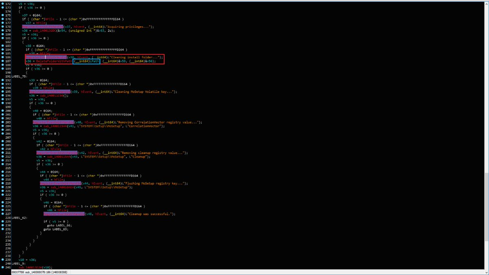

# maxpl0it
**https://twitter.com/maxpl0it/status/1299068051044921347 _at Thu Aug 27 19:35:33 +0000 2020_**
<blockquote>
Published my exploit for CVE-2019-17026 (Firefox JIT bug):

https://t.co/YeFsnSVYDv

No sandbox escape included but if anybody wants a challenge, chain it with CVE-2020-0674 for a neat sandbox escape on Windows!
</blockquote>

* https://github.com/maxpl0it/CVE-2019-17026-Exploit/

<table><tr>
<td>Quotes: <code>5</code></td>
<td>Replies: <code>1</code></td>
<td>Retweets: <code>145</code></td>
<td>Favorites: <code>340</code></td>
</tr></table>

---

# ptracesecurity
**https://twitter.com/ptracesecurity/status/1298560490197716992 _at Wed Aug 26 09:58:41 +0000 2020_**
<blockquote>
CVE-2020-1380: Analysis of Recently Fixed IE Zero-Day  https://t.co/FKZYgry3BN  #Pentesting #Exploit #Vulnerabilities #CyberSecurity #Infosec https://t.co/Rpc1sNTdzk
</blockquote>

* https://www.trendmicro.com/en_us/research/20/h/cve-2020-1380-analysis-of-recently-fixed-ie-zero-day.html

<table><tr>
<td></td>
<td></td>
<td></td>
<td></td>
</tr></table>
<table><tr>
<td>Quotes: <code>1</code></td>
<td>Replies: <code>0</code></td>
<td>Retweets: <code>32</code></td>
<td>Favorites: <code>41</code></td>
</tr></table>

---

# iamelli0t
**https://twitter.com/iamelli0t/status/1298092483407093761 _at Tue Aug 25 02:59:00 +0000 2020_**
<blockquote>
My analysis of the recent Internet Explorer zero-day vulnerability, CVE-2020-1380

https://t.co/qo21pj0xii
</blockquote>

* https://www.trendmicro.com/en_us/research/20/h/cve-2020-1380-analysis-of-recently-fixed-ie-zero-day.html

<table><tr>
<td>Quotes: <code>4</code></td>
<td>Replies: <code>3</code></td>
<td>Retweets: <code>91</code></td>
<td>Favorites: <code>179</code></td>
</tr></table>

---

# perito_inf
**https://twitter.com/perito_inf/status/1296800192256147456 _at Fri Aug 21 13:23:53 +0000 2020_**
<blockquote>
CVE-2020-1571 : Windows Setup Elevation of Privileges Bypass 0day

Affected Version:
Windows 10 1803/1809/1903/1909/2004

https://t.co/uH5DBVXEhT
</blockquote>

* https://github.com/klinix5/Windows-Setup-EoP

<table><tr>
<td>Quotes: <code>1</code></td>
<td>Replies: <code>1</code></td>
<td>Retweets: <code>26</code></td>
<td>Favorites: <code>44</code></td>
</tr></table>

---

# hackyzh
**https://twitter.com/hackyzh/status/1296687587873230848 _at Fri Aug 21 05:56:26 +0000 2020_**
<blockquote>
Finally,he could rce on windows 2008 successful by CVE-2020-1350.This chain spent him too much time.👍
</blockquote>

<table><tr>
<td>Quotes: <code>1</code></td>
<td>Replies: <code>1</code></td>
<td>Retweets: <code>23</code></td>
<td>Favorites: <code>67</code></td>
</tr></table>

---

# YanZiShuang
**https://twitter.com/YanZiShuang/status/1296679004343164928 _at Fri Aug 21 05:22:20 +0000 2020_**
<blockquote>
#DNS #WindowsServer #CVE #EXPLOIT
DNS 漏洞 CVE-2020-1350 EXPLOIT 新鲜出炉 确定可以导致蠕虫

关于DNS的研究报告在近期可能会分享

堆风水-&gt;堆喷射-&gt;相关数据结构设置-&gt;(利用堆上数据结构任意地址写||信息泄露)-&gt;覆写全局函数指针-&gt;ShellCode 执行 https://t.co/VNfv2CYyrk
</blockquote>

<table><tr>
<td></td>
</tr></table>
<table><tr>
<td>Quotes: <code>6</code></td>
<td>Replies: <code>11</code></td>
<td>Retweets: <code>110</code></td>
<td>Favorites: <code>288</code></td>
</tr></table>

---

# TheHackersNews
**https://twitter.com/TheHackersNews/status/1296494445769166848 _at Thu Aug 20 17:08:58 +0000 2020_**
<blockquote>
Microsoft issues emergency out-of-band security updates for Windows 8.1, RT 8.1, and Server 2012 R2 systems to patch two recently disclosed privilege escalation bugs (CVE-2020-1530 &amp; CVE-2020-1537) affecting Remote Access Service (RAS).

Read: https://t.co/17sx3z143T

#infosec
</blockquote>

* https://thehackernews.com/2020/08/windows-update-download.html

<table><tr>
<td>Quotes: <code>8</code></td>
<td>Replies: <code>5</code></td>
<td>Retweets: <code>159</code></td>
<td>Favorites: <code>230</code></td>
</tr></table>

---

# jedisct1
**https://twitter.com/jedisct1/status/1296071824657326081 _at Wed Aug 19 13:09:37 +0000 2020_**
<blockquote>
RT @neosysforensics: New blog and new post :)

CVE-2020-1337: my two cents
https://t.co/YxZOdG5rSA

Also in spanish
https://t.co/x08zMvkGSK…
</blockquote>

* https://blog.hiveminds.es/en/posts/cve-2020-1337_my_two_cents/
* https://blog.hiveminds.es/es/posts/cve-2020-1337_mis_dos_centavos/

<table><tr>
<td>Quotes: <code>0</code></td>
<td>Replies: <code>0</code></td>
<td>Retweets: <code>53</code></td>
<td>Favorites: <code>0</code></td>
</tr></table>

---

# neosysforensics
**https://twitter.com/neosysforensics/status/1296045753610182657 _at Wed Aug 19 11:26:01 +0000 2020_**
<blockquote>
New blog and new post :)

CVE-2020-1337: my two cents
https://t.co/YxZOdG5rSA

Also in spanish
https://t.co/x08zMvkGSK

Thx to @h4ng3r and the rest of the crew!
</blockquote>

* https://blog.hiveminds.es/en/posts/cve-2020-1337_my_two_cents/
* https://blog.hiveminds.es/es/posts/cve-2020-1337_mis_dos_centavos/

<table><tr>
<td>Quotes: <code>2</code></td>
<td>Replies: <code>1</code></td>
<td>Retweets: <code>53</code></td>
<td>Favorites: <code>67</code></td>
</tr></table>

---

# ihack4falafel
**https://twitter.com/ihack4falafel/status/1295775079855529984 _at Tue Aug 18 17:30:28 +0000 2020_**
<blockquote>
[Blog] Windows AppX Deployment Service Local Privilege Escalation (CVE-2020-1488) https://t.co/HfsOdyAtKM
</blockquote>

* https://tinyurl.com/yy5va7py

<table><tr>
<td>Quotes: <code>2</code></td>
<td>Replies: <code>1</code></td>
<td>Retweets: <code>36</code></td>
<td>Favorites: <code>51</code></td>
</tr></table>

---

# binitamshah
**https://twitter.com/binitamshah/status/1295398366239535104 _at Mon Aug 17 16:33:32 +0000 2020_**
<blockquote>
RT @thezdi: Windows Print Spooler Patch Bypass Re-Enables Persistent Backdoor. @HexKitchen details how the patch for CVE-2020-1048 was easi…
</blockquote>

<table><tr>
<td>Quotes: <code>0</code></td>
<td>Replies: <code>0</code></td>
<td>Retweets: <code>68</code></td>
<td>Favorites: <code>0</code></td>
</tr></table>

---

# ptracesecurity
**https://twitter.com/ptracesecurity/status/1294675304871534592 _at Sat Aug 15 16:40:21 +0000 2020_**
<blockquote>
CVE-2020-1571 Windows Setup Elevation of Privileges Bypass 0day  https://t.co/cYoe2PnKZT  #Pentesting #Windows #Vulnerability #CVE #Infosec https://t.co/3H38QKJWA0
</blockquote>

* https://github.com/klinix5/Windows-Setup-EoP

<table><tr>
<td></td>
<td></td>
<td></td>
<td></td>
</tr></table>
<table><tr>
<td>Quotes: <code>2</code></td>
<td>Replies: <code>0</code></td>
<td>Retweets: <code>91</code></td>
<td>Favorites: <code>149</code></td>
</tr></table>

---

# jedisct1
**https://twitter.com/jedisct1/status/1293632271749087232 _at Wed Aug 12 19:35:42 +0000 2020_**
<blockquote>
RT @TheHackersNews: Here are technical details for a new Windows Remote Access elevation of privilege #vulnerability (CVE-2020-1530) for wh…
</blockquote>

<table><tr>
<td>Quotes: <code>0</code></td>
<td>Replies: <code>0</code></td>
<td>Retweets: <code>117</code></td>
<td>Favorites: <code>0</code></td>
</tr></table>

---

# TheHackersNews
**https://twitter.com/TheHackersNews/status/1293609136605675520 _at Wed Aug 12 18:03:46 +0000 2020_**
<blockquote>
Here are technical details for a new Windows Remote Access elevation of privilege #vulnerability (CVE-2020-1530) for which #Microsoft released a security patch yesterday.

https://t.co/QaL3a1DbzC

Advisory: https://t.co/Nsc5X1cc5m

#PatchTuesday https://t.co/QTQajyZluF
</blockquote>

* https://symeonp.github.io/2020/12/08/phonebook-uaf-analysis.html
* https://portal.msrc.microsoft.com/en-US/security-guidance/advisory/CVE-2020-1530

<table><tr>
<td></td>
</tr></table>
<table><tr>
<td>Quotes: <code>5</code></td>
<td>Replies: <code>1</code></td>
<td>Retweets: <code>117</code></td>
<td>Favorites: <code>197</code></td>
</tr></table>

---

# symeonp
**https://twitter.com/symeonp/status/1293531800325754891 _at Wed Aug 12 12:56:28 +0000 2020_**
<blockquote>
Yesterday's Patch Tuesday included a PhoneBook use-after-free vulnerability (CVE-2020-1530) I reported. I decided to do a step-by-step write up on how I discovered it. It covers some basic sample gathering, harnessing, fuzzing, analysis and exploitation https://t.co/Uvyvy8CqX1
</blockquote>

* https://symeonp.github.io/2020/12/08/phonebook-uaf-analysis.html

<table><tr>
<td>Quotes: <code>4</code></td>
<td>Replies: <code>6</code></td>
<td>Retweets: <code>163</code></td>
<td>Favorites: <code>356</code></td>
</tr></table>

---

# ptracesecurity
**https://twitter.com/ptracesecurity/status/1293408837060501505 _at Wed Aug 12 04:47:51 +0000 2020_**
<blockquote>
Apache Tomcat RCE by deserialization (CVE-2020-9484) – write-up and exploit  https://t.co/PRJBBTvpRL  #Apache #Java #RCE #Explot #CyberSecurity #Infosec https://t.co/eIK7DCWHAe
</blockquote>

* https://www.redtimmy.com/java-hacking/apache-tomcat-rce-by-deserialization-cve-2020-9484-write-up-and-exploit/

<table><tr>
<td></td>
<td></td>
</tr></table>
<table><tr>
<td>Quotes: <code>4</code></td>
<td>Replies: <code>1</code></td>
<td>Retweets: <code>58</code></td>
<td>Favorites: <code>89</code></td>
</tr></table>

---

# USCERT_gov
**https://twitter.com/USCERT_gov/status/1293262564529508352 _at Tue Aug 11 19:06:37 +0000 2020_**
<blockquote>
Microsoft’s #PatchTuesday updates include patches for two vulnerabilities—CVE-2020-1380 and CVE-2020-1464—being actively exploited. Update ASAP to protect your systems. https://t.co/FEPH4f2y7S #Cyber #Cybersecurity #InfoSec
</blockquote>

* https://go.usa.gov/xfArr

<table><tr>
<td>Quotes: <code>11</code></td>
<td>Replies: <code>0</code></td>
<td>Retweets: <code>113</code></td>
<td>Favorites: <code>94</code></td>
</tr></table>

---

# thezdi
**https://twitter.com/thezdi/status/1293249558768746496 _at Tue Aug 11 18:14:56 +0000 2020_**
<blockquote>
Windows Print Spooler Patch Bypass Re-Enables Persistent Backdoor. @HexKitchen details how the patch for CVE-2020-1048 was easily bypassed and looks at the new patch released today to fix it. https://t.co/ayeIQC0CQV
</blockquote>

* https://bit.ly/33Qh3go

<table><tr>
<td>Quotes: <code>4</code></td>
<td>Replies: <code>1</code></td>
<td>Retweets: <code>68</code></td>
<td>Favorites: <code>118</code></td>
</tr></table>

---

# Ma7h1as
**https://twitter.com/Ma7h1as/status/1293235295337381889 _at Tue Aug 11 17:18:16 +0000 2020_**
<blockquote>
Oh it's patch tuesday.
I'm happy to release the exploit of CVE-2020-1337 , this year's leet CVE-ID. also known as windows print spooler privilege escalation bug.
thanks @md5_salt for the great idea.
https://t.co/GxtUqoSMQM
</blockquote>

* https://github.com/math1as/CVE-2020-1337-exploit

<table><tr>
<td>Quotes: <code>3</code></td>
<td>Replies: <code>1</code></td>
<td>Retweets: <code>104</code></td>
<td>Favorites: <code>235</code></td>
</tr></table>

---

# FlatL1ne
**https://twitter.com/FlatL1ne/status/1293209434345426945 _at Tue Aug 11 15:35:30 +0000 2020_**
<blockquote>
Apache Tomcat RCE by deserialization (CVE-2020-9484) – write-up and exploit

https://t.co/lmFgh6v6Gu
</blockquote>

* https://www.redtimmy.com/java-hacking/apache-tomcat-rce-by-deserialization-cve-2020-9484-write-up-and-exploit/

<table><tr>
<td>Quotes: <code>1</code></td>
<td>Replies: <code>0</code></td>
<td>Retweets: <code>23</code></td>
<td>Favorites: <code>67</code></td>
</tr></table>

---

# TheHackersNews
**https://twitter.com/TheHackersNews/status/1293182603751694336 _at Tue Aug 11 13:48:53 +0000 2020_**
<blockquote>
🔥 Watch Out! A new critical #vBulletin zero-day RCE #vulnerability and its PoC exploits have been publicly disclosed, allowing attackers to bypass patch for an old RCE bug (CVE-2019-16759) and remotely compromise sites.

Details — https://t.co/961xiq1BqC

#infosec #cybersecurity
</blockquote>

* https://thehackernews.com/2020/08/vBulletin-vulnerability-exploit.html

<table><tr>
<td>Quotes: <code>4</code></td>
<td>Replies: <code>1</code></td>
<td>Retweets: <code>60</code></td>
<td>Favorites: <code>74</code></td>
</tr></table>

---

# BleepinComputer
**https://twitter.com/BleepinComputer/status/1292022789059248128 _at Sat Aug 08 09:00:12 +0000 2020_**
<blockquote>
The FBI warns of Iranian hackers actively attempting to exploit vulnerable F5 Big-IP ADC devices unpatched against the CVE-2020-5902 unauthenticated remote code execution flaw - @serghei
https://t.co/rcwTyZnqE6
</blockquote>

* https://www.bleepingcomputer.com/news/security/fbi-iranian-hackers-trying-to-exploit-critical-f5-big-ip-flaw/

<table><tr>
<td>Quotes: <code>3</code></td>
<td>Replies: <code>1</code></td>
<td>Retweets: <code>53</code></td>
<td>Favorites: <code>96</code></td>
</tr></table>

---

# wugeej
**https://twitter.com/wugeej/status/1291184302672158720 _at Thu Aug 06 01:28:21 +0000 2020_**
<blockquote>
CVE-2020-13886 0day INTELBRAS TELEFONE IP TIP200/200 LITE &amp; TIP 300 - Local File Include

[ Proof Of Concept ]
URL parameter -&gt;http://HOST/cgi-bin/cgiServer.exx?page=

LFI payload -&gt; ../../../../etc/shadow

https://t.co/fQEOI2WZsF https://t.co/ixlAj26tAM
</blockquote>

* https://github.com/lucxssouza/CVE-2020-13886

<table><tr>
<td></td>
</tr></table>
<table><tr>
<td>Quotes: <code>1</code></td>
<td>Replies: <code>2</code></td>
<td>Retweets: <code>45</code></td>
<td>Favorites: <code>101</code></td>
</tr></table>

---

# behindthebreach
**https://twitter.com/behindthebreach/status/1290860109053284353 _at Wed Aug 05 04:00:07 +0000 2020_**
<blockquote>
Apache Tomcat RCE by deserialization (CVE-2020-9484) - write-up and exploit https://t.co/YygbwhoXTd #vulnerability #collection #execution #cve_2020_9484 #apache #tomcat
</blockquote>

* https://behindthebreach.com/l/46

<table><tr>
<td>Quotes: <code>3</code></td>
<td>Replies: <code>0</code></td>
<td>Retweets: <code>64</code></td>
<td>Favorites: <code>119</code></td>
</tr></table>

---

# peterjson
**https://twitter.com/peterjson/status/1290687541188767745 _at Tue Aug 04 16:34:24 +0000 2020_**
<blockquote>
I have just finished the recent IBM Websphere RCE PoC (CVE-2020-4450). It's a nice chain and after all I have learnt many things! https://t.co/JWRiiy7MEM
</blockquote>

<table><tr>
<td></td>
</tr></table>
<table><tr>
<td>Quotes: <code>1</code></td>
<td>Replies: <code>4</code></td>
<td>Retweets: <code>31</code></td>
<td>Favorites: <code>110</code></td>
</tr></table>

---

# ptracesecurity
**https://twitter.com/ptracesecurity/status/1289705496266641408 _at Sat Aug 01 23:32:06 +0000 2020_**
<blockquote>
[CVE49] Microsoft Windows LNK Remote Code Execution Vulnerability - CVE-2020-1299  https://t.co/R1oLe81oUw  #Windows #Vulnerability #RCE #CVE #LNK #Infosec https://t.co/DTeuz9GZip
</blockquote>

* https://blog.vincss.net/2020/06/cve49-microsoft-windows-lnk-remote-code-execution-vuln-cve-2020-1299-eng.html

<table><tr>
<td></td>
<td></td>
<td></td>
<td></td>
</tr></table>
<table><tr>
<td>Quotes: <code>3</code></td>
<td>Replies: <code>0</code></td>
<td>Retweets: <code>37</code></td>
<td>Favorites: <code>68</code></td>
</tr></table>

---

