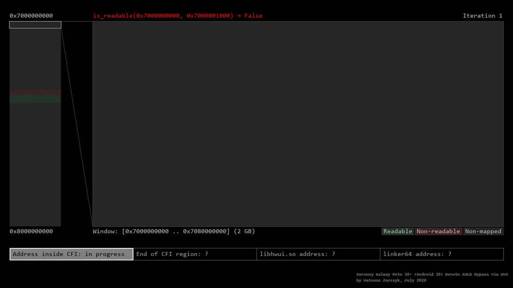
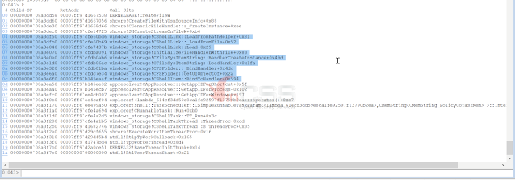

# _YMT_
**https://twitter.com/_YMT_/status/1300273612981755904 _at 2020-08-31 03:26:01_**
<blockquote>
CVE-2020-1571 : Windows Setup Elevation of Privileges Bypass 0day

Affected Version:
Windows 10 1803/1809/1903/1909/2004

https://t.co/maE6GKQdt7

#CyberNews #HackerNews #cybersec #CyberSecurity #pentesting #IT #PoC #CVE #BugBounty #redteam #ethicalhackin https://t.co/LGkT0dQiUD
</blockquote>

* https://github.com/klinix5/Windows-Setup-EoP

<table><tr>
<td></td>
</table></tr>
<table><tr>
<td>Quotes: <code>0</code></td>
<td>Replies: <code>0</code></td>
<td>Retweets: <code>0</code></td>
<td>Favorites: <code>1</code></td>
</tr></table>

---

# wugeej
**https://twitter.com/wugeej/status/1300268846138286080 _at 2020-08-31 03:07:05_**
<blockquote>
Hack-Tools - The All-In-One Red Team Extension For Web Pentester

Dynamic Reverse Shell generator (PHP, Bash, Ruby, Python, Perl, Netcat)
Shell Spawning (TTY Shell Spawning)
XSS Payloads
Basic SQLi payloads
Local file inclusion payloads (LFI)

https://t.co/Ue9ur2H89D https://t.co/3TNHg1k7bj
</blockquote>

* https://github.com/LasCC/Hack-Tools

<table><tr>
<td></td>
</table></tr>
<table><tr>
<td>Quotes: <code>0</code></td>
<td>Replies: <code>0</code></td>
<td>Retweets: <code>69</code></td>
<td>Favorites: <code>167</code></td>
</tr></table>

---

# jas502n
**https://twitter.com/jas502n/status/1300245292508307456 _at 2020-08-31 01:33:29_**
<blockquote>
RCE in Pulse Connect Secure RCE (CVE-2020-8218) &lt; v9.1R8

POC:
https://x.x.x.x/dana-admin/license/downloadlicenses.cgi?cmd=download&amp;txtVLSAuthCode=whatever%20-n%20%27($x=%22ls%20/%22,system$x)%3b%20%23%27%20-e%20/data/runtime/tmp/tt/setcookie.thtml.ttc
 https://t.co/u56yPrxO6R
</blockquote>

* https://www.gosecure.net/blog/2020/08/26/forget-your-perimeter-rce-in-pulse-connect-secure/

<table><tr>
<td>Quotes: <code>3</code></td>
<td>Replies: <code>3</code></td>
<td>Retweets: <code>77</code></td>
<td>Favorites: <code>147</code></td>
</tr></table>

---

# 0xrb
**https://twitter.com/0xrb/status/1300022222459777024 _at 2020-08-30 10:47:05_**
<blockquote>
Proof of concept tool to test for the existence of #PulseSecure #RCE (CVE-2020-8218) https://t.co/93AvVBq1WN
</blockquote>

* https://github.com/withdk/pulse-gosecure-rce-poc

<table><tr>
<td>Quotes: <code>0</code></td>
<td>Replies: <code>0</code></td>
<td>Retweets: <code>1</code></td>
<td>Favorites: <code>2</code></td>
</tr></table>

---

# Dinosn
**https://twitter.com/Dinosn/status/1299964418256707586 _at 2020-08-30 06:57:24_**
<blockquote>
Proof of concept tool to test for the existence of Pulse Secure RCE (CVE-2020-8218) https://t.co/wYv8IzMoFA
</blockquote>

* https://github.com//withdk//pulse-gosecure-rce-poc

<table><tr>
<td>Quotes: <code>1</code></td>
<td>Replies: <code>0</code></td>
<td>Retweets: <code>36</code></td>
<td>Favorites: <code>96</code></td>
</tr></table>

---

# maxpl0it
**https://twitter.com/maxpl0it/status/1299068051044921347 _at 2020-08-27 19:35:33_**
<blockquote>
Published my exploit for CVE-2019-17026 (Firefox JIT bug):

https://t.co/YeFsnSVYDv

No sandbox escape included but if anybody wants a challenge, chain it with CVE-2020-0674 for a neat sandbox escape on Windows!
</blockquote>

* https://github.com/maxpl0it/CVE-2019-17026-Exploit/

<table><tr>
<td>Quotes: <code>5</code></td>
<td>Replies: <code>1</code></td>
<td>Retweets: <code>139</code></td>
<td>Favorites: <code>338</code></td>
</tr></table>

---

# r4j0x00
**https://twitter.com/r4j0x00/status/1298682570448674817 _at 2020-08-26 18:03:47_**
<blockquote>
Here's my 1day exploit for https://t.co/HOW8DV5aCe 😁. Works for chrome version &lt;= 83.0.4103.61. 
https://t.co/r4opFYMDZ0 https://t.co/8hjWHE6h1D
</blockquote>

* https://github.com/v8/v8/commit/85bc1b0cab31cc064efc65e05adb81fee814261b#diff-2e2c5645d87dabecd3793b1f10300974
* https://github.com/r4j0x00/exploits/tree/master/chrome-exploit

<table><tr>
<td></td>
</table></tr>
<table><tr>
<td>Quotes: <code>14</code></td>
<td>Replies: <code>23</code></td>
<td>Retweets: <code>306</code></td>
<td>Favorites: <code>936</code></td>
</tr></table>

---

# binitamshah
**https://twitter.com/binitamshah/status/1298626893474721792 _at 2020-08-26 14:22:33_**
<blockquote>
AndroidMalware_2020 : Popular Android malwares of 2020 : https://t.co/29pEEZA6G7

AndroidMalware_2019 : Popular Android malwares of 2019: https://t.co/Bb9MDBzw45 

AndroidMalware_2018 : Popular Android malwares of 2018 : https://t.co/QWnEJV43Zy credits @skeptre_void
</blockquote>

* https://github.com/sk3ptre/AndroidMalware_2020
* https://github.com/sk3ptre/AndroidMalware_2019
* https://github.com/sk3ptre/AndroidMalware_2018

<table><tr>
<td>Quotes: <code>2</code></td>
<td>Replies: <code>1</code></td>
<td>Retweets: <code>55</code></td>
<td>Favorites: <code>102</code></td>
</tr></table>

---

# binitamshah
**https://twitter.com/binitamshah/status/1298623978743795713 _at 2020-08-26 14:10:58_**
<blockquote>
android-security-awesome : A collection of android security related resources: https://t.co/JhbRHbb2Tu 

adb-enhanced : Swiss-army knife for Android testing and development: https://t.co/chqcc7UPEp 

android-malware: Collection of android malware samples: https://t.co/GobIOlVT49
</blockquote>

* https://github.com/ashishb/android-security-awesome
* https://github.com/ashishb/adb-enhanced
* https://github.com/ashishb/android-malware

<table><tr>
<td>Quotes: <code>1</code></td>
<td>Replies: <code>0</code></td>
<td>Retweets: <code>92</code></td>
<td>Favorites: <code>238</code></td>
</tr></table>

---

# binitamshah
**https://twitter.com/binitamshah/status/1298616537545207808 _at 2020-08-26 13:41:24_**
<blockquote>
Coqui : Bare Bones Banking malware coded for research &amp; educational purposes : https://t.co/jcgTfW4Df1 

Details : https://t.co/vQpBEMsyVA
</blockquote>

* https://github.com/1d8/Coqui
* https://0x00sec.org/t/coqui-a-keylogger-that-activates-for-only-banking-related-sites/22818

<table><tr>
<td>Quotes: <code>0</code></td>
<td>Replies: <code>0</code></td>
<td>Retweets: <code>27</code></td>
<td>Favorites: <code>57</code></td>
</tr></table>

---

# ptracesecurity
**https://twitter.com/ptracesecurity/status/1298560490197716992 _at 2020-08-26 09:58:41_**
<blockquote>
CVE-2020-1380: Analysis of Recently Fixed IE Zero-Day  https://t.co/FKZYgry3BN  #Pentesting #Exploit #Vulnerabilities #CyberSecurity #Infosec https://t.co/Rpc1sNTdzk
</blockquote>

* https://www.trendmicro.com/en_us/research/20/h/cve-2020-1380-analysis-of-recently-fixed-ie-zero-day.html

<table><tr>
<td></td>
<td></td>
<td></td>
<td></td>
</table></tr>
<table><tr>
<td>Quotes: <code>1</code></td>
<td>Replies: <code>0</code></td>
<td>Retweets: <code>30</code></td>
<td>Favorites: <code>38</code></td>
</tr></table>

---

# hoangkien_1020
**https://twitter.com/hoangkien_1020/status/1298473776653328384 _at 2020-08-26 04:14:07_**
<blockquote>
My next CVE in Joomla to RCE:
CVE-2020-24597: Directory traversal in com_media to RCE
PoC:
https://t.co/uZQDZVRuIg
</blockquote>

* https://github.com/HoangKien1020/CVE-2020-24597

<table><tr>
<td>Quotes: <code>0</code></td>
<td>Replies: <code>0</code></td>
<td>Retweets: <code>0</code></td>
<td>Favorites: <code>0</code></td>
</tr></table>

---

# edwardzpeng
**https://twitter.com/edwardzpeng/status/1298173366692536320 _at 2020-08-25 08:20:24_**
<blockquote>
It’s not a good option to disclose 0day in public. But when vendor chooses to ignore your reports, you have no other choice.  Publishing two info leak vulnerabilities we found last month which Microsoft refuse to fix them. https://t.co/Bpx4buWxJL
</blockquote>

* https://github.com/hhlxf/USO_Info_Leak

<table><tr>
<td>Quotes: <code>5</code></td>
<td>Replies: <code>8</code></td>
<td>Retweets: <code>175</code></td>
<td>Favorites: <code>357</code></td>
</tr></table>

---

# iamelli0t
**https://twitter.com/iamelli0t/status/1298092483407093761 _at 2020-08-25 02:59:00_**
<blockquote>
My analysis of the recent Internet Explorer zero-day vulnerability, CVE-2020-1380

https://t.co/qo21pj0xii
</blockquote>

* https://www.trendmicro.com/en_us/research/20/h/cve-2020-1380-analysis-of-recently-fixed-ie-zero-day.html

<table><tr>
<td>Quotes: <code>5</code></td>
<td>Replies: <code>4</code></td>
<td>Retweets: <code>90</code></td>
<td>Favorites: <code>184</code></td>
</tr></table>

---

# binitamshah
**https://twitter.com/binitamshah/status/1297524859623243777 _at 2020-08-23 13:23:28_**
<blockquote>
Finding New Bluetooth Low Energy Exploits via Reverse Engineering Multiple Vendors Firmwares : https://t.co/TAYqDXIRGJ 

Slides : https://t.co/M92krBOitZ  credits @VeronicaKovah
</blockquote>

* https://www.youtube.com/watch?v=MRRkBWv4VVU
* https://github.com/darkmentorllc/publications/blob/master/2020/TI_SILABS_BLE_RCEs/slides_TI_SILABS_BLE_RCEs_v1.0.0.pdf

<table><tr>
<td>Quotes: <code>1</code></td>
<td>Replies: <code>2</code></td>
<td>Retweets: <code>36</code></td>
<td>Favorites: <code>77</code></td>
</tr></table>

---

# 3XS0
**https://twitter.com/3XS0/status/1297442644172341248 _at 2020-08-23 07:56:46_**
<blockquote>
CVE-2020-1571 Windows Setup Elevation of Privileges Bypass 0day  https://t.co/Gpu6sIPmQT  #Pentesting #Windows #Vulnerability #CVE #Infosec https://t.co/KfApof0Ggu
</blockquote>

* https://github.com/klinix5/Windows-Setup-EoP

<table><tr>
<td></td>
<td></td>
<td></td>
<td></td>
</table></tr>
<table><tr>
<td>Quotes: <code>0</code></td>
<td>Replies: <code>0</code></td>
<td>Retweets: <code>0</code></td>
<td>Favorites: <code>1</code></td>
</tr></table>

---

# nuria_imeq
**https://twitter.com/nuria_imeq/status/1296937759547035653 _at 2020-08-21 22:30:32_**
<blockquote>
GitHub - spaceraccoon/CVE-2020-10665: POC for CVE-2020-10665 Docker Desktop Local Privilege Escalation https://t.co/bSHAZuvPNu
</blockquote>

* https://github.com/spaceraccoon/CVE-2020-10665

<table><tr>
<td>Quotes: <code>0</code></td>
<td>Replies: <code>0</code></td>
<td>Retweets: <code>0</code></td>
<td>Favorites: <code>0</code></td>
</tr></table>

---

# perito_inf
**https://twitter.com/perito_inf/status/1296800192256147456 _at 2020-08-21 13:23:53_**
<blockquote>
CVE-2020-1571 : Windows Setup Elevation of Privileges Bypass 0day

Affected Version:
Windows 10 1803/1809/1903/1909/2004

https://t.co/uH5DBVXEhT
</blockquote>

* https://github.com/klinix5/Windows-Setup-EoP

<table><tr>
<td>Quotes: <code>1</code></td>
<td>Replies: <code>1</code></td>
<td>Retweets: <code>26</code></td>
<td>Favorites: <code>44</code></td>
</tr></table>

---

# hackyzh
**https://twitter.com/hackyzh/status/1296687587873230848 _at 2020-08-21 05:56:26_**
<blockquote>
Finally,he could rce on windows 2008 successful by CVE-2020-1350.This chain spent him too much time.👍
</blockquote>

<table><tr>
<td>Quotes: <code>1</code></td>
<td>Replies: <code>1</code></td>
<td>Retweets: <code>22</code></td>
<td>Favorites: <code>67</code></td>
</tr></table>

---

# YanZiShuang
**https://twitter.com/YanZiShuang/status/1296679004343164928 _at 2020-08-21 05:22:20_**
<blockquote>
#DNS #WindowsServer #CVE #EXPLOIT
DNS 漏洞 CVE-2020-1350 EXPLOIT 新鲜出炉 确定可以导致蠕虫

关于DNS的研究报告在近期可能会分享

堆风水-&gt;堆喷射-&gt;相关数据结构设置-&gt;(利用堆上数据结构任意地址写||信息泄露)-&gt;覆写全局函数指针-&gt;ShellCode 执行 https://t.co/VNfv2CYyrk
</blockquote>

<table><tr>
<td></td>
</table></tr>
<table><tr>
<td>Quotes: <code>6</code></td>
<td>Replies: <code>12</code></td>
<td>Retweets: <code>107</code></td>
<td>Favorites: <code>285</code></td>
</tr></table>

---

# Nahr3n
**https://twitter.com/Nahr3n/status/1296525339292774400 _at 2020-08-20 19:11:43_**
<blockquote>
CVE-2020-10665:
#Docker (Desktop Enterprise before 2.1.0.9, 
Desktop for Windows Stable before 2.2.0.4/2.2.2.0) - Local Privilege Escalation (PoC)
https://t.co/CgC9Gsfa9w
</blockquote>

* https://github.com/spaceraccoon/CVE-2020-10665

<table><tr>
<td>Quotes: <code>0</code></td>
<td>Replies: <code>0</code></td>
<td>Retweets: <code>0</code></td>
<td>Favorites: <code>2</code></td>
</tr></table>

---

# TheHackersNews
**https://twitter.com/TheHackersNews/status/1296494445769166848 _at 2020-08-20 17:08:58_**
<blockquote>
Microsoft issues emergency out-of-band security updates for Windows 8.1, RT 8.1, and Server 2012 R2 systems to patch two recently disclosed privilege escalation bugs (CVE-2020-1530 &amp; CVE-2020-1537) affecting Remote Access Service (RAS).

Read: https://t.co/17sx3z143T

#infosec
</blockquote>

* https://thehackernews.com/2020/08/windows-update-download.html

<table><tr>
<td>Quotes: <code>8</code></td>
<td>Replies: <code>5</code></td>
<td>Retweets: <code>155</code></td>
<td>Favorites: <code>225</code></td>
</tr></table>

---

# jedisct1
**https://twitter.com/jedisct1/status/1296071824657326081 _at 2020-08-19 13:09:37_**
<blockquote>
RT @neosysforensics: New blog and new post :)

CVE-2020-1337: my two cents
https://t.co/YxZOdG5rSA

Also in spanish
https://t.co/x08zMvkGSK…
</blockquote>

* https://blog.hiveminds.es/en/posts/cve-2020-1337_my_two_cents/
* https://blog.hiveminds.es/es/posts/cve-2020-1337_mis_dos_centavos/

<table><tr>
<td>Quotes: <code>0</code></td>
<td>Replies: <code>0</code></td>
<td>Retweets: <code>53</code></td>
<td>Favorites: <code>0</code></td>
</tr></table>

---

# neosysforensics
**https://twitter.com/neosysforensics/status/1296045753610182657 _at 2020-08-19 11:26:01_**
<blockquote>
New blog and new post :)

CVE-2020-1337: my two cents
https://t.co/YxZOdG5rSA

Also in spanish
https://t.co/x08zMvkGSK

Thx to @h4ng3r and the rest of the crew!
</blockquote>

* https://blog.hiveminds.es/en/posts/cve-2020-1337_my_two_cents/
* https://blog.hiveminds.es/es/posts/cve-2020-1337_mis_dos_centavos/

<table><tr>
<td>Quotes: <code>2</code></td>
<td>Replies: <code>1</code></td>
<td>Retweets: <code>53</code></td>
<td>Favorites: <code>67</code></td>
</tr></table>

---

# nuria_imeq
**https://twitter.com/nuria_imeq/status/1295795693811007489 _at 2020-08-18 18:52:22_**
<blockquote>
GitHub - klinix5
CVE-2020-1571 Windows Setup Elevation of Privileges Bypass 0day https://t.co/lkOxCNcAkU
</blockquote>

* https://github.com/klinix5/Windows-Setup-EoP

<table><tr>
<td>Quotes: <code>0</code></td>
<td>Replies: <code>0</code></td>
<td>Retweets: <code>3</code></td>
<td>Favorites: <code>4</code></td>
</tr></table>

---

# ihack4falafel
**https://twitter.com/ihack4falafel/status/1295775079855529984 _at 2020-08-18 17:30:28_**
<blockquote>
[Blog] Windows AppX Deployment Service Local Privilege Escalation (CVE-2020-1488) https://t.co/HfsOdyAtKM
</blockquote>

* https://tinyurl.com/yy5va7py

<table><tr>
<td>Quotes: <code>2</code></td>
<td>Replies: <code>1</code></td>
<td>Retweets: <code>37</code></td>
<td>Favorites: <code>51</code></td>
</tr></table>

---

# binitamshah
**https://twitter.com/binitamshah/status/1295406895172182016 _at 2020-08-17 17:07:25_**
<blockquote>
VirtualDynamicAnalysis : A basic android pentest environment to instrument apps without root or repackaging an app : https://t.co/1aMMiphyQD 

Dynamic analysis of apps inside Android Cloning apps – Part 1 : https://t.co/BMmGMp88Fw
</blockquote>

* https://github.com/darvincisec/VirtualDynamicAnalysis
* https://darvincitech.wordpress.com/2020/07/18/all-your-crypto-keys-belongs-to-me-in-android-virtual-containers/

<table><tr>
<td>Quotes: <code>0</code></td>
<td>Replies: <code>0</code></td>
<td>Retweets: <code>31</code></td>
<td>Favorites: <code>43</code></td>
</tr></table>

---

# binitamshah
**https://twitter.com/binitamshah/status/1295398366239535104 _at 2020-08-17 16:33:32_**
<blockquote>
RT @thezdi: Windows Print Spooler Patch Bypass Re-Enables Persistent Backdoor. @HexKitchen details how the patch for CVE-2020-1048 was easi…
</blockquote>

<table><tr>
<td>Quotes: <code>0</code></td>
<td>Replies: <code>0</code></td>
<td>Retweets: <code>68</code></td>
<td>Favorites: <code>0</code></td>
</tr></table>

---

# ddouhine
**https://twitter.com/ddouhine/status/1295372365975650305 _at 2020-08-17 14:50:13_**
<blockquote>
1st @geutebruck exploit module landed in @metasploit 😎

"(...) remote code execution as the root user, allowing them complete control over the affected camera."

CVE-2020-16205

Users -&gt; update to 1.12.0.27

Thx @tekwizz123 for the work behind the scenes

https://t.co/zGwyuKYb6K
</blockquote>

* https://github.com/rapid7/metasploit-framework/pull/13986

<table><tr>
<td>Quotes: <code>0</code></td>
<td>Replies: <code>1</code></td>
<td>Retweets: <code>2</code></td>
<td>Favorites: <code>4</code></td>
</tr></table>

---

# VP_helena
**https://twitter.com/VP_helena/status/1295155240677920768 _at 2020-08-17 00:27:26_**
<blockquote>
CVE-2020-0796 RCE PoC source #SMBGhost 
https://t.co/ayuWMYFPHI
</blockquote>

* https://github.com/chompie1337/SMBGhost_RCE_PoC

<table><tr>
<td>Quotes: <code>0</code></td>
<td>Replies: <code>0</code></td>
<td>Retweets: <code>1</code></td>
<td>Favorites: <code>2</code></td>
</tr></table>

---

# _can1357
**https://twitter.com/_can1357/status/1295103431145922562 _at 2020-08-16 21:01:34_**
<blockquote>
I've decided to publish my VMProtect devirtualizer working for every 3.x version up to the latest 3.6 along with the experimental x64 compiler.

It can be found at https://t.co/zJQHjFG46e licensed under GPL-3, hopefully it attracts some interest in the VTIL project, enjoy :)
</blockquote>

* https://github.com/can1357/NoVmp

<table><tr>
<td>Quotes: <code>19</code></td>
<td>Replies: <code>16</code></td>
<td>Retweets: <code>415</code></td>
<td>Favorites: <code>995</code></td>
</tr></table>

---

# jedisct1
**https://twitter.com/jedisct1/status/1295073948657504257 _at 2020-08-16 19:04:25_**
<blockquote>
A Guide On WireGuard/DNSCrypt/SSH/Honeypot Implementation on OVH
https://t.co/bK7P2wWhCb
</blockquote>

* https://github.com/BetterWayElectronics/secure-wireguard-implementation

<table><tr>
<td>Quotes: <code>0</code></td>
<td>Replies: <code>0</code></td>
<td>Retweets: <code>11</code></td>
<td>Favorites: <code>33</code></td>
</tr></table>

---

# Nahr3n
**https://twitter.com/Nahr3n/status/1294887959829848064 _at 2020-08-16 06:45:22_**
<blockquote>
CVE-2020-1571: 
Windows 10 1803/1809/1903/1909/2004
Setup Elevation of Privileges Bypass #0day (#PoC)
https://t.co/UvBxC6ZQLJ
</blockquote>

* https://github.com/klinix5/Windows-Setup-EoP

<table><tr>
<td>Quotes: <code>0</code></td>
<td>Replies: <code>0</code></td>
<td>Retweets: <code>2</code></td>
<td>Favorites: <code>1</code></td>
</tr></table>

---

# ptracesecurity
**https://twitter.com/ptracesecurity/status/1294675304871534592 _at 2020-08-15 16:40:21_**
<blockquote>
CVE-2020-1571 Windows Setup Elevation of Privileges Bypass 0day  https://t.co/cYoe2PnKZT  #Pentesting #Windows #Vulnerability #CVE #Infosec https://t.co/3H38QKJWA0
</blockquote>

* https://github.com/klinix5/Windows-Setup-EoP

<table><tr>
<td></td>
<td></td>
<td></td>
<td></td>
</table></tr>
<table><tr>
<td>Quotes: <code>2</code></td>
<td>Replies: <code>0</code></td>
<td>Retweets: <code>89</code></td>
<td>Favorites: <code>148</code></td>
</tr></table>

---

# KLINIX5
**https://twitter.com/KLINIX5/status/1294278597306388482 _at 2020-08-14 14:23:58_**
<blockquote>
Hey MS, here's a bad tweet for u here's the bypass for CVE-2020-1571 as a 0day, I've written the full exploit + an explanation of what exactly happening 
https://t.co/TDg35EwrAx
</blockquote>

* https://github.com/klinix5/Windows-Setup-EoP

<table><tr>
<td>Quotes: <code>0</code></td>
<td>Replies: <code>0</code></td>
<td>Retweets: <code>0</code></td>
<td>Favorites: <code>0</code></td>
</tr></table>

---

# RopHangmans
**https://twitter.com/RopHangmans/status/1293894060973928449 _at 2020-08-13 12:55:58_**
<blockquote>
PoC for CVE-2020-17506 Artica Auth Bypass &amp; RCE:
https://t.co/TzFoOdqlTz
</blockquote>

* https://github.com/hangmansROP/proof-of-concepts/blob/master/CVE-2020-17506-artica-rce.py

<table><tr>
<td>Quotes: <code>0</code></td>
<td>Replies: <code>0</code></td>
<td>Retweets: <code>5</code></td>
<td>Favorites: <code>2</code></td>
</tr></table>

---

# jedisct1
**https://twitter.com/jedisct1/status/1293632271749087232 _at 2020-08-12 19:35:42_**
<blockquote>
RT @TheHackersNews: Here are technical details for a new Windows Remote Access elevation of privilege #vulnerability (CVE-2020-1530) for wh…
</blockquote>

<table><tr>
<td>Quotes: <code>0</code></td>
<td>Replies: <code>0</code></td>
<td>Retweets: <code>117</code></td>
<td>Favorites: <code>0</code></td>
</tr></table>

---

# TheHackersNews
**https://twitter.com/TheHackersNews/status/1293609136605675520 _at 2020-08-12 18:03:46_**
<blockquote>
Here are technical details for a new Windows Remote Access elevation of privilege #vulnerability (CVE-2020-1530) for which #Microsoft released a security patch yesterday.

https://t.co/QaL3a1DbzC

Advisory: https://t.co/Nsc5X1cc5m

#PatchTuesday https://t.co/QTQajyZluF
</blockquote>

* https://symeonp.github.io/2020/12/08/phonebook-uaf-analysis.html
* https://portal.msrc.microsoft.com/en-US/security-guidance/advisory/CVE-2020-1530

<table><tr>
<td></td>
</table></tr>
<table><tr>
<td>Quotes: <code>5</code></td>
<td>Replies: <code>1</code></td>
<td>Retweets: <code>117</code></td>
<td>Favorites: <code>197</code></td>
</tr></table>

---

# j00ru
**https://twitter.com/j00ru/status/1293600840461299712 _at 2020-08-12 17:30:48_**
<blockquote>
A direct link to the exploit is here: https://t.co/BzxsJAs5uJ

And a visualization of the ASLR bypass #3 mentioned in the post is shown in the GIF below (relevant frames 33-57): https://t.co/3SeDAT5tdl
</blockquote>

* https://github.com/googleprojectzero/SkCodecFuzzer/tree/master/mms_exploit

<table><tr>
<td></td>
</table></tr>
<table><tr>
<td>Quotes: <code>0</code></td>
<td>Replies: <code>0</code></td>
<td>Retweets: <code>12</code></td>
<td>Favorites: <code>43</code></td>
</tr></table>

---

# symeonp
**https://twitter.com/symeonp/status/1293531800325754891 _at 2020-08-12 12:56:28_**
<blockquote>
Yesterday's Patch Tuesday included a PhoneBook use-after-free vulnerability (CVE-2020-1530) I reported. I decided to do a step-by-step write up on how I discovered it. It covers some basic sample gathering, harnessing, fuzzing, analysis and exploitation https://t.co/Uvyvy8CqX1
</blockquote>

* https://symeonp.github.io/2020/12/08/phonebook-uaf-analysis.html

<table><tr>
<td>Quotes: <code>4</code></td>
<td>Replies: <code>6</code></td>
<td>Retweets: <code>162</code></td>
<td>Favorites: <code>352</code></td>
</tr></table>

---

# 44CON
**https://twitter.com/44CON/status/1293514331523436544 _at 2020-08-12 11:47:03_**
<blockquote>
(From https://t.co/OT552U6KvT): RCE PoC for CVE-2020-0796 "SMBGhost" https://t.co/iExMmv6sZE https://t.co/d9if2hQugD
</blockquote>

* http://github.com
* http://dlvr.it/RdVJPR

<table><tr>
<td></td>
</table></tr>
<table><tr>
<td>Quotes: <code>0</code></td>
<td>Replies: <code>0</code></td>
<td>Retweets: <code>9</code></td>
<td>Favorites: <code>15</code></td>
</tr></table>

---

# matteomalvica
**https://twitter.com/matteomalvica/status/1293443946664857602 _at 2020-08-12 07:07:22_**
<blockquote>
Thrilled and psyched to introduce SNIcat!
This tool,made with 💟 by @mmarstrander and myself, bypasses most of TLS inspection devices such as ones from @F5Networks @PaloAltoNtwks @fortinet
Details here:
https://t.co/VwPSrB6g0k
PoC here:
https://t.co/DwFzjUC2LU
exfil responsibly🛸
</blockquote>

* https://www.mnemonic.no/blog/introducing-snicat
* https://github.com/mnemonic-no/SNIcat

<table><tr>
<td>Quotes: <code>5</code></td>
<td>Replies: <code>0</code></td>
<td>Retweets: <code>52</code></td>
<td>Favorites: <code>119</code></td>
</tr></table>

---

# ptracesecurity
**https://twitter.com/ptracesecurity/status/1293408837060501505 _at 2020-08-12 04:47:51_**
<blockquote>
Apache Tomcat RCE by deserialization (CVE-2020-9484) – write-up and exploit  https://t.co/PRJBBTvpRL  #Apache #Java #RCE #Explot #CyberSecurity #Infosec https://t.co/eIK7DCWHAe
</blockquote>

* https://www.redtimmy.com/java-hacking/apache-tomcat-rce-by-deserialization-cve-2020-9484-write-up-and-exploit/

<table><tr>
<td></td>
<td></td>
</table></tr>
<table><tr>
<td>Quotes: <code>4</code></td>
<td>Replies: <code>1</code></td>
<td>Retweets: <code>58</code></td>
<td>Favorites: <code>89</code></td>
</tr></table>

---

# USCERT_gov
**https://twitter.com/USCERT_gov/status/1293262564529508352 _at 2020-08-11 19:06:37_**
<blockquote>
Microsoft’s #PatchTuesday updates include patches for two vulnerabilities—CVE-2020-1380 and CVE-2020-1464—being actively exploited. Update ASAP to protect your systems. https://t.co/FEPH4f2y7S #Cyber #Cybersecurity #InfoSec
</blockquote>

* https://go.usa.gov/xfArr

<table><tr>
<td>Quotes: <code>11</code></td>
<td>Replies: <code>0</code></td>
<td>Retweets: <code>113</code></td>
<td>Favorites: <code>94</code></td>
</tr></table>

---

# thezdi
**https://twitter.com/thezdi/status/1293249558768746496 _at 2020-08-11 18:14:56_**
<blockquote>
Windows Print Spooler Patch Bypass Re-Enables Persistent Backdoor. @HexKitchen details how the patch for CVE-2020-1048 was easily bypassed and looks at the new patch released today to fix it. https://t.co/ayeIQC0CQV
</blockquote>

* https://bit.ly/33Qh3go

<table><tr>
<td>Quotes: <code>4</code></td>
<td>Replies: <code>1</code></td>
<td>Retweets: <code>68</code></td>
<td>Favorites: <code>118</code></td>
</tr></table>

---

# Ma7h1as
**https://twitter.com/Ma7h1as/status/1293235295337381889 _at 2020-08-11 17:18:16_**
<blockquote>
Oh it's patch tuesday.
I'm happy to release the exploit of CVE-2020-1337 , this year's leet CVE-ID. also known as windows print spooler privilege escalation bug.
thanks @md5_salt for the great idea.
https://t.co/GxtUqoSMQM
</blockquote>

* https://github.com/math1as/CVE-2020-1337-exploit

<table><tr>
<td>Quotes: <code>3</code></td>
<td>Replies: <code>1</code></td>
<td>Retweets: <code>100</code></td>
<td>Favorites: <code>230</code></td>
</tr></table>

---

# FlatL1ne
**https://twitter.com/FlatL1ne/status/1293209434345426945 _at 2020-08-11 15:35:30_**
<blockquote>
Apache Tomcat RCE by deserialization (CVE-2020-9484) – write-up and exploit

https://t.co/lmFgh6v6Gu
</blockquote>

* https://www.redtimmy.com/java-hacking/apache-tomcat-rce-by-deserialization-cve-2020-9484-write-up-and-exploit/

<table><tr>
<td>Quotes: <code>1</code></td>
<td>Replies: <code>0</code></td>
<td>Retweets: <code>23</code></td>
<td>Favorites: <code>67</code></td>
</tr></table>

---

# TheHackersNews
**https://twitter.com/TheHackersNews/status/1293182603751694336 _at 2020-08-11 13:48:53_**
<blockquote>
🔥 Watch Out! A new critical #vBulletin zero-day RCE #vulnerability and its PoC exploits have been publicly disclosed, allowing attackers to bypass patch for an old RCE bug (CVE-2019-16759) and remotely compromise sites.

Details — https://t.co/961xiq1BqC

#infosec #cybersecurity
</blockquote>

* https://thehackernews.com/2020/08/vBulletin-vulnerability-exploit.html

<table><tr>
<td>Quotes: <code>4</code></td>
<td>Replies: <code>1</code></td>
<td>Retweets: <code>61</code></td>
<td>Favorites: <code>74</code></td>
</tr></table>

---

# wdormann
**https://twitter.com/wdormann/status/1292968909839245312 _at 2020-08-10 23:39:44_**
<blockquote>
I'm testing a methodology for finding privilege escalation vulnerabilities on Windows systems, but my speculation about what sort of software lives on real-world systems is reaching its limits.
Here's a script that enumerates SYSTEM-privileged services: https://t.co/5LUwojz6Z0
</blockquote>

* https://gist.github.com/wdormann/0464e45bf48a8fe791553af710218a51

<table><tr>
<td>Quotes: <code>2</code></td>
<td>Replies: <code>1</code></td>
<td>Retweets: <code>52</code></td>
<td>Favorites: <code>149</code></td>
</tr></table>

---

# honoki
**https://twitter.com/honoki/status/1292884449110249474 _at 2020-08-10 18:04:07_**
<blockquote>
I'm celebrating my first CVE with a writeup! Hope you enjoy it.  🤓

"CVE-2020-11518: how I bruteforced my way into your Active Directory"

https://t.co/aHKeF7Q3lE

#bugbounty #writeup #blogpost #blog https://t.co/aiweywp3ne
</blockquote>

* https://honoki.net/2020/08/10/cve-2020-11518-how-i-bruteforced-my-way-into-your-active-directory/

<table><tr>
<td></td>
</table></tr>
<table><tr>
<td>Quotes: <code>17</code></td>
<td>Replies: <code>24</code></td>
<td>Retweets: <code>423</code></td>
<td>Favorites: <code>1061</code></td>
</tr></table>

---

# threatintelctr
**https://twitter.com/threatintelctr/status/1292871440589443072 _at 2020-08-10 17:12:26_**
<blockquote>
🚨 NEW: CVE-2020-7361 🚨 The EasyCorp ZenTao Pro application suffers from an OS command injection vulnerability in its '/pro/repo-create.html' component. After authenticating to the ZenTao dashboard, attackers may c... (click for more) Severity: HIGH https://t.co/3TZEFDBj6T
</blockquote>

* https://github.com/rapid7/metasploit-framework/pull/13828

<table><tr>
<td>Quotes: <code>0</code></td>
<td>Replies: <code>0</code></td>
<td>Retweets: <code>0</code></td>
<td>Favorites: <code>0</code></td>
</tr></table>

---

# jedisct1
**https://twitter.com/jedisct1/status/1292839166565322754 _at 2020-08-10 15:04:11_**
<blockquote>
Yet another grep, faster than the previous ones. After ag and rg, meet ug: https://t.co/pWeo52GmjA
</blockquote>

* https://github.com/Genivia/ugrep

<table><tr>
<td>Quotes: <code>0</code></td>
<td>Replies: <code>1</code></td>
<td>Retweets: <code>12</code></td>
<td>Favorites: <code>36</code></td>
</tr></table>

---

# Anastasis_King
**https://twitter.com/Anastasis_King/status/1292173547130036225 _at 2020-08-08 18:59:15_**
<blockquote>
CVE-2019-7609 : Exploit Kibana RCE on right way by python2 scripts

https://t.co/dPeckuqxet
</blockquote>

* https://github.com/kisec/CVE-2019-7609

<table><tr>
<td>Quotes: <code>0</code></td>
<td>Replies: <code>0</code></td>
<td>Retweets: <code>0</code></td>
<td>Favorites: <code>0</code></td>
</tr></table>

---

# BleepinComputer
**https://twitter.com/BleepinComputer/status/1292022789059248128 _at 2020-08-08 09:00:12_**
<blockquote>
The FBI warns of Iranian hackers actively attempting to exploit vulnerable F5 Big-IP ADC devices unpatched against the CVE-2020-5902 unauthenticated remote code execution flaw - @serghei
https://t.co/rcwTyZnqE6
</blockquote>

* https://www.bleepingcomputer.com/news/security/fbi-iranian-hackers-trying-to-exploit-critical-f5-big-ip-flaw/

<table><tr>
<td>Quotes: <code>3</code></td>
<td>Replies: <code>1</code></td>
<td>Retweets: <code>49</code></td>
<td>Favorites: <code>96</code></td>
</tr></table>

---

# cry__pto
**https://twitter.com/cry__pto/status/1291657851648258049 _at 2020-08-07 08:50:04_**
<blockquote>
AWAE/OSWE PREP (Code analysis to gaining rce and
automating everything with Python).pdf
https://t.co/9S4loCZx7D 
#Pentesting #Hacking #redteam #bugbountytip #OSCP
</blockquote>

* https://github.com/blaCCkHatHacEEkr/PENTESTING-BIBLE/blob/master/AWAE-OSWE%20PREP%20(Code%20analysis%20to%20gaining%20rce%20and%20automating%20everything%20with%20Python).pdf

<table><tr>
<td>Quotes: <code>0</code></td>
<td>Replies: <code>1</code></td>
<td>Retweets: <code>42</code></td>
<td>Favorites: <code>78</code></td>
</tr></table>

---

# threatintelctr
**https://twitter.com/threatintelctr/status/1291414386448326656 _at 2020-08-06 16:42:37_**
<blockquote>
🚨 NEW: CVE-2020-7361 🚨 The EasyCorp ZenTao Pro application suffers from an OS command injection vulnerability in its '/pro/repo-create.html' component. After authenticating to the ZenTao dashboard, attackers may c... (click for more)  https://t.co/3TZEFDBj6T
</blockquote>

* https://github.com/rapid7/metasploit-framework/pull/13828

<table><tr>
<td>Quotes: <code>0</code></td>
<td>Replies: <code>0</code></td>
<td>Retweets: <code>0</code></td>
<td>Favorites: <code>0</code></td>
</tr></table>

---

# OPOSEC
**https://twitter.com/OPOSEC/status/1291328173368631301 _at 2020-08-06 11:00:02_**
<blockquote>
Microsoft Edge Remote Code Execution (CVE-2018-8495). https://t.co/8oZXOxBU6q PoC: https://t.co/EIR3NrC5vm #Security #244 (2018)
</blockquote>

* https://leucosite.com/Microsoft-Edge-RCE/
* https://github.com/kmkz/exploit/blob/master/CVE-2018-8495.html

<table><tr>
<td>Quotes: <code>0</code></td>
<td>Replies: <code>0</code></td>
<td>Retweets: <code>0</code></td>
<td>Favorites: <code>1</code></td>
</tr></table>

---

# mobilesecurity_
**https://twitter.com/mobilesecurity_/status/1291264621534490626 _at 2020-08-06 06:47:30_**
<blockquote>
Breaking Samsung's Root of Trust - Exploiting Samsung S10 Secure Boot
#MobileSecurity #AndroidSecurity 
#BlackHat2020 [SLIDES] by @Jeffxx_Chao 
https://t.co/SDqIfhDz8m https://t.co/UzSZxH5TDL
</blockquote>

* https://github.com/TrapaSecurity/presentations/raw/master/us-20-Chao-Breaking-Samsung's-Root-of-Trust-Exploiting-Samsung-Secure-Boot.pdf

<table><tr>
<td></td>
</table></tr>
<table><tr>
<td>Quotes: <code>1</code></td>
<td>Replies: <code>0</code></td>
<td>Retweets: <code>38</code></td>
<td>Favorites: <code>94</code></td>
</tr></table>

---

# wugeej
**https://twitter.com/wugeej/status/1291187268846096384 _at 2020-08-06 01:40:08_**
<blockquote>
CVE-2020-11579 PHPKB 9.0 Enterprise Edition (MySQL database) unauthenticated arbitrary file disclosure via a malicious MySQL Server.

trigger_fe = requests.get("{}/installer/include/test-connection.php?mys={}:{}&amp;myu=test&amp;myp=test&amp;myd=test"

https://t.co/9LKtly8vsx
</blockquote>

* https://github.com/ShielderSec/CVE-2020-11579

<table><tr>
<td>Quotes: <code>0</code></td>
<td>Replies: <code>0</code></td>
<td>Retweets: <code>1</code></td>
<td>Favorites: <code>3</code></td>
</tr></table>

---

# wugeej
**https://twitter.com/wugeej/status/1291184302672158720 _at 2020-08-06 01:28:21_**
<blockquote>
CVE-2020-13886 0day INTELBRAS TELEFONE IP TIP200/200 LITE &amp; TIP 300 - Local File Include

[ Proof Of Concept ]
URL parameter -&gt;http://HOST/cgi-bin/cgiServer.exx?page=

LFI payload -&gt; ../../../../etc/shadow

https://t.co/fQEOI2WZsF https://t.co/ixlAj26tAM
</blockquote>

* https://github.com/lucxssouza/CVE-2020-13886

<table><tr>
<td></td>
</table></tr>
<table><tr>
<td>Quotes: <code>1</code></td>
<td>Replies: <code>2</code></td>
<td>Retweets: <code>43</code></td>
<td>Favorites: <code>102</code></td>
</tr></table>

---

# maddiestone
**https://twitter.com/maddiestone/status/1291124059917266944 _at 2020-08-05 21:28:58_**
<blockquote>
Here are the slides from my @BlackHatEvents  talk "Reversing the Root: Identifying the Exploited Vulnerability in 0-days Used In-The-Wild".

https://t.co/k7nAYfAZeu https://t.co/wrC0VHol3f
</blockquote>

* https://github.com/maddiestone/ConPresentations/blob/master/BH2020.ReversingTheRoot.pdf

<table><tr>
<td></td>
</table></tr>
<table><tr>
<td>Quotes: <code>8</code></td>
<td>Replies: <code>8</code></td>
<td>Retweets: <code>144</code></td>
<td>Favorites: <code>404</code></td>
</tr></table>

---

# threatintelctr
**https://twitter.com/threatintelctr/status/1291104799887200257 _at 2020-08-05 20:12:26_**
<blockquote>
🚨 NEW: CVE-2020-15467 🚨 The administrative interface of Cohesive Networks vns3:vpn appliances before version 4.11.1 is vulnerable to authenticated remote code execution leading to server compromise. Severity: HIGH https://t.co/4SAW7mcnqr
</blockquote>

* https://github.com/fireeye/Vulnerability-Disclosures/blob/master/FEYE-2020-0007/FEYE-2020-0007.md

<table><tr>
<td>Quotes: <code>0</code></td>
<td>Replies: <code>0</code></td>
<td>Retweets: <code>0</code></td>
<td>Favorites: <code>0</code></td>
</tr></table>

---

# behindthebreach
**https://twitter.com/behindthebreach/status/1290860109053284353 _at 2020-08-05 04:00:07_**
<blockquote>
Apache Tomcat RCE by deserialization (CVE-2020-9484) - write-up and exploit https://t.co/YygbwhoXTd #vulnerability #collection #execution #cve_2020_9484 #apache #tomcat
</blockquote>

* https://behindthebreach.com/l/46

<table><tr>
<td>Quotes: <code>3</code></td>
<td>Replies: <code>0</code></td>
<td>Retweets: <code>64</code></td>
<td>Favorites: <code>119</code></td>
</tr></table>

---

# threatintelctr
**https://twitter.com/threatintelctr/status/1290734900992065536 _at 2020-08-04 19:42:35_**
<blockquote>
🚨 NEW: CVE-2010-3116 🚨 Multiple use-after-free vulnerabilities in WebKit, as used in Apple Safari before 4.1.3 and 5.0.x before 5.0.3, Google Chrome before 5.0.375.127, and webkitgtk before 1.2.6, allow remote att... (click for more)  https://t.co/UbhoxviaLN
</blockquote>

* http://code.google.com/p/chromium/issues/detail?id=51835

<table><tr>
<td>Quotes: <code>0</code></td>
<td>Replies: <code>0</code></td>
<td>Retweets: <code>0</code></td>
<td>Favorites: <code>0</code></td>
</tr></table>

---

# threatintelctr
**https://twitter.com/threatintelctr/status/1290734900992081920 _at 2020-08-04 19:42:35_**
<blockquote>
🚨 NEW: CVE-2010-3257 🚨 Use-after-free vulnerability in WebKit, as used in Apple Safari before 4.1.3 and 5.0.x before 5.0.3, Google Chrome before 6.0.472.53, and webkitgtk before 1.2.6, allows remote attackers to e... (click for more)  https://t.co/ri9ih5lqAg
</blockquote>

* http://code.google.com/p/chromium/issues/detail?id=52443

<table><tr>
<td>Quotes: <code>0</code></td>
<td>Replies: <code>0</code></td>
<td>Retweets: <code>0</code></td>
<td>Favorites: <code>0</code></td>
</tr></table>

---

# peterjson
**https://twitter.com/peterjson/status/1290687541188767745 _at 2020-08-04 16:34:24_**
<blockquote>
I have just finished the recent IBM Websphere RCE PoC (CVE-2020-4450). It's a nice chain and after all I have learnt many things! https://t.co/JWRiiy7MEM
</blockquote>

<table><tr>
<td></td>
</table></tr>
<table><tr>
<td>Quotes: <code>1</code></td>
<td>Replies: <code>4</code></td>
<td>Retweets: <code>31</code></td>
<td>Favorites: <code>107</code></td>
</tr></table>

---

# threatintelctr
**https://twitter.com/threatintelctr/status/1290651814971531266 _at 2020-08-04 14:12:26_**
<blockquote>
🚨 NEW: CVE-2020-15467 🚨 The administrative interface of Cohesive Networks vns3:vpn appliances before version 4.11.1 is vulnerable to authenticated remote code execution leading to server compromise. https://t.co/4SAW7lUMyT
</blockquote>

* https://github.com/fireeye/Vulnerability-Disclosures/blob/master/FEYE-2020-0007/FEYE-2020-0007.md

<table><tr>
<td>Quotes: <code>0</code></td>
<td>Replies: <code>0</code></td>
<td>Retweets: <code>0</code></td>
<td>Favorites: <code>0</code></td>
</tr></table>

---

# ptracesecurity
**https://twitter.com/ptracesecurity/status/1289705496266641408 _at 2020-08-01 23:32:06_**
<blockquote>
[CVE49] Microsoft Windows LNK Remote Code Execution Vulnerability - CVE-2020-1299  https://t.co/R1oLe81oUw  #Windows #Vulnerability #RCE #CVE #LNK #Infosec https://t.co/DTeuz9GZip
</blockquote>

* https://blog.vincss.net/2020/06/cve49-microsoft-windows-lnk-remote-code-execution-vuln-cve-2020-1299-eng.html

<table><tr>
<td></td>
<td></td>
<td></td>
<td></td>
</table></tr>
<table><tr>
<td>Quotes: <code>3</code></td>
<td>Replies: <code>0</code></td>
<td>Retweets: <code>37</code></td>
<td>Favorites: <code>68</code></td>
</tr></table>

---

