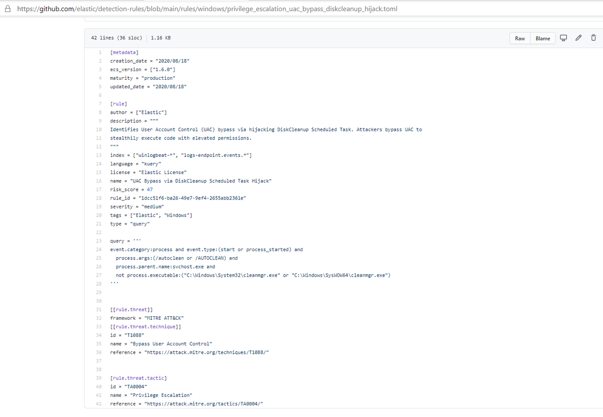
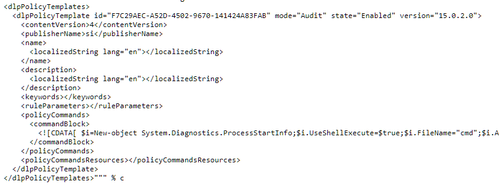
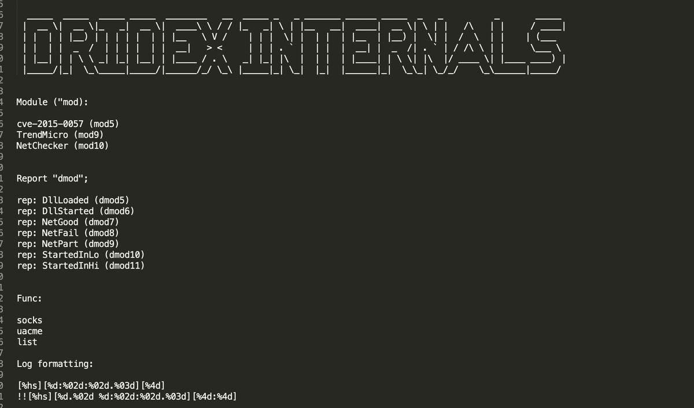

# thezdi
**https://twitter.com/thezdi/status/1310992105628721153 _at 2020-09-29 17:17:29_**
<blockquote>
Two different RCE bugs in #IBM #WebSphere are detailed by @zebasquared in his latest blog. Read the root cause and see video demos of CVE-2020-4464 and -4448 at https://t.co/zxPFGoFlFZ
</blockquote>

* https://bit.ly/33eQK2S

<table><tr>
<td>Quotes: <code>5</code></td>
<td>Replies: <code>1</code></td>
<td>Retweets: <code>110</code></td>
<td>Favorites: <code>204</code></td>
</table></tr>

---

# binitamshah
**https://twitter.com/binitamshah/status/1310950906452758528 _at 2020-09-29 14:33:47_**
<blockquote>
Wireflow : an open-source flowchart real-time collaboration tool : https://t.co/yvLuxwdcS1 credits @entrptaher || @naimur103 https://t.co/09SVp0ZUge
</blockquote>

* https://github.com/vanila-io/wireflow

<table><tr>
<td></td>
</table></tr>
<table><tr>
<td>Quotes: <code>1</code></td>
<td>Replies: <code>1</code></td>
<td>Retweets: <code>33</code></td>
<td>Favorites: <code>110</code></td>
</table></tr>

---

# binitamshah
**https://twitter.com/binitamshah/status/1310943258571427843 _at 2020-09-29 14:03:23_**
<blockquote>
https://t.co/Cj5IdI981S : A collection of TTPs (tools, tactics, and procedures) for what to do after access has been gained : https://t.co/QF8uWWR4RL 

Post Exploitation Collection : https://t.co/y1KYsNbvZK credits @mubix
</blockquote>

* http://PwnWiki.io
* http://pwnwiki.io/#!index.md
* https://github.com/mubix/post-exploitation

<table><tr>
<td>Quotes: <code>1</code></td>
<td>Replies: <code>1</code></td>
<td>Retweets: <code>80</code></td>
<td>Favorites: <code>155</code></td>
</table></tr>

---

# binitamshah
**https://twitter.com/binitamshah/status/1310941655239929858 _at 2020-09-29 13:57:01_**
<blockquote>
duf : Disk Usage/Free Utility (Linux, BSD &amp; macOS) : https://t.co/xciwKrHQqt credits @mueslix https://t.co/9MgWTf52pS
</blockquote>

* https://github.com/muesli/duf

<table><tr>
<td></td>
</table></tr>
<table><tr>
<td>Quotes: <code>0</code></td>
<td>Replies: <code>4</code></td>
<td>Retweets: <code>93</code></td>
<td>Favorites: <code>284</code></td>
</table></tr>

---

# binitamshah
**https://twitter.com/binitamshah/status/1310857007960743936 _at 2020-09-29 08:20:39_**
<blockquote>
Yaya (Yet Another Yara Automaton) : Automatically curate open source yara rules and run scans : https://t.co/NuQpTP29ho 

Details : https://t.co/1PJ66hZqFS
</blockquote>

* https://github.com/EFForg/yaya
* https://www.eff.org/deeplinks/2020/09/introducing-yaya-new-threat-hunting-tool-eff-threat-lab

<table><tr>
<td>Quotes: <code>0</code></td>
<td>Replies: <code>0</code></td>
<td>Retweets: <code>31</code></td>
<td>Favorites: <code>79</code></td>
</table></tr>

---

# binitamshah
**https://twitter.com/binitamshah/status/1310487971347361792 _at 2020-09-28 07:54:14_**
<blockquote>
Artifactory Hacking guide : https://t.co/GoN3ZcQ4gm

Hacking Artifactory with server side template injection : https://t.co/6pCO448ViS
</blockquote>

* https://www.errno.fr/artifactory/Attacking_Artifactory
* https://github.com/gquere/CVE-2020-7931

<table><tr>
<td>Quotes: <code>1</code></td>
<td>Replies: <code>0</code></td>
<td>Retweets: <code>39</code></td>
<td>Favorites: <code>91</code></td>
</table></tr>

---

# GossiTheDog
**https://twitter.com/GossiTheDog/status/1309901911869587463 _at 2020-09-26 17:05:27_**
<blockquote>
I have detected in the wild exploitation of CVE-2020-1472, aka ZeroLogon, in my honeypot.  This is an escalation in the threat landscape, as it allows RCE and credential dumping. https://t.co/yh8tjD3vC7
</blockquote>

* https://doublepulsar.com/in-the-wild-exploitation-of-zerologon-detected-over-the-internet-on-honeypot-f61e2700215b

<table><tr>
<td>Quotes: <code>13</code></td>
<td>Replies: <code>9</code></td>
<td>Retweets: <code>237</code></td>
<td>Favorites: <code>488</code></td>
</table></tr>

---

# sleepya_
**https://twitter.com/sleepya_/status/1309518569277853697 _at 2020-09-25 15:42:11_**
<blockquote>
Exploit writeup of #SIGRed (CVE-2020-1350) #RCE on Windows 2012/2016/2019 https://t.co/fgv5vjul1q
</blockquote>

* https://medium.com/@datafarm.cybersecurity/exploiting-sigred-cve-2020-1350-on-windows-server-2012-2016-2019-80dd88594228

<table><tr>
<td>Quotes: <code>3</code></td>
<td>Replies: <code>4</code></td>
<td>Retweets: <code>132</code></td>
<td>Favorites: <code>236</code></td>
</table></tr>

---

# DanyL931
**https://twitter.com/DanyL931/status/1309158974399356932 _at 2020-09-24 15:53:17_**
<blockquote>
.@pimskeks and I are releasing c0ntextomy, an RCE exploit based on CVE-2020-9992 (patched in iOS 14 and Xcode 12 last week), alongside a writeup and a basic post-exploitation toolkit.

github repo:
https://t.co/uopFh8mdUx

@zLabsProject blog post:
https://t.co/3nJkgEYhig
</blockquote>

* https://github.com/c0ntextomy/c0ntextomy
* https://blog.zimperium.com/c0ntextomy-lets-debug-together-cve-2020-9992/

<table><tr>
<td>Quotes: <code>5</code></td>
<td>Replies: <code>18</code></td>
<td>Retweets: <code>74</code></td>
<td>Favorites: <code>206</code></td>
</table></tr>

---

# SBousseaden
**https://twitter.com/SBousseaden/status/1308683468168146945 _at 2020-09-23 08:23:47_**
<blockquote>
Real Time Detection of User Account Control (UAC) bypass via hijacking The DiskCleanup Scheduled Task

https://t.co/to75sqBfjr

#threathunting #DFIR https://t.co/lZjVDVAiLv
</blockquote>

* https://github.com/elastic/detection-rules/blob/main/rules/windows/privilege_escalation_uac_bypass_diskcleanup_hijack.toml

<table><tr>
<td></td>
<td></td>
</table></tr>
<table><tr>
<td>Quotes: <code>1</code></td>
<td>Replies: <code>2</code></td>
<td>Retweets: <code>72</code></td>
<td>Favorites: <code>163</code></td>
</table></tr>

---

# gweeperx
**https://twitter.com/gweeperx/status/1308320723711275008 _at 2020-09-22 08:22:22_**
<blockquote>
Exploitation of IBM QRadar Wincollect Escalation of Privilege (user-&gt;system via arbitrary delete/CVE-2020-4486) and CVE-2020-4485 .

#IBM #Qradar #WinCollect #0day #RedyOpsLabs #infosec #redteam #blueteam #cybersecurity #CVE #exploit #informationsecurity

https://t.co/cyt8af4UUF
</blockquote>

* https://labs.redyops.com/index.php/2020/09/11/ibm-qradar-wincollect-escalation-of-privileges-cve-2020-4485-cve-2020-4486/

<table><tr>
<td>Quotes: <code>3</code></td>
<td>Replies: <code>1</code></td>
<td>Retweets: <code>94</code></td>
<td>Favorites: <code>151</code></td>
</table></tr>

---

# jq0904
**https://twitter.com/jq0904/status/1307196472597737472 _at 2020-09-19 05:55:00_**
<blockquote>
A few days ago I analyzed an ITW IE JScript UAF 1day exploit, it had been patched in April 2020. I think it might be CVE-2020-0968 and here is a poc of it: https://t.co/gR1rZax6lg
</blockquote>

<table><tr>
<td></td>
</table></tr>
<table><tr>
<td>Quotes: <code>1</code></td>
<td>Replies: <code>1</code></td>
<td>Retweets: <code>44</code></td>
<td>Favorites: <code>138</code></td>
</table></tr>

---

# dozernz
**https://twitter.com/dozernz/status/1306748031648243712 _at 2020-09-18 00:13:03_**
<blockquote>
Wrote up a blog post detailing a pre-auth RCE vulnerability in Aruba Clearpass I found (CVE-2020-7115)

https://t.co/er8x3eYYiU
</blockquote>

* https://dozer.nz/posts/aruba-clearpass-rce

<table><tr>
<td>Quotes: <code>4</code></td>
<td>Replies: <code>4</code></td>
<td>Retweets: <code>74</code></td>
<td>Favorites: <code>162</code></td>
</table></tr>

---

# thezdi
**https://twitter.com/thezdi/status/1306258055378731009 _at 2020-09-16 15:46:04_**
<blockquote>
A new blog from Trend Micro Research details CVE-2020-9496 - Remote code execution in #Apache OFBiz XMLRPC via deserialization of untrusted data https://t.co/wHZCtPPMo1
</blockquote>

* https://bit.ly/35J9Z6b

<table><tr>
<td>Quotes: <code>2</code></td>
<td>Replies: <code>1</code></td>
<td>Retweets: <code>52</code></td>
<td>Favorites: <code>113</code></td>
</table></tr>

---

# gentilkiwi
**https://twitter.com/gentilkiwi/status/1306178689630076929 _at 2020-09-16 10:30:41_**
<blockquote>
A new #mimikatz 🥝release with #zerologon / CVE-2020-1472 detection, exploit, DCSync support and a lots of love inside ❤️

It now uses direct RPC call (fast and supports unauthenticated on Windows)

&gt; https://t.co/Wzb5GAfWfd

Thank you: @SecuraBV https://t.co/s7LRRLPRTP
</blockquote>

* https://github.com/gentilkiwi/mimikatz/releases

<table><tr>
<td></td>
</table></tr>
<table><tr>
<td>Quotes: <code>35</code></td>
<td>Replies: <code>15</code></td>
<td>Retweets: <code>647</code></td>
<td>Favorites: <code>1104</code></td>
</table></tr>

---

# OPOSEC
**https://twitter.com/OPOSEC/status/1305899183283593216 _at 2020-09-15 16:00:02_**
<blockquote>
Cisco Catalyst RCE Proof-Of-Concept (CVE-2017-3881). https://t.co/v3VrHvWEC5 PoC: https://t.co/TrgdBqbeeT #Security #165 (2017)
</blockquote>

* https://artkond.com/2017/04/10/cisco-catalyst-remote-code-execution/
* https://github.com/artkond/cisco-rce/

<table><tr>
<td>Quotes: <code>0</code></td>
<td>Replies: <code>0</code></td>
<td>Retweets: <code>0</code></td>
<td>Favorites: <code>1</code></td>
</table></tr>

---

# campuscodi
**https://twitter.com/campuscodi/status/1305798762623795202 _at 2020-09-15 09:21:00_**
<blockquote>
PoC released for CVE-2020-16875, an RCE in Microsoft Exchange servers, patched last week

https://t.co/OLXCtHd8h7 https://t.co/1B9QVohFxt
</blockquote>

* https://srcincite.io/advisories/src-2020-0019/

<table><tr>
<td></td>
</table></tr>
<table><tr>
<td>Quotes: <code>4</code></td>
<td>Replies: <code>1</code></td>
<td>Retweets: <code>37</code></td>
<td>Favorites: <code>76</code></td>
</table></tr>

---

# yoshiat
**https://twitter.com/yoshiat/status/1305712616732422144 _at 2020-09-15 03:38:41_**
<blockquote>
Hard work gets paid off. #gVisor successfully protected #GKE users from CVE-2020-14386. This is the first case GKE Sandbox after going in production preventing attackers from leveraging a vulnerability in the Linux kernel for container escape to get root privileges. (1/3) https://t.co/Ld2JtG0wZ8
</blockquote>

<table><tr>
<td></td>
</table></tr>
<table><tr>
<td>Quotes: <code>10</code></td>
<td>Replies: <code>3</code></td>
<td>Retweets: <code>112</code></td>
<td>Favorites: <code>391</code></td>
</table></tr>

---

# FragmentedSoul5
**https://twitter.com/FragmentedSoul5/status/1305636723481653248 _at 2020-09-14 22:37:07_**
<blockquote>
#InternetExplorer 11 - Use-After-Free

# Vendor Homepage: Microsoft{.}com
# Version: IE 11 (REQUIRED)
# Tested on: #Windows 7 x64
# CVE : CVE-2020-0674

#Hacking #infosec #Antisec #CyberSecurity #Pentesting #HTML
https://t.co/S3yboFGzXG /exploits/48806
</blockquote>

* https://www.exploit-db.com

<table><tr>
<td>Quotes: <code>0</code></td>
<td>Replies: <code>0</code></td>
<td>Retweets: <code>1</code></td>
<td>Favorites: <code>1</code></td>
</table></tr>

---

# GoogleVRP
**https://twitter.com/GoogleVRP/status/1305594404649021440 _at 2020-09-14 19:48:57_**
<blockquote>
The #GoogleCTF Quals 2020 are open-sourced! https://t.co/vJfDYgsTqs
</blockquote>

* https://github.com/google/google-ctf/tree/master/2020/quals

<table><tr>
<td>Quotes: <code>0</code></td>
<td>Replies: <code>0</code></td>
<td>Retweets: <code>24</code></td>
<td>Favorites: <code>67</code></td>
</table></tr>

---

# _CPResearch_
**https://twitter.com/_CPResearch_/status/1305499777317171201 _at 2020-09-14 13:32:56_**
<blockquote>
[CPR-Zero] CVE-2020-1310 (Windows 8.1/10 Kernel): Use-After-Free in win32k.sys triggered from Desktop Window Manager
https://t.co/obT9tkAclY
</blockquote>

* https://cpr-zero.checkpoint.com/vulns/cprid-2155/

<table><tr>
<td>Quotes: <code>2</code></td>
<td>Replies: <code>0</code></td>
<td>Retweets: <code>63</code></td>
<td>Favorites: <code>120</code></td>
</table></tr>

---

# ptswarm
**https://twitter.com/ptswarm/status/1305479737234599941 _at 2020-09-14 12:13:18_**
<blockquote>
We have reproduced the CVE-2020-1472 #zerologon vulnerability! It's an unauth RCE for Domain Controllers. https://t.co/qFe45O7WPR
</blockquote>

<table><tr>
<td></td>
</table></tr>
<table><tr>
<td>Quotes: <code>13</code></td>
<td>Replies: <code>5</code></td>
<td>Retweets: <code>222</code></td>
<td>Favorites: <code>493</code></td>
</table></tr>

---

# _dirkjan
**https://twitter.com/_dirkjan/status/1305476492386861059 _at 2020-09-14 12:00:25_**
<blockquote>
So yes, Zerologon (CVE-2020-1472) is quite easy to exploit. Unauthenticated user to Domain Admin. This is really scary. Run exploit, DCSync with DC account and empty NT hash: you have Domain Admin and a broken DC.
Awesome find by Tom Tervoort 🙂. Patch patch patch! https://t.co/XHRO7n50Qh
</blockquote>

<table><tr>
<td></td>
</table></tr>
<table><tr>
<td>Quotes: <code>52</code></td>
<td>Replies: <code>23</code></td>
<td>Retweets: <code>956</code></td>
<td>Favorites: <code>1930</code></td>
</table></tr>

---

# cyber_advising
**https://twitter.com/cyber_advising/status/1305284616329232386 _at 2020-09-13 23:17:58_**
<blockquote>
CVE-2020-15505: A remote code execution vulnerability in MobileIron Core and Connector versions 10.6 and earlier, and Sentry versions 9.8 and earlier that allows remote attackers to execute arbitrary code via unspecified vectors.

PoC
https://t.co/YQmOrMu5C9 https://t.co/LYYVjPgjXF
</blockquote>

* https://github.com/iamnoooob/CVE-Reverse/tree/master/CVE-2020-15505

<table><tr>
<td></td>
</table></tr>
<table><tr>
<td>Quotes: <code>1</code></td>
<td>Replies: <code>0</code></td>
<td>Retweets: <code>38</code></td>
<td>Favorites: <code>89</code></td>
</table></tr>

---

# rootxharsh
**https://twitter.com/rootxharsh/status/1305210356747235328 _at 2020-09-13 18:22:53_**
<blockquote>
Sat down with @iamnoooob and worked on the recent Mobileiron MDM RCE by @orange_8361 and what a great find, Here's an RCE PoC using JNDI Injection via local classloading reference triggered using Hessian deserialization as stated in the blog.

https://t.co/dRNP5HW1L4 https://t.co/5HCjMD1ouR
</blockquote>

* https://github.com/iamnoooob/CVE-Reverse

<table><tr>
<td></td>
</table></tr>
<table><tr>
<td>Quotes: <code>5</code></td>
<td>Replies: <code>19</code></td>
<td>Retweets: <code>293</code></td>
<td>Favorites: <code>863</code></td>
</table></tr>

---

# TheHackersNews
**https://twitter.com/TheHackersNews/status/1305185204198277120 _at 2020-09-13 16:42:56_**
<blockquote>
Here's a PoC for the recently patched Microsoft Exchange Server remote code execution vulnerability (CVE-2020-16875).

CVSS Score: 8.4
</blockquote>

<table><tr>
<td>Quotes: <code>3</code></td>
<td>Replies: <code>1</code></td>
<td>Retweets: <code>61</code></td>
<td>Favorites: <code>105</code></td>
</table></tr>

---

# cyber_advising
**https://twitter.com/cyber_advising/status/1305146341992140803 _at 2020-09-13 14:08:31_**
<blockquote>
CVE-2020-16875: Microsoft Exchange Server DlpUtils AddTenantDlpPolicy Remote Code Execution Vulnerability

PoC
https://t.co/yjvJlbmchI https://t.co/V4HbRHEmZY
</blockquote>

* https://srcincite.io/pocs/cve-2020-16875.py.txt

<table><tr>
<td></td>
</table></tr>
<table><tr>
<td>Quotes: <code>2</code></td>
<td>Replies: <code>0</code></td>
<td>Retweets: <code>50</code></td>
<td>Favorites: <code>108</code></td>
</table></tr>

---

# bad_packets
**https://twitter.com/bad_packets/status/1304848932334305281 _at 2020-09-12 18:26:43_**
<blockquote>
Active #DDoS malware payload detected:
http://27.6.200.234:33258/Mozi.m 

VirusTotal URL detections: 0/79 (https://t.co/4V8jKoSFLL)

Exploit attempt source IP: 27.6.200.234 (🇮🇳)

Target: Huawei router RCE vulnerability CVE-2017-17215 (https://t.co/ZRIgVjv1yq) #threatintel https://t.co/dngfIU362X
</blockquote>

* https://www.virustotal.com/gui/url/26d5a4518ff448a8ff480612c1dbf781d29461e5707e278b69ad3a6eb9d1f601/detection
* https://nvd.nist.gov/vuln/detail/CVE-2017-17215

<table><tr>
<td></td>
<td></td>
</table></tr>
<table><tr>
<td>Quotes: <code>1</code></td>
<td>Replies: <code>0</code></td>
<td>Retweets: <code>20</code></td>
<td>Favorites: <code>45</code></td>
</table></tr>

---

# GossiTheDog
**https://twitter.com/GossiTheDog/status/1304415569228300291 _at 2020-09-11 13:44:41_**
<blockquote>
A reminder to all organisations that they should ensure they patched CVE-2020-1472 (a Netlogon vulnerability from August 2020 Windows patch set) on all domain controllers.
</blockquote>

<table><tr>
<td>Quotes: <code>7</code></td>
<td>Replies: <code>5</code></td>
<td>Retweets: <code>115</code></td>
<td>Favorites: <code>221</code></td>
</table></tr>

---

# djrevmoon
**https://twitter.com/djrevmoon/status/1304396680654204930 _at 2020-09-11 12:29:37_**
<blockquote>
We just published a test tool for CVE-2020-1472 (CVSS:10) https://t.co/v18EnF7Xob and next Monday we will publish a whitepaper about this interesting and unique vulnerability. See also https://t.co/cfUEzZdJfV
</blockquote>

* https://github.com/SecuraBV/CVE-2020-1472/
* https://www.secura.com/blog/zero-logon

<table><tr>
<td>Quotes: <code>12</code></td>
<td>Replies: <code>3</code></td>
<td>Retweets: <code>177</code></td>
<td>Favorites: <code>351</code></td>
</table></tr>

---

# reverseame
**https://twitter.com/reverseame/status/1304301839442227201 _at 2020-09-11 06:12:45_**
<blockquote>
CVE-2020-1571 Windows Setup Elevation of Privileges Bypass 0day https://t.co/bLpWzsu6PK
</blockquote>

* https://github.com/klinix5/Windows-Setup-EoP

<table><tr>
<td>Quotes: <code>0</code></td>
<td>Replies: <code>0</code></td>
<td>Retweets: <code>2</code></td>
<td>Favorites: <code>1</code></td>
</table></tr>

---

# ptracesecurity
**https://twitter.com/ptracesecurity/status/1304299580117442561 _at 2020-09-11 06:03:47_**
<blockquote>
CVE-2020-8150 – Remote Code Execution as SYSTEM/root via Backblaze  https://t.co/TIM3dXQ0mG  #Pentesting #RCE #CVE #Vulnerability #Infosec https://t.co/jxt2oxiPvc
</blockquote>

* https://github.com/geffner/CVE-2020-8150

<table><tr>
<td></td>
<td></td>
</table></tr>
<table><tr>
<td>Quotes: <code>0</code></td>
<td>Replies: <code>0</code></td>
<td>Retweets: <code>5</code></td>
<td>Favorites: <code>13</code></td>
</table></tr>

---

# steventseeley
**https://twitter.com/steventseeley/status/1304095793809371137 _at 2020-09-10 16:34:00_**
<blockquote>
Microsoft Exchange Server DlpUtils AddTenantDlpPolicy Remote Code Execution Vulnerability (CVE-2020-16875)

Advisory: https://t.co/UvvCkGGOEA
poc (http): https://t.co/mGah1PBcAM
poc (ps-remoting): https://t.co/ziVbNP3jXN
</blockquote>

* https://srcincite.io/advisories/src-2020-0019/
* https://srcincite.io/pocs/cve-2020-16875.py.txt
* https://srcincite.io/pocs/cve-2020-16875.ps1.txt

<table><tr>
<td>Quotes: <code>8</code></td>
<td>Replies: <code>8</code></td>
<td>Retweets: <code>219</code></td>
<td>Favorites: <code>366</code></td>
</table></tr>

---

# kmkz_security
**https://twitter.com/kmkz_security/status/1303956979967299585 _at 2020-09-10 07:22:25_**
<blockquote>
F5 Big-IP RCE writeup + full exploit https://t.co/mosecvS59p
Exploit: https://t.co/tgPRb3GKeZ
</blockquote>

* https://www.criticalstart.com/f5-big-ip-remote-code-execution-exploit/
* https://github.com/Critical-Start/Team-Ares/tree/master/CVE-2020-5902

<table><tr>
<td>Quotes: <code>0</code></td>
<td>Replies: <code>2</code></td>
<td>Retweets: <code>205</code></td>
<td>Favorites: <code>362</code></td>
</table></tr>

---

# ptswarm
**https://twitter.com/ptswarm/status/1303734833273884685 _at 2020-09-09 16:39:41_**
<blockquote>
A swarm of Palo Alto PAN-OS CVE-s is here:

1⃣ Post-Auth RCE (CVE-2020-2037)
2⃣ Post-Auth RCE (CVE-2020-2038)
3⃣ Unauth DoS (CVE-2020-2039)
4⃣ Cross-Site Scripting (CVE-2020-2036)

Attributed to: Mikhail Klyuchnikov &amp; Nikita Abramov

Advisory: https://t.co/195rPrGvlY https://t.co/6WxGHVP7fB
</blockquote>

* https://security.paloaltonetworks.com/?q=2020-09-09

<table><tr>
<td></td>
</table></tr>
<table><tr>
<td>Quotes: <code>7</code></td>
<td>Replies: <code>0</code></td>
<td>Retweets: <code>153</code></td>
<td>Favorites: <code>267</code></td>
</table></tr>

---

# JasonGeffner
**https://twitter.com/JasonGeffner/status/1303707439498436608 _at 2020-09-09 14:50:49_**
<blockquote>
CVE-2020-8150 – Remote Code Execution as SYSTEM/root via Backblaze

https://t.co/EL9EDkyrVc

Full vulnerability details (including PoC) at https://t.co/WHwNlV3xZ4
</blockquote>

* https://youtu.be/W0THXbcX5V8
* https://github.com/geffner/CVE-2020-8150/blob/master/README.md

<table><tr>
<td>Quotes: <code>2</code></td>
<td>Replies: <code>2</code></td>
<td>Retweets: <code>4</code></td>
<td>Favorites: <code>21</code></td>
</table></tr>

---

# steventseeley
**https://twitter.com/steventseeley/status/1303454166820556800 _at 2020-09-08 22:04:25_**
<blockquote>
So CVE-2020-1523 and CVE-2020-1440 are actually powerful SSRF bugs and not just result in "tampering". Likewise CVE-2020-16875 is certainly NOT a memory corruption and I have a full working RCE exploit.

https://t.co/sAcdmv1QqD
https://t.co/h2f0ZcaHV6
https://t.co/JHegDlI9pW
</blockquote>

* https://portal.msrc.microsoft.com/en-us/security-guidance/advisory/CVE-2020-1523
* https://portal.msrc.microsoft.com/en-us/security-guidance/advisory/CVE-2020-1440
* https://portal.msrc.microsoft.com/en-us/security-guidance/advisory/CVE-2020-16875

<table><tr>
<td>Quotes: <code>6</code></td>
<td>Replies: <code>7</code></td>
<td>Retweets: <code>76</code></td>
<td>Favorites: <code>255</code></td>
</table></tr>

---

# _Icewall
**https://twitter.com/_Icewall/status/1303431585878941697 _at 2020-09-08 20:34:41_**
<blockquote>
My feed for this patch Tuesday:

CVE-2020-1115 - Microsoft Windows 10 CLFS.sys ValidateRegionBlocks privilege escalation vulnerability

Advisory : https://t.co/GNDF4Uh67P
</blockquote>

* https://talosintelligence.com/vulnerability_reports/TALOS-2020-1098

<table><tr>
<td>Quotes: <code>1</code></td>
<td>Replies: <code>0</code></td>
<td>Retweets: <code>29</code></td>
<td>Favorites: <code>70</code></td>
</table></tr>

---

# _r_netsec
**https://twitter.com/_r_netsec/status/1303426162429890560 _at 2020-09-08 20:13:08_**
<blockquote>
CVE-2020-1013: Windows Local Privilege Escalation (LPE) with PoC https://t.co/sJNcpiqT4i
</blockquote>

* https://www.gosecure.net/blog/2020/09/08/wsus-attacks-part-2-cve-2020-1013-a-windows-10-local-privilege-escalation-1-day/

<table><tr>
<td>Quotes: <code>1</code></td>
<td>Replies: <code>0</code></td>
<td>Retweets: <code>38</code></td>
<td>Favorites: <code>58</code></td>
</table></tr>

---

# hosselot
**https://twitter.com/hosselot/status/1303398192793477124 _at 2020-09-08 18:21:59_**
<blockquote>
4 more RCE Vulnerabilities in Microsoft September patch Tuesday:

Windows Camera Codec Pack:
CVE-2020-0997

Windows Codecs Library:
CVE-2020-1129

Jet Database Engine:
CVE-2020-1039
CVE-2020-1074
</blockquote>

<table><tr>
<td>Quotes: <code>1</code></td>
<td>Replies: <code>1</code></td>
<td>Retweets: <code>7</code></td>
<td>Favorites: <code>81</code></td>
</table></tr>

---

# VK_Intel
**https://twitter.com/VK_Intel/status/1303394577177620485 _at 2020-09-08 18:07:37_**
<blockquote>
2020-09-08:🔥👿#Dridex Loader Discovery🏦
Internals -&gt; ASLR

⚙️Module ("mod-*"):
🧨[*] "cve-2015-0057 (mod5)"
🦠[*] "TrendMicro (mod9)"
🥅[*] "NetChecker (mod10)"

"uacme" Reference as UAC bypass | +socks ApLib

Logging Path:
C:\0\ACTION.log

+"dmod" report
h/t @James_inthe_box https://t.co/cvIOoX12ZP
</blockquote>

<table><tr>
<td></td>
<td></td>
</table></tr>
<table><tr>
<td>Quotes: <code>1</code></td>
<td>Replies: <code>2</code></td>
<td>Retweets: <code>29</code></td>
<td>Favorites: <code>60</code></td>
</table></tr>

---

# kmkz_security
**https://twitter.com/kmkz_security/status/1303242252827987970 _at 2020-09-08 08:02:20_**
<blockquote>
CVE-2019-1458 LPE PoC + full writeup with a very interesting patch diffing approach 👌 https://t.co/QyRvp17zMU
</blockquote>

* https://github.com/piotrflorczyk/cve-2019-1458_POC

<table><tr>
<td>Quotes: <code>2</code></td>
<td>Replies: <code>0</code></td>
<td>Retweets: <code>51</code></td>
<td>Favorites: <code>126</code></td>
</table></tr>

---

# wugeej
**https://twitter.com/wugeej/status/1301021388455596032 _at 2020-09-02 04:57:25_**
<blockquote>
RCE in Pulse Connect Secure SSL VPN (CVE-2020-8218) 

[Proof Of Concept]
/dana-admin/license/downloadlicenses.cgi?cmd=download&amp;txtVLSAuthCode=whatever -n '($x="ls /",system$x); #' -e /data/runtime/tmp/tt/setcookie.thtml.ttc

https://t.co/XhlYdrrWqB https://t.co/C4mjbngIq0
</blockquote>

* https://github.com/withdk/pulse-gosecure-rce-poc/blob/master/pulse-gosecure-rce.py

<table><tr>
<td></td>
</table></tr>
<table><tr>
<td>Quotes: <code>3</code></td>
<td>Replies: <code>2</code></td>
<td>Retweets: <code>134</code></td>
<td>Favorites: <code>311</code></td>
</table></tr>

---

# wugeej
**https://twitter.com/wugeej/status/1300978679518867457 _at 2020-09-02 02:07:42_**
<blockquote>
CVE-2019-17026 (Firefox JIT bug) 

No sandbox escape included

Proof of Concept
https://t.co/nmV6FS1tJD https://t.co/RCIS4SYHTh
</blockquote>

* https://github.com/maxpl0it/CVE-2019-17026-Exploit/blob/master/calc.html

<table><tr>
<td></td>
</table></tr>
<table><tr>
<td>Quotes: <code>1</code></td>
<td>Replies: <code>0</code></td>
<td>Retweets: <code>14</code></td>
<td>Favorites: <code>39</code></td>
</table></tr>

---

# binitamshah
**https://twitter.com/binitamshah/status/1300671750636666881 _at 2020-09-01 05:48:05_**
<blockquote>
Quark-Engine : An Obfuscation-Neglect Android Malware Scoring System : https://t.co/CKx4L8nqoy  credits @JunWei__Song

Talk at Defcon : https://t.co/PkMzKSfNJm
</blockquote>

* https://github.com/quark-engine/quark-engine
* https://www.youtube.com/watch?v=3yFhNG2LN44

<table><tr>
<td>Quotes: <code>2</code></td>
<td>Replies: <code>1</code></td>
<td>Retweets: <code>30</code></td>
<td>Favorites: <code>62</code></td>
</table></tr>

---

